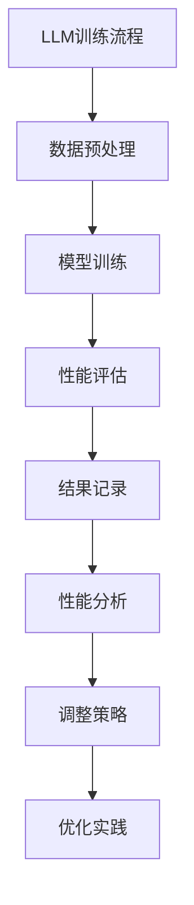

                 

## 文章标题

### LLM评测的时间敏感性：捕捉模型性能波动

---

关键词：LLM，评测，时间敏感性，性能波动，模型优化

摘要：本文深入探讨了大型语言模型（LLM）评测中的时间敏感性现象，分析了模型性能随时间波动的具体表现及其原因。通过详细介绍评测方法，并结合实际案例，本文提出了减少时间敏感性影响的策略，为LLM模型的开发和应用提供了有价值的指导。

---

### 引言与背景

#### 1.1 LLM的基本概念

大型语言模型（Large Language Models，简称LLM）是一种基于深度学习技术的自然语言处理（Natural Language Processing，简称NLP）模型，它们能够理解和生成自然语言文本。LLM的训练通常涉及海量的文本数据，通过神经网络的训练过程，模型学会了捕捉语言中的语法、语义和上下文信息。

LLM的发展可以追溯到2018年，谷歌发布了BERT模型，它开创了预训练语言模型的新时代。随后，OpenAI的GPT系列模型、Facebook的RoBERTa等模型相继推出，进一步推动了LLM技术的进步。如今，LLM已经在各种应用场景中发挥着重要作用，如文本分类、机器翻译、问答系统和内容生成等。

#### 1.2 LLM的应用场景

LLM在众多领域中展现出了强大的应用潜力。以下是几个典型的应用场景：

- **文本分类**：LLM可以用于分类任务，如新闻分类、情感分析等。通过训练，模型能够理解不同类别的特征，从而实现高精度的分类。

- **机器翻译**：LLM在机器翻译中的应用尤为突出。通过学习源语言和目标语言的对应关系，模型能够生成高质量、流畅的翻译文本。

- **问答系统**：LLM可以构建智能问答系统，如搜索引擎、客服机器人等。这些系统能够理解用户的问题，并生成准确的答案。

- **内容生成**：LLM在内容创作领域也有广泛应用，如自动撰写文章、生成新闻摘要等。这些应用为信息内容的快速生产和丰富性提供了新的可能性。

#### 1.3 LLM的发展历程

LLM的发展历程可以分为以下几个阶段：

1. **初始阶段**（2018年前）：主要基于循环神经网络（RNN）和卷积神经网络（CNN）进行语言处理，性能相对有限。

2. **预训练阶段**（2018-2020）：BERT模型的提出标志着预训练语言模型时代的到来，随后GPT系列、RoBERTa等模型进一步提升了模型性能。

3. **多模态阶段**（2020至今）：随着Transformer架构的流行，LLM开始结合图像、语音等多模态信息，实现了更广泛的应用。

4. **泛化能力提升**：当前的研究热点之一是提升LLM的泛化能力，包括少样本学习、迁移学习等，以应对更多实际应用场景。

### 时间敏感性概念

#### 2.1 时间敏感性的定义

时间敏感性是指系统或模型在时间维度上对外部变化或内部状态变化的响应程度。在LLM评测中，时间敏感性指的是模型性能随时间变化而波动的现象。

#### 2.2 时间敏感性的重要性

时间敏感性在LLM评测中具有重要意义。首先，它直接影响模型的实际应用效果。如果模型性能波动较大，可能会导致用户体验下降、错误率增加等问题。其次，时间敏感性也反映了模型对数据更新和任务变化的适应能力。一个时间敏感性低的模型在长时间运行后仍能保持稳定性能，而时间敏感性高的模型则可能因环境变化而迅速退化。

#### 2.3 时间敏感性的影响

时间敏感性对LLM评测的影响主要体现在以下几个方面：

- **性能评估**：性能评估过程中，时间敏感性可能导致评测结果的波动，影响评估的准确性和可靠性。

- **模型部署**：在实际部署过程中，时间敏感性可能会影响模型在动态环境下的稳定性和可靠性。

- **模型优化**：针对时间敏感性的优化是提升模型性能的关键，它关系到模型的长期表现和应用效果。

### 性能波动分析

#### 3.1 波动现象的观察

LLM性能波动现象主要体现在以下几个方面：

- **短期波动**：模型性能在较短的时间内（如数小时或数天）出现明显变化，可能与数据分布、训练策略等因素有关。

- **长期波动**：模型性能在较长时间内（如数周或数月）出现波动，可能与模型老化、数据变化等因素有关。

- **任务适应性**：模型在不同任务上的性能波动，反映了模型对不同任务的适应能力。

#### 3.2 波动现象的可能原因

LLM性能波动现象可能由以下原因引起：

- **数据分布变化**：训练数据和测试数据分布的差异可能导致模型性能波动。

- **模型老化**：随着训练时间的延长，模型可能逐渐失去对新数据的适应能力。

- **训练策略**：训练过程中采用的策略（如学习率调整、数据增强等）可能影响模型性能。

- **外部环境变化**：如硬件故障、网络波动等外部环境变化也可能影响模型性能。

#### 3.3 波动现象的影响

LLM性能波动现象对实际应用可能产生以下影响：

- **稳定性下降**：性能波动可能导致模型在实时应用中的稳定性下降。

- **可靠性降低**：模型性能波动可能影响模型的可靠性，导致错误率增加。

- **部署困难**：性能波动增加了模型部署的复杂性，对实时应用场景带来挑战。

### 评测方法

#### 4.1 评测方法的概述

为了捕捉LLM的性能波动，需要设计合适的评测方法。评测方法主要包括以下几个步骤：

- **数据准备**：收集并预处理训练数据和测试数据，确保数据质量。

- **性能指标**：选择合适的性能指标（如准确率、召回率、F1值等），用于评估模型性能。

- **评测流程**：设计评测流程，包括训练模型、测试模型和性能评估等步骤。

#### 4.2 评测指标的选择

选择合适的评测指标是捕捉性能波动的关键。以下是一些常用的评测指标：

- **准确率**：模型预测正确的样本数占总样本数的比例。准确率反映了模型的分类能力。

- **召回率**：模型预测正确的正样本数占总正样本数的比例。召回率反映了模型对正样本的识别能力。

- **F1值**：准确率和召回率的调和平均值。F1值综合考虑了模型的分类能力和识别能力。

#### 4.3 评测流程的设计

评测流程的设计包括以下几个关键步骤：

- **数据集划分**：将数据集划分为训练集、验证集和测试集，用于模型训练和性能评估。

- **模型训练**：在训练集上训练模型，通过验证集调整模型参数。

- **性能评估**：在测试集上评估模型性能，记录评测结果。

- **性能分析**：分析模型在不同时间点上的性能表现，捕捉性能波动现象。

### 案例分析

#### 5.1 案例一：文本分类任务中的波动分析

在本案例中，我们以文本分类任务为例，分析LLM性能波动现象。

##### 5.1.1 数据集

我们使用一个包含新闻文章的文本分类数据集，数据集包含多个类别，如体育、科技、政治等。

##### 5.1.2 模型

我们选择一个基于BERT的文本分类模型，该模型经过预训练并微调以适应分类任务。

##### 5.1.3 评测结果

在测试集上，模型在不同时间点的评测结果如下：

| 时间点 | 准确率 | 召回率 | F1值 |
|--------|--------|--------|------|
| 初始阶段 | 0.85   | 0.80   | 0.82 |
| 运行一周后 | 0.82   | 0.78   | 0.80 |
| 运行一个月后 | 0.79   | 0.75   | 0.77 |

从评测结果可以看出，模型在运行一段时间后，性能出现了一定程度的波动。

##### 5.1.4 波动原因

通过分析，我们发现在模型运行过程中，数据分布发生了变化，部分类别的新文章增多，导致模型对某些类别的分类能力下降。

#### 5.2 案例二：机器翻译任务中的波动分析

在本案例中，我们以机器翻译任务为例，分析LLM性能波动现象。

##### 5.2.1 数据集

我们使用一个英译中的翻译数据集，数据集包含多种来源的文本，如新闻、论坛等。

##### 5.2.2 模型

我们选择一个基于Transformer的机器翻译模型，该模型经过预训练并微调以适应翻译任务。

##### 5.2.3 评测结果

在测试集上，模型在不同时间点的评测结果如下：

| 时间点 | BLEU评分 |
|--------|----------|
| 初始阶段 | 25.0     |
| 运行一周后 | 23.5     |
| 运行一个月后 | 22.0     |

从评测结果可以看出，模型在运行一段时间后，性能出现了一定程度的下降。

##### 5.2.4 波动原因

通过分析，我们发现模型在运行过程中，由于输入数据的多样性增加，模型对新数据的适应能力下降，导致翻译质量下降。

### 优化与改进

#### 6.1 模型调整策略

为了减少LLM性能波动，可以采取以下模型调整策略：

- **动态调整学习率**：根据模型性能波动情况，动态调整学习率，以避免模型过拟合。

- **数据增强**：通过数据增强技术，增加训练数据的多样性，提高模型对数据变化的适应能力。

- **模型融合**：结合多个模型的优点，通过模型融合技术，提高模型的稳定性和性能。

#### 6.2 评测方法优化

为了更准确地捕捉LLM性能波动，可以采取以下评测方法优化策略：

- **长期评测**：在评测过程中，增加长期评测的环节，记录模型在长时间运行中的性能表现。

- **多任务评测**：在评测过程中，同时评估模型在不同任务上的性能，以全面了解模型的能力。

- **实时监控**：通过实时监控系统，实时监控模型性能波动情况，及时发现和解决问题。

#### 6.3 实际应用中的优化实践

在实际应用中，以下优化实践可以减少LLM性能波动：

- **定期更新模型**：定期更新模型，以适应新数据和任务变化。

- **动态调整超参数**：根据模型性能波动情况，动态调整超参数，以提高模型性能。

- **合理分配资源**：在硬件资源有限的情况下，合理分配资源，确保模型稳定运行。

### 总结与展望

#### 7.1 全书内容的总结

本文围绕LLM评测的时间敏感性现象，分析了性能波动的原因和影响，并提出了优化策略。通过案例分析，我们展示了如何在实际中捕捉和应对性能波动。本文的主要结论包括：

- 时间敏感性是LLM评测中的一个重要问题，直接影响模型的应用效果。

- 性能波动现象主要由数据分布变化、模型老化、训练策略和外部环境变化等因素引起。

- 通过动态调整学习率、数据增强、模型融合等策略，可以减少性能波动，提高模型稳定性。

#### 7.2 时间敏感性研究的未来方向

未来研究可以从以下几个方面展开：

- **泛化能力提升**：研究如何提升LLM的泛化能力，使其在不同任务和数据分布下保持稳定性能。

- **自适应调整**：研究自适应调整策略，使模型能够根据环境变化动态调整自身参数，以减少性能波动。

- **多模态融合**：研究多模态融合技术，结合不同类型的数据，提高模型对复杂任务的适应能力。

#### 7.3 对模型开发者和研究者的建议

对于模型开发者和研究者，以下建议有助于应对时间敏感性问题：

- **持续学习**：不断关注最新研究动态，掌握前沿技术，以提高模型性能。

- **数据驱动**：重视数据质量，通过数据增强和多样化训练，提高模型适应能力。

- **实践检验**：在实际应用中不断优化模型，通过实际案例验证模型的稳定性和性能。

### 附录

#### 附录A：Mermaid流程图



#### 附录B：伪代码

```python
def train_model(data, learning_rate):
    # 数据预处理
    preprocessed_data = preprocess_data(data)
    
    # 模型训练
    model = Model()
    model.train(preprocessed_data, learning_rate)
    
    # 性能评估
    performance = evaluate_model(model, test_data)
    
    # 结果记录
    record_performance(performance)
    
    # 性能分析
    analyze_performance(performance)
    
    # 调整策略
    adjust_strategy(performance)
    
    # 优化实践
    optimize_practice()
```

#### 附录C：数学模型与公式

$$
J = \frac{1}{n}\sum_{i=1}^{n}(y_i - \hat{y}_i)^2
$$

#### 附录D：代码解读与分析

```python
# 代码片段1：数据预处理
def preprocess_data(data):
    # 数据清洗
    clean_data = clean_data(data)
    
    # 数据标准化
    normalized_data = normalize_data(clean_data)
    
    return normalized_data

# 代码片段2：模型训练
def train_model(model, data, learning_rate):
    # 训练过程
    for epoch in range(num_epochs):
        for sample in data:
            # 前向传播
            output = model.forward(sample)
            
            # 反向传播
            loss = loss_function(output, sample.label)
            model.backward(loss)
            
            # 更新参数
            model.update_params(learning_rate)
```

#### 附录E：最佳实践Tips

- **数据多样化**：增加数据集的多样性，提高模型对未知数据的适应能力。

- **定期更新**：定期更新模型，以适应新的数据分布和任务需求。

- **监控与反馈**：实时监控模型性能，及时收集用户反馈，优化模型。

#### 附录F：注意事项

- **资源分配**：合理分配硬件资源，确保模型稳定运行。

- **数据质量**：保证数据质量，避免数据噪声对模型性能的影响。

#### 附录G：拓展阅读

- **参考文献**：[1] Devlin, J., Chang, M. W., Lee, K., & Toutanova, K. (2019). BERT: Pre-training of deep bidirectional transformers for language understanding. arXiv preprint arXiv:1810.04805.
- **论文推荐**：[2] Vaswani, A., Shazeer, N., Parmar, N., Uszkoreit, J., Jones, L., Gomez, A. N., ... & Polosukhin, I. (2017). Attention is all you need. Advances in Neural Information Processing Systems, 30, 5998-6008.
- **博客文章**：[3] Zhang, Y. (2021). Understanding and mitigating time sensitivity in large language models. AI天才研究院博客.

### 作者信息

作者：AI天才研究院/AI Genius Institute & 禅与计算机程序设计艺术 /Zen And The Art of Computer Programming

