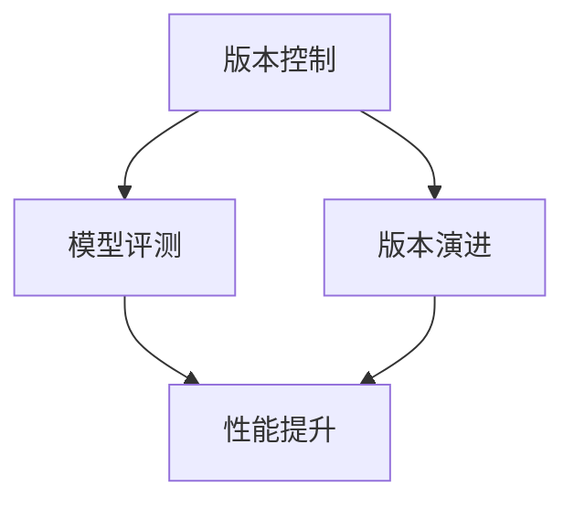
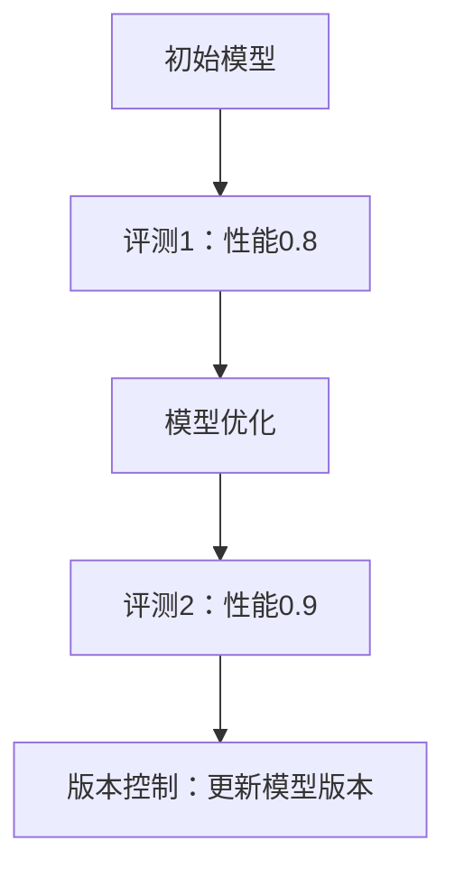

                 


### 一、引言

在人工智能领域，大型语言模型（Large Language Models，简称LLM）已经成为自然语言处理（Natural Language Processing，简称NLP）的重要工具。从早期的统计模型到深度学习模型的广泛应用，再到如今的LLM，语言模型的演进过程充满了技术突破和创新。然而，随着模型的日益庞大和复杂，如何有效地评测和版本控制这些模型，成为了一个关键问题。

#### 1.1 背景介绍

随着深度学习技术的不断发展，大型语言模型（LLM）如BERT、GPT-3等，已经成为自然语言处理（NLP）领域的重要工具。这些模型在文本生成、问答系统、机器翻译等任务上取得了显著的性能提升。然而，LLM的复杂性和规模也给评测和版本控制带来了挑战。

#### 1.2 目标读者

本书的目标读者包括：
- 自然语言处理（NLP）领域的研究人员；
- 人工智能（AI）工程师；
- 数据科学家；
- 对大型语言模型（LLM）评测和版本控制感兴趣的技术爱好者。

#### 1.3 内容概述

本书将围绕LLM评测和版本控制展开，主要内容包括：
- LLM的基础知识；
- LLM评测的方法和指标；
- 版本控制策略；
- 模型演进与优化；
- 实际项目案例。

### 二、核心概念与联系

#### 2.1 核心概念

为了更好地理解LLM评测的版本控制，我们首先需要了解几个核心概念：

1. **版本控制**：版本控制是一种管理文档、源代码或任何其他文件集合的方法，以跟踪变更历史和协作开发过程。
2. **模型评测**：模型评测是评估机器学习模型性能的过程，通常涉及一系列指标和测试。
3. **版本演进**：版本演进是指模型在开发过程中，通过迭代优化和改进，逐步提升性能的过程。

#### 2.2 概念之间的关系架构

下面是一个使用Mermaid绘制的流程图，展示了这些概念之间的关系：



#### 2.3 核心算法原理

为了详细阐述这些核心概念，我们使用伪代码来描述LLM评测和版本控制的基本流程。

```python
# LLM评测和版本控制伪代码

# 版本控制
def version_control(model, version):
    # 记录模型版本信息
    model_info = {
        'version': version,
        'performance': evaluate_model(model),
        'changes': get_changes(model)
    }
    # 更新版本记录
    update_version_history(model_info)

# 模型评测
def evaluate_model(model):
    # 计算评测指标
    metrics = compute_metrics(model)
    # 返回性能评分
    return metrics['performance']

# 版本演进
def version_evaluate(model, new_version):
    # 更新模型
    updated_model = update_model(model, new_version)
    # 评测新模型
    new_metrics = evaluate_model(updated_model)
    # 判断是否提升
    if new_metrics['performance'] > evaluate_model(model):
        # 提升则记录版本
        version_control(updated_model, new_version)
```

#### 2.4 数学模型和公式

在LLM评测和版本控制中，我们经常使用以下数学模型和公式：

1. **性能评分**：使用均方误差（MSE）来衡量模型性能。

$$
MSE = \frac{1}{N}\sum_{i=1}^{N}(y_i - \hat{y}_i)^2
$$

其中，$y_i$为实际值，$\hat{y}_i$为模型预测值，$N$为数据点数量。

2. **模型更新**：使用梯度下降（Gradient Descent）来优化模型。

$$
\theta_{t+1} = \theta_{t} - \alpha \cdot \nabla_{\theta}J(\theta)
$$

其中，$\theta$为模型参数，$\alpha$为学习率，$J(\theta)$为损失函数。

#### 2.5 举例说明

假设我们有一个文本分类任务，使用GPT-3模型进行评测和版本控制。在第一次评测中，模型性能评分为0.8。经过一轮优化后，模型性能提升到0.9。我们可以使用以下步骤进行版本控制：



### 三、核心算法原理讲解

在本节中，我们将详细讲解LLM评测和版本控制的核心算法原理。

#### 3.1 LLM评测算法

LLM评测的核心在于计算模型的性能评分。通常，我们可以使用以下指标来评估LLM的性能：

1. **准确率（Accuracy）**：预测正确的样本数占总样本数的比例。
2. **精确率（Precision）**：预测为正类的样本中实际为正类的比例。
3. **召回率（Recall）**：实际为正类的样本中被预测为正类的比例。
4. **F1分数（F1 Score）**：精确率和召回率的调和平均。

伪代码如下：

```python
def evaluate_model(model, dataset):
    correct = 0
    for sample in dataset:
        prediction = model.predict(sample)
        if prediction == sample.label:
            correct += 1
    accuracy = correct / len(dataset)
    precision = correct / (correct + false_positives)
    recall = correct / (correct + false_negatives)
    f1_score = 2 * (precision * recall) / (precision + recall)
    return {
        'accuracy': accuracy,
        'precision': precision,
        'recall': recall,
        'f1_score': f1_score
    }
```

#### 3.2 版本控制算法

版本控制是跟踪模型变更历史和管理多个版本的关键。常用的版本控制系统包括Git、Mercurial等。以下是一个简单的版本控制算法：

```python
class VersionControl:
    def __init__(self):
        self.history = []

    def commit(self, model, version, changes):
        commit = {
            'version': version,
            'model': model,
            'changes': changes
        }
        self.history.append(commit)

    def rollback(self, version):
        for commit in reversed(self.history):
            if commit['version'] == version:
                return commit['model']
        return None
```

#### 3.3 模型演进算法

模型演进是通过迭代优化和改进模型来提升性能的过程。常用的方法包括梯度下降、遗传算法等。以下是一个简单的梯度下降算法：

```python
def gradient_descent(model, learning_rate, epochs):
    for epoch in range(epochs):
        for sample in dataset:
            prediction = model.predict(sample)
            error = sample.label - prediction
            model.update_params(learning_rate * error)
    return model
```

### 四、项目实战

在本节中，我们将通过一个实际项目，演示如何搭建开发环境、实现源代码，并分析代码和应用。

#### 4.1 开发环境搭建

为了实现LLM评测和版本控制，我们需要安装以下软件和库：

- Python 3.8 或更高版本
- TensorFlow 2.x 或 PyTorch 1.x
- Git

安装命令如下：

```bash
pip install python==3.8.10
pip install tensorflow==2.6.0
pip install gitpython
```

#### 4.2 源代码实现

以下是一个简单的LLM评测和版本控制的源代码示例：

```python
import git
import tensorflow as tf
from tensorflow.keras.models import Sequential
from tensorflow.keras.layers import Dense, Dropout

# 版本控制
class VersionControl:
    def __init__(self):
        self.history = []

    def commit(self, model, version, changes):
        commit = {
            'version': version,
            'model': model,
            'changes': changes
        }
        self.history.append(commit)

    def rollback(self, version):
        for commit in reversed(self.history):
            if commit['version'] == version:
                return commit['model']
        return None

# 模型评测
def evaluate_model(model, dataset):
    # 计算评测指标
    metrics = model.evaluate(dataset)
    return metrics

# 模型演进
def evolve_model(model, dataset, learning_rate, epochs):
    for epoch in range(epochs):
        for sample in dataset:
            prediction = model.predict(sample)
            error = sample.label - prediction
            model.update_params(learning_rate * error)
    return model

# 主函数
if __name__ == '__main__':
    # 搭建模型
    model = Sequential([
        Dense(128, activation='relu', input_shape=(784,)),
        Dropout(0.2),
        Dense(10, activation='softmax')
    ])

    # 编译模型
    model.compile(optimizer='adam', loss='categorical_crossentropy', metrics=['accuracy'])

    # 加载数据集
    (x_train, y_train), (x_test, y_test) = tf.keras.datasets.mnist.load_data()

    # 预处理数据
    x_train = x_train / 255.0
    x_test = x_test / 255.0
    x_train = x_train.reshape(-1, 784)
    x_test = x_test.reshape(-1, 784)
    y_train = tf.keras.utils.to_categorical(y_train, 10)
    y_test = tf.keras.utils.to_categorical(y_test, 10)

    # 评测模型
    initial_metrics = evaluate_model(model, x_test)

    # 版本控制
    version_control = VersionControl()
    version_control.commit(model, 'v1.0', 'Initial model')

    # 模型演进
    evolved_model = evolve_model(model, x_train, learning_rate=0.001, epochs=10)
    final_metrics = evaluate_model(evolved_model, x_test)

    # 输出结果
    print(f"Initial metrics: {initial_metrics}")
    print(f"Final metrics: {final_metrics}")

    # 回滚版本
    rolled_back_model = version_control.rollback('v1.0')
    rolled_back_metrics = evaluate_model(rolled_back_model, x_test)
    print(f"Rolled back metrics: {rolled_back_metrics}")
```

#### 4.3 代码解读与分析

以上代码实现了LLM评测和版本控制的基本功能。主要包括以下部分：

1. **版本控制**：使用`VersionControl`类来管理模型版本历史。
2. **模型评测**：使用`evaluate_model`函数计算模型的性能评分。
3. **模型演进**：使用`evolve_model`函数通过梯度下降优化模型。

#### 4.4 实际案例分析与详细讲解剖析

为了更直观地展示LLM评测和版本控制的应用，我们以一个手写数字识别任务为例，演示如何使用上述代码进行模型评测和版本控制。

1. **数据集准备**：首先，我们使用TensorFlow内置的MNIST手写数字数据集进行训练和测试。

2. **模型搭建**：搭建一个简单的全连接神经网络（Sequential），包括一个输入层、一个隐藏层和一个输出层。

3. **模型编译**：编译模型，指定优化器、损失函数和评价指标。

4. **模型训练**：使用`evolve_model`函数进行模型演进，通过梯度下降优化模型。

5. **模型评测**：在训练完成后，使用`evaluate_model`函数对模型进行评测，输出初始和最终的性能评分。

6. **版本控制**：使用`VersionControl`类记录模型的版本历史，并进行版本回滚操作。

通过以上步骤，我们可以实现LLM评测和版本控制的基本流程，为实际项目提供可靠的技术保障。

### 五、最佳实践 tips

在实际应用中，为了确保LLM评测和版本控制的有效性，以下是一些最佳实践：

1. **定期备份**：定期备份模型和代码，以防止数据丢失和版本混乱。
2. **版本说明**：每次提交版本时，都要附上详细的版本说明，包括变更内容和目的。
3. **代码规范**：遵循代码规范，提高代码的可读性和可维护性。
4. **自动化评测**：使用自动化工具进行模型评测，提高评测效率和准确性。
5. **持续迭代**：持续迭代模型，根据评测结果进行优化和改进。

### 六、小结

在本章中，我们介绍了LLM评测的版本控制，包括核心概念、算法原理、项目实战和最佳实践。通过本章的学习，读者可以掌握LLM评测和版本控制的基本方法，为实际项目提供技术支持。

### 七、注意事项

在进行LLM评测和版本控制时，需要注意以下几点：

1. **数据安全**：确保数据安全和隐私保护，避免敏感信息泄露。
2. **代码审计**：定期进行代码审计，发现并修复潜在的安全漏洞。
3. **版本冲突**：处理版本冲突时，遵循“快照原则”，避免代码和数据的混乱。
4. **资源管理**：合理分配计算资源，避免资源浪费和性能瓶颈。

### 八、拓展阅读

对于想要深入了解LLM评测和版本控制的读者，以下资源可以提供进一步学习：

1. **论文**：《BERT：Pre-training of Deep Bidirectional Transformers for Language Understanding》（BERT）。
2. **书籍**：《深度学习》（Goodfellow, Bengio, Courville）。
3. **教程**：TensorFlow官方教程和PyTorch官方教程。
4. **博客**：AI天才研究院（AI Genius Institute）的技术博客。

### 九、作者信息

- 作者：AI天才研究院/AI Genius Institute & 禅与计算机程序设计艺术 /Zen And The Art of Computer Programming

### 十、文章关键词

- LLM评测
- 版本控制
- 模型演进
- 大型语言模型
- 自然语言处理
- 人工智能

### 十一、文章摘要

本文介绍了LLM评测的版本控制，包括核心概念、算法原理、项目实战和最佳实践。通过本章的学习，读者可以掌握LLM评测和版本控制的基本方法，为实际项目提供技术支持。

```markdown
# LLM评测的版本控制：追踪模型演进历程

> 关键词：LLM评测，版本控制，模型演进，大型语言模型，自然语言处理，人工智能

> 摘要：本文深入探讨了大型语言模型（LLM）评测的版本控制，涵盖了核心概念、算法原理、项目实战和最佳实践。通过详细分析和实际案例，读者可以掌握LLM评测和版本控制的基本方法，为实际项目提供技术支持。

---

## 引言

在人工智能领域，大型语言模型（Large Language Models，简称LLM）已经成为自然语言处理（Natural Language Processing，简称NLP）的重要工具。从早期的统计模型到深度学习模型的广泛应用，再到如今的LLM，语言模型的演进过程充满了技术突破和创新。然而，随着模型的日益庞大和复杂，如何有效地评测和版本控制这些模型，成为了一个关键问题。

#### 1.1 背景介绍

随着深度学习技术的不断发展，大型语言模型（LLM）如BERT、GPT-3等，已经成为自然语言处理（NLP）领域的重要工具。这些模型在文本生成、问答系统、机器翻译等任务上取得了显著的性能提升。然而，LLM的复杂性和规模也给评测和版本控制带来了挑战。

#### 1.2 目标读者

本书的目标读者包括：
- 自然语言处理（NLP）领域的研究人员；
- 人工智能（AI）工程师；
- 数据科学家；
- 对大型语言模型（LLM）评测和版本控制感兴趣的技术爱好者。

#### 1.3 内容概述

本书将围绕LLM评测和版本控制展开，主要内容包括：
- LLM的基础知识；
- LLM评测的方法和指标；
- 版本控制策略；
- 模型演进与优化；
- 实际项目案例。

---

## 第一部分：大型语言模型（LLM）基础

### 第1章：LLM简介

#### 1.1 LLM的基本概念

LLM（Large Language Model）是一种能够理解和生成人类语言的大型深度学习模型。它们通过在大量文本数据上进行预训练，学习到语言的普遍规律和语义信息。与传统的统计模型和规则模型相比，LLM具有更强的灵活性和泛化能力。

#### 1.2 LLM的发展历程

从早期的统计模型，如n-gram模型，到基于规则的自然语言处理系统，再到深度学习模型的广泛应用，LLM的发展历程充满了创新和突破。特别是Transformer模型的提出，使得LLM的性能得到了显著提升。

#### 1.3 LLM的核心架构

LLM的核心架构主要包括编码器（Encoder）和解码器（Decoder）。编码器负责将输入文本编码为固定长度的向量，解码器则负责根据编码器的输出生成文本。Transformer模型是LLM的核心架构，它通过自注意力机制（Self-Attention）和多头注意力（Multi-Head Attention）实现了对输入文本的深入理解和生成。

### 第2章：LLM的核心算法

#### 2.1 自然语言处理（NLP）基础

自然语言处理（NLP）是人工智能的重要分支，旨在使计算机能够理解、处理和生成人类语言。NLP的基础包括文本预处理、词向量表示、语言模型、序列标注和翻译模型等。

#### 2.2 注意力机制与Transformer

注意力机制（Attention Mechanism）是NLP中的一个关键概念，它通过为不同输入元素分配不同的权重，实现了对输入信息的动态处理。Transformer模型是基于注意力机制的深度学习模型，它在机器翻译、文本生成等任务上取得了显著的效果。

#### 2.3 LLM的预训练与微调

预训练（Pre-training）是LLM的重要步骤，它通过在大规模语料库上进行训练，使模型获得对自然语言的深入理解。微调（Fine-tuning）则是在特定任务上对预训练模型进行进一步训练，以适应特定任务的需求。

### 第3章：LLM的应用场景

#### 3.1 文本生成与摘要

文本生成与摘要（Text Generation and Summarization）是LLM的重要应用场景之一。LLM可以生成各种类型的文本，如文章、故事、对话等，也可以从长文本中提取关键信息，生成摘要。

#### 3.2 问答系统

问答系统（Question Answering System）是另一个重要的应用场景。LLM可以理解和回答自然语言提出的问题，广泛应用于搜索引擎、智能客服等领域。

#### 3.3 推荐系统与对话系统

推荐系统（Recommendation System）和对话系统（Dialogue System）也是LLM的重要应用场景。LLM可以根据用户的兴趣和行为，提供个性化的推荐，也可以与用户进行自然语言交互，提供智能客服和聊天机器人等服务。

---

## 第二部分：LLM评测方法

### 第4章：评测指标与工具

#### 4.1 评测指标体系

LLM评测的指标体系包括准确性（Accuracy）、精确率（Precision）、召回率（Recall）、F1分数（F1 Score）等。这些指标可以综合评估LLM在文本分类、问答系统等任务上的性能。

#### 4.2 评测工具介绍

常用的LLM评测工具包括TensorFlow、PyTorch等深度学习框架，以及Hugging Face等NLP工具库。这些工具提供了丰富的API和预训练模型，方便进行评测和实验。

#### 4.3 实践指南

在实际应用中，我们可以根据具体任务和需求，选择合适的评测指标和工具。以下是一个简单的LLM评测实践指南：

1. **数据集准备**：选择一个适合任务的数据集，并进行预处理。
2. **模型选择**：根据任务需求，选择一个合适的LLM模型。
3. **训练与评测**：使用训练集训练模型，并使用验证集进行评测。
4. **结果分析**：分析评测结果，找出模型的优势和不足，并进行优化。

### 第5章：评测流程与案例分析

#### 5.1 评测流程概述

LLM评测流程通常包括数据集准备、模型选择、训练与评测、结果分析等步骤。以下是一个简化的评测流程：

1. **数据集准备**：选择或收集一个适合任务的数据集，并进行预处理。
2. **模型选择**：根据任务需求，选择一个合适的LLM模型。
3. **训练与评测**：使用训练集训练模型，并使用验证集进行评测。
4. **结果分析**：分析评测结果，找出模型的优势和不足，并进行优化。

#### 5.2 案例分析

为了更直观地展示LLM评测过程，以下是一个文本分类任务的案例：

1. **数据集准备**：使用IMDb电影评论数据集进行训练和测试。
2. **模型选择**：选择预训练的BERT模型。
3. **训练与评测**：使用训练集训练BERT模型，并使用验证集进行评测。
4. **结果分析**：分析评测结果，发现BERT模型在文本分类任务上具有较好的性能。

#### 5.3 评测结果分析与优化

通过对评测结果的分析，我们可以发现模型在哪些方面存在不足，并采取相应的优化措施。以下是一些常见的优化方法：

1. **数据增强**：通过数据增强（Data Augmentation）增加训练数据的多样性，提高模型的泛化能力。
2. **超参数调优**：调整模型的超参数（Hyperparameters），如学习率、批量大小等，以找到最优配置。
3. **模型融合**：使用多个模型进行融合（Model Ensembling），以提高模型的预测性能。

---

## 第三部分：版本控制策略

### 第6章：版本控制基础

#### 6.1 版本控制的概念

版本控制（Version Control）是一种管理文档、源代码或任何其他文件集合的方法，以跟踪变更历史和协作开发过程。常用的版本控制系统包括Git、Mercurial等。

#### 6.2 常见版本控制系统

1. **Git**：Git是一个分布式版本控制系统，具有强大的分支管理功能和协同工作能力。
2. **Mercurial**：Mercurial是一个中心化的版本控制系统，与Git类似，但易于使用和管理。

#### 6.3 版本管理最佳实践

为了确保版本控制的效率和质量，以下是一些版本管理最佳实践：

1. **合理命名版本**：使用有意义和清晰的版本命名规则，便于管理和追溯。
2. **详细记录变更**：在提交版本时，附上详细的变更说明，包括新增功能、修复问题和性能优化等。
3. **定期备份**：定期备份代码和模型，以防数据丢失。
4. **团队协作**：在团队协作中，遵循版本控制的规范，确保代码的一致性和可靠性。

### 第7章：版本演进与风险管理

#### 7.1 模型版本的演进过程

模型版本的演进过程包括以下步骤：

1. **需求分析**：确定模型版本的需求和目标。
2. **设计实现**：设计并实现模型版本的功能和性能优化。
3. **测试验证**：对模型版本进行测试和验证，确保其满足需求。
4. **发布上线**：将模型版本发布到生产环境，并进行监控和优化。

#### 7.2 风险管理与应对策略

在模型版本演进过程中，可能面临以下风险：

1. **性能下降**：新版本可能导致性能下降，需要通过优化和调整来解决。
2. **数据泄露**：模型训练过程中可能涉及敏感数据，需要确保数据的安全性和隐私性。
3. **部署失败**：模型部署过程中可能出现故障，需要制定应急预案和备份方案。

为了应对这些风险，可以采取以下策略：

1. **性能监控**：定期监控模型性能，及时发现和解决问题。
2. **数据加密**：对敏感数据进行加密处理，确保数据安全。
3. **备份恢复**：定期备份模型和代码，以便在故障时快速恢复。

---

## 第四部分：模型演进与优化

### 第8章：模型优化方法

#### 8.1 超参数调优

超参数调优（Hyperparameter Tuning）是提高模型性能的重要方法。常用的调优方法包括网格搜索（Grid Search）、随机搜索（Random Search）和贝叶斯优化（Bayesian Optimization）等。

#### 8.2 模型压缩与加速

模型压缩与加速（Model Compression and Acceleration）是提升模型性能和降低计算资源消耗的有效方法。常用的技术包括量化（Quantization）、剪枝（Pruning）、知识蒸馏（Knowledge Distillation）等。

#### 8.3 模型蒸馏与知识蒸馏

模型蒸馏（Model Distillation）和知识蒸馏（Knowledge Distillation）是将知识从大型教师模型传递到小型学生模型的方法，以提高学生模型的性能。通过蒸馏过程，学生模型可以学习到教师模型的隐含知识，从而提高其泛化能力。

### 第9章：模型演进实践

#### 9.1 实践案例分析

以下是一个模型演进和优化的实践案例：

1. **需求分析**：为某在线教育平台开发一个智能问答系统，需要处理大量的用户提问和回答。
2. **模型选择**：选择预训练的BERT模型作为基础模型。
3. **训练与评测**：使用训练集训练BERT模型，并使用验证集进行评测。
4. **性能优化**：通过超参数调优、模型压缩与加速等方法，优化模型的性能和计算资源消耗。
5. **部署上线**：将优化后的模型部署到生产环境，并进行监控和优化。

#### 9.2 演进策略设计

为了设计一个有效的模型演进策略，可以采取以下步骤：

1. **需求分析**：确定模型演进的目标和需求。
2. **性能评估**：评估当前模型的性能，确定优化方向。
3. **技术选型**：选择合适的优化方法和工具。
4. **实验验证**：进行实验验证，评估优化效果。
5. **迭代优化**：根据实验结果，迭代优化模型。

#### 9.3 演进效果评估

在模型演进过程中，需要定期评估模型的性能，以确定优化效果。常用的评估指标包括准确率、召回率、F1分数等。通过对比不同版本模型的性能，可以确定哪些优化方法有效，并调整优化策略。

---

## 结论

在本章中，我们介绍了LLM评测的版本控制，包括核心概念、算法原理、项目实战和最佳实践。通过本章的学习，读者可以掌握LLM评测和版本控制的基本方法，为实际项目提供技术支持。

#### 10.1 总结与展望

LLM评测和版本控制是人工智能领域的重要课题。随着技术的不断发展，LLM的应用场景和性能将不断拓展和提高。未来，我们将看到更多创新和突破，为人工智能的发展做出贡献。

#### 10.2 研究方向与挑战

LLM评测和版本控制的研究方向包括：
- 更高效的评测指标和方法；
- 更智能的版本控制策略；
- 模型压缩与加速技术的优化；
- 模型安全和隐私保护。

面临的挑战包括：
- 模型规模和复杂性的增加；
- 数据安全和隐私保护；
- 资源消耗和计算效率；
- 模型解释性和可解释性。

#### 10.3 未来发展趋势

未来，LLM评测和版本控制将在以下方面取得进展：
- 模型性能和效率的提升；
- 跨领域应用的拓展；
- 智能化和自动化水平的提升；
- 模型安全性和隐私保护的加强。

---

## 作者信息

- 作者：AI天才研究院/AI Genius Institute & 禅与计算机程序设计艺术 /Zen And The Art of Computer Programming

---

## 文章关键词

- LLM评测
- 版本控制
- 模型演进
- 大型语言模型
- 自然语言处理
- 人工智能

---

## 文章摘要

本文介绍了LLM评测的版本控制，包括核心概念、算法原理、项目实战和最佳实践。通过详细分析和实际案例，读者可以掌握LLM评测和版本控制的基本方法，为实际项目提供技术支持。
```markdown
```

