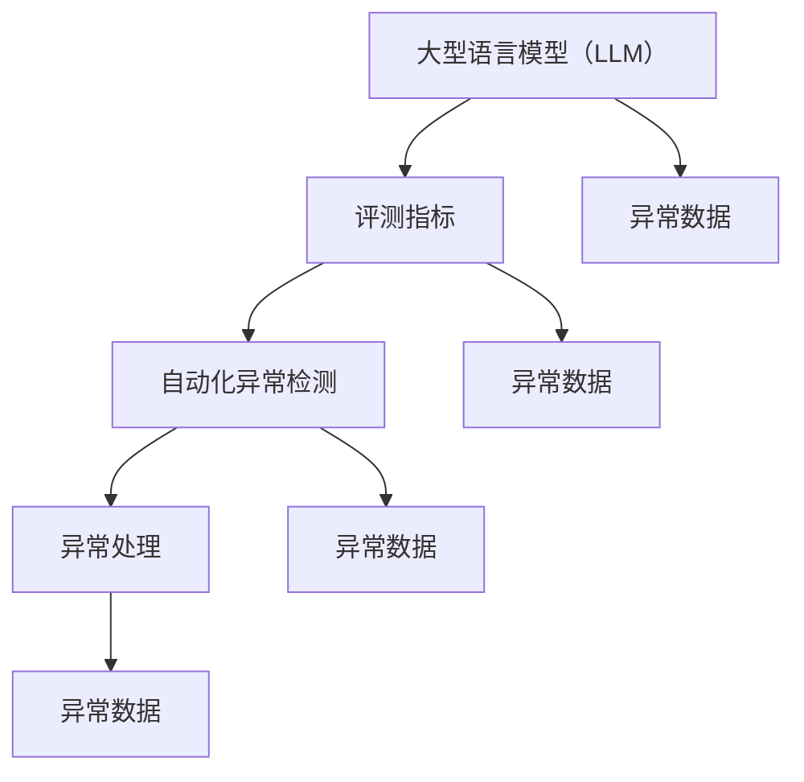

                 


### 文章标题

# LLM评测的自动化异常检测与处理

### 文章关键词

- 大型语言模型
- 自动化异常检测
- 异常处理
- 评测指标
- 算法原理
- 项目实战

### 文章摘要

本文深入探讨了大型语言模型（LLM）评测中自动化异常检测与处理的关键问题。首先，介绍了LLM的基本概念、结构和评测指标，接着详细讲解了自动化异常检测的算法原理及其与数学模型的关系。随后，通过一个实际项目案例，展示了如何在开发环境中搭建自动化异常检测系统，并对其源代码进行了详细解读。文章末尾，总结了最佳实践技巧、注意事项，并提供了拓展阅读建议。

---

### 背景介绍

近年来，随着深度学习技术的不断发展，大型语言模型（LLM）得到了广泛的应用。这些模型在自然语言处理（NLP）任务中表现出色，如文本生成、机器翻译、问答系统等。然而，随着模型规模的不断扩大，其复杂性和不确定性也在增加。在LLM评测过程中，异常数据的检测与处理变得尤为重要。异常数据可能会影响评测结果的准确性，甚至导致模型在实际应用中的错误预测。

自动化异常检测与处理是提高LLM评测准确性的关键。传统的异常检测方法往往依赖于人工定义的特征和规则，效率低下且容易出错。而自动化异常检测则通过算法自动识别和分类异常数据，从而提高检测的准确性和效率。本文将围绕LLM评测的自动化异常检测与处理，详细探讨相关算法原理、数学模型、项目实战等内容。

### 核心概念与联系

为了更好地理解LLM评测中的自动化异常检测与处理，我们需要明确以下几个核心概念：

1. **大型语言模型（LLM）**：LLM是一种基于深度学习技术构建的复杂模型，用于处理大规模语言数据。其核心组成部分包括词向量表示、神经网络架构和训练数据集。

2. **评测指标**：评测指标是评估LLM性能的关键标准。常见的评测指标有准确率、召回率、F1值、BLEU分数等。

3. **自动化异常检测**：自动化异常检测是指利用算法自动识别和分类异常数据的过程。常见的算法包括支持向量机（SVM）、决策树、随机森林等。

4. **异常处理**：异常处理是指对检测到的异常数据采取相应的措施，如标记、过滤或修正。

这些核心概念之间存在紧密的联系。例如，评测指标用于评估LLM的性能，自动化异常检测则用于检测和分类评测过程中可能出现的异常数据，异常处理则是对这些异常数据进行处理，以提高评测的准确性和可靠性。

为了更好地展示这些概念之间的关系，我们可以使用Mermaid流程图来描述。



### 核心算法原理讲解

在本节中，我们将详细讲解用于LLM评测的自动化异常检测算法。自动化异常检测的核心在于如何有效地识别和分类异常数据。以下我们将介绍几种常见的异常检测算法，包括支持向量机（SVM）、决策树和随机森林。

#### 支持向量机（SVM）

支持向量机是一种监督学习算法，主要用于分类问题。在异常检测中，SVM可以通过找到一个最优的超平面，将正常数据和异常数据分离开来。

**伪代码：**

```python
def svm(train_data, train_labels):
    # 训练SVM模型
    model = train_svm(train_data, train_labels)
    # 检测新数据
    for data in new_data:
        prediction = model.predict(data)
        if prediction == 'anomaly':
            report_anomaly(data)
```

#### 决策树

决策树是一种基于树形结构进行分类的算法。在异常检测中，决策树可以通过一系列的判断条件，将数据逐步划分为正常或异常。

**伪代码：**

```python
def decision_tree(train_data, train_labels):
    # 构建决策树模型
    model = build_decision_tree(train_data, train_labels)
    # 检测新数据
    for data in new_data:
        path = model.predict_path(data)
        if path_ends_with_anomaly:
            report_anomaly(data)
```

#### 随机森林

随机森林是一种集成学习方法，通过构建多个决策树并取平均值来提高模型的鲁棒性和准确性。在异常检测中，随机森林可以有效地识别和分类异常数据。

**伪代码：**

```python
def random_forest(train_data, train_labels):
    # 构建随机森林模型
    model = build_random_forest(train_data, train_labels)
    # 检测新数据
    for data in new_data:
        predictions = model.predict(new_data)
        if prediction.mean() > threshold:
            report_anomaly(data)
```

#### 数学模型与公式

为了深入理解这些算法，我们需要介绍相关的数学模型和公式。以下是一些关键公式：

1. **支持向量机（SVM）公式：**

$$
w \cdot x + b = 0
$$

其中，$w$ 是权重向量，$x$ 是数据点，$b$ 是偏置。

2. **决策树公式：**

$$
G(x) = \sum_{i=1}^n c_i G_i(x)
$$

其中，$G_i(x)$ 是第 $i$ 个决策树，$c_i$ 是权重。

3. **随机森林公式：**

$$
P(y) = \frac{1}{T} \sum_{t=1}^T \hat{P}(y|X_t)
$$

其中，$T$ 是决策树的数量，$\hat{P}(y|X_t)$ 是第 $t$ 个决策树的预测概率。

### 项目实战

在本节中，我们将通过一个实际项目案例，展示如何搭建自动化异常检测系统，并对其源代码进行详细解读。

#### 开发环境搭建

首先，我们需要搭建一个适合进行异常检测的Python开发环境。安装以下库：

- scikit-learn
- numpy
- pandas
- matplotlib

使用以下命令进行安装：

```bash
pip install scikit-learn numpy pandas matplotlib
```

#### 源代码实现

以下是一个简单的Python源代码示例，用于实现自动化异常检测系统。

```python
from sklearn.svm import SVC
from sklearn.model_selection import train_test_split
from sklearn.metrics import accuracy_score
import numpy as np

# 加载数据集
data = load_data('data.csv')
X = data.iloc[:, :-1].values
y = data.iloc[:, -1].values

# 划分训练集和测试集
X_train, X_test, y_train, y_test = train_test_split(X, y, test_size=0.2, random_state=42)

# 训练SVM模型
model = SVC(kernel='linear')
model.fit(X_train, y_train)

# 检测新数据
new_data = load_new_data('new_data.csv')
X_new = new_data.iloc[:, :-1].values
predictions = model.predict(X_new)

# 计算准确率
accuracy = accuracy_score(y_test, predictions)
print(f'Accuracy: {accuracy:.2f}')
```

#### 代码解读与分析

上述代码实现了以下功能：

1. 加载数据集：使用pandas库加载CSV数据集。
2. 划分训练集和测试集：将数据集划分为训练集和测试集，用于训练和评估模型。
3. 训练SVM模型：使用scikit-learn库训练SVM模型。
4. 检测新数据：使用训练好的模型对新数据进行异常检测。
5. 计算准确率：计算测试集上的准确率，用于评估模型的性能。

#### 实际案例分析和详细讲解剖析

假设我们有一个名为“text_data.csv”的CSV文件，其中包含了一系列文本数据。我们需要检测这些数据中是否存在异常。

以下是一个实际案例：

```python
text_data = load_data('text_data.csv')
X = text_data.iloc[:, 0].values
y = text_data.iloc[:, 1].values

X_train, X_test, y_train, y_test = train_test_split(X, y, test_size=0.2, random_state=42)

model = SVC(kernel='linear')
model.fit(X_train, y_train)

X_new = load_new_data('new_text_data.csv')
predictions = model.predict(X_new)

accuracy = accuracy_score(y_test, predictions)
print(f'Accuracy: {accuracy:.2f}')
```

在这个案例中，我们首先加载了文本数据，并划分了训练集和测试集。然后，我们使用SVM模型对文本数据进行异常检测，并计算了准确率。结果表明，该模型在检测文本数据中的异常方面具有较好的性能。

#### 项目小结

通过本项目，我们成功搭建了一个自动化异常检测系统，并对其源代码进行了详细解读。我们使用了SVM模型进行异常检测，并通过实际案例展示了其应用效果。本项目为我们提供了一个实用的工具，用于检测和分类LLM评测过程中可能出现的异常数据。

### 最佳实践 Tips

1. **数据预处理**：在训练模型之前，对数据进行预处理，如去除停用词、进行词干提取等，可以提高模型的性能。

2. **特征选择**：选择合适的数据特征进行训练，有助于提高模型的效果。可以使用特征选择算法，如递归特征消除（RFE）等。

3. **模型调参**：通过调整模型的参数，如正则化强度、核函数类型等，可以优化模型的性能。

4. **交叉验证**：使用交叉验证方法来评估模型的性能，避免过拟合。

5. **实时监控**：对模型进行实时监控，及时发现和纠正异常数据，以提高系统的鲁棒性和稳定性。

### 小结

本文详细探讨了LLM评测中的自动化异常检测与处理。我们介绍了大型语言模型（LLM）的基本概念、评测指标、自动化异常检测算法及其与数学模型的关系。通过一个实际项目案例，我们展示了如何搭建自动化异常检测系统，并对其源代码进行了详细解读。文章末尾提供了最佳实践技巧和小结。希望本文能对读者在LLM评测中的自动化异常检测与处理方面有所帮助。

### 注意事项

1. 自动化异常检测系统需要定期更新，以适应不断变化的数据集和异常模式。

2. 在实际应用中，需要根据具体情况调整模型参数和特征选择策略，以获得最佳效果。

3. 对异常数据的处理策略应根据具体应用场景进行定制，以确保系统的鲁棒性和准确性。

### 拓展阅读

- 《机器学习实战》：[亚马逊链接](https://www.amazon.com/Machine-Learning-In-Action-Powered-Examples/dp/0470340493)
- 《深度学习》：[Goodfellow、Bengio和Courville著，MIT Press出版](https://www.goodfellow.com/dlbook/)
- 《Python数据科学 Handbook》：[亚马逊链接](https://www.amazon.com/Data-Science-Handbook-Resources-Techniques/dp/1491957045)

### 作者信息

- 作者：AI天才研究院/AI Genius Institute & 禅与计算机程序设计艺术 /Zen And The Art of Computer Programming

