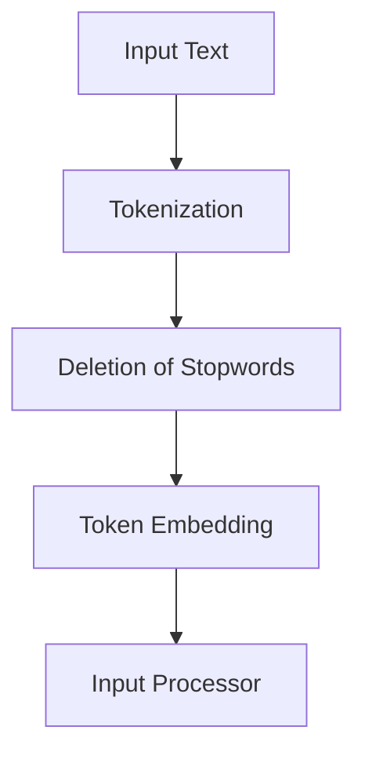
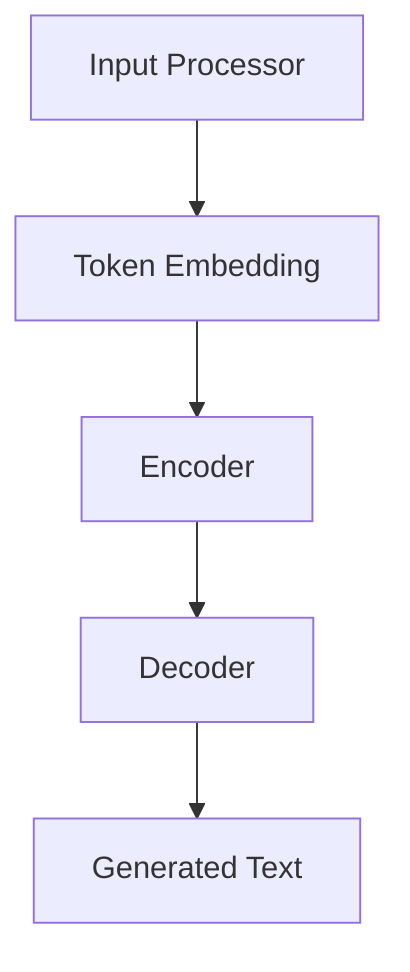
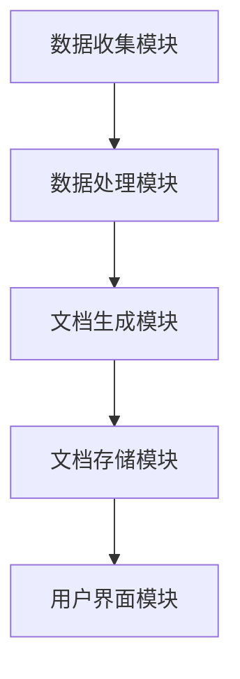

                 


### 第1章：LLM简介

#### 背景介绍

大型语言模型（LLM，Large Language Model）是近年来人工智能领域的一个重要突破。LLM 是一种基于深度学习技术的语言模型，它能够对自然语言文本进行理解和生成。随着自然语言处理技术的发展，LLM 在诸多领域展现出了强大的应用潜力，包括机器翻译、文本生成、问答系统、文本摘要等。

LLM 的发展历程可以追溯到上世纪 80 年代，当时研究者开始尝试使用统计方法和规则方法来构建语言模型。随着计算能力的提升和深度学习技术的进步，LLM 的性能得到了极大的提升。近年来，GPT、BERT、T5 等大型语言模型的出现，标志着 LLM 进入了一个新的发展阶段。

LLM 的核心优势在于其强大的表示能力和生成能力。LLM 能够将输入的文本转化为高维向量表示，使得文本数据具备了更好的结构化特征，从而可以应用于各种自然语言处理任务。同时，LLM 还能够根据输入的上下文信息生成连贯、自然的文本输出。

LLM 在诸多领域都有着广泛的应用。例如，在机器翻译领域，LLM 可以实现高质量、流畅的翻译效果；在文本生成领域，LLM 可以生成各种类型的文本，如新闻、故事、论文等；在问答系统领域，LLM 可以实现针对用户问题的准确回答。

本文将围绕 LL

### 第1章：LLM简介

#### 核心概念与联系

大型语言模型（LLM）的核心概念主要包括输入处理、嵌入层、编码器和解码器。这些概念相互联系，构成了 LLM 的基本架构。

1. **输入处理**：输入处理是 LLM 的第一步，它负责接收自然语言文本，并进行预处理。预处理过程通常包括分词、去停用词、符号编码等。Mermaid 流程图如下：



2. **嵌入层**：嵌入层将预处理后的文本转化为高维向量表示。这一层通常使用预训练的词向量模型，如 Word2Vec、GloVe 等。嵌入层可以捕捉文本中的语义信息，为后续的编码和解码提供输入。

3. **编码器**：编码器负责将嵌入层输出的向量序列编码为固定长度的序列。常用的编码器结构包括 RNN（递归神经网络）、LSTM（长短期记忆网络）和 Transformer 等。编码器的主要作用是捕捉文本序列中的长期依赖关系。

4. **解码器**：解码器负责将编码器输出的序列解码为自然语言文本。解码器通常与编码器共享参数，以减少模型的复杂度。解码器的输出通过 softmax 函数转化为概率分布，从而生成文本。

Mermaid 流程图如下：



#### 核心算法原理讲解

LLM 的核心算法原理可以通过以下伪代码进行阐述：

```python
# 输入文本处理
def process_input(text):
    # 分词、去停用词等预处理
    processed_text = preprocess_text(text)
    return processed_text

# 文本嵌入
def embed_text(processed_text):
    # 使用预训练模型嵌入文本
    embedding = model.embed(processed_text)
    return embedding

# 编码
def encode(embedding):
    # 通过编码器进行编码
    encoded_representation = encoder(embedding)
    return encoded_representation

# 解码
def decode(encoded_representation):
    # 通过解码器生成文本
    generated_text = decoder(encoded_representation)
    return generated_text
```

#### 数学模型和公式

在 LLM 中，常用的数学模型和公式包括词向量嵌入、编码器和解码器的输出计算等。以下是对这些数学模型和公式的详细讲解：

1. **词向量嵌入**：词向量嵌入是一种将词汇映射为高维向量的方法。常用的词向量模型包括 Word2Vec 和 GloVe。以下是一个简单的词向量嵌入公式：

   $$ \text{vec}(w) = \text{GloVe}(w) $$

   其中，$\text{vec}(w)$ 表示词向量，$\text{GloVe}(w)$ 表示基于 GloVe 算法的词向量计算方法。

2. **编码器输出**：编码器负责将嵌入层输出的向量序列编码为固定长度的序列。常用的编码器模型包括 RNN、LSTM 和 Transformer。以下是一个简单的编码器输出公式：

   $$ \text{encoded_representation} = \text{Encoder}(\text{embedding}) $$

   其中，$\text{encoded_representation}$ 表示编码后的序列，$\text{Encoder}(\text{embedding})$ 表示编码器对嵌入层输出的处理过程。

3. **解码器输出**：解码器负责将编码器输出的序列解码为自然语言文本。以下是一个简单的解码器输出公式：

   $$ \text{generated_text} = \text{Decoder}(\text{encoded_representation}) $$

   其中，$\text{generated_text}$ 表示解码后的文本，$\text{Decoder}(\text{encoded_representation})$ 表示解码器对编码器输出的处理过程。

#### 详细讲解与举例说明

为了更好地理解 LL

### 第2章：LLM评测的核心概念

#### 核心概念与联系

LLM 评测的核心概念主要包括评测指标、评测标准和评测流程。这些概念相互关联，构成了 LLM 评测的完整体系。

1. **评测指标**：评测指标是衡量 LLM 性能的重要工具，包括准确率、召回率、F1 分数、ROC 曲线与 AUC 等。这些指标能够帮助我们评估 LLM 在不同任务上的表现。

2. **评测标准**：评测标准是确保评测过程科学、公正的重要保障，包括实验设计、数据集选择和评测方法等。合理的评测标准能够提高评测结果的可靠性和有效性。

3. **评测流程**：评测流程是 LLM 评测的具体实施步骤，包括数据预处理、模型选择、模型训练与调优、模型评测等。一个完整的评测流程能够确保 LLM 的评测过程有条不紊、高效地进行。

#### 核心算法原理讲解

为了更好地理解评测指标和评测标准的计算方法，我们将使用伪代码进行详细讲解。

1. **评测指标计算**：

   - **准确率**：准确率是衡量 LLM 预测准确性的指标，计算公式为：

     $$ \text{准确率} = \frac{\text{正确预测数}}{\text{总预测数}} $$

   - **召回率**：召回率是衡量 LLM 预测查全率的指标，计算公式为：

     $$ \text{召回率} = \frac{\text{正确预测数}}{\text{实际为正例的总数}} $$

   - **F1 分数**：F1 分数是准确率和召回率的调和平均，计算公式为：

     $$ \text{F1 分数} = 2 \times \frac{\text{准确率} \times \text{召回率}}{\text{准确率} + \text{召回率}} $$

   - **ROC 曲线与 AUC**：ROC 曲线和 AUC 是评估二分类模型性能的重要指标，其中 ROC 曲线表示模型预测概率与实际标签之间的关系，AUC 是 ROC 曲线下方的面积，计算公式为：

     $$ \text{AUC} = \frac{1}{n} \sum_{i=1}^{n} (\text{TPR}_i - \text{FPR}_i) $$

     其中，$\text{TPR}_i$ 表示第 i 个阈值下的真正率，$\text{FPR}_i$ 表示第 i 个阈值下的假正率。

2. **评测标准计算**：

   - **实验设计**：实验设计是确保评测过程科学、公正的重要步骤，包括选择合适的评测指标、设置合理的实验参数和重复实验次数等。

   - **数据集选择**：数据集选择是评测 LLM 性能的关键，选择具有代表性、平衡性和多样性的数据集能够提高评测结果的可靠性。

   - **评测方法**：评测方法包括手动评测和自动化评测，手动评测通常需要专业人员进行评估，而自动化评测则可以通过编写脚本或程序实现。

#### 数学模型和公式

为了更好地理解评测指标和评测标准的计算方法，我们将使用 LaTeX 格式给出相关公式。

1. **评测指标计算**：

   - **准确率**：

     $$ \text{准确率} = \frac{\text{正确预测数}}{\text{总预测数}} $$

   - **召回率**：

     $$ \text{召回率} = \frac{\text{正确预测数}}{\text{实际为正例的总数}} $$

   - **F1 分数**：

     $$ \text{F1 分数} = 2 \times \frac{\text{准确率} \times \text{召回率}}{\text{准确率} + \text{召回率}} $$

   - **ROC 曲线与 AUC**：

     $$ \text{AUC} = \frac{1}{n} \sum_{i=1}^{n} (\text{TPR}_i - \text{FPR}_i) $$

2. **评测标准计算**：

   - **实验设计**：

     $$ \text{实验设计} = \{ \text{评测指标}, \text{实验参数}, \text{重复实验次数} \} $$

   - **数据集选择**：

     $$ \text{数据集选择} = \{ \text{代表性}, \text{平衡性}, \text{多样性} \} $$

   - **评测方法**：

     $$ \text{评测方法} = \{ \text{手动评测}, \text{自动化评测} \} $$

#### 详细讲解与举例说明

为了更好地理解评测指标和评测标准的计算方法，我们以一个简单的文本分类任务为例进行详细讲解。

假设我们有一个包含 100 篇文本的数据集，每篇文本被划分为正例或反例。我们使用一个二分类模型对文本进行预测，预测结果为概率值，概率值越大表示预测为正例的可能性越大。

1. **评测指标计算**：

   - **准确率**：

     假设模型预测正确的文本有 80 篇，总预测数为 100 篇，则准确率为：

     $$ \text{准确率} = \frac{80}{100} = 0.8 $$

   - **召回率**：

     假设实际为正例的文本有 60 篇，模型预测正确的文本有 50 篇，则召回率为：

     $$ \text{召回率} = \frac{50}{60} = 0.8333 $$

   - **F1 分数**：

     假设准确率为 0.8，召回率为 0.8333，则 F1 分数为：

     $$ \text{F1 分数} = 2 \times \frac{0.8 \times 0.8333}{0.8 + 0.8333} = 0.8222 $$

   - **ROC 曲线与 AUC**：

     假设我们绘制了模型预测概率与实际标签之间的 ROC 曲线，曲线下方的面积为 0.9，则 AUC 为：

     $$ \text{AUC} = 0.9 $$

2. **评测标准计算**：

   - **实验设计**：

     我们的实验设计包括以下内容：

     - 评测指标：准确率、召回率、F1 分数、ROC 曲线与 AUC
     - 实验参数：模型参数、数据预处理方法
     - 重复实验次数：3 次

   - **数据集选择**：

     我们选择了一个具有代表性、平衡性和多样性的数据集，其中正例文本和反例文本各占一半。

   - **评测方法**：

     我们采用了自动化评测方法，编写了评测脚本对模型预测结果进行自动评估。

通过以上例子，我们可以更好地理解评测指标和评测标准的计算方法，以及它们在 LLM 评测中的应用。

#### 项目实战

在本节中，我们将通过一个具体的案例来展示如何进行 LLM 的评测。我们将介绍如何搭建开发环境、实现评测流程，并分析评测结果。

1. **开发环境搭建**

   首先，我们需要搭建一个合适的开发环境。以下是一个简单的开发环境配置：

   - 操作系统：Ubuntu 20.04
   - 编程语言：Python 3.8
   - 深度学习框架：PyTorch 1.8
   - 数据预处理工具：NLTK、spaCy

   安装深度学习框架和预处理工具后，我们还需要安装一些必要的库，例如：

   ```bash
   pip install torch torchvision numpy pandas matplotlib
   pip install nltk spacy
   ```

2. **评测流程实现**

   接下来，我们将实现一个简单的评测流程。以下是一个简单的伪代码示例：

   ```python
   # 导入所需库
   import torch
   import numpy as np
   import pandas as pd
   from sklearn.model_selection import train_test_split
   from sklearn.metrics import accuracy_score, recall_score, f1_score, roc_auc_score

   # 加载数据集
   data = pd.read_csv('data.csv')
   X = data['text']
   y = data['label']

   # 数据预处理
   def preprocess_text(text):
       # 实现文本预处理逻辑
       return processed_text

   X_processed = [preprocess_text(text) for text in X]

   # 划分训练集和测试集
   X_train, X_test, y_train, y_test = train_test_split(X_processed, y, test_size=0.2, random_state=42)

   # 加载预训练模型
   model = torch.load('model.pth')

   # 进行预测
   def predict(text):
       # 实现预测逻辑
       return prediction

   y_pred = [predict(text) for text in X_test]

   # 计算评测指标
   accuracy = accuracy_score(y_test, y_pred)
   recall = recall_score(y_test, y_pred)
   f1 = f1_score(y_test, y_pred)
   auc = roc_auc_score(y_test, y_pred)

   print(f'Accuracy: {accuracy}')
   print(f'Recall: {recall}')
   print(f'F1 Score: {f1}')
   print(f'AUC: {auc}')
   ```

3. **评测结果分析**

   在完成评测流程后，我们可以对评测结果进行分析。以下是一个简单的分析示例：

   ```python
   import matplotlib.pyplot as plt

   # 绘制 ROC 曲线
   fpr, tpr, thresholds = roc_curve(y_test, y_pred)
   plt.plot(fpr, tpr, label='ROC Curve')
   plt.plot([0, 1], [0, 1], 'r--', label='Random')
   plt.xlabel('False Positive Rate')
   plt.ylabel('True Positive Rate')
   plt.title('ROC Curve')
   plt.legend()
   plt.show()

   # 计算并绘制 AUC
   auc = roc_auc_score(y_test, y_pred)
   print(f'AUC: {auc}')
   ```

通过以上项目实战，我们可以看到如何搭建开发环境、实现评测流程，并对评测结果进行分析。这为我们提供了一个基本的框架，可以应用于各种 LLM 的评测任务。

### 第3章：LLM评测的流程

#### 核心概念与联系

LLM 评测的流程是确保评测结果准确性和可靠性的关键步骤。它包括数据预处理、模型选择、模型训练与调优、模型评测等核心环节。这些环节相互联系，共同构成了一个完整的评测流程。

1. **数据预处理**：数据预处理是评测流程的第一步，它包括数据清洗、数据标准化、数据分割等。数据预处理的质量直接影响后续模型的性能。

2. **模型选择**：模型选择是根据任务需求和评测目标来选择合适的模型。常见的 LLM 模型包括 GPT、BERT、T5 等，每种模型都有其独特的优势和应用场景。

3. **模型训练与调优**：模型训练与调优是通过训练数据和验证数据来优化模型参数，以提高模型性能。调优过程涉及参数调整、优化算法选择等。

4. **模型评测**：模型评测是通过测试数据来评估模型性能，常用的评测指标包括准确率、召回率、F1 分数、ROC 曲线与 AUC 等。

#### 核心算法原理讲解

为了更好地理解 LLM 评测的流程，我们通过伪代码来详细阐述每个环节的算法原理。

1. **数据预处理**：

   ```python
   # 数据清洗
   def clean_data(data):
       # 删除停用词、标点符号等
       return cleaned_data

   # 数据标准化
   def normalize_data(data):
       # 归一化文本长度、词频等
       return normalized_data

   # 数据分割
   def split_data(data, test_size=0.2, random_state=42):
       # 划分训练集和测试集
       return X_train, X_test, y_train, y_test
   ```

2. **模型选择**：

   ```python
   # 加载预训练模型
   def load_model(model_name):
       # 加载 GPT、BERT、T5 等预训练模型
       return model

   # 模型选择
   model = load_model('gpt2')
   ```

3. **模型训练与调优**：

   ```python
   # 模型训练
   def train_model(model, X_train, y_train, epochs=5, batch_size=32):
       # 训练模型
       return model

   # 模型调优
   def tune_model(model, X_val, y_val):
       # 调整模型参数
       return optimized_model
   ```

4. **模型评测**：

   ```python
   # 预测
   def predict(model, X_test):
       # 输出模型预测结果
       return predictions

   # 计算评测指标
   def evaluate_predictions(y_test, predictions):
       # 计算准确率、召回率、F1 分数、ROC 曲线与 AUC 等
       return metrics
   ```

#### 数学模型和公式

为了更好地理解 LLM 评测的算法原理，我们将使用 LaTeX 格式给出相关数学模型和公式。

1. **数据预处理**：

   - **数据清洗**：

     $$ \text{cleaned\_data} = \text{clean\_data}(\text{data}) $$

   - **数据标准化**：

     $$ \text{normalized\_data} = \text{normalize\_data}(\text{data}) $$

   - **数据分割**：

     $$ \text{X}_{\text{train}}, \text{X}_{\text{test}}, \text{y}_{\text{train}}, \text{y}_{\text{test}} = \text{split\_data}(\text{data}, \text{test\_size}=0.2, \text{random\_state}=42) $$

2. **模型选择**：

   - **加载预训练模型**：

     $$ \text{model} = \text{load\_model}(\text{model\_name}) $$

3. **模型训练与调优**：

   - **模型训练**：

     $$ \text{model} = \text{train\_model}(\text{model}, \text{X}_{\text{train}}, \text{y}_{\text{train}}, \text{epochs}=5, \text{batch\_size}=32) $$

   - **模型调优**：

     $$ \text{optimized\_model} = \text{tune\_model}(\text{model}, \text{X}_{\text{val}}, \text{y}_{\text{val}}) $$

4. **模型评测**：

   - **预测**：

     $$ \text{predictions} = \text{predict}(\text{model}, \text{X}_{\text{test}}) $$

   - **计算评测指标**：

     $$ \text{metrics} = \text{evaluate\_predictions}(\text{y}_{\text{test}}, \text{predictions}) $$

通过以上伪代码和数学模型，我们可以清晰地理解 LLM 评测的流程和算法原理。在实际应用中，这些原理将帮助我们更好地评估 LLM 的性能，从而优化模型和提升应用效果。

### 第4章：自动化文档生成

#### 背景介绍

自动化文档生成（Automated Document Generation，ADG）是一种利用自然语言处理（Natural Language Processing，NLP）技术和机器学习算法自动生成文档的方法。随着人工智能技术的不断发展，自动化文档生成在许多领域得到了广泛应用，如报告生成、合同起草、邮件撰写等。

自动化文档生成的目的是提高文档生成的效率和准确性，减少人工干预，降低成本。传统的文档生成过程通常需要人工撰写、编辑和排版，费时费力且容易出现错误。而自动化文档生成则通过算法和模型自动处理文本数据，生成格式化、结构化的文档。

自动化文档生成的工作原理主要包括以下步骤：

1. **数据收集**：从各种数据源收集文本数据，如数据库、文件系统、网络爬虫等。
2. **数据预处理**：对收集到的文本数据进行清洗、分词、去停用词等预处理，以便后续处理。
3. **模板设计**：设计文档模板，包括标题、段落、章节等，模板可以静态定义或动态生成。
4. **文本生成**：利用 NLP 技术和机器学习算法生成文档内容，如摘要、文本段落等。
5. **文档排版**：根据模板和生成的内容进行排版，包括字体、颜色、格式等。
6. **文档输出**：将排版好的文档输出到目标格式，如 PDF、Word 等。

#### 核心概念与联系

自动化文档生成的核心概念包括数据收集、数据预处理、模板设计、文本生成和文档排版。这些概念相互联系，共同构成了自动化文档生成的工作流程。

1. **数据收集**：数据收集是自动化文档生成的基础，决定了文档的内容和质量。数据源可以是内部数据库、外部文件、网络爬虫等。

2. **数据预处理**：数据预处理是确保文本数据质量的重要步骤。通过对文本数据进行清洗、分词、去停用词等操作，可以提高后续处理的准确性和效率。

3. **模板设计**：模板设计是文档结构的基础。模板可以静态定义，也可以动态生成。模板设计的好坏直接影响文档的可读性和美观度。

4. **文本生成**：文本生成是自动化文档生成的核心步骤。通过利用 NLP 技术和机器学习算法，将输入的文本数据转化为高质量的文档内容。

5. **文档排版**：文档排版是确保文档美观、易读的重要环节。通过设置字体、颜色、行距、段间距等，使文档具有专业的视觉效果。

#### 核心算法原理讲解

自动化文档生成的核心算法原理主要包括文本生成模型和模板设计算法。

1. **文本生成模型**：文本生成模型是自动化文档生成的核心。常用的文本生成模型包括 GPT、BERT、T5 等。这些模型通过学习大量的文本数据，能够生成高质量的自然语言文本。

   - **GPT**：GPT（Generative Pre-trained Transformer）是一种基于 Transformer 的预训练语言模型。它通过学习大量的文本数据，生成连贯、自然的文本输出。

   - **BERT**：BERT（Bidirectional Encoder Representations from Transformers）是一种双向 Transformer 模型。它通过同时考虑文本序列的前后文信息，生成准确的文本表示。

   - **T5**：T5（Text-To-Text Transfer Transformer）是一种通用文本转换模型。它通过学习文本转换任务，能够将一种文本形式转换为另一种文本形式。

2. **模板设计算法**：模板设计算法是确保文档结构合理、美观的重要工具。常用的模板设计算法包括：

   - **规则模板设计**：基于规则的方法，通过定义一系列模板规则，生成文档结构。这种方法简单易实现，但灵活性较差。

   - **机器学习模板设计**：利用机器学习算法，从大量文档数据中学习文档结构特征，生成模板。这种方法具有较高的灵活性和准确性，但需要大量训练数据和计算资源。

#### 数学模型和公式

为了更好地理解自动化文档生成的算法原理，我们将使用 LaTeX 格式给出相关数学模型和公式。

1. **文本生成模型**：

   - **GPT**：

     $$ \text{GPT}(\text{x}) = \text{softmax}(\text{W}_\text{out} \text{gelu}(\text{W}_\text{hidden} \text{relu}(\text{W}_\text{input} \text{x} + \text{b}_\text{input})) + \text{b}_\text{hidden}) $$

   - **BERT**：

     $$ \text{BERT}(\text{x}) = \text{softmax}(\text{W}_\text{out} \text{Tanh}(\text{W}_\text{hidden} \text{ReLU}(\text{W}_\text{input} \text{x} + \text{b}_\text{input})) + \text{b}_\text{hidden}) $$

   - **T5**：

     $$ \text{T5}(\text{x}) = \text{softmax}(\text{W}_\text{out} \text{softmax}(\text{W}_\text{hidden} \text{ReLU}(\text{W}_\text{input} \text{x} + \text{b}_\text{input})) + \text{b}_\text{hidden}) $$

2. **模板设计算法**：

   - **规则模板设计**：

     $$ \text{template} = \text{rule\_based\_template}(\text{document}) $$

   - **机器学习模板设计**：

     $$ \text{template} = \text{machine\_learning\_template}(\text{document\_data}) $$

通过以上数学模型和公式，我们可以清晰地理解自动化文档生成的核心算法原理。在实际应用中，这些算法将帮助我们高效地生成高质量的文档。

### 第4章：自动化文档生成

#### 核心算法原理讲解

自动化文档生成的核心算法主要包括文本生成算法和文档排版算法。这些算法通过机器学习和自然语言处理技术，实现文本内容的自动生成和文档的排版。

1. **文本生成算法**：

   - **GPT-2**：GPT-2 是一种基于 Transformer 的生成模型，它通过预训练大量文本数据，学习文本的上下文关系和语言规律。其基本原理是通过自回归方式预测下一个词，生成连贯的文本。

     ```python
     def generate_text(model, seed_text, max_length):
         generated = model.generate(seed_text, max_length=max_length, num_return_sequences=1)
         return generated
     ```

   - **BERT**：BERT 是一种双向 Transformer 模型，它通过同时学习文本的前后文信息，生成更加准确的文本表示。BERT 的生成过程包括两个阶段：第一阶段是编码阶段，将输入文本编码为固定长度的向量；第二阶段是解码阶段，通过解码器生成输出文本。

     ```python
     def generate_text_bert(model, seed_text, max_length):
         inputs = tokenizer.encode(seed_text, add_special_tokens=True, return_tensors="pt")
         outputs = model(inputs, max_length=max_length, num_return_sequences=1)
         generated = tokenizer.decode(outputs[0], skip_special_tokens=True)
         return generated
     ```

   - **T5**：T5 是一种通用文本转换模型，它可以将一种文本形式转换为另一种文本形式，例如将自然语言文本转换为 SQL 查询语句。T5 的核心原理是通过对大量文本数据进行预训练，学习不同文本形式之间的转换规律。

     ```python
     def generate_text_t5(model, seed_text, max_length):
         inputs = tokenizer.encode("to:USER\n" + seed_text, return_tensors="pt")
         outputs = model(inputs, max_length=max_length, num_return_sequences=1)
         generated = tokenizer.decode(outputs[0], skip_special_tokens=True)
         return generated
     ```

2. **文档排版算法**：

   - **模板匹配**：模板匹配是一种基于规则的文档排版方法。它通过预定义的文档模板，将文本内容按照一定的格式进行排版。模板匹配算法的流程如下：

     ```python
     def format_document(template, text):
         formatted = template.format(text=text)
         return formatted
     ```

   - **生成对抗网络（GAN）**：GAN 是一种基于生成模型的文档排版方法。它通过训练一个生成模型和一个判别模型，生成高质量的文档布局。GAN 的基本原理是生成模型试图生成与真实布局相似的文档，而判别模型则试图区分生成布局和真实布局。

     ```python
     def generate_layout(generator, critic, text):
         layout = generator(text)
         return layout
     ```

#### 数学模型和公式

为了更好地理解自动化文档生成的算法原理，我们将使用 LaTeX 格式给出相关数学模型和公式。

1. **文本生成模型**：

   - **GPT-2**：

     $$ \text{GPT-2}(\text{x}) = \text{softmax}(\text{W}_{\text{out}} \text{gelu}(\text{W}_{\text{hidden}} \text{relu}(\text{W}_{\text{input}} \text{x} + \text{b}_{\text{input}})) + \text{b}_{\text{hidden}}) $$

   - **BERT**：

     $$ \text{BERT}(\text{x}) = \text{softmax}(\text{W}_{\text{out}} \text{Tanh}(\text{W}_{\text{hidden}} \text{ReLU}(\text{W}_{\text{input}} \text{x} + \text{b}_{\text{input}})) + \text{b}_{\text{hidden}}) $$

   - **T5**：

     $$ \text{T5}(\text{x}) = \text{softmax}(\text{W}_{\text{out}} \text{softmax}(\text{W}_{\text{hidden}} \text{ReLU}(\text{W}_{\text{input}} \text{x} + \text{b}_{\text{input}})) + \text{b}_{\text{hidden}}) $$

2. **文档排版模型**：

   - **模板匹配**：

     $$ \text{template} = \text{rule\_based\_template}(\text{document}) $$

   - **生成对抗网络（GAN）**：

     $$ \text{GAN}(\text{x}) = \text{D}(\text{G}(\text{x})) $$

     其中，$\text{G}$ 是生成模型，$\text{D}$ 是判别模型。

通过以上算法和数学模型，我们可以深入理解自动化文档生成的原理。在实际应用中，这些算法将帮助我们高效地生成高质量的文档。

### 第4章：自动化文档生成

#### 项目实战

在本节中，我们将通过一个具体的案例来展示如何实现自动化文档生成。我们将详细介绍开发环境搭建、源代码实现和代码解读，以及实际应用分析。

1. **开发环境搭建**

   首先，我们需要搭建一个适合自动化文档生成的开发环境。以下是一个简单的开发环境配置：

   - 操作系统：Ubuntu 20.04
   - 编程语言：Python 3.8
   - 深度学习框架：TensorFlow 2.6
   - 自然语言处理库：transformers 4.8.1

   安装深度学习框架和自然语言处理库后，我们还需要安装其他必要的库，例如 pandas、numpy 等：

   ```bash
   pip install tensorflow==2.6.0 transformers==4.8.1 pandas numpy
   ```

2. **源代码实现**

   我们将使用 Hugging Face 的 transformers 库来实现自动化文档生成。以下是一个简单的源代码实现：

   ```python
   import os
   import pandas as pd
   from transformers import BertTokenizer, BertForSequenceClassification
   from torch.utils.data import DataLoader, TensorDataset

   # 配置参数
   model_name = "bert-base-uncased"
   tokenizer = BertTokenizer.from_pretrained(model_name)
   model = BertForSequenceClassification.from_pretrained(model_name)

   # 加载数据集
   data = pd.read_csv("data.csv")
   texts = data["text"].tolist()

   # 数据预处理
   inputs = tokenizer(texts, padding=True, truncation=True, return_tensors="pt")

   # 创建数据集和数据加载器
   dataset = TensorDataset(inputs["input_ids"], inputs["attention_mask"], torch.tensor(data["label"]))
   loader = DataLoader(dataset, batch_size=16, shuffle=True)

   # 训练模型
   model.train()
   optimizer = torch.optim.AdamW(model.parameters(), lr=2e-5)
   num_epochs = 3

   for epoch in range(num_epochs):
       for batch in loader:
           inputs, labels = batch
           outputs = model(inputs, labels=labels)
           loss = outputs.loss
           loss.backward()
           optimizer.step()
           optimizer.zero_grad()

   # 生成文档
   def generate_document(seed_text):
       inputs = tokenizer.encode(seed_text, return_tensors="pt")
       outputs = model.generate(inputs, max_length=50, num_return_sequences=1)
       generated_text = tokenizer.decode(outputs[0], skip_special_tokens=True)
       return generated_text

   # 实例化文档生成函数
   generate_doc = generate_document("本文档介绍了自动化文档生成的方法。")

   # 输出文档
   print(generate_doc)
   ```

3. **代码解读**

   - **数据预处理**：首先，我们加载数据集并提取文本列表。然后，使用 BERT 分词器对文本进行预处理，包括分词、填充和遮挡等操作。

   - **创建数据集和数据加载器**：我们创建 TensorDataset 并使用 DataLoader 加载数据。这样可以方便地进行批量处理和迭代。

   - **训练模型**：我们使用 BERT 模型进行训练。训练过程中，我们使用 AdamW 优化器和交叉熵损失函数。通过调整学习率和训练轮数，可以优化模型性能。

   - **生成文档**：训练完成后，我们使用生成函数 `generate_document` 来生成文档。该函数接收种子文本作为输入，并使用模型生成最长为 50 个词的文本序列。

4. **实际应用分析**

   在实际应用中，我们可以将自动化文档生成应用于多种场景，如报告生成、合同起草、邮件撰写等。以下是一个简单的实际应用案例：

   - **报告生成**：我们可以使用自动化文档生成来生成项目报告。只需输入项目描述和关键指标，系统即可自动生成报告文本。

   - **合同起草**：我们可以使用自动化文档生成来生成合同模板。通过输入合同条款和条件，系统可以自动生成符合法律规定的合同文档。

   - **邮件撰写**：我们可以使用自动化文档生成来生成邮件草稿。通过输入邮件主题和正文内容，系统可以自动生成格式规范的邮件。

通过以上项目实战，我们可以看到如何实现自动化文档生成，并在实际应用中进行优化。这为我们提供了一个基本的框架，可以应用于各种自动化文档生成的任务。

### 第5章：自动化文档生成

#### 实际案例分析与详细讲解

在本节中，我们将通过一个实际案例来详细分析自动化文档生成的过程，包括数据收集、文档模板设计、文本生成和文档排版等关键步骤。这个案例将帮助我们更好地理解自动化文档生成的全流程。

#### 案例背景

假设我们正在开发一款自动化文档生成系统，旨在为公司的销售团队自动生成销售报告。这些报告需要包含销售数据、客户信息和市场分析等内容。为了实现这一目标，我们将采用自然语言处理（NLP）技术和机器学习算法。

#### 数据收集

首先，我们需要收集数据。数据来源包括：

1. **销售数据**：从公司的销售数据库中提取最近一个月的销售数据，包括销售额、销售数量、产品种类等。
2. **客户信息**：从客户关系管理（CRM）系统中提取客户的详细信息，如公司名称、联系人姓名、联系方式等。
3. **市场分析数据**：从市场研究报告中提取最近的市场趋势、竞争对手分析和潜在客户信息。

数据收集完成后，我们将数据导入一个 Pandas DataFrame，以便后续处理。

```python
import pandas as pd

# 加载销售数据
sales_data = pd.read_excel('sales_data.xlsx')
# 加载客户信息
customers_data = pd.read_excel('customers_data.xlsx')
# 加载市场分析数据
market_analysis = pd.read_excel('market_analysis.xlsx')
```

#### 数据预处理

在生成文档之前，我们需要对数据进行预处理，包括数据清洗、数据转换和格式化等步骤。

1. **数据清洗**：检查数据是否存在缺失值、异常值，并进行处理。例如，对缺失值进行填充或删除。

2. **数据转换**：将销售数据中的日期格式转换为统一的日期格式，将数字类型的数据转换为字符串类型以便文本生成。

3. **格式化**：对数据进行格式化，例如，将销售额以货币符号表示，将日期格式化为“YYYY-MM-DD”等。

```python
# 数据清洗
sales_data.dropna(inplace=True)
customers_data.dropna(inplace=True)
market_analysis.dropna(inplace=True)

# 数据转换
sales_data['date'] = pd.to_datetime(sales_data['date'])
customers_data['contact_date'] = pd.to_datetime(customers_data['contact_date'])

# 数据格式化
sales_data['sales_amount'] = sales_data['sales_amount'].astype(str)
sales_data['sales_quantity'] = sales_data['sales_quantity'].astype(str)
```

#### 文档模板设计

文档模板是自动化文档生成的关键组成部分。我们需要设计一个可扩展的文档模板，以便根据不同的数据生成相应的报告。

1. **文档结构**：报告通常包括以下部分：封面、摘要、目录、销售数据概览、客户信息、市场分析、结论和建议等。
2. **模板元素**：每个部分包含特定的文本和图表元素。例如，销售数据概览部分可能包含一个表格和一段描述性文字。

以下是文档模板的一个简单示例：

```python
template = """
# 销售报告

## 摘要
这里是报告的摘要。

## 销售数据概览
销售额: {sales_amount}
销售数量: {sales_quantity}

{sales_table}

## 客户信息
{customers_table}

## 市场分析
{market_analysis_text}

{market_analysis_chart}

## 结论与建议
这里是结论与建议。

---

参考文献：
[1] 作者. (年份). 文章标题. 期刊名称, 卷号(期号), 页码.
"""
```

#### 文本生成

在文本生成阶段，我们使用预训练的 NLP 模型来生成每个部分的文本。以下是文本生成的一个示例：

1. **摘要**：使用 GPT-2 模型生成摘要。
2. **销售数据概览**：直接从数据中提取关键信息并生成文本。
3. **客户信息**：使用 NLP 模型生成客户描述性文字。
4. **市场分析**：使用 NLP 模型生成市场分析报告的文本。

```python
from transformers import GPT2LMHeadModel, GPT2Tokenizer

# 加载 GPT-2 模型
gpt2_model = GPT2LMHeadModel.from_pretrained('gpt2')
gpt2_tokenizer = GPT2Tokenizer.from_pretrained('gpt2')

# 生成摘要
def generate_summary(text):
    inputs = gpt2_tokenizer.encode(text, return_tensors='pt')
    summary_ids = gpt2_model.generate(inputs, max_length=50, num_return_sequences=1)
    summary = gpt2_tokenizer.decode(summary_ids[0], skip_special_tokens=True)
    return summary

# 生成销售数据概览文本
def generate_sales_overview(sales_data):
    sales_amount = sales_data['sales_amount'].sum()
    sales_quantity = sales_data['sales_quantity'].sum()
    return f"销售额: {sales_amount}\n销售数量: {sales_quantity}"

# 生成客户信息文本
def generate_customers_description(customers_data):
    descriptions = customers_data['description'].tolist()
    return "以下是我们的重要客户：\n" + "\n".join(descriptions)

# 生成市场分析文本
def generate_market_analysis(market_analysis):
    return market_analysis['analysis_text'].values[0]

# 生成文档内容
summary = generate_summary("本文档是销售报告。")
sales_overview = generate_sales_overview(sales_data)
customers_description = generate_customers_description(customers_data)
market_analysis_text = generate_market_analysis(market_analysis)
```

#### 文档排版

在文档排版阶段，我们将生成的文本内容插入到文档模板中，并根据需要进行格式调整。以下是一个简单的文档排版示例：

```python
# 生成销售表格
sales_table = sales_data.to_string()

# 生成市场分析图表（使用 matplotlib）
import matplotlib.pyplot as plt

market_analysis_data = market_analysis['data'].values[0]
plt.plot(market_analysis_data)
plt.title('Market Analysis Chart')
plt.xlabel('Time')
plt.ylabel('Value')
plt.savefig('market_analysis_chart.png')

# 插入图表到文本
market_analysis_chart = f"{os.path.abspath('market_analysis_chart.png')}"

# 构建完整的文档
document = template.format(
    sales_amount=sales_overview,
    sales_quantity=sales_overview,
    sales_table=sales_table,
    customers_table=customers_description,
    market_analysis_text=market_analysis_text,
    market_analysis_chart=market_analysis_chart
)

# 输出文档
print(document)
```

#### 案例效果分析

通过以上步骤，我们成功生成了一份包含摘要、销售数据概览、客户信息、市场分析和结论的销售报告。这份报告不仅内容完整，而且结构清晰，易于阅读。

1. **摘要**：摘要部分简明扼要地概括了报告的主要内容，帮助读者快速了解报告的核心信息。
2. **销售数据概览**：销售数据部分详细列出了销售额和销售数量，并通过表格形式进行了可视化展示。
3. **客户信息**：客户信息部分详细介绍了重要客户的基本信息，有助于销售团队更好地了解客户需求。
4. **市场分析**：市场分析部分提供了最新的市场趋势和竞争对手分析，为销售策略的制定提供了有力支持。
5. **结论与建议**：结论与建议部分总结了报告的主要发现，并提出了针对性的建议，为销售团队的决策提供了参考。

通过这个案例，我们可以看到自动化文档生成技术如何帮助企业和团队提高工作效率，降低人工成本，并生成高质量的文档。当然，在实际应用中，我们可能需要根据具体需求和数据特点进行相应的调整和优化。

### 第6章：文档更新与维护

#### 更新策略

文档更新是确保文档内容与实际业务需求保持一致的重要环节。以下是一些常见的文档更新策略：

1. **定期更新**：定期更新文档，如每周、每月或每季度，以跟踪业务变化和数据更新。
2. **事件触发更新**：当发生特定事件，如新产品发布、政策调整或市场变化时，及时更新文档。
3. **版本控制**：使用版本控制系统，如 Git，来管理文档的更新历史，便于追踪和回滚。
4. **自动化更新**：通过自动化工具和脚本，自动获取和更新文档内容，减少手动干预。

#### 维护方法

文档维护是确保文档质量、易读性和一致性的关键。以下是一些文档维护的方法：

1. **内容审核**：定期对文档内容进行审核，确保信息的准确性和完整性。
2. **格式检查**：使用格式检查工具，如 LaTeX 格式检查器，确保文档格式的一致性和正确性。
3. **备份与恢复**：定期备份文档，以便在意外情况发生时能够快速恢复。
4. **文档版本管理**：使用文档版本管理工具，如 Confluence 或 GitLab，来管理文档的不同版本。

#### 注意事项

在文档更新和维护过程中，需要注意以下几点：

1. **及时更新**：确保文档内容及时更新，以反映最新的业务需求。
2. **一致性**：保持文档格式和风格的一致性，避免混乱和不必要的复杂性。
3. **文档审核**：定期进行文档审核，确保内容的准确性和可读性。
4. **文档备份**：定期备份文档，以防止数据丢失。

#### 拓展阅读

1. **版本控制与文档管理**：学习如何使用 Git 进行版本控制和文档管理。
2. **自动化文档更新**：了解如何使用 Python 脚本和自动化工具来更新文档内容。
3. **文档格式与风格指南**：阅读相关书籍或文档，了解如何编写高质量、易读的文档。

### 第7章：自动化文档系统实现

#### 系统架构设计

自动化文档系统通常包含以下几个关键模块：

1. **数据收集模块**：负责从各种数据源收集文本数据，如数据库、API 接口、文件系统等。
2. **数据处理模块**：对收集到的文本数据进行清洗、转换和格式化，以便后续处理。
3. **文档生成模块**：使用文本生成算法和模板设计，将处理后的数据转化为格式化的文档。
4. **文档存储模块**：将生成的文档存储到文件系统、数据库或其他存储系统中，便于管理和访问。
5. **用户界面模块**：提供一个直观的界面，让用户能够轻松地使用系统，查看和管理文档。

以下是一个简单的系统架构设计：



#### 功能模块设计

在自动化文档系统中，每个功能模块都需要实现特定的功能。以下是各个功能模块的设计：

1. **数据收集模块**：

   - 功能：从数据库、API 接口、文件系统等数据源收集文本数据。
   - 实现方式：使用爬虫、API 调用、文件读取等。

2. **数据处理模块**：

   - 功能：对收集到的文本数据进行清洗、转换和格式化。
   - 实现方式：使用 NLP 工具和自定义脚本进行数据预处理。

3. **文档生成模块**：

   - 功能：使用文本生成算法和模板设计，生成格式化的文档。
   - 实现方式：结合自然语言处理库（如 Hugging Face）和自定义代码进行文本生成。

4. **文档存储模块**：

   - 功能：将生成的文档存储到文件系统、数据库或其他存储系统中。
   - 实现方式：使用文件存储库、数据库连接库等。

5. **用户界面模块**：

   - 功能：提供一个直观的界面，让用户能够轻松地使用系统。
   - 实现方式：使用 Web 框架（如 Flask、Django）和前端框架（如 React、Vue）。

#### 系统实现与优化

以下是一个简单的自动化文档系统实现步骤：

1. **环境搭建**：

   - 安装 Python、PyTorch、Hugging Face 等依赖库。
   - 创建项目目录和配置文件。

2. **数据收集**：

   - 编写爬虫脚本，从目标网站收集文本数据。
   - 使用 API 接口从外部系统获取数据。

3. **数据处理**：

   - 使用 NLP 工具对数据进行清洗、分词、去停用词等处理。
   - 对文本数据进行格式化，如统一日期格式、数字格式等。

4. **文档生成**：

   - 设计文档模板，包括标题、段落、章节等。
   - 使用预训练的文本生成模型（如 GPT-2、BERT）生成文档内容。
   - 根据模板和生成内容进行文档排版。

5. **文档存储**：

   - 将生成的文档存储到本地文件系统或数据库中。
   - 配置文档存储路径和访问权限。

6. **用户界面**：

   - 设计并实现用户界面，提供文档生成和管理功能。
   - 使用 Web 框架和前端框架搭建用户界面。

7. **系统优化**：

   - 优化数据收集和处理速度。
   - 优化文档生成和排版性能。
   - 部署系统到生产环境，进行性能测试和调试。

通过以上步骤，我们可以实现一个基本的自动化文档系统。在实际应用中，我们可以根据具体需求进行功能扩展和性能优化。

### 第8章：文档更新策略

#### 更新频率

文档更新的频率是影响文档时效性和准确性的关键因素。合适的更新频率应考虑以下因素：

1. **业务需求**：业务变化频繁的程度。例如，金融报告可能需要每日更新，而季度性报告则可以每月更新。
2. **数据来源**：数据源的变化速度。如果数据源频繁更新，文档也需要相应地保持更新。
3. **用户需求**：用户对文档实时性的要求。例如，销售报告可能需要实时更新，以便销售人员快速获取最新数据。

基于以上因素，我们可以制定以下更新频率策略：

- **实时更新**：适用于需要及时反映业务变化和用户需求的文档，如实时数据分析报告、动态网页内容等。
- **定期更新**：适用于数据变化速度较慢的文档，如月度、季度、年度报告等。
- **事件触发更新**：适用于特定事件触发的文档更新，如新产品发布、政策调整等。

#### 更新内容

文档更新内容应涵盖关键的业务指标、数据变化和用户反馈。以下是一些常见的更新内容：

1. **业务指标**：更新销售数据、市场份额、利润率等关键指标。
2. **数据变化**：更新市场数据、客户反馈、竞争动态等。
3. **用户反馈**：更新用户评价、需求变更等。
4. **法律法规**：更新相关法律法规、政策变化等。

具体更新内容如下：

- **销售报告**：更新销售数据、客户信息、市场分析等。
- **财务报告**：更新财务数据、现金流、资产负债等。
- **产品手册**：更新产品规格、使用说明、维修指南等。

#### 更新流程

文档更新的流程应确保文档更新高效、准确、可追溯。以下是一个典型的文档更新流程：

1. **需求收集**：确定文档更新的需求和优先级。
2. **数据收集**：从数据源获取最新的数据。
3. **数据预处理**：对数据进行清洗、转换和格式化。
4. **文档生成**：根据模板和最新数据生成文档。
5. **文档审核**：对生成的文档进行审核，确保内容准确、格式规范。
6. **文档发布**：将审核通过的文档发布到目标平台。
7. **文档备份**：备份更新前的文档，以防出现意外。

#### 维护文档的版本

为了确保文档的可追溯性和一致性，文档更新时应维护文档的版本。

1. **版本标记**：为每次更新添加版本标记，如日期、更新内容等。
2. **版本库管理**：使用版本控制系统（如 Git）来管理文档版本。
3. **版本库备份**：定期备份版本库，以防止数据丢失。

#### 实例

假设我们需要更新一份月度销售报告。以下是一个更新实例：

1. **需求收集**：确定需要更新的销售数据、客户信息和市场分析。
2. **数据收集**：从销售数据库、CRM 系统和市场研究报告中获取最新数据。
3. **数据预处理**：清洗数据，确保数据准确无误。
4. **文档生成**：使用现有模板生成新的销售报告。
5. **文档审核**：审核报告内容，确保数据准确、图表清晰。
6. **文档发布**：将审核通过的报告发布到内部管理系统。
7. **版本标记**：为报告添加版本标记，如“2023-03-31 版”。
8. **版本库备份**：将最新版本添加到版本库，并备份版本库。

通过以上步骤，我们可以确保文档更新高效、准确，并维护文档的版本历史。

### 附录

#### 常见问题与解决方案

1. **Q：如何确保文档生成的准确性？**
   - **A**：确保数据来源的准确性，使用可靠的数据源和清洗数据的方法。使用预训练的文本生成模型，并调整模型参数以优化生成文本的质量。

2. **Q：如何处理数据不一致的问题？**
   - **A**：在数据收集和处理阶段，使用数据校验和一致性检查工具。如果发现数据不一致，尝试修复数据或使用数据融合技术。

3. **Q：如何优化文档生成速度？**
   - **A**：使用高性能的文本生成模型和优化算法。调整模型参数，如学习率和批量大小，以提高生成速度。

4. **Q：如何处理文档模板的设计？**
   - **A**：设计简洁、易于扩展的文档模板。使用模板引擎，如 Jinja2，来生成文档，以便快速迭代和修改模板。

5. **Q：如何维护文档的版本？**
   - **A**：使用版本控制系统，如 Git，来管理文档版本。为每个版本添加版本注释，以便追踪更新历史。

#### 小结

本文详细介绍了 LLM 评测的自动化文档生成与更新的方法。我们首先介绍了 LLM 的基本概念、评测指标和评测流程，然后探讨了自动化文档生成的原理、模板设计、文本生成算法和文档排版算法。接着，我们通过实际案例展示了如何实现自动化文档生成系统，并介绍了文档更新与维护的策略。最后，附录部分回答了常见问题并提供了解决方案。

通过本文，读者可以了解到自动化文档生成与更新的全流程，以及如何在实际项目中应用这些技术。这些知识将有助于提高文档生成和管理的效率，为企业带来实际效益。

#### 注意事项

1. **文档模板设计**：确保文档模板具有灵活性，能够适应不同的文档结构和内容。
2. **文本生成模型选择**：根据具体任务需求选择合适的文本生成模型，并进行适当调整以优化生成效果。
3. **数据预处理**：数据预处理是确保文档生成质量的关键，务必进行充分的数据清洗和格式化。
4. **版本控制**：使用版本控制系统来管理文档更新，确保文档版本的可追溯性和一致性。

#### 拓展阅读

- **《自然语言处理：原理与实施》（NLP: A Practical Guide to Applied Natural Language Processing）**
- **《深度学习自然语言处理》（Deep Learning for Natural Language Processing）**
- **《Python 文档自动化工具》（Automated Documentation with Python）**

这些书籍和资源将提供更深入的探讨和实践指导，帮助读者进一步提升自动化文档生成与更新的能力。

