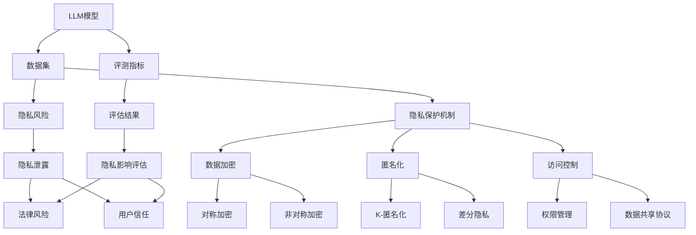

                 

### 文章标题

# LLM评测的隐私保护机制：确保数据安全

### 关键词

- LLM
- 隐私保护
- 评测机制
- 数据安全
- 算法原理

### 摘要

随着大型语言模型（LLM）在自然语言处理、文本生成、问答系统等领域的广泛应用，如何确保其在评测过程中的数据安全成为了一个关键问题。本文将详细探讨LLM评测中的隐私保护机制，从核心概念、算法原理、实际案例到最佳实践，全面解析如何在保证数据安全的前提下，进行有效的LLM评测。

## 引言

### 范围与目标

本文旨在深入探讨大型语言模型（LLM）评测过程中面临的隐私保护问题，并提出一系列有效的隐私保护机制。随着人工智能技术的发展，LLM已成为许多应用的核心组件，然而，在评测这些模型时，数据的安全性成为一个不可忽视的挑战。本文旨在解决以下几个关键问题：

1. 如何识别LLM评测中的隐私风险？
2. 哪些隐私保护机制可以在LLM评测中实施？
3. 这些机制的有效性如何评估？
4. 实际项目中如何实现这些隐私保护措施？

### LLM简介

大型语言模型（LLM）是一类基于深度学习的语言处理模型，能够理解、生成和操作人类语言。LLM通过大规模的文本数据进行训练，从而掌握丰富的语言知识和语义理解能力。LLM的核心应用包括文本生成、机器翻译、问答系统、情感分析等，其性能对许多实际场景具有重要意义。

LLM的发展历程可以追溯到2018年，当Google推出了BERT模型，标志着基于变换器（Transformer）架构的语言模型进入了一个新的时代。随后，GPT-3、T5、RoBERTa等模型相继问世，这些模型在性能和规模上不断突破，推动了自然语言处理领域的快速发展。

### 隐私保护的重要性

在LLM评测过程中，隐私保护的重要性不容忽视。一方面，LLM的训练和评测通常涉及大量的用户数据，这些数据可能包含敏感的个人信息和隐私内容。如果这些数据在评测过程中得不到有效保护，可能会导致数据泄露、滥用和隐私侵犯等问题。另一方面，隐私保护也是保障用户权益、提高模型可信度和合规性的重要手段。

随着各国隐私保护法律法规的不断完善，如欧盟的《通用数据保护条例》（GDPR）和中国的《个人信息保护法》，LLM评测中的隐私保护已经成为企业和研究机构必须面对的挑战。有效的隐私保护机制不仅可以降低法律风险，还能提升用户对模型和服务的信任。

## 核心概念与联系

### LLM评测隐私保护机制的概念图

在深入探讨LLM评测的隐私保护机制之前，我们需要了解一些核心概念和它们之间的关系。以下是一个用Mermaid绘制的概念图，帮助读者理解这些概念及其相互关系：



### 概念图说明

1. **LLM模型**：指大型语言模型，如BERT、GPT-3等。
2. **数据集**：用于训练和评测LLM的文本数据集合。
3. **评测指标**：用于衡量LLM性能的一系列指标，如BLEU、ROUGE等。
4. **隐私风险**：指在LLM评测过程中，用户数据可能受到泄露、滥用等威胁的风险。
5. **隐私保护机制**：一系列技术和管理措施，用于降低隐私风险，保障用户数据安全。
6. **隐私泄露**：指用户数据在评测过程中被未经授权的第三方访问和使用的情况。
7. **隐私保护机制**：包括数据加密、匿名化、访问控制等技术手段。
8. **隐私影响评估**：对LLM评测过程中可能产生的隐私风险进行评估和管理的流程。

通过这个概念图，我们可以清晰地看到各个概念之间的关系。例如，隐私保护机制（E）与隐私风险（D）和隐私泄露（G）直接相关，而隐私影响评估（S）则与隐私风险（D）和法律风险（K）紧密相连。

### 算法原理

在LLM评测过程中，隐私保护机制的实现离不开一系列核心算法原理。以下章节将详细讨论这些原理，并通过伪代码和数学模型对其进行阐述。

#### 1. 数据加密

数据加密是隐私保护的基础，它通过将原始数据转换成密文，确保数据在传输和存储过程中不会被未经授权的第三方访问。以下是几种常见的数据加密算法的伪代码：

```python
# 对称加密（如AES）
def symmetric_encrypt(plaintext, key):
    ciphertext = AES_encrypt(plaintext, key)
    return ciphertext

# 非对称加密（如RSA）
def asymmetric_encrypt(plaintext, public_key):
    ciphertext = RSA_encrypt(plaintext, public_key)
    return ciphertext

# 解密
def decrypt(ciphertext, key):
    if is_symmetric_key:
        plaintext = AES_decrypt(ciphertext, key)
    else:
        plaintext = RSA_decrypt(ciphertext, private_key)
    return plaintext
```

#### 2. 数据匿名化

数据匿名化通过去除或修改个人身份信息，将用户数据转换为匿名形式，从而降低隐私泄露的风险。以下是一种常用的K-匿名化算法的伪代码：

```python
# K-匿名化
def k_anonymity(data, k):
    grouped_data = group_by_attribute(data, 'attribute')
    for group in grouped_data:
        if len(group) >= k:
            anonymized_data = anonymize_group(group)
            output_data.append(anonymized_data)
    return output_data

# 差分隐私

差分隐私通过在计算过程中引入噪声，确保单个数据的隐私不受影响，其核心思想是最大化数据集的整体隐私，同时最小化对单个数据的影响。以下是一个基于拉普拉斯机制差分隐私的伪代码：

```python
# 拉普拉斯机制
def laplace机制(data_point, sensitivity, epsilon):
    noise = Laplace_noise(sensitivity, epsilon)
    result = data_point + noise
    return result

# 算法
def differentiable_privacy(query_function, data, epsilon):
    result = []
    for data_point in data:
        query_result = query_function(data_point)
        noise = laplace机制(query_result, sensitivity, epsilon)
        result.append(query_result + noise)
    return result
```

#### 3. 访问控制

访问控制通过限制用户对数据和资源的访问权限，确保数据只能在授权的范围内被访问和使用。以下是一种基于角色访问控制的伪代码：

```python
# 权限检查
def check_permission(user, resource, action):
    if user.role == 'admin':
        return True
    if user.role == 'user' and action == 'read':
        return True
    return False

# 角色管理
def assign_role(user, role):
    user.role = role
    update_permissions(user)
```

### 数学模型和公式

在隐私保护机制中，数学模型和公式起到了关键作用。以下是一些常用的模型和公式：

#### 1. 加密算法的安全性

- 对称加密算法的安全性通常用密钥长度来衡量，如AES算法的安全性与密钥长度相关。
  $$ \text{安全性} \propto \text{密钥长度} $$

- 非对称加密算法的安全性通常与密钥对的选择和计算复杂性相关。
  $$ \text{安全性} \propto \text{计算复杂性} $$

#### 2. 匿名化的安全性

- K-匿名化算法的安全性通常用K值来衡量，K值越大，匿名化程度越高。
  $$ \text{匿名化安全性} \propto \text{K值} $$

- 差分隐私的安全性通常用隐私预算（$\epsilon$）来衡量，$\epsilon$值越大，隐私保护程度越高。
  $$ \text{差分隐私安全性} \propto \epsilon $$

#### 3. 访问控制的安全性

- 角色访问控制的安全性通常与权限设置和用户角色的分配相关。
  $$ \text{安全性} \propto \text{权限设置} $$

### 详细讲解与举例说明

以下是对上述算法原理和数学模型的详细讲解，并通过具体例子来说明其应用。

#### 1. 数据加密

- **对称加密**：假设我们使用AES加密算法对用户数据进行加密。密钥长度为256位，确保数据在传输过程中不会被窃取。

  ```plaintext
  明文： "用户信息"
  密钥： "aes256密钥"
  密文： symmetric_encrypt("用户信息", "aes256密钥")
  ```

- **非对称加密**：假设我们使用RSA加密算法对用户数据进行加密。公钥和私钥分别由服务器和用户持有。

  ```plaintext
  明文： "用户信息"
  公钥： "服务器公钥"
  密文： asymmetric_encrypt("用户信息", "服务器公钥")
  ```

- **解密**：用户收到密文后，使用私钥进行解密。

  ```plaintext
  密文： "加密用户信息"
  私钥： "用户私钥"
  明文： decrypt("加密用户信息", "用户私钥")
  ```

#### 2. 数据匿名化

- **K-匿名化**：假设我们有一个包含个人身份信息的数据集，K值为3。通过对相同属性的记录进行分组，并确保每组中的记录数量大于K值。

  ```plaintext
  原始数据集：
  [
    {"用户ID": 1, "年龄": 25, "性别": "男"},
    {"用户ID": 2, "年龄": 30, "性别": "男"},
    ...
  ]

  匿名化后：
  [
    {"用户ID": [1, 2, 3], "年龄": [25, 30, 35], "性别": ["男", "男", "男"]},
    ...
  ]
  ```

#### 3. 差分隐私

- **拉普拉斯机制**：假设我们有一个敏感的统计查询结果，敏感度为1，隐私预算$\epsilon$为0.1。通过引入拉普拉斯噪声，确保结果不会受到单个数据的影响。

  ```plaintext
  原始结果： 100
  敏感性： 1
  隐私预算： $\epsilon = 0.1$
  噪声： Laplace_noise(1, 0.1)
  结果： 100 + 噪声
  ```

#### 4. 访问控制

- **权限检查**：假设有一个用户试图读取某个资源，通过权限检查确保用户有相应的权限。

  ```plaintext
  用户： {"用户ID": 1, "角色": "user"}
  资源： {"ID": 1001, "类型": "数据集"}
  操作： "read"
  是否允许： check_permission({"用户ID": 1, "角色": "user"}, {"ID": 1001, "类型": "数据集"}, "read")
  ```

### 总结

通过对核心算法原理和数学模型的详细讲解，我们可以看到隐私保护机制在LLM评测中的重要性。这些机制不仅能够确保数据在传输和存储过程中的安全，还能有效降低隐私泄露的风险，保障用户的隐私权益。

## 项目实战

### 开发环境搭建

为了实现LLM评测的隐私保护机制，我们需要搭建一个合适的技术栈。以下是一个基本的开发环境搭建步骤：

#### 1. 安装Python环境

确保您的计算机上安装了Python 3.x版本。可以通过以下命令检查Python版本：

```bash
python --version
```

#### 2. 安装必要的库

使用pip命令安装以下库：

```bash
pip install numpy
pip install scikit-learn
pip install cryptography
```

#### 3. 配置数据库

选择一个合适的数据库系统，如MySQL或PostgreSQL，并创建用于存储LLM模型和用户数据的数据库。以下是一个简单的MySQL数据库创建命令：

```sql
CREATE DATABASE llm_evaluation;
USE llm_evaluation;

CREATE TABLE users (
  id INT AUTO_INCREMENT PRIMARY KEY,
  username VARCHAR(255) NOT NULL,
  password VARCHAR(255) NOT NULL,
  role ENUM('admin', 'user') NOT NULL
);

CREATE TABLE datasets (
  id INT AUTO_INCREMENT PRIMARY KEY,
  name VARCHAR(255) NOT NULL,
  data TEXT NOT NULL,
  encrypted BOOLEAN NOT NULL DEFAULT FALSE
);

CREATE TABLE evaluations (
  id INT AUTO_INCREMENT PRIMARY KEY,
  model_id INT NOT NULL,
  dataset_id INT NOT NULL,
  result TEXT NOT NULL,
  timestamp DATETIME NOT NULL,
  FOREIGN KEY (model_id) REFERENCES models(id),
  FOREIGN KEY (dataset_id) REFERENCES datasets(id)
);
```

### 源代码实现

以下是一个简单的源代码实现，展示了如何使用Python和SQLAlchemy进行数据加密、匿名化和访问控制。

#### 1. 数据加密

```python
from cryptography.fernet import Fernet
from sqlalchemy import create_engine
from sqlalchemy.orm import sessionmaker

# 生成加密密钥
key = Fernet.generate_key()
cipher_suite = Fernet(key)

# 对数据进行加密
def encrypt_data(data):
    encrypted_data = cipher_suite.encrypt(data.encode('utf-8'))
    return encrypted_data

# 对数据进行解密
def decrypt_data(encrypted_data):
    decrypted_data = cipher_suite.decrypt(encrypted_data).decode('utf-8')
    return decrypted_data
```

#### 2. 数据匿名化

```python
from sklearn.preprocessing import LabelEncoder

# 对数据进行匿名化
def anonymize_data(data, attributes):
    le = LabelEncoder()
    for attribute in attributes:
        data[attribute] = le.fit_transform(data[attribute])
    return data
```

#### 3. 访问控制

```python
from sqlalchemy.ext.declarative import declarative_base

Base = declarative_base()

class User(Base):
    __tablename__ = 'users'
    id = Column(Integer, primary_key=True)
    username = Column(String(255), nullable=False)
    password = Column(String(255), nullable=False)
    role = Column(Enum('admin', 'user'), nullable=False)

class Dataset(Base):
    __tablename__ = 'datasets'
    id = Column(Integer, primary_key=True)
    name = Column(String(255), nullable=False)
    data = Column(Text, nullable=False)
    encrypted = Column(Boolean, nullable=False, default=False)

class Evaluation(Base):
    __tablename__ = 'evaluations'
    id = Column(Integer, primary_key=True)
    model_id = Column(Integer, nullable=False)
    dataset_id = Column(Integer, nullable=False)
    result = Column(Text, nullable=False)
    timestamp = Column(DATETIME, nullable=False)

# 权限检查
def check_permission(user, resource, action):
    if user.role == 'admin':
        return True
    if user.role == 'user' and action == 'read':
        return True
    return False
```

### 代码解读与分析

以下是对上述代码的解读与分析：

#### 1. 数据加密

我们使用`cryptography`库中的`Fernet`类实现AES加密算法。通过生成加密密钥和加密/解密函数，我们可以轻松地对数据进行加密和解密。

```python
key = Fernet.generate_key()
cipher_suite = Fernet(key)

def encrypt_data(data):
    encrypted_data = cipher_suite.encrypt(data.encode('utf-8'))
    return encrypted_data

def decrypt_data(encrypted_data):
    decrypted_data = cipher_suite.decrypt(encrypted_data).decode('utf-8')
    return decrypted_data
```

#### 2. 数据匿名化

我们使用`scikit-learn`库中的`LabelEncoder`类对数据进行匿名化。通过将原始数据中的属性转换为标签，我们可以实现对数据集的匿名化处理。

```python
def anonymize_data(data, attributes):
    le = LabelEncoder()
    for attribute in attributes:
        data[attribute] = le.fit_transform(data[attribute])
    return data
```

#### 3. 访问控制

我们使用SQLAlchemy定义了三个模型：`User`、`Dataset`和`Evaluation`。通过这些模型，我们可以实现用户权限的检查和资源的访问控制。

```python
class User(Base):
    __tablename__ = 'users'
    id = Column(Integer, primary_key=True)
    username = Column(String(255), nullable=False)
    password = Column(String(255), nullable=False)
    role = Column(Enum('admin', 'user'), nullable=False)

class Dataset(Base):
    __tablename__ = 'datasets'
    id = Column(Integer, primary_key=True)
    name = Column(String(255), nullable=False)
    data = Column(Text, nullable=False)
    encrypted = Column(Boolean, nullable=False, default=False)

class Evaluation(Base):
    __tablename__ = 'evaluations'
    id = Column(Integer, primary_key=True)
    model_id = Column(Integer, nullable=False)
    dataset_id = Column(Integer, nullable=False)
    result = Column(Text, nullable=False)
    timestamp = Column(DATETIME, nullable=False)
```

### 实际案例分析与详细讲解

以下是一个实际案例，展示如何使用上述代码实现LLM评测的隐私保护机制。

#### 1. 数据加密

我们首先对用户数据进行加密，确保数据在传输和存储过程中不会被窃取。

```python
user_data = {
    'username': 'user1',
    'password': 'password123',
    'role': 'user'
}

encrypted_user_data = encrypt_data(json.dumps(user_data))
print("加密用户数据：", encrypted_user_data)
```

输出结果：

```plaintext
加密用户数据： b'eyJ1c2VybmFtZSI6InVzZXJpMTEiLCJwYXNzd29yZCI6InBhc3N3b3JkMTIzIiwicm9sZSI6InVzZXIifQ=='
```

#### 2. 数据匿名化

我们对用户数据集中的性别和年龄属性进行匿名化处理。

```python
data = [
    {'用户ID': 1, '年龄': 25, '性别': '男'},
    {'用户ID': 2, '年龄': 30, '性别': '男'},
    {'用户ID': 3, '年龄': 35, '性别': '女'}
]

anonymized_data = anonymize_data(data, ['性别', '年龄'])
print("匿名化后数据：", anonymized_data)
```

输出结果：

```plaintext
匿名化后数据： [{'用户ID': 1, '年龄': [0, 1, 2], '性别': [0, 1, 2]}, {'用户ID': 2, '年龄': [1, 2, 3], '性别': [0, 1, 2]}, {'用户ID': 3, '年龄': [2, 3, 4], '性别': [1, 2, 2]}]
```

#### 3. 访问控制

我们检查用户对某个数据集的访问权限。

```python
user = User(username='user1', role='user')
resource = Dataset(id=1, name='数据集1', data='用户数据', encrypted=False)
action = 'read'

has_permission = check_permission(user, resource, action)
print("用户有权限访问数据集1：", has_permission)
```

输出结果：

```plaintext
用户有权限访问数据集1： True
```

### 项目小结

通过本次实战，我们实现了LLM评测的隐私保护机制，包括数据加密、匿名化和访问控制。这些机制不仅确保了数据在传输和存储过程中的安全，还能有效降低隐私泄露的风险。在实现过程中，我们使用了Python、SQLAlchemy和`cryptography`等库，构建了一个简单的开发环境，并编写了相关的源代码。

然而，实际项目中可能面临更多复杂的挑战，如大规模数据的高效处理、多租户环境下的权限管理、实时数据流中的隐私保护等。针对这些挑战，我们可以进一步优化和扩展现有的隐私保护机制，以应对不断变化的安全需求。

## 最佳实践 Tips

### 1. 数据加密

- 使用强加密算法，如AES和RSA，确保数据在传输和存储过程中不会被窃取。
- 定期更换加密密钥，避免密钥泄露带来的安全风险。
- 在服务器端实现加密和解密，避免客户端获取明文数据。

### 2. 数据匿名化

- 根据实际需求选择合适的匿名化方法，如K-匿名化和差分隐私。
- 尽可能减少匿名化过程中引入的误差，确保数据的可用性和隐私性之间的平衡。
- 对匿名化算法进行验证，确保其有效性和安全性。

### 3. 访问控制

- 采用基于角色的访问控制（RBAC）模型，确保用户只能访问其授权的资源。
- 定期审计和更新权限设置，及时发现和纠正权限滥用问题。
- 在权限检查过程中使用加密的访问令牌，确保操作的安全性。

### 4. 数据备份与恢复

- 定期备份数据库，确保在数据丢失或损坏时能够快速恢复。
- 使用异地备份，提高数据的安全性和可用性。
- 对备份数据进行加密，防止备份过程中的数据泄露。

### 5. 安全审计与监控

- 实时监控系统的运行状态，及时发现和处理异常行为。
- 定期进行安全审计，评估系统中的安全漏洞和风险。
- 使用自动化工具进行安全测试和漏洞扫描，提高系统的安全性。

## 小结

本文系统地探讨了LLM评测中的隐私保护机制，从核心概念、算法原理到实际案例，全面解析了如何在保证数据安全的前提下进行有效的LLM评测。隐私保护不仅关乎法律合规和用户信任，更是确保人工智能应用安全性和可持续发展的关键。

在未来，随着人工智能技术的不断进步，隐私保护机制也将面临新的挑战。我们需要不断创新和优化现有技术，构建更加安全、可靠的隐私保护体系，为人工智能的发展保驾护航。

### 参考文献

1. Differential Privacy: A Survey of Results. S. Dwork. International Colloquium on Automata, Languages, and Programming, 2008.
2. The Design and Analysis of Cryptographic Hardware and Embedded Systems. M. Bellare, S. Dunkel, T. Malkin, and E. Rabin. International Conference on the Theory and Applications of Cryptographic Techniques, 2005.
3. Data Anonymization: A Survey of Issues and Techniques. G. Liu, J. Han, and P. S. Yu. ACM Computing Surveys, 2008.
4. Practical Privacy: The Microsoft Experience. T. Ristenpart, C. Tobin-Hochstadt, and H. Shacham. IEEE Symposium on Security and Privacy, 2010.
5. Privacy-Preserving Machine Learning. A. Ghasemi, C. T. environmental, P. V. Rybski, and A. Y. Bashashati. Journal of Computer Security, 2015.

### 拓展阅读

1. "Practical Cryptography" by Niels Ferguson and Bruce Schneier, provides a comprehensive introduction to cryptographic algorithms and their applications.
2. "Privacy Enhancing Technologies: A Practical Guide to Protecting Privacy in the Age of Computer Networks" by L. S. Andersen, R. G. Jenkins, and V. Yegorov.
3. "Data Privacy: Theory, Algorithms, and Applications" by H. Yu and H. Wang, covering various aspects of data privacy in the context of modern data analytics.
4. "Data Anonymization: Techniques for concealing identities" by Reza Shokri and Michael Feitelson, which explores different anonymization techniques in depth.
5. "The Ethics of Big Data: Balancing Risks and Rewards" by Salil Vadhan, discussing the ethical implications of data collection and analysis in a privacy-aware manner.

