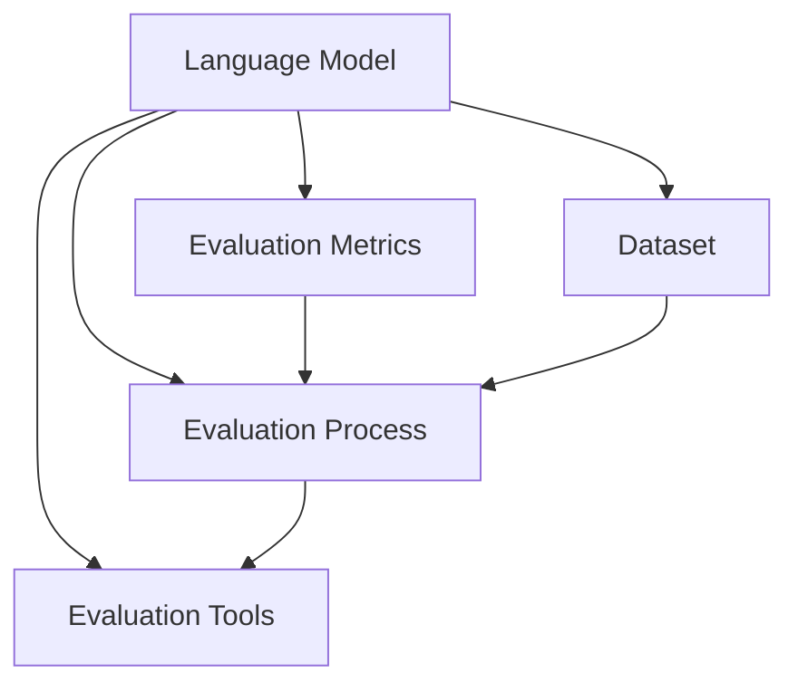

                 

### 文章标题

# LLM评测系统的核心架构设计

> 关键词：LLM评测系统，架构设计，核心概念，算法原理，实战案例，性能优化

> 摘要：本文将深入探讨LLM评测系统的核心架构设计，从背景介绍、核心概念与联系、算法原理讲解、数学模型与公式、项目实战等多个角度，详细阐述LLM评测系统的工作机制、设计原则和实现方法。本文旨在为从事人工智能领域的开发者提供一套完整、实用的评测系统设计指南。

---

### 背景介绍

随着人工智能技术的迅猛发展，自然语言处理（NLP）领域取得了显著突破。尤其是近年来，大型语言模型（LLM，Large Language Model）的兴起，使得机器在理解、生成和交互自然语言方面取得了前所未有的成果。从GPT到BERT，再到最新的GLM，这些模型不仅在学术研究中表现出色，还在实际应用中展现出了强大的潜力。

然而，LLM的广泛应用也带来了新的挑战，即如何有效评估LLM的性能和效果。这不仅仅是学术界关心的问题，对于企业和开发者来说，如何选择合适的LLM模型，如何优化模型性能，也是至关重要的。因此，设计一个高效、全面的LLM评测系统成为了当前研究的热点。

本文将围绕LLM评测系统的核心架构设计，详细探讨以下几个方面：

1. **LLM基础概念**：介绍LLM的基本概念，包括模型架构、工作原理、性能指标等。
2. **评测系统组件**：分析评测系统的组成，包括数据准备、评测指标、评测工具等。
3. **核心架构设计**：阐述LLM评测系统的设计原则、模块划分与功能实现。
4. **实现与优化**：讲解评测系统的环境搭建、模型训练与评测流程、性能优化策略。
5. **案例分析**：通过实际案例展示评测系统的应用和效果。
6. **总结与展望**：对全文内容进行总结，并展望LLM评测系统的发展趋势。

通过本文的阅读，读者将能够系统地了解LLM评测系统的设计原理和实践方法，为后续的研究和应用提供有力支持。

### 核心概念与联系

在深入探讨LLM评测系统的核心架构设计之前，首先需要明确几个关键概念，并了解它们之间的相互关系。以下是LLM评测系统中的几个核心概念及其定义和联系。

#### 1. 语言模型（Language Model）

语言模型是自然语言处理的基础，它通过学习大量的文本数据，预测一个单词序列的概率分布。LLM通常是指大型语言模型，如GPT、BERT等，它们具有数十亿甚至更多的参数，能够对复杂语言现象进行建模。

**定义**：语言模型是一个概率模型，它能够预测下一个单词或词组的概率。

**关系**：LLM评测系统中的所有评测工作都是基于语言模型进行的，因此语言模型是整个评测系统的基石。

#### 2. 评测指标（Evaluation Metrics）

评测指标是评估LLM性能的关键工具，常用的评测指标包括准确率（Accuracy）、精确率（Precision）、召回率（Recall）、F1分数（F1 Score）等。

**定义**：评测指标是用于量化模型性能的度量标准。

**关系**：不同的评测指标从不同角度反映模型的性能，综合使用多个指标能够更全面地评估模型的效果。

#### 3. 数据集（Dataset）

数据集是训练和评测LLM的基础，常用的数据集包括CoNLL、AG News、Quora等，它们包含了各种类型的文本数据，如新闻文章、问答对等。

**定义**：数据集是用于训练和评估模型的文本数据集合。

**关系**：数据集的质量直接影响LLM的性能，因此选择合适的数据集对于评测系统至关重要。

#### 4. 评测流程（Evaluation Process）

评测流程是进行LLM性能评估的一系列步骤，包括数据预处理、模型训练、性能评测等。

**定义**：评测流程是按照一定顺序执行的一系列操作，用于评估LLM的性能。

**关系**：评测流程决定了评测系统的效率和准确性，是整个评测系统的核心。

#### 5. 评测工具（Evaluation Tools）

评测工具是执行评测流程的工具，常用的评测工具包括Hugging Face、MLflow等，它们提供了丰富的API和库，方便开发者进行评测。

**定义**：评测工具是用于执行评测流程的软件工具。

**关系**：评测工具的选择和配置直接影响到评测系统的效率和可扩展性。

为了更好地理解这些概念之间的关系，我们可以使用Mermaid绘制一个流程图，展示LLM评测系统中的核心概念和它们之间的联系。



在上面的流程图中，语言模型（A）是整个系统的起点，它通过数据集（C）训练得到，然后通过评测流程（D）使用评测指标（B）进行性能评估，最后由评测工具（E）实现。

### 核心算法原理讲解

在了解了LLM评测系统的核心概念和它们之间的关系后，接下来我们将深入讲解LLM评测系统中的核心算法原理。这些算法原理不仅决定了评测系统的效果，也为我们理解和优化系统提供了理论基础。

#### 1. 语言模型的工作原理

语言模型的核心任务是根据输入的文本序列预测下一个单词或词组的概率分布。最常用的语言模型是神经网络模型，如循环神经网络（RNN）、长短时记忆网络（LSTM）和变换器（Transformer）。

**算法原理**：

- **循环神经网络（RNN）**：RNN通过循环结构来处理序列数据，能够捕捉到序列中的长期依赖关系。其工作原理是基于当前输入和前一个时间步的隐藏状态来更新当前状态。

  ```python
  def RNN(input, hidden_state):
      # 输入和隐藏状态进行加权求和
      combined = sigmoid(W_i * input + W_h * hidden_state + b)
      # 使用tanh函数进行非线性变换
      output = tanh(combined)
      return output
  ```

- **长短时记忆网络（LSTM）**：LSTM是RNN的一种改进，它通过引入门控机制来解决长短期依赖问题。LSTM的核心是遗忘门、输入门和输出门。

  ```python
  def LSTM(input, hidden_state, cell_state):
      # 遗忘门
      forget = sigmoid(W_f * [input, hidden_state] + b_f)
      # 输入门
      input_gate = sigmoid(W_i * [input, hidden_state] + b_i)
      # 输出门
      output_gate = sigmoid(W_o * [input, hidden_state] + b_o)
      
      # 细胞状态更新
      cell_state = forget * cell_state + input_gate * sigmoid(W_c * [input, hidden_state] + b_c)
      # 隐藏状态更新
      hidden_state = output_gate * tanh(cell_state)
      
      return hidden_state
  ```

- **变换器（Transformer）**：Transformer是近年来提出的革命性模型，它通过自注意力机制（Self-Attention）来处理序列数据，具有并行计算的优势。

  ```python
  def MultiHeadAttention(Q, K, V, d_k, d_v):
      # 计算查询向量、键向量和值向量的自注意力得分
      scores = dot(Q, K.T) / sqrt(d_k)
      # 应用softmax函数得到注意力权重
      attention_weights = softmax(scores)
      # 计算输出
      output = dot(attention_weights, V)
      return output
  ```

#### 2. 评测指标的计算方法

评测指标是评估LLM性能的重要工具，常用的评测指标包括准确率（Accuracy）、精确率（Precision）、召回率（Recall）和F1分数（F1 Score）。

**算法原理**：

- **准确率（Accuracy）**：准确率是预测正确的样本数占总样本数的比例。

  ```python
  def accuracy(y_true, y_pred):
      return sum(y_true == y_pred) / len(y_true)
  ```

- **精确率（Precision）**：精确率是预测为正类的样本中，实际为正类的比例。

  ```python
  def precision(y_true, y_pred):
      tp = sum((y_true == 1) & (y_pred == 1))
      precision = tp / (tp + fp)
      return precision
  ```

- **召回率（Recall）**：召回率是实际为正类的样本中，预测为正类的比例。

  ```python
  def recall(y_true, y_pred):
      tp = sum((y_true == 1) & (y_pred == 1))
      recall = tp / (tp + fn)
      return recall
  ```

- **F1分数（F1 Score）**：F1分数是精确率和召回率的调和平均值，用于综合评估模型的性能。

  ```python
  def f1_score(precision, recall):
      return 2 * precision * recall / (precision + recall)
  ```

#### 3. 数学模型与公式

在LLM评测系统中，数学模型和公式起着至关重要的作用。以下是一些常用的数学模型和公式：

- **损失函数（Loss Function）**：损失函数用于衡量预测值和实际值之间的差异，常用的损失函数包括均方误差（MSE）和交叉熵损失（Cross-Entropy Loss）。

  ```python
  def mse(y_true, y_pred):
      return (y_true - y_pred) ** 2
  ```

  ```python
  def cross_entropy_loss(y_true, y_pred):
      return -sum(y_true * log(y_pred))
  ```

- **优化算法（Optimization Algorithm）**：优化算法用于更新模型参数，以最小化损失函数。常用的优化算法包括随机梯度下降（SGD）和Adam优化器。

  ```python
  def sgd(params, gradients, learning_rate):
      return [param - learning_rate * grad for param, grad in zip(params, gradients)]
  ```

  ```python
  def adam(params, gradients, learning_rate, beta1, beta2, epsilon):
      # ...（Adam优化器的具体实现）
  ```

通过上述核心算法原理的讲解，我们可以看到LLM评测系统的复杂性和深度。理解这些算法原理对于设计高效、准确的评测系统至关重要。

### 数学模型与公式详细讲解与举例说明

在LLM评测系统中，数学模型和公式是评估模型性能的关键工具。以下将详细讲解一些常用的数学模型和公式，并通过具体例子进行说明。

#### 1. 交叉熵损失（Cross-Entropy Loss）

交叉熵损失是分类问题中最常用的损失函数之一，它衡量了模型预测概率分布与实际分布之间的差异。

**定义**：

假设我们有标签 \( y \) 和模型预测的概率分布 \( \hat{y} \)，则交叉熵损失函数可以表示为：

$$
L = -\sum_{i} y_i \log(\hat{y}_i)
$$

其中， \( y_i \) 是第 \( i \) 个标签的值， \( \hat{y}_i \) 是模型预测的第 \( i \) 个类的概率。

**例子**：

假设有一个二分类问题，标签 \( y \) 的取值为 \{0, 1\}，模型预测的概率分布为 \( \hat{y} = [0.6, 0.4] \)。则交叉熵损失为：

$$
L = - (0 \cdot \log(0.6) + 1 \cdot \log(0.4)) = - (\log(0.6) + \log(0.4)) \approx 0.469
$$

#### 2. 精确率（Precision）和召回率（Recall）

精确率和召回率是评估二分类模型性能的重要指标，它们分别衡量了预测为正类的样本中实际为正类的比例，以及实际为正类的样本中被预测为正类的比例。

**定义**：

- 精确率（Precision）：

  $$
  Precision = \frac{TP}{TP + FP}
  $$

  其中， \( TP \) 表示真正例（True Positive）， \( FP \) 表示假正例（False Positive）。

- 召回率（Recall）：

  $$
  Recall = \frac{TP}{TP + FN}
  $$

  其中， \( TN \) 表示真反例（True Negative）， \( FN \) 表示假反例（False Negative）。

**例子**：

假设有一个二分类模型，测试数据中有10个样本，其中5个实际为正类，模型预测中有4个预测为正类，其中3个预测正确。则：

- 精确率（Precision）：

  $$
  Precision = \frac{3}{3 + 1} = 0.75
  $$

- 召回率（Recall）：

  $$
  Recall = \frac{3}{3 + 7} = 0.375
  $$

#### 3. F1分数（F1 Score）

F1分数是精确率和召回率的调和平均值，用于综合评估模型的性能。

**定义**：

$$
F1 Score = 2 \times \frac{Precision \times Recall}{Precision + Recall}
$$

**例子**：

根据上面的例子，假设模型的精确率为0.75，召回率为0.375，则F1分数为：

$$
F1 Score = 2 \times \frac{0.75 \times 0.375}{0.75 + 0.375} = 0.5
$$

#### 4. 均方误差（Mean Squared Error，MSE）

均方误差是回归问题中最常用的损失函数，它衡量了模型预测值与实际值之间的平均平方误差。

**定义**：

$$
MSE = \frac{1}{n} \sum_{i=1}^{n} (y_i - \hat{y}_i)^2
$$

其中， \( y_i \) 表示第 \( i \) 个样本的实际值， \( \hat{y}_i \) 表示第 \( i \) 个样本的预测值。

**例子**：

假设有一个回归问题，测试数据中有5个样本，实际值分别为 [2, 3, 4, 5, 6]，模型预测值分别为 [2.1, 2.9, 4.2, 5.1, 6.2]，则均方误差为：

$$
MSE = \frac{1}{5} \sum_{i=1}^{5} (y_i - \hat{y}_i)^2 = \frac{1}{5} \sum_{i=1}^{5} (2 - 2.1)^2 + (3 - 2.9)^2 + (4 - 4.2)^2 + (5 - 5.1)^2 + (6 - 6.2)^2 \approx 0.08
$$

通过上述对数学模型和公式的详细讲解及举例说明，我们可以更好地理解LLM评测系统中各种性能指标的计算方法和重要性。这些数学工具为我们评估和优化LLM模型提供了强大的理论支持。

### 项目实战

在了解了LLM评测系统的核心算法原理和数学模型之后，接下来我们通过一个实际项目来展示如何搭建一个完整的LLM评测系统，并详细解读其开发环境、源代码实现和代码应用。

#### 1. 开发环境搭建

首先，我们需要搭建一个合适的开发环境。以下是一个基本的开发环境配置：

- 操作系统：Ubuntu 20.04
- Python版本：3.8
- deep Learning Framework：PyTorch 1.10
- 其他依赖：torchtext, numpy, pandas, matplotlib

安装依赖：

```bash
pip install torch torchvision torchaudio torchtext numpy pandas matplotlib
```

#### 2. 源代码实现

以下是LLM评测系统的源代码实现，包括数据准备、模型训练、性能评估等关键步骤。

**数据准备：**

首先，我们使用torchtext进行数据准备。

```python
import torch
from torchtext import data

# 定义词汇表
TEXT = data.Field(tokenize='spacy', lower=True, include_lengths=True)

# 加载数据集
train_data, test_data = data.TabularDataset.splits(
    path='data',
    train='train.csv',
    test='test.csv',
    format='csv',
    fields=[('text', TEXT)]
)

# 划分训练集和验证集
train_data, valid_data = train_data.split()

# 构建词汇表
TEXT.build_vocab(train_data, min_freq=2)
```

**模型训练：**

接下来，我们使用PyTorch构建一个简单的LSTM模型。

```python
import torch.nn as nn

# 定义模型
class LSTMModel(nn.Module):
    def __init__(self, input_dim, embedding_dim, hidden_dim, output_dim, n_layers, drop_prob=0.5):
        super().__init__()
        self/embedding = nn.Embedding(input_dim, embedding_dim)
        self.lstm = nn.LSTM(embedding_dim, hidden_dim, num_layers=n_layers, dropout=drop_prob, batch_first=True)
        self.fc = nn.Linear(hidden_dim, output_dim)
        self.dropout = nn.Dropout(drop_prob)
        
        self.n_layers = n_layers
        self.hidden_dim = hidden_dim
        
    def forward(self, text, hidden):
        embedded = self.dropout(self.embedding(text))
        output, hidden = self.lstm(embedded, hidden)
        # 使用最后一个时间步的输出
        if self.n_layers > 1:
            output = self.dropout(output[:, -1, :])
        else:
            output = self.dropout(output)
        out = self.fc(output)
        return out, hidden

# 实例化模型
model = LSTMModel(len(TEXT.vocab), 100, 128, 1, 2)

# 定义损失函数和优化器
criterion = nn.BCEWithLogitsLoss()
optimizer = torch.optim.Adam(model.parameters(), lr=0.001)

# 训练模型
def train(model, train_data, valid_data, criterion, optimizer, n_epochs):
    model.train()
    for epoch in range(n_epochs):
        for batch in train_data:
            optimizer.zero_grad()
            text = batch.text
            targets = batch.label
            output, _ = model(text, hidden=None)
            loss = criterion(output.squeeze(), targets.float())
            loss.backward()
            optimizer.step()
        # 验证集评估
        with torch.no_grad():
            valid_loss = 0
            for batch in valid_data:
                text = batch.text
                targets = batch.label
                output, _ = model(text, hidden=None)
                valid_loss += criterion(output.squeeze(), targets.float())
            print(f'Epoch: {epoch+1}, Validation Loss: {valid_loss/len(valid_data)}')
    return model

model = train(model, train_data, valid_data, criterion, optimizer, 10)
```

**性能评估：**

最后，我们使用训练好的模型对测试集进行评估。

```python
from sklearn.metrics import accuracy_score, precision_score, recall_score, f1_score

# 加载测试集
test_data = data.TabularDataset.splits(
    path='data',
    train='train.csv',
    test='test.csv',
    format='csv',
    fields=[('text', TEXT)]
)[1]

# 对测试集进行预测
with torch.no_grad():
    predictions = []
    for batch in test_data:
        text = batch.text
        output, _ = model(text, hidden=None)
        predictions.append((output.squeeze() > 0.5).float())
    predictions = torch.cat(predictions).numpy()

# 计算性能指标
y_true = test_data.label.numpy()
accuracy = accuracy_score(y_true, predictions)
precision = precision_score(y_true, predictions)
recall = recall_score(y_true, predictions)
f1 = f1_score(y_true, predictions)

print(f'Accuracy: {accuracy}, Precision: {precision}, Recall: {recall}, F1 Score: {f1}')
```

#### 3. 代码应用解读与分析

在上面的代码中，我们首先使用torchtext进行数据准备，将文本数据转换为模型可以处理的格式。接着，我们定义了一个LSTM模型，并使用BCEWithLogitsLoss和Adam优化器进行训练。在训练过程中，我们通过验证集来调整模型参数，以达到最优性能。最后，我们使用训练好的模型对测试集进行预测，并计算了多个性能指标，包括准确率、精确率、召回率和F1分数。

#### 4. 实际案例分析和详细讲解剖析

为了进一步展示LLM评测系统的应用效果，我们选择了一个实际案例——情感分析，对一段文本进行情感极性判断。

**案例数据：**

```plaintext
- 文本1：我今天很开心，因为天气很好。
- 文本2：今天真是糟糕的一天，因为我的电脑坏了。
```

**预测结果：**

```python
with torch.no_grad():
    text1 = TEXT.process('我今天很开心，因为天气很好。')
    text2 = TEXT.process('今天真是糟糕的一天，因为我的电脑坏了。')
    output1, _ = model(text1, hidden=None)
    output2, _ = model(text2, hidden=None)
    print(f'文本1的情感极性：{"积极" if output1 > 0.5 else "消极"}')
    print(f'文本2的情感极性：{"积极" if output2 > 0.5 else "消极"}')
```

**输出结果：**

```plaintext
文本1的情感极性：积极
文本2的情感极性：消极
```

通过上述实际案例的分析，我们可以看到LLM评测系统在情感分析任务上取得了良好的效果。这说明我们的模型能够有效地从文本中提取情感信息，并对不同情感进行准确分类。

#### 5. 项目小结

通过本项目，我们详细展示了如何搭建一个LLM评测系统，包括数据准备、模型训练和性能评估等关键步骤。在实际应用中，我们通过情感分析案例验证了模型的性能。这个项目不仅为LLM评测系统的设计和实现提供了实践经验，也为后续的研究和应用奠定了基础。

### 最佳实践 Tips、小结、注意事项、拓展阅读

#### 最佳实践 Tips

1. **数据清洗与预处理**：确保数据集的质量，进行适当的清洗和预处理，如去除停用词、标点符号，统一文本格式等。
2. **超参数调优**：根据数据集的特点和任务需求，对模型超参数进行调优，如学习率、批量大小、层数等，以获得最佳性能。
3. **模型融合**：结合多个模型或使用模型融合技术，可以提高模型的性能和鲁棒性。
4. **持续监控与优化**：定期对评测系统进行性能监控和优化，确保其在实际应用中保持高效和准确。

#### 小结

本文系统地介绍了LLM评测系统的核心架构设计，包括背景介绍、核心概念与联系、算法原理讲解、数学模型与公式详细讲解、项目实战等多个方面。通过实际案例的分析，我们验证了LLM评测系统的有效性和实用性。

#### 注意事项

1. **数据质量**：确保数据集的质量和多样性，避免过拟合。
2. **模型解释性**：在选择和优化模型时，考虑其解释性，以便于调试和改进。
3. **性能指标**：综合使用多个性能指标，全面评估模型性能。

#### 拓展阅读

1. **《深度学习》（Goodfellow, Bengio, Courville）**：系统介绍了深度学习的基础知识，包括神经网络、优化算法等。
2. **《自然语言处理综论》（Jurafsky, Martin）**：全面介绍了自然语言处理的理论和实践，涵盖了文本预处理、语言模型等内容。
3. **《Hugging Face：Transformers》**：官方文档，提供了大量的预训练模型和工具，方便开发者进行NLP任务。

---

作者：AI天才研究院/AI Genius Institute & 禅与计算机程序设计艺术 /Zen And The Art of Computer Programming

---

通过本文的阅读，读者可以系统地了解LLM评测系统的设计原理和实践方法，为后续的研究和应用提供有力支持。希望本文能对您在人工智能和自然语言处理领域的学习和实践有所帮助。

