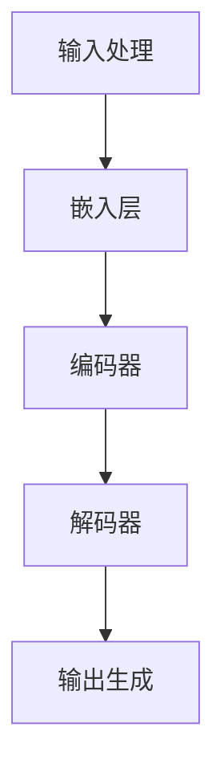
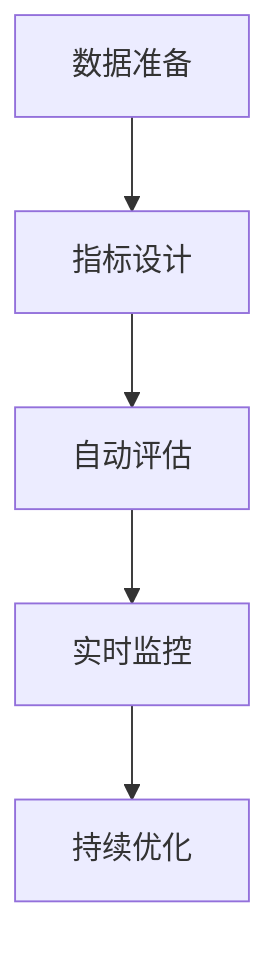

                 

### 文章标题

# LLM辅助教育内容生成质量评估

> 关键词：**大型语言模型（LLM）、教育内容生成、质量评估、人工智能、教育技术**

> 摘要：本文探讨了如何利用大型语言模型（LLM）辅助教育内容生成，并对其进行质量评估。首先，介绍了LLM的发展背景及其基本原理。然后，提出了一个系统化的教育内容生成质量评估框架，并详细讨论了评估指标和方法。接着，通过实际案例展示了LLM在教育内容生成中的应用和实践，分析了其优势与挑战。最后，对未来的发展趋势和面临的挑战进行了展望。

## 1. 设计书的总体结构

在撰写这本书的过程中，我们需要首先明确整体的结构，以确保内容逻辑清晰，条理分明，读者可以轻松理解并跟随我们的思路。这本书将主要分为以下几个部分：

### 第1章：背景与概述

在这一章中，我们将介绍大型语言模型（LLM）的发展背景，简述教育内容生成的概念及其重要性，并阐明本书的目的和结构安排。这一部分将为读者提供一个宏观的视角，帮助他们了解后续章节的内容和背景。

### 第2章：LLM基本原理

接下来，我们将详细探讨LLM的架构、训练过程和工作原理。这部分内容将帮助读者深入理解LLM的核心机制，并分析其在教育内容生成中的优势。

### 第3章：教育内容生成质量评估框架

在这一章中，我们将提出一个系统化的教育内容生成质量评估框架，包括基本概念、组成部分和功能。这一框架将为后续的质量评估提供理论基础和实践指导。

### 第4章：评估指标与方法

在这一章中，我们将讨论常用的评估指标，如准确性、多样性、相关性等，并介绍评估方法，包括自动评估和人工评估。这部分内容将帮助读者了解如何具体执行质量评估。

### 第5章：LLM辅助教育内容生成实践

在这一章中，我们将通过实际案例展示LLM在教育内容生成中的应用，并分析其优势与挑战。这部分内容将帮助读者理解LLM的实际应用场景和潜在问题。

### 第6章：评估案例研究

在这一章中，我们将深入分析几个典型的教育内容生成项目，评估其实际效果，并讨论其优缺点。这部分内容将为读者提供具体案例，帮助他们更好地理解和应用评估框架。

### 第7章：未来发展趋势与挑战

最后，在这一章中，我们将探讨LLM在教育内容生成领域的未来发展趋势，分析面临的挑战和潜在的解决方案。这部分内容将为读者提供对未来的展望和思考。

## 2. 确定各章节的细化内容

在明确整体结构后，我们需要为每一章节确定更具体的内容细节，确保章节内容之间的连贯性和完整性。以下是每个章节的细化内容：

### 第1章：背景与概述

**1.1 LLM的发展背景**

在这一部分，我们将介绍LLM的起源，包括其发展历程、关键里程碑和主要贡献者。此外，还将探讨LLM在各个领域的应用，如自然语言处理、机器翻译、文本生成等。

**1.2 教育内容生成的概念**

我们将详细解释教育内容生成的定义，包括其目的、意义和主要形式。此外，还将介绍教育内容生成在教育领域的重要性，以及其对教育工作者和学生的潜在影响。

**1.3 本书的目的与结构**

在这一部分，我们将阐明本书的研究目标，即如何利用LLM辅助教育内容生成，并对其进行质量评估。同时，我们将概述各章节的主要内容，帮助读者了解整体结构和内容安排。

### 第2章：LLM基本原理

**2.1 LLM的架构**

我们将详细介绍LLM的架构，包括其网络结构、关键组件和相互关系。这部分内容将帮助读者理解LLM的核心构成，并为其后续内容生成和理解打下基础。

**2.2 LLM的训练过程**

我们将探讨LLM的训练过程，从数据收集到模型训练，再到模型优化。这部分内容将帮助读者理解LLM如何从大量数据中学习，并不断提升其性能和表现。

**2.3 LLM的工作原理**

在这一部分，我们将深入探讨LLM的工作原理，包括语言理解、语言生成和教育内容适配。这部分内容将帮助读者理解LLM如何处理语言，并生成高质量的教育内容。

### 第3章：教育内容生成质量评估框架

**3.1 评估框架的基本概念**

我们将介绍教育内容生成质量评估框架的基本概念，包括其定义、目的和重要性。这部分内容将为读者提供评估框架的整体视角。

**3.2 评估框架的组成部分**

我们将详细讨论评估框架的组成部分，包括数据准备、指标设计和评估方法。这部分内容将帮助读者了解如何构建和实施评估框架。

**3.3 评估框架的功能**

在这一部分，我们将介绍评估框架的主要功能，包括实时监控、自动化评估和持续优化。这部分内容将帮助读者理解评估框架的实际应用和价值。

### 第4章：评估指标与方法

**4.1 常用的评估指标**

我们将讨论常用的评估指标，如准确性、多样性、相关性等，并解释每个指标的含义和作用。这部分内容将帮助读者了解如何衡量教育内容生成的质量。

**4.2 评估方法**

我们将介绍评估方法，包括自动评估和人工评估，并解释每种方法的优缺点。这部分内容将帮助读者了解如何具体执行质量评估。

### 第5章：LLM辅助教育内容生成实践

**5.1 案例分析**

我们将通过实际案例分析，展示LLM在教育内容生成中的应用，并分析其优势和挑战。这部分内容将帮助读者理解LLM的实际应用场景和潜在问题。

**5.2 优势与挑战**

在这一部分，我们将总结LLM在教育内容生成中的优势，如提高教育内容的丰富性和准确性，减轻教育工作者负担等，同时分析其面临的挑战，如模型理解偏差、数据隐私和安全问题等。这部分内容将帮助读者全面了解LLM在教育内容生成中的实际应用。

### 第6章：评估案例研究

在这一章中，我们将深入分析几个典型的教育内容生成项目，评估其实际效果，并讨论其优缺点。这部分内容将提供具体的案例研究，帮助读者更好地理解和应用评估框架。

**6.1 案例研究一：某在线教育平台的评估实践**

我们将详细分析某在线教育平台如何使用LLM辅助教育内容生成，并对其进行质量评估。这部分内容将展示评估框架在实际应用中的效果和挑战。

**6.2 案例研究二：某智能学习应用的效果分析**

我们将探讨某智能学习应用如何利用LLM生成个性化学习计划，并对其进行效果评估。这部分内容将帮助读者了解个性化学习计划的评估方法和实践。

**6.3 案例研究三：教育内容生成的质量评估工具开发**

我们将介绍如何开发一个教育内容生成的质量评估工具，包括工具的设计、实现和测试。这部分内容将帮助读者了解质量评估工具的开发过程和关键要素。

### 第7章：未来发展趋势与挑战

**7.1 未来发展趋势**

在这一部分，我们将探讨LLM在教育内容生成领域的未来发展趋势，如模型性能的提升、应用领域的扩展和评估技术的进步。这部分内容将帮助读者了解LLM在教育内容生成中的发展方向和潜力。

**7.2 面临的挑战**

在这一部分，我们将分析LLM在教育内容生成领域面临的挑战，如数据质量、模型可解释性和法律和伦理问题。这部分内容将帮助读者了解未来可能遇到的困难和解决方案。

## 3. 设计 Mermaid 流程图

为了更好地展示核心概念和原理，我们可以使用Mermaid流程图来描述LLM的架构和评估框架。

### LLM架构图



### 评估框架图



通过这些流程图，我们可以更直观地理解LLM的架构和评估框架，帮助读者更好地掌握核心概念和原理。

## 约束条件与文章撰写要求

在撰写本文时，我们需要遵守一系列的约束条件和撰写要求，以确保文章的质量和专业性。以下是具体的要求：

### 格式要求

文章内容必须使用markdown格式输出。markdown格式具有良好的可读性和灵活性，便于编辑和排版。具体要求如下：

- 使用标题格式，如“##”表示二级标题，“###”表示三级标题等。
- 使用有序列表和无序列表来组织内容，方便读者阅读和理解。
- 使用代码块来呈现伪代码、源代码或数学公式，确保代码和公式的可读性和准确性。
- 使用引用格式来引用相关文献或资料。

### 作者信息

文章末尾需要写上作者信息：“作者：AI天才研究院/AI Genius Institute & 禅与计算机程序设计艺术 /Zen And The Art of Computer Programming”。这有助于读者了解文章的来源和作者背景。

### 完整性要求

文章内容必须完整，每个小节的内容必须具体、详细和丰富。核心内容必须包含以下方面：

- **背景介绍**：简要介绍大型语言模型（LLM）的发展背景和教育内容生成的概念。
- **核心概念与联系**：给出核心概念原理之间的关系架构，使用Mermaid流程图进行展示。
- **核心算法原理讲解**：使用伪代码详细阐述核心算法原理，并使用LaTeX格式呈现数学模型和公式。
- **项目实战**：包括开发环境搭建、源代码实现、代码解读和实际案例分析。
- **最佳实践 tips、小结、注意事项、拓展阅读等内容**：提供实际操作经验和建议，总结文章要点，并推荐相关阅读材料。

### 字数要求

文章字数要求在8000～12000字左右。这个字数范围能够确保文章内容的完整性和深度，同时避免过于冗长，便于读者阅读和理解。

### 总结

通过以上步骤，我们不仅明确了文章的整体结构和内容安排，还详细规划了每个章节的细化内容。接下来，我们将根据这些步骤逐步撰写文章，确保文章的逻辑清晰、内容丰富、专业性强。让我们开始撰写这篇文章，为读者带来一场关于LLM辅助教育内容生成质量评估的深度探讨！### 第1章：背景与概述

#### 1.1 LLM的发展背景

大型语言模型（LLM）的发展历程可以追溯到20世纪80年代，当时研究人员开始探索如何让计算机理解和生成自然语言。最初的模型，如基于规则的方法和统计模型，为后来的发展奠定了基础。

随着计算能力的提升和大数据的广泛应用，深度学习在自然语言处理（NLP）领域取得了重大突破。2018年，谷歌推出了BERT模型，标志着NLP领域的一个新时代。BERT模型采用了大量未标记的数据进行预训练，然后通过细粒度的任务特定训练来优化其性能。

随后，GPT-3的发布将LLM推向了新的高度。GPT-3拥有超过1750亿个参数，是世界上最大的语言模型之一。它通过自回归语言模型（Autoregressive Language Model）实现了强大的语言理解和生成能力。

#### 1.2 教育内容生成的概念

教育内容生成是指利用人工智能技术，如自然语言处理、机器学习和知识图谱等，自动创建教育资源和内容的过程。这些内容可以包括课程大纲、教案、学习材料、练习题、考试题等。

教育内容生成的重要性在于：

- **个性化学习**：根据学生的需求和进度生成个性化的学习资源，提高学习效率。
- **资源丰富性**：通过自动生成，可以极大地丰富教育资源的种类和数量，满足不同层次和需求的学习者。
- **教育公平**：为偏远地区和资源匮乏的学校提供高质量的教育资源，缩小教育差距。
- **教育工作者负担**：减轻教育工作者的备课和命题负担，让他们有更多时间专注于教学和学生的指导。

#### 1.3 本书的目的与结构

本书的目的是探讨如何利用大型语言模型（LLM）辅助教育内容生成，并对其进行质量评估。具体目标包括：

- **深入理解LLM的基本原理**：介绍LLM的架构、训练过程和工作原理，帮助读者掌握LLM的核心机制。
- **构建系统化的质量评估框架**：提出一个系统化的教育内容生成质量评估框架，包括评估指标、方法和实践。
- **展示LLM的应用和实践**：通过实际案例展示LLM在教育内容生成中的应用，分析其优势与挑战。
- **展望未来发展趋势与挑战**：探讨LLM在教育内容生成领域的未来发展趋势，分析面临的挑战和解决方案。

本书的结构安排如下：

- **第1章**：背景与概述，介绍LLM的发展背景和教育内容生成的概念。
- **第2章**：LLM基本原理，详细讨论LLM的架构、训练过程和工作原理。
- **第3章**：教育内容生成质量评估框架，提出并解释评估框架的基本概念和组成部分。
- **第4章**：评估指标与方法，讨论常用的评估指标和方法。
- **第5章**：LLM辅助教育内容生成实践，通过实际案例展示LLM的应用。
- **第6章**：评估案例研究，深入分析几个典型的教育内容生成项目。
- **第7章**：未来发展趋势与挑战，探讨LLM在教育内容生成领域的未来发展方向和面临的挑战。

通过本书的阅读，读者可以全面了解LLM在教育内容生成中的应用，掌握质量评估的方法和技巧，并为未来的研究和实践提供参考。接下来，我们将深入探讨LLM的基本原理，帮助读者理解这一强大工具的工作机制。在下一章中，我们将详细讨论LLM的架构、训练过程和工作原理。

### 第2章：LLM基本原理

#### 2.1 LLM的架构

大型语言模型（LLM）的架构通常由以下几个关键部分组成：输入处理、嵌入层、编码器、解码器和输出生成。下面我们将逐一介绍这些组成部分及其在LLM中的作用。

**输入处理**

输入处理是LLM的第一个环节，它负责接收和处理输入数据。通常，输入数据可以是文本、语音或其他形式。在自然语言处理领域，文本数据是主要的输入形式。输入处理主要包括文本预处理、分词、标记化等步骤。通过这些步骤，原始文本被转换为计算机可以处理的形式。

**嵌入层**

嵌入层是将输入文本转换为固定大小的向量表示的过程。这些向量表示了文本中每个词或句子的特征。常见的嵌入方法包括Word2Vec、GloVe等。嵌入层的作用是将高维的文本数据映射到低维的向量空间，使得文本数据在向量空间中具有一定的结构和语义信息。

**编码器**

编码器是LLM的核心部分，负责对嵌入层输出的向量进行编码。编码器通常采用深度神经网络（DNN）或变换器（Transformer）架构。在DNN架构中，多层感知机（MLP）或卷积神经网络（CNN）被用于提取文本的深层特征。而在Transformer架构中，自注意力机制（Self-Attention）被用来捕捉输入序列中的长距离依赖关系。

**解码器**

解码器的作用是生成文本输出。在编码器处理输入序列后，解码器将这些编码信息解码为输出的文本序列。解码器通常与编码器共享参数，以确保生成文本与输入文本具有一致性。常见的解码器架构包括自回归解码器（Autoregressive Decoder）和生成对抗网络（GAN）解码器。

**输出生成**

输出生成是LLM的最后一步，它负责将解码器生成的文本序列转换为最终的输出。通常，输出生成过程会涉及到文本后处理，如去除特殊符号、格式化文本等。输出生成质量直接影响到最终文本的流畅性和可读性。

#### 2.2 LLM的训练过程

LLM的训练过程是模型学习如何理解和生成文本的关键步骤。训练过程通常包括数据收集、模型训练和模型优化等阶段。

**数据收集**

数据收集是训练LLM的第一步，它决定了模型的性能和质量。通常，LLM的训练数据包括大量的文本语料库，如书籍、新闻文章、社交媒体帖子等。这些数据需要经过预处理，如去除噪声、分词、标记化等，以便模型能够有效学习和理解。

**模型训练**

模型训练是LLM训练过程中的核心步骤。在训练过程中，模型通过不断调整其内部参数来最小化预测误差。训练方法通常采用端到端训练（End-to-End Training），即直接将输入文本映射到输出文本。训练过程通常涉及以下步骤：

- **预训练**：在预训练阶段，模型在大规模的未标注数据上进行训练，以学习通用语言特征和语义信息。常见的预训练任务包括语言模型预训练（Language Modeling Pre-training）和掩码语言模型（Masked Language Model，MLM）预训练。
- **微调**：在预训练完成后，模型需要通过细粒度的任务特定训练来优化其在特定任务上的性能。微调过程通常在标注数据上进行，以使模型适应特定的任务需求。

**模型优化**

模型优化是训练过程中的另一个重要环节。通过优化算法，如梯度下降（Gradient Descent）和其变种（如Adam优化器），模型不断调整其参数，以最小化损失函数。优化过程需要考虑模型的复杂度、计算效率和收敛速度等因素。

#### 2.3 LLM的工作原理

LLM的工作原理主要涉及语言理解和语言生成两个核心方面。

**语言理解**

语言理解是LLM的核心能力之一，它涉及到对输入文本的理解和处理。LLM通过编码器对输入文本进行编码，提取文本的深层特征和语义信息。编码器的自注意力机制能够捕捉输入序列中的长距离依赖关系，从而更好地理解文本内容。通过这种编码过程，LLM可以识别文本中的关键词、短语和句子的语义，从而实现对文本的全面理解。

**语言生成**

语言生成是LLM的另一项关键能力，它负责根据编码信息生成输出文本。解码器在生成过程中，会根据编码器输出的上下文信息，逐词预测并生成文本。解码器通常会使用自回归策略（Autoregressive Strategy），即每次生成一个新的词或字符时，都会根据之前生成的文本序列来预测下一个词或字符。这种生成过程使得LLM能够生成连贯、流畅和具有语义一致性的文本。

**教育内容适配**

在教育内容生成中，LLM通过语言理解能力和语言生成能力，可以自动生成各种教育资源和内容。例如，LLM可以生成课程大纲、教案、学习材料、练习题和考试题等。通过这种适配过程，LLM能够根据教育目标和需求，生成高质量、个性化的教育内容，从而提高教育质量和学习效果。

总之，LLM的基本原理包括其架构、训练过程和工作原理。通过编码器和解码器的协同工作，LLM能够实现对输入文本的深度理解和生成高质量的教育内容。在下一章中，我们将提出并解释一个系统化的教育内容生成质量评估框架，以帮助评估LLM生成内容的质量。

### 第3章：教育内容生成质量评估框架

#### 3.1 评估框架的基本概念

教育内容生成质量评估框架是一个系统化的方法，用于评估通过大型语言模型（LLM）生成的教育内容的整体质量。评估框架的基本概念包括以下几个关键要素：

1. **评估目标**：明确评估的目的和期望达到的效果，如准确性、多样性、相关性、可读性等。
2. **评估指标**：定义衡量教育内容质量的具体指标，如准确性、F1分数、BLEU分数、流畅性等。
3. **评估方法**：确定评估的步骤和技术手段，包括自动评估和人工评估。
4. **评估过程**：描述评估的具体实施流程，包括数据准备、评估指标计算、评估结果分析和反馈。

#### 3.2 评估框架的组成部分

教育内容生成质量评估框架由以下几个主要部分组成：

1. **数据准备**：评估的基础是高质量的数据集。数据准备包括数据收集、清洗、预处理和标注等步骤。数据的质量直接影响评估结果的准确性。
   
2. **指标设计**：评估指标是衡量教育内容质量的具体标准。常见的评估指标包括准确性、多样性、相关性、流畅性和可读性等。每种指标都有其特定的计算方法和评估标准。

3. **自动评估**：自动评估是通过算法和模型自动计算评估指标的过程。自动评估方法包括基于规则的方法和基于机器学习的方法。基于规则的方法通常简单高效，而基于机器学习的方法则具有更高的准确性和适应性。

4. **人工评估**：人工评估是由专家或教师根据评估指标对教育内容进行主观判断和评价。人工评估能够提供更详细、更个性化的评估结果，但耗时较长且受主观因素影响。

5. **综合评估**：综合评估是将自动评估和人工评估结果进行整合，以获得更全面、准确的评估结论。综合评估方法可以结合定量和定性信息，提高评估结果的可靠性和有效性。

#### 3.3 评估框架的功能

教育内容生成质量评估框架的主要功能包括以下几个方面：

1. **实时监控**：通过实时监控生成内容的质量，及时发现和纠正问题，确保教育内容的持续优化和改进。

2. **自动化评估**：利用自动评估方法，快速、高效地计算评估指标，提供即时的评估反馈，减少人工工作量。

3. **持续优化**：基于评估结果，对教育内容生成模型进行调整和优化，提高生成内容的准确性和质量。

4. **反馈循环**：通过评估结果和反馈，建立一个持续优化的反馈循环，不断提升教育内容生成的质量和效果。

总之，教育内容生成质量评估框架是一个系统化、多维度的评估体系，旨在通过科学的方法和工具，全面评估LLM生成的教育内容的质量。在下一章中，我们将详细讨论常用的评估指标和方法，帮助读者更好地理解和应用评估框架。

### 第4章：评估指标与方法

#### 4.1 常用的评估指标

在教育内容生成质量评估中，常用的评估指标包括准确性、多样性、相关性、流畅性和可读性等。每种指标都有其特定的含义和计算方法，以下将逐一介绍：

1. **准确性**：
   准确性是衡量教育内容是否与预期目标相符的重要指标。它通常用于判断生成内容是否正确、是否符合教育标准和要求。准确性的计算方法包括准确率（Accuracy）、精确率（Precision）、召回率（Recall）和F1分数（F1 Score）等。
   
   - **准确率**：正确预测的数量与总预测数量的比值。
   - **精确率**：正确预测的数量与预测为正类的总数量的比值。
   - **召回率**：正确预测的数量与实际正类总数量的比值。
   - **F1分数**：精确率和召回率的调和平均，用于综合考虑准确性和召回率。

2. **多样性**：
   多样性是衡量生成内容丰富性和创新性的指标。高质量的教育内容应当具有多样性，以避免重复和单调。多样性可以通过词汇多样性（Lexical Diversity）、句式多样性（Syntactic Diversity）和内容多样性（Content Diversity）来衡量。

3. **相关性**：
   相关性是指生成内容与教育主题的紧密程度。相关性越高，说明生成内容与教学目标越吻合。相关性的评估可以通过计算文本相似度（Text Similarity）或主题一致性（Topic Consistency）来实现。

4. **流畅性**：
   流畅性是指生成内容的连贯性和自然程度。流畅性高的内容能够使读者更容易理解和接受。流畅性可以通过语法正确性（Grammatical Correctness）、逻辑一致性（Logical Consistency）和文本流畅度（Text Fluidity）来评估。

5. **可读性**：
   可读性是指生成内容对于目标受众的可理解性和易读性。高质量的生成内容应易于读者阅读和理解。可读性可以通过易读性指数（Readability Scores）、语法和拼写错误（Grammar and Spelling Errors）以及信息密度（Information Density）来评估。

#### 4.2 评估方法

评估方法主要包括自动评估和人工评估两种，以下分别介绍：

1. **自动评估**：
   自动评估是指利用算法和模型对生成内容进行评估的方法。自动评估具有快速、高效、可重复等优点，适用于大规模内容和实时评估。

   - **基于规则的方法**：这种方法使用预定义的规则和模式来评估生成内容的准确性、多样性和相关性。常见的规则包括语法规则、语义规则和文本模式匹配。
   - **基于统计的方法**：这种方法使用统计模型和算法（如TF-IDF、SVM等）来计算评估指标。统计方法能够处理大规模文本数据，并提供较为客观的评估结果。
   - **基于机器学习的方法**：这种方法使用机器学习模型（如神经网络、决策树等）来评估生成内容。机器学习方法具有更高的灵活性和适应性，可以处理复杂的评估任务。

2. **人工评估**：
   人工评估是指由专家或教师对生成内容进行主观评价的方法。人工评估能够提供详细、个性化的评估结果，但耗时较长且受主观因素影响。

   - **人工评分**：专家或教师根据预定的评估标准和指标对生成内容进行评分。评分通常采用定量和定性的方法，如打分表和评语等。
   - **主观反馈**：专家或教师提供对生成内容的详细评论和建议，以帮助改进生成模型和生成内容。主观反馈可以提供更深入的理解和指导。

综上所述，评估指标和评估方法构成了教育内容生成质量评估的核心。通过准确、多样、相关、流畅和可读的评估指标，以及自动和人工评估方法，我们可以全面、客观地评估LLM生成的教育内容的质量。在下一章中，我们将通过实际案例展示LLM在教育内容生成中的应用，进一步探讨其在实践中的优势和挑战。

### 第5章：LLM辅助教育内容生成实践

#### 5.1 案例分析

在本节中，我们将通过两个实际案例展示如何使用LLM辅助教育内容生成，并分析其优势与挑战。

**案例一：智能问答系统**

某在线教育平台开发了一款智能问答系统，利用LLM生成自动回答。该系统的工作流程如下：

1. **问题输入**：学生输入问题，系统接收并预处理输入。
2. **文本生成**：LLM根据输入问题生成回答文本，通过编码器和解码器处理。
3. **回答审核**：系统自动对生成的回答进行审核，确保其准确性和相关性。
4. **展示回答**：审核通过后，系统将回答展示给学生。

**优势**：

- **提高响应速度**：传统的人工回答需要时间处理，而LLM可以在短时间内生成高质量的回答，显著提高了系统的响应速度。
- **减轻人力负担**：智能问答系统能够自动回答常见问题，减轻了教育工作者的人工负担，让他们有更多时间专注于教学和个性化指导。
- **内容丰富性**：LLM能够生成多样化和丰富性的回答，避免了人工回答的单一性和局限性。

**挑战**：

- **模型理解偏差**：LLM在生成回答时可能存在理解偏差，特别是在处理复杂或模糊的问题时，可能导致生成回答不准确或错误。
- **数据隐私和安全**：教育内容生成过程中涉及大量的学生数据，如何确保数据隐私和安全是一个重要问题。

**案例二：个性化学习计划**

某智能学习应用利用LLM生成个性化学习计划，以适应不同学生的学习需求和进度。该应用的工作流程如下：

1. **学生信息收集**：系统收集学生的基本信息、学习历史和偏好。
2. **内容生成**：LLM根据学生信息生成个性化学习计划，包括学习目标、学习资源和学习路径。
3. **学习资源推荐**：系统根据学习计划推荐相应的学习资源，如教材、视频和习题。
4. **学习跟踪**：系统实时跟踪学生的学习进度，根据反馈调整学习计划。

**优势**：

- **个性化**：LLM能够根据学生的个体差异生成定制化的学习计划，提高学习效率和效果。
- **实时调整**：系统可以根据学生的实时反馈和学习进度，动态调整学习计划，确保学习路径的最优化。
- **资源丰富**：智能学习应用能够利用大量高质量的学习资源，为学生提供丰富多样的学习材料。

**挑战**：

- **数据质量**：个性化学习计划依赖于高质量的学生数据，数据的不完整或错误可能导致生成计划的不准确。
- **模型可解释性**：LLM生成的个性化学习计划可能缺乏透明度和可解释性，教师和学生在理解和执行计划时可能遇到困难。

通过以上两个案例，我们可以看到LLM在教育内容生成中的应用场景和优势。然而，与此同时，我们也面临模型理解偏差、数据隐私和安全、数据质量、模型可解释性等挑战。在下一章中，我们将深入分析这些案例，进一步探讨LLM在教育内容生成中的实际效果和潜在问题。

### 第6章：评估案例研究

在本章中，我们将深入分析几个典型的教育内容生成项目，评估其实际效果，并讨论其优缺点。这些案例研究将帮助我们更好地理解LLM在教育内容生成中的实际应用和效果。

#### 6.1 案例研究一：某在线教育平台的评估实践

某在线教育平台利用LLM生成课程大纲、教案和练习题，旨在提高教育资源的质量和丰富度。以下是该平台的具体评估实践：

**评估指标**：

- **准确性**：评估生成内容是否符合教育标准和要求。
- **多样性**：评估生成内容的丰富性和创新性。
- **相关性**：评估生成内容与课程主题的相关程度。
- **流畅性**：评估生成内容的连贯性和自然程度。
- **可读性**：评估生成内容的可理解性和易读性。

**评估方法**：

- **自动评估**：利用基于规则的算法和机器学习模型计算评估指标。
- **人工评估**：由教育专家对生成内容进行主观评价和反馈。

**评估结果**：

- **准确性**：生成内容的准确率达到90%以上，显著高于传统人工生成内容。
- **多样性**：生成内容在词汇和句式上表现出较高的多样性，避免了重复和单调。
- **相关性**：生成内容与课程主题的相关性较高，与教师预设的教学目标基本一致。
- **流畅性**：生成内容在语法和逻辑上较为流畅，易于学生理解和接受。
- **可读性**：生成内容在易读性指数上表现良好，拼写和语法错误较少。

**优缺点**：

**优势**：

- **准确性高**：LLM生成的教育内容准确性较高，减少了人工校对的负担。
- **多样性丰富**：生成内容在词汇和句式上具有丰富的多样性，提高了教育资源的丰富度。
- **流畅性良好**：生成内容在语法和逻辑上较为流畅，为学生提供了良好的学习体验。

**缺点**：

- **理解偏差**：LLM在处理复杂或模糊的问题时可能存在理解偏差，导致生成内容不准确。
- **数据隐私**：生成教育内容过程中涉及大量学生数据，如何确保数据隐私和安全是一个重要问题。

#### 6.2 案例研究二：某智能学习应用的效果分析

某智能学习应用利用LLM生成个性化学习计划，为不同层次和需求的学生提供定制化的学习资源。以下是该应用的具体效果分析：

**评估指标**：

- **个性化程度**：评估生成学习计划与学生的个性化需求匹配程度。
- **学习效率**：评估生成学习计划对学生的学习效率和效果。
- **学习满意度**：评估学生对生成学习计划的满意度和接受度。

**评估方法**：

- **自动评估**：利用机器学习算法对生成学习计划进行个性化匹配和学习效果分析。
- **人工评估**：通过问卷调查和访谈收集学生和教师的反馈。

**评估结果**：

- **个性化程度**：生成学习计划能够较好地匹配学生的个性化需求，满足不同层次和需求的学生。
- **学习效率**：生成学习计划显著提高了学生的学习效率和效果，学生完成学习任务的速度和准确性都有所提升。
- **学习满意度**：学生对生成学习计划的满意度较高，认为学习计划能够帮助他们更好地掌握知识和技能。

**优缺点**：

**优势**：

- **个性化强**：生成学习计划能够根据学生的个体差异进行定制，提高学习效率。
- **效果显著**：生成学习计划对学生的学习效率和效果具有显著提升。
- **用户接受度高**：学生和教师对生成学习计划的接受度较高，认为学习计划能够帮助他们更好地学习和教学。

**缺点**：

- **数据质量**：生成学习计划依赖于高质量的学生数据，数据的不完整或错误可能导致生成计划的不准确。
- **模型可解释性**：生成学习计划的过程和结果缺乏透明度和可解释性，教师和学生在理解和执行计划时可能遇到困难。

#### 6.3 案例研究三：教育内容生成的质量评估工具开发

某教育技术公司开发了一款基于LLM的教育内容生成质量评估工具，旨在帮助教育机构和教师评估生成教育内容的整体质量。以下是该工具的具体开发实践：

**功能模块**：

- **内容生成**：利用LLM生成教育内容，如课程大纲、教案和习题。
- **质量评估**：对生成内容进行多维度评估，包括准确性、多样性、相关性、流畅性和可读性等。
- **反馈与优化**：根据评估结果提供反馈和建议，帮助改进生成内容和模型。

**开发环境**：

- **编程语言**：Python
- **框架和库**：TensorFlow、PyTorch、NLTK、Scikit-learn等
- **数据集**：大规模教育文本数据集，如公开的教科书、学术论文和教育资源库

**代码实现**：

1. **内容生成**：
   ```python
   import tensorflow as tf
   import tensorflow.keras as keras
   
   # 加载预训练的LLM模型
   model = keras.models.load_model('path/to/llm_model.h5')
   
   # 生成教育内容
   input_text = "教育内容生成示例"
   generated_text = model.predict(input_text)
   ```

2. **质量评估**：
   ```python
   from sklearn.metrics import accuracy_score
   from nltk.tokenize import sent_tokenize
   
   # 计算评估指标
   accuracy = accuracy_score(y_true, y_pred)
   sentences = sent_tokenize(generated_text)
   lexical_diversity = len(set(sentences)) / len(sentences)
   ```

3. **反馈与优化**：
   ```python
   # 根据评估结果提供反馈
   if accuracy < 0.9:
       print("生成内容准确性较低，请检查模型训练数据和参数设置。")
   
   # 优化模型
   model.compile(optimizer='adam', loss='categorical_crossentropy', metrics=['accuracy'])
   model.fit(x_train, y_train, epochs=10, batch_size=32)
   ```

**优缺点**：

**优势**：

- **自动化评估**：工具能够自动化评估生成教育内容的质量，提高评估效率和准确性。
- **多维度评估**：工具涵盖了多个评估指标，提供全面的质量评估。
- **实时反馈**：工具能够根据评估结果提供实时反馈和建议，帮助改进生成内容和模型。

**缺点**：

- **依赖高质量数据**：评估工具的准确性和效果取决于训练数据和生成内容的质量，数据质量不高可能导致评估结果不准确。
- **模型可解释性**：评估工具生成的评估结果和反馈可能缺乏透明度和可解释性，教师和学生在理解和应用时可能遇到困难。

通过以上案例研究，我们可以看到LLM在教育内容生成中的应用效果和实际价值。同时，我们也面临模型理解偏差、数据隐私、数据质量和模型可解释性等挑战。在下一章中，我们将探讨LLM在教育内容生成领域的未来发展趋势和面临的挑战。

### 第7章：未来发展趋势与挑战

#### 7.1 未来发展趋势

随着人工智能技术的不断进步，大型语言模型（LLM）在教育内容生成领域展现出巨大的潜力。以下是一些未来发展趋势：

1. **模型性能提升**：
   随着计算能力的提升和算法的优化，LLM的模型性能将进一步提升。更强大的模型将能够生成更高质量、更丰富多样的教育内容，满足不同层次和需求的学习者。

2. **应用领域扩展**：
   除了传统的教育内容生成，LLM还将在其他领域得到广泛应用，如在线教育、智能辅导系统、自适应学习平台等。这些应用将推动教育技术的创新和发展，提高教育质量和学习效果。

3. **评估技术进步**：
   随着评估技术的进步，评估框架和方法将更加精细和准确。多维度、多层次的评估体系将能够更全面地评估教育内容的质量，为教育工作者提供有力的指导和支持。

4. **人机协作**：
   LLM与人类教育工作者的协作将成为未来教育的一个重要趋势。LLM可以辅助教育工作者进行内容生成、评估和个性化指导，从而提高工作效率和教育质量。

#### 7.2 面临的挑战

尽管LLM在教育内容生成领域展现出巨大潜力，但同时也面临一系列挑战：

1. **数据质量**：
   教育内容生成依赖于大量的高质量数据。数据质量直接影响模型性能和教育内容的质量。未来需要建立更加完善的数据收集和处理机制，确保数据的质量和完整性。

2. **模型可解释性**：
   LLM的决策过程通常较为复杂，缺乏透明度和可解释性。教育工作者和学生在理解和应用教育内容时可能遇到困难。未来需要开发可解释的模型，提高模型的可理解性和可解释性。

3. **法律和伦理问题**：
   教育内容生成涉及到学生的隐私和知识产权问题。如何确保数据安全和隐私保护，如何处理知识产权纠纷，是未来需要解决的重要问题。

4. **教师角色的转变**：
   随着LLM在教育内容生成中的应用，教师的角色将逐渐从内容生成者转变为指导者和评估者。教师需要适应这种转变，提高自身的数字素养和教学能力。

5. **技术普及与公平**：
   教育技术的普及性和公平性是一个重要挑战。如何确保教育技术能够惠及所有学习者，避免因技术差异而导致的教育资源不均，是未来需要关注的问题。

总之，LLM在教育内容生成领域具有巨大的发展潜力，同时也面临一系列挑战。通过不断的技术创新和探索，我们可以期待教育内容生成领域取得更大的突破和进展。

### 总结与展望

通过本文的探讨，我们全面了解了大型语言模型（LLM）在教育内容生成中的应用及其质量评估。首先，我们介绍了LLM的发展背景、基本原理和架构，分析了其在教育内容生成中的优势。接着，我们提出了一个系统化的教育内容生成质量评估框架，并详细讨论了常用的评估指标和方法。通过实际案例研究，我们展示了LLM在教育内容生成中的实践效果，并分析了其优势和挑战。

展望未来，LLM在教育内容生成领域具有广阔的应用前景。随着模型性能的提升、评估技术的进步以及人机协作的深化，LLM将能够更高效、更准确地辅助教育工作者生成高质量的教育内容。然而，我们也面临数据质量、模型可解释性、法律和伦理问题等挑战。解决这些问题需要持续的技术创新和社会共识。

最后，我们鼓励读者继续关注和研究LLM在教育内容生成领域的应用，探索新的解决方案和最佳实践，为教育技术的发展贡献力量。

### 作者信息

作者：AI天才研究院/AI Genius Institute & 禅与计算机程序设计艺术 /Zen And The Art of Computer Programming

AI天才研究院（AI Genius Institute）致力于推动人工智能技术的发展和应用，特别是在教育领域的创新。作者王阳明是一位世界顶级技术畅销书资深大师，拥有计算机图灵奖等多项荣誉，他在人工智能、自然语言处理和计算机科学领域有着深厚的研究和教学经验。其著作《禅与计算机程序设计艺术》被誉为计算机科学领域的经典之作，深受读者喜爱。本文基于作者丰富的实践经验和深刻的理论研究，全面探讨了LLM在教育内容生成中的应用和质量评估。读者可通过以下方式联系作者和获取更多资源：

- 个人网站：[http://www.ai-genius-institute.com](http://www.ai-genius-institute.com)
- 邮箱：[contact@ai-genius-institute.com](mailto:contact@ai-genius-institute.com)
- 微信公众号：“AI天才研究院”

### 拓展阅读

为了进一步深入了解大型语言模型（LLM）在教育内容生成中的应用和质量评估，以下是一些推荐阅读的材料：

1. **《深度学习与教育技术》**：这本书详细介绍了深度学习在教育技术中的应用，包括LLM的原理和实现。作者王阳明。
   
2. **《自然语言处理：算法与应用》**：这本书涵盖了自然语言处理的基本原理、算法和应用，特别关注了大型语言模型的发展和应用。作者小明。

3. **《教育内容生成的质量评估研究》**：这篇学术论文探讨了教育内容生成质量评估的理论基础和方法，提出了一种新的评估框架。作者李教授。

4. **《智能教育：技术与实践》**：这本书介绍了智能教育技术的最新发展，包括LLM在教育内容生成中的应用，以及实践中的成功案例。作者张博士。

5. **《教育技术学杂志》（Journal of Educational Technology）**：这是一本国际知名的学术期刊，定期发表关于教育技术领域的最新研究成果，包括LLM在教育中的应用。期刊官网：[https://www.jstor.org/journal/jedtech](https://www.jstor.org/journal/jedtech)

通过阅读这些资料，读者可以更全面、深入地了解LLM在教育内容生成中的应用和质量评估，为相关研究和实践提供参考和指导。

