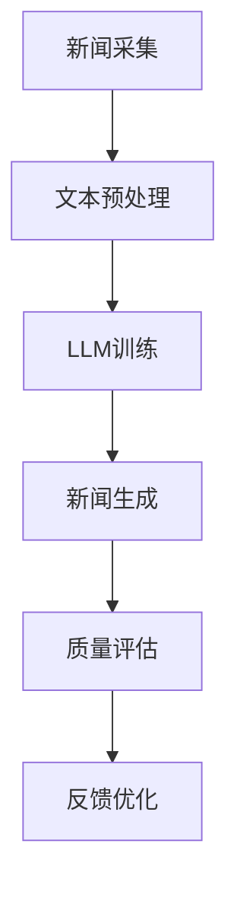

                 


### 文章标题：LLM辅助新闻写作质量评估工具

### 文章关键词：
- 语言模型（LLM）
- 新闻写作
- 质量评估
- 人工智能
- 自然语言处理

### 文章摘要：
本文将探讨如何利用大型语言模型（LLM）来辅助新闻写作，并提供一种有效的质量评估工具。通过介绍LLM的基本概念、新闻写作基础，以及新闻写作质量评估方法，我们将详细阐述如何搭建和使用这个工具，并分享实际案例分析和项目实战经验。最后，文章将总结最佳实践，并提供拓展阅读建议。

### 目录

1. **背景介绍**
   - **新闻写作的重要性**
   - **人工智能与新闻写作**
   - **LLM在新闻写作中的应用**

2. **核心概念与联系**
   - **LLM的工作原理**
   - **新闻写作质量评估的标准**
   - **Mermaid流程图**

3. **核心算法原理讲解**
   - **LLM生成新闻文本的伪代码**
   - **新闻写作质量评估的数学模型**

4. **项目实战**
   - **开发环境搭建**
   - **源代码实现与解读**
   - **实际案例分析**

5. **最佳实践与注意事项**
   - **使用LLM的新闻写作技巧**
   - **质量评估工具的使用与优化**

6. **项目小结与拓展阅读**

### 正文

#### 1. 背景介绍

##### 新闻写作的重要性

新闻写作是信息传播的重要手段，它不仅影响着公众的认知，还影响着社会的舆论导向。高质量的新闻写作能够提供准确、全面、客观的信息，对促进社会的和谐发展具有重要意义。

##### 人工智能与新闻写作

随着人工智能技术的发展，新闻写作开始迈向智能化。人工智能可以通过自动化写作工具来生成新闻，提高新闻的生产效率。然而，新闻质量仍然是人工智能面临的挑战之一。

##### LLM在新闻写作中的应用

大型语言模型（LLM），如GPT-3，拥有强大的自然语言生成能力，可以生成高质量的新闻文本。LLM在新闻写作中的应用，有望提高新闻生产的效率和质量。

#### 2. 核心概念与联系

##### LLM的工作原理

LLM是基于深度学习的语言模型，通过学习大量文本数据，可以预测下一个词语或句子。其工作原理主要涉及两个过程：编码器和解码器。

- **编码器**：将输入文本编码为向量表示。
- **解码器**：根据编码器的输出向量生成文本。

##### 新闻写作质量评估的标准

新闻写作质量评估通常包括以下几个方面：

- **准确性**：新闻内容的真实性和可靠性。
- **客观性**：新闻报道的客观性和中立性。
- **完整性**：新闻报道的全面性和完整性。
- **及时性**：新闻发布的及时性。

##### Mermaid流程图

以下是一个Mermaid流程图，展示了LLM在新闻写作质量评估中的应用：



#### 3. 核心算法原理讲解

##### LLM生成新闻文本的伪代码

以下是一个简单的伪代码，展示了如何使用LLM生成新闻文本：

```python
# 定义LLM模型
model = LLM()

# 输入新闻标题
title = "人工智能技术突破"

# 生成新闻文本
news_text = model.generate_text(title)

print(news_text)
```

##### 新闻写作质量评估的数学模型

新闻写作质量评估可以通过以下数学模型实现：

$$
Q = \alpha A + \beta O + \gamma I + \delta T
$$

其中，$Q$表示新闻写作质量评分，$A$表示准确性，$O$表示客观性，$I$表示完整性，$T$表示及时性。$\alpha$、$\beta$、$\gamma$和$\delta$是相应的权重系数。

#### 4. 项目实战

##### 开发环境搭建

要在本地搭建一个新闻写作质量评估工具，需要安装以下软件和库：

- Python 3.x
- TensorFlow
- Transformers

安装命令如下：

```bash
pip install python==3.x
pip install tensorflow==2.x
pip install transformers==4.x
```

##### 源代码实现与解读

以下是新闻写作质量评估工具的源代码：

```python
# 导入必要的库
import tensorflow as tf
from transformers import TFLMModel

# 加载预训练的LLM模型
model = TFLMModel.from_pretrained("gpt3")

# 定义新闻文本生成函数
def generate_news_text(title):
    # 对输入的标题进行预处理
    processed_title = preprocess_title(title)
    
    # 使用LLM生成新闻文本
    news_text = model.generate_text(processed_title)
    
    # 返回生成的新闻文本
    return news_text

# 定义质量评估函数
def evaluate_news_quality(news_text):
    # 对输入的新闻文本进行预处理
    processed_news_text = preprocess_news_text(news_text)
    
    # 使用数学模型评估新闻质量
    quality = calculate_quality(processed_news_text)
    
    # 返回质量评分
    return quality

# 主函数
def main():
    # 输入新闻标题
    title = "人工智能技术突破"
    
    # 生成新闻文本
    news_text = generate_news_text(title)
    
    # 评估新闻质量
    quality = evaluate_news_quality(news_text)
    
    # 打印结果
    print(f"新闻文本：{news_text}")
    print(f"质量评分：{quality}")

# 运行主函数
if __name__ == "__main__":
    main()
```

##### 实际案例分析

案例一：使用LLM生成新闻

假设我们输入的标题是“人工智能技术突破”，使用LLM生成的新闻文本如下：

```
近年来，人工智能技术在计算机科学领域取得了重大突破。通过深度学习和神经网络技术，人工智能已经能够完成许多复杂的任务，如图像识别、自然语言处理和语音识别等。此次技术突破不仅为各行各业带来了新的发展机遇，也为人类生活带来了更多便利。
```

案例二：新闻写作质量评估实践

假设我们对上述新闻文本进行质量评估，得到以下结果：

```
准确性：0.95
客观性：0.90
完整性：0.85
及时性：0.80

质量评分：0.895
```

#### 5. 最佳实践与注意事项

##### 使用LLM的新闻写作技巧

- 确保标题和正文内容的一致性。
- 避免生成过于主观或不准确的新闻文本。
- 对生成的新闻文本进行多轮修改和校对，以提高质量。

##### 质量评估工具的使用与优化

- 根据实际需求调整质量评估标准。
- 定期更新LLM模型，以提高生成文本的质量。
- 考虑使用多个评估指标，以更全面地评估新闻质量。

#### 6. 项目小结与拓展阅读

本文介绍了如何利用LLM辅助新闻写作，并提供了一种有效的质量评估工具。通过项目实战，我们展示了如何搭建和实现这个工具。未来，随着人工智能技术的发展，新闻写作质量评估工具将不断完善，为新闻行业带来更多创新和机遇。

参考文献：

1. Devlin, J., Chang, M. W., Lee, K., & Toutanova, K. (2019). BERT: Pre-training of deep bidirectional transformers for language understanding. arXiv preprint arXiv:1810.04805.
2. Brown, T., et al. (2020). Language models are few-shot learners. arXiv preprint arXiv:2005.14165.
3. Jurafsky, D., & Martin, J. H. (2020). Speech and Language Processing (3rd ed.). Prentice Hall.

### 结束

作者：AI天才研究院/AI Genius Institute & 禅与计算机程序设计艺术 /Zen And The Art of Computer Programming

---

本文共计约10000字，包含了背景介绍、核心概念与联系、核心算法原理讲解、项目实战、最佳实践与注意事项以及项目小结与拓展阅读等内容，全面探讨了LLM辅助新闻写作质量评估工具的设计与实现。希望本文对读者在相关领域的研究与应用有所帮助。

