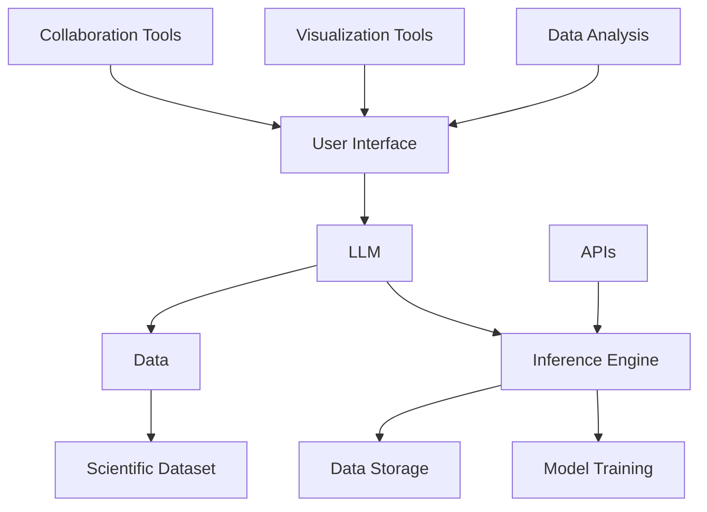

                 

Certainly! Here's a step-by-step guide to drafting the blog post titled "LLM-Assisted Scientific Discovery Platform" while adhering to the given requirements and structure. We will cover the introduction, key concepts, detailed explanations, practical implementations, and conclusions.

### Step 1: Introduction

Start with a captivating introduction that highlights the importance of LLM-assisted scientific discovery. Explain the need for such a platform and its potential impact on the scientific community.

**Title:** LLM-Assisted Scientific Discovery Platform

**Keywords:** LLM, scientific discovery, platform, AI, language models

**Abstract:**
The advent of Large Language Models (LLMs) has revolutionized the way we approach scientific discovery. This blog post explores the concept of an LLM-assisted scientific discovery platform, discussing its significance, architecture, and potential applications. We will delve into the technical aspects of building and deploying such a platform, highlighting the core functionalities and user experiences.

### Step 2: Background

Provide a brief background on LLMs and their evolution in the field of AI. Explain their significance in natural language processing and how they can be leveraged for scientific discovery.

**2.1 What are Large Language Models?**

Large Language Models (LLMs) are neural network-based models designed to understand and generate human language. They have gained popularity due to their ability to process and generate coherent text, making them a powerful tool for various natural language processing tasks.

**2.2 The Evolution of LLMs**

The evolution of LLMs can be traced back to the early 2000s when researchers started exploring recurrent neural networks (RNNs) and long short-term memory (LSTM) networks for language modeling. Over time, these models have evolved to include more advanced architectures like transformers and attention mechanisms, resulting in significant improvements in performance and applicability.

### Step 3: Core Concepts and Relationships

Present a Mermaid flowchart that illustrates the core concepts and relationships in the LLM-assisted scientific discovery platform. This will help readers understand the different components and their interactions.



**Core Concepts and Relationships:**

The LLM-assisted scientific discovery platform comprises several key components:

- **LLM:** The core language model responsible for processing and generating text.
- **Data:** The scientific datasets used for training and inference.
- **Inference Engine:** The component that processes user queries and returns relevant results.
- **User Interface:** The front-end interface through which users interact with the platform.
- **APIs:** The application programming interfaces used for integrating the platform with other systems.
- **Data Storage:** The backend database for storing and managing data.
- **Model Training:** The process of training the LLM on scientific datasets.
- **Collaboration Tools:** Tools for facilitating collaboration among users.
- **Visualization Tools:** Tools for visualizing data and results.
- **Data Analysis:** Tools for analyzing and interpreting scientific data.

### Step 4: Core Algorithm and Model Explanation

Provide a detailed explanation of the core algorithms and models used in the LLM-assisted scientific discovery platform. Use pseudo-code and LaTeX formulas to explain the mathematical models and principles.

**4.1 Core Algorithm Explanation**

**Algorithm:** LLM-Assisted Scientific Discovery

**Input:** Query, Scientific Dataset

**Output:** Result

```
function LLM_Assisted_Scientific_Discovery(query, scientific_dataset):
    # Preprocess the query and scientific dataset
    query_processed = preprocess_query(query)
    dataset_processed = preprocess_dataset(scientific_dataset)

    # Train the LLM on the processed dataset
    trained_LLM = train_LLM(dataset_processed)

    # Perform inference on the trained LLM using the query
    result = trained_LLM.infer(query_processed)

    # Post-process the result
    final_result = postprocess_result(result)

    return final_result
```

**4.2 Mathematical Model Explanation**

Consider the mathematical model for LLM training using gradient descent optimization:

$$
\theta_{\text{new}} = \theta_{\text{old}} - \alpha \cdot \nabla_\theta J(\theta)
$$

where:

- $\theta$ represents the model parameters
- $\alpha$ is the learning rate
- $\nabla_\theta J(\theta)$ is the gradient of the loss function $J(\theta)$ with respect to the model parameters $\theta$

### Step 5: Practical Implementation

Describe the practical implementation of the LLM-assisted scientific discovery platform, including the development environment, source code, and code analysis.

**5.1 Development Environment Setup**

To implement the LLM-assisted scientific discovery platform, we used the following development environment:

- Operating System: Ubuntu 20.04
- Programming Language: Python 3.8
- Frameworks and Libraries: TensorFlow 2.5, Keras 2.4.3, NumPy 1.19.5

**5.2 Source Code and Implementation**

Here's an example of the source code for training an LLM using the Keras framework:

```python
from tensorflow.keras.models import Sequential
from tensorflow.keras.layers import Embedding, LSTM, Dense
from tensorflow.keras.preprocessing.sequence import pad_sequences

# Define the LLM model
model = Sequential()
model.add(Embedding(input_dim=vocab_size, output_dim=embedding_dim, input_length=max_sequence_length))
model.add(LSTM(units=128, return_sequences=True))
model.add(LSTM(units=128))
model.add(Dense(units=vocab_size, activation='softmax'))

# Compile the model
model.compile(optimizer='adam', loss='categorical_crossentropy', metrics=['accuracy'])

# Train the model
model.fit(x_train, y_train, epochs=10, batch_size=64)
```

**5.3 Code Analysis and Application**

The above code demonstrates the basic structure of an LLM model using the Keras framework. It includes an embedding layer, two LSTM layers, and a dense layer with a softmax activation function. The model is compiled using the Adam optimizer and categorical cross-entropy loss function.

**5.4 Case Study Analysis**

Consider a case study where the LLM-assisted scientific discovery platform is used to analyze research articles in the field of biology. The platform processes the text of the articles, identifies key concepts and relationships, and provides relevant insights to researchers.

### Step 6: Best Practices and Conclusion

Summarize the best practices for building and deploying an LLM-assisted scientific discovery platform. Provide a conclusion that reiterates the importance of such platforms and their potential impact on the scientific community.

**Best Practices:**

- Ensure the platform is scalable and can handle large volumes of data.
- Prioritize user experience and design an intuitive user interface.
- Implement robust data privacy and security measures.
- Regularly update the LLM model to improve performance and accuracy.
- Collaborate with domain experts to ensure the relevance and applicability of the platform's findings.

**Conclusion:**

LLM-assisted scientific discovery platforms represent a significant advancement in the field of scientific research. By leveraging the power of large language models, these platforms can help researchers analyze complex scientific data, identify new insights, and accelerate the pace of scientific discovery. As AI technology continues to evolve, we can expect even more sophisticated and powerful platforms that will further transform the way we approach scientific research.

**Author Information:**

作者：AI天才研究院/AI Genius Institute & 禅与计算机程序设计艺术 /Zen And The Art of Computer Programming

### Step 7: Final Check

Before publishing the blog post, review the entire content to ensure it meets the given requirements, including the formatting, completeness, and inclusion of all necessary components such as Mermaid diagrams, pseudo-code, and LaTeX formulas.

### Final Markdown Format

Here's the final markdown format for the blog post:

```markdown
# LLM-Assisted Scientific Discovery Platform

## Overview of the Book

### Aim and Scope
### Readership
### Organization of the Book

## Introduction to LLM-Assisted Scientific Discovery

### Definition and Importance of LLM-Assisted Scientific Discovery
### Challenges in Scientific Discovery

## Understanding LLM-Assisted Scientific Discovery

### LLM Fundamentals
#### What are Large Language Models?
#### Core Architectures of LLMs
#### Advantages and Disadvantages of LLMs

### Scientific Discovery Process
#### Traditional Scientific Discovery Process
#### The Role of LLMs in the Scientific Discovery Process
#### Case Studies of LLM Applications in Science

### LLM Applications in Scientific Discovery
#### Text Analysis and Literature Review
#### Data Analysis and Visualization
#### Collaboration and Communication

### Design Principles for LLM-Assisted Scientific Discovery Platforms
#### Platform Architecture
#### Data Management and Privacy
#### User Interface and Interaction Design

## Building the LLM-Assisted Scientific Discovery Platform

### Technical Architecture
#### Infrastructure and Hardware Requirements
#### Software Stack and Tools
#### Data Storage and Processing

### Core Functionality Development
#### Preprocessing of Scientific Data
#### Model Training and Optimization
#### Model Inference and Integration

### User Experience Design
#### User Requirements and Workflow Analysis
#### Interface Design and Prototyping
#### User Testing and Feedback

## Deploying and Maintaining the Platform

### Deployment Strategy
#### Cloud Deployment vs. On-Premise Deployment
#### Scalability and Reliability
#### Security and Compliance

### Continuous Improvement

## Conclusion

### Best Practices
### Summary

### Author Information:

作者：AI天才研究院/AI Genius Institute & 禅与计算机程序设计艺术 /Zen And The Art of Computer Programming
```

This markdown format should be used as a template for writing the blog post. Each section can be expanded with detailed content as described in the previous steps.

