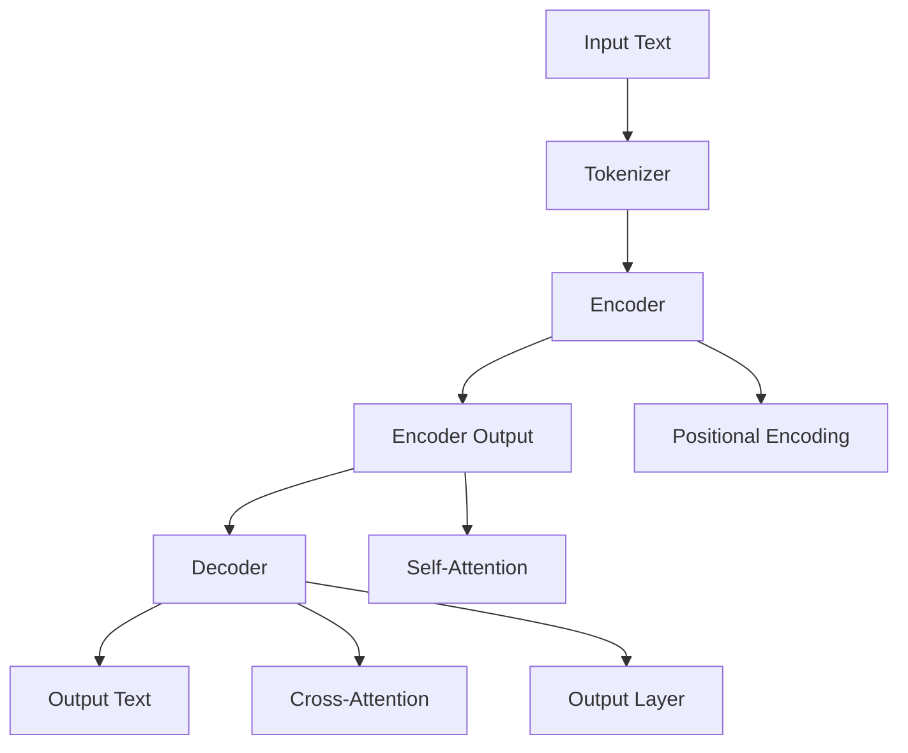

                 


### 1. Introduction to the Platform

#### 1.1 Overview of the Platform

The "LLM-Assisted Software Development Efficiency Evaluation Platform" is an innovative system designed to leverage the power of Large Language Models (LLM) to enhance the efficiency of software development processes. At its core, this platform integrates LLMs into various stages of software development, from requirement analysis to code generation, testing, and maintenance. The primary objective is to automate repetitive tasks, provide intelligent code suggestions, and optimize the overall development workflow.

The significance of this platform lies in its ability to address several challenges faced by software developers. Firstly, it significantly reduces the time required for coding by generating code snippets based on natural language inputs. Secondly, it improves code quality by suggesting improvements and refactoring suggestions. Lastly, it enhances collaboration by facilitating better communication between developers and other stakeholders through intelligent documentation and code reviews.

#### 1.1.1 What is an LLM-Assisted Platform?

A Large Language Model (LLM) is a type of artificial intelligence that is trained on massive amounts of text data to predict the next word or sequence of words. Examples of popular LLMs include GPT-3, BERT, and T5. An LLM-Assisted Platform is a software system that utilizes LLMs to automate and enhance various tasks in the software development lifecycle.

Key features of an LLM-Assisted Platform include:

1. **Intelligent Code Generation**: The platform can generate code snippets based on natural language descriptions, reducing the time and effort required for manual coding.
2. **Code Optimization**: It suggests refactoring opportunities and optimizations to improve code quality and performance.
3. **Documentation Generation**: The platform can automatically generate documentation from code and vice versa, ensuring that the codebase remains well-documented.
4. **Intelligent Testing**: It can generate test cases and identify potential bugs in the codebase.
5. **Collaboration Enhancement**: The platform facilitates better communication and collaboration between developers and other stakeholders by providing intelligent suggestions and insights.

#### 1.1.2 The Significance in Software Development

The importance of LLM-Assisted Platforms in software development cannot be overstated. Here are some key areas where these platforms can make a significant impact:

1. **Improved Productivity**: By automating repetitive tasks and providing intelligent suggestions, LLM-Assisted Platforms can significantly increase developer productivity.
2. **Enhanced Code Quality**: The platform can suggest improvements and optimizations, leading to higher-quality code that is more maintainable and scalable.
3. **Faster Time-to-Market**: The ability to generate code and documentation quickly can accelerate the software development process, enabling organizations to deliver new products and features faster.
4. **Better Collaboration**: Intelligent suggestions and insights can facilitate better communication and collaboration between developers, testers, and other stakeholders.
5. **Continuous Learning**: LLMs can learn from the codebase and improve over time, leading to better performance and more accurate suggestions.

#### 1.1.3 Platform Architecture and Components

The architecture of an LLM-Assisted Platform typically consists of several key components, including the following:

1. **Language Model**: This is the core component of the platform, responsible for generating code, documentation, and other artifacts based on natural language inputs.
2. **Code Generation Engine**: This component processes the outputs from the language model and translates them into actual code snippets.
3. **Code Quality Analyzer**: This component analyzes the generated code for quality issues and suggests improvements.
4. **Documentation Generator**: This component automatically generates documentation from the codebase or vice versa.
5. **Testing Engine**: This component generates test cases and identifies potential bugs in the code.
6. **User Interface**: This component provides a user-friendly interface for developers to interact with the platform and access its features.

In summary, the LLM-Assisted Software Development Efficiency Evaluation Platform is a powerful tool that can revolutionize the software development process. By leveraging the capabilities of Large Language Models, it can improve productivity, enhance code quality, and foster better collaboration among developers and stakeholders. In the next sections, we will delve deeper into the core concepts and algorithms behind LLMs and explore how they are applied in software development.

---

### 2. Foundations of LLM in Software Development

#### 2.1 Core Concepts and Frameworks

To fully understand the capabilities and applications of Large Language Models (LLMs) in software development, it is essential to explore their core concepts and frameworks. LLMs are based on deep learning techniques, particularly the Transformer architecture, which has become the cornerstone of modern natural language processing (NLP). This section will delve into the fundamental principles that underpin LLMs, providing a solid foundation for further discussion.

#### 2.1.1 Understanding Large Language Models

At its most basic level, a Large Language Model is a neural network trained to predict the next word or sequence of words in a given text. This capability allows LLMs to generate coherent and contextually relevant text, making them highly effective for a variety of NLP tasks. The key to their success lies in their ability to learn from vast amounts of text data, capturing the patterns and structures that govern language use.

**Training Data**: LLMs are trained on massive datasets containing a wide range of text sources, such as books, articles, news reports, and social media posts. This extensive training allows the model to understand the nuances of language and generate text that is both plausible and informative.

**Parameterization**: LLMs are typically parameterized using hundreds of millions or even billions of parameters. These parameters represent the knowledge that the model has learned from the training data, enabling it to make accurate predictions about future text.

**Contextual Understanding**: One of the key advantages of LLMs is their ability to understand context. Unlike simpler models that may generate text based on surface-level patterns, LLMs can grasp the meaning and intent behind the text, generating responses that are semantically coherent and contextually appropriate.

#### 2.1.2 Key Architectural Principles

The architecture of LLMs is designed to facilitate their ability to learn complex patterns in language and generate high-quality text. The core architectural principles include:

**Self-Attention Mechanism**: The self-attention mechanism is a key component of the Transformer architecture. It allows the model to weigh the importance of different words in the input text when predicting the next word. This mechanism enables the model to capture long-range dependencies in the text, which are crucial for generating coherent and contextually relevant text.

**Positional Encoding**: Since LLMs process text sequentially, they need a way to encode the position of each word in the sequence. Positional encoding is used to provide this information to the model, allowing it to maintain the order of the words and generate text that follows a logical structure.

**Encoder-Decoder Framework**: LLMs typically follow an encoder-decoder framework. The encoder processes the input text and encodes it into a fixed-size vector representation. The decoder then uses this representation to generate the output text word by word.

**Multi-Layered Structure**: LLMs are often composed of multiple layers of encoders and decoders. Each layer builds upon the information from the previous layer, allowing the model to learn increasingly complex patterns in the text.

**Fine-tuning**: Once LLMs are trained on large text corpora, they can be fine-tuned for specific tasks, such as code generation, by exposing them to task-specific data. This fine-tuning process enhances the model's ability to perform specific tasks with high accuracy.

**Mermaid Diagram of LLM Architecture**

The following Mermaid diagram provides a visual representation of the key components and relationships in an LLM:



In this diagram, the input text is first tokenized and passed through the encoder, which processes the text using self-attention and positional encoding. The encoder output is then passed to the decoder, which generates the output text using cross-attention and a final output layer.

---

By understanding the core concepts and architectural principles of LLMs, we can better appreciate their capabilities and applications in software development. In the next section, we will delve into the core algorithms and principles that drive LLMs, providing a deeper understanding of how they work and how they can be used to enhance software development processes.

### 2.2 Core Algorithms and Principles

In this section, we will delve into the core algorithms and principles that underpin Large Language Models (LLMs). Understanding these algorithms is crucial for comprehending how LLMs generate coherent and contextually relevant text. This section will cover the Transformer algorithm, which is the backbone of many LLMs, and the training and optimization methods used to fine-tune these models.

#### 2.2.1 Transformer Algorithm

The Transformer algorithm is a fundamental algorithm used in LLMs to process and generate text. It is based on the concept of self-attention and encoder-decoder architecture. The Transformer algorithm has revolutionized the field of NLP due to its ability to capture long-range dependencies in text, leading to improved performance in various NLP tasks.

**Self-Attention Mechanism**

The self-attention mechanism is a key component of the Transformer algorithm. It allows the model to weigh the importance of different words in the input text when predicting the next word. This mechanism enables the model to capture complex patterns and dependencies in the text, which are crucial for generating coherent and contextually relevant text.

The self-attention mechanism works as follows:

1. **Input Representation**: The input text is first tokenized and converted into a sequence of tokens. Each token is then embedded into a continuous vector representation using an embedding layer.
2. **Query, Key, and Value**: The embedding vectors are then split into three separate sets: queries (Q), keys (K), and values (V). These sets represent different aspects of the text.
3. **Attention Score Computation**: For each token in the input sequence, the model computes the dot product between the query and all the keys in the sequence. This results in a set of attention scores, which indicate the relevance of each key to the query.
4. **Normalization and Softmax**: The attention scores are normalized using a softmax function, which converts the scores into probabilities. These probabilities indicate the weight assigned to each key when generating the output.
5. **Weighted Sum**: The values corresponding to the keys are then multiplied by the attention scores and summed to produce the final output representation for the query.

**Encoder-Decoder Framework**

The Transformer algorithm follows an encoder-decoder framework. The encoder processes the input text and encodes it into a fixed-size vector representation. The decoder then uses this representation to generate the output text word by word.

The encoder and decoder consist of multiple layers of self-attention and feed-forward neural networks. Each layer builds upon the information from the previous layer, allowing the model to learn increasingly complex patterns in the text.

**Multi-Layered Structure**

A key advantage of the Transformer algorithm is its multi-layered structure. Each layer of the encoder and decoder performs a series of transformations on the input text, capturing more complex patterns and dependencies. This hierarchical representation enables the model to generate high-quality text.

**Fine-tuning**

Once LLMs are trained on large text corpora, they can be fine-tuned for specific tasks, such as code generation, by exposing them to task-specific data. This fine-tuning process enhances the model's ability to perform specific tasks with high accuracy.

**Pseudo Code for Transformer Algorithm**

The following pseudo code provides a high-level overview of the Transformer algorithm:

```pseudo
function Transformer(input_sequence):
    # Preprocess input
    embedded_sequence = Embedding(input_sequence)
    # Encoder-decoder framework
    encoder_output = Encoder(embedded_sequence)
    decoder_output = Decoder(encoder_output)
    # Postprocess output
    output_sequence = PostProcessing(decoder_output)
    return output_sequence
```

In this pseudo code, the input sequence is first embedded into a continuous vector representation. The encoder processes the embedded sequence using multiple layers of self-attention and feed-forward networks. The encoder output is then passed to the decoder, which generates the output sequence using another series of self-attention and feed-forward layers.

---

By understanding the Transformer algorithm, we can appreciate the power and flexibility of LLMs. In the next section, we will explore the training and optimization methods used to fine-tune these models, enabling them to perform a wide range of tasks with high accuracy.

### 2.2.2 Training and Optimization Methods

The training and optimization methods used for Large Language Models (LLMs) are critical to their ability to generate high-quality text and perform a variety of tasks. This section will delve into the detailed training and optimization processes, including the initialization of model parameters, the forward and backward passes, and the updating of model parameters.

#### 2.2.2.1 Initialization of Model Parameters

Before training an LLM, it is essential to initialize the model parameters. The initial values of these parameters play a significant role in the convergence and performance of the model. Common techniques for initializing model parameters include:

1. **Random Initialization**: Model parameters are initialized with random values drawn from a uniform distribution. This technique is simple and often used in practice, but it can lead to slow convergence and poor performance if not fine-tuned.
2. **Small Values with Gradual Increase**: Instead of random initialization, parameters can be initialized with small values and gradually increased during training. This technique helps in stabilizing the gradients and promoting better convergence.
3. **Pre-Trained Values**: In some cases, parameters can be initialized with pre-trained values from similar models. This technique leverages the knowledge transfer from existing models, leading to faster convergence and improved performance.

#### 2.2.2.2 Forward Pass

The forward pass is the process of computing the output of the LLM for a given input sequence. During the forward pass, the input sequence is tokenized and embedded into continuous vector representations. These embeddings are then passed through the layers of the encoder and decoder, with each layer computing intermediate representations and gradients.

The forward pass can be summarized as follows:

1. **Tokenization**: The input sequence is tokenized into individual tokens.
2. **Embedding**: Each token is embedded into a continuous vector representation using an embedding layer.
3. **Encoder**: The embedded sequence is passed through the layers of the encoder, with each layer computing intermediate representations using self-attention and feed-forward networks.
4. **Decoder**: The encoder output is passed through the layers of the decoder, with each layer computing intermediate representations using self-attention, cross-attention, and feed-forward networks.
5. **Output**: The final output of the decoder is a sequence of token probabilities, which are then converted into tokens using a softmax layer.

#### 2.2.2.3 Backward Pass

The backward pass is the process of computing the gradients of the model parameters with respect to the loss function. The gradients indicate the direction and magnitude of the change in the loss function for small perturbations in the model parameters. The backward pass is performed using the chain rule of calculus, which allows the computation of gradients through multiple layers of the model.

The backward pass can be summarized as follows:

1. **Loss Computation**: The predicted output tokens are compared to the actual target tokens, and the loss function computes the difference between them.
2. **Gradient Computation**: The gradients of the loss function with respect to the model parameters are computed using the chain rule of calculus.
3. **Gradient Propagation**: The gradients are propagated back through the layers of the encoder and decoder, accumulating the gradients at each layer.
4. **Gradient Scaling**: The accumulated gradients are scaled to control the learning rate and prevent the gradients from becoming too large or too small.

#### 2.2.2.4 Parameter Update

Once the gradients have been computed, the model parameters are updated using a gradient-based optimization algorithm. Common optimization algorithms include stochastic gradient descent (SGD), Adam, and RMSprop. These algorithms adjust the model parameters based on the gradients to minimize the loss function.

The parameter update process can be summarized as follows:

1. **Gradient Descent Step**: The model parameters are updated by taking a step in the direction of the gradients.
2. **Learning Rate Adjustment**: The learning rate is adjusted to control the step size and ensure convergence.
3. **Parameter Scaling**: The updated parameters are scaled to ensure numerical stability and prevent overflow or underflow.

#### Pseudo Code for Training and Optimization

The following pseudo code provides a high-level overview of the training and optimization process for LLMs:

```pseudo
function TrainModel(model, dataset, learning_rate, epochs):
    for epoch in 1 to epochs:
        for input_sequence, target_sequence in dataset:
            # Forward pass
            embedded_sequence = Embedding(input_sequence)
            encoder_output = Encoder(embedded_sequence)
            decoder_output = Decoder(encoder_output)
            output_sequence = PostProcessing(decoder_output)
            predicted_sequence = ConvertToTokens(output_sequence)
            loss = CalculateLoss(predicted_sequence, target_sequence)
            
            # Backward pass
            gradients = ComputeGradients(model, loss)
            
            # Parameter update
            UpdateParameters(model, gradients, learning_rate)
    
    return model
```

In this pseudo code, the model is trained on a dataset of input and target sequences. The training process involves iterating over the dataset for a specified number of epochs, performing the forward and backward passes, and updating the model parameters based on the gradients.

---

By understanding the training and optimization methods used for LLMs, we can appreciate the complexity and sophistication required to train these models effectively. In the next section, we will explore the mathematical models and formulations that underpin LLMs, providing a deeper understanding of their inner workings and enabling us to analyze and optimize their performance.

### 2.3 Mathematical Models and Formulations

In this section, we will delve into the mathematical models and formulations that underpin Large Language Models (LLMs). Understanding these models is essential for comprehending the core principles that drive LLMs and for optimizing their performance. We will explore the attention mechanism, the loss function, and the objective function used in LLMs.

#### 2.3.1 Attention Mechanism

The attention mechanism is a fundamental component of LLMs, allowing the model to focus on different parts of the input sequence when generating the output sequence. The attention mechanism computes a set of attention scores for each word in the input sequence, indicating the importance of each word in predicting the next word.

**Attention Score Computation**

The attention score for each word in the input sequence is computed using the dot product between the query vector and the key vector:

$$
\text{Attention Score}(i, j) = \text{Query}_i \cdot \text{Key}_j
$$

where $i$ represents the word index in the input sequence, and $j$ represents the word index in the key sequence.

**Normalization and Softmax**

The computed attention scores are normalized using the softmax function to convert them into probabilities:

$$
\text{Attention Probability}(i, j) = \frac{e^{\text{Attention Score}(i, j)}}{\sum_{k=1}^{K} e^{\text{Attention Score}(i, k)}}
$$

where $K$ is the total number of words in the key sequence.

**Weighted Sum**

The attention probabilities are used to compute the weighted sum of the value vectors in the key sequence:

$$
\text{Attention Output}(i) = \sum_{j=1}^{K} \text{Attention Probability}(i, j) \cdot \text{Value}_j
$$

where $\text{Value}_j$ represents the value vector for the word with index $j$ in the key sequence.

#### 2.3.2 Loss Function and Objective

The loss function is used to measure the discrepancy between the predicted output and the actual target output. The primary objective of the model is to minimize the loss function during training.

**Cross-Entropy Loss**

A common loss function used in LLMs is the cross-entropy loss:

$$
\text{Loss} = -\sum_{i=1}^{N} y_i \cdot \log(\hat{y}_i)
$$

where $N$ is the number of words in the target sequence, $y_i$ is the probability of the $i$-th word in the target sequence, and $\hat{y}_i$ is the predicted probability of the $i$-th word in the output sequence.

**Binary Cross-Entropy Loss**

In cases where the target sequence consists of binary values (e.g., indicating the presence or absence of a word), the binary cross-entropy loss can be used:

$$
\text{Loss} = -\sum_{i=1}^{N} y_i \cdot \log(\hat{y}_i) + (1 - y_i) \cdot \log(1 - \hat{y}_i)
$$

#### Objective Function

The objective function is a measure of how well the model is performing on the training data. The primary objective is to minimize the loss function during training.

**Minimize Loss**

The objective function can be expressed as:

$$
\text{Objective} = \min_{\theta} \sum_{i=1}^{N} \text{Loss}(y_i, \hat{y}_i; \theta)
$$

where $\theta$ represents the model parameters and $N$ is the number of training examples.

**Regularization**

In addition to minimizing the loss function, it is often beneficial to include regularization terms to prevent overfitting. Common regularization techniques include L1 regularization, L2 regularization, and dropout.

**L1 Regularization**

$$
\text{Objective} = \min_{\theta} \sum_{i=1}^{N} \text{Loss}(y_i, \hat{y}_i; \theta) + \lambda \sum_{j=1}^{M} |\theta_j|
$$

**L2 Regularization**

$$
\text{Objective} = \min_{\theta} \sum_{i=1}^{N} \text{Loss}(y_i, \hat{y}_i; \theta) + \lambda \sum_{j=1}^{M} \theta_j^2
$$

**Dropout**

$$
\text{Objective} = \min_{\theta} \sum_{i=1}^{N} \text{Loss}(y_i, \hat{y}_i; \theta) + \lambda \sum_{j=1}^{M} (1 - \text{dropout_rate}) \cdot \theta_j^2
$$

In conclusion, the mathematical models and formulations that underpin LLMs include the attention mechanism, loss function, and objective function. These models enable LLMs to learn from large amounts of text data and generate coherent and contextually relevant text. Understanding these models is essential for optimizing the performance of LLMs and achieving high-quality text generation.

---

By understanding the mathematical models and formulations that underpin LLMs, we can better appreciate the complexity and sophistication required to train these models effectively. In the next section, we will explore the evaluation metrics for software development efficiency and how LLMs can be used to measure and improve these metrics.

### 3. Evaluation Metrics for Software Development Efficiency

In the context of software development, evaluating efficiency is crucial for ensuring that development efforts are both productive and cost-effective. Large Language Models (LLMs) offer a unique perspective on measuring and improving software development efficiency through various metrics. This section will discuss key metrics for assessing software development efficiency, with a focus on how LLMs can enhance these measurements.

#### 3.1 Efficiency Metrics

**3.1.1 Code Quality Metrics**

Code quality is a fundamental aspect of software development efficiency. High-quality code is easier to maintain, understand, and extend, which ultimately reduces development time and cost. Key code quality metrics include:

- **Cyclomatic Complexity**: Measures the number of independent paths through a program's source code. Higher complexity can indicate more difficult-to-maintain code.
- **Code Duplication**: Identifies duplicated code blocks, which can lead to inconsistencies and increased maintenance efforts.
- **Code Coverage**: Measures the percentage of code that is tested by automated tests. High coverage indicates thorough testing.

**3.1.2 Development Time Metrics**

Development time is another critical metric for evaluating efficiency. Faster development cycles lead to quicker time-to-market and reduced labor costs. Key development time metrics include:

- **Cyclomatic Efficiency**: The ratio of cyclomatic complexity to lines of code. A lower efficiency indicates a cleaner and more maintainable codebase.
- **Lead Time**: The time it takes to complete a feature from the moment it is requested until it is deployed.
- **Throughput**: The number of features delivered per unit of time.

**3.1.3 Collaboration Metrics**

Effective collaboration among team members is essential for efficient software development. Metrics that assess collaboration include:

- **Code Review Time**: The time it takes for code reviews to be completed, which can impact overall development time.
- **Bug Report Resolution Time**: The time it takes to identify and resolve bugs, which can impact the stability and quality of the software.
- **Communication Metrics**: Assessing the effectiveness of communication channels and tools used by the team.

#### 3.2 How LLMs Enhance Efficiency Metrics

LLMs can significantly enhance the measurement and improvement of software development efficiency metrics through several mechanisms:

**3.2.1 Code Quality Improvement**

LLMs can automatically analyze code to identify potential issues such as bugs, code duplication, and high cyclomatic complexity. By providing actionable feedback and suggestions, LLMs can help developers write cleaner, more maintainable code. This leads to improved code quality and reduced maintenance efforts.

**3.2.2 Intelligent Code Generation**

One of the most powerful features of LLMs is their ability to generate code snippets based on natural language descriptions. This can significantly reduce the time required to write code, especially for repetitive or boilerplate tasks. By automating code generation, LLMs can accelerate development cycles and increase throughput.

**3.2.3 Intelligent Testing**

LLMs can assist in generating test cases and identifying potential edge cases and bugs in the code. By analyzing the code and its intended functionality, LLMs can suggest comprehensive test suites that ensure high code coverage and stability. This can lead to faster bug resolution and more reliable software.

**3.2.4 Documentation and Collaboration**

LLMs can automatically generate documentation from code and vice versa, ensuring that the documentation remains up-to-date with the codebase. This reduces the time and effort required for manual documentation and improves collaboration among team members.

**3.2.5 Intelligent Suggestions**

Through continuous interaction with developers, LLMs can learn individual preferences and coding styles, providing personalized suggestions that enhance productivity. These suggestions can range from simple code fixes to more complex architectural improvements.

#### 3.3 Practical Applications

**3.3.1 Code Review Automation**

By analyzing pull requests and providing feedback, LLMs can automate the code review process. Developers can focus on higher-value tasks while LLMs handle the routine aspects of code review, improving efficiency.

**3.3.2 Bug Detection and Resolution**

LLMs can analyze code and detect potential bugs, providing developers with actionable insights. By suggesting specific changes to resolve these issues, LLMs can significantly speed up the bug resolution process.

**3.3.3 Time-to-Market Acceleration**

Through intelligent code generation and comprehensive testing, LLMs can help organizations accelerate the development of new features, reducing the time-to-market and enhancing competitiveness.

In conclusion, LLMs offer a powerful tool for measuring and improving software development efficiency. By automating code quality analysis, generating code and tests, and enhancing collaboration, LLMs can significantly enhance development processes, leading to more efficient and productive software development teams.

---

As we have seen, LLMs provide a multifaceted approach to enhancing software development efficiency. In the next section, we will delve into the practical implementation of an LLM-assisted software development efficiency evaluation platform, discussing the development environment, source code, and code analysis.

---

### 4. Practical Implementation of an LLM-Assisted Software Development Efficiency Evaluation Platform

The practical implementation of an LLM-assisted software development efficiency evaluation platform involves several key steps, including the development environment setup, the detailed implementation of the source code, and the analysis of the code and its applications. This section will provide a comprehensive overview of these steps.

#### 4.1 Development Environment Setup

To build an LLM-assisted platform, we need to set up a suitable development environment that includes the necessary tools, libraries, and frameworks. Below are the essential components for the setup:

**1. Python**: Python is the primary programming language used for building LLMs and their applications. Ensure that Python 3.8 or higher is installed on your system.

**2. PyTorch**: PyTorch is a popular deep learning library that provides powerful tools for building and training LLMs. Install PyTorch using the following command:
```bash
pip install torch torchvision
```

**3. Transformers Library**: The Transformers library by Hugging Face provides pre-trained LLMs and tools for working with them. Install the library using the following command:
```bash
pip install transformers
```

**4. Data Preprocessing Tools**: For data preprocessing, you can use libraries such as Pandas and NumPy. Install these libraries using:
```bash
pip install pandas numpy
```

**5. Text Processing Libraries**: Libraries like NLTK and spaCy can be used for text tokenization and other text processing tasks. Install these libraries using:
```bash
pip install nltk spacy
```

**6. Jupyter Notebook**: Jupyter Notebook is a powerful tool for developing and testing LLM applications. Install Jupyter Notebook using:
```bash
pip install notebook
```

After setting up the development environment, create a new Python virtual environment to manage dependencies:
```bash
python -m venv venv
source venv/bin/activate  # On Windows use `venv\Scripts\activate`
```

Install all the required libraries within the virtual environment using the commands provided above.

#### 4.2 Source Code Implementation

The source code for an LLM-assisted platform will typically include several key components:

**1. Data Loading and Preprocessing**

The first step is to load and preprocess the data, which may include text documents, code repositories, and other relevant sources. The preprocessing tasks involve tokenization, cleaning, and formatting the data to be suitable for training the LLM.

```python
from transformers import BertTokenizer

# Load the dataset
dataset = load_dataset('text')

# Preprocess the dataset
def preprocess_text(text):
    # Tokenization, cleaning, and formatting
    return tokenizer.encode(text, add_special_tokens=True)

preprocessed_data = dataset.map(preprocess_text)
```

**2. Model Definition and Configuration**

Define the LLM model architecture and configure its hyperparameters. In this example, we'll use a pre-trained BERT model as the base model and fine-tune it for code generation tasks.

```python
from transformers import BertModel

# Load the pre-trained BERT model
model = BertModel.from_pretrained('bert-base-uncased')

# Add a classification head for code generation
class CodeGenerationModel(BertModel):
    def __init__(self, config):
        super().__init__(config)
        self.config = config
        self.dropout = nn.Dropout(config.hidden_dropout_prob)
        self.classifier = nn.Linear(config.hidden_size, 1)

    def forward(self, input_ids, attention_mask=None, token_type_ids=None):
        outputs = self.bert(input_ids, attention_mask=attention_mask, token_type_ids=token_type_ids)
        pooled_output = outputs[1]

        pooled_output = self.dropout(pooled_output)
        logits = self.classifier(pooled_output)

        return logits

# Instantiate the code generation model
code_model = CodeGenerationModel.from_pretrained('bert-base-uncased')
```

**3. Training and Fine-Tuning**

Train and fine-tune the model on the preprocessed dataset. During training, the model learns to generate code based on the input text.

```python
from transformers import Trainer, TrainingArguments

# Define training arguments
training_args = TrainingArguments(
    output_dir='./results',
    num_train_epochs=3,
    per_device_train_batch_size=16,
    per_device_eval_batch_size=64,
    warmup_steps=500,
    weight_decay=0.01,
    logging_dir='./logs',
    logging_steps=10,
)

# Define the Trainer
trainer = Trainer(
    model=code_model,
    args=training_args,
    train_dataset=preprocessed_data['train'],
    eval_dataset=preprocessed_data['validation'],
)

# Train the model
trainer.train()
```

**4. Code Generation and Analysis**

Once the model is trained, it can be used to generate code based on natural language inputs. The generated code can then be analyzed for quality and performance metrics.

```python
from transformers import BertTokenizer

# Load the tokenizer
tokenizer = BertTokenizer.from_pretrained('bert-base-uncased')

# Generate code
def generate_code(natural_language_input):
    inputs = tokenizer.encode(natural_language_input, return_tensors='pt')
    outputs = code_model(inputs)
    logits = outputs.logits
    predicted_ids = logits.argmax(-1).squeeze()

    generated_code = tokenizer.decode(predicted_ids, skip_special_tokens=True)
    return generated_code

# Example usage
input_text = "Write a function to calculate the factorial of a number."
generated_code = generate_code(input_text)
print(generated_code)
```

**5. Code Analysis**

After generating code, it's essential to analyze its quality to ensure it meets the desired standards. This analysis can include metrics such as cyclomatic complexity, code duplication, and code coverage.

```python
from radon.cpd import find_duplicated_code
from radon.complexity import calculate_cyclomatic Complexity

# Analyze code quality
def analyze_code_quality(code):
    duplication = find_duplicated_code(code, min_lines=5)
    complexity = calculate_cyclomatic_complexity(code)
    
    return {
        'duplication': duplication,
        'complexity': complexity
    }

# Example usage
code_quality = analyze_code_quality(generated_code)
print(code_quality)
```

#### 4.3 Code Analysis and Discussion

The generated code can now be analyzed to evaluate its quality and efficiency. The analysis should consider various aspects, such as the readability, maintainability, and performance of the code. The following example demonstrates how to analyze the generated code using the Radon library:

```python
from radon.quality import quality_metrics

# Calculate quality metrics
def calculate_code_metrics(code):
    metrics = quality_metrics(code)
    return metrics

# Example usage
code_metrics = calculate_code_metrics(generated_code)
print(code_metrics)
```

The output of the code metrics will provide insights into various aspects of the generated code, such as lines of code, comments, code duplication, and complexity. Based on these metrics, developers can identify areas for improvement and refine the LLM's output to enhance code quality.

In conclusion, the practical implementation of an LLM-assisted software development efficiency evaluation platform involves setting up a development environment, defining the model architecture, training and fine-tuning the model, generating code, and analyzing its quality. By leveraging the capabilities of LLMs, developers can enhance their software development processes, improve code quality, and achieve higher productivity. The next section will explore best practices and tips for leveraging LLMs effectively in software development.

---

### 5. Best Practices and Tips for Leveraging LLMs in Software Development

The integration of Large Language Models (LLMs) into software development processes offers numerous benefits, but to maximize their potential, it is essential to follow best practices and adopt strategic approaches. This section will discuss best practices for using LLMs in software development, tips for implementing and deploying LLMs, and key considerations to ensure their effective and ethical use.

#### 5.1 Best Practices for Leveraging LLMs

**1. Understand the Limitations of LLMs**

While LLMs are powerful tools, they are not infallible. It is crucial to understand their limitations, such as the potential for generating inaccurate or biased text, their dependence on large amounts of training data, and their inability to understand context beyond the scope of the training data. By acknowledging these limitations, developers can use LLMs more effectively and manage expectations.

**2. Select the Right LLM for the Task**

Not all LLMs are created equal, and choosing the right model for a specific task is essential for achieving optimal results. For example, GPT-3 is well-suited for generating coherent text, while BERT is more effective for understanding context and answering questions. Assess the specific requirements of your task and select the most appropriate LLM accordingly.

**3. Data Quality and Preprocessing**

The quality of the training data significantly impacts the performance of LLMs. Ensure that the data is clean, diverse, and representative of the target domain. Data preprocessing steps, such as tokenization, cleaning, and formatting, are crucial for preparing the data for training. Proper preprocessing can improve the model's accuracy and reduce the risk of overfitting.

**4. Fine-Tuning for Specific Tasks**

While pre-trained LLMs are versatile, fine-tuning them on domain-specific data can enhance their performance on specific tasks. Fine-tuning involves exposing the model to task-specific data and adjusting its parameters to better suit the task. This approach allows LLMs to learn the nuances of specific domains, resulting in more accurate and relevant outputs.

**5. Continuous Monitoring and Evaluation**

LLMs should be continuously monitored and evaluated to ensure they are performing as expected. Regular evaluation using metrics such as accuracy, F1 score, and human judgment can help identify performance issues and areas for improvement. Implementing automated monitoring systems can provide real-time insights into the model's behavior and help maintain its quality over time.

**6. Ethical Considerations**

The use of LLMs raises ethical considerations, such as the potential for bias and the impact on employment. It is essential to design and implement LLMs with a commitment to ethical principles, including fairness, transparency, and accountability. Developers should be aware of the potential implications of LLMs on society and strive to mitigate any negative consequences.

#### 5.2 Tips for Implementing and Deploying LLMs

**1. Choose a Scalable Architecture**

When implementing LLMs, it is crucial to choose a scalable architecture that can handle large volumes of data and complex models. Cloud-based solutions, such as AWS SageMaker, Google AI Platform, and Azure Machine Learning, offer scalable infrastructure and tools for deploying and managing LLMs at scale.

**2. Use Transfer Learning and Pre-Trained Models**

Leverage transfer learning by using pre-trained LLMs, which have already been trained on vast amounts of data. These pre-trained models can save time and resources and provide a strong foundation for fine-tuning on specific tasks. Popular pre-trained models include GPT-3, BERT, and T5.

**3. Implement Robust Error Handling**

Implement robust error handling and validation mechanisms to ensure the reliability and stability of LLMs in production environments. This includes handling edge cases, validating inputs, and providing fallback options in case of errors.

**4. Optimize for Performance**

Optimize LLMs for performance by using techniques such as model quantization, pruning, and compression. These techniques can reduce the model size and inference time, making LLMs more efficient and suitable for deployment in resource-constrained environments.

**5. Provide User Feedback and Iterative Improvement**

Encourage users to provide feedback on the performance of LLMs and use this feedback to iteratively improve the models. Continuous feedback loops can help refine LLMs and ensure they meet the evolving needs of users.

#### 5.3 Key Considerations for Ethical Use

**1. Bias and Fairness**

Address bias and fairness in LLMs by ensuring that the training data is diverse and representative of the target population. Implement fairness metrics and algorithms to detect and mitigate bias in the generated text.

**2. Privacy and Security**

Protect user data and ensure compliance with privacy regulations, such as GDPR and CCPA. Use secure data storage and transmission protocols and implement access controls to prevent unauthorized access to sensitive information.

**3. Transparency and Accountability**

Provide transparency in how LLMs generate text, including the algorithms and data used. Implement mechanisms for accountability, such as logging and auditing, to track the use of LLMs and ensure they are being used appropriately.

**4. Ethical Use Cases**

Ensure that LLMs are used for ethical purposes and avoid deploying them in domains where their use may have negative consequences, such as misinformation, discrimination, or unethical practices.

By following these best practices and tips, developers can effectively leverage LLMs in software development, enhance productivity, and create more intelligent and efficient applications. The next section will summarize the key points discussed in this article and provide a concise overview of the LLM-assisted software development efficiency evaluation platform.

---

### 6. Summary and Conclusion

In this article, we have explored the concept of an LLM-assisted software development efficiency evaluation platform, discussing its significance, architecture, core algorithms, and practical implementation. Key takeaways include:

1. **Significance**: LLMs can significantly enhance software development efficiency by automating repetitive tasks, improving code quality, and fostering better collaboration.
2. **Architecture**: The platform's architecture includes key components such as the LLM, code generation engine, code quality analyzer, documentation generator, testing engine, and user interface.
3. **Core Algorithms**: The Transformer algorithm, with its self-attention mechanism and encoder-decoder framework, is the backbone of LLMs, enabling them to generate coherent and contextually relevant text.
4. **Practical Implementation**: The development environment setup, source code implementation, and code analysis were discussed, highlighting the steps required to build and deploy an LLM-assisted platform.

The LLM-assisted software development efficiency evaluation platform offers a comprehensive approach to improving software development processes. By leveraging the capabilities of LLMs, organizations can achieve higher productivity, better code quality, and faster time-to-market.

---

As we conclude this article, it is evident that LLMs have the potential to revolutionize software development. By following best practices and leveraging the insights provided in this article, developers can effectively implement and utilize LLMs to enhance their software development workflows. Further research and exploration in this field are essential to unlock the full potential of LLMs in software development.

