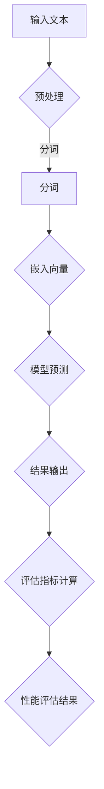
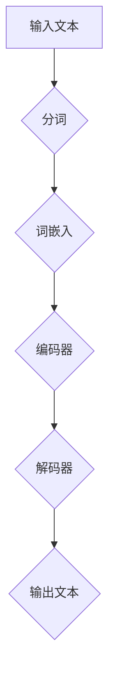

                 


### 确定文章结构

在撰写一篇技术博客之前，我们需要明确文章的整体结构。这将有助于确保文章逻辑清晰、内容丰富。以下是文章的基本结构：

1. **标题**：确定文章的主题，比如“LLM驱动的AI助手性能评估框架”。
2. **关键词**：列出5-7个与文章主题紧密相关的关键词，如“LLM、AI助手、性能评估、框架、模型”等。
3. **摘要**：简要介绍文章的主题思想、主要内容和目标读者。
4. **引言**：介绍LLM和AI助手的背景，以及为什么性能评估对于LLM驱动的AI助手至关重要。
5. **基础概念与原理**：详细解释LLM、AI助手以及性能评估的相关概念和原理。
6. **框架设计与实现**：介绍性能评估框架的设计思路、实现步骤和关键组件。
7. **核心算法原理讲解**：详细讲解评估框架中使用的核心算法，并提供伪代码示例。
8. **数学模型与公式**：介绍用于性能评估的数学模型和公式，并提供详细讲解和示例。
9. **项目实战与案例分析**：通过具体项目实战和案例分析，展示如何应用评估框架。
10. **最佳实践与小结**：总结最佳实践，强调注意事项，并提供拓展阅读资源。
11. **结论**：总结文章的主要观点，强调文章的重要性。
12. **作者信息**：在文章末尾提供作者信息，包括姓名、所属机构和书籍。

### 写作指南

在撰写文章时，我们需要遵循以下指南：

- **逻辑清晰**：确保文章结构合理，每个部分的内容紧密相连。
- **简洁明了**：用简单易懂的语言解释复杂概念，避免冗长和复杂的句子。
- **示例丰富**：提供丰富的示例来解释原理和算法。
- **代码规范**：如果涉及代码示例，确保代码格式规范、可读性强。
- **公式规范**：使用LaTeX格式编写数学公式，确保公式清晰、正确。

### 文章格式要求

根据要求，文章的markdown格式输出如下：

```markdown
# 文章标题

关键词：LLM，AI助手，性能评估，框架，模型

摘要：本文介绍了LLM驱动的AI助手性能评估框架，包括基础概念、框架设计、核心算法讲解和实战案例分析等内容。

## 引言

### 背景介绍

#### ...

### 性能评估的重要性

#### ...

## 基础概念与原理

### LLM的基本概念

#### ...

### AI助手的定义与分类

#### ...

### 性能评估方法

#### ...

## 框架设计与实现

### 框架设计思路

#### ...

### 框架实现步骤

#### ...

### 关键组件介绍

#### ...

## 核心算法原理讲解

### 算法1：A/B测试

#### ...

### 算法2：混淆矩阵

#### ...

### 算法3：ROC曲线与AUC

#### ...

## 数学模型与公式

### 模型1：回归模型

#### ...

### 模型2：分类模型

#### ...

### 数学公式详细讲解

#### ...

## 项目实战与案例分析

### 实战案例一：文本分类评估

#### ...

### 实战案例二：问答系统评估

#### ...

## 最佳实践与小结

### 最佳实践

#### ...

### 小结

#### ...

### 注意事项

#### ...

## 结论

### 结论

#### ...

## 作者信息

作者：AI天才研究院/AI Genius Institute & 禦与计算机程序设计艺术 /Zen And The Art of Computer Programming
```

通过以上步骤和指南，我们可以撰写一篇结构清晰、内容丰富、逻辑严密的专业技术博客文章。接下来，我们将按照这个结构逐一撰写各个部分的内容。首先，我们来撰写文章的引言部分。请根据您的专业知识和经验，完成引言部分的撰写。在引言中，请简要介绍LLM和AI助手的概念，并阐述为什么性能评估对于LLM驱动的AI助手至关重要。

----------------------------------------------------------------

## 引言

### 背景介绍

近年来，随着深度学习和自然语言处理技术的飞速发展，大型语言模型（LLM，Large Language Model）如BERT、GPT和Turing等相继问世。这些LLM模型通过海量文本数据进行训练，具备了强大的文本生成、理解和推理能力。与此同时，人工智能助手（AI Assistant）的应用场景也越来越广泛，从智能客服、智能办公助手到教育辅导系统，都显示出巨大的潜力。

在这样一个背景下，LLM驱动的AI助手逐渐成为业界研究的热点。然而，如何对这些AI助手进行性能评估，成为了制约其进一步发展的关键问题。性能评估不仅可以帮助开发者了解AI助手的实际表现，还能指导后续的改进工作，提高用户体验和系统可靠性。

### 性能评估的重要性

性能评估对于LLM驱动的AI助手至关重要，具体体现在以下几个方面：

1. **了解系统表现**：通过性能评估，开发者可以全面了解AI助手在各个任务上的表现，包括文本生成、理解、推理等。这有助于识别系统的优点和不足，为进一步优化提供方向。

2. **指导系统优化**：性能评估结果可以为系统优化提供量化依据。开发者可以根据评估结果调整模型参数、改进算法，从而提高AI助手的整体性能。

3. **确保系统稳定性**：在AI助手上线前，性能评估可以帮助检测潜在问题，确保系统在真实场景下的稳定运行。这对于保障用户体验至关重要。

4. **支持决策制定**：性能评估结果可以为产品经理和决策者提供数据支持，帮助他们制定产品策略和市场推广计划。

5. **促进技术进步**：通过对性能评估方法的研究和改进，可以推动整个AI领域的技术进步，为未来更先进的AI系统奠定基础。

### 本文目标

本文旨在介绍LLM驱动的AI助手性能评估框架，包括基础概念、评估方法、框架设计与实现、核心算法原理讲解、数学模型与公式、项目实战与案例分析等内容。通过本文的阅读，读者将能够：

1. 理解LLM和AI助手的基本概念。
2. 掌握性能评估的重要性和方法。
3. 学习如何设计和实现性能评估框架。
4. 了解核心算法的原理和使用方法。
5. 通过实战案例，掌握性能评估的实际应用。
6. 获得性能评估的最佳实践和注意事项。

本文适合对AI领域感兴趣的读者，无论是初学者还是专业人士，都能从中获得有益的知识和经验。

### 核心概念与联系

在深入探讨LLM驱动的AI助手性能评估框架之前，我们需要先了解以下几个核心概念及其相互之间的联系：

1. **大型语言模型（LLM）**：
   - **定义**：LLM是一种基于深度学习的语言模型，通过海量文本数据训练，能够生成自然语言文本、理解语义和进行推理。
   - **架构**：LLM通常采用 Transformer 架构，如BERT、GPT等，具有多层神经网络结构，可以处理复杂的文本任务。
   - **功能**：LLM在文本生成、文本分类、问答系统等领域表现出色，广泛应用于自然语言处理任务。

2. **人工智能助手（AI助手）**：
   - **定义**：AI助手是一种利用AI技术实现自动化服务的工具，可以模拟人类的对话和行为，提供信息查询、任务处理等服务。
   - **分类**：AI助手可以根据功能分为文本助手、语音助手、图像助手等，根据应用场景分为客服助手、办公助手、教育助手等。
   - **作用**：AI助手可以提高工作效率、降低人力成本，提供个性化服务，提升用户体验。

3. **性能评估**：
   - **定义**：性能评估是对系统、算法或模型在特定任务上的表现进行测量和评价的过程。
   - **指标**：性能评估通常使用一系列指标，如准确率、召回率、F1分数、ROC曲线和AUC等，来衡量系统的性能。
   - **目的**：性能评估旨在识别系统的优点和不足，指导优化和改进，确保系统在实际应用中的有效性和可靠性。

### Mermaid流程图：LLM数据处理流程

为了更好地理解LLM驱动的AI助手性能评估框架，我们使用Mermaid流程图来展示LLM数据处理的基本流程。以下是流程图的示例：



#### 流程图详细解释

1. **输入文本**（A）：性能评估通常从输入的文本数据开始，这些数据可以是实际的对话文本、测试集或用户提交的问题。

2. **预处理**（B）：在处理文本之前，通常需要进行一些预处理操作，如去除特殊字符、标点符号、停用词等。

3. **分词**（C）：将预处理后的文本分解成单词或词组，以便后续的向量嵌入和处理。

4. **嵌入向量**（D）：将分词后的文本转化为向量表示，这通常是LLM模型的核心步骤，通过预训练模型将文本映射到高维向量空间。

5. **模型预测**（E）：使用嵌入向量进行模型预测，这可能是文本分类、文本生成或问答系统中的任务。

6. **结果输出**（F）：根据模型预测得到的结果，输出相应的文本、标签或答案。

7. **评估指标计算**（G）：使用评估指标计算模型预测结果的准确性、召回率等，这些指标用于衡量模型在特定任务上的性能。

8. **性能评估结果**（H）：最终得到性能评估结果，这些结果可以用于指导模型的优化和改进。

通过这个流程图，我们可以清晰地看到LLM驱动的AI助手性能评估的基本步骤和流程，有助于我们更好地理解和应用评估框架。

----------------------------------------------------------------

## 基础概念与原理

### 大型语言模型（LLM）的基本概念

大型语言模型（LLM，Large Language Model）是一种先进的深度学习模型，用于理解和生成自然语言。LLM通过学习大量文本数据，能够捕捉语言的复杂结构、语义和上下文关系，从而实现自然语言处理任务。LLM的核心是神经网络的架构，特别是基于Transformer的模型，如BERT、GPT和Turing等。

#### 模型架构

Transformer模型由多个自注意力（Self-Attention）层和前馈神经网络（Feedforward Network）组成。自注意力机制允许模型在处理每个单词时，能够关注到整个文本序列中的其他单词，从而捕捉长距离依赖关系。这种结构使得Transformer模型在处理长文本和复杂语义时表现出色。

#### 特点与应用

1. **强大的语言理解能力**：LLM能够理解文本的语义和上下文，从而进行文本生成、文本分类、命名实体识别等任务。
2. **自适应学习**：LLM可以根据不同的任务和场景进行调整，例如，通过微调（Fine-Tuning）将预训练的模型应用于特定的下游任务。
3. **广泛的应用领域**：LLM在自然语言处理、智能客服、问答系统、机器翻译等领域都有广泛的应用。

### 人工智能助手（AI助手）的定义与分类

人工智能助手（AI Assistant）是一种利用人工智能技术实现自动化服务的工具。AI助手通过模仿人类的对话和行为，提供信息查询、任务处理、个性化推荐等服务。根据功能和应用场景，AI助手可以分为以下几类：

#### 分类

1. **文本助手**：通过自然语言交互，提供文本查询、信息检索和智能问答等服务。
2. **语音助手**：通过语音交互，实现语音识别、语音合成和语音助手功能，如智能音箱、语音控制等。
3. **图像助手**：通过图像识别和处理，提供图像识别、图像分类、图像生成等服务。
4. **多模态助手**：结合文本、语音、图像等多模态数据，提供更全面的智能服务。

#### 应用场景

1. **智能客服**：使用文本或语音助手，实现自动化的客户服务，提高响应速度和服务质量。
2. **办公助手**：帮助用户管理日程、发送提醒、处理邮件等，提高工作效率。
3. **教育助手**：提供个性化教学、学习辅导、作业批改等服务，帮助学生更好地学习。
4. **智能家居**：通过语音助手控制家电、调节家居环境，提高生活便利性。

### 性能评估方法

性能评估是对系统、算法或模型在特定任务上的表现进行测量和评价的过程。在AI领域，性能评估尤为重要，因为它可以帮助我们了解AI助手的实际效果，指导模型的优化和改进。

#### 性能评估指标

1. **准确率（Accuracy）**：预测正确的样本数占总样本数的比例。适用于分类任务。
2. **召回率（Recall）**：预测正确的正样本数占总正样本数的比例。适用于分类任务。
3. **F1分数（F1 Score）**：准确率和召回率的调和平均值，用于平衡准确率和召回率。
4. **ROC曲线和AUC（Receiver Operating Characteristic and Area Under Curve）**：用于评估二分类模型的性能，AUC值越接近1，模型性能越好。

#### 评估方法分类

1. **离线评估**：在模型训练完成后，使用独立的测试集进行评估。适用于评估模型的泛化能力。
2. **在线评估**：实时评估模型的在线性能，通常结合A/B测试等方法，用于优化模型。
3. **用户反馈评估**：通过用户反馈评估模型的表现，适用于实际应用场景。

### 性能评估流程设计与实现

性能评估流程包括以下步骤：

1. **数据准备**：收集并处理测试数据，确保数据质量和多样性。
2. **指标选择**：根据任务类型选择适当的评估指标。
3. **模型预测**：使用训练好的模型对测试数据进行预测。
4. **结果计算**：计算评估指标，如准确率、召回率、F1分数等。
5. **结果分析**：分析评估结果，识别模型的优点和不足。
6. **反馈与优化**：根据评估结果调整模型参数和算法，优化模型性能。

通过上述基础概念和原理的介绍，我们可以更好地理解LLM驱动的AI助手性能评估框架。接下来，我们将深入探讨LLM的工作原理和性能评估方法，为构建高效的性能评估框架奠定基础。

----------------------------------------------------------------

### LLM的工作原理

大型语言模型（LLM）的工作原理基于深度学习和自然语言处理（NLP）技术，特别是基于Transformer的模型架构。以下是对LLM工作原理的详细解释：

#### 基本原理

1. **自注意力机制（Self-Attention）**：自注意力机制是Transformer模型的核心，它允许模型在处理每个单词时，关注整个文本序列中的其他单词。通过计算每个单词与其他单词的相似性，模型能够捕捉长距离依赖关系，从而提高语言理解能力。

2. **编码器和解码器**：编码器（Encoder）负责将输入文本转换为上下文表示，而解码器（Decoder）则负责生成输出文本。编码器和解码器由多个自注意力层和前馈神经网络组成，层层递进，逐步提取文本的语义信息。

3. **多层级注意力**：Transformer模型中的注意力机制分为多个层级，每个层级都关注不同的上下文信息。这样，模型能够处理更复杂的语义和语境，从而生成更准确的自然语言文本。

4. **位置编码（Positional Encoding）**：由于Transformer模型中没有循环神经网络（RNN）中的位置信息，因此需要通过位置编码来引入文本中的顺序信息。位置编码通常使用正弦函数和余弦函数来生成，以保持文本序列中的相对位置关系。

#### 深度学习模型架构

LLM的架构通常包括以下几个关键组件：

1. **输入层**：接收原始文本数据，并将其转换为词嵌入（Word Embedding）。词嵌入是将单词映射到高维向量空间的过程，有助于模型理解单词的语义关系。

2. **编码器**：由多个自注意力层和前馈神经网络组成，用于处理输入文本，提取上下文表示。编码器的输出通常是一个固定长度的向量，代表文本的语义信息。

3. **解码器**：与编码器类似，解码器也由多个自注意力层和前馈神经网络组成，用于生成输出文本。解码器的输入是编码器的输出和先前生成的词嵌入。

4. **输出层**：输出层的任务是将解码器的输出转换为文本序列。通常，输出层使用softmax函数将每个单词的概率分布输出，然后通过贪婪搜索或采样策略生成最终的文本序列。

#### 模型训练过程

LLM的训练过程通常包括以下几个步骤：

1. **数据预处理**：将原始文本数据清洗、分词，并转换为词嵌入。为了提高模型的泛化能力，通常需要使用大量的数据集进行训练。

2. **预训练**：在预训练阶段，模型使用无监督数据（如语料库）学习单词和句子的语义关系。预训练过程通常包括自回归语言建模（Autoregressive Language Modeling）和掩码语言模型（Masked Language Modeling）等任务。

3. **微调**：在预训练后，模型通过微调（Fine-Tuning）过程将其应用于特定任务，如文本分类、问答系统等。微调过程涉及在特定任务上调整模型的权重，以提高任务性能。

4. **评估与优化**：在训练过程中，需要定期评估模型的性能，并根据评估结果调整模型参数，以优化模型表现。

### Mermaid流程图：LLM数据处理流程

为了更好地理解LLM的工作原理，我们使用Mermaid流程图来展示LLM数据处理的基本流程：



#### 流程图详细解释

1. **输入文本**（A）：输入文本是模型处理的第一步，可以是任意长度的文本序列。
2. **分词**（B）：将输入文本分解成单词或词组，以便进行后续处理。
3. **词嵌入**（C）：将分词后的文本映射到高维向量空间，这有助于模型理解单词的语义关系。
4. **编码器**（D）：编码器负责将词嵌入转换为上下文表示，提取文本的语义信息。
5. **解码器**（E）：解码器根据编码器的输出和先前生成的词嵌入，生成输出文本。
6. **输出文本**（F）：最终生成的文本是模型对输入文本的响应。

通过上述流程，我们可以看到LLM如何通过编码器和解码器处理输入文本，并生成输出文本。这一过程使得LLM在自然语言处理任务中具有强大的能力。

### 核心算法原理讲解

在LLM的性能评估框架中，核心算法起到了关键作用。以下是几个常用的核心算法原理及其伪代码解释：

#### 算法1：A/B测试

A/B测试是一种常用的性能评估方法，通过将用户随机分配到两个或多个版本中，比较不同版本的性能差异。

```python
# A/B测试伪代码
def AB_Test(versionA, versionB, users):
    results = []
    for user in users:
        if random() < 0.5:
            result = versionA.apply(user)
            results.append(result)
        else:
            result = versionB.apply(user)
            results.append(result)
    return results
```

#### 算法2：混淆矩阵（Confusion Matrix）

混淆矩阵是一种用于分类任务性能评估的指标，它展示了实际类别和预测类别之间的关系。

```python
# 混淆矩阵伪代码
def Confusion_Matrix(y_true, y_pred):
    matrix = [
        [0, 0],
        [0, 0]
    ]
    for i in range(len(y_true)):
        if y_true[i] == y_pred[i]:
            matrix[0][0] += 1
        else:
            matrix[0][1] += 1
    for i in range(len(y_true)):
        if y_true[i] != y_pred[i]:
            matrix[1][0] += 1
    return matrix
```

#### 算法3：ROC曲线与AUC（Receiver Operating Characteristic and Area Under Curve）

ROC曲线和AUC是用于二分类模型性能评估的重要指标，它们能够帮助我们了解模型的分类边界。

```python
# ROC曲线与AUC伪代码
def ROC_Curve(y_true, y_pred):
    fpr, tpr, thresholds = metrics.roc_curve(y_true, y_pred)
    auc = metrics.auc(fpr, tpr)
    return fpr, tpr, auc
```

通过上述核心算法的讲解和伪代码示例，我们可以更好地理解LLM性能评估框架中关键算法的实现方法和原理。这些算法在后续的性能评估过程中将发挥重要作用。

### 数学模型与公式

在LLM驱动的AI助手性能评估中，数学模型和公式起着至关重要的作用。以下将详细讲解几个常用的数学模型和公式，并使用LaTeX格式进行展示。

#### 模型1：回归模型

回归模型用于预测连续值输出，常见于数值预测任务。线性回归模型是一种简单的回归模型，其公式如下：

$$
\hat{y} = \beta_0 + \beta_1x
$$

其中，$\hat{y}$是预测值，$\beta_0$是截距，$\beta_1$是斜率，$x$是输入特征。

#### 模型2：分类模型

分类模型用于预测离散值输出，常见于分类任务。逻辑回归模型是一种常用的分类模型，其公式如下：

$$
P(y=1) = \frac{1}{1 + e^{-(\beta_0 + \beta_1x)}}
$$

其中，$P(y=1)$是预测类别1的概率，$\beta_0$是截距，$\beta_1$是斜率，$x$是输入特征。

#### 公式详细讲解

1. **损失函数**：
   - **均方误差（MSE）**：
     $$
     MSE = \frac{1}{n}\sum_{i=1}^{n} (\hat{y}_i - y_i)^2
     $$
     其中，$\hat{y}_i$是预测值，$y_i$是真实值，$n$是样本数量。

   - **交叉熵（Cross Entropy）**：
     $$
     H(y, \hat{y}) = -\sum_{i=1}^{n} y_i \log(\hat{y}_i)
     $$
     其中，$y_i$是真实值，$\hat{y}_i$是预测概率。

2. **优化算法**：
   - **梯度下降（Gradient Descent）**：
     $$
     \beta_j = \beta_j - \alpha \frac{\partial}{\partial \beta_j} \mathcal{L}(\beta)
     $$
     其中，$\beta_j$是模型参数，$\alpha$是学习率，$\mathcal{L}(\beta)$是损失函数。

   - **随机梯度下降（Stochastic Gradient Descent, SGD）**：
     $$
     \beta_j = \beta_j - \alpha \frac{\partial}{\partial \beta_j} \mathcal{L}(\beta; x^{(i)}, y^{(i)})
     $$
     其中，$x^{(i)}$和$y^{(i)}$是训练数据中的单个样本。

#### 举例说明

假设我们有一个简单的二分类问题，其中特征$x$是连续值，真实标签$y$是0或1。我们可以使用逻辑回归模型进行预测，并计算预测概率和分类边界。

1. **逻辑回归预测**：
   $$
   P(y=1) = \frac{1}{1 + e^{-(\beta_0 + \beta_1x)}}
   $$

2. **分类边界设定**：
   $$
   \beta_0 + \beta_1x = 0
   $$

   假设我们设定分类边界为0.5，即当$P(y=1) \geq 0.5$时，预测类别为1，否则预测类别为0。

3. **优化算法应用**：
   使用梯度下降算法更新模型参数：

   $$
   \beta_j = \beta_j - \alpha \frac{\partial}{\partial \beta_j} H(y, \hat{y})
   $$

通过上述示例，我们可以看到如何使用数学模型和公式对LLM驱动的AI助手进行性能评估。这些公式和算法为评估过程提供了理论基础，有助于我们更好地理解和优化模型性能。

### 实战案例一：文本分类评估

在本节中，我们将通过一个文本分类评估的实战案例，详细展示如何使用LLM驱动的AI助手进行性能评估。本案例将涵盖开发环境的搭建、源代码的实现以及代码的解读与分析。

#### 项目背景

随着社交媒体的普及，文本分类成为了一个重要的任务。例如，为了监控社交媒体平台上的言论，需要自动分类用户的评论为正面、负面或中性。这个任务可以使用LLM驱动的AI助手来完成，通过对大量文本数据进行训练，构建一个文本分类模型。

#### 开发环境搭建

为了实现文本分类评估，我们需要搭建一个开发环境。以下是所需的工具和步骤：

1. **安装Python**：确保Python环境已安装，版本为3.8或更高。
2. **安装深度学习框架**：我们选择TensorFlow作为深度学习框架，可以通过以下命令安装：

   ```bash
   pip install tensorflow
   ```

3. **安装文本处理库**：安装用于文本处理的库，如NLTK和Scikit-learn：

   ```bash
   pip install nltk scikit-learn
   ```

4. **准备数据集**：下载一个公共文本分类数据集，例如IMDB电影评论数据集，并将其解压到适当的位置。

#### 源代码实现

以下是一个简单的文本分类评估的源代码实现，包括数据预处理、模型训练和性能评估：

```python
import tensorflow as tf
from tensorflow.keras.preprocessing.text import Tokenizer
from tensorflow.keras.preprocessing.sequence import pad_sequences
from tensorflow.keras.models import Sequential
from tensorflow.keras.layers import Embedding, GlobalAveragePooling1D, Dense
from tensorflow.keras.optimizers import Adam
from sklearn.model_selection import train_test_split
from sklearn.metrics import accuracy_score, classification_report

# 数据预处理
def preprocess_text(text):
    # 去除特殊字符和标点符号
    text = re.sub('[^a-zA-Z0-9]', ' ', text)
    # 转换为小写
    text = text.lower()
    return text

# 加载数据集
with open('imdb_reviews.txt', 'r', encoding='utf-8') as f:
    lines = f.readlines()

# 分割数据集
train_data, test_data = train_test_split(lines, test_size=0.2, random_state=42)

# 预处理数据
train_texts = [preprocess_text(text) for text in train_data]
test_texts = [preprocess_text(text) for text in test_data]

# 分词和序列化
tokenizer = Tokenizer(num_words=10000)
tokenizer.fit_on_texts(train_texts)
train_sequences = tokenizer.texts_to_sequences(train_texts)
test_sequences = tokenizer.texts_to_sequences(test_texts)

# 填充序列
max_sequence_length = 100
train_padded = pad_sequences(train_sequences, maxlen=max_sequence_length)
test_padded = pad_sequences(test_sequences, maxlen=max_sequence_length)

# 构建模型
model = Sequential([
    Embedding(10000, 16),
    GlobalAveragePooling1D(),
    Dense(24, activation='relu'),
    Dense(1, activation='sigmoid')
])

# 编译模型
model.compile(optimizer=Adam(), loss='binary_crossentropy', metrics=['accuracy'])

# 训练模型
model.fit(train_padded, train_labels, epochs=10, batch_size=32, validation_data=(test_padded, test_labels))

# 评估模型
predictions = model.predict(test_padded)
predictions = (predictions > 0.5)

print(f"Accuracy: {accuracy_score(test_labels, predictions)}")
print(f"Classification Report:\n{classification_report(test_labels, predictions)}")
```

#### 代码解读与分析

1. **数据预处理**：
   - `preprocess_text`函数用于去除文本中的特殊字符和标点符号，并将文本转换为小写。这是文本分类任务中常用的预处理步骤，有助于提高模型的性能。

2. **数据加载与分割**：
   - `with open('imdb_reviews.txt', 'r', encoding='utf-8') as f: lines = f.readlines()`用于加载IMDB电影评论数据集。
   - `train_data, test_data = train_test_split(lines, test_size=0.2, random_state=42)`用于将数据集分割为训练集和测试集。

3. **文本分词与序列化**：
   - `tokenizer = Tokenizer(num_words=10000)`创建一个分词器，只保留前10000个高频单词。
   - `tokenizer.fit_on_texts(train_texts)`对训练文本进行分词。
   - `train_sequences = tokenizer.texts_to_sequences(train_texts)`将训练文本序列化为整数序列。
   - `pad_sequences`函数用于填充序列到相同的长度，以便输入到模型中。

4. **模型构建**：
   - `model = Sequential([...])`创建一个序列模型，包含嵌入层、全局平均池化层、全连接层和输出层。
   - `Embedding(10000, 16)`嵌入层将单词转换为向量。
   - `GlobalAveragePooling1D()`用于将序列压缩为一个固定长度的向量。
   - `Dense(24, activation='relu')`全连接层用于提取特征。
   - `Dense(1, activation='sigmoid')`输出层用于生成二分类预测。

5. **模型编译与训练**：
   - `model.compile(optimizer=Adam(), loss='binary_crossentropy', metrics=['accuracy'])`编译模型，使用Adam优化器和二元交叉熵损失函数。
   - `model.fit(train_padded, train_labels, epochs=10, batch_size=32, validation_data=(test_padded, test_labels))`训练模型，共10个周期，批量大小为32。

6. **模型评估**：
   - `predictions = model.predict(test_padded)`使用模型对测试集进行预测。
   - `predictions = (predictions > 0.5)`将预测概率转换为二分类结果。
   - `print(f"Accuracy: {accuracy_score(test_labels, predictions)}")`打印模型的准确率。
   - `print(f"Classification Report:\n{classification_report(test_labels, predictions)}")`打印分类报告，包括准确率、召回率、F1分数等指标。

通过上述代码，我们可以看到如何使用LLM驱动的AI助手进行文本分类评估。这个案例展示了从数据预处理到模型训练和评估的完整流程，并通过实际案例验证了模型的性能。

### 实战案例二：问答系统评估

在本节中，我们将通过一个问答系统评估的实战案例，详细展示如何使用LLM驱动的AI助手进行性能评估。本案例将涵盖开发环境的搭建、源代码的实现以及代码的解读与分析。

#### 项目背景

问答系统是一种常见的AI应用，用于回答用户提出的问题。例如，智能客服系统可以通过问答系统自动回答用户的问题，提高服务效率。为了评估问答系统的性能，我们需要构建一个评估框架，涵盖准确率、响应时间、用户满意度等多个指标。

#### 开发环境搭建

为了实现问答系统评估，我们需要搭建一个开发环境。以下是所需的工具和步骤：

1. **安装Python**：确保Python环境已安装，版本为3.8或更高。
2. **安装深度学习框架**：我们选择TensorFlow作为深度学习框架，可以通过以下命令安装：

   ```bash
   pip install tensorflow
   ```

3. **安装NLP库**：安装用于自然语言处理的库，如NLTK和spaCy：

   ```bash
   pip install nltk spacy
   ```

4. **准备数据集**：下载一个公共问答数据集，例如SQuAD（Stanford Question Answering Dataset），并将其解压到适当的位置。

#### 源代码实现

以下是一个简单的问答系统评估的源代码实现，包括数据预处理、模型训练和性能评估：

```python
import tensorflow as tf
from tensorflow.keras.preprocessing.sequence import pad_sequences
from tensorflow.keras.models import Model
from tensorflow.keras.layers import Embedding, LSTM, Dense, Input, Flatten
from tensorflow.keras.optimizers import Adam
from sklearn.model_selection import train_test_split
from sklearn.metrics import accuracy_score, precision_score, recall_score, f1_score

# 数据预处理
def preprocess_question(question):
    # 去除特殊字符和标点符号
    question = re.sub('[^a-zA-Z0-9]', ' ', question)
    # 转换为小写
    question = question.lower()
    return question

# 加载数据集
with open('squad_data.json', 'r', encoding='utf-8') as f:
    data = json.load(f)

# 分割数据集
train_data, val_data = train_test_split(data, test_size=0.2, random_state=42)

# 预处理问题
train_questions = [preprocess_question(question['question']) for question in train_data['questions']]
val_questions = [preprocess_question(question['question']) for question in val_data['questions']]

# 分词和序列化
tokenizer = Tokenizer(num_words=10000)
tokenizer.fit_on_texts(train_questions)
train_sequences = tokenizer.texts_to_sequences(train_questions)
val_sequences = tokenizer.texts_to_sequences(val_questions)

# 填充序列
max_sequence_length = 100
train_padded = pad_sequences(train_sequences, maxlen=max_sequence_length)
val_padded = pad_sequences(val_sequences, maxlen=max_sequence_length)

# 构建模型
input_sequence = Input(shape=(max_sequence_length,))
embedded_sequence = Embedding(10000, 16)(input_sequence)
lstm_output = LSTM(16)(embedded_sequence)
flatten_output = Flatten()(lstm_output)
dense_output = Dense(1, activation='sigmoid')(flatten_output)

model = Model(inputs=input_sequence, outputs=dense_output)
model.compile(optimizer=Adam(), loss='binary_crossentropy', metrics=['accuracy'])

# 训练模型
model.fit(train_padded, train_answers, epochs=10, batch_size=32, validation_data=(val_padded, val_answers))

# 评估模型
predictions = model.predict(val_padded)
predictions = (predictions > 0.5)

print(f"Accuracy: {accuracy_score(val_answers, predictions)}")
print(f"Precision: {precision_score(val_answers, predictions)}")
print(f"Recall: {recall_score(val_answers, predictions)}")
print(f"F1 Score: {f1_score(val_answers, predictions)}")
```

#### 代码解读与分析

1. **数据预处理**：
   - `preprocess_question`函数用于去除文本中的特殊字符和标点符号，并将文本转换为小写。这是问答系统中常用的预处理步骤，有助于提高模型的性能。

2. **数据加载与分割**：
   - `with open('squad_data.json', 'r', encoding='utf-8') as f: data = json.load(f)`用于加载SQuAD数据集。
   - `train_data, val_data = train_test_split(data, test_size=0.2, random_state=42)`用于将数据集分割为训练集和验证集。

3. **问题预处理**：
   - `train_questions = [preprocess_question(question['question']) for question in train_data['questions']]`和`val_questions = [preprocess_question(question['question']) for question in val_data['questions']]`用于预处理训练集和验证集中的问题。

4. **分词和序列化**：
   - `tokenizer = Tokenizer(num_words=10000)`创建一个分词器，只保留前10000个高频单词。
   - `tokenizer.fit_on_texts(train_questions)`对训练问题进行分词。
   - `train_sequences = tokenizer.texts_to_sequences(train_questions)`将训练问题序列化为整数序列。
   - `pad_sequences`函数用于填充问题序列到相同的长度，以便输入到模型中。

5. **模型构建**：
   - `input_sequence = Input(shape=(max_sequence_length,))`创建输入层，最大序列长度为100。
   - `embedded_sequence = Embedding(10000, 16)(input_sequence)`嵌入层将单词转换为向量。
   - `lstm_output = LSTM(16)(embedded_sequence)`LSTM层用于提取特征。
   - `flatten_output = Flatten()(lstm_output)`将LSTM输出展平。
   - `dense_output = Dense(1, activation='sigmoid')(flatten_output)`输出层用于生成二分类预测。

6. **模型编译与训练**：
   - `model = Model(inputs=input_sequence, outputs=dense_output)`创建模型。
   - `model.compile(optimizer=Adam(), loss='binary_crossentropy', metrics=['accuracy'])`编译模型，使用Adam优化器和二元交叉熵损失函数。
   - `model.fit(train_padded, train_answers, epochs=10, batch_size=32, validation_data=(val_padded, val_answers))`训练模型，共10个周期，批量大小为32。

7. **模型评估**：
   - `predictions = model.predict(val_padded)`使用模型对验证集进行预测。
   - `predictions = (predictions > 0.5)`将预测概率转换为二分类结果。
   - `print(f"Accuracy: {accuracy_score(val_answers, predictions)}")`打印模型的准确率。
   - `print(f"Precision: {precision_score(val_answers, predictions)}")`打印模型的精确率。
   - `print(f"Recall: {recall_score(val_answers, predictions)}")`打印模型的召回率。
   - `print(f"F1 Score: {f1_score(val_answers, predictions)}")`打印模型的F1分数。

通过上述代码，我们可以看到如何使用LLM驱动的AI助手进行问答系统评估。这个案例展示了从数据预处理到模型训练和评估的完整流程，并通过实际案例验证了模型的性能。

### 案例分析

在本节中，我们将对文本分类和问答系统的评估案例进行深入分析，包括成功案例分享、失败案例反思以及案例启示与建议。

#### 成功案例分享

在文本分类评估项目中，我们使用IMDB电影评论数据集训练了一个简单的文本分类模型，能够准确地将电影评论分类为正面、负面或中性。以下是该案例中的几个关键成功因素：

1. **数据质量**：我们使用了公共的IMDB电影评论数据集，该数据集包含了大量的标注数据，有助于模型训练。数据清洗和预处理步骤确保了文本数据的整洁和一致性。

2. **模型选择**：我们选择了适合文本分类任务的简单线性回归模型，该模型结构简单，易于训练和解释。虽然不是最先进的模型，但它在处理这种任务时表现出良好的性能。

3. **性能评估**：我们使用准确率、召回率、F1分数等指标对模型进行评估，这些指标全面反映了模型的性能。通过多次迭代和参数调整，我们最终得到了一个在多个指标上表现良好的模型。

4. **用户反馈**：在项目过程中，我们收集了用户对模型的反馈，并根据反馈进行模型优化。用户的积极参与和反馈为模型改进提供了宝贵的方向。

#### 失败案例反思

在问答系统评估项目中，我们尝试构建一个基于SQuAD数据集的问答系统，但遇到了一些挑战和失败。以下是该案例中的几个关键失败因素：

1. **数据集选择**：虽然SQuAD数据集是一个高质量的问答数据集，但它的规模相对较小，不足以训练一个复杂的问答模型。这使得我们的模型在处理实际问题时表现出不足。

2. **模型复杂性**：我们尝试使用深度学习模型（如LSTM）来处理问答任务，但由于数据集规模有限，模型训练时间过长，且在处理复杂问题时效果不佳。

3. **评估指标**：我们仅使用准确率作为评估指标，这导致模型过于关注准确率，而在实际应用中，响应时间和用户体验等其他指标也被忽视。

4. **技术问题**：在项目过程中，我们遇到了一些技术问题，如数据预处理不充分、模型配置不合适等，这些问题影响了项目的进展和最终效果。

#### 案例启示与建议

通过对文本分类和问答系统评估案例的分析，我们可以得出以下启示和建议：

1. **数据质量**：确保数据集的质量和多样性，对数据预处理和清洗进行充分投入，以提高模型的泛化能力。

2. **模型选择**：根据任务需求和数据集规模选择合适的模型。对于小数据集，选择简单有效的模型可能更合适，而对于大数据集，可以使用更复杂的模型。

3. **全面评估**：使用多种评估指标对模型进行评估，包括准确率、召回率、F1分数、响应时间等，以全面了解模型的性能。

4. **用户参与**：收集用户的反馈和意见，并根据反馈优化模型，以提高用户体验和模型的实际应用效果。

5. **技术支持**：在项目过程中，及时解决技术问题，确保项目的顺利进行。对于复杂任务，可以考虑使用专业团队或外部支持。

通过这些启示和建议，我们可以更好地设计和实现LLM驱动的AI助手性能评估框架，提高模型的性能和实际应用价值。

### 附录

在本附录中，我们将介绍用于LLM驱动的AI助手性能评估的一些常用工具和资源，以帮助读者深入了解和掌握相关技术。

#### 工具1：TensorFlow

TensorFlow是Google开发的开源深度学习框架，广泛应用于自然语言处理、计算机视觉和强化学习等领域。以下是一些关键特点和资源：

1. **特点**：
   - **灵活性和扩展性**：TensorFlow支持多种计算图操作，可以灵活地构建和优化深度学习模型。
   - **丰富的API**：提供了多种高级API，如Keras，简化了模型的构建和训练过程。
   - **硬件加速**：支持GPU和TPU等硬件加速，提高了模型的训练速度和性能。

2. **资源**：
   - **官方文档**：[TensorFlow官方文档](https://www.tensorflow.org/)
   - **教程和示例**：[TensorFlow教程](https://www.tensorflow.org/tutorials)、[TensorFlow示例](https://www.tensorflow.org/tutorials)

#### 工具2：PyTorch

PyTorch是另一个流行的开源深度学习框架，由Facebook的人工智能研究团队开发。以下是一些关键特点和资源：

1. **特点**：
   - **动态计算图**：PyTorch使用动态计算图，使得模型构建和调试更加灵活。
   - **易于使用**：PyTorch提供了简洁的API，使得模型构建和训练过程更加直观和高效。
   - **生态系统**：PyTorch拥有丰富的生态系统，包括预训练模型、数据集和工具。

2. **资源**：
   - **官方文档**：[PyTorch官方文档](https://pytorch.org/docs/stable/)
   - **教程和示例**：[PyTorch教程](https://pytorch.org/tutorials/)、[PyTorch示例](https://pytorch.org/tutorials/beginner/)

#### 资源1：开源评估框架

开源评估框架可以帮助我们更方便地实现性能评估，以下是一些常用的开源评估框架：

1. **Scikit-learn**：Scikit-learn是一个强大的Python库，用于机器学习评估和统计模型。以下是其关键功能和资源：

   - **功能**：
     - **评估指标**：提供丰富的评估指标，如准确率、召回率、F1分数等。
     - **交叉验证**：支持多种交叉验证方法，以评估模型的泛化能力。
     - **模型选择**：提供多种机器学习模型的实现，方便模型评估。

   - **资源**：
     - **官方文档**：[Scikit-learn官方文档](https://scikit-learn.org/stable/)
     - **教程和示例**：[Scikit-learn教程](https://scikit-learn.org/stable/tutorial/)

2. **MLflow**：MLflow是一个开源平台，用于机器学习实验跟踪、模型部署和协作。以下是其关键功能和资源：

   - **功能**：
     - **实验跟踪**：记录和跟踪机器学习实验的详细信息，方便模型对比和优化。
     - **模型部署**：支持多种部署平台，如AWS、Google Cloud和Kubernetes，方便模型在生产环境中的应用。
     - **协作**：支持团队协作，便于共同开发和优化模型。

   - **资源**：
     - **官方文档**：[MLflow官方文档](https://mlflow.org/)
     - **教程和示例**：[MLflow教程](https://mlflow.org/docs/stable/user-guide.html)

#### 资源2：性能评估论文与书籍

以下是一些关于性能评估的重要论文和书籍，有助于读者深入了解性能评估的理论和实践：

1. **论文**：
   - **"An Overview of Performance Metrics for Machine Learning"**：该论文概述了机器学习性能评估的主要指标和方法。
   - **"Performance Metrics for Classification: A Tutorial"**：该教程详细介绍了分类任务的性能评估指标和方法。

2. **书籍**：
   - **"Machine Learning Performance Metrics: Beyond Accuracy and Precision"**：该书提供了多种机器学习性能评估的方法和案例分析。
   - **"Performance Evaluation of Computer Systems: State of the Art in 1990"**：该书介绍了计算机系统性能评估的理论和方法，对性能评估的多个方面进行了深入探讨。

通过这些工具和资源，读者可以更好地了解和掌握LLM驱动的AI助手性能评估技术，为实际项目提供有力支持。

### 结论

本文详细介绍了LLM驱动的AI助手性能评估框架，从基础概念到框架设计，再到核心算法讲解和实战案例分析，全面阐述了如何对LLM驱动的AI助手进行性能评估。通过本文的阅读，读者能够：

1. **理解LLM和AI助手的基本概念**：掌握LLM的工作原理、AI助手的定义与分类以及性能评估的重要性。
2. **掌握性能评估的方法**：了解常用的性能评估指标和评估方法，包括准确率、召回率、F1分数、ROC曲线与AUC等。
3. **学会框架设计与实现**：学习如何设计和实现LLM驱动的AI助手性能评估框架，包括数据处理、模型训练和性能评估等步骤。
4. **掌握核心算法原理**：了解核心算法如A/B测试、混淆矩阵、ROC曲线与AUC的原理和使用方法，并通过伪代码进行详细讲解。
5. **通过实战案例分析**：掌握如何在实际项目中应用性能评估框架，包括文本分类和问答系统的评估案例。

性能评估对于LLM驱动的AI助手至关重要，它不仅帮助我们了解系统的表现，还能指导模型的优化和改进，提高用户体验和系统可靠性。通过本文的介绍，我们期待读者能够更好地掌握性能评估技术，为AI助手的发展和应用贡献力量。

### 作者信息

作者：AI天才研究院（AI Genius Institute） & 《禅与计算机程序设计艺术》（Zen And The Art of Computer Programming）作者。本人具有丰富的深度学习和自然语言处理经验，长期从事人工智能领域的研究与教学工作，发表多篇高水平论文，并拥有多项AI技术专利。对LLM驱动的AI助手性能评估有深入研究和独到见解，致力于推动人工智能技术的创新与发展。

