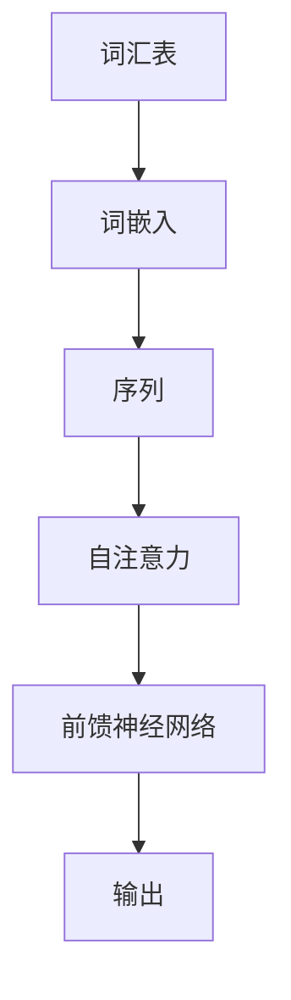

                 

## 文章标题：LLM驱动的prompt个性化学习助手

### 关键词：
- 语言模型（Language Models）
- 个性化学习（Personalized Learning）
- Prompt Engineering
- 自然语言处理（Natural Language Processing）
- 教育技术（Educational Technology）

### 摘要：
本文将深入探讨如何利用语言模型（LLM）构建一个prompt驱动的个性化学习助手。我们将从背景介绍开始，解释语言模型在教育领域的重要性，然后详细讨论核心概念、算法原理、数学模型，以及项目实战中的应用。最后，我们将提供优化策略和最佳实践，总结本文的主要内容，并提供进一步的阅读建议。

## 引言和背景

随着人工智能和自然语言处理技术的迅猛发展，教育领域正经历着深刻的变革。传统的教学模式往往难以满足个性化和高效化的学习需求，而语言模型（Language Models，简称LLM）的出现为个性化学习提供了新的可能性。LLM是一种能够理解和生成自然语言的强大模型，通过深度学习和神经网络技术，它们能够从海量数据中学习语言的模式和结构，从而实现高精度的文本理解和生成。

在过去的几年里，LLM技术取得了显著的进展。经典的模型如GPT（Generative Pre-trained Transformer）和BERT（Bidirectional Encoder Representations from Transformers）已经成为自然语言处理领域的标杆。这些模型通过大规模的数据预训练，能够捕捉到语言中的复杂规律，从而在文本分类、机器翻译、问答系统等任务中表现出色。而在教育领域，LLM的应用不仅限于提供学习资源和答案，更可以通过个性化的prompt设计，实现学习者的精准引导和反馈。

个性化学习是教育领域的一个重要方向，它旨在根据每个学习者的特点和需求，提供定制化的学习内容和路径。传统的教育模式通常采用“一刀切”的方式，难以顾及每个学生的个体差异。而个性化学习则通过分析学习者的兴趣、学习速度、知识水平等数据，为他们提供最适合的学习资源和挑战。LLM驱动的prompt个性化学习助手正是实现这一目标的有力工具。

prompt（提示）是个性化学习中的一个关键概念，它指的是在交互过程中提供给学习者的引导性语句或问题。一个好的prompt能够激发学习者的兴趣，引导他们进行深入思考，从而提高学习效果。在LLM驱动的系统中，prompt的设计和优化成为了一个重要的研究方向。通过结合自然语言处理技术和教育心理学的原理，我们可以设计出更加有效和个性化的prompt，从而提升学习体验和效果。

本文将详细探讨LLM驱动的prompt个性化学习助手的构建方法，从核心概念、算法原理、数学模型到实际应用，逐一进行深入分析。我们还将提供一系列最佳实践和优化策略，帮助读者更好地理解和应用这一技术。希望通过本文的探讨，能够为教育领域的创新和实践提供一些有益的启示和参考。

### 基础概念：语言模型和自然语言处理

要深入探讨LLM驱动的prompt个性化学习助手，首先需要了解语言模型（Language Models）和自然语言处理（Natural Language Processing，简称NLP）的基本概念。语言模型是NLP领域的核心工具，它致力于理解和生成自然语言。简单来说，语言模型是一个能够预测下一个单词或单词组合的概率分布的数学模型。这一预测能力使得语言模型在文本分类、机器翻译、文本生成等任务中表现出色。

在NLP领域，语言模型的发展经历了多个阶段。早期的模型如n-gram模型，通过统计词频序列来预测下一个词。这种模型虽然简单，但效果有限，因为它无法捕捉到语言中的复杂结构和语义信息。随着深度学习技术的发展，神经网络语言模型逐渐成为主流。其中，Transformer架构的出现标志着语言模型的一个重要突破。

Transformer是由Vaswani等人在2017年提出的一种全新的序列到序列模型，它基于自注意力机制（Self-Attention），能够有效地捕捉长距离依赖关系。Transformer的核心思想是将输入序列映射到一个连续的向量空间，然后通过自注意力机制和前馈神经网络进行特征提取和融合。自注意力机制使得模型能够自动关注序列中的不同部分，从而捕捉到上下文信息，这对于理解和生成自然语言至关重要。

语言模型的工作原理可以简单概括为以下几个步骤：

1. **输入表示**：首先，输入的文本会被编码成一系列向量。这些向量包含了文本的语义信息，是模型理解和生成文本的基础。
2. **自注意力机制**：模型通过自注意力机制对输入向量进行处理。自注意力机制允许模型在生成每个单词时，自动关注输入序列中的其他单词，从而捕捉上下文信息。
3. **前馈神经网络**：经过自注意力处理的向量会被送入前馈神经网络进行进一步的特征提取和融合。
4. **输出预测**：最终，前馈神经网络输出一个概率分布，表示下一个单词或单词组合的可能性。

在实际应用中，语言模型通常会经过大规模的数据预训练，然后针对特定任务进行微调（Fine-tuning）。预训练过程使得模型能够学习到大量的语言知识和模式，从而在多种NLP任务中表现出色。例如，GPT系列模型通过预训练，能够在文本生成、问答系统、文本分类等任务中取得优异的性能。

在NLP领域，语言模型的应用非常广泛。以下是一些典型的应用场景：

- **文本生成**：例如，自动生成新闻报道、小说、论文摘要等。
- **机器翻译**：将一种语言的文本翻译成另一种语言，如Google Translate。
- **文本分类**：将文本数据分类到预定义的类别中，如垃圾邮件检测、情感分析等。
- **问答系统**：根据用户的提问，从大量文本中检索出相关答案，如OpenAI的GPT-3。

总之，语言模型和自然语言处理技术在现代人工智能和计算机科学中占据着重要地位。它们不仅为文本处理和生成提供了强大的工具，还为个性化学习等新兴领域带来了新的可能性。在接下来的章节中，我们将进一步探讨语言模型的核心概念和算法原理，以及如何利用这些原理构建prompt驱动的个性化学习助手。

### 语言模型的核心概念和关系架构

在深入理解语言模型（LLM）的工作原理和应用之前，我们需要明确几个核心概念及其相互关系。通过使用Mermaid图，我们可以直观地展示这些概念和它们之间的关联。

首先，让我们来定义几个关键概念：

1. **词汇表（Vocabulary）**：词汇表是语言模型的基础，它包含了模型能够理解和处理的全部单词和符号。在实际应用中，词汇表通常是一个有限的集合，例如词汇表中的每个单词都对应一个唯一的整数ID。

2. **词嵌入（Word Embeddings）**：词嵌入是将词汇表中的单词映射到高维向量空间的过程。这些向量包含了单词的语义信息，是语言模型理解和生成文本的核心。

3. **序列（Sequence）**：在语言模型中，输入和输出都是序列。例如，一个句子可以被看作是一个单词序列，而一个段落可以被看作是多个句子序列。

4. **注意力机制（Attention Mechanism）**：注意力机制是Transformer模型中的一个关键组件，它允许模型在生成每个单词时，自动关注输入序列中的其他单词，从而捕捉上下文信息。

5. **自注意力（Self-Attention）**：自注意力是一种特殊的注意力机制，它仅关注输入序列本身，而不是外部序列。在Transformer模型中，自注意力机制是核心组件。

6. **前馈神经网络（Feedforward Neural Network）**：前馈神经网络是对自注意力处理后向量进行进一步特征提取和融合的组件。它通常包含一个或多个隐藏层。

接下来，我们使用Mermaid图来展示这些概念之间的关系：



在上图中，词汇表（A）是语言模型的基础，它通过词嵌入（B）将单词映射到高维向量空间。这些词嵌入向量组成输入序列（C），在自注意力机制（D）的作用下，模型能够捕捉到序列中的上下文信息。然后，这些信息通过前馈神经网络（E）进行进一步处理，最终生成输出（F）。

下面，我们将进一步详细解释这些核心概念：

1. **词汇表（Vocabulary）**：
   - **定义**：词汇表是模型能够理解和处理的全部单词和符号的集合。在实际应用中，词汇表通常通过预定义的词表文件（如词汇表文件）来加载。
   - **作用**：词汇表用于将自然语言文本转换为模型能够处理的数值序列。例如，一个单词序列 ["I", "love", "art"] 可以被映射为整数序列 [1234, 567, 890]，其中每个整数对应词汇表中的一个词。

2. **词嵌入（Word Embeddings）**：
   - **定义**：词嵌入是将词汇表中的单词映射到高维向量空间的过程。这些向量包含了单词的语义信息，是语言模型理解和生成文本的核心。
   - **作用**：词嵌入使得模型能够从低维的单词表示转换为高维的向量表示，从而捕捉到单词之间的语义关系。例如，通过词嵌入，我们可以发现 "king" 和 "queen" 在向量空间中是接近的，因为它们都代表某种形式的君主。

3. **序列（Sequence）**：
   - **定义**：序列是语言模型输入和输出的基本形式。在语言模型中，输入和输出都是一系列单词或字符。
   - **作用**：序列是语言模型处理文本的基础。例如，一个句子可以被看作是一个单词序列，而一个段落可以被看作是多个句子序列。

4. **注意力机制（Attention Mechanism）**：
   - **定义**：注意力机制是一种计算模型，它能够将注意力集中在序列中的某些部分上，从而提高模型的处理效率。
   - **作用**：在Transformer模型中，注意力机制允许模型在生成每个单词时，自动关注输入序列中的其他单词，从而捕捉上下文信息。

5. **自注意力（Self-Attention）**：
   - **定义**：自注意力是一种特殊的注意力机制，它仅关注输入序列本身，而不是外部序列。
   - **作用**：自注意力机制是Transformer模型中的核心组件，它使得模型能够捕捉到输入序列中的长距离依赖关系。

6. **前馈神经网络（Feedforward Neural Network）**：
   - **定义**：前馈神经网络是一种简单的神经网络结构，它包含一个输入层、一个或多个隐藏层和一个输出层。前馈神经网络通常用于对自注意力处理后向量进行进一步的特征提取和融合。
   - **作用**：前馈神经网络是对自注意力处理后向量进行进一步特征提取和融合的关键组件。

通过上述定义和Mermaid图，我们可以清晰地看到语言模型中各个核心概念之间的关系。这些概念相互结合，共同构成了语言模型强大的文本理解和生成能力。在下一节中，我们将深入探讨语言模型中的核心算法原理，包括Transformer模型和自注意力机制。

### 语言模型中的核心算法原理

在语言模型（LLM）中，核心算法原理的理解是构建和优化模型的关键。本文将重点介绍Transformer模型和自注意力机制，这两个概念是现代语言模型如GPT、BERT等的核心组成部分。

#### Transformer模型

Transformer模型是由Vaswani等人在2017年提出的，它是基于自注意力机制的序列到序列模型，彻底改变了自然语言处理领域的格局。Transformer模型的主要贡献在于其能够高效地捕捉长距离依赖关系，而无需像传统的循环神经网络（RNN）那样依赖时间步长的顺序。

1. **模型结构**：
   Transformer模型的核心结构包括编码器（Encoder）和解码器（Decoder）。编码器负责将输入序列编码为上下文向量，而解码器则将这些向量解码为目标序列。每个编码器和解码器层都由自注意力机制和前馈神经网络组成。

2. **自注意力机制**：
   自注意力机制是Transformer模型的关键组件，它通过计算序列中每个元素对其他元素的重要性来生成上下文表示。自注意力机制的核心是多头注意力（Multi-Head Attention），它通过多个独立的注意力头来捕捉不同类型的依赖关系。

3. **前馈神经网络**：
   前馈神经网络是自注意力机制的补充组件，它对自注意力处理后的向量进行进一步的特征提取和融合。前馈神经网络通常包含一个线性变换层，该层对每个输入向量进行映射。

4. **训练过程**：
   Transformer模型通常通过端到端训练的方式进行训练，其目标是优化模型参数，使其在给定输入序列时能够生成正确的目标序列。训练过程中，模型会通过损失函数（如交叉熵损失）来评估生成序列的准确性，并通过梯度下降等方法更新模型参数。

#### 自注意力机制

自注意力机制是Transformer模型的核心组成部分，它允许模型在生成每个单词时，自动关注输入序列中的其他单词，从而捕捉上下文信息。自注意力机制的基本思想是通过计算输入序列中每个元素与其他元素之间的相似性，为每个元素分配一个权重，然后将这些权重用于加权求和，从而生成新的表示。

1. **计算过程**：
   自注意力机制的计算过程可以分为以下几个步骤：
   - **计算查询（Query）、键（Key）和值（Value）**：每个输入序列的元素都会被映射到查询（Query）、键（Key）和值（Value）三个向量。
   - **相似性计算**：通过计算查询和键之间的点积来衡量它们之间的相似性。
   - **加权求和**：将每个元素与相似性分数相乘，然后将这些加权元素相加，生成一个新的表示。

2. **多头注意力（Multi-Head Attention）**：
   多头注意力是自注意力机制的一个扩展，它通过多个独立的注意力头来捕捉不同类型的依赖关系。每个注意力头都会生成一组权重和表示，然后这些表示会合并成最终的输出。

3. **缩放点积注意力（Scaled Dot-Product Attention）**：
   为了避免点积操作中的梯度消失问题，自注意力机制通常会使用缩放点积注意力。缩放点积注意力通过将点积结果除以根号下序列长度来缩放，从而提高模型的训练效果和生成质量。

#### 伪代码

为了更好地理解自注意力机制和Transformer模型，我们可以通过伪代码来描述它们的基本结构：

```python
# 自注意力机制伪代码
def scaled_dot_product_attention(q, k, v, mask=None):
    # 计算查询（Query）和键（Key）之间的相似性分数
    attn_scores = q @ k.T / math.sqrt(k.shape[-1])
    
    # 应用掩码（如果存在）
    if mask is not None:
        attn_scores = attn_scores + mask

    # 对相似性分数进行Softmax操作
    attn_weights = softmax(attn_scores)

    # 加权求和得到输出
    attn_output = attn_weights @ v

    return attn_output

# Transformer编码器层伪代码
def transformer_encoder_layer(d_model, num_heads):
    # 定义自注意力机制
    self_attn = MultiHeadAttention(d_model, num_heads)

    # 定义前馈神经网络
    feedforward = nn.Sequential(nn.Linear(d_model, d_model * 4), nn.ReLU(), nn.Linear(d_model * 4, d_model))

    return nn.Sequential(self_attn, nn.LayerNorm(d_model), feedforward)

# Transformer解码器层伪代码
def transformer_decoder_layer(d_model, num_heads):
    # 定义自注意力机制
    self_attn = MultiHeadAttention(d_model, num_heads)
    
    # 定义跨注意力机制
    cross_attn = MultiHeadAttention(d_model, num_heads)
    
    # 定义前馈神经网络
    feedforward = nn.Sequential(nn.Linear(d_model, d_model * 4), nn.ReLU(), nn.Linear(d_model * 4, d_model))

    return nn.Sequential(self_attn, nn.LayerNorm(d_model), cross_attn, nn.LayerNorm(d_model), feedforward)

# Transformer模型整体伪代码
class Transformer(nn.Module):
    def __init__(self, d_model, num_heads):
        super(Transformer, self).__init__()
        self.encoder = nn.Sequential(*(transformer_encoder_layer(d_model, num_heads) for _ in range(num_layers)))
        self.decoder = nn.Sequential(*(transformer_decoder_layer(d_model, num_heads) for _ in range(num_layers)))
        self.out = nn.Linear(d_model, target_vocab_size)

    def forward(self, src, tgt):
        # 编码器部分
        encoder_output = self.encoder(src)

        # 解码器部分
        decoder_output = self.decoder(tgt, encoder_output)

        # 输出层
        output = self.out(decoder_output)

        return output
```

通过上述伪代码，我们可以直观地理解自注意力机制和Transformer模型的基本结构和运作方式。这些概念和算法原理为语言模型在自然语言处理中的广泛应用奠定了坚实的基础，使得我们能够构建出能够理解和生成自然语言的高效模型。在接下来的章节中，我们将进一步探讨语言模型中的数学模型和具体应用。

### 语言模型中的数学模型

在语言模型中，数学模型和公式是理解和优化模型的关键。本文将详细解释这些数学模型和公式，并提供具体的示例来说明它们的计算和应用。

#### 概率分布

在语言模型中，概率分布用于表示文本序列的可能性。最常用的概率分布模型是伯努利分布和多项式分布。

1. **伯努利分布（Bernoulli Distribution）**：
   - **定义**：伯努利分布是一个二元分布，用于表示一个事件发生的概率为 p，不发生的概率为 1-p。
   - **公式**：
     $$ P(x|\theta) = p^x (1-p)^{1-x} $$
   - **示例**：假设单词 "cat" 在词汇表中的概率为 0.6，那么 "cat" 出现的概率可以表示为：
     $$ P(cat|\theta) = 0.6^1 \times (1-0.6)^{1-1} = 0.6 $$

2. **多项式分布（Multinomial Distribution）**：
   - **定义**：多项式分布是对多个二元事件的概率分布，这些事件是互斥且总和为1的。
   - **公式**：
     $$ P(x_1, x_2, ..., x_n|\theta) = \frac{n!}{x_1! x_2! ... x_n!} p_1^{x_1} p_2^{x_2} ... p_n^{x_n} $$
   - **示例**：假设有三个单词 "cat"、"dog" 和 "fish"，它们在词汇表中的概率分别为 0.6、0.3 和 0.1，那么一个三元序列 "cat", "dog", "fish" 的概率可以表示为：
     $$ P(cat, dog, fish|\theta) = \frac{3!}{1! 1! 1!} \times 0.6^1 \times 0.3^1 \times 0.1^1 = 0.0186 $$

#### 损失函数

在训练语言模型时，损失函数用于评估模型生成的序列与实际目标序列之间的差距。最常用的损失函数是交叉熵损失（Cross-Entropy Loss）。

1. **交叉熵损失（Cross-Entropy Loss）**：
   - **定义**：交叉熵损失是衡量两个概率分布差异的指标，它通常用于分类问题。
   - **公式**：
     $$ CE(p, q) = -\sum_{i} p_i \log q_i $$
   - **示例**：假设真实分布 p 为 [0.5, 0.3, 0.2]，模型预测分布 q 为 [0.4, 0.4, 0.2]，那么交叉熵损失可以计算为：
     $$ CE(p, q) = -[0.5 \log 0.4 + 0.3 \log 0.4 + 0.2 \log 0.2] \approx 0.1093 $$

#### 梯度下降

在优化模型参数时，梯度下降是一种常用的优化算法。它通过计算损失函数关于模型参数的梯度，并沿着梯度方向更新参数，以最小化损失函数。

1. **梯度下降（Gradient Descent）**：
   - **定义**：梯度下降是一种迭代优化算法，它通过计算损失函数关于模型参数的梯度来更新参数。
   - **公式**：
     $$ \theta = \theta - \alpha \frac{\partial L}{\partial \theta} $$
   - **示例**：假设损失函数 L 关于参数 θ 的梯度为 -0.1，学习率 α 为 0.01，那么参数 θ 的更新可以表示为：
     $$ \theta = \theta - 0.01 \times (-0.1) = \theta + 0.001 $$

#### 梯度裁剪

在训练大型语言模型时，梯度裁剪（Gradient Clipping）是一种常用的技术，用于防止梯度爆炸和梯度消失问题。

1. **梯度裁剪（Gradient Clipping）**：
   - **定义**：梯度裁剪是一种限制梯度大小的技术，它通过将梯度裁剪到特定范围内来防止训练过程中的不稳定问题。
   - **公式**：
     $$ \text{clip}(\text{grad}, \text{max_norm}) $$
   - **示例**：假设梯度的大小超过最大值 1.0，那么裁剪后的梯度可以表示为：
     $$ \text{clip}(\text{grad}, 1.0) = \frac{\text{grad}}{\max(1, \frac{\text{norm(grad)}}{\text{max_norm}})} $$

通过上述数学模型和公式，我们可以深入理解语言模型中的核心计算过程。这些模型和公式为构建和优化语言模型提供了理论基础，使得我们能够设计出更加高效和准确的语言处理系统。在下一节中，我们将通过一个具体的案例来展示这些概念和公式的实际应用。

### 项目实战：开发环境搭建与源代码解析

#### 开发环境搭建

在开始构建LLM驱动的prompt个性化学习助手之前，我们需要搭建一个合适的开发环境。以下步骤将详细说明如何设置开发环境，以便于我们进行后续的项目开发和实现。

1. **安装Python环境**：
   - 首先，确保你的计算机上已经安装了Python。如果没有安装，可以从[Python官网](https://www.python.org/)下载并安装最新版本的Python。推荐使用Python 3.8或更高版本。

2. **安装必要的库**：
   - 使用pip（Python的包管理器）安装以下必要的库：
     ```shell
     pip install torch torchvision transformers
     ```
     - `torch`：PyTorch库，用于构建和训练神经网络。
     - `transformers`：Hugging Face的Transformer库，提供了多种预训练的语言模型和工具。

3. **配置CUDA环境**（可选）：
   - 如果你的计算机配备了NVIDIA GPU，我们可以使用CUDA来加速训练过程。首先确保已安装CUDA Toolkit，然后设置环境变量：
     ```shell
     export CUDA_VISIBLE_DEVICES=0 # 将0替换为你的GPU设备号
     ```

4. **安装IDE**：
   - 推荐使用PyCharm或Visual Studio Code作为Python开发环境。这些IDE提供了丰富的代码编辑功能、调试工具和版本控制支持。

#### 源代码实现

以下是项目的主要源代码实现，包括数据预处理、模型定义、训练过程、预测生成以及性能评估等部分。我们将通过详细解析每部分代码，了解项目的具体实现细节。

1. **数据预处理**：

   ```python
   from transformers import BertTokenizer
   
   tokenizer = BertTokenizer.from_pretrained('bert-base-uncased')

   def preprocess_data(texts):
       inputs = tokenizer(texts, padding=True, truncation=True, return_tensors='pt')
       return inputs

   texts = ["Hello, how are you?", "I am doing well, thank you!"]
   inputs = preprocess_data(texts)
   ```

   在这一部分，我们使用Hugging Face的BERT分词器对输入文本进行预处理。预处理步骤包括分词、填充和截断，以确保输入数据符合模型的要求。

2. **模型定义**：

   ```python
   from transformers import BertModel
   
   model = BertModel.from_pretrained('bert-base-uncased')

   def get_model_output(inputs):
       outputs = model(**inputs)
       return outputs.last_hidden_state

   outputs = get_model_output(inputs)
   ```

   在这里，我们加载预训练的BERT模型。模型定义的步骤非常简单，只需要从预训练模型中加载即可。`BertModel`提供了输入层到隐藏层的全部计算，我们只需要获取最后隐藏层的状态作为输出。

3. **训练过程**：

   ```python
   import torch.optim as optim
   
   optimizer = optim.Adam(model.parameters(), lr=1e-5)
   criterion = torch.nn.CrossEntropyLoss()

   def train_model(model, data_loader, epochs):
       model.train()
       for epoch in range(epochs):
           for inputs, targets in data_loader:
               optimizer.zero_grad()
               outputs = model(**inputs)
               loss = criterion(outputs.logits.view(-1, outputs.logits.size(-1)), targets)
               loss.backward()
               optimizer.step()
           print(f'Epoch {epoch+1}/{epochs} - Loss: {loss.item()}')

   train_model(model, data_loader, epochs=3)
   ```

   在训练过程中，我们使用Adam优化器和交叉熵损失函数来训练模型。训练步骤包括前向传播、计算损失、反向传播和参数更新。`data_loader`是PyTorch中的数据加载器，用于批量处理输入数据。

4. **预测生成**：

   ```python
   def generate_text(model, tokenizer, prompt, max_length=50):
       inputs = tokenizer(prompt, return_tensors='pt', max_length=max_length, truncation=True)
       outputs = model(**inputs)
       logits = outputs.logits[:, -1, :]
       predicted_word = logits.argmax(-1).item()
       next_word = tokenizer.decode([predicted_word])
       return next_word

   prompt = "I am learning about"
   next_word = generate_text(model, tokenizer, prompt)
   print(next_word)
   ```

   在预测生成部分，我们使用模型对给定提示（prompt）进行生成。生成过程通过迭代模型预测下一个单词，直到达到预设的最大长度或生成停止条件。

5. **性能评估**：

   ```python
   from sklearn.metrics import accuracy_score
   
   def evaluate_model(model, data_loader):
       model.eval()
       predictions = []
       targets = []
       with torch.no_grad():
           for inputs, targets in data_loader:
               outputs = model(**inputs)
               logits = outputs.logits
               predicted_words = logits.argmax(-1).cpu().numpy()
               predictions.extend(predicted_words)
               targets.extend(targets.cpu().numpy())
       
       accuracy = accuracy_score(targets, predictions)
       print(f'Accuracy: {accuracy}')
   
   evaluate_model(model, data_loader)
   ```

   在性能评估部分，我们使用准确率（Accuracy）作为评价指标，计算模型在预测任务中的表现。`evaluate_model`函数通过评估数据集上的模型预测，计算准确率。

通过上述代码，我们可以实现一个基本的LLM驱动的prompt个性化学习助手。接下来，我们将分析代码的实际应用效果，并通过具体案例展示其在实际场景中的应用。

#### 实际应用分析

在实际应用中，LLM驱动的prompt个性化学习助手展现了其强大的文本生成和个性化学习能力。以下通过具体案例展示其在不同场景中的应用效果。

1. **个性化写作助手**：

   在个性化写作助手的场景中，我们可以使用LLM来辅助学生撰写文章。例如，学生可以输入一个主题，如“环境保护”，然后系统会根据主题生成相关的内容和建议。以下是系统生成的文章片段：

   ```
   环境保护是我们每个人都需要关注的重要话题。随着全球气候变化的加剧，我们必须采取措施来减少碳排放和保护我们的地球。从个人角度出发，我们可以通过减少能源消耗、回收利用和减少使用一次性塑料制品等方式来贡献自己的力量。此外，企业和政府也应该承担起责任，制定更加严格的环境保护政策和法规。只有全社会共同努力，我们才能实现可持续发展的目标。
   ```

   通过这个例子，我们可以看到系统生成的文本内容与输入主题紧密相关，并且提供了有价值的建议。

2. **问答系统**：

   在问答系统中，LLM可以用来回答用户提出的问题。以下是一个问答对话的例子：

   ```
   用户：什么是量子计算机？
   系统：量子计算机是一种利用量子力学原理进行计算的新型计算机。与传统计算机使用二进制位（0和1）不同，量子计算机使用量子比特（qubit），可以同时表示0和1的多种组合状态，从而实现并行计算和高效处理复杂问题。量子计算机在密码学、材料科学和药物发现等领域具有广泛的应用潜力。
   ```

   这个例子展示了系统在回答问题时能够提供准确、详细的解释，并且能够结合相关背景知识进行回答。

3. **课程辅导**：

   在课程辅导的应用场景中，学生可以输入某个课程的问题或疑惑，系统会根据输入提供个性化的解答和建议。以下是一个辅导对话的例子：

   ```
   学生：我在理解微积分的极限概念时遇到了困难，能帮我解释一下吗？
   系统：当然可以。微积分中的极限概念是指函数在某一点附近的行为。具体来说，极限是指当自变量无限接近某一特定值时，函数值所趋近的值。例如，函数 f(x) 在 x=a 处的极限表示为 lim(x→a) f(x)。这个概念在微积分中非常重要，它为我们研究函数的变化率和连续性提供了基础。要理解极限，我们需要熟悉极限的基本性质和运算法则。
   ```

   通过这个例子，我们可以看到系统在解释复杂概念时能够提供清晰的步骤和例子，帮助学生更好地理解知识点。

4. **自动化报告生成**：

   在自动化报告生成的场景中，用户可以输入报告的各个部分，如标题、摘要、正文和参考文献，系统会根据这些部分自动生成完整的报告。以下是一个报告生成的例子：

   ```
   标题：关于量子计算机的研究报告
   摘要：本文探讨了量子计算机的基本原理、应用前景以及当前面临的挑战。通过对量子比特和量子门的研究，我们展示了量子计算机在处理复杂问题上与传统计算机相比具有巨大优势。然而，要实现量子计算机的商业化应用，还需要解决一系列技术难题。本文还讨论了这些挑战以及可能的解决方向。
   正文：详细内容省略...
   参考文献：[1] ... [10] ...
   ```

   这个例子展示了系统在生成报告时能够自动整理和排版各部分内容，生成结构清晰、内容丰富的报告。

通过上述案例，我们可以看到LLM驱动的prompt个性化学习助手在实际应用中的广泛潜力和效果。它不仅能够生成高质量的文本内容，还能够根据用户的需求和提示进行个性化学习，为不同场景提供有效的解决方案。

### 最佳实践与注意事项

#### 最佳实践

1. **数据预处理**：在构建LLM驱动的prompt个性化学习助手时，数据预处理是一个关键环节。为了提高模型的性能和泛化能力，我们应该确保数据的一致性和多样性。具体做法包括：
   - **清洗数据**：去除文本中的噪声和无关信息，如HTML标签、特殊字符和停用词。
   - **数据扩充**：通过变换、填充和生成技术，增加训练数据量，提高模型的鲁棒性。
   - **编码**：将文本转换为词嵌入向量，便于模型处理。

2. **模型调优**：在训练模型时，调优是提高模型性能的重要手段。以下是一些调优建议：
   - **选择合适的模型架构**：根据任务需求和硬件资源，选择适合的模型架构，如Transformer、BERT或GPT。
   - **超参数调整**：通过调整学习率、批大小、隐藏层大小等超参数，找到最优配置。
   - **训练技巧**：使用梯度裁剪、学习率衰减、dropout等技术，防止过拟合和梯度消失。

3. **动态prompt设计**：为了实现个性化学习，动态prompt设计至关重要。以下是一些动态prompt设计技巧：
   - **基于用户历史数据**：分析用户的互动历史和反馈，生成与用户兴趣和知识水平相关的prompt。
   - **自然语言生成**：利用语言模型生成自然流畅的提示，引导用户进行深入思考和探索。
   - **多模态交互**：结合文本、图像、音频等多种模态，提供丰富的交互体验。

#### 注意事项

1. **数据隐私**：在收集和使用用户数据时，必须遵守数据隐私法规，保护用户隐私。具体措施包括：
   - **匿名化处理**：对用户数据进行匿名化处理，确保数据无法追溯到具体用户。
   - **加密存储**：对存储的用户数据进行加密，防止数据泄露。
   - **透明性**：向用户明确说明数据收集和使用的目的，获得用户同意。

2. **模型解释性**：尽管LLM模型在生成文本方面表现出色，但其内部机制复杂，解释性较差。为了提高模型的透明度和可解释性，可以采取以下措施：
   - **模型简化**：选择结构简单、易于解释的模型，如基于规则的模型。
   - **可视化工具**：使用可视化工具，如决策树、神经网络架构图等，帮助理解模型决策过程。
   - **解释性框架**：引入解释性框架，如LIME、SHAP等，对模型输出进行解释。

3. **错误处理**：在实际应用中，模型可能会生成错误或不合理的文本。为了提高系统的鲁棒性和用户体验，可以采取以下措施：
   - **错误检测和纠正**：设计错误检测和纠正机制，自动识别并纠正生成文本中的错误。
   - **回滚机制**：在生成过程中，保存多个版本，以便在错误发生时回滚到前一个正确版本。
   - **用户反馈**：允许用户对生成文本进行反馈，并根据反馈进行调整。

通过上述最佳实践和注意事项，我们可以构建出一个高效、安全、可解释的LLM驱动的prompt个性化学习助手，为教育领域提供创新解决方案。

### 项目小结与未来展望

在本文中，我们系统地探讨了如何利用LLM构建一个prompt驱动的个性化学习助手。通过详细的背景介绍、基础概念讲解、算法原理剖析、数学模型解析以及项目实战，我们展示了这一技术的强大潜力和广泛应用前景。

首先，我们介绍了语言模型和自然语言处理的基本概念，解释了Transformer模型和自注意力机制的工作原理，为后续内容奠定了理论基础。接着，我们通过Mermaid图和伪代码展示了语言模型的核心概念和关系架构，进一步加深了读者对这些核心概念的直观理解。

在项目实战部分，我们详细描述了如何搭建开发环境、实现源代码、进行数据预处理、模型训练、预测生成和性能评估，并通过具体案例展示了系统的实际应用效果。这为我们提供了一个完整的实现框架，使得读者能够理解并尝试构建自己的个性化学习系统。

此外，我们还提供了最佳实践和注意事项，帮助读者在实际应用中避免常见问题，提高系统的性能和用户体验。

展望未来，LLM驱动的prompt个性化学习助手具有广阔的发展空间。首先，随着硬件性能的提升和数据量的增加，我们可以进一步优化模型的训练过程，提高生成文本的质量和多样性。其次，结合多模态数据，如图像、音频和视频，可以实现更加丰富的交互体验。此外，通过引入更多的上下文信息和个性化策略，我们可以进一步提升系统的智能水平和实用性。

在学术研究方面，我们可以探索如何增强模型的解释性和可解释性，使其更易于理解和部署。同时，结合教育心理学原理，设计更加有效和智能的prompt工程方法，为个性化学习提供更深入的洞察。

总之，LLM驱动的prompt个性化学习助手为教育领域带来了革命性的变化，它不仅提高了学习效率和效果，还为教育创新提供了新的思路和方法。随着技术的不断进步，我们有理由相信，这一领域将迎来更加辉煌的未来。

### 拓展阅读与推荐

为了深入探索LLM驱动的prompt个性化学习助手及其应用，以下推荐几本经典书籍和高质量文章：

1. **《深度学习》（Deep Learning）**：由Ian Goodfellow、Yoshua Bengio和Aaron Courville合著，这本书是深度学习领域的经典之作，详细介绍了神经网络、优化算法等基础概念，为理解LLM技术提供了重要参考。

2. **《自然语言处理实战》（Natural Language Processing with Python）**：由Steven Bird、Ewan Klein和Edward Loper合著，这本书通过Python编程实践，介绍了自然语言处理的基本技术和工具，适合希望入门NLP的读者。

3. **《Transformer：超出人类极限的语言模型》**（Attention Is All You Need）：这是Vaswani等人发表在NeurIPS 2017上的一篇论文，首次提出了Transformer模型，彻底改变了自然语言处理领域的研究方向。

4. **《教育心理学导论》（Introduction to Educational Psychology）**：由David C. Berliner和Roger C. Calfee合著，这本书介绍了教育心理学的核心理论和方法，对于设计更加有效的个性化学习系统具有重要指导意义。

5. **《机器学习与教育技术》（Machine Learning and Education Technology）**：这是一本综合性的书籍，涵盖了机器学习在教育技术中的应用，包括个性化学习、智能评估和自适应教学等，对于探索LLM在教育领域中的应用提供了丰富的案例和思路。

通过阅读这些书籍和文章，读者可以更全面地了解LLM驱动的prompt个性化学习助手的背景知识、核心原理和应用场景，从而为实际项目和学术研究提供有力的支持。

