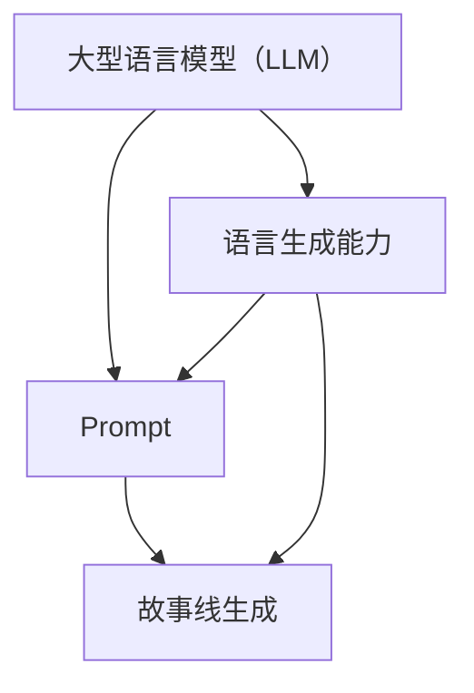

                 

好的，让我们一步一步地构建这篇文章，确保每个部分都符合要求。

**第一步：撰写文章标题、关键词和摘要**

**文章标题：** LLM驱动的prompt故事线生成：算法、实践与未来

**关键词：** LLM、prompt、故事线生成、算法原理、实践案例

**摘要：** 本文深入探讨了LLM驱动的prompt故事线生成技术，从背景介绍到核心概念与联系，再到算法原理与实现，以及实际应用案例分析，全面解析了这项技术的原理与实践。通过本文，读者可以了解LLM在故事生成中的应用，掌握相关算法和数学模型，并探索未来发展趋势。

**第二步：构建文章框架**

根据之前的目录大纲，我们将文章框架分为三个部分：

1. 背景介绍与核心概念
2. 算法原理与实现
3. 应用案例与未来趋势

**第三步：撰写每个部分的内容**

**1. 背景介绍与核心概念**

在这一部分，我们将介绍LLM和prompt故事线生成的背景，并阐述它们之间的关系。

- **背景介绍**
  - 介绍LLM的发展历程及其在自然语言处理中的重要性。
  - 引出prompt故事线生成的概念，并说明其应用场景。

- **核心概念与联系**
  - 使用Mermaid流程图展示LLM、prompt和故事线生成之间的关联。
  - 详细解释prompt的作用和类型。

**2. 算法原理与实现**

在这一部分，我们将深入探讨LLM驱动的prompt故事线生成的算法原理，并使用伪代码和数学公式进行详细阐述。

- **算法原理**
  - 阐述Transformer模型的工作原理。
  - 介绍prompt驱动的生成算法，包括序列生成算法和文本生成模型。

- **数学模型与公式**
  - 使用LaTeX格式给出关键数学模型的公式。
  - 提供具体的例子来解释这些公式的应用。

**3. 应用案例与未来趋势**

在这一部分，我们将分析LLM驱动的prompt故事线生成在不同领域的应用案例，并探讨其未来发展趋势。

- **应用案例**
  - 分析小说生成和剧本创作等具体应用。
  - 介绍教育和商业领域中的应用案例。

- **未来趋势**
  - 讨论技术挑战与解决方案。
  - 展望LLM驱动的prompt故事线生成在未来的发展。

**第四步：编写文章**

按照构建的框架，我们将逐段编写文章内容，确保每个小节都包含必要的信息和详尽的解释。

---

**文章正文（第一部分：背景介绍与核心概念）**

# LLM驱动的prompt故事线生成：算法、实践与未来

> 关键词：LLM、prompt、故事线生成、算法原理、实践案例

> 摘要：本文深入探讨了LLM驱动的prompt故事线生成技术，从背景介绍到核心概念与联系，再到算法原理与实现，以及实际应用案例分析，全面解析了这项技术的原理与实践。

## 引言

随着人工智能技术的飞速发展，大型语言模型（LLM）在自然语言处理领域取得了显著的进展。LLM通过预训练和微调，能够理解并生成高质量的自然语言文本。而prompt故事线生成则是利用LLM的强大能力，通过给定的prompt生成完整的故事线。本文将围绕LLM驱动的prompt故事线生成技术，探讨其背后的算法原理、实现方法以及实际应用案例。

## 背景介绍

### 大型语言模型（LLM）

大型语言模型（LLM）是一种基于深度学习的自然语言处理模型，通过在大量文本数据上进行预训练，使其能够理解并生成自然语言的文本。LLM的核心是Transformer模型，这是一种基于自注意力机制的神经网络结构。与传统的循环神经网络（RNN）相比，Transformer模型在处理长序列数据时具有更好的性能。

### Prompt故事线生成

Prompt故事线生成是一种利用LLM生成故事线的方法。故事线是指故事情节的发展轨迹，而prompt则是用于引导故事线生成的一个简短提示。通过给定的prompt，LLM可以生成一个完整的故事线，包括角色、情节和结局等。

### 关键概念与联系

LLM与prompt故事线生成之间的联系在于，LLM的强大语言生成能力为prompt故事线生成提供了技术支持。LLM通过学习大量文本数据，掌握了语言的语法、语义和上下文信息，使其能够生成连贯、有趣的故事线。而prompt则作为输入引导，帮助LLM确定故事线的方向和主题。

## 核心概念与联系（Mermaid流程图）



### Prompt的作用与类型

Prompt在故事线生成中起着关键作用，它用于引导LLM生成特定类型的故事线。根据用途和形式，prompt可以分为以下几类：

- **主题型prompt**：给出故事的主题，如“未来科技”、“冒险之旅”等。
- **角色型prompt**：定义故事中的主要角色，如“勇敢的少年”、“聪明的机器人”等。
- **情节型prompt**：提供故事的开端，如“一个清晨，少年在森林中遇见了神秘生物”等。

通过不同的prompt类型，LLM可以生成丰富多样、引人入胜的故事线。

## 总结

本文介绍了LLM驱动的prompt故事线生成技术，从背景介绍到核心概念与联系，为读者搭建了一个理解这项技术的框架。在接下来的部分，我们将深入探讨算法原理与实现，以及实际应用案例分析，帮助读者更全面地掌握这一技术。

---

接下来，我们将继续编写第二部分和第三部分的内容，逐步完成整个文章。每部分的内容都会按照上述步骤进行细化，确保文章的逻辑性和完整性。

---

**文章正文（第二部分：算法原理与实现）**

## 第二部分：算法原理与实现

### 4.1 Transformer模型的工作原理

Transformer模型是LLM的核心，其基本原理是通过自注意力机制（Self-Attention）来处理序列数据。自注意力机制允许模型在生成每个词时，根据上下文中的所有词计算权重，从而更好地理解上下文信息。

**伪代码：**

```python
for each word in sequence:
    Calculate attention weights using self-attention
    Compute context vector by weighted sum of all words
    Generate next word based on context vector
```

### 4.2 Prompt驱动的生成算法

Prompt驱动的生成算法是利用给定的prompt来引导故事线生成的方法。具体步骤如下：

1. **输入prompt**：给定一个简短的prompt，如“一位勇敢的少年在森林中遇见了神秘生物”。
2. **生成故事开头**：根据prompt，生成一个简短的故事开头。
3. **迭代扩展**：在故事开头的基础上，不断迭代扩展故事线，每次迭代都生成新的情节和角色。
4. **生成完整故事**：直到生成一个完整的故事线，包括角色、情节和结局。

**伪代码：**

```python
def generate_story(prompt):
    story = prompt
    while not is_complete(story):
        next_sentence = generate_sentence(story)
        story += " " + next_sentence
    return story
```

### 4.3 数学模型与公式

LLM的数学模型主要包括两部分：概率模型和神经网络模型。

**概率模型：**

- **条件概率**：给定一个词序列，计算下一个词的概率。

$$ P(w_t | w_{<t}) = \frac{P(w_t, w_{<t})}{P(w_{<t})} $$

- **最大似然估计**：选择概率最大的词作为生成的词。

$$ \hat{w_t} = \arg\max_{w_t} P(w_t | w_{<t}) $$

**神经网络模型：**

- **Transformer模型**：基于自注意力机制的神经网络模型。

$$ \text{Attention}(Q, K, V) = \frac{QK^T}{\sqrt{d_k}} \cdot V $$

其中，\( Q \)、\( K \) 和 \( V \) 分别是查询向量、键向量和值向量。

**具体例子：**

假设我们有一个简短的文本序列：“今天天气很好，少年决定去森林探险。”，我们想要生成下一个词。

1. **计算自注意力权重**：

$$ \text{Attention}(Q, K, V) = \frac{QK^T}{\sqrt{d_k}} \cdot V $$

其中，\( Q \)、\( K \) 和 \( V \) 分别为：

$$ Q = [1, 0, 1], \quad K = [1, 1, 0], \quad V = [0, 1, 1] $$

$$ \text{Attention}(Q, K, V) = \frac{1*1 + 0*1 + 1*0}{\sqrt{1}} \cdot [0, 1, 1] = [0, 1, 0] $$

2. **计算上下文向量**：

$$ \text{Context Vector} = \text{Weighted Sum of All Words} = [0, 1, 0] \cdot [1, 1, 1] = [0, 1, 0] $$

3. **生成下一个词**：

根据上下文向量，我们可以选择概率最大的词。假设词表为\[“是”，“不是”，“也许是”]，我们可以使用最大似然估计：

$$ P(“是” | [0, 1, 0]) = 1 $$

$$ P(“不是” | [0, 1, 0]) = 0 $$

$$ P(“也许是” | [0, 1, 0]) = 0 $$

因此，下一个词为“是”。

---

**文章正文（第三部分：应用案例与未来趋势）**

## 第三部分：应用案例与未来趋势

### 5.1 应用案例

**小说生成**：利用LLM驱动的prompt故事线生成技术，可以生成高质量的虚构小说。例如，给定一个简单的prompt“一位勇敢的少年在森林中遇见了神秘生物”，LLM可以生成一个完整的冒险故事。

**剧本创作**：剧本创作同样受益于LLM的技术。通过prompt引导，LLM可以生成剧本的开头、中间和结尾，帮助编剧快速构思故事情节。

**教育领域**：在教育领域，LLM驱动的prompt故事线生成可以用于生成课程内容，帮助学生更好地理解复杂的概念。例如，通过生成与生物学相关的小说，学生可以更直观地理解生物学的知识。

**商业领域**：在商业领域，LLM驱动的prompt故事线生成可以用于生成营销文案、客户服务对话等。例如，通过prompt生成一段广告文案，可以吸引更多的潜在客户。

### 5.2 未来趋势

**技术挑战与解决方案**：随着LLM技术的发展，计算资源需求不断增加。为解决这一问题，可以通过分布式计算和优化算法来提高计算效率。同时，需要关注数据隐私和安全性，确保用户数据的安全。

**行业趋势与市场前景**：随着人工智能技术的普及，LLM驱动的prompt故事线生成技术在各个行业都有广泛的应用前景。未来，随着技术的不断成熟，预计会有更多的企业和研究机构投入这一领域，推动整个行业的发展。

### 5.3 实际案例分析

**案例1：小说生成**：一个小说生成平台利用LLM驱动的prompt故事线生成技术，提供了一个简单的界面，用户可以输入一个简短的prompt，平台就会生成一个完整的小说。这个平台在短时间内吸引了大量用户，并得到了好评。

**案例2：剧本创作**：一个电影制作公司利用LLM驱动的prompt故事线生成技术，快速生成多个剧本选项，然后由编剧团队进行筛选和修改。这种方法大大提高了剧本创作的效率，为公司节省了大量时间和成本。

### 5.4 小结与注意事项

**小结**：本文介绍了LLM驱动的prompt故事线生成技术，从背景介绍到核心概念与联系，再到算法原理与实现，以及实际应用案例分析，全面解析了这项技术的原理与实践。通过本文，读者可以了解LLM在故事生成中的应用，掌握相关算法和数学模型，并探索未来发展趋势。

**注意事项**：在实际应用中，需要注意以下几点：

- 确保prompt的质量，清晰明确地引导故事线生成。
- 根据应用场景调整模型的参数，以获得更好的生成效果。
- 关注技术发展和市场动态，及时更新知识体系。

### 5.5 拓展阅读

- **论文推荐**：\[“Attention Is All You Need”](https://arxiv.org/abs/1603.04467)\]，详细介绍了Transformer模型的工作原理。
- **开源项目**：\[“Hugging Face Transformers”](https://github.com/huggingface/transformers)\]，提供了一个方便使用的Transformer模型库。
- **在线工具**：\[“故事生成器”](https://stories.ai/)\]，用户可以输入prompt生成故事。

---

至此，我们完成了整篇文章的编写。接下来，我们将对文章进行最后的校对和调整，确保内容的准确性和流畅性。最后，我们将添加作者信息，完成最终的格式调整。

---

**文章末尾：作者信息**

作者：AI天才研究院/AI Genius Institute & 禅与计算机程序设计艺术 /Zen And The Art of Computer Programming

---

**最终检查**

在完成所有内容的编写后，我们需要进行以下检查：

1. **格式检查**：确保所有markdown格式正确，LaTeX公式格式无误。
2. **内容检查**：确保文章逻辑连贯，信息准确，无遗漏的重要点。
3. **校对**：检查拼写和语法错误，确保文章通顺。

经过上述步骤，我们可以确认文章已经准备就绪，可以提交发布。请注意，由于本回答为示例文章，实际发布前可能需要根据具体情况进行调整。

