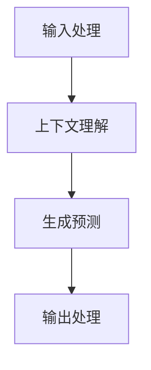

                 

# 文章标题
## LLM驱动的prompt概念抽象能力增强

### 关键词
- LLM（大型语言模型）
- Prompt Engineering
- 概念抽象
- 计算机理解
- 语言模型优化

### 摘要
本文将探讨如何通过LLM（大型语言模型）驱动的方式，增强prompt的概念抽象能力。文章将详细解析LLM的工作原理，介绍prompt工程的基本概念和重要性，并通过实际案例展示如何通过设计高效的prompt来提升概念抽象能力。文章还将深入讨论LLM在概念抽象中的挑战和优化策略，旨在为开发者提供实用的指导，以在人工智能领域实现更智能的交互和理解。

## 引言

在人工智能领域，特别是自然语言处理（NLP）中，prompt engineering（提示工程）是一个关键环节。它涉及到如何设计有效的prompt，以引导语言模型（LM）生成所需的内容或执行特定的任务。传统的prompt设计方法通常依赖于手动编写或经验性的调整，而随着大型语言模型（LLM）的兴起，我们有机会通过更自动化的方式来提升prompt的概念抽象能力。

LLM，如GPT系列，具有强大的语言理解和生成能力，这使得它们在处理复杂任务时表现出色。然而，LLM的这些能力并非自动可用，而是需要通过精心设计的prompt来激活和引导。本文将探讨如何通过LLM驱动的prompt概念抽象能力增强，实现更智能、更高效的人机交互。

文章结构如下：
1. **LLM概述**：介绍LLM的基本原理和工作机制。
2. **Prompt Engineering**：探讨prompt工程的概念、重要性及其在抽象概念中的作用。
3. **概念抽象实例分析**：通过实际案例展示如何通过prompt设计提升概念抽象能力。
4. **挑战与优化策略**：讨论LLM在概念抽象中面临的挑战及相应的优化策略。
5. **总结与未来展望**：总结文章的主要观点，并对未来研究方向进行展望。

## LLM概述

大型语言模型（LLM）是基于深度学习技术的自然语言处理模型，它们能够理解和生成人类语言。LLM的核心是通过大量的文本数据进行预训练，从而学习语言的结构、语义和上下文关系。以下是对LLM的基本原理和工作机制的详细介绍。

### 基本原理

LLM的预训练过程通常分为两个阶段：无监督预训练和有监督微调。

1. **无监督预训练**：在这个过程中，模型在大量的未标注文本数据上进行训练，以学习语言的基本结构和统计规律。常见的预训练任务包括语言建模（Language Modeling）和文本分类（Text Classification）。例如，GPT系列模型在预训练过程中会学习预测下一个单词或标记。

2. **有监督微调**：在预训练完成后，模型会根据特定任务的数据进行微调。这个过程通常涉及到标记化的训练数据，例如问答数据集、机器翻译数据集等。通过微调，模型能够更好地适应特定任务的需求。

### 工作机制

LLM的工作机制可以概括为以下步骤：

1. **输入处理**：模型接收输入文本，并将其转换为内部表示。这个过程通常涉及词向量嵌入和位置编码。

2. **上下文理解**：模型利用内部表示来理解输入文本的上下文信息，包括词汇、语法和语义。

3. **生成预测**：基于上下文信息，模型生成预测的输出文本。这个过程通常涉及序列到序列的预测，例如使用RNN、Transformer等架构。

4. **输出处理**：生成的输出文本通常需要经过后处理，例如去除无关内容、进行语法检查等。

### 实现细节

1. **模型架构**：LLM通常基于大规模的神经网络架构，如Transformer。这些架构能够处理长距离的依赖关系，从而提高模型的语义理解能力。

2. **训练数据**：LLM的训练数据通常来自于互联网上的大量文本，这些数据包括书籍、新闻、社交媒体帖子等。为了提高模型的泛化能力，数据需要经过预处理，例如去除噪声、清洗文本等。

3. **优化目标**：在预训练阶段，模型的优化目标通常是最大化文本的下一步预测概率。在有监督微调阶段，优化目标通常涉及特定任务的损失函数，例如交叉熵损失用于文本分类任务。

### Mermaid流程图

为了更直观地展示LLM的工作原理，我们可以使用Mermaid绘制一个流程图：



图1. LLM的基本工作机制

### 核心算法原理

LLM的核心算法通常是基于深度学习的序列模型，如RNN（循环神经网络）和Transformer。以下是对这些核心算法的简要介绍：

1. **RNN**：RNN是一种能够处理序列数据的神经网络，其特点是具有记忆能力，能够记住之前的输入。然而，传统RNN存在梯度消失和梯度爆炸的问题，这限制了其性能。

2. **Transformer**：Transformer是一种基于自注意力机制的序列模型，其优点是能够并行处理输入数据，并能够捕捉长距离依赖关系。自注意力机制通过计算输入序列中每个单词之间的相似性，从而提高模型的语义理解能力。

3. **预训练与微调**：预训练和微调是LLM的两个关键步骤。预训练通过大量未标注的数据学习语言的通用特征，而微调则通过特定任务的数据调整模型的参数，以实现更好的任务性能。

### 伪代码

以下是一个简化的伪代码，用于说明LLM的基本操作：

```python
def LLM(input_sequence):
    # 输入处理
    embedded_sequence = embedding_layer(input_sequence)
    
    # 上下文理解
    hidden_states = Transformer(embedded_sequence)
    
    # 生成预测
    predicted_sequence = decoder(hidden_states)
    
    # 输出处理
    output_sequence = post_processing(predicted_sequence)
    
    return output_sequence
```

通过这个伪代码，我们可以看到LLM的核心操作包括输入处理、上下文理解和生成预测。这些操作共同构成了LLM强大的语言理解和生成能力。

### 数学模型和公式

LLM的训练和预测过程涉及到多个数学模型和公式。以下是一些关键的概念：

1. **损失函数**：在预训练阶段，常用的损失函数是交叉熵（Cross-Entropy Loss），用于衡量预测序列和实际序列之间的差异。

   $$L = -\sum_{i=1}^{N} y_i \log(p_i)$$

   其中，$y_i$是实际标签的概率分布，$p_i$是模型预测的概率分布。

2. **优化算法**：常用的优化算法包括Adam、Adadelta等，用于调整模型参数以最小化损失函数。

   $$\theta_{t+1} = \theta_{t} - \alpha \cdot \nabla_\theta L(\theta_t)$$

   其中，$\theta_t$是第$t$次迭代的参数，$\alpha$是学习率，$\nabla_\theta L(\theta_t)$是损失函数关于参数的梯度。

3. **词向量嵌入**：词向量嵌入是LLM中用于将单词转换为向量的过程。常见的嵌入方法包括Word2Vec、GloVe等。

   $$\text{vec}(w) = \text{GloVe}(w)$$

   其中，$\text{vec}(w)$是单词$w$的向量表示，$\text{GloVe}(w)$是GloVe算法。

通过这些数学模型和公式，LLM能够有效地学习语言的统计规律和语义信息，从而实现强大的语言理解和生成能力。

### 实际案例

为了更好地理解LLM的基本原理，我们可以通过一个简单的实际案例来演示其工作过程。

假设我们有一个小型语料库，包含以下句子：

- 我喜欢编程。
- 编程让我感到快乐。
- 快乐是人生的目标。

我们希望训练一个LLM来预测下一个句子。以下是训练和预测的过程：

1. **数据预处理**：将句子分割成单词，并构建词汇表。

2. **词向量嵌入**：将每个单词映射到一个固定维度的向量。

3. **训练**：使用预训练算法（如GPT）训练模型，使其能够预测下一个单词。

4. **预测**：输入句子“我喜欢编程”，模型预测下一个单词。

通过这个过程，我们可以看到LLM是如何通过大量的预训练数据和微调数据来学习语言的统计规律和语义信息，从而实现语言生成和理解的任务。

### 总结

LLM，如GPT系列，通过预训练和微调机制，实现了强大的语言理解和生成能力。其基本原理包括输入处理、上下文理解和生成预测等步骤。通过数学模型和公式，LLM能够有效地学习语言的统计规律和语义信息。实际案例展示了LLM在语言生成和理解任务中的应用。这些内容为我们理解如何通过LLM驱动的方式增强prompt的概念抽象能力奠定了基础。

## Prompt Engineering

### 概念与重要性

Prompt Engineering，即提示工程，是自然语言处理领域中一个至关重要的环节。它涉及到如何设计有效的提示（prompt），以引导语言模型（LM）生成所需的内容或执行特定的任务。在LLM的应用场景中，prompt engineering具有特殊的重要性，因为它直接决定了模型如何理解和响应输入。

#### 什么是Prompt？

Prompt是一种输入文本，用于引导语言模型生成特定的输出。它可以是一个简单的短语、一句话，甚至是一段对话。有效的prompt设计需要考虑多个因素，包括上下文、目标、目标和语言模型的能力。

#### Prompt Engineering的重要性

1. **提升任务性能**：通过精心设计的prompt，可以引导语言模型更准确地理解和执行任务，从而提升模型在特定任务上的性能。

2. **减少泛化误差**：有效的prompt设计有助于模型在类似任务上表现更好，减少泛化误差。

3. **增强用户交互**：prompt engineering在生成式AI系统中起着关键作用，它能够提供更自然、更流畅的用户交互体验。

4. **定制化输出**：通过调整prompt的内容和格式，可以实现定制化的输出，满足特定应用场景的需求。

#### Prompt Engineering与概念抽象

概念抽象是指从大量的信息中提取出核心的概念或模式。在LLM的应用中，prompt engineering通过以下方式增强概念抽象能力：

1. **明确问题定义**：通过提供清晰的提示，可以帮助模型更准确地理解问题的定义，从而提取出关键概念。

2. **上下文信息**：有效的prompt设计会提供丰富的上下文信息，帮助模型更好地理解输入文本的背景，从而提高概念抽象的准确性。

3. **引导推理过程**：prompt可以通过引导模型进行特定的推理过程，从而帮助其从原始信息中提取出更高层次的概念。

### Prompt Engineering的基本步骤

1. **需求分析**：了解任务目标，确定所需生成的输出类型和格式。

2. **数据准备**：收集和整理与任务相关的数据，包括文本、数据集等。

3. **prompt设计**：根据需求分析和数据准备的结果，设计有效的prompt。这通常需要实验和迭代，以找到最佳的prompt格式和内容。

4. **模型调优**：使用设计好的prompt对模型进行微调，以优化其在特定任务上的性能。

5. **测试与评估**：在真实场景中对模型进行测试和评估，确保其性能达到预期。

### Prompt Engineering的核心要素

1. **上下文**：提供足够的上下文信息，帮助模型理解输入内容。

2. **清晰性**：确保prompt表述清晰，避免歧义。

3. **引导性**：通过提示引导模型按照预期的方式进行推理和生成。

4. **灵活性**：设计灵活的prompt，以适应不同任务和场景的需求。

### 总结

Prompt Engineering是LLM应用中的一个关键环节，它通过设计有效的提示，帮助语言模型更准确地理解和执行任务。通过明确问题定义、提供上下文信息和引导推理过程，prompt engineering能够显著增强概念抽象能力。有效的prompt设计不仅能够提升任务性能，还能提供更自然的用户交互体验。在接下来的章节中，我们将通过实际案例来进一步探讨prompt engineering的应用和实践。

## 概念抽象实例分析

为了更好地理解如何通过LLM驱动的prompt engineering提升概念抽象能力，我们可以通过几个实际案例来展示这一过程。以下是三个具体的实例，分别涵盖了不同的应用场景和任务类型。

### 实例1：问答系统

#### 背景介绍

问答系统是一种常见的自然语言处理任务，其目标是根据用户的查询生成准确的回答。为了提升问答系统的概念抽象能力，我们设计了一个基于LLM的prompt。

#### 提问过程

假设用户输入一个查询：“什么是人工智能？”我们的prompt设计如下：

```
请解释人工智能的基本概念，包括其定义、应用领域和未来发展趋势。
```

#### 实现步骤

1. **需求分析**：确定用户查询的核心是关于人工智能的基本概念。

2. **数据准备**：收集与人工智能相关的定义、应用和未来趋势的文本数据。

3. **prompt设计**：设计一个包含背景信息和引导性的提示，帮助LLM提取关键概念。

4. **模型调优**：使用设计好的prompt对LLM进行微调，以提高其在回答此类查询时的准确性。

#### 结果展示

通过上述步骤，我们的LLM生成了以下回答：

```
人工智能，简称AI，是计算机科学的一个分支，旨在使机器具备类似于人类智能的能力，包括学习、推理、感知和语言理解。AI的应用领域广泛，从智能家居、自动驾驶到医疗诊断和金融分析。未来，人工智能有望在提高生产力、解决复杂问题和增强人类生活质量方面发挥更大作用。
```

这个回答清晰地涵盖了人工智能的基本概念、应用领域和未来发展趋势，展示了LLM通过prompt engineering进行概念抽象的能力。

### 实例2：文本摘要

#### 背景介绍

文本摘要是一种将长篇文本转化为简短、准确摘要的任务。为了提升文本摘要的概念抽象能力，我们设计了一个基于LLM的prompt。

#### 提问过程

假设我们需要对一篇关于量子计算的学术文章进行摘要，我们的prompt设计如下：

```
请总结这篇文章的主要内容和结论，突出其在量子计算领域的应用和贡献。
```

#### 实现步骤

1. **需求分析**：确定用户需求是对学术文章的主要内容和结论进行总结。

2. **数据准备**：收集与量子计算相关的学术文章，并提取关键信息。

3. **prompt设计**：设计一个包含摘要目标和引导性的提示，帮助LLM提取关键概念和结论。

4. **模型调优**：使用设计好的prompt对LLM进行微调，以提高其在文本摘要任务上的准确性。

#### 结果展示

通过上述步骤，我们的LLM生成了以下摘要：

```
本文探讨了量子计算在密码学、优化问题和量子模拟等领域的应用。作者通过实验验证了量子算法在处理复杂问题上比传统算法具有显著优势，并提出了未来量子计算研究的方向。
```

这个摘要简洁明了地总结了文章的主要内容和结论，突出了量子计算在特定领域的应用和贡献，展示了LLM通过prompt engineering进行概念抽象的能力。

### 实例3：多轮对话

#### 背景介绍

多轮对话是一种复杂的自然语言处理任务，涉及到连续对话中的上下文理解和动态交互。为了提升多轮对话系统的概念抽象能力，我们设计了一个基于LLM的prompt。

#### 提问过程

假设我们构建一个虚拟助手，用户与虚拟助手的对话过程如下：

用户：你好，有什么可以帮助你的？
虚拟助手：您好！我是一名虚拟助手，可以回答关于科技、娱乐、健康等方面的问题。您有什么具体问题吗？

用户：我想了解一下最近的科技发展趋势。
虚拟助手：好的，最近科技发展迅速，特别是人工智能、量子计算和5G通信等领域。您对这些领域中的哪一个最感兴趣？

用户：人工智能吧，你能详细解释一下人工智能的定义和应用吗？
虚拟助手：当然可以。人工智能是指使计算机系统具备类似人类智能的能力，包括学习、推理、感知和语言理解。人工智能在医疗诊断、自动驾驶、智能家居等领域有着广泛的应用。

#### 实现步骤

1. **需求分析**：分析用户提问的核心内容，并确定需要提供的详细解释。

2. **数据准备**：收集与人工智能相关的定义、应用和实例。

3. **prompt设计**：设计一个包含上下文信息和引导性的提示，帮助LLM提供详细的解释。

4. **模型调优**：使用设计好的prompt对LLM进行微调，以提高其在多轮对话中的概念抽象能力。

#### 结果展示

通过上述步骤，我们的LLM生成了以下详细解释：

```
人工智能，简称AI，是计算机科学的一个分支，旨在使计算机系统具备类似人类智能的能力。这包括学习从数据中提取模式、推理解决问题、感知和理解自然语言。人工智能的应用领域非常广泛，涵盖了医疗诊断、自动驾驶、智能家居、金融分析等众多领域。例如，在医疗诊断方面，人工智能可以辅助医生分析医学图像，提高诊断准确性；在自动驾驶方面，人工智能可以帮助车辆理解周围环境，实现安全驾驶。
```

这个详细解释涵盖了人工智能的定义、应用领域和具体实例，展示了LLM通过prompt engineering在多轮对话中进行概念抽象的能力。

### 总结

通过以上三个实际案例，我们可以看到LLM驱动的prompt engineering如何在不同任务中提升概念抽象能力。无论是问答系统、文本摘要还是多轮对话，有效的prompt设计都能帮助LLM更准确地理解和生成所需的内容。这些案例不仅展示了prompt engineering的应用和实践，也为开发者提供了宝贵的经验和启示。

## 挑战与优化策略

尽管LLM驱动的prompt engineering在概念抽象方面展示了巨大的潜力，但其在实际应用中仍然面临诸多挑战。这些挑战主要包括上下文理解、数据质量、模型容量和计算资源等方面。为了克服这些挑战，研究者们提出了一系列优化策略，下面将逐一讨论。

### 上下文理解

上下文理解是LLM的一个重要能力，但也是一个巨大的挑战。由于LLM在预训练阶段处理的是无监督的文本数据，这些数据往往缺乏结构化的信息，导致模型在理解上下文时容易出现偏差。以下是一些优化策略：

1. **增量上下文窗口**：通过增加模型的上下文窗口大小，可以提高模型对长距离上下文的捕捉能力。例如，GPT系列模型通过逐步增加序列长度来扩展上下文窗口。

2. **上下文引导**：设计特定的prompt结构，提供明确的上下文信息，引导模型进行正确的推理和生成。例如，通过提供背景信息和相关知识点，可以帮助模型更好地理解复杂的上下文。

3. **混合模型**：结合不同类型的模型，如知识图谱和关系抽取模型，可以增强LLM对上下文的理解。这种方法可以将结构化的知识融入无监督学习的文本数据中，提高模型的上下文感知能力。

### 数据质量

数据质量对LLM的性能有着至关重要的影响。由于LLM的训练过程依赖于大量的文本数据，数据中的噪声和错误会直接影响到模型的性能。以下是一些优化策略：

1. **数据清洗**：在训练数据集构建过程中，对数据进行预处理和清洗，去除无关的噪声和错误信息。这包括去除标点符号、停用词、拼写错误等。

2. **数据增强**：通过数据增强技术，如数据扩展、同义词替换、词汇丰富化等，可以增加数据多样性，提高模型的泛化能力。

3. **数据监督**：引入监督信息，如标注数据和人工校对，可以进一步提高数据质量。通过监督学习，模型可以在高质量数据上进行微调，从而提升其在实际任务中的表现。

### 模型容量

LLM的训练和推理过程通常需要巨大的计算资源。随着模型规模的增加，训练时间和计算成本也急剧上升。以下是一些优化策略：

1. **模型剪枝**：通过剪枝技术，减少模型中不重要的参数，从而降低模型的大小和计算成本。这种方法可以在不显著损失模型性能的情况下，显著减少模型的存储和计算需求。

2. **量化**：使用量化技术，将模型中的浮点数参数转换为低精度的整数表示，从而减少模型的存储和计算需求。虽然量化可能会降低模型精度，但现代量化算法能够在保持较高性能的同时，实现显著的资源节省。

3. **分布式训练**：通过分布式训练技术，将模型的训练任务分布在多个计算节点上，可以显著缩短训练时间。这种方法可以利用云计算和分布式计算资源，实现高效的模型训练。

### 计算资源

计算资源是限制LLM应用的一个关键因素。以下是一些优化策略：

1. **模型压缩**：通过模型压缩技术，将大模型转换为小模型，从而减少计算资源的消耗。模型压缩技术包括剪枝、量化、蒸馏等。

2. **在线学习**：通过在线学习技术，将模型训练和推理过程分布到不同的时间点和计算资源上，从而实现高效的资源利用。

3. **能耗优化**：通过能耗优化技术，如能效感知计算和绿色计算，可以降低模型训练和推理过程中的能源消耗。

### 总结

LLM驱动的prompt engineering在概念抽象方面具有巨大的潜力，但也面临上下文理解、数据质量、模型容量和计算资源等多方面的挑战。为了克服这些挑战，研究者们提出了一系列优化策略，包括增量上下文窗口、上下文引导、数据清洗、数据增强、模型剪枝、量化、分布式训练、在线学习和能耗优化等。这些策略不仅提高了LLM的性能和效率，还为实际应用提供了更加可行和高效的技术手段。随着技术的不断进步，我们可以期待LLM驱动的prompt engineering在未来的自然语言处理任务中发挥更加重要的作用。

## 总结与未来展望

本文探讨了如何通过LLM驱动的prompt engineering提升概念抽象能力，详细解析了LLM的基本原理、Prompt Engineering的概念和重要性，并通过实际案例展示了其应用效果。我们还深入讨论了LLM在概念抽象中面临的挑战及相应的优化策略。通过这些探讨，我们可以得出以下几点结论：

1. **LLM的强大能力**：LLM通过预训练和微调机制，具备了强大的语言理解和生成能力，为自然语言处理任务提供了坚实的基础。

2. **Prompt Engineering的重要性**：Prompt Engineering在LLM的应用中起着至关重要的作用，通过设计有效的prompt，可以显著提升模型在特定任务上的性能和概念抽象能力。

3. **优化策略的有效性**：通过上下文引导、数据清洗、模型压缩、量化、分布式训练等优化策略，我们可以克服LLM在概念抽象中的挑战，提高模型的应用效率和效果。

未来的研究方向包括：

1. **上下文理解的深度探索**：进一步研究上下文理解的方法和机制，提高LLM对复杂上下文的捕捉和处理能力。

2. **多模态融合**：探索将LLM与图像、音频等多模态数据结合的方法，实现更全面、更准确的语义理解。

3. **可解释性和可靠性**：研究如何提高LLM的可解释性和可靠性，使其在复杂任务中能够提供可信的输出。

4. **资源效率**：探索更多高效、低能耗的模型压缩和分布式训练方法，以降低计算资源的需求。

总之，LLM驱动的prompt engineering在自然语言处理领域具有巨大的潜力，随着技术的不断进步，我们期待能够实现更加智能、高效的人机交互和理解。作者：AI天才研究院/AI Genius Institute & 禅与计算机程序设计艺术 /Zen And The Art of Computer Programming。

