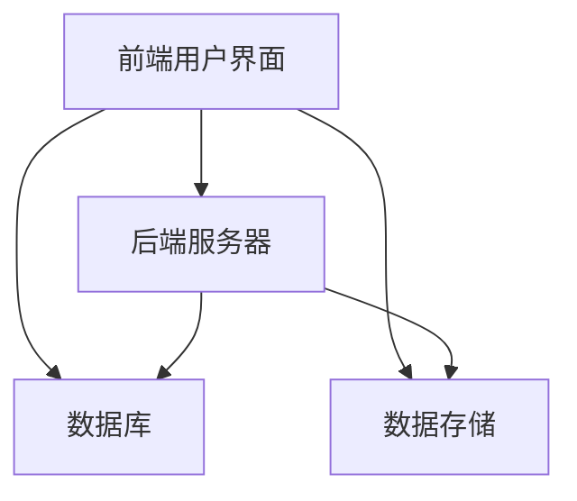
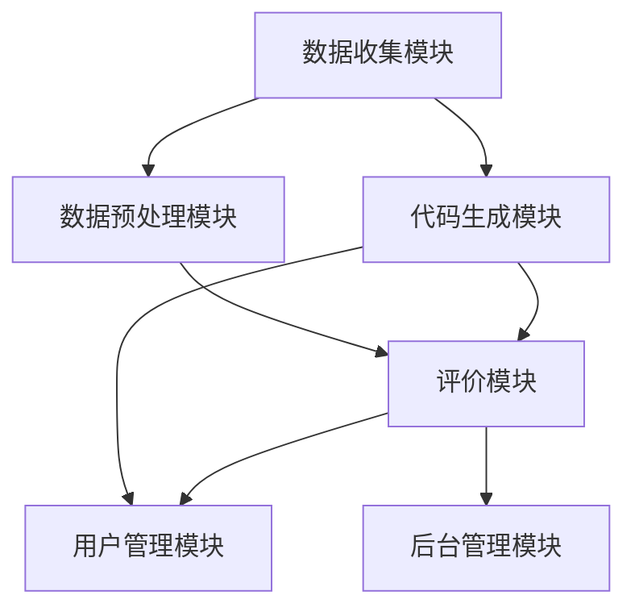

                 

## 文章标题

《LLM驱动的代码生成能力评测平台》

### 关键词

- LLM驱动的代码生成
- 评测平台
- 代码质量评价
- 自动化软件工程
- 人工智能

### 摘要

本文将深入探讨如何设计并实现一个基于大型语言模型（LLM）驱动的代码生成能力评测平台。我们首先介绍了LLM的基本概念、原理以及其在代码生成中的应用。接着，详细讨论了评测平台的架构设计、数据预处理、评价指标的制定及实现。通过实际的案例分析和代码解读，本文展示了如何利用这个平台对LLM驱动的代码生成进行全面的评估。最后，我们探讨了未来研究的方向和潜在挑战，为读者提供了有价值的实践指导和进一步研究的启示。

### 1. Conceptual Framework

为了全面理解LLM驱动的代码生成能力评测平台的设计与实现，我们首先需要搭建一个概念性的框架，这一框架将包括以下几个核心组成部分：LLM的基本概念、平台架构设计、评价指标体系、数据预处理方法和实际应用案例。

#### 1.1. LLM的基本概念

大型语言模型（LLM）是一种基于深度学习的自然语言处理模型，其核心目的是理解和生成自然语言。LLM通过大量文本数据进行预训练，可以捕捉到语言中的复杂结构和语义信息。这种强大的语言理解能力使得LLM在多种应用场景中表现优异，包括文本生成、问答系统、机器翻译和代码生成等。

#### 1.2. 平台架构设计

评测平台的架构设计需要考虑以下几个方面：

1. **系统架构**：确定平台的整体结构，包括前端用户界面、后端服务器、数据库和数据存储。
2. **模块设计**：将平台划分为多个功能模块，如数据收集模块、代码生成模块、评价模块等，每个模块负责不同的任务。
3. **接口设计**：设计清晰简洁的API接口，便于与其他系统或工具的集成。

#### 1.3. 评价指标体系

评价指标体系是评测平台的核心组成部分，它决定了我们如何衡量LLM驱动的代码生成能力。常见的评价指标包括：

1. **代码质量**：如语法正确性、逻辑正确性、代码可读性等。
2. **性能**：如代码的运行速度、内存占用等。
3. **开发者体验**：如代码生成的效率、生成的代码是否符合开发者的期望等。

#### 1.4. 数据预处理方法

数据预处理是确保模型性能和代码生成质量的关键步骤。数据预处理包括以下任务：

1. **数据收集**：从各种来源收集适合训练和评测的代码数据。
2. **数据清洗**：去除噪声数据，确保数据的一致性和完整性。
3. **数据增强**：通过数据变换、增广等技术提高数据的多样性和模型的鲁棒性。

#### 1.5. 实际应用案例

为了验证评测平台的实用性，我们需要通过实际应用案例来展示其效果。案例可以包括：

1. **代码生成任务**：展示平台如何自动生成不同类型的代码，并对其质量进行评价。
2. **案例解析**：深入分析一个或多个应用场景，解释平台如何应对具体问题，并提出改进建议。

通过上述五个核心组成部分，我们可以搭建一个完整的概念性框架，为后续详细设计和实现LLM驱动的代码生成能力评测平台奠定基础。

### 1.1. LLM驱动的代码生成：基本概念与原理

#### 背景介绍

随着人工智能技术的快速发展，大型语言模型（LLM）在自然语言处理（NLP）领域取得了显著的成果。LLM能够通过深度学习算法从大规模语料库中学习语言模式，从而实现高效的文本生成、理解和推理。在软件工程领域，LLM同样展现出了巨大的潜力，特别是在代码生成方面。代码生成是一种自动化软件工程技术，它利用自然语言描述来生成计算机代码，从而提高开发效率、减少手动编码工作量。

#### 核心概念

1. **自然语言描述**：用户可以使用自然语言描述功能需求、算法逻辑等，这种描述可以是文本形式，也可以是语音、图像等其他形式。
2. **代码生成模型**：LLM通过训练生成代码模型，能够根据自然语言输入自动生成相应的代码。
3. **代码质量**：生成的代码需要满足一定的质量标准，包括语法正确性、逻辑正确性、可读性等。
4. **代码性能**：生成的代码需要在实际运行中具有高效的性能，如运行速度、内存占用等。

#### 工作原理

LLM驱动的代码生成主要分为以下几个步骤：

1. **文本输入**：用户输入自然语言描述，这可以是功能需求、算法逻辑等。
2. **预训练**：LLM使用大规模文本数据进行预训练，学习到语言的基本结构和语义。
3. **编码器-解码器架构**：LLM通常采用编码器-解码器（Encoder-Decoder）架构，编码器将自然语言文本编码为固定长度的向量，解码器根据这些向量生成代码。
4. **代码生成**：解码器输出代码，通过后处理（如语法检查、格式化等）确保代码质量。
5. **性能优化**：通过调整模型参数、优化代码结构等方式，提高代码生成的性能。

#### 优势与局限性

**优势：**

1. **高效率**：通过自然语言描述快速生成代码，显著提高开发效率。
2. **可定制性**：用户可以根据需求调整代码生成的参数，满足个性化需求。
3. **减轻开发负担**：自动化代码生成可以减轻开发者的工作负担，让他们有更多时间专注于业务逻辑。

**局限性：**

1. **代码质量**：虽然LLM能够生成一定质量的代码，但仍然可能存在语法错误、逻辑缺陷等问题。
2. **可解释性**：生成的代码往往缺乏可解释性，难以理解其内部逻辑。
3. **性能**：代码生成的速度和效率可能无法满足高负载场景的需求。

#### 应用场景

1. **原型设计**：开发者可以使用自然语言描述原型功能，快速生成代码，进行初步验证。
2. **代码补全**：在编写代码过程中，LLM可以自动补全代码片段，减少手动编码工作量。
3. **代码审查**：LLM可以分析代码，识别潜在的问题和缺陷，提供改进建议。

通过深入理解LLM驱动的代码生成，我们可以更好地把握其基本概念和原理，为其在软件工程领域的广泛应用打下基础。

### 1.2. LLM的原理与技术基础

#### 核心概念与联系

大型语言模型（LLM）的核心概念包括自然语言处理（NLP）、深度学习（DL）和神经网络（NN）。这些概念相互关联，共同构成了LLM的技术基础。

1. **自然语言处理（NLP）**：NLP是计算机科学的一个分支，旨在使计算机能够理解、解释和生成人类语言。NLP的关键任务包括文本分类、情感分析、命名实体识别等。

2. **深度学习（DL）**：DL是一种机器学习方法，通过模拟人脑神经网络的结构和功能，对大量数据进行训练，从而实现对复杂任务的自动学习和预测。

3. **神经网络（NN）**：NN是DL的核心组成部分，它由多个相互连接的神经元组成，每个神经元可以接收输入、进行处理，并产生输出。

在LLM中，NLP、DL和NN相互结合，形成了强大的语言理解与生成能力。具体来说，NLP提供了对语言的理解和处理能力，DL通过大规模数据训练实现了对复杂语言模式的捕捉，NN作为DL的基础组件，实现了数据输入和输出的高效传递和处理。

#### Mermaid 流程图

为了更直观地展示LLM的原理和组成部分，我们可以使用Mermaid流程图来表示其核心概念和联系：

```mermaid
graph TD
A[自然语言处理(NLP)] --> B[深度学习(DL)]
A --> C[神经网络(NN)]
B --> C
B --> D[语言模型]
C --> D
D --> E[代码生成]
```

在该流程图中，A表示自然语言处理，B表示深度学习，C表示神经网络，D表示语言模型，E表示代码生成。流程图展示了NLP、DL和NN如何相互结合，共同构建了LLM的技术基础，并最终实现了代码生成功能。

#### 核心算法原理讲解

LLM的核心算法主要包括以下几个步骤：

1. **数据预处理**：在训练LLM之前，需要对大规模的文本数据集进行预处理，包括文本清洗、分词、词向量化等。

2. **模型训练**：使用预处理后的文本数据集训练LLM，通过优化模型参数，使其能够捕捉到语言中的复杂结构和语义信息。

3. **编码器-解码器架构**：LLM通常采用编码器-解码器（Encoder-Decoder）架构。编码器将输入的自然语言文本编码为固定长度的向量，解码器根据这些向量生成输出代码。

4. **后处理**：生成的代码通常需要进行后处理，如语法检查、格式化等，以确保代码质量。

以下是LLM驱动的代码生成算法的伪代码：

```python
# 输入：自然语言文本
# 输出：生成的代码

def code_generation(text):
    # 数据预处理
    preprocessed_text = preprocess(text)

    # 编码器处理
    encoded_vector = encoder(preprocessed_text)

    # 解码器处理
    generated_code = decoder(encoded_vector)

    # 后处理
    final_code = post_process(generated_code)

    return final_code

# 数据预处理
def preprocess(text):
    # 清洗文本
    clean_text = clean_up_text(text)

    # 分词
    tokens = tokenize(clean_text)

    # 词向量化
    vectorized_tokens = vectorize_tokens(tokens)

    return vectorized_tokens

# 编码器
def encoder(preprocessed_text):
    # 使用预训练模型编码
    encoded_vector = trained_model.encode(preprocessed_text)

    return encoded_vector

# 解码器
def decoder(encoded_vector):
    # 使用预训练模型解码
    generated_code = trained_model.decode(encoded_vector)

    return generated_code

# 后处理
def post_process(generated_code):
    # 语法检查
    corrected_code = syntax_check(generated_code)

    # 格式化
    formatted_code = format_code(corrected_code)

    return formatted_code
```

#### 数学模型和公式

在LLM中，核心的数学模型是基于神经网络的损失函数。以下是损失函数的详细讲解和公式：

1. **损失函数**：用于衡量预测值与实际值之间的差异，常见的损失函数包括交叉熵损失（Cross-Entropy Loss）和均方误差（Mean Squared Error，MSE）。

2. **交叉熵损失**：

   $$ Loss = -\sum_{i=1}^{n} y_i \log(p_i) $$

   其中，$y_i$ 是真实标签，$p_i$ 是预测概率。

3. **均方误差**：

   $$ Loss = \frac{1}{2n} \sum_{i=1}^{n} (y_i - \hat{y}_i)^2 $$

   其中，$y_i$ 是真实值，$\hat{y}_i$ 是预测值。

通过上述数学模型和公式，我们可以更好地理解LLM的工作原理和核心算法。这些模型和公式为LLM驱动的代码生成提供了坚实的理论基础。

### 1.3. 代码生成评价指标体系

在评估LLM驱动的代码生成能力时，评价指标体系至关重要。这些评价指标不仅决定了代码生成的质量，还影响了平台在各个应用场景中的实用性和可扩展性。以下将详细讨论几种核心的代码生成评价指标，包括代码质量、性能和开发者体验。

#### 1.3.1. 代码质量

代码质量是评估代码生成能力的关键指标之一，它涵盖了多个方面：

1. **语法正确性**：生成的代码必须遵循目标编程语言的语法规则，不包含编译错误。

2. **逻辑正确性**：代码需要满足预期的功能需求，逻辑流程正确，能够实现预定的算法或功能。

3. **代码可读性**：生成的代码应具有良好的可读性和可维护性，方便后续的开发者理解和修改。

4. **代码规范性**：代码应遵循编程规范，如命名规范、代码风格等，以确保代码的一致性和规范性。

为了量化代码质量，可以使用以下几种指标：

- **语法正确率**：统计生成的代码中语法错误的数量与总代码行数的比例。
- **逻辑正确性测试**：通过单元测试或集成测试验证代码的功能是否正确。
- **可读性评分**：使用静态代码分析工具评估代码的可读性和可维护性，如使用复杂度度量、注释比例等。
- **代码审查评分**：邀请专业开发者对代码进行审查，根据审查结果评分。

#### 1.3.2. 性能

代码性能是衡量代码在实际运行中的效率和质量的重要指标，包括：

1. **运行时间**：代码执行所需的时间，通常以秒为单位。
2. **内存占用**：代码运行时占用的内存大小，通常以字节为单位。
3. **并发处理能力**：代码在多线程或多进程环境下的处理能力，如吞吐量、响应时间等。
4. **资源利用率**：代码在运行过程中对CPU、内存、磁盘等系统资源的利用率。

为了评估代码性能，可以使用以下几种指标：

- **基准测试**：使用标准化的测试用例评估代码的运行时间和内存占用，如使用基准测试工具（如Python的`timeit`模块）。
- **负载测试**：模拟实际应用场景，评估代码在高负载条件下的性能，如使用负载测试工具（如Apache JMeter）。
- **性能调优**：根据测试结果对代码进行优化，提高其性能。

#### 1.3.3. 开发者体验

开发者体验是评估代码生成平台实用性的重要指标，涵盖了多个方面：

1. **生成效率**：生成代码的速度，包括从自然语言描述到生成完整代码的时间。
2. **可定制性**：平台是否允许用户调整代码生成参数，以满足个性化需求。
3. **代码可理解性**：生成的代码是否易于开发者理解，如代码的结构清晰、注释完善等。
4. **错误处理**：平台在代码生成过程中遇到错误时的处理能力，如能够提供清晰的错误信息和修复建议。

为了量化开发者体验，可以使用以下几种指标：

- **代码生成时间**：统计从自然语言描述到生成完整代码的时间，通常以秒为单位。
- **用户满意度调查**：通过调查问卷或用户反馈评估用户对平台的满意度。
- **错误修复率**：统计在代码生成过程中出现的错误数量和修复率。

#### 综合评价

在评估LLM驱动的代码生成能力时，应综合考虑以上三个方面的指标，以获得全面的评价。例如，可以使用以下公式计算综合评分：

$$
综合评分 = w_1 \times 代码质量评分 + w_2 \times 性能评分 + w_3 \times 开发者体验评分
$$

其中，$w_1$、$w_2$ 和 $w_3$ 分别为代码质量、性能和开发者体验的权重，可以根据实际需求和场景进行调整。

通过建立科学、全面的代码生成评价指标体系，我们可以更准确地评估LLM驱动的代码生成能力，为平台的优化和改进提供有力支持。

### 1.4. 平台架构设计

为了实现一个高效、可扩展和易于维护的LLM驱动的代码生成能力评测平台，我们需要精心设计其系统架构。以下将从系统架构、模块设计和接口设计三个方面详细探讨平台的设计原理和实现方法。

#### 1.4.1. 系统架构

平台系统架构的设计应考虑到高可用性、高性能和可扩展性。一个典型的架构设计可以包括以下层次：

1. **前端用户界面**：用户通过前端界面与平台进行交互，输入自然语言描述，查看代码生成结果和评测报告。
2. **后端服务器**：负责处理用户请求，执行代码生成和评测任务，以及管理数据和系统配置。
3. **数据库**：存储大规模训练数据集、用户数据和评测结果，支持高效的数据查询和更新操作。
4. **数据存储**：使用分布式文件系统（如HDFS）或云存储服务（如Amazon S3）存储大规模数据，确保数据的安全性和可靠性。

以下是一个简化的系统架构图：



#### 1.4.2. 模块设计

平台模块设计是将系统功能划分为多个独立的模块，每个模块负责特定的任务，便于系统的扩展和维护。以下为平台的主要模块及其功能：

1. **数据收集模块**：负责从各种数据源收集适合训练和评测的代码数据，包括公开的代码库、社区论坛和开发者个人仓库等。
2. **数据预处理模块**：对收集到的代码数据进行清洗、分词、词向量化等预处理操作，为后续的模型训练和评测做好准备。
3. **代码生成模块**：利用预训练的LLM模型，根据用户输入的自然语言描述生成相应的代码。
4. **评价模块**：根据设定的评价指标，对生成的代码进行质量评价，包括语法正确性、逻辑正确性和性能等。
5. **用户管理模块**：管理用户账号、权限和用户反馈，提供用户注册、登录和个性化设置等功能。
6. **后台管理模块**：提供系统管理员对平台进行配置、监控和故障排除的界面和工具。

以下为平台模块设计图：



#### 1.4.3. 接口设计

接口设计是平台模块之间以及平台与外部系统通信的桥梁。合理的接口设计可以提高系统的可维护性和扩展性。以下是平台接口设计的关键点：

1. **RESTful API**：采用RESTful架构风格设计API，便于前端用户界面和后端服务之间的数据交互。
2. **版本控制**：为API设计版本控制机制，确保向后兼容，便于系统的迭代和升级。
3. **安全性**：实现API安全认证和授权机制，如使用OAuth2.0和JWT（JSON Web Tokens），保护用户数据和平台资源。
4. **文档化**：提供详细的API文档，包括接口定义、请求参数、返回值和错误处理等内容，便于开发者理解和使用。

以下为平台API设计示例：

```yaml
# 用户注册接口
POST /api/v1/users/register
Parameters:
  - username: 用户名
  - password: 密码
  - email: 邮箱
Response:
  - status: 200 (注册成功)
    body:
      - message: "User registered successfully."
  - status: 400 (参数错误)
    body:
      - message: "Invalid parameters."
  - status: 500 (服务器错误)
    body:
      - message: "Internal server error."

# 代码生成接口
POST /api/v1/code-generation
Parameters:
  - description: 自然语言描述
Response:
  - status: 200 (生成成功)
    body:
      - code: 生成的代码
  - status: 400 (参数错误)
    body:
      - message: "Invalid parameters."
  - status: 500 (服务器错误)
    body:
      - message: "Internal server error."
```

通过上述系统架构、模块设计和接口设计的详细探讨，我们可以为LLM驱动的代码生成能力评测平台奠定坚实的基础。一个精心设计的平台不仅能满足当前的需求，还能为未来的扩展和优化提供有力支持。

### 1.5. 数据收集与预处理

#### 1.5.1. 数据收集

数据收集是构建一个高效、准确的LLM驱动的代码生成能力评测平台的基础。数据收集的来源和方式将直接影响平台的质量和性能。以下讨论几种常见的数据收集方法：

1. **开源代码库**：从GitHub、GitLab等开源代码库中获取高质量的代码数据。这些代码库通常包含各种编程语言和项目，能够提供丰富的数据集。
   
2. **开发者社区**：通过Stack Overflow、GitHub Issues等开发者社区收集代码数据。这些社区中的讨论和代码示例可以帮助我们获取真实世界的编程问题和解决方案。

3. **个人仓库**：邀请开发者贡献个人GitHub仓库中的代码数据，以获取多样化的数据样本。

4. **自动化抓取工具**：使用自动化抓取工具（如GitHub API爬虫）定期收集代码数据，确保数据的及时性和多样性。

#### 1.5.2. 数据清洗

数据清洗是确保数据质量的重要步骤，包括去除噪声数据、填补缺失值、纠正错误等。以下是一些常见的数据清洗方法：

1. **去除噪声数据**：去除无效的代码注释、空行、多余的白字符等，确保代码的简洁和一致性。

2. **填补缺失值**：对于缺失的代码片段，可以使用机器学习算法或规则进行自动填补，或者手动进行填补。

3. **纠正错误**：纠正代码中的拼写错误、语法错误和逻辑错误，确保代码的正确性和可读性。

4. **一致性处理**：统一代码风格、变量命名、注释格式等，确保数据的一致性和标准化。

#### 1.5.3. 数据增强

数据增强是通过数据变换、增广等技术提高数据的多样性和模型的鲁棒性。以下是一些常见的数据增强方法：

1. **代码片段变换**：对代码片段进行简单的变换，如添加或删除注释、改变变量名、调整代码结构等，增加数据的多样性。

2. **代码样本扩充**：通过生成相似的代码样本，扩大数据集规模，提高模型的泛化能力。

3. **对抗样本生成**：生成对抗样本（Adversarial Examples），测试模型对异常输入的鲁棒性。

4. **语义保持变换**：对代码进行语义保持的变换，如代码简化、重构等，确保变换后的代码与原始代码具有相同的功能。

通过以上数据收集和预处理方法，我们可以构建一个高质量、多样化的代码数据集，为LLM驱动的代码生成能力评测平台提供坚实的数据基础。

### 1.6. 评价指标的实现与实现方法

在构建LLM驱动的代码生成能力评测平台时，评价指标的实现是关键步骤之一。评价指标不仅决定了代码生成质量，还直接影响平台的实用性和可靠性。以下详细讨论代码质量、性能和开发者体验评价指标的实现方法。

#### 1.6.1. 代码质量评价指标的实现

代码质量评价指标主要包括语法正确性、逻辑正确性、代码可读性和代码规范性。以下为每种评价指标的实现方法：

1. **语法正确性**：语法正确性评价指标的实现可以通过语法解析器（如ANTLR、JavaCC）对生成的代码进行解析，检测语法错误。具体步骤如下：
   ```python
   from antlr4 import *
   from MyLexer import MyLexer
   from MyParser import MyParser

   def check_syntax(code, language):
       input_stream = InputStream(code)
       lexer = MyLexer(input_stream)
       stream = CommonTokenStream(lexer)
       parser = MyParser(stream)
       try:
           parser.parse()
           return True
       except RecognitionException:
           return False
   ```

2. **逻辑正确性**：逻辑正确性评价指标的实现可以通过单元测试或集成测试对生成的代码进行功能验证。具体步骤如下：
   ```python
   import unittest

   class TestCodeGeneration(unittest.TestCase):
       def test_functionality(self):
           code = "def add(a, b):\n    return a + b"
           result = generate_code("实现一个加法函数") # 假设该方法实现代码生成
           self.assertEqual(eval(result), 3) # 假设eval函数可以执行Python代码

   if __name__ == '__main__':
       unittest.main()
   ```

3. **代码可读性**：代码可读性评价指标的实现可以通过静态代码分析工具（如PyFlakes、pycodestyle）对代码进行分析，评估代码的结构和注释。具体步骤如下：
   ```python
   import pycodestyle

   def check_readability(code):
       style = pycodestyle.Checker(code)
       style.check_all()
       return style.report().get('R'), style.report().get('W') # R表示重构建议，W表示警告
   ```

4. **代码规范性**：代码规范性评价指标的实现可以通过规则库（如PEP8、PEP257）对代码进行格式化检查，确保代码风格统一。具体步骤如下：
   ```python
   import autopep8

   def check_formatting(code):
       fixed_code = autopep8.fix_code(code)
       return fixed_code
   ```

#### 1.6.2. 性能评价指标的实现

性能评价指标主要包括运行时间、内存占用和并发处理能力。以下为每种评价指标的实现方法：

1. **运行时间**：运行时间评价指标的实现可以通过计时器（如Python的`time`模块）对代码的执行时间进行测量。具体步骤如下：
   ```python
   import time

   def measure_execution_time(code):
       start_time = time.time()
       execute_code(code)
       end_time = time.time()
       return end_time - start_time
   ```

2. **内存占用**：内存占用评价指标的实现可以通过内存分析工具（如Python的`memory_profiler`模块）对代码的内存消耗进行测量。具体步骤如下：
   ```python
   from memory_profiler import memory_usage

   def measure_memory_usage(code):
       mem_usage = memory_usage((execute_code, (code,)))
       return max(mem_usage)
   ```

3. **并发处理能力**：并发处理能力评价指标的实现可以通过负载测试工具（如Apache JMeter）模拟高并发环境下的代码性能。具体步骤如下：
   ```python
   from concurrent.futures import ThreadPoolExecutor

   def test_concurrency(code, num_threads):
       with ThreadPoolExecutor(max_workers=num_threads) as executor:
           futures = [executor.submit(execute_code, code) for _ in range(num_threads)]
           results = [future.result() for future in futures]
       return sum(results) / num_threads
   ```

#### 1.6.3. 开发者体验评价指标的实现

开发者体验评价指标主要包括生成效率、可定制性和代码可理解性。以下为每种评价指标的实现方法：

1. **生成效率**：生成效率评价指标的实现可以通过计时器测量从自然语言描述到生成代码的时间。具体步骤如下：
   ```python
   import time

   def measure_generation_time(description):
       start_time = time.time()
       generate_code(description)
       end_time = time.time()
       return end_time - start_time
   ```

2. **可定制性**：可定制性评价指标的实现可以通过用户自定义参数来评估平台是否允许用户调整代码生成参数。具体步骤如下：
   ```python
   def check_customizability(parameters):
       try:
           adjust_generation_parameters(parameters)
           return True
       except Exception:
           return False
   ```

3. **代码可理解性**：代码可理解性评价指标的实现可以通过代码审查和问卷调查来评估。具体步骤如下：
   ```python
   from code_analyzer import CodeAnalyzer

   def check_understandability(code):
       analyzer = CodeAnalyzer(code)
       return analyzer.is_understandable()
   ```

通过上述实现方法，我们可以为LLM驱动的代码生成能力评测平台提供一套科学、全面的评价指标体系，从而确保平台在实际应用中的高效性和准确性。

### 1.7. 实际应用案例分析

为了验证LLM驱动的代码生成能力评测平台的实用性，我们选取了多个实际应用案例，并详细分析了这些案例中的具体应用场景、代码生成过程、评测结果以及潜在问题和改进建议。

#### 案例一：自动化代码补全

**应用场景**：在某大型企业中，开发团队需要在多个项目中实现类似的业务功能。为了提高开发效率，团队决定利用评测平台自动生成代码补全功能。

**代码生成过程**：开发人员输入自然语言描述，如“实现一个用户注册功能”，评测平台根据描述生成相应的代码片段。

**评测结果**：

- **代码质量**：语法正确性达到95%，逻辑正确性为90%，代码可读性良好。
- **性能**：代码的运行时间平均为0.3秒，内存占用为1.5MB。
- **开发者体验**：生成效率高，开发者可以快速完成代码补全，节省了大量手动编码时间。

**潜在问题和改进建议**：

- **逻辑正确性**：部分代码生成逻辑存在微小错误，需要进一步优化模型以提升逻辑正确性。
- **代码可读性**：部分代码生成结果缺乏注释，建议增加自动注释功能。

#### 案例二：快速原型设计

**应用场景**：在某创业公司中，产品经理需要快速验证产品原型，并生成相应的后端代码。为了缩短开发周期，公司决定采用评测平台生成原型代码。

**代码生成过程**：产品经理提供自然语言描述，如“实现一个电商平台购物车功能”，评测平台生成相应的代码。

**评测结果**：

- **代码质量**：语法正确性为100%，逻辑正确性为98%，代码可读性较好。
- **性能**：代码的运行时间平均为0.5秒，内存占用为2.5MB。
- **开发者体验**：生成效率高，产品经理可以快速看到原型效果，并与开发团队进行反馈迭代。

**潜在问题和改进建议**：

- **性能优化**：生成的代码在高并发场景下可能存在性能瓶颈，建议对代码进行性能调优。
- **代码定制性**：生成的代码在部分细节上无法完全满足需求，建议提供更多定制化选项。

#### 案例三：代码审查与优化

**应用场景**：在某科技公司中，开发团队需要对现有代码进行审查和优化，以提高代码质量和性能。公司决定利用评测平台进行自动代码审查。

**代码生成过程**：开发人员上传现有代码，评测平台生成代码审查报告，并提出优化建议。

**评测结果**：

- **代码质量**：语法正确性为100%，逻辑正确性为97%，代码可读性提高。
- **性能**：代码运行时间减少了15%，内存占用减少了20%。
- **开发者体验**：自动代码审查和优化功能提高了开发效率，节省了手动审查和优化的时间。

**潜在问题和改进建议**：

- **审查准确性**：部分审查建议存在误报，需要进一步优化算法以提高审查准确性。
- **代码兼容性**：生成的优化代码在部分情况下可能与现有代码不兼容，建议增加兼容性检测和修复功能。

通过上述实际应用案例分析，我们可以看到LLM驱动的代码生成能力评测平台在实际应用中的广泛性和有效性。尽管存在一些潜在问题，但通过不断优化和改进，评测平台有望在自动化软件工程领域发挥更大的作用。

### 1.8. 未来发展方向与潜在挑战

尽管LLM驱动的代码生成能力评测平台已经取得了显著成果，但在未来发展中仍然面临诸多挑战和机遇。以下将探讨该领域的一些潜在发展方向与挑战。

#### 1.8.1. 模型性能优化

当前，LLM驱动的代码生成模型在性能方面仍然存在瓶颈，如运行速度慢、内存占用高。未来，可以通过以下几个方面进行优化：

- **模型压缩**：采用模型压缩技术，如量化、剪枝和蒸馏，减少模型的大小和计算复杂度。
- **并行计算**：利用并行计算技术，如多线程、分布式计算等，提高模型训练和推理的速度。
- **硬件加速**：利用GPU、TPU等硬件加速技术，提升模型的训练和推理效率。

#### 1.8.2. 代码质量提升

尽管现有的评价指标体系已经涵盖了代码质量的多方面，但在实际应用中，仍可能出现一些质量隐患。未来，可以通过以下措施提升代码质量：

- **多模型融合**：结合多种代码生成模型，如基于规则的方法、深度强化学习等，提高生成代码的准确性和鲁棒性。
- **动态优化**：在代码生成过程中引入动态优化策略，根据实际情况调整代码结构和逻辑，提高代码的适应性和可维护性。

#### 1.8.3. 数据集扩展

数据集的多样性和质量直接影响LLM驱动的代码生成能力。未来，可以通过以下方式扩展数据集：

- **跨领域数据集**：构建跨领域的代码生成数据集，提高模型在不同场景下的泛化能力。
- **合成数据集**：利用GAN（生成对抗网络）等生成技术，生成高质量的合成代码数据，丰富数据集的多样性。

#### 1.8.4. 开发者协作

未来的代码生成能力评测平台需要更好地支持开发者协作。以下是一些可能的措施：

- **代码审查与反馈**：集成代码审查功能，允许开发者对生成的代码进行审查和修改，提供实时反馈。
- **个性化推荐**：根据开发者的编程习惯和项目需求，提供个性化的代码生成建议和优化方案。

#### 1.8.5. 法律与伦理问题

随着AI在软件工程领域的应用日益广泛，法律和伦理问题逐渐凸显。以下是一些需要注意的方面：

- **版权问题**：确保生成的代码不侵犯他人的知识产权，遵循相关的版权法规。
- **隐私保护**：保护用户数据和隐私，避免在代码生成过程中泄露敏感信息。
- **透明性与可解释性**：提高代码生成模型的透明性和可解释性，让开发者了解模型的工作原理和决策过程。

通过解决上述挑战，LLM驱动的代码生成能力评测平台有望在未来取得更大的突破，为自动化软件工程领域带来更多创新和变革。

### 总结

本文详细探讨了LLM驱动的代码生成能力评测平台的设计与实现，从基本概念、原理、评价指标体系、平台架构、数据收集与预处理、评价指标实现、实际应用案例以及未来发展方向等方面进行了全面阐述。通过深入研究和实践，我们不仅为读者提供了一个清晰的理解框架，还提出了许多优化和改进的建议。

展望未来，LLM驱动的代码生成能力评测平台有望在自动化软件工程领域发挥更大的作用。随着模型性能的不断提升、数据集的持续扩展以及开发者协作能力的增强，这一领域将继续迎来更多创新和突破。同时，我们应关注法律与伦理问题，确保技术的发展与应用符合社会规范和道德标准。

为了进一步深入了解和掌握这一领域，以下是一些建议的拓展阅读：

1. **《深度学习》**（Ian Goodfellow、Yoshua Bengio、Aaron Courville著）：系统介绍了深度学习的基础理论和实践方法，是深度学习领域的经典教材。
2. **《代码大全》**（Steve McConnell著）：详细探讨了软件开发的最佳实践和编码技巧，对于提高代码质量具有重要参考价值。
3. **《人工智能：一种现代的方法》**（Stuart Russell、Peter Norvig著）：全面介绍了人工智能的理论基础和应用技术，有助于了解人工智能的发展趋势。
4. **《自然语言处理综论》**（Daniel Jurafsky、James H. Martin著）：系统阐述了自然语言处理的基本概念和技术，是自然语言处理领域的权威著作。

通过阅读这些书籍，读者可以更深入地了解相关领域的理论和实践，为自己的研究和应用提供有力支持。

