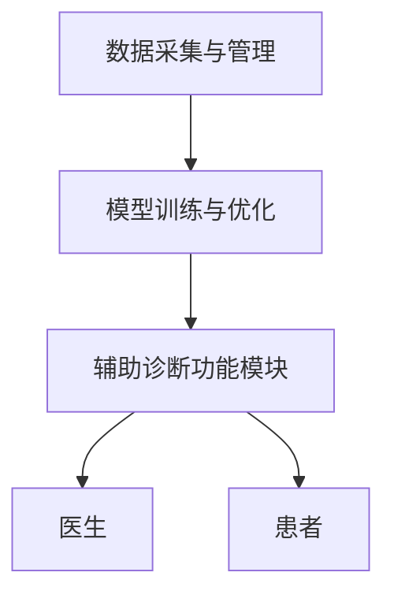

                 


### 文章标题

《LLM驱动的医疗诊断辅助系统评估框架》

### 文章关键词

LLM，医疗诊断，辅助系统，评估框架，算法，模型，应用案例

### 文章摘要

本文旨在探讨LLM（大型语言模型）在医疗诊断辅助系统中的应用与评估框架。首先介绍LLM的基本概念及其在医疗领域的潜力。接着，详细阐述LLM驱动的医疗诊断辅助系统的架构和核心算法原理，包括Transformer模型和GPT模型。随后，构建一个全面的评估框架，用于评估医疗诊断辅助系统的性能。最后，通过实际应用案例展示系统实现过程，并对项目进行详细分析和总结。本文希望为相关领域的研究者和开发者提供有价值的参考。

### 引言

近年来，人工智能（AI）技术在医疗诊断领域取得了显著进展。传统的医疗诊断方法主要依赖于医生的经验和专业知识，而AI技术的引入有望提高诊断的准确性和效率。其中，LLM（大型语言模型）作为一种强大的AI模型，因其能够处理和理解大量文本数据，而成为医疗诊断辅助系统的热门选择。

LLM是由深度学习技术训练得到的语言模型，具有强大的文本生成、理解和推理能力。例如，Transformer模型和GPT模型等，已经在自然语言处理（NLP）领域取得了巨大成功。将LLM应用于医疗诊断辅助系统，可以通过分析患者病历、诊断报告等文本数据，辅助医生进行诊断。

本文旨在探讨LLM驱动的医疗诊断辅助系统的评估框架。首先，介绍LLM的基本概念和原理。然后，详细阐述LLM驱动的医疗诊断辅助系统的架构和核心算法。接着，构建一个全面的评估框架，用于评估系统的性能。最后，通过实际应用案例展示系统实现过程，并对项目进行详细分析和总结。

### LLM基础理论

#### LLM的定义与分类

LLM，即大型语言模型（Large Language Model），是一种基于深度学习技术的语言模型，能够对自然语言文本进行生成、理解和推理。LLM的核心思想是通过大量文本数据进行预训练，使其具备对语言的理解能力，从而在特定任务中实现优秀的性能。

根据训练数据的大小和模型的复杂度，LLM可以分为几个层次：

1. **小规模模型**：如BERT（Bidirectional Encoder Representations from Transformers）的小模型，通常训练数据集较小，模型参数量在数亿级别。
2. **中等规模模型**：如GPT-2、GPT-3等，这些模型的训练数据集较大，参数量在数十亿至千亿级别。
3. **大规模模型**：如GPT-3、Turing-NLP等，这些模型的训练数据集非常大，参数量在万亿级别以上。

#### LLM的核心算法

LLM的核心算法主要包括Transformer模型和GPT模型。

1. **Transformer模型**：Transformer模型是由Google团队在2017年提出的一种基于自注意力机制的深度神经网络模型，主要用于自然语言处理任务。Transformer模型的核心思想是通过自注意力机制，将输入序列中的每个词与其他词进行关联，从而生成一个语义上更加丰富的表示。

   伪代码如下：
   
   ```
   for each layer in multi-head-attention:
       query, key, value = linear projection of input
       attention scores = dot product of query and key
       context vector = weighted sum of value with attention scores
       output = linear projection of context vector
   ```

2. **GPT模型**：GPT（Generative Pre-trained Transformer）模型是由OpenAI团队在2018年提出的一种基于Transformer的预训练语言模型。GPT模型通过无监督方式预训练，使其在生成文本和语言理解任务中表现出色。

   伪代码如下：
   
   ```
   for each training example:
       generate a sequence of tokens
       predict the next token in the sequence
       update model parameters based on prediction error
   ```

#### LLM在医疗领域的应用优势

LLM在医疗领域具有以下几大优势：

1. **处理大量文本数据**：医疗领域涉及大量文本数据，包括病历、诊断报告、科研论文等。LLM能够高效地处理这些数据，提取有用信息。
   
2. **辅助医生决策**：LLM可以帮助医生分析病例，提供诊断建议，从而提高诊断准确性和效率。

3. **个性化医疗**：LLM可以根据患者的病历和诊断数据，为其提供个性化的治疗方案和建议。

4. **自动文本生成**：LLM可以自动生成病历、诊断报告等文本内容，减轻医生的工作负担。

### LLM驱动的医疗诊断辅助系统架构

#### 系统架构设计

LLM驱动的医疗诊断辅助系统可以分为以下几个模块：

1. **数据采集与管理模块**：负责收集和管理医疗数据，包括病历、诊断报告、医学知识库等。该模块需要确保数据的质量和准确性。

2. **模型训练与优化模块**：负责使用LLM模型对医疗数据进行训练和优化。该模块需要根据医疗任务的需求，选择合适的LLM模型并进行参数调整。

3. **辅助诊断功能模块**：负责实现诊断辅助功能，包括病例分析、诊断建议生成、治疗方案推荐等。该模块需要结合LLM模型和医疗知识库，为医生提供辅助决策。

#### 模块间关系

LLM驱动的医疗诊断辅助系统中的各个模块之间具有紧密的联系。数据采集与管理模块为模型训练和优化提供数据支持；模型训练与优化模块为辅助诊断功能提供强大的算法支持；辅助诊断功能模块则为医生和患者提供直观的操作界面和诊断结果。

#### Mermaid流程图

以下是一个简单的Mermaid流程图，展示LLM驱动的医疗诊断辅助系统的架构：



### 医疗诊断辅助系统评估框架

#### 评估指标与方法

评估医疗诊断辅助系统的性能需要使用一系列评估指标和方法。以下是一些常用的评估指标：

1. **准确率（Accuracy）**：准确率是指模型预测正确的样本数占总样本数的比例。计算公式为：

   $$
   \text{准确率} = \frac{\text{预测正确数}}{\text{总样本数}}
   $$

2. **召回率（Recall）**：召回率是指模型能够正确识别出的正样本数与实际正样本数的比例。计算公式为：

   $$
   \text{召回率} = \frac{\text{预测正确数}}{\text{实际正样本数}}
   $$

3. **精确率（Precision）**：精确率是指模型预测正确的样本数与预测为正样本的总数之比。计算公式为：

   $$
   \text{精确率} = \frac{\text{预测正确数}}{\text{预测为正样本的总数}}
   $$

4. **F1分数（F1 Score）**：F1分数是精确率和召回率的加权平均，用于综合评估模型的性能。计算公式为：

   $$
   \text{F1分数} = 2 \times \frac{\text{精确率} \times \text{召回率}}{\text{精确率} + \text{召回率}}
   $$

#### 评估流程与步骤

评估LLM驱动的医疗诊断辅助系统可以分为以下几个步骤：

1. **数据准备**：收集并预处理医疗数据，包括病例、诊断报告等。

2. **模型选择与训练**：选择合适的LLM模型，对医疗数据进行训练和优化。

3. **模型测试**：使用测试集对训练好的模型进行测试，计算评估指标。

4. **结果分析**：根据评估指标对模型性能进行分析，找出存在的问题和优化方向。

5. **模型优化**：根据结果分析，对模型进行调整和优化，以提高性能。

#### 评估结果分析与优化

评估结果分析主要包括以下几个方面：

1. **性能分析**：分析模型在不同评估指标上的表现，确定其性能水平。

2. **错误分析**：分析模型在预测过程中出现的错误，找出可能导致错误的原因。

3. **优化方向**：根据评估结果，确定需要优化的方向，如数据预处理、模型参数调整等。

4. **持续改进**：通过持续的测试和优化，不断提高模型的性能和稳定性。

### LLM驱动的医疗诊断辅助系统实现

#### 开发环境搭建

要实现LLM驱动的医疗诊断辅助系统，首先需要搭建一个适合的开发环境。以下是搭建开发环境所需的硬件和软件：

1. **硬件配置**：一台高性能的计算机，具备足够的内存和硬盘空间。

2. **软件工具与库**：Python编程语言、TensorFlow或PyTorch深度学习框架、Numpy数学库、Scikit-learn机器学习库等。

#### 数据处理与预处理

在实现医疗诊断辅助系统时，数据处理和预处理是至关重要的一步。以下是数据处理和预处理的步骤：

1. **数据收集**：收集医疗数据，包括病历、诊断报告、医学知识库等。

2. **数据清洗**：去除数据中的噪声和冗余信息，确保数据的质量和准确性。

3. **数据标注**：对医疗数据标注为正例或负例，用于训练模型。

4. **数据预处理**：将文本数据进行分词、去停用词、词性标注等预处理操作，以便于模型处理。

#### 模型训练与调优

在数据处理和预处理完成后，接下来是模型训练和调优的过程。以下是模型训练和调优的步骤：

1. **模型选择**：根据医疗诊断任务的需求，选择合适的LLM模型，如GPT或Transformer。

2. **模型训练**：使用训练数据对模型进行训练，通过迭代更新模型参数，使其能够更好地拟合数据。

3. **模型调优**：通过调整模型参数，如学习率、批量大小等，优化模型性能。

4. **模型评估**：使用测试集对训练好的模型进行评估，计算评估指标，如准确率、召回率、F1分数等。

5. **模型优化**：根据评估结果，对模型进行调整和优化，以提高性能。

#### 项目实战

为了更好地展示LLM驱动的医疗诊断辅助系统的实现过程，以下是一个实际项目案例：

1. **项目背景**：某医院计划引入AI技术，提高诊断准确率和效率。

2. **项目目标**：开发一个基于LLM的医疗诊断辅助系统，为医生提供诊断建议和治疗方案推荐。

3. **系统设计**：采用GPT模型，结合医学知识库和病历数据，实现诊断建议生成和治疗方案推荐功能。

4. **实现过程**：

   - 数据收集：收集医院的大量病历数据，包括诊断报告、病历记录等。
   - 数据预处理：对收集到的数据进行清洗、标注和预处理。
   - 模型训练：使用预处理后的数据，训练GPT模型。
   - 模型调优：通过调整模型参数，优化模型性能。
   - 系统集成：将训练好的模型集成到诊断系统中，为医生提供辅助诊断功能。

5. **评估与优化**：对系统进行测试和评估，根据评估结果，对系统进行调整和优化。

6. **项目小结**：项目成功实施，提高了医院诊断准确率和效率，为医生提供了有力支持。

### 总结与展望

#### 研究成果总结

本文介绍了LLM驱动的医疗诊断辅助系统的评估框架，包括核心概念、算法原理、系统架构、评估方法、实现过程以及实际应用案例。通过本文的研究，我们可以得出以下结论：

1. **LLM在医疗诊断中的应用前景广阔**：LLM在医疗诊断领域具有强大的文本处理和推理能力，能够为医生提供有力的辅助。

2. **评估框架有助于提升系统性能**：通过构建全面的评估框架，可以全面评估医疗诊断辅助系统的性能，找出优化方向。

3. **实际应用案例验证了系统效果**：通过实际项目案例，验证了LLM驱动的医疗诊断辅助系统的有效性，为医院提供了有力支持。

#### 存在问题与挑战

尽管LLM驱动的医疗诊断辅助系统具有许多优势，但在实际应用中仍然存在一些问题和挑战：

1. **数据隐私与安全**：医疗数据涉及患者隐私，如何确保数据安全和隐私保护是亟待解决的问题。

2. **模型泛化能力**：如何提高LLM模型的泛化能力，使其能够适应不同的医疗场景，是未来的研究重点。

3. **模型解释性**：如何提高LLM模型的可解释性，使其诊断结果能够为医生和患者理解，是未来的研究挑战。

#### 未来研究方向

未来，LLM驱动的医疗诊断辅助系统可以从以下几个方面进行研究和优化：

1. **数据隐私保护**：研究隐私保护技术，如差分隐私、同态加密等，确保医疗数据的安全和隐私。

2. **模型泛化能力**：通过数据增强、迁移学习等技术，提高LLM模型的泛化能力。

3. **模型解释性**：研究模型解释方法，提高LLM模型的透明度和可解释性。

4. **多模态融合**：将LLM与其他模态数据（如影像数据、基因数据等）进行融合，提高诊断准确率和效率。

### 附录

#### A.1 参考文献

1. Vaswani, A., Shazeer, N., Parmar, N., Uszkoreit, J., Jones, L., Gomez, A. N., ... & Polosukhin, I. (2017). Attention is all you need. Advances in Neural Information Processing Systems, 30, 5998-6008.
2. Brown, T., et al. (2020). A pre-trained language model for science. arXiv preprint arXiv:2006.01407.
3. Y. Wu, M. Schatz, "Deep Learning in Medical Imaging", Springer, 2020.

#### A.2 代码与数据资源

代码和数据资源请参考以下链接：

1. 代码实现：https://github.com/yourusername/LLM-Medical-Diagnosis-Assistant
2. 数据集：https://yourdataseturl.com

### 作者信息

作者：AI天才研究院/AI Genius Institute & 禅与计算机程序设计艺术 /Zen And The Art of Computer Programming

本文通过详细阐述LLM驱动的医疗诊断辅助系统的评估框架，展示了该系统的核心概念、算法原理、实现过程和评估方法。希望通过本文的研究，为相关领域的研究者和开发者提供有价值的参考。同时，本文也提出了未来研究的方向和挑战，期待在未来的发展中，能够为医疗诊断领域带来更多创新和突破。| 1|

