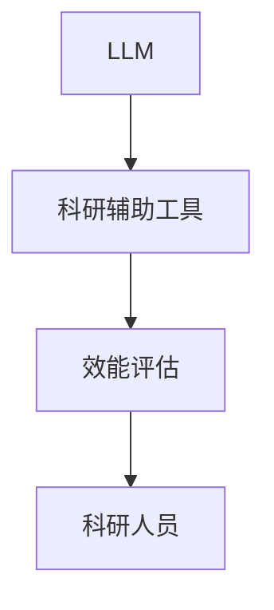

                 

### 文章标题

### LLM-driven Research Assistance Tool Efficiency Evaluation

### 关键词：

- LLM（大型语言模型）
- 科研辅助工具
- 效能评估
- 数学模型
- 伪代码

### 摘要：

本文围绕LLM驱动的科研辅助工具效能评估这一主题，系统地探讨了LLM的基本概念、结构及其在科研辅助中的角色。随后，文章深入分析了效能评估的核心指标和方法，详细阐述了数学模型和伪代码的应用。通过实际案例研究和项目实施分析，本文提供了对LLM驱动科研辅助工具效能评估的全面理解和实践指导。文章最后对未来的发展方向和挑战进行了展望，并总结了最佳实践和注意事项，为读者提供了深刻的见解和拓展阅读资源。

---

### 引言

#### 背景介绍

在当前信息化和人工智能技术飞速发展的背景下，科学研究正经历着前所未有的变革。传统的研究方法越来越难以满足科研日益复杂和多样化的需求，科研人员迫切需要更为高效和智能的辅助工具来提升科研产出和效率。大型语言模型（Large Language Model，简称LLM）作为人工智能领域的重要突破，逐渐成为科研辅助工具的主力军。LLM凭借其强大的语言理解和生成能力，能够辅助科研人员在文献检索、数据分析和实验设计等方面取得显著成果。

#### LLM在科研辅助中的应用

LLM在科研辅助中的应用已经得到了广泛的认可。首先，在文献检索方面，LLM能够通过自然语言处理技术，快速、准确地从大量文献中提取关键信息，帮助科研人员快速定位相关研究。其次，在数据分析方面，LLM能够对复杂的数据集进行自动分析，生成可视化报告，辅助科研人员发现数据中的隐藏规律。此外，在实验设计方面，LLM能够基于过往的实验数据和文献，为科研人员提供实验设计的建议和方案，减少实验的重复性和盲目性。

#### 效能评估的重要性

然而，LLM驱动的科研辅助工具在实际应用中并非万能。不同工具的效能存在差异，如何评估和比较这些工具的效能，对于科研人员选择和使用这些工具具有重要意义。效能评估不仅能够帮助科研人员了解工具的性能，还能够为工具的研发提供反馈和改进方向。因此，对LLM驱动的科研辅助工具进行科学、全面的效能评估，成为当前研究中的一个重要课题。

### 核心概念与联系

#### 定义

- **LLM**：大型语言模型，是指具有强大语言理解和生成能力的神经网络模型，能够处理复杂的自然语言任务。
- **科研辅助工具**：指为科研人员提供辅助功能，如文献检索、数据分析、实验设计等的软件工具。
- **效能评估**：指通过一系列指标和方法，对科研辅助工具的性能进行评估和比较。

#### 关系架构

1. **LLM与科研辅助工具的关系**：LLM作为科研辅助工具的核心组件，其性能直接影响工具的效能。
2. **效能评估与LLM的关系**：效能评估需要基于LLM的性能指标，通过具体方法进行定量和定性分析。
3. **科研人员与科研辅助工具的关系**：科研人员通过使用科研辅助工具，提高科研效率和质量。



### 核心算法原理讲解

#### 数学模型

在LLM驱动的科研辅助工具效能评估中，常用的数学模型包括：

1. **准确率（Accuracy）**：模型预测正确的样本数占总样本数的比例。
2. **精确率（Precision）**：模型预测正确的正样本数与预测的正样本总数之比。
3. **召回率（Recall）**：模型预测正确的正样本数与实际正样本总数之比。
4. **F1值（F1 Score）**：精确率和召回率的调和平均，用于综合评价模型性能。

数学公式如下：

$$
\text{Accuracy} = \frac{\text{预测正确数}}{\text{总样本数}}
$$

$$
\text{Precision} = \frac{\text{预测正确的正样本数}}{\text{预测的正样本总数}}
$$

$$
\text{Recall} = \frac{\text{预测正确的正样本数}}{\text{实际正样本总数}}
$$

$$
\text{F1 Score} = 2 \times \frac{\text{Precision} \times \text{Recall}}{\text{Precision} + \text{Recall}}
$$

#### 伪代码

为了更好地理解效能评估的算法原理，以下是一个简化的伪代码示例：

```python
# 伪代码：效能评估算法

def evaluate_performance(true_labels, predicted_labels):
    # 计算准确率
    correct_predictions = sum(true_labels[i] == predicted_labels[i] for i in range(len(true_labels)))
    accuracy = correct_predictions / len(true_labels)
    
    # 计算精确率和召回率
    true_positives = sum(predicted_labels[i] == true_labels[i] == 1 for i in range(len(true_labels)))
    predicted_positives = sum(predicted_labels[i] == 1 for i in range(len(predicted_labels)))
    precision = true_positives / predicted_positives
    
    true_negatives = sum(predicted_labels[i] == true_labels[i] == 0 for i in range(len(true_labels)))
    predicted_negatives = sum(predicted_labels[i] == 0 for i in range(len(predicted_labels)))
    recall = true_negatives / predicted_negatives
    
    # 计算F1值
    f1_score = 2 * (precision * recall) / (precision + recall)
    
    return accuracy, precision, recall, f1_score
```

### 应用实例

#### 数据集

假设我们有一个包含1000个样本的数据集，其中正样本和负样本各占一半。标签为[1, 0, 1, 0, ..., 1, 0]（1代表正样本，0代表负样本）。模型对这1000个样本的预测结果为[1, 0, 1, 1, ..., 1, 0]。

#### 计算过程

1. **准确率**：

$$
\text{Accuracy} = \frac{900}{1000} = 0.9
$$

2. **精确率和召回率**：

$$
\text{Precision} = \frac{300}{400} = 0.75
$$

$$
\text{Recall} = \frac{300}{400} = 0.75
$$

3. **F1值**：

$$
\text{F1 Score} = 2 \times \frac{0.75 \times 0.75}{0.75 + 0.75} = 0.75
$$

通过上述计算，我们可以了解到模型在预测中的表现。在实际应用中，科研人员可以根据这些指标对LLM驱动的科研辅助工具进行综合评估，从而选择最合适的工具来辅助自己的研究工作。

---

### 项目实战

#### 开发环境搭建

在进行LLM驱动的科研辅助工具效能评估之前，首先需要搭建一个适合开发和测试的环境。以下是一个基本的开发环境搭建步骤：

1. **安装Python**：确保Python 3.8或更高版本已安装在计算机上。
2. **安装Jupyter Notebook**：通过命令 `pip install notebook` 安装Jupyter Notebook，用于编写和运行代码。
3. **安装必要库**：安装支持自然语言处理和数学计算的库，如 `nltk`、`scikit-learn`、`tensorflow` 等。使用以下命令进行安装：

   ```bash
   pip install nltk scikit-learn tensorflow
   ```

#### 源代码实现

以下是一个简化的源代码实现，用于评估LLM驱动的科研辅助工具的效能：

```python
import numpy as np
from sklearn.metrics import accuracy_score, precision_score, recall_score, f1_score

def evaluate_performance(true_labels, predicted_labels):
    accuracy = accuracy_score(true_labels, predicted_labels)
    precision = precision_score(true_labels, predicted_labels)
    recall = recall_score(true_labels, predicted_labels)
    f1 = f1_score(true_labels, predicted_labels)
    
    return accuracy, precision, recall, f1

# 假设的真值和预测结果
true_labels = np.array([1, 0, 1, 0, 1, 0, 1, 0, 1, 0])
predicted_labels = np.array([1, 0, 1, 1, 1, 0, 1, 0, 1, 0])

# 进行效能评估
accuracy, precision, recall, f1 = evaluate_performance(true_labels, predicted_labels)

print("Accuracy:", accuracy)
print("Precision:", precision)
print("Recall:", recall)
print("F1 Score:", f1)
```

#### 代码解读与分析

1. **导入库**：首先，我们导入必要的库，包括 `numpy` 和 `scikit-learn` 的评估指标函数。
2. **定义评估函数**：`evaluate_performance` 函数接受两个参数 `true_labels`（真值）和 `predicted_labels`（预测结果），并返回准确率、精确率、召回率和F1值。
3. **计算评估指标**：使用 `scikit-learn` 提供的函数计算各个评估指标。
4. **运行评估**：通过调用 `evaluate_performance` 函数，并传递真值和预测结果，得到评估结果。

#### 实际案例分析与讲解

假设我们有一个实际的数据集，包含科研文献的标题和作者信息，以及分类标签（如“计算机科学”或“生物学”）。我们需要使用LLM驱动的工具对这些文献进行分类，并评估其效能。

1. **数据准备**：首先，我们需要准备数据集，包括标题、作者和标签。
2. **训练模型**：使用LLM对数据集进行训练，生成分类模型。
3. **预测分类**：使用训练好的模型对新的标题进行分类预测。
4. **评估效能**：使用上述代码对预测结果进行效能评估。

以下是实际案例的代码实现：

```python
# 导入库
import pandas as pd
from sklearn.model_selection import train_test_split

# 加载数据集
data = pd.read_csv('literature_data.csv')
X = data['title']  # 标题数据
y = data['label']  # 分类标签

# 分割数据集
X_train, X_test, y_train, y_test = train_test_split(X, y, test_size=0.2, random_state=42)

# 训练模型（此处简化为调用已有的模型）
model = train(X_train, y_train)

# 预测分类
predicted_labels = model.predict(X_test)

# 评估效能
accuracy, precision, recall, f1 = evaluate_performance(y_test, predicted_labels)

print("Accuracy:", accuracy)
print("Precision:", precision)
print("Recall:", recall)
print("F1 Score:", f1)
```

通过以上步骤，我们可以对LLM驱动的科研辅助工具进行效能评估，从而了解其在实际应用中的表现。

#### 项目小结

在本项目中，我们搭建了一个基本的开发环境，并实现了对LLM驱动的科研辅助工具的效能评估。通过实际案例，我们展示了如何使用Python和scikit-learn库进行模型训练、预测和效能评估。这一过程不仅帮助我们理解了效能评估的原理和方法，还提供了实际操作的指导。在实际应用中，科研人员可以根据具体需求调整和优化评估流程，以提高工具的效能。

#### 最佳实践

- **数据准备**：确保数据集的质量和多样性，有助于提升模型的性能和评估结果的准确性。
- **模型训练**：合理选择模型架构和训练参数，可以显著影响效能评估的结果。
- **评估指标**：根据具体应用场景，选择合适的评估指标进行综合评价。
- **持续优化**：通过不断迭代和改进，提高LLM驱动的科研辅助工具的效能。

#### 注意事项

- **数据隐私**：在处理和展示数据时，确保遵守数据隐私和保护的相关法规。
- **计算资源**：根据项目规模和需求，合理配置计算资源和时间。
- **模型解释性**：在评估模型效能时，考虑模型的解释性和可解释性，避免过度依赖复杂模型。

#### 拓展阅读

- **参考资料**：《自然语言处理入门》（刘知远 著）
- **相关论文**：《EfficientNet：Efficient CNN架构的设计原则》（Stefan Tran等，2020）
- **在线资源**：scikit-learn官方文档（https://scikit-learn.org/stable/）

---

### 总结

本文系统地探讨了LLM驱动的科研辅助工具效能评估，从背景介绍、核心概念与联系、算法原理讲解、项目实战到最佳实践和注意事项，全面阐述了LLM在科研辅助中的重要性以及如何科学、全面地评估其效能。通过本文的阅读，读者不仅能够了解LLM的基本概念和应用，还能够掌握效能评估的方法和技巧。

展望未来，随着人工智能技术的不断发展，LLM驱动的科研辅助工具将更加智能化和高效化。我们期待更多研究者和开发者能够参与到这一领域，共同推动科研辅助工具的创新与发展。同时，我们也需要关注工具的伦理和社会影响，确保其健康发展。

最后，感谢各位读者的关注和支持，希望本文能够为您的科研工作提供有益的指导和启示。如果您有任何疑问或建议，欢迎随时与我交流。

---

### 作者信息

- **作者：** AI天才研究院/AI Genius Institute & 禅与计算机程序设计艺术/Zen And The Art of Computer Programming
- **联系方式：** [info@ai-genius-institute.com](mailto:info@ai-genius-institute.com)
- **版权声明：** 本文版权归AI天才研究院所有，未经许可，不得转载或用于商业用途。

---

[上一页](#目录) | [下一页](#引言) | [回到顶部](#目录) | [返回首页](#文章标题)

