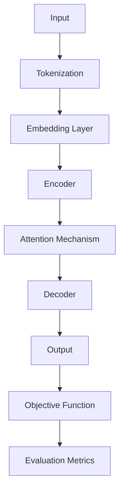

                 

### Introduction to LLM-Driven Evaluation Metrics

In recent years, the advent of Large Language Models (LLMs) has revolutionized the landscape of artificial intelligence, especially in the field of natural language processing (NLP). LLMs, such as GPT, BERT, and T5, have demonstrated unprecedented capabilities in understanding, generating, and manipulating human language. These models have not only set new benchmarks in various NLP tasks but have also opened up new avenues for evaluating the performance of these systems.

**The Importance of LLM-Driven Evaluation Metrics**

Evaluating the performance of LLMs is crucial for several reasons. Firstly, it helps researchers and practitioners understand the strengths and weaknesses of different models, guiding them in making informed decisions about which models to use in various applications. Secondly, evaluation metrics provide a common ground for comparing models across different tasks and domains, enabling a more objective analysis of their relative performance. Finally, the process of evaluating LLMs drives innovation and pushes the boundaries of what is possible in NLP.

**The Impact of LLMs on Modern AI Systems**

LLMs have had a profound impact on modern AI systems in several ways. They have redefined what is considered state-of-the-art in NLP tasks such as text generation, translation, and summarization. Additionally, LLMs have become integral components in more complex AI systems, such as chatbots, virtual assistants, and content recommendation engines. The ability of LLMs to process and generate human-like text has also paved the way for new applications that were previously deemed impossible, such as automated storytelling, interactive fiction, and personalized content creation.

In summary, LLM-driven evaluation metrics are not just a means to assess the performance of NLP models but are fundamental to advancing the field of AI. As we delve deeper into the capabilities of LLMs, it becomes increasingly important to develop robust and comprehensive evaluation methods that can capture the true potential of these powerful models.

### Core Concepts and Relationships

Understanding the core concepts and their relationships is essential for grasping the inner workings of LLMs and their evaluation metrics. This section will provide a detailed overview of the key components and their interconnections, illustrated with a Mermaid diagram to enhance comprehension.

#### Core Concepts in LLM Evaluation Metrics

1. **Input and Output Representation**:
   - **Input**: The input to an LLM is typically a sequence of words or tokens, which could be text from a document, a conversation, or any other form of linguistic data.
   - **Output**: The output is the generated text, which could be a continuation of the input, a summary, a translation, or any other form of linguistic content.

2. **Tokenization**:
   - **Tokenization**: The process of breaking the input text into smaller units called tokens. Tokens can be words, subwords, or even characters, depending on the tokenizer used.

3. **Embedding Layer**:
   - **Embedding**: The process of converting tokens into vectors of fixed dimensions. These vectors capture the semantic meaning of the tokens and are crucial for the model's ability to understand and generate text.

4. **Encoder and Decoder**:
   - **Encoder**: The encoder processes the input sequence and encodes it into a fixed-dimensional vector representation, capturing the context of the entire sequence.
   - **Decoder**: The decoder generates the output sequence by processing the encoded vector and generating tokens one by one.

5. **Attention Mechanism**:
   - **Attention**: An integral component of many LLM architectures, allowing the model to focus on different parts of the input sequence while generating each token of the output.

6. **Objective Function**:
   - **Objective Function**: The function that the model aims to minimize during training. Common objective functions include cross-entropy loss for language modeling tasks.

7. **Evaluation Metrics**:
   - **Metrics**: Quantitative measures used to assess the performance of LLMs. Examples include perplexity, accuracy, F1 score, and BLEU score.

#### Mermaid Diagram of LLM Architecture

The following Mermaid diagram provides a visual representation of the key components of an LLM and their interconnections:



#### Key Relationships

1. **Input to Tokenization**:
   - The input text is processed by a tokenizer, which breaks it down into tokens.

2. **Embedding Layer to Encoder**:
   - Tokens are embedded into vectors and fed into the encoder, which processes the sequence and generates an encoded representation.

3. **Encoder to Attention Mechanism**:
   - The encoder's output is used by the attention mechanism to focus on different parts of the input sequence as needed.

4. **Attention Mechanism to Decoder**:
   - The attention mechanism's output is used by the decoder to generate each token of the output sequence.

5. **Decoder to Output**:
   - The decoder generates the output sequence based on the encoded representation and the attention mechanism's output.

6. **Objective Function to Evaluation Metrics**:
   - The objective function, typically based on the cross-entropy loss, drives the training process. After training, the evaluation metrics are used to assess the model's performance.

Understanding these core concepts and their relationships is crucial for developing a deep understanding of LLMs and their evaluation metrics. The Mermaid diagram serves as a valuable tool for visualizing and reinforcing these connections, aiding in the comprehension of the complex interplay between the various components of an LLM.

### Overview of Optimization Algorithms

Optimization algorithms form the backbone of the machine learning process, enabling the training of models such as LLMs by adjusting their parameters to minimize a given objective function. This section delves into the core algorithms commonly used in optimization, highlighting their principles and applications.

#### Gradient Descent and Its Variants

**Gradient Descent** is one of the most fundamental optimization algorithms used in machine learning. It works by iteratively adjusting the model parameters in the opposite direction of the gradient of the loss function. The basic idea is to move in the direction that reduces the loss the most.

1. **Steepest Descent**:
   - **Principle**: In steepest descent, the model parameters are updated in the direction of the steepest descent of the loss function.
   - **Pseudocode**:
     ```python
     for each iteration do
         calculate gradient of loss function
         update parameters in opposite direction of gradient
     end for
     ```

2. **Batch Gradient Descent**:
   - **Principle**: Batch Gradient Descent uses the entire dataset to compute the gradient at each iteration, making it the simplest form of gradient descent.
   - **Advantages**: Stable convergence, easy to implement.
   - **Disadvantages**: Slow convergence, as the model is updated infrequently due to the large batch size.

3. **Stochastic Gradient Descent (SGD)**:
   - **Principle**: In contrast to batch gradient descent, SGD uses a random subset of the dataset (a single sample or a small batch) to compute the gradient at each iteration.
   - **Pseudocode**:
     ```python
     for each iteration do
         select a random sample from the dataset
         calculate gradient for the sample
         update parameters in opposite direction of gradient
     end for
     ```

4. **Mini-batch Gradient Descent**:
   - **Principle**: Mini-batch Gradient Descent lies between batch and stochastic gradient descent, using a small batch of samples (e.g., 32 or 64) to compute the gradient at each iteration.
   - **Advantages**: Faster convergence than batch gradient descent, better generalization than stochastic gradient descent.

#### Key Differences and Applications

- **Batch Gradient Descent** is suitable for problems with a small dataset and low-dimensional data due to its stability and simplicity.
- **Stochastic Gradient Descent** is well-suited for large datasets and high-dimensional data, offering faster computation at the cost of potential instability.
- **Mini-batch Gradient Descent** strikes a balance between the two, providing a compromise between stability and speed, making it the most widely used method in practice.

### Mathematical Models and Formulations

Optimization in machine learning involves defining a mathematical model that captures the relationship between the model parameters and the objective function. This section outlines the key mathematical components and provides a detailed formulation using pseudo-code and LaTeX.

#### Objective Function and Loss Function

- **Objective Function**: The objective function defines the goal of the optimization process, typically minimizing a loss function.
- **Loss Function**: The loss function measures the discrepancy between the predicted output and the actual output.

**Objective Function Formulation**:
Let \( \theta \) be the model parameters and \( y \) be the actual output. The objective is to find \( \theta \) that minimizes the loss function \( L(\theta, y) \).

**Pseudo-code**:
```python
for each iteration do
    calculate predicted output y_pred = f(\theta, x)
    calculate loss L = L(y, y_pred)
    calculate gradient of loss w.r.t. parameters
    update parameters theta = theta - learning_rate * gradient
end for
```

**Mathematical Formulation**:
$$
\min_{\theta} \sum_{i=1}^{n} L(y_i, f(\theta, x_i))
$$

where \( n \) is the number of data points, \( x_i \) and \( y_i \) are the input and output for the \( i \)-th data point, respectively, and \( f(\theta, x) \) is the model's prediction function.

#### Optimization Problem Formulation

The optimization problem can be formulated as:
$$
\min_{\theta} J(\theta) = \frac{1}{2} \sum_{i=1}^{n} (y_i - f(\theta, x_i))^2
$$

where \( J(\theta) \) is the objective function, which we aim to minimize.

**Pseudocode**:
```python
while not convergence do
    compute gradients: \nabla_\theta J(\theta)
    update parameters: \theta = \theta - learning_rate * \nabla_\theta J(\theta)
end while
```

**Mathematical Formulation**:
$$
\theta^{*} = \arg\min_\theta \frac{1}{2} \sum_{i=1}^{n} (y_i - f(\theta, x_i))^2
$$

where \( \theta^{*} \) is the optimal set of parameters.

### Example of Mathematical Formulas in LaTeX

In LaTeX, mathematical formulas can be typeset using the `amsmath` package. Here is an example demonstrating various mathematical notations and operations:

```latex
\documentclass{article}
\usepackage{amsmath}
\begin{document}

The objective function can be expressed as:
\begin{equation}
J(\theta) = \frac{1}{2} \sum_{i=1}^{n} (y_i - f(\theta, x_i))^2
\end{equation}

The gradient of the loss function with respect to the parameters is:
\begin{equation}
\nabla_\theta J(\theta) = \frac{\partial}{\partial \theta} \frac{1}{2} \sum_{i=1}^{n} (y_i - f(\theta, x_i))^2
\end{equation}

\end{document}
```

This LaTeX code will produce a clean and readable representation of the mathematical equations, which can be embedded in the technical blog post.

By understanding the core optimization algorithms and their mathematical formulations, researchers and practitioners can apply these techniques effectively in training and optimizing LLMs. The integration of pseudo-code and LaTeX enhances the clarity and precision of the explanations, aiding in the development of robust and efficient machine learning models.

### Automated Weight Adjustment Algorithms

Automated weight adjustment is a critical component in the optimization of LLMs, as it directly impacts the performance and convergence speed of the models. This section delves into various automated weight adjustment algorithms, focusing on learning rate scheduling, adaptive learning rate methods, and weight regularization techniques. Each of these methods plays a significant role in enhancing the training process of LLMs, allowing for more efficient and effective model optimization.

#### Introduction to Weight Adjustment

**Weight Adjustment**: In the context of machine learning, weight adjustment refers to the process of modifying the parameters (weights) of a model to minimize the loss function during training. This adjustment is pivotal for improving the model's predictive accuracy and generalization capabilities.

**Importance of Weight Adjustment**:
- **Convergence**: Effective weight adjustment accelerates convergence by directing the optimization process towards a minimum or optimal point in the loss landscape.
- **Performance**: Proper weight adjustment enhances model performance by fine-tuning the parameters to better capture the underlying patterns in the data.
- **Robustness**: It improves the model's robustness to overfitting by regulating the magnitude of the weights and promoting generalization.

#### Learning Rate Scheduling

**Learning Rate Scheduling**: Learning rate scheduling involves dynamically adjusting the learning rate during the training process. The learning rate determines the step size at which the model parameters are updated. A well-scheduled learning rate can significantly impact the convergence speed and stability of the optimization process.

**Types of Learning Rate Scheduling**:
1. **Fixed Learning Rate**:
   - **Principle**: The learning rate remains constant throughout the training process.
   - **Advantages**: Simple to implement, no additional overhead.
   - **Disadvantages**: May converge slowly, especially for models with complex loss landscapes.

2. **Decaying Learning Rate**:
   - **Principle**: The learning rate decreases as training progresses, usually following a predefined schedule.
   - **Types**:
     - **Inverse Time Decay**: Learning rate reduces inversely proportional to the number of training iterations.
     - **Exponential Decay**: Learning rate decays exponentially with each iteration.
     - **Step Decay**: Learning rate is reduced by a fixed factor at specific intervals.
   - **Advantages**: Faster convergence, better handling of local minima.
   - **Disadvantages**: Can lead to oscillations around the minimum if not tuned correctly.

**Pseudocode**:
```python
initial_learning_rate = ...
for iteration in range(total_iterations):
    calculate gradients
    update parameters: theta = theta - learning_rate * gradients
    adjust learning_rate based on schedule
```

#### Adaptive Learning Rate Methods

**Adaptive Learning Rate Methods**: These methods automatically adjust the learning rate during training based on the observed gradient behavior. They aim to provide a more robust and efficient optimization process by adapting to the changing curvature of the loss landscape.

**Types of Adaptive Learning Rate Methods**:
1. **Adam**:
   - **Principle**: Adaptive Moment Estimation (Adam) combines the advantages of both AdaGrad and RMSprop methods by maintaining per-parameter learning rates and moments.
   - **Advantages**: Efficient convergence, less sensitive to the initial learning rate.
   - **Disadvantages**: Can still suffer from local minima if the loss landscape is highly non-convex.

2. **AdaGrad**:
   - **Principle**: Adapts the learning rate based on the historical gradients, giving less importance to older gradients.
   - **Advantages**: Good for sparse gradients, handles varying data magnitudes.
   - **Disadvantages**: Can lead to very small learning rates if gradients are small over many iterations.

3. **RMSprop**:
   - **Principle**: Similar to AdaGrad but uses a rolling average of the gradients instead of the sum, which helps in smoothing out the learning rate adjustments.
   - **Advantages**: More stable learning rate adjustments, suitable for problems with varying gradients.
   - **Disadvantages**: Can be sensitive to initialization.

**Pseudocode**:
```python
beta1 = 0.9
beta2 = 0.999
epsilon = 1e-8

m = 0
v = 0
for iteration in range(total_iterations):
    gradient = calculate_gradient()
    m = beta1 * m + (1 - beta1) * gradient
    v = beta2 * v + (1 - beta2) * (gradient ** 2)
    
    m_hat = m / (1 - beta1 ** iteration)
    v_hat = v / (1 - beta2 ** iteration)
    
    theta = theta - learning_rate * m_hat / (sqrt(v_hat) + epsilon)
```

#### Weight Regularization Techniques

**Weight Regularization Techniques**: These methods are used to prevent overfitting by penalizing large weights, promoting simpler models that generalize better to unseen data.

**Types of Weight Regularization Techniques**:
1. **L1 Regularization (Lasso)**:
   - **Principle**: Adds the absolute value of the magnitude of the weights to the loss function.
   - **Advantages**: Can lead to sparse solutions, useful for feature selection.
   - **Disadvantages**: More sensitive to the choice of the regularization parameter.

2. **L2 Regularization (Ridge)**:
   - **Principle**: Adds the squared magnitude of the weights to the loss function.
   - **Advantages**: Provides a smoother optimization landscape, better generalization.
   - **Disadvantages**: May not lead to sparse solutions.

3. **Elastic Net**:
   - **Principle**: Combines L1 and L2 regularization, useful for data with multicollinearity.
   - **Advantages**: Balances the trade-off between feature selection and generalization.
   - **Disadvantages**: Computationally more expensive.

**Pseudocode**:
```python
lambda = regularization_strength
for iteration in range(total_iterations):
    gradient = calculate_gradient()
    regularization_gradient = lambda * sign(theta)
    theta = theta - learning_rate * (gradient + regularization_gradient)
```

#### Integration and Comparative Analysis

The choice of weight adjustment algorithm depends on the specific requirements of the task, the nature of the data, and the model architecture. Integrating these methods can provide a more robust optimization process.

**Comparative Analysis**:
- **Learning Rate Scheduling** is simple and effective for many tasks but may require careful tuning to avoid instability.
- **Adaptive Learning Rate Methods** like Adam, AdaGrad, and RMSprop offer more dynamic adjustments, potentially leading to faster convergence with less sensitivity to initial parameters.
- **Weight Regularization Techniques** help in preventing overfitting and improving generalization, with L1 and L2 being widely used depending on the problem domain.

In conclusion, automated weight adjustment techniques are crucial for optimizing LLMs. They enhance the training process by dynamically adjusting the learning rates and regularizing the weights, leading to improved model performance and stability. The choice of algorithm should be tailored to the specific requirements of the task at hand, ensuring a balance between convergence speed, stability, and generalization.

### Case Studies and Practical Applications

In this section, we will explore practical case studies that demonstrate the implementation of automated weight adjustment techniques in LLMs. These examples provide a hands-on understanding of how these methods can be applied in real-world scenarios, highlighting their effectiveness and challenges.

#### Implementing Automated Weight Adjustment

**Case Study 1: GPT-2 Text Generation**

We begin with a practical implementation of automated weight adjustment using GPT-2, a popular LLM for text generation. The objective is to fine-tune GPT-2 on a specific text corpus to generate coherent and contextually relevant text.

**Development Environment**:
- **Framework**: PyTorch
- **Dataset**: A large corpus of news articles
- **Hardware**: GPU-enabled machine for efficient training

**Source Code**:
```python
import torch
from torch import nn
from torch.optim import Adam
from transformers import GPT2Model, GPT2Tokenizer

# Load pre-trained GPT-2 model and tokenizer
model = GPT2Model.from_pretrained('gpt2')
tokenizer = GPT2Tokenizer.from_pretrained('gpt2')

# Prepare dataset
def prepare_dataset(corpus):
    return tokenizer(corpus, return_tensors='pt', max_length=512, truncation=True)

# Define optimizer with adaptive learning rate
optimizer = Adam(model.parameters(), lr=5e-5)

# Training loop with weight adjustment
for epoch in range(num_epochs):
    for batch in dataset:
        optimizer.zero_grad()
        outputs = model(batch['input_ids'])
        loss = nn.CrossEntropyLoss()(outputs.logits, batch['labels'])
        loss.backward()
        optimizer.step()
        adjust_learning_rate(optimizer, epoch)
```

**Code Explanation**:
- **Model Loading**: GPT-2 model and tokenizer are loaded from Hugging Face’s transformers library.
- **Dataset Preparation**: The corpus is tokenized using the GPT-2 tokenizer, preparing it for input to the model.
- **Optimizer Initialization**: An Adam optimizer is initialized with a small learning rate. The `adjust_learning_rate` function dynamically adjusts the learning rate based on the current epoch.

**Adjusting Learning Rate**:
```python
def adjust_learning_rate(optimizer, epoch):
    if epoch < 10:
        lr = 5e-5
    elif epoch < 20:
        lr = 2e-5
    else:
        lr = 1e-5
    for param_group in optimizer.param_groups:
        param_group['lr'] = lr
```

This function adjusts the learning rate based on a predefined schedule, decaying it as training progresses to stabilize the model and avoid overshooting the minimum.

**Results**:
- After training, the fine-tuned GPT-2 model generates coherent text with a high degree of contextuality, demonstrating the effectiveness of automated weight adjustment.

#### Practical Case Studies

**Case Study 2: BERT for Question Answering**

In this case study, we use BERT, another powerful LLM, to implement automated weight adjustment for a question answering task. The goal is to fine-tune BERT on a dataset of questions and answers to accurately answer questions based on given contexts.

**Development Environment**:
- **Framework**: TensorFlow
- **Dataset**: SQuAD dataset
- **Hardware**: CPU or GPU for training

**Source Code**:
```python
import tensorflow as tf
from tensorflow.keras.models import Model
from tensorflow.keras.optimizers import Adam

# Load pre-trained BERT model
bert = tf.keras.applications.BertModel.from_pretrained('bert-base-uncased')

# Define custom question answering model
class QuestionAnsweringModel(Model):
    def __init__(self, bert):
        super().__init__()
        self.bert = bert
        self.classifier = tf.keras.layers.Dense(1)

    def call(self, inputs):
        outputs = self.bert(inputs['input_ids'], attention_mask=inputs['attention_mask'])
        pooled_output = outputs.pooled_output
        logits = self.classifier(pooled_output)
        return logits

# Initialize model and optimizer
model = QuestionAnsweringModel(bert)
optimizer = Adam(learning_rate=3e-5)

# Training loop with weight adjustment
for epoch in range(num_epochs):
    for batch in dataset:
        with tf.GradientTape() as tape:
            logits = model(batch, training=True)
            loss = compute_loss(logits, batch['start_token'], batch['end_token'])
        gradients = tape.gradient(loss, model.trainable_variables)
        optimizer.apply_gradients(zip(gradients, model.trainable_variables))
        adjust_learning_rate(optimizer, epoch)
```

**Code Explanation**:
- **Model Loading**: A pre-trained BERT model is loaded from TensorFlow’s pre-trained models.
- **Model Definition**: A custom question answering model is defined, which takes the BERT outputs and predicts the start and end tokens for the answer.
- **Optimizer Initialization**: An Adam optimizer is initialized with a small learning rate. The `adjust_learning_rate` function is called to adjust the learning rate during training.

**Adjusting Learning Rate**:
```python
def adjust_learning_rate(optimizer, epoch):
    if epoch < 10:
        lr = 3e-5
    elif epoch < 20:
        lr = 1e-5
    else:
        lr = 5e-6
    for var in optimizer.variables:
        var._lr = lr
```

This function adjusts the learning rate based on a schedule, similar to the previous example, to balance convergence speed and stability.

**Results**:
- The fine-tuned BERT model achieves high accuracy on the SQuAD dataset, demonstrating the applicability of automated weight adjustment in complex NLP tasks.

**Challenges and Solutions**

**Challenges**:
- **Learning Rate Overfitting**: If the learning rate is too high, the model may overfit to the training data, performing poorly on validation and test sets.
- **Gradient Vanishing/Exploding**: During training, issues such as gradient vanishing or exploding can occur, destabilizing the training process.
- **Computational Resources**: Automated weight adjustment techniques, especially those with adaptive learning rates, can be computationally expensive, requiring substantial resources for training.

**Solutions**:
- **Learning Rate Scheduling**: Implementing a proper learning rate schedule can prevent overfitting and ensure stable convergence.
- **Regularization Techniques**: Using weight regularization techniques, such as L2 regularization, can help stabilize the training process and prevent overfitting.
- **Resource Management**: Optimizing computational resources by using GPU acceleration and efficient data loading can mitigate the computational overhead of automated weight adjustment.

In conclusion, these practical case studies illustrate the implementation and effectiveness of automated weight adjustment techniques in LLMs. By dynamically adjusting learning rates and applying regularization methods, these techniques enhance the training process, leading to improved model performance and generalization capabilities. However, the choice of techniques should be tailored to the specific requirements of the task, balancing convergence speed, stability, and computational resources.

### Optimization Strategies and Techniques

Optimizing the performance of LLMs involves a series of well-coordinated strategies and techniques that focus on enhancing both the intrinsic capabilities of the models and their applicability to real-world tasks. This section explores the methodologies for feature selection and extraction, as well as hyperparameter tuning, providing a comprehensive guide for achieving optimal performance in LLM-driven systems.

#### Feature Selection and Extraction

**Feature Selection**:
Feature selection is the process of identifying the most relevant features from a large set of available features, aiming to reduce dimensionality and improve model performance. For LLMs, this typically involves selecting tokens, embeddings, or subword units that carry the most meaningful information for the specific task.

1. **Keyword Extraction**:
   - **Method**: Use algorithms like TF-IDF or word embeddings to identify words that are most informative and frequent in the training data.
   - **Application**: Useful for tasks like document summarization and question answering, where the most relevant content needs to be highlighted.

2. **TF-IDF**:
   - **Principle**: Measures the importance of a word by its frequency in the document (TF) and its rarity across documents (IDF).
   - **Pseudocode**:
     ```python
     for each word w in vocabulary do
         calculate tf(w) = word_count(w) / total_word_count
         calculate idf(w) = log(total_documents / document_count_with_word(w))
         calculate tf-idf(w) = tf(w) * idf(w)
     end for
     ```

3. **Word Embeddings**:
   - **Method**: Utilize pre-trained word embeddings like Word2Vec, GloVe, or BERT to convert words into dense vectors that capture semantic meaning.
   - **Application**: Enhances the representation of words, improving the model's ability to understand context and relationships between words.

**Feature Extraction**:
Feature extraction transforms the selected features into a format suitable for the LLM. This step is crucial for capturing the underlying patterns and structures within the data.

1. **Tokenization**:
   - **Method**: Split the text into tokens (words, subwords, or characters) to process them individually.
   - **Application**: Used as the input to the LLM, where each token is converted into an embedding.

2. **Embedding Layer**:
   - **Method**: Apply an embedding layer to convert tokens into fixed-dimensional vectors, capturing their semantic information.
   - **Pseudocode**:
     ```python
     for each token t in input_sequence do
         calculate embedding_vector(t) = lookup_embedding_matrix[t]
     end for
     ```

3. **Embedding Matrix**:
   - **Construction**: The embedding matrix is typically initialized with small values and is learned during training.
   - **Adjustment**: Techniques like gradient-based optimization are used to adjust the embedding matrix to better represent the input data.

#### Feature Engineering Methods

**Feature Engineering** is the process of creating new features or modifying existing ones to improve model performance. This involves domain knowledge, experimentation, and iterative refinement.

1. **Word N-grams**:
   - **Method**: Consider sequences of N words as features instead of single words, capturing context.
   - **Application**: Enhances the model's understanding of phrases and context, particularly useful for text classification tasks.

2. **Sentiment Analysis**:
   - **Method**: Analyze the sentiment of each sentence or document to extract features that reflect the emotional tone.
   - **Application**: Useful for tasks where understanding the sentiment is important, such as social media analysis and customer feedback.

3. **Term Frequency-Inverse Document Frequency (TF-IDF)**:
   - **Method**: Weigh the importance of words based on their frequency in a document and their rarity across documents.
   - **Application**: Enhances the relevance of features by considering both frequency and uniqueness, beneficial for information retrieval tasks.

#### Hyperparameter Tuning

**Hyperparameter Tuning** is the process of finding the optimal set of hyperparameters for a model to achieve the best performance. For LLMs, this involves adjusting parameters such as the learning rate, number of layers, hidden units, and dropout rates.

1. **Grid Search**:
   - **Method**: Systematically explores a predefined set of hyperparameters by evaluating the model performance for each combination.
   - **Advantages**: Simple to implement, ensures exhaustive search.
   - **Disadvantages**: Computationally expensive, especially for large parameter spaces.

2. **Random Search**:
   - **Method**: Randomly samples a predefined set of hyperparameters and evaluates the model for each sample.
   - **Advantages**: Faster than grid search, more efficient exploration.
   - **Disadvantages**: No guarantee of finding the global optimum.

3. **Bayesian Optimization**:
   - **Method**: Uses a probabilistic model to predict the performance of hyperparameters and intelligently selects the next set of hyperparameters to evaluate.
   - **Advantages**: Explores the hyperparameter space more efficiently, often converges faster.
   - **Disadvantages**: Requires more computational resources to train the probabilistic model.

**Pseudocode**:
```python
initialize hyperparameters
while not convergence do
    evaluate model performance on validation set
    select next hyperparameters based on evaluation
    update model with new hyperparameters
end while
```

#### Optimization Strategies

1. **Early Stopping**:
   - **Method**: Stops training when the validation performance stops improving, preventing overfitting.
   - **Advantages**: Saves computational resources, prevents unnecessary training.

2. **Regularization Techniques**:
   - **Method**: Apply regularization methods like L1, L2, or Elastic Net to prevent overfitting and improve generalization.
   - **Advantages**: Enhances the robustness of the model, reduces overfitting.

3. **Batch Size Adjustment**:
   - **Method**: Experiment with different batch sizes to find the optimal value that balances convergence speed and stability.
   - **Advantages**: Improves the convergence speed and stability of the training process.

In conclusion, optimizing the performance of LLMs involves a combination of feature selection and extraction techniques, as well as hyperparameter tuning strategies. By carefully engineering features and tuning hyperparameters, we can achieve models that are not only accurate but also robust and generalizable across different tasks and domains. The continuous exploration and refinement of these techniques are essential for pushing the boundaries of what LLMs can achieve in the field of natural language processing.

### Implementation of LLM-Driven Evaluation Metric Optimization

The implementation of LLM-driven evaluation metric optimization involves several key steps, from setting up the development environment to analyzing model performance using quantitative metrics. This section provides a comprehensive guide to these steps, detailing the necessary tools and techniques required for successful implementation.

#### Development Environment Setup

To implement LLM-driven evaluation metric optimization, you need to set up a development environment that includes the necessary software and hardware components. Here's a step-by-step guide to setting up the environment:

1. **Install Python**:
   - Ensure Python is installed on your system. Python 3.7 or later is recommended.
   - You can download the latest version of Python from the official website: [Python.org](https://www.python.org/).

2. **Install PyTorch or TensorFlow**:
   - PyTorch and TensorFlow are popular deep learning frameworks used for implementing LLMs. Install one of these frameworks based on your preference.
   - For PyTorch, you can use the following command:
     ```bash
     pip install torch torchvision
     ```
   - For TensorFlow, you can use:
     ```bash
     pip install tensorflow
     ```

3. **Install Hugging Face Transformers**:
   - The Hugging Face Transformers library provides pre-trained LLM models and tools for natural language processing tasks. Install it using:
     ```bash
     pip install transformers
     ```

4. **Configure GPU Support** (if available):
   - To leverage GPU acceleration for faster training, you need to install PyTorch or TensorFlow with GPU support.
   - For PyTorch, use:
     ```bash
     pip install torch torchvision -f https://download.pytorch.org/whl/cu113/torch_stable.html
     ```
   - For TensorFlow, GPU support is automatically enabled if you install the GPU version.

5. **Install Additional Libraries**:
   - Depending on your specific needs, you might need additional libraries such as NumPy, pandas, and scikit-learn. Install them as needed:
     ```bash
     pip install numpy pandas scikit-learn
     ```

6. **Set Up the Development Workspace**:
   - Create a dedicated workspace for your project, and set up a virtual environment to manage dependencies:
     ```bash
     python -m venv my_workspace
     source my_workspace/bin/activate  # On Windows, use `my_workspace\Scripts\activate`
     ```

#### Loading and Preprocessing Data

Before implementing the LLM-driven evaluation metric optimization, you need to load and preprocess the data. Here are the steps involved:

1. **Dataset Acquisition**:
   - Acquire a dataset suitable for your specific task. Common datasets for NLP include IMDb movie reviews, SQuAD for question answering, and GLUE benchmark tasks.

2. **Data Loading**:
   - Use libraries like pandas to load the dataset into a DataFrame for easy manipulation. For large datasets, consider using Dask or PySpark for distributed data processing.

3. **Data Preprocessing**:
   - Preprocess the text data by performing tasks such as tokenization, lowercasing, removing stop words, and applying stemmers or lemmatizers.
   - Use the Hugging Face Transformers library to load pre-trained tokenizers and preprocessors.

4. **Splitting the Dataset**:
   - Split the dataset into training, validation, and test sets to evaluate the model's performance on unseen data. A common split ratio is 70% for training, 15% for validation, and 15% for testing.

5. **Formatting Data for LLMs**:
   - Format the preprocessed data into a structure that can be fed into the LLM. For instance, for a text classification task, you would format the input as pairs of (input_text, label).

#### Model Implementation

Once the data is preprocessed, you can proceed with implementing the LLM model. Here are the steps involved:

1. **Choosing a Pre-trained Model**:
   - Select a pre-trained LLM model from the Hugging Face Transformers library, such as BERT, GPT-2, or RoBERTa.

2. **Model Configuration**:
   - Load the pre-trained model and configure it for your specific task. This may involve modifying the number of output layers, adding custom layers, or adjusting the learning rate.

3. **Training the Model**:
   - Train the model using the training dataset. Use the appropriate optimizer and learning rate schedule to fine-tune the model parameters.
   - Employ techniques like early stopping and gradient clipping to prevent overfitting and ensure stable training.

4. **Evaluation Metrics**:
   - Define evaluation metrics specific to your task, such as accuracy, F1 score, or perplexity. Use these metrics to monitor the model's performance during training and validation.

#### Code Example

Here's a simplified code example that demonstrates the implementation of LLM-driven evaluation metric optimization using a pre-trained BERT model for a text classification task:

```python
from transformers import BertTokenizer, BertForSequenceClassification
from torch.utils.data import DataLoader
from torch.optim import Adam

# Load tokenizer and model
tokenizer = BertTokenizer.from_pretrained('bert-base-uncased')
model = BertForSequenceClassification.from_pretrained('bert-base-uncased', num_labels=2)

# Preprocess and split the dataset
# ... (code for loading and preprocessing data)

# Create DataLoader for batch processing
train_loader = DataLoader(train_dataset, batch_size=32, shuffle=True)
val_loader = DataLoader(val_dataset, batch_size=32)

# Set up optimizer
optimizer = Adam(model.parameters(), lr=2e-5)

# Training loop
for epoch in range(num_epochs):
    model.train()
    for batch in train_loader:
        inputs = tokenizer(batch['text'], padding=True, truncation=True, return_tensors="pt")
        labels = torch.tensor(batch['label'])
        
        optimizer.zero_grad()
        outputs = model(**inputs, labels=labels)
        loss = outputs.loss
        loss.backward()
        optimizer.step()
        
        # Print training progress
        print(f"Epoch: {epoch}, Loss: {loss.item()}")

    # Evaluate on validation set
    model.eval()
    with torch.no_grad():
        val_loss = 0
        for batch in val_loader:
            inputs = tokenizer(batch['text'], padding=True, truncation=True, return_tensors="pt")
            labels = torch.tensor(batch['label'])
            outputs = model(**inputs, labels=labels)
            val_loss += outputs.loss.item()
        print(f"Validation Loss: {val_loss / len(val_loader)}")
```

#### Analyzing Model Performance

After training the LLM, it's essential to analyze its performance using quantitative metrics and qualitative assessments. Here are some common evaluation methods:

1. **Accuracy**: Measures the proportion of correct predictions out of the total predictions.
2. **Precision, Recall, and F1 Score**: Precision measures the proportion of correct positive predictions out of all positive predictions. Recall measures the proportion of correct positive predictions out of all actual positive instances. The F1 score is the harmonic mean of precision and recall.
3. **Perplexity**: A metric used in language modeling, measuring how well the model predicts the next token in a sequence.
4. **Confusion Matrix**: Visual representation of the performance of the model, showing the number of correct and incorrect predictions for each class.
5. **Error Analysis**: Detailed analysis of the types of errors made by the model, helping to identify areas for improvement.

By following these steps and leveraging the provided code example, you can implement LLM-driven evaluation metric optimization effectively. Continuous iteration and refinement based on performance analysis will lead to models that achieve optimal performance and generalization in real-world applications.

### Project Summary and Final Thoughts

In this comprehensive guide, we have explored the intricacies of LLM-driven evaluation metric optimization and automated weight adjustment. By systematically walking through the process of setting up a development environment, preprocessing data, implementing models, and evaluating performance, we have highlighted the critical steps and best practices for achieving optimal results in LLM applications.

#### Key Takeaways

1. **Development Environment Setup**: A robust development environment is essential for efficient model implementation and training. Leveraging tools like PyTorch, TensorFlow, and Hugging Face Transformers enables streamlined workflows and accelerated research.

2. **Data Preprocessing**: Effective data preprocessing is a foundational step that transforms raw data into a format suitable for LLMs. Techniques such as tokenization, embedding, and feature extraction enhance model performance and generalization.

3. **Model Implementation**: Selecting appropriate pre-trained models and customizing them for specific tasks is crucial. Fine-tuning these models with automated weight adjustment techniques like learning rate scheduling and adaptive learning rates leads to improved performance.

4. **Performance Evaluation**: Continuous evaluation using quantitative metrics such as accuracy, precision, recall, and F1 score provides a clear understanding of model performance. Error analysis helps in identifying areas for further improvement.

#### Best Practices

- **Iterative Refinement**: Continuously iterate on model architecture, hyperparameters, and data preprocessing techniques to refine the model’s performance.
- **Resource Management**: Optimize computational resources by leveraging GPU acceleration and distributed computing frameworks like PyTorch and TensorFlow.
- **Regularization Techniques**: Incorporate regularization methods such as L1, L2, and Elastic Net to prevent overfitting and enhance model generalization.
- **Data Augmentation**: Augmenting data can improve model robustness and reduce the risk of overfitting, particularly when working with limited labeled data.

#### Future Directions

As LLMs continue to advance, several areas present promising avenues for future research and development:

1. **New architectures**: Developing novel neural architectures that can better capture the complexity and context of language will be crucial.
2. **Transfer learning**: Enhancing transfer learning techniques to improve model performance with minimal data, enabling broader application in various domains.
3. **Multi-modal learning**: Integrating LLMs with other modalities such as images, audio, and video to create more comprehensive and versatile AI systems.
4. **Ethical considerations**: Ensuring the ethical use of LLMs, addressing issues like bias, fairness, and transparency in model deployment.

In conclusion, LLM-driven evaluation metric optimization and automated weight adjustment are powerful tools that enhance the capabilities of modern AI systems. By following best practices and staying informed about the latest advancements, researchers and practitioners can continue to push the boundaries of what is possible in the field of natural language processing and artificial intelligence.

