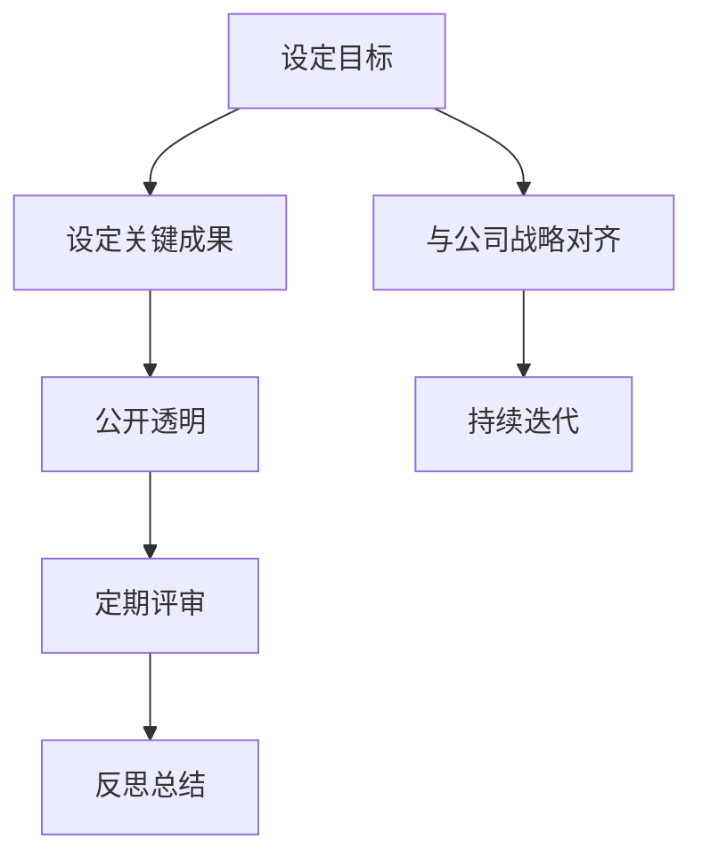
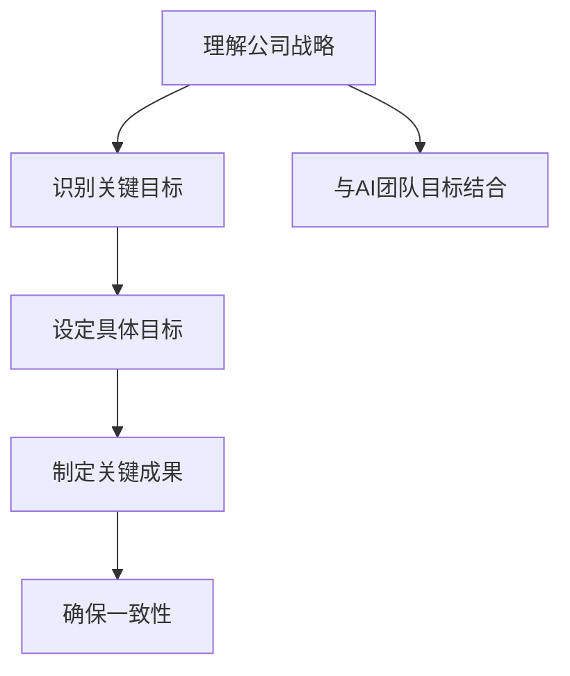

                 

### 文章标题：OKR管理：对齐AI团队目标与公司战略

### 关键词：OKR管理、AI团队、公司战略、目标设定、流程图、伪代码、数学模型、实战案例

### 摘要：
本文旨在探讨如何通过OKR（目标与关键成果）管理方法，有效地对齐AI团队的目标与公司整体战略。文章首先介绍了OKR的基本概念和管理原则，然后深入分析了AI团队在目标设定过程中面临的挑战，并提出了具体的解决方案。文章还结合实际案例，详细讲解了如何实施和监控OKR，以及如何应对实施过程中的挑战。最后，文章总结了OKR管理在AI团队中的应用，并对未来发展趋势进行了展望。

## 引言与背景介绍

在当今人工智能（AI）飞速发展的时代，AI团队在公司战略中的角色日益重要。然而，如何确保AI团队的目标与公司整体战略保持一致，成为许多企业面临的重大挑战。OKR（Objectives and Key Results）管理方法，作为一种目标设定和跟踪的工具，能够有效地帮助团队和企业对齐目标，提高工作效率和达成预期成果。

OKR最早由英特尔公司提出并成功应用，后来被许多知名企业如谷歌、亚马逊等广泛采用。OKR的核心在于通过明确的目标（Objectives）和可量化的关键成果（Key Results），引导团队聚焦于重要任务，确保资源的合理分配，从而实现团队与公司战略的同步。

### OKR的定义与原则

OKR由两部分组成：目标（Objectives）和关键成果（Key Results）。

- **目标（Objectives）**：描述团队希望达成的目标或愿景，通常是高度抽象和具有启发性的陈述，用于激励团队，明确方向。
- **关键成果（Key Results）**：用于衡量目标达成情况的量化指标，具有可衡量性、具体性、相关性、挑战性和时限性等特点。

OKR管理遵循以下原则：

1. **具体性**：目标要具体、明确，避免模糊和抽象。
2. **挑战性**：关键成果应具有一定挑战性，以激励团队超越自身舒适区。
3. **透明性**：OKR应公开透明，确保团队和公司内部对目标有共同理解。
4. **一致性**：团队和公司层面的OKR应保持一致，确保团队目标与公司战略对齐。
5. **迭代性**：OKR是一个持续迭代的过程，需要定期回顾和调整。

### AI团队目标设定的挑战与机遇

对于AI团队来说，设定目标面临着独特的挑战：

1. **技术复杂性**：AI项目的实现涉及大量的技术和数据，目标设定需要考虑技术的成熟度、团队的技术能力等因素。
2. **不确定性和风险**：AI项目的进展往往存在不确定性和风险，目标设定需要预留一定的弹性空间。
3. **资源分配**：AI项目通常需要大量的计算资源和数据支持，目标设定需要确保资源的合理分配。

然而，这些挑战也带来了机遇：

1. **创新机会**：通过OKR管理，AI团队能够更加专注于创新任务，提高项目的成功概率。
2. **团队合作**：OKR能够促进团队成员之间的协作，共同实现团队目标。
3. **战略对齐**：AI团队的目标能够更好地与公司整体战略相结合，提高公司竞争力。

### OKR管理的基本原理

OKR管理方法的核心在于目标的明确性和可量化性，以及持续的迭代和反思。以下是OKR管理的基本原理：

#### 目标（Objectives）

目标（Objectives）是团队希望达成的目标或愿景，通常由以下几个要素组成：

- **抽象性**：目标应该是高度抽象和具有启发性的陈述，能够激励团队成员。
- **明确性**：目标应具体、明确，避免模糊和抽象的表述。
- **激励性**：目标应具有激励性，能够激发团队成员的积极性和创造力。

#### 关键成果（Key Results）

关键成果（Key Results）是用于衡量目标达成情况的量化指标，具有以下特点：

- **可衡量性**：关键成果应该是可量化的，能够用具体的数字或指标来衡量。
- **具体性**：关键成果应具体、明确，避免模糊和抽象的表述。
- **相关性**：关键成果应与目标直接相关，确保目标的达成。
- **挑战性**：关键成果应具有一定挑战性，以激励团队超越自身舒适区。
- **时限性**：关键成果应有明确的时间限制，确保目标的按时完成。

#### OKR管理流程

OKR管理流程通常包括以下几个步骤：

1. **设定目标（Set Objectives）**：团队根据公司战略和自身职责，设定明确、具体的年度目标。
2. **设定关键成果（Set Key Results）**：针对每个目标，设定可量化的关键成果，确保目标的可衡量性。
3. **公开透明（Make Visible）**：将OKR公开透明地分享给团队成员，确保共同理解。
4. **定期评审（Check-In）**：定期进行OKR评审，评估目标的完成情况，及时调整和优化。
5. **反思总结（Reflect）**：在完成OKR周期后，进行反思总结，分享经验教训，为下一周期做好准备。

#### Mermaid流程图：OKR管理概念联系

以下是一个使用Mermaid绘制的流程图，展示了OKR管理中的核心概念及其相互关系：



### AI团队目标设定

在AI团队中，设定目标是一个复杂而关键的过程。由于AI项目的独特性和挑战性，AI团队的目标设定需要特别考虑以下几个方面：

#### AI团队目标的特点

1. **技术创新性**：AI团队的目标往往涉及技术创新和研究，因此目标应具有前瞻性和创新性。
2. **不确定性**：AI项目的进展具有不确定性，目标设定需要预留一定的弹性空间。
3. **资源依赖性**：AI项目通常需要大量的计算资源和数据支持，目标设定需要确保资源的合理分配。
4. **跨部门协作**：AI项目往往涉及多个部门，目标设定需要充分考虑跨部门的协作和协调。

#### 设定AI团队目标的步骤

以下是设定AI团队目标的步骤：

1. **理解公司战略**：首先，AI团队需要全面理解公司战略，明确公司整体目标和发展方向。
2. **分析团队职责**：明确AI团队在公司中的职责和定位，了解团队需要达成的关键任务。
3. **确定目标方向**：根据公司战略和团队职责，确定AI团队的目标方向。
4. **设定具体目标**：将目标具体化，确保目标的明确性和可衡量性。
5. **制定关键成果**：为每个目标设定关键成果，确保关键成果的量化性和可执行性。
6. **审查和调整**：对设定的目标进行审查和调整，确保目标的可行性和挑战性。

#### 伪代码：AI团队目标设定算法

以下是一个简化的伪代码，用于展示AI团队目标设定的算法：

```python
function 设定AI团队目标(公司战略, 团队职责):
    # 步骤1：理解公司战略
    理解公司战略(公司战略)

    # 步骤2：分析团队职责
    分析团队职责(团队职责)

    # 步骤3：确定目标方向
    目标方向 = 确定目标方向(公司战略, 团队职责)

    # 步骤4：设定具体目标
    具体目标 = 设定具体目标(目标方向)

    # 步骤5：制定关键成果
    关键成果 = 制定关键成果(具体目标)

    # 步骤6：审查和调整
    审查和调整(具体目标, 关键成果)

    # 返回最终目标
    return 具体目标, 关键成果
```

### 公司战略与OKR结合

为了确保AI团队的目标与公司整体战略保持一致，需要将公司战略与OKR相结合。以下是结合公司战略与OKR的具体步骤：

#### 公司战略概述

公司战略是指公司为实现长期目标而制定的发展规划，通常包括以下几个方面：

1. **愿景**：公司希望成为什么样的企业。
2. **使命**：公司的核心价值观和存在的意义。
3. **目标**：公司在未来一段时间内希望实现的具体目标。
4. **关键成功因素**：公司成功的关键因素和竞争优势。

#### 如何将公司战略转化为OKR

将公司战略转化为OKR需要以下几个步骤：

1. **理解公司战略**：深入理解公司战略的各个方面，包括愿景、使命、目标和关键成功因素。
2. **识别关键目标**：根据公司战略，识别出对公司最重要的目标，这些目标将成为AI团队的目标。
3. **设定具体目标**：将关键目标具体化，确保目标的明确性和可衡量性。
4. **制定关键成果**：为每个目标设定关键成果，确保关键成果的量化性和可执行性。
5. **确保一致性**：确保AI团队的目标与公司战略保持一致，确保团队目标与公司战略的对齐。

#### Mermaid流程图：公司战略与OKR结合

以下是一个使用Mermaid绘制的流程图，展示了如何将公司战略转化为OKR：



### OKR实施与监控

OKR的实施和监控是确保目标达成的重要环节。以下详细介绍了OKR实施的步骤和监控工具与技术。

#### OKR实施的步骤

1. **设定目标**：根据公司战略和团队职责，设定明确、具体的年度目标。
2. **设定关键成果**：为每个目标设定可量化的关键成果，确保关键成果的量化性和可执行性。
3. **团队共识**：确保团队成员对OKR有共同的理解和认同，提高执行的动力。
4. **公开透明**：将OKR公开透明地分享给团队成员，确保共同理解。
5. **分解任务**：将目标分解为具体的任务和里程碑，明确责任和截止日期。
6. **执行任务**：团队成员按照分解的任务进行具体的工作。
7. **定期评审**：定期进行OKR评审，评估目标的完成情况，及时调整和优化。
8. **反思总结**：在完成OKR周期后，进行反思总结，分享经验教训，为下一周期做好准备。

#### OKR监控工具与技术

1. **项目管理工具**：如Trello、Jira等，用于任务分解、进度跟踪和团队协作。
2. **数据分析和报告**：利用数据分析和报告工具，如Google Analytics、Tableau等，实时监控关键成果的达成情况。
3. **团队会议**：定期召开团队会议，讨论OKR的进展和问题，确保团队目标的实现。
4. **反馈机制**：建立有效的反馈机制，及时收集团队成员的反馈和建议，优化OKR实施过程。

#### 伪代码：OKR监控算法

以下是一个简化的伪代码，用于展示OKR监控的基本算法：

```python
function 监控OKR(OKR目标, 关键成果):
    # 步骤1：初始化监控数据
    监控数据 = 初始化监控数据()

    # 步骤2：定期收集关键成果数据
    while 未完成OKR目标:
        关键成果数据 = 收集关键成果数据()
        监控数据更新(关键成果数据)

    # 步骤3：评估OKR完成情况
    完成情况 = 评估完成情况(监控数据)

    # 步骤4：反馈和调整
    if 完成情况 < 预期:
        提出反馈和调整建议()
    else:
        记录成功经验()

    # 返回监控结果
    return 监控结果
```

### OKR管理的挑战与解决方案

尽管OKR管理方法具有许多优势，但在实际应用中仍面临一系列挑战。以下讨论OKR管理中常见的挑战以及相应的解决方案。

#### 常见挑战

1. **目标设定不明确**：目标设定不明确可能导致团队成员对任务的理解不一致，影响工作效率。
2. **关键成果难量化**：关键成果难以量化，无法准确衡量目标的达成情况。
3. **缺乏持续反馈**：缺乏有效的反馈机制，导致团队成员无法及时调整和优化工作。
4. **资源分配不均**：资源分配不均可能导致关键任务无法按时完成。
5. **团队协作不畅**：团队协作不畅，影响OKR的执行效果。

#### 针对挑战的解决方案

1. **明确目标设定**：确保目标设定具体、明确，避免模糊和抽象的表述。可以通过团队讨论、反复修订等方式，确保目标的共识和明确性。
2. **关键成果量化**：为每个关键成果设定量化的指标，确保关键成果的可衡量性。可以借鉴行业标准和最佳实践，设定合理的量化指标。
3. **建立反馈机制**：建立有效的反馈机制，定期收集团队成员的反馈和建议，及时调整和优化OKR实施过程。可以通过团队会议、问卷调查等方式，确保反馈渠道的畅通。
4. **资源合理分配**：根据关键任务的重要性和紧急性，合理分配资源，确保关键任务的优先级。可以通过资源规划、优先级调整等方式，优化资源分配。
5. **促进团队协作**：加强团队协作，提高团队凝聚力。可以通过团队建设活动、定期培训等方式，促进团队成员之间的交流和合作。

### 数学模型讲解

在OKR管理中，数学模型的应用有助于量化目标的达成情况和关键成果。以下介绍几个常用的数学模型，并使用LaTeX格式表示。

#### 成功率模型

成功率模型用于衡量OKR的达成情况。假设有n个关键成果，每个关键成果的成功率为$r_i$，则OKR的成功率$S$可以表示为：

$$
S = \frac{1}{n}\sum_{i=1}^{n} r_i
$$

#### 成长率模型

增长率模型用于衡量目标的成长速度。假设初始值为$V_0$，经过t个周期后的值为$V_t$，则增长率$G$可以表示为：

$$
G = \frac{V_t - V_0}{V_0} \times 100\%
$$

#### 成本效益模型

成本效益模型用于评估OKR实施的经济效益。假设总成本为$C$，总收益为$R$，则成本效益比$E$可以表示为：

$$
E = \frac{R}{C}
$$

#### 伪代码：OKR监控算法

以下是一个简化的伪代码，用于展示如何使用数学模型监控OKR的达成情况：

```python
function 监控OKR(OKR目标, 关键成果列表):
    # 步骤1：初始化监控数据
    成功率 = 0
    成长率 = 0
    成本效益比 = 0

    # 步骤2：计算成功率
    for 关键成果 in 关键成果列表:
        成功率 += 关键成果的成功率()

    成功率 /= 长度(关键成果列表)

    # 步骤3：计算增长率
    初始值 = 获取初始值(OKR目标)
    最终值 = 获取最终值(OKR目标)
    成长率 = (最终值 - 初始值) / 初始值 * 100

    # 步骤4：计算成本效益比
    总成本 = 获取总成本(OKR目标)
    总收益 = 获取总收益(OKR目标)
    成本效益比 = 总收益 / 总成本

    # 步骤5：评估OKR达成情况
    if 成功率 > 预期成功率 and 成长率 > 预期增长率 and 成本效益比 > 预期成本效益比:
        打印("OKR达成情况良好")
    else:
        打印("OKR达成情况不佳，需要调整")

    # 返回监控结果
    return 成功率, 成长率, 成本效益比
```

### 实战案例分析

为了更好地理解OKR管理在AI团队中的应用，以下提供了一个实际案例，展示了如何在实际环境中设定和实施OKR。

#### 案例背景

某大型科技公司拥有一支专业的AI团队，负责开发和创新人工智能技术。公司战略目标是成为人工智能领域的领导者，并在未来三年内实现人工智能技术的广泛应用。AI团队需要确保其目标与公司战略保持一致，并通过OKR管理实现这一目标。

#### 设定目标

根据公司战略和团队职责，AI团队设定了以下年度目标：

1. **目标1**：开发一款具有高性能和低延迟的人工智能模型。
2. **目标2**：提高团队在人工智能领域的专利数量。

#### 设定关键成果

为了量化上述目标，AI团队设定了以下关键成果：

1. **目标1**：
    - **关键成果1.1**：在三个月内完成人工智能模型的开发，模型准确率达到95%。
    - **关键成果1.2**：在六个月内将模型部署到生产环境，实现实时应用。
2. **目标2**：
    - **关键成果2.1**：在一年内提交五项与人工智能相关的专利申请。
    - **关键成果2.2**：在一年内获得三项专利授权。

#### 实施过程

1. **团队共识**：AI团队召开会议，讨论并确定上述目标和关键成果，确保团队成员对目标有共同的理解和认同。
2. **公开透明**：AI团队将目标和关键成果公开透明地分享给公司内部相关部门，确保所有利益相关者对目标有清晰的认识。
3. **任务分解**：AI团队将目标分解为具体的任务和里程碑，明确每个任务的负责人和截止日期。
4. **执行任务**：AI团队成员按照分解的任务进行具体的工作，确保每个关键成果的按时完成。
5. **定期评审**：AI团队定期召开会议，评估关键成果的完成情况，及时调整和优化工作计划。
6. **反思总结**：在完成OKR周期后，AI团队进行反思总结，分享经验教训，为下一周期做好准备。

#### 实施效果

通过OKR管理，AI团队成功完成了设定的目标，并取得了以下成果：

1. **目标1**：成功开发了一款具有高性能和低延迟的人工智能模型，模型准确率达到95%，并在六个月内将模型部署到生产环境，实现了实时应用。
2. **目标2**：在一年内提交了五项与人工智能相关的专利申请，并获得了三项专利授权。

这些成果不仅实现了AI团队的目标，也为公司整体战略目标的实现做出了重要贡献。

#### 案例分析

该案例展示了如何通过OKR管理方法，确保AI团队的目标与公司战略保持一致，并取得实际成果。以下是该案例的成功原因和经验教训：

1. **成功原因**：
    - 明确的目标和关键成果：AI团队设定的目标和关键成果具体、明确，具有挑战性，能够激励团队成员积极工作。
    - 公开透明的管理：AI团队将目标和关键成果公开透明地分享给公司内部相关部门，确保了所有利益相关者的参与和认同。
    - 定期评审和反思总结：AI团队定期召开会议，评估关键成果的完成情况，及时调整和优化工作计划，确保了目标的按时完成。

2. **经验教训**：
    - 目标设定要具体、明确，避免模糊和抽象的表述。
    - 关键成果要可量化，确保目标的可衡量性。
    - 建立有效的反馈机制，及时收集团队成员的反馈和建议，优化OKR实施过程。
    - 确保资源的合理分配，避免资源浪费。

### 最佳实践 tips、小结、注意事项、拓展阅读等内容

#### 最佳实践 tips

1. **明确目标**：确保目标具体、明确，避免模糊和抽象的表述。
2. **量化关键成果**：为每个关键成果设定量化的指标，确保关键成果的可衡量性。
3. **定期评审**：定期召开会议，评估关键成果的完成情况，及时调整和优化工作计划。
4. **公开透明**：将目标和关键成果公开透明地分享给团队成员，确保共同理解。
5. **反馈机制**：建立有效的反馈机制，及时收集团队成员的反馈和建议，优化OKR实施过程。

#### 小结

本文通过实例详细介绍了OKR管理在AI团队中的应用。通过设定明确的目标和关键成果，AI团队能够更好地与公司战略保持一致，提高工作效率和达成预期成果。

#### 注意事项

1. 目标设定要具体、明确，避免模糊和抽象的表述。
2. 关键成果要可量化，确保目标的可衡量性。
3. 定期评审和反思总结，及时调整和优化工作计划。
4. 建立有效的反馈机制，及时收集团队成员的反馈和建议。

#### 拓展阅读

1. 《OKR：源于谷歌、小米、腾讯的最佳工作方法》
2. 《人工智能：一种现代方法》
3. 《数据科学：实战案例与应用》
4. 《机器学习：原理与实践》

### 文章结束

作者：AI天才研究院/AI Genius Institute & 禅与计算机程序设计艺术 /Zen And The Art of Computer Programming

