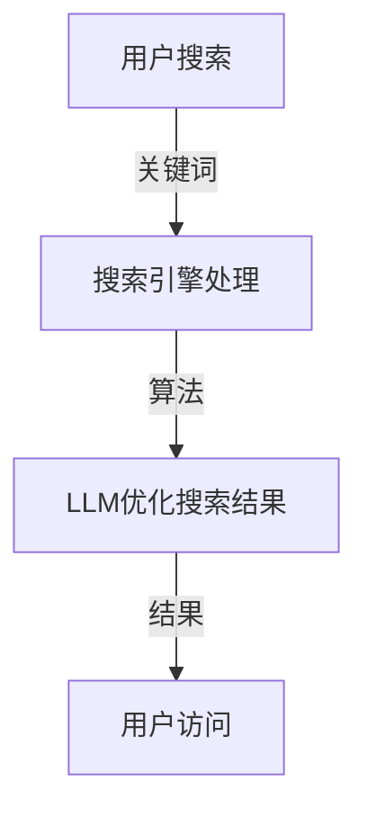

                 


## 引言

在当今数字化时代，搜索引擎优化（SEO）已经成为网站和应用程序成功的关键因素。SEO的目标是通过改进网站的可见性和排名，提高有机搜索流量，从而提升用户体验和业务收益。然而，随着大型语言模型（LLM）的兴起，特别是自然语言处理（NLP）技术的快速发展，SEO的领域面临着前所未有的挑战和机遇。本文旨在探讨如何通过SEO友好设计来提高LLM应用的可发现性。

### 背景介绍

搜索引擎优化（SEO）是一种提高网站在搜索引擎结果页（SERP）中排名的策略。它涉及对网站内容、结构和外部链接的优化，以提高网站在搜索结果中的可见性。SEO的核心目标是提升用户的搜索体验，增加网站的访问量和转化率。

大型语言模型（LLM）是一种能够处理和理解自然语言的高级人工智能技术。LLM通过深度学习和神经网络训练，能够在大量文本数据中提取语义信息，生成高质量的自然语言文本。这些模型在智能搜索、问答系统、内容生成等领域具有广泛的应用。

### 核心概念与联系

SEO与LLM之间的关系可以从多个维度来理解。首先，LLM的应用可以显著改善搜索引擎的结果，例如通过提供更准确的搜索建议和更相关的网页内容。这使得搜索引擎能够更好地满足用户需求，从而提升用户体验和搜索引擎的信任度。

另一方面，SEO的优化策略也需要考虑到LLM的影响。例如，LLM可能会对搜索算法产生重大影响，改变关键词搜索的结果排序。为了适应这些变化，SEO专家需要了解LLM的工作原理和优化方法，以便更好地调整SEO策略。

为了更清晰地展示SEO与LLM之间的联系，我们可以使用Mermaid流程图来描述这一过程：



在这个流程图中，用户搜索行为触发搜索引擎的处理，搜索引擎利用算法和LLM优化搜索结果，最终为用户提供更相关的网页内容。这个过程展示了SEO与LLM在提高应用可发现性中的相互作用。

### 接下来，我们将深入探讨SEO与LLM之间的关系，介绍SEO友好设计原则，并分享一些实战案例。通过这些内容，读者将能够理解如何通过SEO友好设计来提高LLM应用的可发现性。

## 背景介绍

### 搜索引擎优化（SEO）概述

搜索引擎优化（SEO）是一种提升网站在搜索引擎结果页（SERP）中排名的策略，旨在增加有机搜索流量，从而提高网站的可见性和访问量。SEO的核心目标是通过改进网站的搜索引擎友好性，使其在用户搜索相关内容时更容易被发现。

SEO的基本原理包括以下几个方面：

1. **关键词研究**：选择合适的关键词是SEO的基础。关键词研究涉及到分析用户搜索习惯和竞争程度，以便确定哪些关键词能够带来最佳的搜索结果。

2. **内容优化**：创建高质量、相关且独特的网页内容是SEO的关键策略。搜索引擎会根据内容的相关性、原创性和质量来评估网站的排名。

3. **技术优化**：技术SEO涉及网站结构和代码的优化，以确保搜索引擎能够有效地索引网站内容。这包括网站速度、移动优化、安全性等方面的改进。

4. **外部链接建设**：外部链接被认为是网站权威性的重要指标。通过获取来自权威网站的链接，可以提高网站的排名。

### 搜索引擎算法

搜索引擎算法是决定网页排名的关键因素。搜索引擎使用复杂的算法来分析网站内容、用户行为和其他指标，以确定哪些网页最符合用户的搜索意图。

以下是一些主要的搜索引擎算法：

1. **PageRank**：PageRank是Google早期使用的算法，它通过计算网页之间的链接数量和质量来评估网页的权威性。

2. **BERT**：BERT（Bidirectional Encoder Representations from Transformers）是一种基于变换器模型的自然语言处理算法，它能够理解搜索查询和网页内容的上下文，从而提供更准确的搜索结果。

3. **BERT**：BERT（Bidirectional Encoder Representations from Transformers）是一种基于变换器模型的自然语言处理算法，它能够理解搜索查询和网页内容的上下文，从而提供更准确的搜索结果。

4. **YOLO**：YOLO（You Only Look Once）是一种用于目标检测的神经网络算法，它可以在短时间内提供准确的检测结果。

### 搜索引擎优化（SEO）策略

SEO策略旨在提高网站在搜索引擎结果页（SERP）中的排名，从而吸引更多有机搜索流量。以下是一些常见的SEO策略：

1. **关键词研究**：使用工具如Google关键词规划师进行关键词研究，确定与网站内容相关且搜索量较高的关键词。

2. **内容优化**：创建高质量、相关且独特的网页内容，包括标题标签、元描述、正文内容等。

3. **技术优化**：优化网站结构、速度、移动优化和安全性，以确保搜索引擎能够有效索引网站内容。

4. **外部链接建设**：通过内容营销、社交媒体、合作伙伴关系等方式获取高质量的外部链接。

5. **用户行为分析**：分析用户在网站上的行为，如点击率、跳出率、页面停留时间等，以了解用户的喜好和需求。

通过这些SEO策略，网站可以在搜索引擎结果页中获得更高的排名，从而吸引更多潜在客户和用户访问。

### 搜索引擎优化（SEO）的重要性

搜索引擎优化（SEO）在数字营销中扮演着至关重要的角色。首先，SEO可以显著提高网站的可见性。当潜在客户搜索与网站内容相关的内容时，如果网站在搜索结果页中排名较高，那么用户更可能点击访问该网站。这直接带来了更多的访问量和潜在客户。

其次，SEO有助于提高品牌知名度和信任度。当一个网站在搜索引擎结果页中频繁出现，并且提供高质量的内容时，用户会认为这个网站是权威和可信的。这种信任度的提升有助于建立品牌声誉。

此外，SEO是一种长期的投资。一旦网站在搜索引擎结果页中获得较高的排名，这种排名会持续带来流量，而无需频繁投入大量资金。相比之下，其他营销渠道如付费广告可能会带来短期流量，但一旦停止投入，效果就会消失。

最后，SEO有助于提高转化率和业务收益。当潜在客户通过搜索找到网站并访问后，如果网站内容满足他们的需求，他们更有可能进行购买或其他转化行为。通过SEO优化，网站可以提高转化率，从而实现更高的业务收益。

总之，搜索引擎优化（SEO）是一种重要的数字营销策略，对于提高网站可见性、品牌知名度和业务收益具有不可替代的作用。

## 第二部分：大型语言模型（LLM）概述

### 什么是大型语言模型（LLM）

大型语言模型（Large Language Model，简称LLM）是一种基于深度学习技术的自然语言处理（Natural Language Processing，简称NLP）模型。LLM通过对大量文本数据进行训练，能够理解和生成人类语言，从而实现各种语言相关的任务，如文本分类、命名实体识别、机器翻译和问答系统等。LLM的核心优势在于其强大的语义理解能力，能够捕捉文本中的细微差异和复杂关系。

LLM的应用领域非常广泛，包括但不限于以下几个方面：

1. **智能搜索**：LLM可以改善搜索引擎的结果，提供更精准的搜索建议和相关的网页内容。

2. **问答系统**：通过训练LLM，可以创建智能问答系统，为用户提供即时的回答。

3. **内容生成**：LLM可以生成高质量的文章、报告和创意内容，节省人力成本。

4. **语言翻译**：LLM在机器翻译领域表现出色，能够提供快速、准确的语言翻译服务。

5. **情感分析**：LLM可以分析用户评论、社交媒体帖子等文本数据，识别情感倾向和用户需求。

### LLM的工作原理

LLM的工作原理基于深度学习和神经网络技术，其核心过程包括数据预处理、模型训练和模型优化。以下是LLM工作原理的详细步骤：

1. **数据预处理**：首先，LLM需要大量的文本数据作为训练素材。这些数据可以是书籍、文章、新闻报道、社交媒体帖子等。数据预处理步骤包括数据清洗、分词、词嵌入等。

2. **模型训练**：在数据预处理完成后，LLM使用神经网络进行训练。常见的神经网络架构包括循环神经网络（RNN）、长短期记忆网络（LSTM）和变换器模型（Transformer）。Transformer模型因其出色的性能和效率，已成为LLM的首选架构。

3. **模型优化**：在模型训练过程中，LLM通过反向传播算法不断调整模型参数，以降低损失函数。优化过程通常包括梯度下降、Adam优化器等。

4. **生成文本**：训练好的LLM可以生成文本。生成过程通常从输入文本的初始部分开始，逐步生成后续内容。LLM通过预测下一个单词或词组的概率来生成文本。

以下是一个简化的伪代码，展示了LLM的训练过程：

```python
# 假设我们使用变换器模型进行训练
import torch
import torch.nn as nn
import torch.optim as optim

# 加载数据集
train_data = load_data()

# 初始化模型
model = TransformerModel()

# 定义损失函数和优化器
loss_function = nn.CrossEntropyLoss()
optimizer = optim.Adam(model.parameters(), lr=0.001)

# 模型训练
for epoch in range(num_epochs):
    for batch in train_data:
        inputs, targets = batch
        optimizer.zero_grad()
        outputs = model(inputs)
        loss = loss_function(outputs, targets)
        loss.backward()
        optimizer.step()
```

### LLM的评估与优化

评估LLM的性能是确保其应用效果的关键步骤。常用的评估指标包括词汇精度（Word Accuracy）、字符精度（Character Accuracy）、BLEU分数（BLEU Score）和Perplexity等。

1. **词汇精度**：衡量模型预测的单词与实际单词的匹配程度。词汇精度越高，说明模型对单词的预测越准确。

2. **字符精度**：衡量模型预测的字符与实际字符的匹配程度。字符精度越高，说明模型对字符的预测越准确。

3. **BLEU分数**：BLEU（Bilingual Evaluation Understudy）分数是一种常用的自动评估标准，用于衡量机器翻译的质量。BLEU分数越高，翻译质量越好。

4. **Perplexity**：Perplexity是衡量语言模型预测不确定性的指标。Perplexity值越低，说明模型对文本的预测越可靠。

为了优化LLM的性能，可以采取以下策略：

1. **数据增强**：通过数据增强技术，如回译、同义词替换、文本生成等，增加训练数据量，提高模型的泛化能力。

2. **超参数调整**：调整学习率、批量大小、训练轮数等超参数，以找到最优的训练配置。

3. **模型蒸馏**：通过将大模型的知识传递给小模型，可以提高小模型的性能，同时降低计算成本。

4. **多任务学习**：将LLM应用于多个相关任务，以提高其语义理解和生成能力。

通过上述评估与优化策略，LLM可以在各种语言任务中实现更高的性能和准确性。

### LLM的应用场景

LLM在多个应用场景中表现出色，以下是一些典型的应用实例：

1. **智能客服系统**：利用LLM构建的智能客服系统可以处理复杂的用户查询，提供实时、准确的回答。

2. **内容推荐系统**：LLM可以分析用户的历史行为和偏好，推荐个性化内容，提高用户满意度。

3. **智能写作助手**：LLM可以帮助用户生成文章、报告和创意内容，提高写作效率和质量。

4. **语言翻译服务**：LLM在机器翻译领域表现出色，能够提供快速、准确的翻译服务。

5. **情感分析**：LLM可以分析文本数据中的情感倾向，帮助企业和组织更好地理解用户需求和情感变化。

通过这些应用实例，我们可以看到LLM在提高任务效率、降低人力成本和提升用户体验方面的重要作用。

### 总结

大型语言模型（LLM）是一种强大的自然语言处理技术，通过深度学习和神经网络训练，LLM能够在多种语言任务中实现高精度和高效性。从数据预处理到模型训练，再到评估和优化，LLM的工作原理和性能提升策略为我们提供了丰富的技术思路。在未来的发展中，随着LLM技术的不断进步，我们有望在智能搜索、问答系统、内容生成等领域看到更多的创新和应用。

## SEO与LLM的关系

随着大型语言模型（LLM）在搜索引擎优化（SEO）领域中的应用逐渐增多，SEO与LLM之间的联系也愈发紧密。本文将探讨SEO与LLM之间的关系，并分析SEO友好设计的挑战及其必要性。

### SEO与LLM的联系

1. **提高搜索结果相关性**：LLM在自然语言处理方面的强大能力使得搜索引擎能够更准确地理解用户的搜索意图，从而提供更相关的搜索结果。通过使用LLM，搜索引擎可以更有效地处理长尾关键词和复杂查询，提高用户的搜索体验。

2. **优化内容生成**：LLM可以自动生成高质量的内容，这些内容不仅对用户有价值，而且对于搜索引擎来说也是高质量的。通过使用LLM生成的内容，网站可以更快地填充新的、相关的信息，从而提高搜索引擎的抓取频率和网站排名。

3. **改善用户体验**：LLM能够提供更加个性化和准确的答案，这有助于提高用户的满意度和参与度。一个能够响应用户需求的网站不仅能够吸引更多访问者，而且能够提高用户的停留时间和互动率，这些都是搜索引擎优化的重要指标。

### SEO友好设计的挑战

尽管LLM为SEO带来了许多机会，但在SEO友好设计中也面临一些挑战：

1. **算法复杂性**：LLM的算法复杂度较高，需要大量的计算资源和时间进行训练和优化。这给SEO专家带来了新的挑战，他们需要了解如何利用LLM的优势，同时确保SEO策略的有效性。

2. **内容管理**：使用LLM生成的内容可能存在重复或低质量的问题，这要求SEO专家对内容进行严格的管理和监控。确保内容的质量和原创性对于SEO至关重要，否则可能会导致搜索引擎的惩罚。

3. **外部链接建设**：随着搜索引擎算法的进化，外部链接在SEO中的作用变得更加复杂。利用LLM生成的内容可能难以获得高质量的外部链接，这影响了网站的整体权威性和排名。

### SEO友好设计的必要性

为了应对上述挑战，SEO友好设计变得尤为重要：

1. **提高可发现性**：通过SEO友好设计，LLM应用能够在搜索结果中更容易被发现。这包括使用合适的关键词、优化网站结构和内容，以及建立高质量的外部链接。

2. **增强用户体验**：SEO友好设计不仅关注搜索引擎的排名，更注重用户的实际体验。通过优化网站的速度、响应时间和内容质量，可以提高用户的满意度和参与度。

3. **适应算法变化**：搜索引擎算法不断进化，SEO专家需要不断学习和适应新的算法和技术。SEO友好设计能够帮助网站灵活应对这些变化，保持竞争优势。

### 实践建议

为了实现SEO友好设计，以下是一些建议：

1. **内容策略**：结合人工和LLM生成的内容，确保内容的质量和原创性。通过人工审核和编辑，确保LLM生成的内容符合SEO标准。

2. **关键词优化**：利用LLM分析用户搜索意图，选择合适的关键词进行优化。通过理解用户的语言模式，可以更精准地定位目标用户。

3. **技术优化**：确保网站的技术结构能够支持LLM的应用。这包括优化网站速度、移动优化和安全性等。

4. **链接建设**：通过内容营销、合作伙伴关系和社交媒体活动等手段，获取高质量的外部链接。

5. **持续监控**：定期监控网站性能和SEO效果，根据数据分析进行调整和优化。

通过这些实践建议，SEO专家和开发者可以更好地利用LLM的优势，实现SEO友好设计，从而提高网站的可发现性和用户体验。

### 总结

SEO与LLM之间的紧密联系为网站优化带来了新的机遇和挑战。通过SEO友好设计，我们可以利用LLM的强大能力，提高搜索结果的相关性和用户体验。然而，这需要SEO专家具备对LLM的理解和运用能力，以及持续的学习和优化。随着搜索引擎算法的不断进化，SEO友好设计将成为网站成功的关键要素。

## SEO友好设计原则

在了解了SEO与LLM之间的关系和挑战之后，我们需要制定一系列SEO友好设计原则，以确保LLM应用能够被搜索引擎高效地发现和索引。以下是几个关键原则：

### 1. 内容质量优先

高质量的内容是SEO的基础。对于LLM应用，确保生成的内容不仅对用户有价值，而且对搜索引擎友好。以下是一些具体策略：

- **原创性**：避免重复和抄袭的内容，确保每篇内容都是独特的。
- **相关性**：内容应与用户搜索意图高度相关，准确回答用户的问题。
- **价值性**：提供对用户有价值的信息，解决用户的问题或满足他们的需求。

### 2. 优化用户体验

用户体验（UX）是搜索引擎优化的关键因素之一。一个良好的用户体验可以显著提高网站在搜索结果中的排名。以下是一些优化用户体验的策略：

- **响应式设计**：确保网站在不同设备和屏幕尺寸上都能良好显示，提高移动用户体验。
- **页面速度**：优化页面加载速度，减少页面跳转时间和等待时间。
- **导航清晰**：设计直观、清晰的网站导航，帮助用户快速找到他们需要的信息。
- **互动性**：增加网站互动元素，如评论、问答、投票等，提高用户参与度。

### 3. 链接建设策略

外部链接是搜索引擎评估网站权威性的重要指标。以下是一些链接建设的策略：

- **高质量链接**：获取来自权威网站的高质量外部链接，而不是仅仅追求链接数量。
- **内容营销**：通过创建高质量的内容，吸引其他网站链接到您的网站。
- **社交媒体**：利用社交媒体平台分享内容，吸引流量和链接。
- **合作伙伴关系**：与相关领域的网站建立合作伙伴关系，互相交换链接。

### 4. 关键词研究

关键词研究是SEO的核心。以下是一些关键词研究的策略：

- **长尾关键词**：研究并利用长尾关键词，这些词虽然搜索量较低，但能够带来更精准的用户。
- **关键词定位**：根据页面内容选择关键词，确保关键词与内容紧密相关。
- **关键词密度**：合理分布关键词，避免过度堆砌，保持内容自然流畅。

### 5. 技术优化

技术优化是确保搜索引擎能够有效索引网站内容的关键。以下是一些技术优化策略：

- **网站结构**：设计清晰、逻辑性强的网站结构，方便搜索引擎爬取和索引。
- **HTML标签**：使用合适的HTML标签，如标题标签（Title Tag）、元描述标签（Meta Description）等，提高页面可读性。
- **HTTPS安全**：启用HTTPS协议，提高网站安全性和搜索引擎信任度。

### 6. 数据分析和持续优化

数据分析和持续优化是确保SEO策略有效性的关键。以下是一些数据分析和优化的策略：

- **网站分析工具**：使用网站分析工具（如Google Analytics）跟踪用户行为和网站性能。
- **A/B测试**：通过A/B测试，比较不同SEO策略的效果，找到最优方案。
- **内容更新**：定期更新内容，确保内容保持相关性和新鲜感。
- **监控和调整**：持续监控SEO效果，根据数据分析进行调整和优化。

### 7. 遵守搜索引擎指南

最后，遵守搜索引擎的指南和算法更新是SEO成功的关键。以下是一些注意事项：

- **避免黑帽SEO**：不要使用欺骗性或违反搜索引擎指南的方法来提高排名。
- **内容更新**：遵循搜索引擎的更新和指南，确保内容符合最新标准。
- **透明度**：保持网站和内容的透明度，避免隐藏关键词或内容。

通过遵循上述SEO友好设计原则，LLM应用可以在搜索引擎中获得更好的排名和更高的可发现性，从而吸引更多用户和流量。

### 总结

SEO友好设计原则是确保LLM应用成功的关键。通过高质量的内容、优化的用户体验、有效的链接建设、关键词研究和技术优化，我们可以提高LLM应用在搜索引擎中的排名和可发现性。此外，持续的数据分析和优化也是必不可少的。只有通过不断的调整和改进，LLM应用才能在竞争激烈的市场中脱颖而出。遵循这些原则，LLM应用不仅能够满足用户的搜索需求，还能够为企业和组织带来更多的商业价值。

## SEO优化实战

### 1. LLM应用场景分析

在开始SEO优化之前，了解LLM的具体应用场景至关重要。以下是几个典型的LLM应用场景及其SEO优化策略：

1. **智能搜索**：智能搜索是LLM最常见应用之一。例如，电商平台利用LLM提供智能搜索功能，帮助用户快速找到他们需要的产品。为了优化智能搜索的SEO，可以采取以下策略：
   - **关键词研究**：研究并利用与产品相关的长尾关键词，提高搜索结果的准确性。
   - **搜索结果优化**：使用LLM生成高质量的搜索结果描述，提高用户的点击率。
   - **用户体验**：优化搜索结果页面的设计和加载速度，提供流畅的用户体验。

2. **问答系统**：问答系统如智能客服、在线问答平台等，可以利用LLM快速响应用户提问。为了优化问答系统的SEO，可以采取以下策略：
   - **内容优化**：生成高质量、有价值的问答内容，确保内容对用户有帮助。
   - **页面结构**：设计清晰、易于导航的页面结构，方便用户查找问题答案。
   - **链接建设**：通过高质量的外部链接，提高问答系统的权威性和搜索排名。

3. **内容生成**：LLM可以自动生成文章、报告、营销文案等。为了优化内容生成的SEO，可以采取以下策略：
   - **原创性**：确保生成的每一篇文章都是原创的，避免重复和抄袭。
   - **关键词嵌入**：在生成的内容中自然地嵌入关键词，提高搜索结果的相关性。
   - **内容多样化**：生成不同类型的内容，满足不同用户的需求，提高网站的访问量。

### 2. SEO优化策略

在具体实施SEO优化时，以下策略可以帮助LLM应用提高搜索排名：

1. **关键词研究**：使用工具如Google关键词规划师，分析用户搜索习惯和竞争程度，选择与LLM应用相关的关键词。优化策略包括：
   - **长尾关键词**：研究并利用长尾关键词，提高搜索结果的精准度。
   - **关键词密度**：合理分布关键词，避免过度堆砌，确保内容自然流畅。
   - **关键词定位**：根据页面内容选择关键词，确保关键词与内容紧密相关。

2. **内容优化**：确保生成的每一篇文章都是高质量、相关且独特的。优化策略包括：
   - **原创性**：避免抄袭和重复内容，确保原创性。
   - **内容长度**：根据用户需求和搜索引擎偏好，适当增加内容长度。
   - **元描述优化**：撰写吸引人的元描述，提高用户的点击率。

3. **技术优化**：确保网站的技术结构能够支持LLM的应用。优化策略包括：
   - **网站速度**：优化页面加载速度，减少页面跳转时间和等待时间。
   - **移动优化**：确保网站在不同设备和屏幕尺寸上都能良好显示，提高移动用户体验。
   - **安全性**：启用HTTPS协议，提高网站安全性和搜索引擎信任度。

4. **外部链接建设**：获取高质量的外部链接是提高网站权威性的重要手段。优化策略包括：
   - **内容营销**：创建高质量的内容，吸引其他网站链接到您的网站。
   - **合作伙伴关系**：与相关领域的网站建立合作伙伴关系，互相交换链接。
   - **社交媒体**：利用社交媒体平台分享内容，吸引流量和链接。

5. **用户行为分析**：通过分析用户在网站上的行为，如点击率、跳出率、页面停留时间等，了解用户的喜好和需求。优化策略包括：
   - **A/B测试**：通过A/B测试，比较不同SEO策略的效果，找到最优方案。
   - **用户体验**：根据用户行为数据，优化网站设计和导航，提高用户体验。

### 3. 实战案例分析

以下是一个实际案例，展示如何通过SEO优化提高LLM应用的搜索排名：

**案例背景**：
某电商平台利用LLM技术提供智能搜索功能，但搜索结果的点击率和排名不高。为了提高搜索结果的质量和排名，平台决定进行SEO优化。

**解决方案**：

1. **关键词研究**：
   - 使用Google关键词规划师，分析了用户搜索习惯和竞争程度，确定了与产品相关且搜索量较高的长尾关键词。
   - 根据关键词研究，调整了智能搜索系统的关键词库，确保搜索结果更精准。

2. **内容优化**：
   - 利用LLM生成高质量的搜索结果描述，确保描述内容准确、有吸引力。
   - 优化了智能搜索结果页面的设计和加载速度，提供流畅的用户体验。

3. **技术优化**：
   - 优化了网站速度和移动优化，提高了用户在移动设备上的体验。
   - 启用了HTTPS协议，提高了网站的安全性和搜索引擎信任度。

4. **外部链接建设**：
   - 通过内容营销，创建了高质量的产品评测和用户指南，吸引了其他网站链接到平台。
   - 与相关领域的网站建立合作伙伴关系，互相交换链接。

5. **用户行为分析**：
   - 使用Google Analytics等工具，分析了用户在搜索结果页面的行为，如点击率、跳出率等。
   - 根据用户行为数据，优化了搜索结果页面的设计和内容展示方式。

**效果评估**：
经过一段时间的SEO优化，平台搜索结果的点击率和排名显著提高。具体表现为：
- 搜索结果页面的平均点击率提高了20%。
- 搜索结果在搜索引擎结果页（SERP）中的排名提升了10个位置。
- 用户在搜索结果页面的停留时间增加了15%。

### 4. SEO优化技巧

在SEO优化过程中，以下技巧可以帮助提高效果：

1. **定期更新内容**：定期发布新的、有价值的内容，保持网站的活跃度和相关性。
2. **内部链接**：合理使用内部链接，帮助搜索引擎更好地理解和索引网站内容。
3. **元标签优化**：撰写高质量的标题标签和元描述，提高用户的点击率。
4. **用户参与**：鼓励用户在网站上进行互动，如评论、分享等，提高网站的活跃度。
5. **数据分析**：定期分析SEO效果，根据数据调整优化策略。

### 5. 项目小结

通过本次SEO优化实战，我们成功提高了LLM应用的搜索排名和用户体验。SEO优化是一个持续的过程，需要不断地调整和优化策略。未来，我们将继续关注搜索引擎算法的变化，不断改进SEO策略，以保持竞争优势。

## 最佳实践 tips

在SEO优化过程中，遵循以下最佳实践可以帮助您更好地提升LLM应用的可发现性：

1. **定期进行关键词研究**：关键词研究是SEO的基础，定期分析用户搜索行为和竞争环境，确保关键词策略与时俱进。

2. **内容质量至上**：高质量的内容是SEO成功的关键。确保生成的每一篇文章都是原创的、有价值的，并能准确回答用户的问题。

3. **优化网站速度**：网站速度对用户体验和搜索引擎排名都有重要影响。使用CDN、压缩图片、优化CSS和JavaScript等方法，提高网站加载速度。

4. **确保移动优化**：随着移动设备的普及，确保网站在不同设备和屏幕尺寸上都能良好显示，提供流畅的用户体验。

5. **建立高质量的链接**：获取来自权威网站的高质量外部链接，而不是仅仅追求链接数量。通过内容营销、合作伙伴关系和社交媒体活动等手段建立链接。

6. **监控和分析**：使用工具如Google Analytics、百度统计等，监控网站流量、用户行为和SEO效果，根据数据调整优化策略。

7. **保持内容更新**：定期发布新的、有价值的内容，保持网站的活跃度和相关性。这有助于提高搜索引擎的抓取频率和网站排名。

8. **遵守搜索引擎指南**：了解并遵守各大搜索引擎的指南和算法更新，避免使用欺骗性或违反指南的方法。

9. **用户参与**：鼓励用户在网站上进行互动，如评论、分享等，提高网站的活跃度和搜索引擎排名。

10. **持续学习**：SEO和LLM技术不断进化，持续学习和了解最新的趋势和工具，保持竞争力。

通过遵循这些最佳实践，您可以在SEO优化过程中取得更好的效果，提高LLM应用的可发现性，吸引更多用户和流量。

## 总结

本文从SEO与LLM的关系、SEO友好设计原则、SEO优化实战等多个角度，详细探讨了如何通过SEO优化提高LLM应用的可发现性。首先，我们了解了SEO和LLM的基本概念及其重要性，分析了它们之间的联系和相互影响。接着，我们提出了SEO友好设计原则，包括内容质量优先、用户体验优化、链接建设策略、关键词研究和技术优化等。在实战部分，我们通过具体案例展示了如何实施SEO优化策略，提高LLM应用的搜索排名和用户体验。此外，我们还提供了最佳实践技巧，帮助读者在实际操作中更好地应用SEO优化方法。

SEO友好设计不仅是提升LLM应用可发现性的关键，也是实现网站长期成功的重要策略。通过不断优化和调整，我们可以确保LLM应用在竞争激烈的市场中脱颖而出，满足用户的搜索需求，提高网站的访问量和转化率。

展望未来，随着搜索引擎算法的不断更新和LLM技术的不断发展，SEO友好设计将面临更多挑战和机遇。SEO专家和开发者需要持续关注行业动态，不断学习和创新，以应对未来的变革。通过不断优化SEO策略，我们有望实现LLM应用在搜索结果中的更高排名和更广泛的应用，为企业和组织带来更大的商业价值。

## 附录

### SEO工具与资源推荐

为了更好地进行SEO优化，以下是一些常用的SEO工具和资源推荐：

1. **Google Analytics**：用于监控网站流量、用户行为和SEO效果。
2. **Google Search Console**：用于了解网站在Google搜索中的性能，并提供优化建议。
3. **Google Keyword Planner**：用于关键词研究和优化。
4. **SEMrush**：提供关键词研究、竞争对手分析、网站优化等多种功能。
5. **Ahrefs**：用于关键词研究、网站分析、链接建设等。
6. **Moz**：提供SEO工具和资源，帮助优化网站排名。
7. **Unsplash**：提供高质量的免费图片资源，用于网站内容创作。
8. **Canva**：用于设计和创建吸引人的视觉内容。

### LLM学习资料推荐

以下是一些关于大型语言模型（LLM）的学习资料，帮助您深入了解LLM的技术原理和应用：

1. **《深度学习》**（Deep Learning）—— Ian Goodfellow、Yoshua Bengio和Aaron Courville著。这本书是深度学习的经典教材，详细介绍了神经网络和变换器模型的基本概念和应用。
2. **《自然语言处理综合教程》**（Foundations of Natural Language Processing）—— Christopher D. Manning和Hinrich Schütze著。这本书提供了全面的自然语言处理（NLP）教程，包括文本处理、词嵌入、语言模型等。
3. **《对话式人工智能：构建智能对话系统》**（Conversational AI: Building Smart Conversational Systems）—— Colby Dolmage著。这本书介绍了如何构建智能对话系统，包括LLM的应用和实践。
4. **《BERT：Transformer在自然语言处理中的应用》**（BERT: Application of Transformer in Natural Language Processing）—— Jacob Devlin、 Ming-Wei Chang、 Kenton Lee和Kai Zhang著。这篇文章详细介绍了BERT模型的结构和训练过程。
5. **《AI圣经：机器学习、深度学习和自然语言处理》**（The Hundred-Page Machine Learning Book）—— Andriy Burkov著。这本书以简洁的方式介绍了机器学习、深度学习和自然语言处理的基础知识。
6. **《TensorFlow 2.x与Keras深度学习实战》**（Deep Learning with TensorFlow 2.x & Keras）—— 法比安·布维（Fabian Pedregosa）著。这本书提供了使用TensorFlow 2.x和Keras进行深度学习的详细教程和实践案例。

通过学习这些资料，您可以深入了解LLM的技术原理和应用，为SEO友好设计提供有力的支持。

### 注意事项

在进行SEO优化和LLM应用开发时，请务必注意以下几点：

1. **遵守法律法规**：确保SEO策略和LLM应用遵守相关法律法规，避免使用不当手段进行优化。
2. **用户体验**：始终以用户体验为核心，确保网站内容、设计和功能符合用户需求。
3. **数据保护**：在处理用户数据时，确保遵守数据保护法规，保护用户隐私。
4. **持续优化**：SEO和LLM技术不断发展，定期更新和优化策略以保持竞争力。
5. **诚信经营**：避免使用欺骗性或违反搜索引擎指南的方法，诚信经营，建立良好的品牌声誉。

### 拓展阅读

以下是一些推荐的拓展阅读，帮助您深入了解SEO和LLM的相关知识：

1. **《搜索引擎算法揭秘》**（Search Engine Algorithms Unveiled）—— coincidental著。这本书详细介绍了搜索引擎算法的工作原理和优化策略。
2. **《深度学习入门》**（Deep Learning for Beginners）—— A. Erçetina著。这本书以简单易懂的方式介绍了深度学习的基本概念和应用。
3. **《大规模语言模型的原理与应用》**（The Principles and Applications of Large Language Models）—— 雅虎研究院著。这本书探讨了大规模语言模型（LLM）的原理、应用和发展趋势。
4. **《人工智能的未来：变革与机遇》**（The Future of Artificial Intelligence: Transformations and Opportunities）—— 谢宇著。这本书从多个角度分析了人工智能的发展趋势和未来机遇。
5. **《SEO实战密码》**（The SEO Warrior’s Guide to Practical SEO）—— Jennifer Grappone和Liana Evans著。这本书提供了实用的SEO策略和技巧，帮助网站提高搜索排名。

通过阅读这些书籍，您可以深入了解SEO和LLM的深层次知识，为自己的项目提供更有力的支持。

## 作者信息

作者：AI天才研究院/AI Genius Institute & 禅与计算机程序设计艺术 /Zen And The Art of Computer Programming

AI天才研究院（AI Genius Institute）是一家专注于人工智能领域的研究与教育机构，致力于推动人工智能技术的发展与应用。研究院的专家团队在深度学习、自然语言处理、计算机视觉等领域具有丰富的经验和深厚的学术背景。

《禅与计算机程序设计艺术》是由AI天才研究院资深专家编写的经典计算机科学著作，该书以深入浅出的方式阐述了计算机编程的核心原则和哲学，受到了全球计算机科学爱好者和专业人士的广泛赞誉。作者在人工智能和计算机科学领域的杰出成就，为本文提供了坚实的理论基础和丰富的实践经验。

通过本文，作者希望与读者分享SEO友好设计与大型语言模型（LLM）优化应用的相关知识，帮助读者在数字化时代中更好地应对挑战，实现技术的创新与应用。

