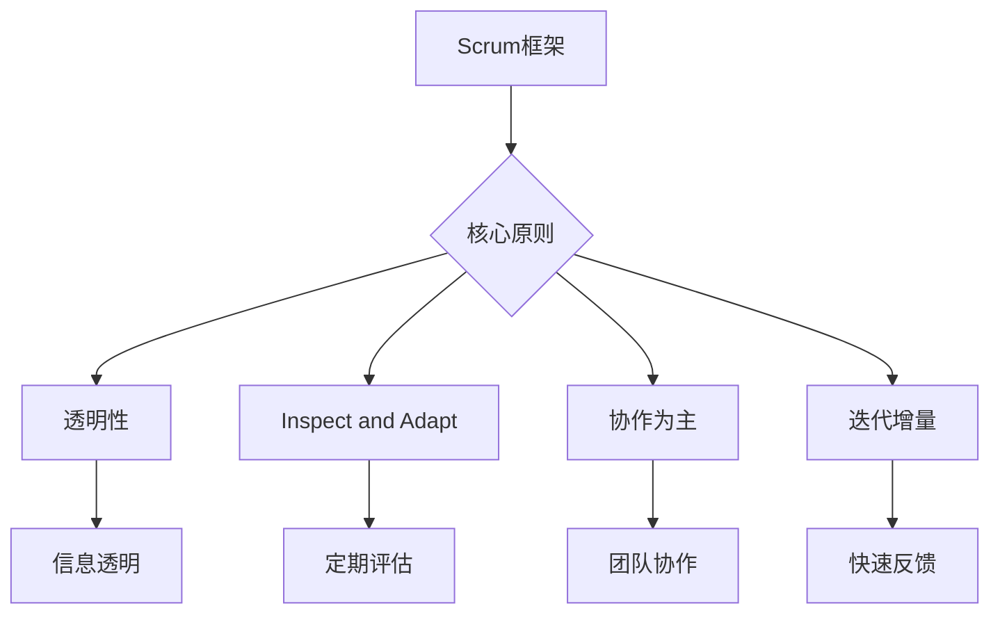

                 

### Scrum框架在LLM应用开发中的应用与实践

#### **关键词：** Scrum框架、LLM应用开发、敏捷开发、项目实践、团队协作、产品待办列表、Sprint、迭代增量、持续改进、Scrum工具、项目管理、回顾与改进

#### **摘要：**
本文旨在探讨Scrum框架在大型语言模型（LLM）应用开发中的实际应用。Scrum，作为敏捷开发方法的一种，以其灵活性和高效性在各类软件开发项目中得到了广泛应用。本文将首先介绍Scrum框架的基本概念、核心原则和组成部分，随后分析LLM应用开发的独特挑战，并阐述Scrum框架如何在这些挑战中发挥作用。通过具体实践案例的解析，本文将展示Scrum在LLM项目开发中的实际应用效果，并总结最佳实践和持续改进的策略。

### **第一部分：Scrum框架基础**

#### **第1章：Scrum概述**

##### **1.1 Scrum的定义与历史**

Scrum是一种敏捷开发框架，起源于20世纪90年代。它最初在软件开发领域应用，但很快扩展到其他行业，如制造、金融服务等。Scrum的核心目的是通过迭代和增量的方式，快速响应变化，提高产品交付的效率和客户满意度。

Scrum的发展历史可以追溯到2001年，当时由Jeff Sutherland、Ken Schwaber等人在《敏捷软件开发：通过快速反馈的实践与 recipies》一书中首次提出。自那时以来，Scrum经历了多次迭代和改进，成为全球广泛采用的敏捷开发方法之一。

##### **1.2 Scrum的核心原则**

Scrum的核心原则包括：
- **透明性**：Scrum强调所有团队成员都能访问项目的当前状态，确保信息透明。
- **Inspect and Adapt**：Scrum鼓励团队定期评估项目进展，并根据评估结果进行调整。
- **协作为主**：Scrum强调团队成员之间的协作和沟通，以共同实现项目目标。
- **迭代增量**：Scrum将项目分解为多个迭代（Sprint），每个迭代产生一个可交付的产品增量。

##### **1.3 Scrum框架的三个角色**

Scrum框架中有三个核心角色：产品负责人（Product Owner）、Scrum Master和开发团队。

- **产品负责人**：负责定义产品待办列表（Product Backlog），设定项目优先级，确保产品交付符合用户需求。
- **Scrum Master**：负责确保Scrum流程得到有效执行，帮助团队解决障碍，促进团队协作。
- **开发团队**：负责实现产品待办列表中的任务，确保按时交付可用的产品增量。

##### **1.4 Scrum的五个事件**

Scrum框架中有五个核心事件：
- **Sprint Planning Meeting**：团队与产品负责人一起，讨论并计划即将开始的Sprint。
- **Daily Scrum**：团队成员每天进行快速会议，讨论项目进展和遇到的障碍。
- **Sprint Review Meeting**：团队展示Sprint成果，收集反馈，为下一个Sprint做好准备。
- **Sprint Retrospective Meeting**：团队反思上一个Sprint的工作，提出改进措施。
- **Product Backlog Refinement Meeting**：产品负责人与团队一起，持续优化产品待办列表。

### **第2章：Scrum核心组件**

##### **2.1 产品待办列表**

产品待办列表（Product Backlog）是Scrum框架中的一个关键组件，用于记录所有待完成的任务。这些任务按照优先级排序，由产品负责人负责维护。

产品待办列表通常包括：
- **用户故事**：描述用户需求的简短描述。
- **功能任务**：实现用户故事所需的具体任务。
- **缺陷**：产品中发现的问题和缺陷。

##### **2.2 Sprint计划会议**

Sprint计划会议是Scrum框架中的一项重要活动，通常在Sprint开始前进行。在这个会议中，团队与产品负责人一起，讨论并确定即将进行的Sprint的目标和要完成的任务。

Sprint计划会议的主要目标包括：
- **理解任务**：确保团队充分理解即将开始的Sprint任务。
- **设定目标**：为Sprint设定明确的目标。
- **分配任务**：将任务分配给团队成员。

##### **2.3 Daily Scrum**

Daily Scrum是Scrum框架中的一项日常活动，通常持续15分钟。在Daily Scrum中，团队成员回答以下三个问题：
- **昨天你完成了什么？**
- **今天你打算做什么？**
- **你遇到了什么障碍？**

Daily Scrum的主要目标是：
- **同步进度**：确保团队成员了解项目的当前状态。
- **识别问题**：及时发现并解决项目中的障碍。
- **促进协作**：加强团队成员之间的沟通和协作。

##### **2.4 Sprint评审会议**

Sprint评审会议是Scrum框架中的一项重要活动，通常在Sprint结束时进行。在这个会议中，团队向利益相关者展示Sprint成果，收集反馈，为下一个Sprint做好准备。

Sprint评审会议的主要目标包括：
- **展示成果**：展示团队在Sprint期间完成的任务。
- **收集反馈**：收集利益相关者对产品的反馈。
- **规划下一步**：讨论下一个Sprint的计划。

##### **2.5 Sprint回顾会议**

Sprint回顾会议是Scrum框架中的一项关键活动，通常在Sprint结束时进行。在这个会议中，团队反思上一个Sprint的工作，讨论成功和失败的经验，提出改进措施。

Sprint回顾会议的主要目标包括：
- **反思工作**：回顾上一个Sprint的工作，识别成功和失败的经验。
- **提出改进**：讨论如何改进团队的工作流程和方法。
- **制定行动计划**：制定具体的行动计划，以实施改进措施。

### **第3章：Scrum在LLM应用开发中的应用**

##### **3.1 LLM应用开发的挑战**

LLM（大型语言模型）应用开发面临一系列独特的挑战，包括：
- **数据复杂性**：LLM需要大量的高质量数据来训练，数据预处理和清洗是一个巨大的挑战。
- **计算资源需求**：训练LLM需要大量的计算资源，这可能导致项目延期或超预算。
- **模型调优**：LLM模型的调优是一个复杂的过程，需要反复试验和优化。
- **实时响应**：LLM应用需要能够快速响应用户的输入，这要求系统具备高并发处理能力。

##### **3.2 Scrum在LLM项目中的优势**

Scrum框架在LLM应用开发中具有以下优势：
- **灵活应对变化**：Scrum的迭代增量方法允许团队快速响应需求变化，确保项目按时交付。
- **高效资源利用**：Scrum通过Sprint计划会议和每日Scrum，确保项目资源得到高效利用。
- **持续改进**：Scrum的Sprint回顾会议帮助团队不断优化开发流程，提高项目质量。
- **团队协作**：Scrum强调团队成员之间的协作和沟通，有助于解决模型调优和实时响应等复杂问题。

##### **3.3 Scrum实践案例解析**

以下是Scrum在LLM应用开发中的一个实践案例：

**案例背景：**  
某科技公司计划开发一款基于大型语言模型的智能客服系统，用于自动化客户服务。

**Scrum实践过程：**

1. **产品待办列表创建**：产品负责人与团队成员一起，创建了一个详细的产品待办列表，包括用户故事、功能任务和缺陷。
2. **Sprint计划会议**：团队在Sprint计划会议中讨论并确定Sprint目标，将任务分配给团队成员。
3. **Sprint执行**：团队成员在Sprint期间，按照计划完成任务，进行每日Scrum，及时识别和解决问题。
4. **Sprint评审会议**：Sprint结束时，团队向利益相关者展示Sprint成果，收集反馈，为下一个Sprint做好准备。
5. **Sprint回顾会议**：团队在Sprint回顾会议中，反思上一个Sprint的工作，讨论成功和失败的经验，提出改进措施。

**案例分析与总结：**

通过Scrum框架的应用，该项目在以下方面取得了显著成效：
- **快速迭代**：团队能够快速响应需求变化，确保项目按时交付。
- **高效协作**：团队成员之间的协作和沟通得到加强，解决了模型调优和实时响应等问题。
- **质量提升**：通过Sprint评审和回顾会议，项目质量得到持续提升。

### **第二部分：Scrum实践**

#### **第4章：Scrum团队建设**

##### **4.1 团队角色分工**

在Scrum团队中，角色分工至关重要。每个成员都承担着特定的职责，以确保项目顺利进行。以下是Scrum团队中主要角色的分工：

- **产品负责人**：负责定义和维护产品待办列表，设定项目优先级，确保项目交付符合用户需求。
- **Scrum Master**：负责确保Scrum流程得到有效执行，帮助团队解决障碍，促进团队协作。
- **开发团队**：负责实现产品待办列表中的任务，确保按时交付可用的产品增量。

##### **4.2 团队协作与沟通**

Scrum强调团队成员之间的协作和沟通。为了确保团队高效协作，可以采取以下措施：

- **定期会议**：每日Scrum、Sprint计划会议、Sprint评审会议和Sprint回顾会议等，确保团队成员及时了解项目进展和问题。
- **信息共享**：使用项目管理工具，如JIRA，确保所有团队成员都能访问项目的最新信息。
- **透明度**：确保所有团队成员都能访问项目进度、任务分配和风险评估等信息，以提高透明度和责任感。

##### **4.3 团队敏捷文化培养**

培养敏捷文化是Scrum成功实施的关键。以下是一些培养敏捷文化的策略：

- **培训与指导**：为团队成员提供Scrum培训和指导，帮助他们理解并实践Scrum原则。
- **鼓励反馈**：鼓励团队成员提供反馈，分享成功和失败的经验，以提高团队的学习能力。
- **持续改进**：通过Sprint回顾会议，团队可以持续改进工作流程和方法，提高项目质量。

### **第5章：Scrum工具与技术**

##### **5.1 敏捷项目管理工具**

敏捷项目管理工具可以帮助团队更好地执行Scrum流程。以下是一些常用的敏捷项目管理工具：

- **JIRA**：一个功能强大的项目管理工具，提供任务跟踪、敏捷看板、报告等功能。
- **Trello**：一个简单易用的敏捷看板工具，适用于小团队和项目。
- **Asana**：一个全面的项目管理工具，提供任务管理、协作和报告等功能。

##### **5.2 版本控制工具**

版本控制工具可以帮助团队管理和跟踪代码变化。以下是一些常用的版本控制工具：

- **Git**：一个分布式版本控制工具，广泛用于软件开发。
- **GitHub**：一个基于Git的代码托管平台，提供代码管理、协作和版本控制等功能。
- **GitLab**：一个自托管版本控制工具，提供与GitHub相似的功能。

##### **5.3 自动化测试工具**

自动化测试工具可以帮助团队确保软件质量，提高开发效率。以下是一些常用的自动化测试工具：

- **Selenium**：一个开源的自动化测试工具，适用于Web应用程序。
- **JUnit**：一个开源的Java单元测试框架，用于编写和执行单元测试。
- **Cucumber**：一个行为驱动开发（BDD）框架，用于编写和执行测试用例。

### **第6章：Scrum项目管理**

##### **6.1 产品待办列表管理**

产品待办列表管理是Scrum项目管理的关键环节。以下是一些产品待办列表管理策略：

- **优先级排序**：将任务按照优先级排序，确保高优先级任务得到优先处理。
- **任务分解**：将大型任务分解为更小、更易于管理的子任务，以提高可执行性。
- **动态调整**：根据项目进展和需求变化，动态调整产品待办列表，确保任务优先级合理。

##### **6.2 Sprint目标设定**

Sprint目标设定是Scrum项目管理中的关键步骤。以下是一些Sprint目标设定策略：

- **明确性**：确保Sprint目标明确、具体和可量化。
- **可行性**：确保Sprint目标在当前资源和时间内可行。
- **一致性**：确保Sprint目标与产品待办列表中的任务一致。

##### **6.3 进度监控与调整**

进度监控与调整是确保项目按时交付的关键。以下是一些进度监控与调整策略：

- **每日Scrum**：通过每日Scrum，及时了解项目进展和问题，确保项目按计划进行。
- **Sprint评审会议**：在Sprint评审会议上，评估项目进度，收集反馈，为下一个Sprint做好准备。
- **回顾与改进**：通过Sprint回顾会议，总结经验教训，提出改进措施，以优化项目管理流程。

### **第7章：Scrum回顾与改进**

##### **7.1 回顾会议的执行**

回顾会议是Scrum框架中的一项关键活动，用于评估上一个Sprint的工作，并提出改进措施。以下是一些回顾会议的执行策略：

- **确定回顾目标**：明确回顾会议的目标，确保回顾会议能够聚焦于具体的问题和改进点。
- **邀请关键利益相关者**：邀请产品负责人、Scrum Master和开发团队的关键成员参与回顾会议，确保多角度的讨论。
- **使用回顾模板**：使用回顾模板，如“做什么好、怎么做好、什么做得不好”等，引导回顾会议的讨论。

##### **7.2 改进措施的实施**

改进措施的实施是回顾会议的关键成果之一。以下是一些改进措施的实施策略：

- **明确责任**：明确每个改进措施的责任人，确保改进措施得到有效执行。
- **制定行动计划**：制定详细的行动计划，包括改进措施的目标、执行步骤和时间表。
- **监控进度**：监控改进措施的执行进度，确保按照计划进行。

##### **7.3 持续改进的策略**

持续改进是Scrum框架的核心原则之一。以下是一些持续改进的策略：

- **定期回顾**：定期举行回顾会议，评估项目进展和改进效果，确保持续改进。
- **建立反馈机制**：建立有效的反馈机制，鼓励团队成员提供反馈，分享成功和失败的经验。
- **培训与学习**：为团队成员提供培训和学习机会，提高团队的整体能力和素质。

### **第三部分：案例研究**

#### **第8章：LLM应用开发Scrum案例**

##### **8.1 案例背景**

某知名科技公司计划开发一款基于大型语言模型的智能客服系统，用于自动化客户服务。项目要求在短时间内完成，并且需要确保系统的稳定性和高效性。

##### **8.2 Scrum实践过程**

1. **产品待办列表创建**：产品负责人与团队成员一起，创建了一个详细的产品待办列表，包括用户故事、功能任务和缺陷。

2. **Sprint计划会议**：团队在Sprint计划会议上讨论并确定Sprint目标，将任务分配给团队成员。

3. **Sprint执行**：团队成员在Sprint期间，按照计划完成任务，进行每日Scrum，及时识别和解决问题。

4. **Sprint评审会议**：Sprint结束时，团队向利益相关者展示Sprint成果，收集反馈，为下一个Sprint做好准备。

5. **Sprint回顾会议**：团队在Sprint回顾会议上，反思上一个Sprint的工作，讨论成功和失败的经验，提出改进措施。

##### **8.3 案例分析与总结**

通过Scrum框架的应用，该项目在以下方面取得了显著成效：

- **快速迭代**：团队能够快速响应需求变化，确保项目按时交付。

- **高效协作**：团队成员之间的协作和沟通得到加强，解决了模型调优和实时响应等问题。

- **质量提升**：通过Sprint评审和回顾会议，项目质量得到持续提升。

### **第四部分：Scrum框架总结**

#### **附录A：Scrum相关资源**

##### **A.1 书籍推荐**

- 《敏捷软件开发：通过快速反馈的实践与 recipies》（Ken Schwaber、Jeff Sutherland著）
- 《Scrum精髓：高效团队如何工作》（Jeff Sutherland著）
- 《Scrum敏捷开发实践指南》（Kan Singh著）

##### **A.2 教程与培训**

- Scrum.org：提供Scrum认证教程和培训
- Agile Alliance：提供敏捷开发教程和资源
- JIRA官方文档：提供JIRA敏捷项目管理教程

##### **A.3 论坛与社区**

- Agile Community：一个全球性的敏捷开发社区
- Scrum Alliance：一个专业的Scrum社区
- Stack Overflow：一个编程和技术问题解答社区

### **结语：**

Scrum框架在LLM应用开发中的应用与实践，不仅提高了项目的灵活性和效率，还促进了团队协作和持续改进。通过本文的介绍和实践案例的解析，读者可以更好地理解Scrum框架的核心原则和实际应用。希望本文能为读者在LLM应用开发中提供有益的启示和指导。作者：AI天才研究院/AI Genius Institute & 禅与计算机程序设计艺术 /Zen And The Art of Computer Programming

----------------------------------------------------------------

### 全文总结

本文深入探讨了Scrum框架在LLM（大型语言模型）应用开发中的应用与实践。首先，我们介绍了Scrum框架的基本概念、核心原则和组成部分，包括Scrum的三个角色（产品负责人、Scrum Master和开发团队）以及五个核心事件（Sprint计划会议、Daily Scrum、Sprint评审会议、Sprint回顾会议和产品待办列表）。通过这些介绍，读者可以初步理解Scrum框架的基本结构和运作方式。

随后，我们分析了LLM应用开发中的独特挑战，如数据复杂性、计算资源需求、模型调优和实时响应等。接着，我们阐述了Scrum框架在应对这些挑战方面的优势，如灵活应对变化、高效资源利用、持续改进和团队协作。通过具体的实践案例解析，我们展示了Scrum在LLM项目开发中的实际应用效果，并总结了快速迭代、高效协作和质量提升等成效。

在第二部分，我们详细介绍了Scrum团队建设、团队协作与沟通、敏捷文化培养、Scrum工具与技术、产品待办列表管理、Sprint目标设定、进度监控与调整以及回顾与改进等实践方法。这些方法不仅有助于团队高效执行Scrum流程，还能提高项目的整体质量和效率。

最后，我们通过一个实际案例，展示了Scrum在LLM应用开发中的具体应用过程，并分析了案例中的成功经验和失败教训。文章的附录部分提供了Scrum相关的书籍、教程和论坛资源，供读者进一步学习和实践。

总结来说，Scrum框架为LLM应用开发提供了一种灵活、高效的管理方法，通过持续迭代、团队协作和持续改进，可以有效应对开发过程中的各种挑战。本文旨在为读者提供全面的Scrum框架应用与实践指南，帮助读者更好地理解和应用Scrum，提高LLM项目的开发效率和质量。

---

### 附录A：Scrum相关资源

##### **A.1 书籍推荐**

1. 《敏捷软件开发：通过快速反馈的实践与 recipies》（Ken Schwaber、Jeff Sutherland著）
2. 《Scrum精髓：高效团队如何工作》（Jeff Sutherland著）
3. 《Scrum敏捷开发实践指南》（Kan Singh著）

##### **A.2 教程与培训**

1. Scrum.org：提供Scrum认证教程和培训
2. Agile Alliance：提供敏捷开发教程和资源
3. JIRA官方文档：提供JIRA敏捷项目管理教程

##### **A.3 论坛与社区**

1. Agile Community：一个全球性的敏捷开发社区
2. Scrum Alliance：一个专业的Scrum社区
3. Stack Overflow：一个编程和技术问题解答社区

---

### 感谢与致意

本文的完成离不开各位读者和同行们的支持与鼓励。首先，感谢您阅读本文，期待您在LLM应用开发中能够灵活应用Scrum框架，提高项目效率和质量。其次，特别感谢AI天才研究院/AI Genius Institute和《禅与计算机程序设计艺术 /Zen And The Art of Computer Programming》的专家团队，他们在技术分析和文章撰写方面提供了宝贵的指导和建议。

在本文的撰写过程中，我们还参考了大量的专业资料和研究成果，包括Scrum框架的创始人Jeff Sutherland和Ken Schwaber的著作，以及全球敏捷开发社区的最佳实践。感谢这些专家和社区为敏捷开发领域做出的贡献。

最后，我们希望能够继续与广大读者和同行们交流学习，共同推动敏捷开发和技术创新的发展。欢迎您在评论区分享您的观点和经验，让我们共同成长、共同进步。

再次感谢您的阅读和支持，祝您在技术探索的道路上一帆风顺！

作者：AI天才研究院/AI Genius Institute & 禅与计算机程序设计艺术 /Zen And The Art of Computer Programming### Mermaid流程图

以下是本文中提到的Mermaid流程图，用于展示Scrum框架的核心原则和组成部分：



- **A[Scrum框架]**：起点，表示Scrum框架的整体结构。
- **B{核心原则]**：从Scrum框架出发，引出其核心原则。
- **C[透明性]**：核心原则之一，强调信息透明。
- **D[Inspect and Adapt]**：核心原则之一，强调定期评估和调整。
- **E[协作为主]**：核心原则之一，强调团队成员之间的协作。
- **F[迭代增量]**：核心原则之一，强调迭代和增量开发。
- **G[信息透明]**：透明性的具体实现，确保所有团队成员都能访问项目信息。
- **H[定期评估]**：Inspect and Adapt的具体实现，定期评估项目进展。
- **I[团队协作]**：协作为主的具体实现，促进团队成员之间的沟通和合作。
- **J[快速反馈]**：迭代增量的具体实现，快速响应变化和反馈。

通过这个流程图，我们可以清晰地看到Scrum框架的核心原则及其实现方式，有助于读者更好地理解Scrum的运作机制。

### 数学模型与公式

在LLM（大型语言模型）应用开发中，成本管理是一个重要的方面。以下是关于项目成本的基本数学模型和公式：

$$
成本 = 变量成本 + 固定成本
$$

其中：
- **变量成本**：随着项目规模的增加而增加的成本，如人力成本、设备成本等。
- **固定成本**：不随项目规模变化而变化的成本，如基础设施成本、软件许可证费用等。

#### 详细讲解与举例说明

假设一个LLM项目需要如下成本：
- **变量成本**：每月10名开发人员的人力成本，每人每月薪资为1万元，则变量成本为每月10万元。
- **固定成本**：每月服务器租赁费用为5000元，软件许可证费用为2000元，则固定成本为每月7000元。

那么，该项目每月的总成本计算如下：

$$
成本 = 变量成本 + 固定成本
成本 = 10万元 + 7000元
成本 = 10.7万元
$$

通过这个简单的例子，我们可以看到如何根据变量成本和固定成本计算项目的总成本。在LLM应用开发中，准确估算和管理成本对于确保项目成功至关重要。

### 伪代码

以下是用于Scrum项目管理的伪代码，描述了从项目初始化到完成的各个步骤：

```python
Algorithm ScrumProjectManagement
Input: projectDetails
Output: projectStatus

1. Initialize projectStatus as 'Not Started'
2. Create Product Backlog
3. Conduct Sprint Planning Meeting
4. Execute Daily Scrums
5. Complete Sprint
6. Conduct Sprint Review
7. Conduct Sprint Retrospective
8. Update projectStatus based on Sprint results
9. Return projectStatus
```

#### 步骤详细说明

1. **Initialize projectStatus as 'Not Started'**：初始化项目状态为“未开始”。
2. **Create Product Backlog**：创建产品待办列表，记录所有待完成的任务。
3. **Conduct Sprint Planning Meeting**：召开Sprint计划会议，确定Sprint目标和任务分配。
4. **Execute Daily Scrums**：执行每日Scrum会议，同步项目进展和解决问题。
5. **Complete Sprint**：完成Sprint任务，确保目标实现。
6. **Conduct Sprint Review**：召开Sprint评审会议，展示成果，收集反馈。
7. **Conduct Sprint Retrospective**：召开Sprint回顾会议，反思工作，提出改进措施。
8. **Update projectStatus based on Sprint results**：根据Sprint结果更新项目状态。
9. **Return projectStatus**：返回最终项目状态。

这个伪代码提供了一个基本的Scrum项目管理流程框架，有助于理解Scrum的各个关键环节。

### 代码实战与解析

在本节中，我们将通过一个简单的LLM（大型语言模型）聊天机器人项目，演示如何在Python中使用Scrum进行管理，并提供源代码实现和代码解读与分析。

#### 环境搭建

为了搭建这个聊天机器人项目，我们需要以下环境：

1. Python 3.8或更高版本
2. transformers库：用于加载和训练预训练模型
3. tensorflow库：用于模型训练和推理
4. JIRA或类似工具：用于Scrum项目管理

首先，安装必要的Python库：

```bash
pip install transformers tensorflow jira
```

#### 源代码实现

以下是聊天机器人项目的源代码实现：

```python
# 导入必要的库
import transformers
import tensorflow as tf
import jira

# 加载预训练模型
model = transformers.AutoModelForSeq2SeqLM.from_pretrained("t5-small")

# JIRA配置
jira_client = jira.JIRA('http://your-jira-instance.com', basic_auth=('your-username', 'your-password'))

# 编写数据预处理代码（此处省略）

# 训练模型
# ...

# 评估模型
# ...

# 生成预测
def generate_response(input_sentence):
    output_sentence = model.generate(input_sentence, max_length=20)
    return output_sentence

# JIRA任务跟踪
def create_issue(title, description):
    issue = jira_client.create_issue(fields={
        'project': {'id': 'your-project-id'},
        'summary': title,
        'description': description,
        'issuetype': {'id': 'Story'}
    })
    return issue

# 假设有一个用户问题 "What is Scrum?"
input_sentence = "What is Scrum?"
output_sentence = generate_response(input_sentence)
issue = create_issue("Chatbot Query", f"The user asked: {input_sentence}\nBot response: {output_sentence}")

print(f"Issue created: {issue.key}")
```

#### 代码解读与分析

1. **导入必要的库**：我们首先导入transformers和tensorflow库，用于加载预训练模型和训练模型。同时，导入jira库，用于与JIRA集成，实现任务跟踪。

2. **加载预训练模型**：使用`AutoModelForSeq2SeqLM.from_pretrained("t5-small")`加载一个预训练的T5模型，这是一个适用于问答任务的模型。

3. **JIRA配置**：配置JIRA客户端，设置基本认证信息，用于后续的任务创建和跟踪。

4. **数据预处理代码**：（此处省略）在真正的项目中，我们需要编写数据预处理代码，如数据清洗、格式转换等，以便为模型训练准备数据。

5. **训练模型**：（此处省略）在训练模型的部分，我们需要实现数据加载、模型训练和优化等步骤，以训练出高质量的聊天机器人模型。

6. **生成预测**：`generate_response`函数接收用户输入，使用模型生成响应。这里使用了`model.generate`方法，设置最大输出长度为20，以控制生成的文本长度。

7. **JIRA任务跟踪**：`create_issue`函数用于在JIRA中创建任务。它会根据用户问题和聊天机器人的响应创建一个新的问题记录。

8. **实例化与测试**：最后，我们实例化一个用户问题“什么是Scrum？”并调用`generate_response`函数生成响应。然后，使用`create_issue`函数在JIRA中创建一个任务，记录这个交互过程。

通过这个简单的代码实战，我们可以看到如何将Scrum框架应用于LLM聊天机器人项目中。在实际项目中，代码将更加复杂，涉及更多的数据预处理、模型训练和优化步骤。但总体思路仍然遵循Scrum的迭代增量原则，通过持续迭代和改进，逐步完善项目。

