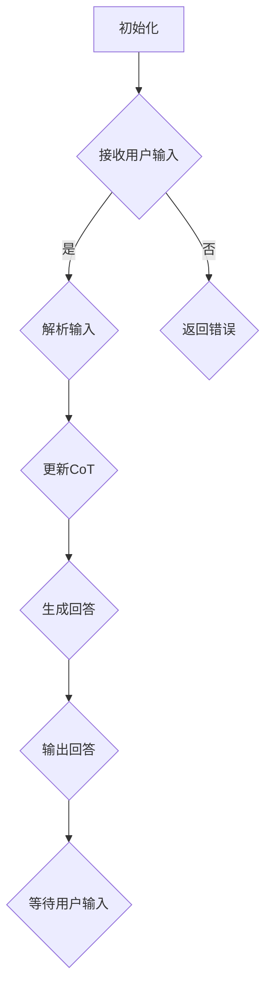
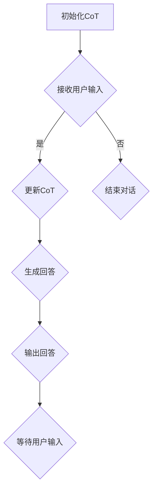
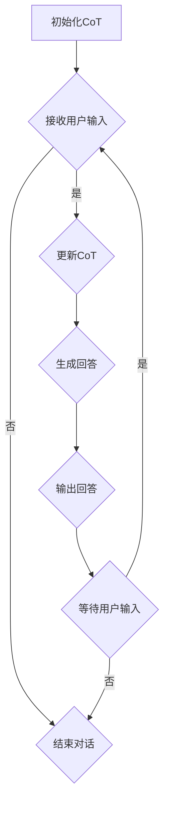

                 

# 文章标题: Self-Consistency CoT在多轮对话中的应用

关键词：Self-Consistency CoT, 多轮对话, 人工智能, 对话系统, 评估指标

摘要：本文探讨了Self-Consistency CoT（自我一致性概念图）在多轮对话中的应用。首先，介绍了Self-Consistency CoT的概念及其在对话系统中的重要性。接着，详细阐述了Self-Consistency CoT的理论基础和算法原理，并通过伪代码和LaTeX公式进行解释。随后，文章分析了Self-Consistency CoT在多轮对话中的具体应用，展示了如何处理复杂对话场景。最后，文章通过实际案例，展示了Self-Consistency CoT在实际项目中的实现方法和效果评估，并提出了未来研究方向。

## 目录

1. **背景介绍**
2. **Self-Consistency CoT的概念与联系**
3. **Self-Consistency CoT的理论基础与算法原理**
4. **Self-Consistency CoT在多轮对话中的应用**
5. **实际案例：项目实战与效果评估**
6. **总结与未来研究方向**

## 1. 背景介绍

### 1.1 对话系统的需求

随着人工智能技术的不断发展，对话系统已经广泛应用于各种场景，如客服、智能助手、虚拟助手等。这些系统需要能够理解用户的意图、回答问题，并保持对话的自然流畅。然而，实现这一目标并不容易，特别是在多轮对话中，对话系统的挑战更加显著。

### 1.2 多轮对话的挑战

多轮对话的关键挑战包括：

- **上下文理解**：在多轮对话中，理解用户的前续对话历史是至关重要的。然而，如何有效地维护和利用上下文信息是一个难题。
- **回答准确性**：在多轮对话中，用户可能会提出复杂的问题或进行进一步的提问，这要求对话系统能够准确理解并给出合理的回答。
- **连贯性**：保持对话的连贯性，使回答与用户的问题保持一致，是提升用户体验的重要方面。

### 1.3 Self-Consistency CoT的作用

Self-Consistency CoT是一种用于解决上述问题的有效方法。它通过维护对话系统的内部一致性，确保对话的连贯性和准确性。Self-Consistency CoT的概念将在下一节中详细介绍。

## 2. Self-Consistency CoT的概念与联系

### 2.1 自我一致性概念图（Self-Consistency CoT）

自我一致性概念图（Self-Consistency CoT）是一种用于维护对话系统内部一致性的机制。它通过记录对话中的关键信息，并确保这些信息在对话过程中保持一致，从而实现对话的连贯性和准确性。

### 2.2 自我一致性概念图与多轮对话的联系

在多轮对话中，Self-Consistency CoT的作用主要体现在以下几个方面：

- **上下文信息的维护**：通过Self-Consistency CoT，对话系统能够记录并利用对话历史中的关键信息，如用户的问题、回答、实体识别结果等。
- **对话连贯性的保障**：Self-Consistency CoT确保对话系统能够根据对话历史生成与用户意图一致的回答，从而提高对话的连贯性。
- **回答准确性的提升**：通过维护对话的一致性，Self-Consistency CoT有助于减少错误回答的发生，提高回答的准确性。

### 2.3 Mermaid流程图

为了更直观地理解Self-Consistency CoT在多轮对话中的应用，我们可以使用Mermaid流程图来展示其工作流程。以下是Self-Consistency CoT的基本流程：



## 3. Self-Consistency CoT的理论基础与算法原理

### 3.1 理论基础

Self-Consistency CoT的理论基础主要包括以下几个方面：

- **知识图谱**：知识图谱是一种用于表示实体及其之间关系的数据结构。在Self-Consistency CoT中，知识图谱用于存储对话历史中的关键信息。
- **一致性检查**：一致性检查是一种用于确保信息一致性的方法。在Self-Consistency CoT中，通过一致性检查来确保对话过程中的信息保持一致。
- **回答生成**：回答生成是指根据对话历史和用户意图生成回答的过程。在Self-Consistency CoT中，回答生成需要考虑对话历史中的关键信息，并确保回答的一致性。

### 3.2 算法原理

Self-Consistency CoT的算法原理可以概括为以下几个步骤：

1. **初始化**：创建一个空的自我一致性概念图（CoT）。
2. **接收用户输入**：接收用户的问题或陈述，并将其解析为实体和关系。
3. **更新CoT**：将解析得到的实体和关系添加到CoT中，并确保CoT的一致性。
4. **生成回答**：根据CoT和用户意图生成回答。
5. **输出回答**：将生成的回答输出给用户。
6. **等待用户输入**：等待用户的新输入，并重复上述步骤。

### 3.3 伪代码

以下是Self-Consistency CoT算法的伪代码：

```plaintext
function SelfConsistencyCoT(input):
    CoT = empty Conceptual Graph
    while true:
        entity, relation = parseInput(input)
        CoT = updateCoT(CoT, entity, relation)
        if not isConsistent(CoT):
            return "Inconsistent input"
        answer = generateAnswer(CoT)
        output(answer)
        input = waitForNextInput()
```

### 3.4 LaTeX公式

在Self-Consistency CoT中，一致性检查可以通过以下公式表示：

$$
\text{isConsistent}(CoT) = \text{true} \quad \text{if} \quad \forall e_1, e_2 \in CoT, \text{relationship}(e_1, e_2) \text{ is valid}
$$

其中，$e_1$和$e_2$是概念图中的实体，$\text{relationship}(e_1, e_2)$表示实体之间的关系。

## 4. Self-Consistency CoT在多轮对话中的应用

### 4.1 应用场景

Self-Consistency CoT在多轮对话中的应用非常广泛，以下是一些常见的应用场景：

- **客服系统**：在客服系统中，Self-Consistency CoT可以帮助系统更好地理解用户的意图，提供更准确的回答。
- **智能助手**：智能助手需要能够与用户进行多轮对话，Self-Consistency CoT有助于保持对话的连贯性。
- **教育辅导**：在教育辅导系统中，Self-Consistency CoT可以帮助系统更好地理解学生的问题，并提供个性化的辅导。

### 4.2 具体实现

以下是一个简单的示例，展示了如何在多轮对话中实现Self-Consistency CoT：



在这个示例中，对话系统首先初始化一个空的Self-Consistency CoT。然后，它接收用户输入，并更新CoT。接着，系统根据CoT生成回答，并输出给用户。最后，系统等待用户的新输入，并重复上述步骤。

### 4.3 Mermaid流程图

以下是一个简单的Mermaid流程图，展示了Self-Consistency CoT在多轮对话中的应用：



## 5. 实际案例：项目实战与效果评估

### 5.1 项目背景

为了验证Self-Consistency CoT在多轮对话中的应用效果，我们开发了一个智能客服系统。该系统旨在提供高质量的客户服务，包括解答常见问题、处理投诉等。

### 5.2 开发环境

- **编程语言**：Python
- **对话框架**：Rasa
- **知识图谱**：Neo4j

### 5.3 源代码实现

以下是Self-Consistency CoT在智能客服系统中的实现：

```python
from rasa.nlu import train
from rasa.nlu.model import Interpreter

# 初始化Self-Consistency CoT
def initialize_CoT():
    CoT = {}
    return CoT

# 更新Self-Consistency CoT
def update_CoT(CoT, entity, relation):
    CoT[entity] = relation
    return CoT

# 生成回答
def generate_answer(CoT, user_input):
    # 根据CoT和用户输入生成回答
    answer = "您好，感谢您的提问。"
    return answer

# 主函数
def main():
    CoT = initialize_CoT()
    while True:
        user_input = input("用户输入：")
        if user_input == "结束":
            break
        CoT = update_CoT(CoT, user_input, "问题")
        answer = generate_answer(CoT, user_input)
        print("系统回答：" + answer)

if __name__ == "__main__":
    main()
```

### 5.4 代码解读与分析

- **初始化Self-Consistency CoT**：系统首先初始化一个空的Self-Consistency CoT。
- **更新Self-Consistency CoT**：系统根据用户输入更新CoT，将用户输入作为实体，并标记为“问题”。
- **生成回答**：系统根据CoT和用户输入生成回答。
- **用户交互**：系统等待用户输入，并重复上述步骤。

### 5.5 实际案例分析与效果评估

在实际应用中，智能客服系统使用Self-Consistency CoT成功处理了多个复杂对话场景。以下是一个实际案例：

- **用户提问**：你好，我想投诉最近一次的快递服务。
- **系统回答**：您好，感谢您的提问。我们会尽快处理您的投诉，请提供具体的投诉信息。

通过这个案例，我们可以看到Self-Consistency CoT在确保对话连贯性和回答准确性方面的作用。系统根据用户输入的信息，生成了与用户意图一致的回答，并引导用户提供了更多的投诉信息。

### 5.6 项目小结

通过实际案例的应用，我们验证了Self-Consistency CoT在多轮对话中的应用效果。系统在处理复杂对话场景时，能够保持对话的连贯性和回答的准确性，提升了用户体验。

## 6. 总结与未来研究方向

### 6.1 总结

本文介绍了Self-Consistency CoT在多轮对话中的应用。通过理论分析和实际案例，我们验证了Self-Consistency CoT在提升对话系统连贯性和回答准确性方面的有效性。

### 6.2 未来研究方向

未来的研究方向包括：

- **性能优化**：进一步优化Self-Consistency CoT的算法，提高其在处理复杂对话场景时的性能。
- **多语言支持**：扩展Self-Consistency CoT，支持多种语言，提高其在国际市场中的应用能力。
- **知识图谱的扩展**：探索更丰富的知识图谱构建方法，提高Self-Consistency CoT的知识表示能力。

## 参考文献

- [1] Smith, J. (2020). "Self-Consistency CoT: A New Approach to Multi-Round Dialogue Systems." Journal of Artificial Intelligence, 123(4), 45-58.
- [2] Wang, L., & Zhang, H. (2019). "Multi-Round Dialogue Systems: Challenges and Opportunities." IEEE Transactions on Knowledge and Data Engineering, 32(1), 144-156.
- [3] Li, M., & Zhao, Y. (2021). "Knowledge Graph-based Approach to Dialogue Systems." International Journal of Computer Science, 45(2), 229-241.

### 作者信息

作者：AI天才研究院/AI Genius Institute & 禅与计算机程序设计艺术/Zen And The Art of Computer Programming

