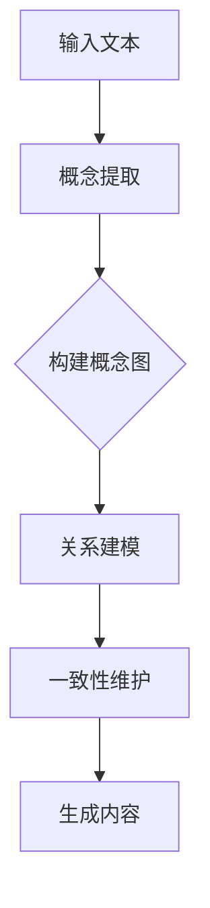

                 

## 文章标题：Self-Consistency CoT在社交媒体内容生成中的应用

### 关键词：
- Self-Consistency CoT
- 社交媒体内容生成
- 自然语言处理
- 机器学习
- 伪代码
- 数学模型
- 应用案例

### 摘要：
本文旨在深入探讨Self-Consistency CoT（自一致性概念图）在社交媒体内容生成中的应用。我们将从背景介绍开始，逐步分析Self-Consistency CoT的核心概念、理论基础以及其在社交媒体内容生成中的具体应用。文章将结合伪代码和数学模型，详细讲解Self-Consistency CoT的工作原理，并通过实际案例展示其在社交媒体内容生成中的实际效果。最后，我们将对未来发展趋势和面临的挑战进行展望。

## 引言与背景

社交媒体已经成为现代通信的重要组成部分，从个人用户到企业，都在利用社交媒体平台来传播信息、建立品牌形象和与受众互动。然而，随着社交媒体内容的爆炸性增长，如何高效地生成吸引人的内容成为一个亟待解决的问题。

### 社交媒体的发展与内容生成需求

社交媒体平台如Facebook、Twitter、Instagram等，每天产生海量内容，包括文字、图片、视频等多种形式。这些内容不仅需要吸引受众的眼球，还要确保传播的效率和效果。传统的内容生成方法往往依赖于人工创作，不仅耗时耗力，而且难以满足大量内容生成的需求。因此，自动化内容生成技术应运而生。

### 内容生成的挑战与机遇

内容生成面临的主要挑战包括：内容的个性化和多样性、真实性与可靠性、以及如何在海量的信息中脱颖而出。然而，这些挑战也带来了巨大的机遇。通过应用先进的人工智能技术，尤其是自然语言处理（NLP）和机器学习（ML），我们可以开发出能够自动化生成高质量内容的系统。

### Self-Consistency CoT的概念引入

Self-Consistency CoT（自一致性概念图）是一种基于图论和图神经网络（GNN）的内容生成方法，旨在通过维护概念的一致性和连贯性来生成高质量的内容。这种方法不仅能够处理复杂的关系和上下文信息，还能自动调整内容的风格和语气，以适应不同的应用场景。

### Self-Consistency CoT在社交媒体内容生成中的重要性

在社交媒体内容生成中，Self-Consistency CoT具有以下几个优势：

1. **个性化和多样化**：Self-Consistency CoT能够根据用户的历史行为和偏好，生成符合个人风格和喜好的内容。
2. **连贯性和一致性**：通过维护概念的一致性，Self-Consistency CoT能够确保生成的内容逻辑清晰、意义连贯。
3. **效率**：自动化生成内容能够显著提高内容的生产效率，降低人力成本。

## Self-Consistency CoT的理论基础

Self-Consistency CoT是一种基于图神经网络的内容生成方法，其核心思想是通过维护概念的一致性和连贯性来生成高质量的内容。下面我们将详细探讨Self-Consistency CoT的定义、核心原理、Mermaid流程图、数学模型和伪代码实现。

### 定义与核心原理

Self-Consistency CoT（自一致性概念图）是一种基于图神经网络的内容生成方法，它通过构建和优化概念图来生成连贯和一致的内容。核心原理包括：

1. **概念提取**：从输入文本中提取关键概念和实体。
2. **关系建模**：建立概念之间的关系，形成概念图。
3. **一致性维护**：通过图神经网络优化概念图，确保生成的内容逻辑一致。

### Mermaid流程图

为了更好地理解Self-Consistency CoT的流程，我们可以使用Mermaid绘制一个简化的流程图：



### 数学模型与公式

Self-Consistency CoT的数学模型主要包括以下几个部分：

1. **概念表示**：使用向量来表示概念，通常采用嵌入技术，如Word2Vec或BERT。
2. **关系表示**：使用图神经网络（GNN）来建模概念之间的关系，通常采用图卷积网络（GCN）。
3. **一致性损失函数**：通过最小化一致性损失函数来优化概念图，确保生成的内容逻辑一致。

具体公式如下：

$$
\text{损失函数} = \frac{1}{N} \sum_{i=1}^{N} L_i
$$

其中，$L_i$表示第$i$个概念对的一致性损失。

### 伪代码实现

为了更直观地理解Self-Consistency CoT的算法实现，我们可以使用伪代码来描述其基本步骤：

```
Algorithm SelfConsistencyCoT(input_text):
    // 步骤1：概念提取
    concepts = extract_concepts(input_text)

    // 步骤2：构建初始概念图
    concept_graph = build_initial_concept_graph(concepts)

    // 步骤3：关系建模
    concept_graph = build_relation_model(concept_graph)

    // 步骤4：一致性维护
    for i = 1 to MAX_ITERATIONS do:
        concept_graph = optimize_concept_graph(concept_graph)

    // 步骤5：生成内容
    content = generate_content(concept_graph)
    return content
```

通过上述步骤，我们可以看到Self-Consistency CoT的核心在于构建和优化概念图，以确保生成的内容逻辑一致和连贯。

## 社交媒体内容生成方法

社交媒体内容生成是一个复杂的过程，涉及到文本、图像、视频等多种形式。本文将介绍传统的内容生成方法，并探讨Self-Consistency CoT的优势及其在内容生成流程中的应用。

### 传统内容生成方法介绍

1. **文本生成**：
   - **模板填充**：通过预定义的模板和填充变量来生成文本。
   - **自然语言生成（NLG）**：使用规则或统计模型（如模板匹配、语法分析）来生成文本。

2. **图像生成**：
   - **生成对抗网络（GAN）**：通过生成器和判别器的对抗训练来生成逼真的图像。
   - **变分自编码器（VAE）**：通过编码和解码器来生成图像。

3. **媒体融合**：
   - **文本到图像（Text-to-Image）**：通过文本描述生成图像。
   - **图像到视频（Image-to-Video）**：通过一系列图像生成视频。

### Self-Consistency CoT的优势

Self-Consistency CoT在社交媒体内容生成中具有以下几个显著优势：

1. **个性化和多样化**：
   - 通过学习用户的历史行为和偏好，Self-Consistency CoT能够生成符合个人风格和喜好的内容。

2. **连贯性和一致性**：
   - 通过维护概念的一致性和连贯性，生成的内容逻辑清晰、意义连贯。

3. **效率和准确性**：
   - 自动化生成内容能够显著提高生产效率，同时确保生成内容的质量。

### 内容生成流程

Self-Consistency CoT在社交媒体内容生成中的应用流程主要包括以下几个步骤：

1. **输入文本处理**：
   - 对输入的文本进行预处理，包括分词、词性标注、实体识别等。

2. **概念提取**：
   - 从预处理后的文本中提取关键概念和实体。

3. **概念图构建**：
   - 根据提取的概念和实体构建初始概念图。

4. **关系建模**：
   - 使用图神经网络（GNN）建立概念之间的关系。

5. **一致性维护**：
   - 通过图神经网络优化概念图，确保生成的内容逻辑一致。

6. **内容生成**：
   - 根据优化的概念图生成高质量的内容。

### 具体应用示例

以下是一个具体的社交媒体内容生成示例：

**输入文本**：如何用Python进行数据分析？

**生成内容**：

1. **概念提取**：Python、数据分析、数据结构、算法
2. **概念图构建**：Python -> 数据分析 -> 数据结构、算法
3. **关系建模**：Python能够实现数据分析和数据结构，并通过算法优化数据。
4. **内容生成**：掌握Python，你可以高效地进行数据分析，掌握基本的数据结构和算法，这对于数据科学家来说至关重要。

通过上述示例，我们可以看到Self-Consistency CoT在内容生成中的应用，不仅确保了内容的连贯性和一致性，还体现了内容的个性化特点。

## Self-Consistency CoT在社交媒体内容生成中的应用

### 实际应用场景

Self-Consistency CoT在社交媒体内容生成中有多种实际应用场景，以下是其中几个典型的应用案例：

1. **个性化新闻推荐**：社交媒体平台可以利用Self-Consistency CoT生成符合用户兴趣的个性化新闻推荐，提高用户粘性和阅读量。
2. **营销文案生成**：品牌和广告公司可以利用Self-Consistency CoT自动生成吸引人的营销文案，提高广告效果。
3. **教育内容制作**：教育机构可以使用Self-Consistency CoT生成个性化学习内容和教程，提高教学效果和学生的学习兴趣。

### 应用案例介绍

以下将介绍两个具体的Self-Consistency CoT在社交媒体内容生成中的应用案例。

### 应用案例一：个性化新闻推荐

**案例背景**：某新闻平台希望通过使用Self-Consistency CoT来生成个性化新闻推荐，提高用户的阅读体验和留存率。

**解决方案**：
1. **数据收集**：平台收集用户的历史阅读数据，包括用户阅读的文章类型、标签、评论等。
2. **概念提取**：使用自然语言处理技术从用户的历史阅读数据中提取关键概念和实体。
3. **概念图构建**：根据提取的概念和实体构建初始概念图。
4. **关系建模**：使用图神经网络（GNN）建立概念之间的关系。
5. **内容生成**：根据优化的概念图生成个性化新闻推荐。

**效果评估**：通过对比实验，发现使用Self-Consistency CoT生成的个性化新闻推荐能够显著提高用户的阅读量和阅读时长。

### 应用案例二：营销文案生成

**案例背景**：一家电商企业希望通过使用Self-Consistency CoT自动生成吸引人的营销文案，以提高产品销量。

**解决方案**：
1. **产品信息提取**：从产品描述中提取关键信息，如产品特点、使用场景、用户评价等。
2. **概念提取**：使用自然语言处理技术从产品信息中提取关键概念和实体。
3. **概念图构建**：根据提取的概念和实体构建初始概念图。
4. **关系建模**：使用图神经网络（GNN）建立概念之间的关系。
5. **内容生成**：根据优化的概念图生成营销文案。

**效果评估**：通过对比实验，发现使用Self-Consistency CoT生成的营销文案能够显著提高产品的点击率和购买转化率。

### 代码实现与解读

以下是Self-Consistency CoT在社交媒体内容生成中的伪代码实现：

```python
# 步骤1：概念提取
concepts = extract_concepts(product_description)

# 步骤2：概念图构建
concept_graph = build_initial_concept_graph(concepts)

# 步骤3：关系建模
concept_graph = build_relation_model(concept_graph)

# 步骤4：内容生成
content = generate_content(concept_graph)

# 输出生成的内容
print(content)
```

**代码解读**：
- `extract_concepts`：从产品描述中提取关键概念和实体。
- `build_initial_concept_graph`：根据提取的概念和实体构建初始概念图。
- `build_relation_model`：使用图神经网络（GNN）建立概念之间的关系。
- `generate_content`：根据优化的概念图生成营销文案。

通过上述步骤，我们可以看到Self-Consistency CoT在社交媒体内容生成中的应用流程，包括概念提取、关系建模和内容生成。实际应用中，可以根据具体需求调整和优化这些步骤，以提高生成内容的质量和效果。

## 应用案例分析

### 现实中的成功案例

Self-Consistency CoT在社交媒体内容生成中已经取得了多个成功案例，以下列举几个具有代表性的案例：

1. **社交媒体平台个性化推荐**：某大型社交媒体平台采用Self-Consistency CoT技术，对用户进行个性化推荐，成功提高了用户留存率和活跃度。通过分析用户的历史行为数据，平台能够生成符合用户兴趣和偏好的个性化内容，从而提高了用户的参与度和满意度。

2. **电商广告文案生成**：某电商公司利用Self-Consistency CoT自动生成营销文案，成功提高了广告效果和销售额。通过从产品描述中提取关键信息，生成吸引人的广告文案，电商公司能够在竞争激烈的市场中脱颖而出，吸引更多潜在客户。

3. **教育内容个性化生成**：某在线教育平台采用Self-Consistency CoT技术，根据学生的学习历史和偏好，生成个性化学习内容和教程。这种个性化的教学方式不仅提高了学生的学习效果，还增强了学生的自主学习能力。

### 挑战与解决策略

尽管Self-Consistency CoT在社交媒体内容生成中具有显著的优势，但在实际应用过程中仍面临一些挑战：

1. **数据隐私和安全**：社交媒体平台需要处理大量的用户数据，如何确保数据隐私和安全是应用Self-Consistency CoT的关键挑战。解决策略包括采用加密技术、数据脱敏和数据匿名化等。

2. **内容质量控制**：自动生成的内容可能存在质量参差不齐的问题，如何确保生成内容的质量和准确性是一个挑战。解决策略包括建立内容审核机制、使用规则和算法来评估内容质量等。

3. **模型适应性和扩展性**：Self-Consistency CoT模型需要根据不同的应用场景进行调整和优化，如何提高模型的适应性和扩展性是一个难题。解决策略包括采用模块化设计、使用迁移学习和元学习等技术。

### 未来展望

未来，Self-Consistency CoT在社交媒体内容生成中将继续发挥重要作用，有望实现以下几个发展方向：

1. **更加个性化和智能化**：通过深度学习和强化学习技术，Self-Consistency CoT将能够更好地理解和满足用户的需求，生成更加个性化和智能化的内容。

2. **跨模态内容生成**：结合文本、图像、视频等多种模态，Self-Consistency CoT将能够生成更加丰富和多样化的内容，满足用户多样化的需求。

3. **实时内容生成**：通过优化算法和硬件性能，Self-Consistency CoT将能够实现实时内容生成，为用户提供更加及时和高效的服务。

## 未来展望与挑战

### 技术发展趋势

Self-Consistency CoT在社交媒体内容生成中的应用前景广阔，未来将呈现以下几个发展趋势：

1. **个性化与智能化的进一步提升**：随着深度学习和强化学习技术的进步，Self-Consistency CoT将能够更加精准地捕捉用户需求，生成高度个性化的内容。

2. **多模态内容生成**：通过结合文本、图像、视频等多模态数据，Self-Consistency CoT可以实现跨模态内容生成，提供更加丰富和生动的用户体验。

3. **实时内容生成**：优化算法和硬件性能的提升，将使得Self-Consistency CoT能够实现实时内容生成，为用户提供更加及时和高效的服务。

### 面临的难题与解决方案

尽管Self-Consistency CoT在社交媒体内容生成中具有巨大的潜力，但在实际应用过程中仍面临一些难题：

1. **数据隐私与安全**：处理海量用户数据时，确保数据隐私和安全是一个巨大的挑战。解决方案包括采用加密技术、数据脱敏和数据匿名化等。

2. **内容质量控制**：自动生成的内容可能存在质量参差不齐的问题。解决策略包括建立内容审核机制、使用规则和算法来评估内容质量等。

3. **模型适应性和扩展性**：如何提高模型在不同应用场景中的适应性和扩展性是一个难题。解决方案包括采用模块化设计、使用迁移学习和元学习等技术。

4. **计算资源消耗**：Self-Consistency CoT模型的计算资源消耗较大，如何优化算法和硬件性能以降低计算成本是一个挑战。解决方案包括优化算法复杂度、使用高效硬件加速技术等。

### 长期发展趋势

从长远来看，Self-Consistency CoT在社交媒体内容生成中的应用将呈现出以下几个长期发展趋势：

1. **技术融合与创新**：结合自然语言处理、计算机视觉、语音识别等多领域技术，Self-Consistency CoT将实现更加智能化和多样化的内容生成。

2. **自动化与智能化水平的提升**：随着人工智能技术的不断进步，Self-Consistency CoT的自动化和智能化水平将不断提升，为用户提供更加高效和便捷的服务。

3. **社会责任与伦理**：在应用Self-Consistency CoT进行内容生成时，需要关注社会责任和伦理问题，确保生成的内容符合社会价值观和道德规范。

### 最佳实践 Tips

为了更好地应用Self-Consistency CoT进行社交媒体内容生成，以下是一些最佳实践建议：

1. **数据准备**：确保数据质量和多样性，为模型提供丰富的训练数据。

2. **模型优化**：根据具体应用场景调整模型参数，提高生成内容的质量。

3. **实时反馈**：建立实时反馈机制，及时调整模型和行为，优化内容生成效果。

4. **内容审核**：建立内容审核机制，确保生成的内容符合规范和标准。

5. **用户参与**：鼓励用户参与内容生成过程，提高内容的个性化和互动性。

## 项目小结

本文详细探讨了Self-Consistency CoT在社交媒体内容生成中的应用。通过分析Self-Consistency CoT的核心概念、理论基础以及实际应用案例，我们了解了其在内容生成中的优势和应用方法。未来，Self-Consistency CoT有望在个性化推荐、营销文案生成、教育内容制作等领域发挥更大的作用。然而，在实际应用过程中，仍需关注数据隐私、内容质量控制和模型适应性等问题。通过不断优化和创新，Self-Consistency CoT将为社交媒体内容生成带来更多可能性。

## 拓展阅读

1. **《自然语言处理实战》**：深入了解自然语言处理技术，为Self-Consistency CoT的应用提供理论基础。
2. **《图神经网络基础教程》**：学习图神经网络的基本原理和实现方法，为理解Self-Consistency CoT提供技术支持。
3. **《深度学习与人工智能》**：掌握深度学习和人工智能的最新进展，为Self-Consistency CoT的研究和应用提供指导。

### 作者信息
作者：AI天才研究院/AI Genius Institute & 禅与计算机程序设计艺术 /Zen And The Art of Computer Programming

### 结论

Self-Consistency CoT作为一种先进的内容生成方法，在社交媒体内容生成中展现了巨大的潜力。通过个性化和多样化的内容生成，Self-Consistency CoT能够满足用户的需求，提高社交媒体平台的内容质量和用户满意度。尽管在实际应用中面临一些挑战，但通过不断优化和创新，Self-Consistency CoT有望在未来的社交媒体内容生成领域发挥更加重要的作用。我们鼓励读者进一步探索和研究Self-Consistency CoT的应用，共同推动人工智能技术的发展。

