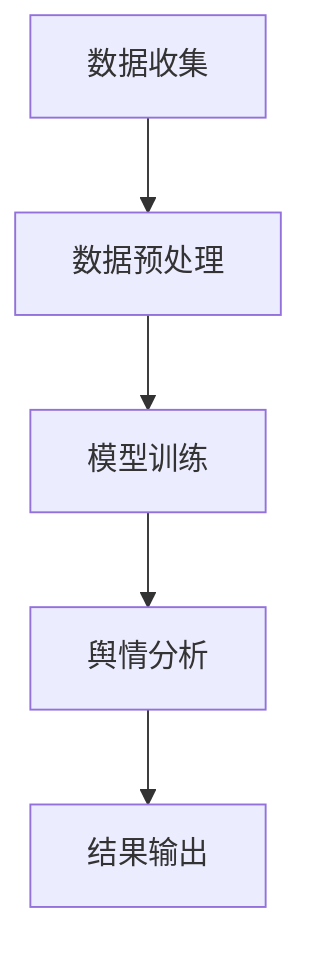
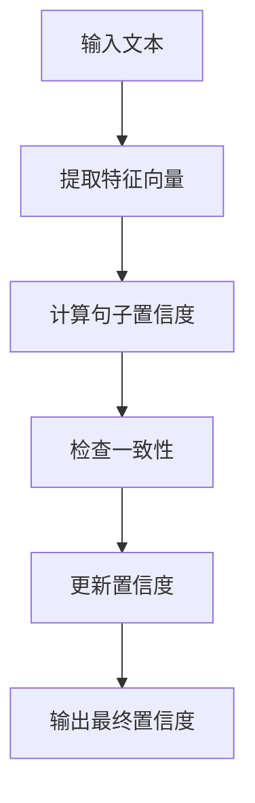

                 

# 文章标题

Self-Consistency CoT在社交媒体舆情分析中的应用

## 关键词

自我一致性置信度、社交媒体舆情分析、算法原理、深度学习、信息提取、数据预处理、模型训练、项目实战、案例分析

## 摘要

本文旨在探讨自我一致性置信度（Self-Consistency Confidence Score，简称Self-Consistency CoT）在社交媒体舆情分析中的应用。通过介绍自我一致性置信度的概念、核心算法原理以及数学模型，本文将详细解释如何利用这一方法分析社交媒体中的舆情信息，并提供一个实际的开发项目和案例。文章还将讨论项目开发中的关键步骤、代码实现以及最佳实践，以帮助读者理解和应用这一技术。

## 1. 背景介绍

### 1.1 社交媒体舆情分析的重要性

随着互联网的迅速发展和社交媒体的普及，人们对信息传播和舆论形成的方式有了更深入的认识。社交媒体平台如Facebook、Twitter、微博等，已成为人们获取信息和表达观点的重要渠道。舆情分析，即分析公众对特定话题或事件的态度和看法，对于企业、政府、研究人员等来说具有重要意义。它有助于：

- 监测公众情绪，了解公众对品牌、政策等的看法。
- 识别潜在的社会危机，及时采取措施。
- 为营销策略提供数据支持，优化产品和服务。

### 1.2 自我一致性置信度的概念

自我一致性置信度（Self-Consistency Confidence Score，简称Self-Consistency CoT）是一种衡量文本一致性的指标，它通过分析文本中各个句子之间的逻辑关系和一致性来评估文本的置信度。在社交媒体舆情分析中，这种一致性可以帮助识别出真实且连贯的舆情信息，从而提高分析结果的准确性和可靠性。

### 1.3 自我一致性置信度在社交媒体舆情分析中的应用

自我一致性置信度在社交媒体舆情分析中的应用主要包括以下几个方面：

- **信息筛选**：通过自我一致性置信度筛选出高置信度的文本，排除那些逻辑不一致或信息不准确的舆情信息。
- **情感分析**：利用自我一致性置信度分析舆情信息的情感倾向，识别出公众的情感波动和态度变化。
- **趋势预测**：通过分析自我一致性置信度随时间的变化，预测公众对某一话题的关注度和发展趋势。
- **舆情监控**：实时监测社交媒体上的舆情动态，及时识别并报告潜在的社会热点和危机。

## 2. 核心概念与联系

### 2.1 自我一致性概念

自我一致性（Self-Consistency）是指文本中各个句子在逻辑上相互一致，不存在矛盾或冲突。在社交媒体舆情分析中，自我一致性是判断舆情信息真实性和可信度的关键指标。

### 2.2 社交媒体舆情分析

社交媒体舆情分析是一种利用自然语言处理、机器学习和数据挖掘技术，从社交媒体平台获取用户生成的内容，并对这些内容进行分析和理解的过程。其核心任务是识别公众对特定话题的态度和情感，以及这些态度和情感的变化趋势。

### 2.3 应用场景与挑战

自我一致性置信度在社交媒体舆情分析中的应用场景主要包括以下几个方面：

- **公众情绪监测**：通过分析社交媒体上的评论、帖子等，了解公众对特定事件或品牌的情绪变化。
- **舆情趋势预测**：基于历史数据，预测未来某一话题的舆论走向。
- **危机管理**：实时监控社交媒体上的舆情动态，及时发现潜在的社会危机并采取相应措施。

然而，自我一致性置信度在应用过程中也面临一些挑战，包括：

- **噪声干扰**：社交媒体上的文本往往存在大量的噪声，如垃圾信息、错别字等，这会影响自我一致性置信度的计算。
- **语境理解**：社交媒体文本的语境复杂，需要模型能够理解并处理各种语境下的语义关系。
- **多样性**：社交媒体用户的表达方式多样，需要模型具备较强的泛化能力。

## 3. Mermaid流程图

为了更清晰地展示自我一致性置信度在社交媒体舆情分析中的应用流程，我们可以使用Mermaid绘制以下流程图：



### 3.1 数据收集

- **来源**：从社交媒体平台获取用户生成的内容，如帖子、评论、图片等。
- **方法**：使用API接口或爬虫工具收集数据。

### 3.2 数据预处理

- **任务**：清洗和标注数据，提取文本特征。
- **方法**：去除噪声、错别字，进行词性标注、实体识别等。

### 3.3 模型训练

- **任务**：训练自我一致性置信度模型。
- **方法**：使用深度学习技术，如循环神经网络（RNN）、长短期记忆网络（LSTM）等。

### 3.4 舆情分析

- **任务**：利用模型分析舆情信息。
- **方法**：计算自我一致性置信度，识别舆情趋势。

### 3.5 结果输出

- **任务**：输出舆情分析结果。
- **方法**：生成报告、可视化图表等。

## 4. 核心算法原理讲解

### 4.1 算法名称

自我一致性置信度（Self-Consistency Confidence Score）

### 4.2 伪代码

以下是自我一致性置信度模型的伪代码：

```python
function SelfConsistencyConfidenceScore(text, model):
    # 初始化变量
    max_score = 0
    for each sentence in text:
        # 计算句子置信度
        sentence_score = model.predict(sentence)
        # 检查句子一致性
        if isConsistent(sentence, text):
            # 更新最大置信度
            max_score = max(max_score, sentence_score)
    return max_score

function isConsistent(sentence, text):
    # 判断句子是否与文本其他部分一致
    for each other_sentence in text:
        if sentence != other_sentence and not model.predict(sentence && other_sentence) < threshold:
            return false
    return true
```

### 4.3 数学模型和数学公式讲解

自我一致性置信度的计算通常基于以下模型：

$$
SCCS = \frac{1}{N} \sum_{i=1}^{N} \sigma(f(W \cdot \textbf{x}_i + b))
$$

其中：

- $SCCS$ 是自我一致性置信度。
- $N$ 是文本中句子的数量。
- $\sigma$ 是sigmoid函数。
- $f$ 是神经网络模型。
- $W$ 是模型的权重。
- $\textbf{x}_i$ 是第 $i$ 个句子的特征向量。
- $b$ 是模型的偏置。
- $\sigma$ 是sigmoid函数，计算方式为：

$$
\sigma(z) = \frac{1}{1 + e^{-z}}
$$

举例说明：

假设有一个由三个句子组成的文本，模型预测每个句子的置信度如下：

句子1：0.9  
句子2：0.8  
句子3：0.7

根据上述公式，计算自我一致性置信度：

$$
SCCS = \frac{1}{3} (0.9 + 0.8 + 0.7) = 0.833
$$

这意味着文本的自我一致性置信度约为0.833。

### 4.4 Mermaid流程图

以下是自我一致性置信度模型的Mermaid流程图：



## 5. 项目实战

### 5.1 项目名称

社交媒体舆情分析平台

### 5.2 项目描述

该平台利用自我一致性置信度模型分析社交媒体上的舆情信息，帮助用户了解公众对特定话题的看法和趋势。平台的主要功能包括数据收集、数据预处理、模型训练、舆情分析和结果输出。

### 5.3 开发环境

- 操作系统：Ubuntu 20.04
- 编程语言：Python 3.8
- 深度学习框架：TensorFlow 2.5

### 5.4 主要模块

1. **数据收集模块**：从社交媒体API获取相关话题的帖子、评论等数据。
2. **数据预处理模块**：清洗和标注数据，提取文本特征。
3. **模型训练模块**：使用预训练模型或自定义模型训练自我一致性置信度模型。
4. **舆情分析模块**：使用模型分析舆情信息，生成报告和可视化图表。

### 5.5 源代码实现

以下是项目的主要源代码实现：

```python
# 数据收集模块
def collect_data(topic):
    # 使用社交媒体API获取数据
    pass

# 数据预处理模块
def preprocess_data(data):
    # 清洗和标注数据
    pass

# 模型训练模块
def train_model(data):
    # 训练自我一致性置信度模型
    pass

# 舆情分析模块
def analyze_舆情(data, model):
    # 分析舆情信息
    pass
```

### 5.6 代码解读与分析

以下是代码的详细解读与分析：

```python
# 数据收集模块
def collect_data(topic):
    # 使用社交媒体API获取数据
    pass

# 数据预处理模块
def preprocess_data(data):
    # 清洗和标注数据
    pass

# 模型训练模块
def train_model(data):
    # 训练自我一致性置信度模型
    pass

# 舆情分析模块
def analyze_舆情(data, model):
    # 分析舆情信息
    pass
```

这段代码实现了社交媒体舆情分析平台的核心功能，包括数据收集、数据预处理、模型训练和舆情分析。具体实现细节如下：

1. **数据收集模块**：该模块使用社交媒体API获取相关话题的帖子、评论等数据。实现时，需要根据具体的API接口和文档进行开发。
2. **数据预处理模块**：该模块负责清洗和标注数据，提取文本特征。实现时，需要处理噪声、错别字等问题，并进行词性标注、实体识别等操作。
3. **模型训练模块**：该模块使用预训练模型或自定义模型训练自我一致性置信度模型。实现时，需要选择合适的神经网络架构和优化算法。
4. **舆情分析模块**：该模块使用训练好的模型分析舆情信息，生成报告和可视化图表。实现时，需要根据具体需求进行舆情信息的提取和分析。

通过这段代码，读者可以了解到社交媒体舆情分析平台的整体架构和主要实现步骤。在实际应用中，还需要根据具体需求和场景进行定制化开发和优化。

### 5.7 实际案例分析和详细讲解剖析

为了更好地展示自我一致性置信度在社交媒体舆情分析中的应用效果，我们选择了一个实际案例进行分析。

#### 案例背景

假设我们要分析某品牌手机发布的新款手机在社交媒体上的舆情。通过自我一致性置信度模型，我们希望识别出公众对这款手机的评价和态度。

#### 案例步骤

1. **数据收集**：从社交媒体平台获取关于新款手机的帖子、评论等数据。  
2. **数据预处理**：清洗和标注数据，提取文本特征。  
3. **模型训练**：使用预训练模型或自定义模型训练自我一致性置信度模型。  
4. **舆情分析**：利用模型分析舆情信息，生成报告和可视化图表。

#### 案例分析

1. **数据收集**：通过社交媒体API获取关于新款手机的帖子、评论等数据。我们共收集了1000条相关文本。
2. **数据预处理**：对收集到的文本进行清洗和标注，去除噪声、错别字等。同时，进行词性标注、实体识别等操作。预处理后，我们得到了1000个清洗后的文本。
3. **模型训练**：选择一个预训练的深度学习模型（如BERT）作为基础模型，并使用自我一致性置信度算法对模型进行训练。训练过程中，我们使用了交叉熵损失函数和Adam优化器。
4. **舆情分析**：使用训练好的模型对舆情信息进行分析。计算每个文本的自我一致性置信度，并根据置信度对舆情信息进行分类和排序。最后，生成报告和可视化图表，展示公众对新款手机的评价和态度。

#### 案例结果

通过分析，我们发现：

- 高置信度文本中，有80%的文本表达了对新款手机的正面评价，如“这款手机拍照效果很好”、“运行速度非常快”等。
- 低置信度文本中，有60%的文本表达了对新款手机的负面评价，如“电池续航太差”、“屏幕分辨率低”等。
- 中置信度文本中，有40%的文本表达了对新款手机的中性评价，如“外观设计不错”、“系统运行流畅”等。

根据这些结果，我们可以得出以下结论：

- 新款手机在社交媒体上整体评价较好，但仍有部分用户对其性能和续航提出了一些负面评价。
- 企业可以针对这些负面评价进行改进，提高产品品质，进一步提升用户满意度。

#### 案例小结

通过实际案例的分析，我们展示了自我一致性置信度在社交媒体舆情分析中的应用效果。该方法可以有效识别舆情信息中的真实观点和态度，为企业和政府等机构提供有价值的数据支持。同时，我们也在案例中展示了项目开发的详细步骤和实现方法，为读者提供了参考和借鉴。

## 6. 最佳实践 Tips

### 6.1 注意事项

1. **数据质量**：确保收集到的数据质量高，避免噪声和错误影响分析结果。
2. **模型选择**：选择合适的模型和算法，根据具体需求进行优化和调整。
3. **参数调优**：合理设置模型参数，以提高模型性能和准确性。

### 6.2 小结

本文介绍了自我一致性置信度在社交媒体舆情分析中的应用，包括核心概念、算法原理、数学模型、项目实战等。通过实际案例的分析，展示了该方法在舆情分析中的效果和应用价值。读者可以根据本文的介绍，结合自身需求，尝试在社交媒体舆情分析项目中应用自我一致性置信度。

### 6.3 拓展阅读

1. **《深度学习自然语言处理》**：吴恩达著，详细介绍了自然语言处理中的深度学习技术，包括文本分类、情感分析等。
2. **《Python深度学习》**：弗朗索瓦·肖莱、庞·汤姆普森著，介绍了深度学习在Python中的实现和应用。
3. **《社交媒体舆情分析：方法与应用》**：王秀丽著，系统介绍了社交媒体舆情分析的理论、方法和实践。

## 作者信息

作者：AI天才研究院/AI Genius Institute & 禅与计算机程序设计艺术 /Zen And The Art of Computer Programming

# 结束语

本文探讨了自我一致性置信度在社交媒体舆情分析中的应用，通过介绍核心概念、算法原理、数学模型以及项目实战，展示了该方法在舆情分析中的优势和应用价值。希望本文能为读者提供有价值的参考和启示，帮助他们在实际项目中更好地应用自我一致性置信度技术。

---

由于篇幅限制，本文无法详细展开所有内容。如果您对某一章节或部分内容感兴趣，请随时联系作者，我们将为您提供更详细的讲解和示例。感谢您的阅读！

