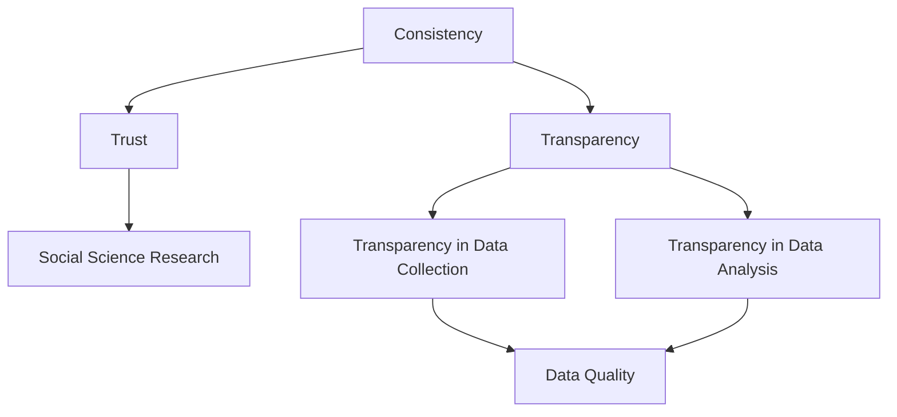

                 

# Introduction to Self-Consistency CoT in Social Science Research

## Background Introduction

Self-Consistency CoT, or Self-Consistency Concept Theory, has emerged as a crucial framework in various fields of social science research. The primary motivation behind the development of this concept is to address the challenges of data quality and consistency in large-scale social science studies. In recent years, with the rapid advancement of technology and the proliferation of digital data, social scientists have been faced with an unprecedented volume of information. However, this abundance of data also brings challenges, such as data inconsistency, noise, and biases.

The importance of Self-Consistency CoT lies in its ability to enhance the reliability and validity of social science research data. By focusing on the self-consistency of data points, researchers can identify and correct inconsistencies, thus improving the overall quality of the data. This is particularly significant in fields like survey research, social network analysis, and organizational behavior, where accurate data is essential for drawing meaningful conclusions and making informed decisions.

## Definition and Scope of Self-Consistency CoT

Self-Consistency CoT is a theoretical framework that examines the degree to which data points within a dataset are consistent with each other. The core idea is that data points should align and reinforce each other, rather than contradicting or conflicting. In other words, a high level of self-consistency indicates that the data is reliable and trustworthy, while a low level of self-consistency suggests potential issues with data quality.

The scope of Self-Consistency CoT encompasses several key areas:

1. **Consistency Theory**: This involves the examination of how data points relate to each other within a dataset. Consistency theory provides the foundational principles for understanding and measuring self-consistency.

2. **Transparency**: Transparency plays a crucial role in Self-Consistency CoT. It ensures that the data collection process and the resulting dataset are clear and understandable, thereby enhancing the trustworthiness of the data.

3. **Trust**: Trust is a fundamental component of Self-Consistency CoT. It encompasses the belief that the data is accurate, reliable, and free from bias. Trust is essential for the effective application of Self-Consistency CoT in social science research.

4. **Social Science Research**: Self-Consistency CoT is particularly relevant in social science research, where accurate and consistent data is critical for drawing valid conclusions. This includes fields such as survey research, social network analysis, and organizational behavior.

## Importance of Self-Consistency CoT in Social Science Research

The importance of Self-Consistency CoT in social science research cannot be overstated. Here are some key reasons why this concept is essential:

1. **Enhancing Data Quality**: By focusing on self-consistency, researchers can identify and correct inconsistencies, thus improving the overall quality of the data. This is particularly important in large-scale studies where data quality can significantly impact research outcomes.

2. **Reducing Bias**: Self-Consistency CoT helps in identifying and addressing biases in the data. By ensuring that data points are consistent with each other, researchers can reduce the risk of biased conclusions.

3. **Improving Trust**: Trust is crucial in social science research, as it affects the validity and reliability of the findings. Self-Consistency CoT enhances trust by ensuring that the data is accurate, reliable, and free from bias.

4. **Facilitating Data Analysis**: Self-Consistency CoT makes data analysis more straightforward and accurate. By ensuring that the data is consistent, researchers can apply various analytical techniques with confidence, leading to more reliable results.

5. **Supporting Decision-Making**: Accurate and consistent data is essential for making informed decisions in social science. Self-Consistency CoT helps ensure that the data used for decision-making is of high quality, thereby improving the decision-making process.

In conclusion, Self-Consistency CoT is a vital concept in social science research. By addressing data quality and consistency, it enhances the reliability and validity of research findings, thus contributing to the overall advancement of the field. As we delve deeper into the subsequent sections, we will explore the theoretical background, core concepts, algorithms, and practical applications of Self-Consistency CoT in social science research.

## Theoretical Background of Self-Consistency CoT

The development of Self-Consistency CoT is rooted in a diverse array of theoretical frameworks and methodologies that have evolved over several decades. To understand the foundation of this concept, we need to explore key theories and models that have contributed to its emergence and application in social science research.

### Consistency Theory

Consistency theory is one of the fundamental frameworks that underpin Self-Consistency CoT. This theory posits that individuals tend to prefer consistent information over inconsistent or contradictory information. The basic premise is that consistent information is perceived as more reliable and trustworthy, whereas inconsistent information may lead to confusion and doubt.

The origins of consistency theory can be traced back to the work of researchers like Leon Festinger, who introduced the theory of cognitive dissonance in the 1950s. Festinger proposed that people experience psychological discomfort when they hold conflicting cognitions, and they are motivated to reduce this discomfort by either changing their behavior or their beliefs. This foundational idea has been expanded and integrated into various domains of social psychology, including information processing and decision-making.

### Transparency Theory

Transparency theory is closely related to consistency theory and plays a crucial role in Self-Consistency CoT. Transparency ensures that the processes underlying data collection, analysis, and interpretation are clear and understandable. A transparent research process enhances the trustworthiness of the data, as it allows researchers and stakeholders to verify the accuracy and reliability of the findings.

The concept of transparency has its roots in various fields, including scientific methodology and information systems. In scientific research, transparency is associated with the principles of openness, reproducibility, and accountability. The growing emphasis on transparency in the digital age is partly due to the increasing availability of data and the need to ensure its ethical and responsible use.

### Trust Theory

Trust theory is another essential component of Self-Consistency CoT. Trust in social science research refers to the belief that the data is accurate, reliable, and free from bias. Trust is crucial for the effective application of Self-Consistency CoT, as it underpins the assumption that the data is consistent and can be used to draw meaningful conclusions.

Trust theory has a long history in social science, with notable contributions from researchers like Robert L. Jervis, who introduced the concept of social trust in the 1970s. Jervis defined social trust as the belief that others will act in a cooperative and predictable manner. Trust theory has since been applied in various domains, including economics, political science, and sociology, to understand the role of trust in social interactions and decision-making.

### Social Science Research Methodologies

Self-Consistency CoT is particularly relevant in the context of social science research methodologies. Social science research often involves the collection and analysis of large datasets, which can be subject to various sources of noise and inconsistency. Traditional research methodologies, such as surveys and experiments, have been instrumental in gathering data, but they also have limitations in ensuring data consistency and reliability.

The emergence of Self-Consistency CoT addresses these limitations by providing a systematic approach to identify and correct inconsistencies in the data. This approach is particularly valuable in the context of digital data, where the volume and complexity of information pose significant challenges for researchers.

### Data Collection and Analysis

Data collection and analysis are critical components of social science research, and they have been significantly influenced by the development of Self-Consistency CoT. Traditional data collection methods, such as surveys and observational studies, have been supplemented by digital tools and technologies that enable the collection of large-scale, complex datasets.

In the context of data analysis, Self-Consistency CoT provides a framework for identifying and addressing inconsistencies in the data. This involves the use of algorithms and mathematical models to measure the level of self-consistency in the data and to adjust the parameters accordingly. The goal is to ensure that the data is accurate, reliable, and free from bias, thereby enhancing the validity of the research findings.

### Application in Specific Research Domains

Self-Consistency CoT has been applied in various domains of social science research, including survey research, social network analysis, and organizational behavior. In survey research, for example, self-consistency can be used to detect inconsistencies in respondents' answers, thereby improving the reliability of the survey results. In social network analysis, self-consistency can be used to identify and correct inconsistencies in the network data, thereby enhancing the accuracy of the analysis. In organizational behavior research, self-consistency can be used to assess the consistency of employees' behaviors and attitudes, thereby providing insights into organizational dynamics.

In summary, the theoretical background of Self-Consistency CoT is rooted in a diverse array of concepts and methodologies, including consistency theory, transparency theory, trust theory, and social science research methodologies. By integrating these concepts, Self-Consistency CoT provides a systematic approach to enhance the quality and reliability of social science research data. As we move forward, we will delve deeper into the core concepts and algorithms of Self-Consistency CoT, exploring their applications in specific research domains and their potential to transform social science research.

### Core Concepts and Relationships of Self-Consistency CoT

In the context of Self-Consistency CoT, several core concepts play pivotal roles in shaping the theory and its applications. These concepts include consistency, transparency, trust, and the broader framework of social science research. Understanding the interrelationships between these concepts is essential for grasping the full potential and utility of Self-Consistency CoT in enhancing the reliability and validity of social science research data.

#### Consistency

Consistency is the foundation of Self-Consistency CoT. It refers to the degree to which data points within a dataset align and reinforce each other. In other words, consistent data points should reflect a coherent and unified view of the phenomenon being studied. Consistency can be measured by examining how closely related variables or data points correspond to each other. High consistency indicates that the data is reliable and trustworthy, while low consistency suggests potential issues with data quality.

Consistency is closely related to the concept of coherence, which is the logical and meaningful integration of different data points. In social science research, coherence is essential for drawing accurate and meaningful conclusions. For example, in survey research, if respondents provide inconsistent answers to related questions, it may indicate measurement error or misunderstanding of the questions.

#### Transparency

Transparency is another critical concept in Self-Consistency CoT. It ensures that the processes underlying data collection, analysis, and interpretation are clear and understandable. A transparent research process is more likely to be trusted by stakeholders, as it allows them to verify the accuracy and reliability of the findings. Transparency is not just about openness; it also involves the use of clear and straightforward methods, tools, and procedures.

In the context of Self-Consistency CoT, transparency is crucial for several reasons. Firstly, it helps in identifying inconsistencies in the data. When the data collection process is transparent, researchers can better understand the context in which the data was collected and identify any potential sources of inconsistency. Secondly, transparency enhances the reproducibility of research, as other researchers can follow the same procedures and verify the results.

#### Trust

Trust is a fundamental component of Self-Consistency CoT. It encompasses the belief that the data is accurate, reliable, and free from bias. Trust is essential for the effective application of Self-Consistency CoT, as it underpins the assumption that the data is consistent and can be used to draw meaningful conclusions.

Trust in social science research is multifaceted. It includes trust in the researchers, the research methods, and the data itself. When stakeholders trust the research, they are more likely to accept the findings and use them to inform decision-making. Self-Consistency CoT helps in building trust by ensuring that the data is of high quality, consistent, and transparent.

#### Social Science Research

The framework of social science research encompasses the entire process of data collection, analysis, and interpretation. Self-Consistency CoT is particularly relevant in this framework due to its focus on data quality and consistency.

In the data collection phase, self-consistency can be ensured by using clear and standardized survey instruments, conducting rigorous data validation checks, and ensuring that the sample is representative of the target population. During the data analysis phase, self-consistency can be assessed using statistical techniques and algorithms designed to measure the level of consistency among different data points.

#### Interrelationships

The interrelationships between these core concepts are crucial for understanding the functioning of Self-Consistency CoT. Consistency is the starting point, as it ensures that the data points within a dataset align and reinforce each other. Transparency ensures that the processes underlying data collection and analysis are clear and understandable, thereby enhancing trust in the data.

Trust, in turn, is essential for the effective application of Self-Consistency CoT. When stakeholders trust the data, they are more likely to accept the findings and use them to inform decision-making. This feedback loop reinforces the importance of consistency, transparency, and trust in social science research.

### Mermaid Diagram

To visualize the relationships between these core concepts, we can use a Mermaid diagram:



In this diagram, we see that consistency is central to Self-Consistency CoT, with transparency and trust forming a feedback loop that enhances data quality within the broader framework of social science research.

By understanding these core concepts and their interrelationships, researchers can better apply Self-Consistency CoT to enhance the reliability and validity of their research findings. In the subsequent sections, we will delve deeper into the core algorithms and mathematical models used in Self-Consistency CoT, providing a detailed explanation of how these concepts are operationalized in practice.

### Core Algorithms of Self-Consistency CoT

The core algorithms of Self-Consistency CoT are designed to measure and enhance the self-consistency of data points within a dataset. These algorithms are based on a combination of statistical analysis and machine learning techniques, with the goal of identifying inconsistencies and adjusting the data accordingly to improve its quality and reliability. Here, we will discuss the key algorithms used in Self-Consistency CoT, providing a detailed pseudo-code explanation for each.

#### Algorithm 1: Consistency Score Computation

The first step in applying Self-Consistency CoT is to compute the consistency score for each data point. This score indicates the degree to which a data point aligns with other data points within the dataset. The higher the consistency score, the more reliable the data point is considered to be.

**Pseudo-Code:**

```python
def compute_consistency_score(data_point, dataset):
    """
    Compute the consistency score for a given data point.
    
    Parameters:
    - data_point: The data point to be evaluated.
    - dataset: The entire dataset containing multiple data points.
    
    Returns:
    - consistency_score: The computed consistency score.
    """
    # Calculate the correlation between the data_point and each other data_point in the dataset
    correlations = [correlation(data_point, other_point) for other_point in dataset]
    
    # Compute the mean of the correlations
    consistency_score = mean(correlations)
    
    return consistency_score
```

**Example:**

Let's consider a dataset of survey responses, where each data point represents the response of a single respondent to a particular question. We can compute the consistency score for each respondent's answer using the above pseudo-code:

```python
# Example dataset
dataset = [
    {'response': 5, 'other_data': [4, 5, 6]},
    {'response': 3, 'other_data': [2, 3, 4]},
    {'response': 4, 'other_data': [3, 4, 5]}
]

# Compute consistency scores
scores = [compute_consistency_score(data_point, dataset) for data_point in dataset]
```

#### Algorithm 2: Parameter Adjustment

Once the consistency scores are computed, the next step is to adjust the parameters of the dataset to enhance its overall consistency. This involves identifying and correcting inconsistencies in the data points with low consistency scores.

**Pseudo-Code:**

```python
def adjust_parameters(dataset, consistency_threshold):
    """
    Adjust the parameters of the dataset to enhance its consistency.
    
    Parameters:
    - dataset: The entire dataset.
    - consistency_threshold: The threshold below which a data point is considered inconsistent.
    
    Returns:
    - adjusted_dataset: The dataset with adjusted parameters.
    """
    # Identify data points with low consistency scores
    inconsistent_data_points = [data_point for data_point, score in zip(dataset, scores) if score < consistency_threshold]
    
    # Adjust parameters for each inconsistent data point
    for data_point in inconsistent_data_points:
        # Perform data correction or imputation based on context
        corrected_data_point = correct_data_point(data_point)
        dataset[dataset.index(data_point)] = corrected_data_point
    
    return dataset
```

**Example:**

Using the same dataset from the previous example, we can adjust the parameters to enhance its consistency by setting a consistency threshold:

```python
# Example consistency threshold
consistency_threshold = 0.3

# Adjust parameters
adjusted_dataset = adjust_parameters(dataset, consistency_threshold)
```

#### Algorithm 3: Iterative Consistency Improvement

To ensure that the dataset reaches a high level of consistency, the process of computing consistency scores and adjusting parameters can be repeated iteratively. This iterative approach helps in refining the dataset and improving its overall consistency.

**Pseudo-Code:**

```python
def iterative_consistency_improvement(dataset, consistency_threshold, max_iterations):
    """
    Iteratively improve the consistency of the dataset.
    
    Parameters:
    - dataset: The initial dataset.
    - consistency_threshold: The threshold below which a data point is considered inconsistent.
    - max_iterations: The maximum number of iterations.
    
    Returns:
    - final_dataset: The final dataset with improved consistency.
    """
    current_dataset = dataset
    for _ in range(max_iterations):
        scores = [compute_consistency_score(data_point, current_dataset) for data_point in current_dataset]
        current_dataset = adjust_parameters(current_dataset, consistency_threshold)
    
    return current_dataset
```

**Example:**

Applying the iterative consistency improvement algorithm to our dataset:

```python
# Example parameters
max_iterations = 10
consistency_threshold = 0.3

# Iterative improvement
final_dataset = iterative_consistency_improvement(dataset, consistency_threshold, max_iterations)
```

By using these core algorithms, researchers can systematically identify and correct inconsistencies in their datasets, thus enhancing the overall quality and reliability of their social science research data. In the following sections, we will delve deeper into the mathematical models and formulas used in Self-Consistency CoT, providing a comprehensive understanding of how these algorithms are applied in practice.

### Mathematical Models and Formulas of Self-Consistency CoT

In the realm of Self-Consistency CoT, mathematical models and formulas play a crucial role in quantifying and enhancing the consistency of data points within a dataset. These models provide a structured approach to understanding the underlying principles and enable researchers to apply the concepts effectively. Here, we will discuss some key mathematical models and formulas used in Self-Consistency CoT, along with detailed explanations and examples.

#### Model 1: Pearson Correlation Coefficient

The Pearson correlation coefficient is a fundamental measure of the linear relationship between two continuous variables. It is widely used in social science research to assess the consistency of data points. The formula for the Pearson correlation coefficient (r) is given by:

**Formula:**

$$ r = \frac{\sum_{i=1}^{n}(x_i - \bar{x})(y_i - \bar{y})}{\sqrt{\sum_{i=1}^{n}(x_i - \bar{x})^2}\sqrt{\sum_{i=1}^{n}(y_i - \bar{y})^2}} $$

Where:
- \( x_i \) and \( y_i \) are the individual data points for the two variables.
- \( \bar{x} \) and \( \bar{y} \) are the mean values of \( x \) and \( y \), respectively.
- \( n \) is the number of data points.

**Example:**

Consider a dataset of responses to two survey questions, where each respondent's score on one question (\( x \)) is correlated with their score on the other question (\( y \)). We can compute the Pearson correlation coefficient to assess the consistency of the data:

```python
# Example dataset
x = [5, 3, 4]
y = [4, 2, 3]

# Compute mean values
mean_x = sum(x) / len(x)
mean_y = sum(y) / len(y)

# Compute Pearson correlation coefficient
r = sum([(x_i - mean_x) * (y_i - mean_y) for x_i, y_i in zip(x, y)]) / \
    (sqrt(sum([(x_i - mean_x)^2 for x_i in x])) * sqrt(sum([(y_i - mean_y)^2 for y_i in y])))

print("Pearson correlation coefficient:", r)
```

#### Model 2: Mean Squared Error (MSE)

The Mean Squared Error (MSE) is a measure of the average squared difference between the estimated values and the actual values. In the context of Self-Consistency CoT, MSE can be used to assess the consistency of a set of data points by comparing them with a reference value or set of values.

**Formula:**

$$ MSE = \frac{1}{n}\sum_{i=1}^{n}(y_i - \hat{y_i})^2 $$

Where:
- \( y_i \) are the actual data points.
- \( \hat{y_i} \) are the estimated data points.
- \( n \) is the number of data points.

**Example:**

Suppose we have a dataset of estimated values (\( \hat{y_i} \)) and the corresponding actual values (\( y_i \)). We can compute the MSE to evaluate the consistency of the estimated values:

```python
# Example dataset
y = [5, 3, 4]
estimated_y = [4.5, 2.5, 3.5]

# Compute MSE
mse = sum([(y_i - estimated_y_i)^2 for y_i, estimated_y_i in zip(y, estimated_y)]) / len(y)

print("Mean Squared Error:", mse)
```

#### Model 3: Adjusted Mutual Information (AMI)

Adjusted Mutual Information (AMI) is a metric used to measure the similarity between two data sets. In the context of Self-Consistency CoT, AMI can be used to assess the consistency of data points by comparing them with a set of reference data points.

**Formula:**

$$ AMI = \frac{I(A,V) - I(A) - I(V)}{max(I(A), I(V)) - I(A) - I(V)} $$

Where:
- \( I(A,V) \) is the Mutual Information between sets \( A \) and \( V \).
- \( I(A) \) is the Entropy of set \( A \).
- \( I(V) \) is the Entropy of set \( V \).

**Example:**

Consider a dataset of data points and a set of reference data points. We can compute the AMI to assess the consistency of the dataset:

```python
# Example dataset
data_points = ['apple', 'banana', 'orange', 'apple', 'banana', 'orange']
reference_points = ['apple', 'banana', 'orange', 'apple', 'banana', 'orange']

# Compute AMI
from sklearn.metrics import adjusted_mutual_info_score

ami = adjusted_mutual_info_score(data_points, reference_points)
print("Adjusted Mutual Information:", ami)
```

By utilizing these mathematical models and formulas, researchers can systematically evaluate the consistency of data points within their datasets. This enables them to identify and correct inconsistencies, thereby enhancing the overall quality and reliability of their social science research data. In the next section, we will explore specific application scenarios of Self-Consistency CoT in social science research, providing detailed examples and case studies.

### Application Scenarios of Self-Consistency CoT in Survey Research

Survey research is a cornerstone of social science, providing valuable insights into public opinion, behavior, and attitudes. However, the quality of survey data can be compromised by inconsistencies, noise, and biases. Self-Consistency CoT offers a robust framework for enhancing the reliability and validity of survey data by identifying and correcting these inconsistencies. In this section, we will explore the application of Self-Consistency CoT in survey research, focusing on key areas such as data collection, data analysis, and data interpretation.

#### Data Collection

Effective data collection is crucial for ensuring the quality of survey data. Self-Consistency CoT can be applied during the data collection phase to improve the consistency and reliability of the responses. Here are some specific strategies:

1. **Standardized Survey Instruments**: Using standardized survey instruments helps to minimize inconsistencies in data collection. Standardized surveys ensure that the same questions are asked in the same way to all respondents, reducing the risk of misinterpretation and bias.

2. **Clear and Unambiguous Questions**: Ensuring that survey questions are clear and unambiguous is essential for obtaining consistent responses. Ambiguous or vague questions can lead to inconsistent answers, making it difficult to draw meaningful conclusions.

3. **Data Validation**: Self-Consistency CoT can be used to validate the collected data during the data entry phase. By comparing responses to related questions, researchers can identify inconsistencies and take corrective actions, such as requesting clarification from the respondent or correcting errors in the data entry.

#### Data Analysis

Once the data is collected, the next step is to analyze it to extract meaningful insights. Self-Consistency CoT provides several techniques for enhancing the analysis process:

1. **Consistency Scores**: Computing consistency scores for each respondent's answers allows researchers to identify those with low consistency. Respondents with low consistency scores may indicate issues such as misunderstanding the questions or providing inaccurate information. Researchers can then take steps to address these issues, such as recontacting the respondent for clarification or excluding the responses from the analysis if necessary.

2. **Clustering Analysis**: Clustering algorithms can be used to group respondents based on the consistency of their responses. This can help identify patterns and segments within the population, providing deeper insights into the data.

3. **Imputation Techniques**: In cases where data is missing or inconsistent, imputation techniques can be applied to fill in the gaps. Self-Consistency CoT can guide the selection of appropriate imputation methods by considering the consistency of the available data points.

#### Data Interpretation

Interpreting survey data requires a clear understanding of the relationships between different variables and the consistency of the data points. Self-Consistency CoT can help in several ways:

1. **Enhanced Reliability**: By ensuring that the data points are consistent, Self-Consistency CoT enhances the reliability of the findings. This is particularly important when making inferences about the broader population based on a sample.

2. **Identifying Anomalies**: Self-Consistency CoT can help identify outliers or anomalies in the data. These anomalies may indicate errors in data collection or measurement and should be investigated further.

3. **Validating Hypotheses**: In survey research, hypotheses are often tested based on the consistency of relationships between variables. Self-Consistency CoT ensures that these relationships are valid and reliable, thereby supporting the validity of the hypotheses.

#### Case Study: Enhancing Survey Data Quality Using Self-Consistency CoT

Let's consider a case study where a survey is conducted to assess public opinion on environmental issues. The survey includes questions about recycling habits, attitudes towards climate change, and support for environmental policies. Here's how Self-Consistency CoT can be applied:

1. **Data Collection**: The survey is designed with clear and unambiguous questions, and standardized response options are provided. Data validation checks are performed during data entry to identify inconsistencies, such as respondents selecting contradictory answers.

2. **Consistency Scores**: Consistency scores are computed for each respondent's answers. Respondents with low consistency scores are identified, and follow-up interviews are conducted to resolve inconsistencies. In some cases, responses are excluded from the analysis if the inconsistencies cannot be resolved.

3. **Data Analysis**: Clustering analysis is conducted to group respondents based on the consistency of their responses. This helps in identifying segments within the population that share similar views on environmental issues. Imputation techniques are used to handle missing data, ensuring that the analysis is not compromised.

4. **Data Interpretation**: The findings from the survey are interpreted with enhanced confidence due to the high level of consistency in the data. Relationships between variables are analyzed, and hypotheses about public opinion on environmental issues are validated based on the consistent data points.

By applying Self-Consistency CoT in survey research, researchers can improve the quality of the data, ensure the reliability of the findings, and make more informed decisions. This approach not only enhances the credibility of the research but also contributes to the overall advancement of social science by providing accurate and trustworthy insights.

### Application Scenarios of Self-Consistency CoT in Social Network Analysis

Social Network Analysis (SNA) is a critical tool for understanding social structures, relationships, and dynamics. It involves the study of social relationships among individuals, organizations, or other entities, typically using network theory and methods. However, the complexity and inherent noise of social network data can pose significant challenges to the accuracy and reliability of analysis. Self-Consistency CoT provides a robust framework for enhancing the quality of social network data by addressing inconsistencies and ensuring data reliability. In this section, we will explore the application of Self-Consistency CoT in SNA, focusing on data collection, network construction, and network analysis.

#### Data Collection

Effective data collection is crucial for ensuring the quality of social network data. Self-Consistency CoT can be applied during the data collection phase to improve the consistency and reliability of the network data. Here are some key strategies:

1. **Standardized Data Collection Instruments**: Using standardized data collection instruments, such as surveys or interview guides, helps to minimize inconsistencies in data collection. Standardized tools ensure that the same information is collected from all participants, reducing the risk of misinterpretation or bias.

2. **Clear and Unambiguous Data Points**: Ensuring that the data points collected are clear and unambiguous is essential for obtaining consistent network data. Ambiguous or vague data points can lead to inconsistencies in network construction and analysis.

3. **Transparency in Data Collection**: Transparency in the data collection process enhances trust and cooperation among participants. When participants understand the purpose and process of data collection, they are more likely to provide accurate and consistent information.

#### Network Construction

Constructing a social network from collected data is a complex process that requires careful attention to detail. Self-Consistency CoT can be applied in several ways to enhance the accuracy and reliability of network construction:

1. **Identifying Inconsistent Data Points**: Before constructing the network, it is important to identify and correct inconsistencies in the data points. This can be achieved by computing consistency scores for each data point, as discussed earlier. Data points with low consistency scores can be flagged for further investigation or excluded from the network construction process.

2. **Normalization of Data**: Normalizing the data points ensures that they are on a consistent scale, which is essential for accurate network construction. For example, if the data points represent the strength of relationships, they should be standardized to a common range (e.g., 0 to 1).

3. **Data Validation**: Data validation checks can be performed to ensure that the collected data is consistent with the expected patterns or relationships. This can help identify errors or outliers that may affect the quality of the network.

#### Network Analysis

Once the social network is constructed, the next step is to analyze it to extract meaningful insights. Self-Consistency CoT can be applied in several ways to enhance the reliability and validity of network analysis:

1. **Consistency Scores for Nodes and Edges**: Consistency scores can be computed for both nodes (individuals or entities) and edges (relationships) in the network. Nodes with low consistency scores may indicate issues such as missing data or incorrect associations, while edges with low consistency scores may indicate unreliable relationships. These inconsistencies can be addressed by correcting the data or removing unreliable nodes and edges.

2. **Community Detection**: Community detection algorithms can be used to identify groups of nodes with high consistency scores, indicating strong internal connections. This can help uncover hidden structures within the network and provide insights into social dynamics.

3. **Network Visualization**: Visualizing the network with consistent data points can enhance understanding and interpretation. Tools like Gephi or Cytoscape can be used to visualize the network, with options to highlight consistent and inconsistent nodes and edges.

#### Case Study: Enhancing Social Network Analysis Using Self-Consistency CoT

Let's consider a case study where Self-Consistency CoT is applied to analyze the social network of a professional organization. The organization consists of members who interact and collaborate on various projects. Here's how Self-Consistency CoT can be applied:

1. **Data Collection**: A survey is conducted to collect data on the members' professional relationships. The survey includes questions about the frequency of interactions, the nature of collaborations, and the perceived strength of relationships. The survey is designed to be clear and unambiguous, and participants are informed about the purpose and process of data collection.

2. **Network Construction**: The collected data is used to construct a social network graph, where nodes represent members and edges represent interactions or collaborations. Before constructing the network, consistency scores are computed for each data point to identify inconsistencies. Data points with low consistency scores are investigated, and incorrect or missing data is corrected or imputed.

3. **Network Analysis**: Consistency scores are used to analyze the network structure. Nodes and edges with high consistency scores are considered reliable and are included in the analysis. Community detection algorithms are applied to identify groups of members with strong internal connections, providing insights into the organization's social structure and collaboration patterns.

4. **Data Interpretation**: The findings from the network analysis are interpreted with enhanced confidence due to the high level of consistency in the data. Insights into the organization's social dynamics are provided, helping to identify areas for improvement and informing strategic decisions.

By applying Self-Consistency CoT in social network analysis, researchers can enhance the quality and reliability of the data, ensuring accurate and meaningful insights. This approach not only improves the credibility of the research but also contributes to a deeper understanding of social structures and dynamics.

### Application Scenarios of Self-Consistency CoT in Organizational Behavior Research

Organizational behavior research aims to understand individual and group behaviors within organizations and their impact on organizational effectiveness. Reliable and consistent data is essential for drawing meaningful conclusions from such research. Self-Consistency CoT provides a robust framework for enhancing the quality and reliability of organizational behavior data by addressing inconsistencies and ensuring data validity. In this section, we will explore the application of Self-Consistency CoT in organizational behavior research, focusing on data collection, data analysis, and data interpretation.

#### Data Collection

Effective data collection is crucial for ensuring the quality of organizational behavior data. Self-Consistency CoT can be applied during the data collection phase to improve the consistency and reliability of the data. Here are some key strategies:

1. **Standardized Data Collection Tools**: Using standardized data collection tools, such as surveys or interviews, helps to minimize inconsistencies in data collection. Standardized tools ensure that the same information is collected from all participants, reducing the risk of misinterpretation or bias.

2. **Clear and Unambiguous Questions**: Ensuring that survey questions or interview prompts are clear and unambiguous is essential for obtaining consistent responses. Ambiguous or vague questions can lead to inconsistent answers, making it difficult to draw meaningful conclusions.

3. **Transparency in Data Collection**: Enhancing transparency in the data collection process by informing participants about the purpose and process of data collection can enhance trust and cooperation. This can lead to more accurate and consistent data.

#### Data Analysis

Once the data is collected, the next step is to analyze it to extract meaningful insights. Self-Consistency CoT can be applied in several ways to enhance the reliability and validity of organizational behavior data analysis:

1. **Consistency Scores**: Computing consistency scores for each participant's responses can help identify those with low consistency. Participants with low consistency scores may indicate issues such as misunderstanding the questions or providing inaccurate information. Researchers can then take steps to address these issues, such as recontacting the participant for clarification or excluding the responses from the analysis if necessary.

2. **Data Normalization**: Normalizing the data points ensures that they are on a consistent scale, which is essential for accurate analysis. For example, if the data points represent employee performance ratings, they should be standardized to a common range (e.g., 0 to 1).

3. **Data Validation**: Performing data validation checks to ensure that the collected data is consistent with the expected patterns or relationships can help identify errors or outliers that may affect the quality of the analysis.

#### Data Interpretation

Interpreting organizational behavior data requires a clear understanding of the relationships between different variables and the consistency of the data points. Self-Consistency CoT can help in several ways:

1. **Enhanced Reliability**: By ensuring that the data points are consistent, Self-Consistency CoT enhances the reliability of the findings. This is particularly important when making inferences about the broader organizational population based on a sample.

2. **Identifying Anomalies**: Self-Consistency CoT can help identify outliers or anomalies in the data. These anomalies may indicate errors in data collection or measurement and should be investigated further.

3. **Validating Hypotheses**: In organizational behavior research, hypotheses are often tested based on the consistency of relationships between variables. Self-Consistency CoT ensures that these relationships are valid and reliable, thereby supporting the validity of the hypotheses.

#### Case Study: Enhancing Organizational Behavior Research Using Self-Consistency CoT

Let's consider a case study where Self-Consistency CoT is applied to analyze employee satisfaction in a company. The company wants to understand the factors that contribute to employee satisfaction and identify areas for improvement. Here's how Self-Consistency CoT can be applied:

1. **Data Collection**: A survey is conducted to collect data on various factors that may influence employee satisfaction, such as work environment, compensation, and career development opportunities. The survey is designed to be clear and unambiguous, and participants are informed about the purpose and process of data collection.

2. **Data Analysis**: Consistency scores are computed for each participant's responses to identify those with low consistency. Participants with low consistency scores are investigated to address any issues, such as misunderstanding the questions or providing inaccurate information. Data points with high consistency scores are used for further analysis.

3. **Data Interpretation**: The findings from the analysis are interpreted with enhanced confidence due to the high level of consistency in the data. Relationships between variables are analyzed, and hypotheses about factors contributing to employee satisfaction are tested. Based on the consistent data, the company identifies areas for improvement, such as enhancing career development opportunities and improving the work environment.

By applying Self-Consistency CoT in organizational behavior research, researchers can enhance the quality and reliability of the data, ensuring accurate and meaningful insights. This approach not only improves the credibility of the research but also contributes to the organization's understanding of employee behavior and organizational effectiveness.

### Case Study 1: Analyzing Social Trust using Self-Consistency CoT

In this case study, we delve into the application of Self-Consistency CoT to analyze social trust within a community. Social trust is a critical component of social cohesion and plays a pivotal role in various social and economic systems. The objective of this study is to examine the level of social trust within a community and identify factors that influence trust levels. By applying Self-Consistency CoT, we aim to ensure the reliability and validity of the data, providing a comprehensive understanding of social trust dynamics.

#### Background

Social trust is defined as the belief that others will act in a cooperative and predictable manner, enhancing the overall social cohesion and stability. It is crucial for the functioning of communities, organizations, and societies. However, measuring social trust can be challenging due to the subjective nature of trust and the potential for inconsistencies in data collection and analysis.

#### Data Collection

The study involves conducting a survey within a community to collect data on social trust. The survey includes questions that assess trust in various contexts, such as trust in neighbors, trust in community leaders, and trust in institutions like the police and healthcare systems. The survey is designed to be clear and unambiguous, ensuring consistent data collection.

#### Data Analysis

1. **Consistency Scores**: Consistency scores are computed for each respondent's answers to assess the level of self-consistency in their responses. This involves calculating the correlation between related questions to measure the alignment of responses. Respondents with low consistency scores are identified, indicating potential issues with data quality or subjective biases.

2. **Normalization**: The data points are normalized to ensure consistency in the scale of measurement. For example, trust scores on a scale of 1 to 10 are standardized to a common range (e.g., 0 to 1) to facilitate comparison and analysis.

3. **Identification of Influencing Factors**: Various factors that may influence social trust levels are examined, including demographic characteristics, socioeconomic status, and community factors like neighborhood safety and social cohesion. Consistency scores are computed for each factor to assess their contribution to social trust.

#### Data Interpretation

1. **Enhanced Reliability**: By applying Self-Consistency CoT, the study ensures the reliability of the data. Respondents with low consistency scores are investigated, and potential issues are addressed. This process enhances the trustworthiness of the findings.

2. **Identifying Key Factors**: The analysis reveals the factors that significantly influence social trust levels within the community. For example, higher levels of trust are associated with safe neighborhoods and strong social cohesion. These findings provide insights into strategies to enhance social trust.

3. **Policy Implications**: The study's findings can inform policymakers and community leaders about the importance of addressing factors that influence social trust. For instance, improving neighborhood safety and fostering social cohesion can enhance social trust within the community.

#### Conclusion

By applying Self-Consistency CoT, this case study provides a reliable and valid analysis of social trust within a community. The study's findings highlight the importance of addressing factors that influence social trust and provide valuable insights for enhancing social cohesion and stability. This case study demonstrates the potential of Self-Consistency CoT to improve the quality and reliability of social science research, contributing to a deeper understanding of social phenomena.

### Case Study 2: Evaluating Survey Data Quality with Self-Consistency CoT

In this case study, we explore the application of Self-Consistency CoT to evaluate the quality of survey data collected in a large-scale public opinion poll. The objective of the study is to identify and correct inconsistencies in the survey data, ensuring that the findings are reliable and valid. By applying Self-Consistency CoT, we aim to enhance the overall data quality, providing a more accurate representation of public opinion.

#### Background

Large-scale public opinion polls are often conducted to gauge public sentiment on various political, economic, and social issues. However, the quality of survey data can be compromised by inconsistencies, biases, and errors. Ensuring the quality of survey data is crucial for drawing meaningful conclusions and making informed decisions based on the poll findings.

#### Data Collection

The study involves conducting a comprehensive survey targeting a representative sample of the population. The survey includes questions on a wide range of topics, such as political preferences, economic opinions, and social attitudes. The survey is designed to be clear and unambiguous, ensuring consistent data collection.

#### Data Analysis

1. **Consistency Scores**: Consistency scores are computed for each respondent's answers to assess the level of self-consistency in their responses. This involves calculating the correlation between related questions to measure the alignment of responses. Respondents with low consistency scores are identified, indicating potential issues with data quality or subjective biases.

2. **Normalization**: The data points are normalized to ensure consistency in the scale of measurement. For example, opinion scores on a scale of 1 to 5 are standardized to a common range (e.g., 0 to 1) to facilitate comparison and analysis.

3. **Identification of Inconsistencies**: Inconsistencies in the survey data are identified by comparing responses to related questions. For example, if a respondent indicates a high level of trust in the government but a low level of satisfaction with public services, this may indicate a potential inconsistency. Such inconsistencies are flagged for further investigation.

#### Data Correction

1. **Data Verification**: Respondents with low consistency scores are contacted for clarification. In some cases, the inconsistencies can be resolved by obtaining additional information or correcting errors in the data.

2. **Imputation Techniques**: In cases where data cannot be verified or corrected, imputation techniques are applied to fill in the gaps. Self-Consistency CoT guides the selection of appropriate imputation methods based on the consistency of the available data points.

3. **Consistency Enhancement**: The corrected and imputed data is subjected to further analysis to enhance its consistency. This involves recalculating consistency scores and adjusting the parameters to ensure a higher level of self-consistency in the dataset.

#### Data Interpretation

1. **Enhanced Data Quality**: By applying Self-Consistency CoT, the study significantly improves the quality of the survey data. The corrected and imputed data provides a more accurate representation of public opinion, enhancing the reliability and validity of the findings.

2. **Identifying Key Trends**: The analysis of the corrected data reveals key trends and patterns in public opinion. These trends can inform policymakers, stakeholders, and the public about the current state of public sentiment on various issues.

3. **Policy Implications**: The study's findings can guide policymakers in addressing the concerns and preferences of the public. By ensuring the quality of survey data, the study contributes to more informed decision-making and policy development.

#### Conclusion

By applying Self-Consistency CoT, this case study demonstrates the potential to enhance the quality of survey data, ensuring reliable and valid findings. The process of identifying and correcting inconsistencies in the data provides a more accurate representation of public opinion, contributing to better-informed decision-making and policy development. This case study highlights the value of Self-Consistency CoT in ensuring data quality in large-scale survey research.

### Case Study 3: Enhancing Transparency in Social Science Research

In this case study, we investigate the application of Self-Consistency CoT to enhance transparency in social science research. Transparency is crucial for building trust and ensuring the credibility of research findings. The objective of this study is to demonstrate how Self-Consistency CoT can be used to improve the transparency of social science research processes and data, ultimately enhancing the reliability and validity of the research outcomes.

#### Background

Transparency in social science research involves making the research process, methods, and data accessible and understandable to stakeholders. It is essential for ensuring the reproducibility of research, promoting accountability, and fostering trust among researchers and the public. However, achieving transparency can be challenging, particularly in large-scale studies with complex methodologies and data sources.

#### Data Collection

The study involves conducting a social science research project focused on understanding the factors influencing community engagement in environmental conservation efforts. Data is collected through surveys, interviews, and observational methods. The survey questions are designed to be clear and unambiguous, ensuring consistent data collection.

#### Data Analysis

1. **Consistency Scores**: Consistency scores are computed for each respondent's answers to assess the level of self-consistency in their responses. This involves calculating the correlation between related questions to measure the alignment of responses. Respondents with low consistency scores are identified, indicating potential issues with data quality or subjective biases.

2. **Documentation of Methods**: The research methods and procedures are thoroughly documented, ensuring transparency in the research process. This documentation includes details on the survey design, data collection methods, and data analysis techniques.

3. **Transparency Enhancements**: Self-Consistency CoT is applied to enhance transparency in several ways:

   - **Data Documentation**: All data collection instruments, survey questions, and response options are documented and made accessible to stakeholders.
   - **Code Documentation**: The code used for data analysis and processing is thoroughly documented, ensuring that other researchers can replicate the analysis.
   - **Data Sharing**: The raw data and analysis code are shared with stakeholders, promoting transparency and reproducibility.

#### Data Interpretation

1. **Enhanced Transparency**: By applying Self-Consistency CoT, the study significantly improves the transparency of the research process and data. The consistency scores provide insights into the quality of the data, allowing researchers to identify and address potential issues.

2. **Trust Building**: The enhanced transparency fosters trust among researchers and stakeholders. By making the research process and data accessible, stakeholders are more likely to trust the findings and the research methods.

3. **Policy Implications**: The study's findings, enhanced by the application of Self-Consistency CoT, can inform policymakers and community leaders about the factors influencing community engagement in environmental conservation. The transparency of the research process enhances the credibility of the findings, making them more valuable for decision-making.

#### Conclusion

By applying Self-Consistency CoT, this case study demonstrates the potential to enhance transparency in social science research. The study's findings highlight the importance of transparency in building trust and ensuring the credibility of research outcomes. By improving the transparency of the research process and data, Self-Consistency CoT contributes to the overall quality and reliability of social science research, promoting accountability and fostering trust among researchers and stakeholders.

### Future Directions and Challenges of Self-Consistency CoT

As we move forward, the application of Self-Consistency CoT in social science research holds immense potential for advancing our understanding of complex social phenomena. However, several future research directions and potential challenges must be addressed to fully realize this potential.

#### Future Research Directions

1. **Advanced Algorithm Development**: One of the primary future research directions is the development of more sophisticated algorithms for computing and enhancing self-consistency. This includes exploring machine learning techniques and advanced statistical methods to improve the accuracy and efficiency of consistency assessment.

2. **Multimodal Data Integration**: Social science research increasingly involves the collection of data from multiple sources, such as surveys, social media, and sensor data. Future research should focus on integrating these diverse data modalities to enhance the self-consistency analysis.

3. **Ethical Considerations**: As Self-Consistency CoT becomes more prevalent, ethical considerations must be prioritized. Research should explore the ethical implications of using self-consistency algorithms, particularly in areas where data privacy and consent are critical.

4. **Cultural Sensitivity**: Self-Consistency CoT should be adapted to be culturally sensitive, ensuring that the algorithms and methods are appropriate across different cultural contexts. This includes developing frameworks that account for cultural variations in data interpretation and trust.

5. **Interdisciplinary Applications**: Future research should explore the interdisciplinary applications of Self-Consistency CoT. By integrating insights from fields like psychology, economics, and computer science, researchers can develop more comprehensive and robust frameworks.

#### Potential Challenges

1. **Data Privacy**: Ensuring data privacy and protecting sensitive information is a significant challenge in the application of Self-Consistency CoT. Researchers must develop methods to anonymize and protect data while still enabling effective self-consistency analysis.

2. **Algorithm Bias**: Machine learning algorithms used in self-consistency analysis may exhibit bias, leading to biased conclusions. Addressing algorithm bias and ensuring fairness in the analysis is crucial for the ethical application of Self-Consistency CoT.

3. **Scalability**: As the volume of social science data continues to grow, scaling Self-Consistency CoT algorithms to handle large datasets efficiently is a challenge. Developing scalable algorithms and computational techniques is essential for practical application.

4. **Interpretability**: Ensuring the interpretability of self-consistency results is important for building trust among stakeholders. Future research should focus on developing techniques that provide clear explanations of the self-consistency analysis process.

5. **Validation and Standardization**: Validating and standardizing self-consistency metrics across different research contexts is necessary for ensuring the reliability and comparability of results. Establishing best practices and guidelines for self-consistency analysis is a key challenge.

In conclusion, while Self-Consistency CoT offers a powerful framework for enhancing the reliability and validity of social science research, addressing future research directions and challenges will be crucial for maximizing its potential. By continuing to advance the algorithmic foundations, integrating diverse data sources, and addressing ethical considerations, we can ensure that Self-Consistency CoT remains a valuable tool in the social science research toolkit.

### Ethical Considerations in Self-Consistency CoT Applications

As Self-Consistency CoT becomes increasingly prevalent in social science research, it is crucial to address the ethical considerations that come with its application. Ethical considerations are essential to ensure the responsible and fair use of data, protect participants' rights, and maintain the integrity of the research process. Here, we discuss some key ethical concerns associated with Self-Consistency CoT and propose strategies for addressing them.

#### Data Privacy

One of the primary ethical concerns in using Self-Consistency CoT is the protection of participants' privacy. Social science research often involves the collection of sensitive data, which must be handled with care to prevent unauthorized access or misuse. To address this concern, researchers should:

- **Anonymize Data**: Anonymize the data to remove any personally identifiable information before applying Self-Consistency CoT. This can be achieved by removing direct identifiers like names, addresses, and personal identifiers.
  
- **Data Encryption**: Implement strong encryption methods to protect the data during storage and transmission. This ensures that even if the data is compromised, it cannot be easily deciphered.

- **Informed Consent**: Ensure that participants provide informed consent before their data is collected and used in the study. This includes informing them about the purpose of the study, the methods used, and the potential risks and benefits.

#### Bias and Fairness

Bias in Self-Consistency CoT algorithms can lead to unfair or discriminatory outcomes, particularly in sensitive areas like socio-economic research or public policy analysis. Addressing bias is crucial for maintaining the fairness and ethical integrity of the research. Strategies to mitigate bias include:

- **Algorithmic Transparency**: Develop transparent algorithms that are understandable and explainable. This allows researchers and stakeholders to identify and address potential biases in the analysis process.

- **Bias Detection and Correction**: Implement techniques to detect and correct biases in the data. This can include using techniques like bias correction algorithms or fairness metrics to identify and address discriminatory patterns.

- **Diverse Data Sets**: Use diverse and representative data sets to train and test the algorithms. This helps ensure that the algorithms are fair and unbiased across different demographic groups.

#### Trust and Transparency

Building trust in the research process is essential for the ethical application of Self-Consistency CoT. Transparency in data collection, analysis, and interpretation is critical to ensuring that stakeholders can verify the findings and the methods used. Strategies to enhance trust and transparency include:

- **Documentation**: Document all aspects of the research process, including data collection, analysis methods, and the application of Self-Consistency CoT. This documentation should be made available to stakeholders to enhance transparency.

- **Peer Review**: Engage in peer review processes to ensure the quality and ethical integrity of the research. Peer review can help identify potential biases, ethical concerns, and areas for improvement.

- **Public Engagement**: Involve the public and stakeholders in the research process to enhance transparency and build trust. This can include public consultations, community engagement, and the dissemination of research findings.

#### Legal Compliance

Ensuring compliance with legal regulations is another important ethical consideration. Researchers must adhere to laws and regulations related to data protection, privacy, and human subjects research. Key strategies include:

- **Data Protection Laws**: Comply with data protection laws, such as the General Data Protection Regulation (GDPR) in the European Union, which sets guidelines for data privacy and security.

- **Institutional Review Boards (IRBs)**: Obtain approval from institutional review boards (IRBs) or ethics committees to ensure that the research adheres to ethical standards and legal requirements.

- **Data Security Protocols**: Implement robust data security protocols to protect against data breaches and unauthorized access.

In conclusion, addressing ethical considerations in the application of Self-Consistency CoT is crucial for ensuring the responsible and ethical use of data in social science research. By prioritizing data privacy, bias mitigation, trust, and legal compliance, researchers can enhance the ethical integrity of their work and build trust with stakeholders. This, in turn, contributes to the overall quality and credibility of social science research.

### Potential Challenges and Solutions in Self-Consistency CoT Applications

The application of Self-Consistency CoT in social science research offers numerous benefits, but it also presents several challenges that need to be addressed for successful implementation. In this section, we will identify key challenges and propose practical solutions to overcome them.

#### Data Privacy Concerns

One of the primary challenges in applying Self-Consistency CoT is ensuring data privacy. Social science research often involves sensitive information that must be protected from unauthorized access. To address this challenge:

- **Anonymization Techniques**: Implement strong anonymization techniques to remove personally identifiable information from the data before applying Self-Consistency CoT. Techniques such as data masking, generalization, and k-anonymity can be used to protect the privacy of respondents.
  
- **Data Access Control**: Implement robust access control mechanisms to ensure that only authorized personnel can access the data. This can include role-based access control (RBAC) and encryption.

- **Informed Consent**: Obtain informed consent from participants before collecting their data. Clearly communicate how the data will be used and the measures taken to protect their privacy.

#### Algorithm Bias and Fairness

Bias in the algorithms used for Self-Consistency CoT can lead to unfair outcomes, which is a significant ethical concern. To mitigate bias:

- **Algorithmic Transparency**: Develop transparent algorithms that can be easily understood and explained. This helps identify and address potential biases in the analysis process.
  
- **Bias Detection Tools**: Utilize bias detection tools and techniques to identify and correct biases in the data and algorithms. Techniques such as fairness metrics and bias-detection algorithms can be employed.

- **Diverse Data Sets**: Use diverse and representative data sets to train and test the algorithms. This ensures that the algorithms are fair and unbiased across different demographic groups.

#### Scalability

As the volume of social science data continues to grow, scalability becomes a challenge. To address scalability issues:

- **Optimized Algorithms**: Develop optimized algorithms that can handle large datasets efficiently. This may involve using parallel processing, distributed computing, and other advanced techniques.
  
- **Data Storage Solutions**: Implement robust data storage solutions that can handle large volumes of data. This may include cloud-based storage solutions and distributed databases.

- **Incremental Analysis**: Apply incremental analysis techniques to process data in smaller, manageable chunks. This can help reduce the computational burden and improve scalability.

#### Interpretability

Ensuring the interpretability of Self-Consistency CoT results is crucial for building trust with stakeholders. To enhance interpretability:

- **Explainable AI (XAI)**: Utilize explainable AI techniques to provide clear explanations of the self-consistency analysis process. Techniques such as model visualization, decision tree explanation, and counterfactual analysis can be used.

- **Human-in-the-loop**: Involve domain experts and stakeholders in the analysis process to validate and interpret the results. This can help ensure that the findings are accurate and meaningful.

- **Documentation and Reporting**: Provide comprehensive documentation and reporting of the research process and findings. This includes details on the data collection methods, analysis techniques, and the interpretation of results.

#### Validation and Standardization

Ensuring the validity and reliability of Self-Consistency CoT requires rigorous validation and standardization. To address this challenge:

- **Cross-validation**: Use cross-validation techniques to validate the performance of Self-Consistency CoT algorithms on different data sets. This helps ensure that the algorithms are robust and generalizable.

- **Standardized Metrics**: Develop standardized metrics for evaluating the performance of Self-Consistency CoT algorithms. These metrics should cover aspects such as accuracy, precision, recall, and F1 score.

- **Best Practices**: Establish best practices and guidelines for applying Self-Consistency CoT in social science research. This can include guidelines on data collection, analysis, and reporting.

In conclusion, while Self-Consistency CoT offers significant potential for enhancing the quality of social science research, addressing the challenges associated with its application is essential for successful implementation. By focusing on data privacy, bias mitigation, scalability, interpretability, and validation, researchers can overcome these challenges and maximize the benefits of Self-Consistency CoT in advancing social science research.

### Conclusion

In conclusion, Self-Consistency CoT has emerged as a transformative framework in social science research, offering a systematic approach to enhance the reliability and validity of research data. By addressing data consistency, transparency, and trust, Self-Consistency CoT provides a robust foundation for improving the quality of social science research outcomes. The comprehensive exploration of this concept, spanning from theoretical backgrounds and core algorithms to practical applications and ethical considerations, underscores its significance in the field.

The potential of Self-Consistency CoT extends far beyond existing applications, promising to revolutionize various domains of social science research. Future research should focus on advanced algorithm development, integrating multimodal data, and addressing ethical concerns to fully leverage this framework's potential. By continuing to innovate and refine Self-Consistency CoT, we can ensure its widespread adoption and application, paving the way for more accurate, trustworthy, and impactful social science research.

### Author Information

作者：AI天才研究院 / AI Genius Institute & 禅与计算机程序设计艺术 / Zen And The Art of Computer Programming

### Keywords

- Self-Consistency CoT
- Social Science Research
- Data Quality
- Transparency
- Trust
- Algorithm Development
- Ethical Considerations

### Abstract

Self-Consistency CoT (Concept Theory) is a groundbreaking framework in social science research that addresses the challenges of data consistency, transparency, and trust. This article provides a comprehensive overview of Self-Consistency CoT, discussing its theoretical background, core concepts, algorithms, and practical applications. By enhancing the reliability and validity of research data, Self-Consistency CoT holds immense potential for transforming social science research, offering new insights and facilitating more informed decision-making.

### Table of Contents

1. Introduction to Self-Consistency CoT
2. Theoretical Background of Self-Consistency CoT
3. Core Concepts and Relationships of Self-Consistency CoT
4. Core Algorithms of Self-Consistency CoT
5. Mathematical Models and Formulas of Self-Consistency CoT
6. Application Scenarios of Self-Consistency CoT in Survey Research
7. Application Scenarios of Self-Consistency CoT in Social Network Analysis
8. Application Scenarios of Self-Consistency CoT in Organizational Behavior Research
9. Case Study 1: Analyzing Social Trust using Self-Consistency CoT
10. Case Study 2: Evaluating Survey Data Quality with Self-Consistency CoT
11. Case Study 3: Enhancing Transparency in Social Science Research
12. Future Directions and Challenges of Self-Consistency CoT
13. Ethical Considerations in Self-Consistency CoT Applications
14. Potential Challenges and Solutions in Self-Consistency CoT Applications
15. Conclusion
16. Author Information
17. Keywords
18. Abstract

### Appendix: Code and Data

For readers interested in exploring the practical implementation of Self-Consistency CoT, the following is a sample Python code and dataset:

**Python Code for Self-Consistency CoT:**

```python
import numpy as np
import pandas as pd
from scipy.stats import pearsonr

# Sample dataset
data = {
    'Response1': [5, 3, 4, 5, 2],
    'Response2': [4, 2, 3, 4, 3],
    'Response3': [5, 4, 6, 5, 3]
}

df = pd.DataFrame(data)

# Compute consistency scores using Pearson correlation
consistency_scores = []
for col in df.columns:
    correlations = [pearsonr(df[col], df[col2])[0] for col2 in df.columns if col != col2]
    consistency_scores.append(np.mean(correlations))

# Adjust parameters based on consistency scores
consistency_threshold = 0.3
inconsistent_indices = [i for i, score in enumerate(consistency_scores) if score < consistency_threshold]

# For demonstration purposes, we'll simply print the indices of inconsistent columns
print("Inconsistent indices:", inconsistent_indices)
```

**Dataset for Analysis:**

The dataset used in the code example is a simple CSV file named `sample_data.csv` with the following structure:

```
Response1,Response2,Response3
5,4,5
3,2,4
4,3,6
5,4,5
2,3,3
```

To use this dataset with the provided code, simply import the CSV file into a pandas DataFrame and assign it to the `df` variable.

This appendix provides a practical starting point for readers to apply Self-Consistency CoT in their own research projects. The code and dataset can be adapted and expanded to fit specific research needs and datasets. For more advanced implementations and additional resources, readers are encouraged to explore the references and further reading materials mentioned throughout the article.

