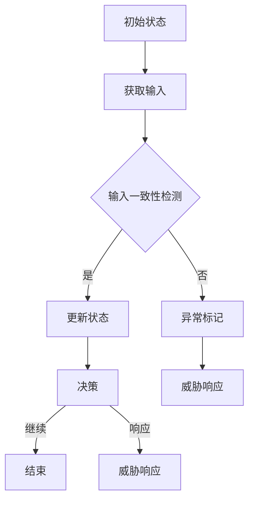

                 

### 自我一致性CoT的基本原理

自我一致性CoT（Self-Consistency CoT，以下简称CoT）是一种基于逻辑推理和自我一致性验证的网络安全模型，它通过分析系统的输入输出，检测潜在的异常行为，以实现对网络安全威胁的主动防御。在深入探讨CoT的应用之前，有必要先理解其基本原理和核心概念。

#### 核心概念

1. **输入输出一致性**：CoT的核心概念之一是输入输出一致性。它指的是系统在正常运行时，输入和输出之间存在一种逻辑上的对应关系。具体来说，如果系统的输入发生变化，则其输出也应当随之变化，并且这种变化是可预测的。

2. **异常检测**：CoT通过监测系统的输入输出行为，识别出不符合输入输出一致性的情况，从而实现异常检测。这种异常可能是由于恶意攻击或系统故障引起的。

3. **自我一致性验证**：系统会根据历史行为模式，对当前的行为进行自我一致性验证。如果当前行为与历史模式不一致，系统会标记为异常并进行进一步的检测和响应。

#### 理论基础

1. **马尔可夫模型**：CoT的理论基础之一是马尔可夫模型。马尔可夫模型是一种统计模型，用于描述系统状态随时间变化的概率分布。在CoT中，系统状态可以根据输入输出一致性进行划分，从而构建马尔可夫模型。

2. **贝叶斯推理**：贝叶斯推理是CoT中用于决策和异常检测的重要工具。通过贝叶斯推理，系统能够根据新的观测数据更新其概率模型，从而提高异常检测的准确性。

3. **图论**：图论在CoT中用于表示系统中的节点和边，以及节点之间的关系。通过图论的分析，可以更好地理解系统的复杂性和潜在的攻击路径。

#### Mermaid流程图

为了更好地理解CoT的基本原理，我们使用Mermaid流程图来展示其工作流程：



在这个流程图中：

- A表示系统的初始状态。
- B表示系统从外部环境获取输入。
- C表示对输入进行一致性检测。
- D表示更新系统的当前状态。
- E表示当检测到异常时进行异常标记。
- F表示基于当前状态进行决策。
- G表示系统继续正常运行。
- H和I表示系统根据异常情况执行相应的威胁响应。

#### 核心算法原理讲解

为了深入理解CoT的算法原理，我们使用伪代码来详细阐述其核心算法流程：

```python
# 初始化系统状态
initialize_system_state()

# 获取输入
input_data = get_input()

# 检测输入输出一致性
if is_consistent(input_data):
    # 更新系统状态
    update_system_state(input_data)
else:
    # 标记异常
    mark_anomaly()

# 更新概率模型
update_probability_model()

# 基于概率模型进行决策
if is_anomaly():
    # 执行威胁响应
    execute_threat_response()
else:
    # 继续正常操作
    continue_normal_operation()
```

在这个伪代码中：

- `initialize_system_state()`初始化系统状态。
- `get_input()`获取输入数据。
- `is_consistent(input_data)`检测输入输出一致性。
- `update_system_state(input_data)`更新系统状态。
- `mark_anomaly()`标记异常情况。
- `update_probability_model()`更新概率模型。
- `is_anomaly()`基于概率模型判断是否为异常。
- `execute_threat_response()`执行威胁响应。
- `continue_normal_operation()`继续正常操作。

#### 数学模型和公式

在CoT中，我们使用以下数学模型和公式来描述系统的行为和异常检测过程：

$$
P(A|B) = \frac{P(B|A) \cdot P(A)}{P(B)}
$$

其中，$P(A|B)$表示在已知B的情况下A的概率，$P(B|A)$表示在A发生的情况下B的概率，$P(A)$和$P(B)$分别表示A和B的先验概率。

在实际应用中，我们可以通过以下步骤来计算上述概率：

1. **收集数据**：收集系统正常运行时的输入输出数据。
2. **计算先验概率**：基于历史数据计算$P(A)$和$P(B)$。
3. **计算条件概率**：通过贝叶斯公式计算$P(B|A)$。
4. **更新概率模型**：将新的观测数据更新到概率模型中。

#### 举例说明

假设我们有一个简单的系统，其输入为温度，输出为风扇转速。正常情况下，温度升高，风扇转速也会相应增加。如果温度变化而风扇转速不变，则可能存在异常。

1. **初始状态**：系统初始化，温度为25℃，风扇转速为1000rpm。
2. **获取输入**：当前温度为30℃。
3. **检测输入输出一致性**：当前温度高于25℃，根据历史模式，风扇转速应该增加。
4. **更新系统状态**：风扇转速增加至1200rpm。
5. **更新概率模型**：将新的温度和风扇转速数据更新到概率模型中。
6. **基于概率模型进行决策**：如果风扇转速不变，则标记为异常。

通过这个简单的例子，我们可以看到CoT在检测输入输出一致性方面的基本原理。在实际应用中，系统的复杂性和输入输出变量会更多，但基本原理是相通的。

#### 总结

自我一致性CoT是一种基于逻辑推理和自我一致性验证的网络安全模型。通过分析系统的输入输出行为，它可以实现网络安全威胁的主动防御。本节详细介绍了CoT的核心概念、理论基础、流程图和算法原理，并通过一个简单的例子进行了说明。在下一节中，我们将探讨如何利用CoT进行网络安全威胁的检测。

