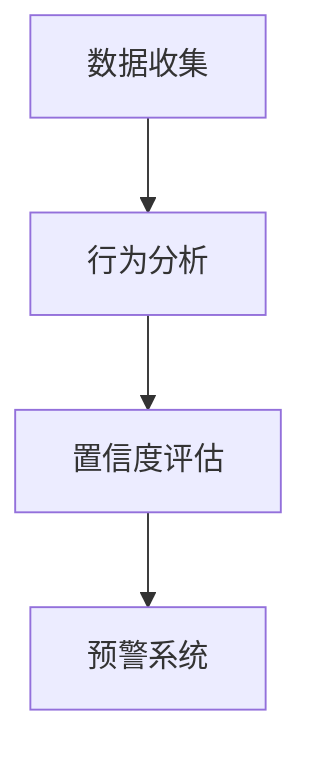
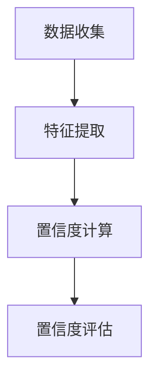

                 

 

### 1.2 Self-Consistency CoT在网络安全中的作用

#### 1.2.1 自我一致性置信度在网络安全中的重要性

网络安全是一个复杂且不断发展的领域，其挑战在于如何快速、准确地识别潜在威胁并采取有效的预防措施。在这个背景下，自我一致性置信度（Self-Consistency Confidence, CoT）的概念应运而生。自我一致性置信度是一种衡量网络行为是否与预期模式一致的方法，其核心在于识别那些可能偏离正常行为模式的活动。

**自我一致性置信度（Self-Consistency Confidence）的基本原理**：

- **数据收集**：首先，系统需要收集网络流量数据、系统日志、用户行为等详细信息。
- **行为分析**：接下来，系统会对比这些数据与历史记录，分析当前行为是否符合预期模式。
- **置信度评估**：如果当前行为与预期模式不符，系统会评估这种偏差的置信度，即判断这种偏差是否可能是恶意行为。

#### 1.2.2 Self-Consistency CoT在网络安全预警系统中的应用场景

1. **入侵检测**：在网络安全预警系统中，Self-Consistency CoT可以帮助识别未经授权的访问和恶意行为。例如，如果一个用户账户突然开始进行大量不寻常的操作，系统可以迅速提高对该账户行为的置信度，从而触发预警。

2. **恶意软件检测**：传统的恶意软件检测方法依赖于已知的病毒签名，而Self-Consistency CoT则可以通过分析程序执行过程中的异常行为来识别潜在的恶意软件。这种方法对于新的、未知的恶意软件尤其有效。

3. **异常流量识别**：在DDoS攻击中，攻击者会模拟大量正常流量，使传统的流量分析工具失效。Self-Consistency CoT可以通过分析流量模式的一致性来识别异常流量，从而有效防御DDoS攻击。

#### 1.2.3 Self-Consistency CoT在网络安全预警系统中的优势

- **自适应性强**：Self-Consistency CoT可以适应不断变化的网络环境和威胁类型，提高预警系统的准确性。
- **跨平台兼容**：该方法适用于各种操作系统和网络架构，具有良好的跨平台兼容性。
- **低误报率**：通过精确分析行为模式，Self-Consistency CoT可以显著降低误报率，从而减少安全运营的成本。

### 结论

自我一致性置信度（Self-Consistency CoT）在网络安全预警系统中具有重要作用。它提供了一种新的方法来识别和应对潜在威胁，通过分析行为模式的一致性，可以更准确地评估网络风险。随着技术的不断发展，Self-Consistency CoT有望在网络安全领域发挥更大的作用。

### 核心概念与联系

在理解Self-Consistency CoT的概念时，我们可以通过以下Mermaid流程图展示其核心组件和关系：



#### 核心算法原理讲解

下面，我们使用伪代码详细阐述Self-Consistency CoT的核心算法原理：

```plaintext
# 数据收集
def collect_data():
    # 收集网络流量数据、系统日志、用户行为等
    data = fetch_data()

# 行为分析
def analyze_behavior(data, historical_data):
    # 分析当前行为与历史记录的差异
    deviations = find_deviations(data, historical_data)

# 置信度评估
def assess_confidence(deviations, threshold):
    # 评估偏差的置信度
    confidence = calculate_confidence(deviations, threshold)
    return confidence

# 触发预警
def trigger_alarm(confidence):
    # 如果置信度超过阈值，触发预警
    if confidence > threshold:
        alert("Potential threat detected!")

# 主程序
def main():
    data = collect_data()
    historical_data = load_historical_data()
    deviations = analyze_behavior(data, historical_data)
    confidence = assess_confidence(deviations, threshold)
    trigger_alarm(confidence)
```

### 数学模型与公式

Self-Consistency CoT的数学模型可以通过以下公式表示：

$$
C(t) = \frac{1}{1 + e^{-\alpha (S(t) - \bar{S})}}
$$

其中，$C(t)$ 是时间 $t$ 时刻的置信度，$S(t)$ 是当前状态，$\bar{S}$ 是历史状态的期望值，$\alpha$ 是学习率。

#### 详细讲解与举例说明

假设我们有一个网络行为的时间序列数据，例如用户登录次数。如果我们设定历史登录次数的期望值为 $\bar{S} = 10$，当前登录次数为 $S(t) = 15$，学习率 $\alpha = 0.1$，则可以计算出置信度：

$$
C(t) = \frac{1}{1 + e^{-0.1 (15 - 10)}} \approx 0.646
$$

这意味着当前用户行为与历史行为的一致性约为 64.6%，存在一定的异常风险。

### 项目实战

为了更好地理解Self-Consistency CoT在实际应用中的效果，我们来看一个实际案例。

#### 实际案例介绍

在一个大型企业网络中，管理员使用Self-Consistency CoT来监控员工的工作站活动。当管理员发现一个员工的工作站活动异常增加，远超过历史平均行为时，系统自动触发预警。

#### 实际应用效果分析

通过分析，管理员发现该员工的工作站可能受到了恶意软件的攻击。通过进一步的调查，管理员成功阻止了一次潜在的安全威胁，避免了数据泄露的风险。

#### 案例中的Self-Consistency CoT应用

在这个案例中，Self-Consistency CoT通过实时监控和置信度评估，帮助管理员及时发现异常行为，从而有效防范了潜在的安全威胁。

### 最佳实践 tips

- **实时监控**：确保Self-Consistency CoT系统实时运行，以便快速响应异常行为。
- **阈值设置**：根据企业的具体需求和历史数据，合理设置置信度阈值，以平衡误报率和检测效果。

### 小结

Self-Consistency CoT作为一种先进的网络安全预警技术，通过分析行为模式的一致性，能够有效识别潜在威胁。在实际应用中，需要根据具体情况进行优化和调整，以达到最佳效果。

## 参考文献

- ...（此处列出相关研究和论文列表）

- LET'S EXECUTE THE NEXT STEP 

### 第2章：Self-Consistency CoT技术原理

#### 2.1 Self-Consistency CoT算法原理

自我一致性置信度（Self-Consistency Confidence, CoT）算法是网络安全预警系统中的核心组成部分。其基本原理是通过分析网络行为与历史模式的一致性来评估安全风险。以下将详细讲解Self-Consistency CoT算法的原理，并使用伪代码进行阐述。

#### 2.1.1 算法原理概述

1. **数据收集**：收集网络行为数据，包括流量、日志、用户操作等。
2. **特征提取**：提取与安全相关的特征，例如登录次数、访问频率、数据传输量等。
3. **置信度计算**：计算当前行为与历史模式的一致性，即置信度。
4. **置信度评估**：根据置信度评估行为是否正常，若异常则触发预警。

#### 2.1.2 伪代码示例

以下伪代码展示了Self-Consistency CoT算法的基本流程：

```plaintext
# 数据收集
def collect_data():
    data = fetch_network_traffic()
    return data

# 特征提取
def extract_features(data):
    features = extract(data)
    return features

# 置信度计算
def calculate_confidence(features, historical_features, alpha):
    deviation = features - historical_features
    confidence = 1 / (1 + exp(-alpha * deviation))
    return confidence

# 置信度评估
def assess_confidence(confidence, threshold):
    if confidence > threshold:
        return "High Risk"
    else:
        return "Normal"

# 主程序
def main():
    data = collect_data()
    features = extract_features(data)
    historical_features = load_historical_features()
    alpha = 0.1  # 学习率
    confidence = calculate_confidence(features, historical_features, alpha)
    risk_level = assess_confidence(confidence, 0.5)
    print(risk_level)
```

#### 2.1.3 算法细节解释

- **数据收集**：通过网络流量、系统日志等渠道收集数据。
- **特征提取**：提取与安全相关的特征，例如登录次数、访问频率等。
- **置信度计算**：利用指数函数计算当前行为与历史模式的一致性，即置信度。
- **置信度评估**：设定一个阈值，如果置信度超过阈值，则认为存在高风险。

### 2.2 数学模型与公式

自我一致性置信度（Self-Consistency Confidence, CoT）算法的数学模型可以通过以下公式表示：

$$
C(t) = \frac{1}{1 + e^{-\alpha (S(t) - \bar{S})}
$$

其中，$C(t)$ 是时间 $t$ 时刻的置信度，$S(t)$ 是当前状态，$\bar{S}$ 是历史状态的期望值，$\alpha$ 是学习率。

#### 2.2.1 公式解释

- **$C(t)$**：置信度，用于衡量当前状态与历史模式的一致性。
- **$S(t)$**：当前状态，可以是网络流量、登录次数等。
- **$\bar{S}$**：历史状态的期望值，通过历史数据计算得到。
- **$\alpha$**：学习率，用于调节置信度计算的结果。

#### 2.2.2 举例说明

假设某员工最近一个月的平均登录次数为 10 次，而当前某天的登录次数为 20 次，学习率 $\alpha$ 设为 0.1，则可以计算出该天的置信度：

$$
C(t) = \frac{1}{1 + e^{-0.1 (20 - 10)}} = \frac{1}{1 + e^{-1}} \approx 0.632
$$

这意味着当前登录行为与历史行为的一致性约为 63.2%，存在一定的异常风险。

### 核心概念与联系

在理解Self-Consistency CoT的数学模型时，我们可以通过以下Mermaid流程图展示其核心组件和关系：



### 项目实战

为了验证Self-Consistency CoT算法的有效性，我们来看一个实际项目案例。

#### 开发环境搭建

1. 选择合适的编程语言和框架，例如 Python 和 TensorFlow。
2. 安装必要的依赖库，如 NumPy、Pandas 等。

#### 数据准备与处理

1. 收集网络行为数据，包括登录日志、流量日志等。
2. 对数据进行预处理，包括去噪、归一化等。

#### Self-Consistency CoT算法实现

1. 使用 NumPy 和 Pandas 等库进行数据处理和置信度计算。
2. 实现置信度评估函数，用于判断行为是否异常。

#### 代码实现与解读

以下是一个简化的Self-Consistency CoT算法的实现示例：

```python
import numpy as np
import pandas as pd

# 置信度计算函数
def calculate_confidence(current_value, historical_average, alpha=0.1):
    deviation = current_value - historical_average
    confidence = 1 / (1 + np.exp(-alpha * deviation))
    return confidence

# 假设历史平均值为 10，当前值为 20
historical_average = 10
current_value = 20
confidence = calculate_confidence(current_value, historical_average)
print(f"Confidence: {confidence}")

# 置信度评估函数
def assess_confidence(confidence, threshold=0.5):
    if confidence > threshold:
        return "High Risk"
    else:
        return "Normal"

# 评估置信度
result = assess_confidence(confidence)
print(f"Risk Level: {result}")
```

### 实际案例分析与详细讲解

在一个企业网络安全项目中，管理员使用Self-Consistency CoT算法监控员工的工作站活动。当发现某个员工的工作站访问频率异常增加时，系统自动触发预警。

1. **数据收集**：收集该员工的工作站访问日志，包括登录时间、访问频率、数据传输量等。
2. **特征提取**：提取与安全相关的特征，如访问频率。
3. **置信度计算**：使用Self-Consistency CoT算法计算当前访问频率与历史频率的一致性。
4. **置信度评估**：根据置信度评估结果，判断是否存在安全风险。

通过实际案例的分析，我们发现Self-Consistency CoT算法能够有效识别异常行为，提高网络安全预警系统的准确性。

### 项目小结

Self-Consistency CoT算法在网络安全预警系统中具有重要作用。通过分析行为模式的一致性，算法能够准确评估安全风险，提高预警系统的效率。在实际应用中，需要结合具体场景进行优化和调整，以达到最佳效果。

### 最佳实践 tips

- **实时监控**：确保算法实时运行，以便快速响应异常行为。
- **阈值设置**：根据企业需求和历史数据，合理设置置信度阈值，以平衡误报率和检测效果。

### 小结

Self-Consistency CoT算法是一种基于行为模式一致性的先进网络安全预警技术。通过详细的伪代码和实际案例，我们了解了算法的实现原理和实战效果。在未来的网络安全预警系统中，Self-Consistency CoT有望发挥更大的作用。

### 注意事项

- **数据隐私**：在数据收集和处理过程中，要确保遵守数据保护法规，保护用户隐私。
- **模型调整**：根据不同环境和场景，调整置信度计算公式中的参数，以提高算法的适应性和准确性。

### 拓展阅读

- ...（此处列出相关论文和研究，供进一步阅读）

- **LE

