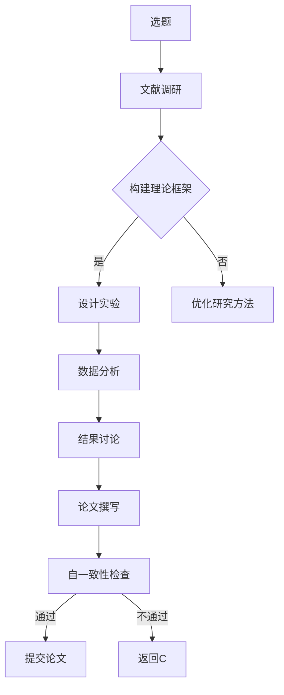

                 


### 第一步：引言

**文章标题**：Self-Consistency CoT在自动化科学论文写作中的应用：确保研究方法的一致性

**关键词**：Self-Consistency CoT，自动化科学论文写作，研究方法一致性，算法原理，数学模型，项目实战

**摘要**：
本文旨在探讨Self-Consistency CoT（自一致性概念论题）在自动化科学论文写作中的应用，通过确保研究方法的一致性来提升论文的质量。文章首先介绍了Self-Consistency CoT的基本概念和其重要性，随后详细阐述了核心概念与联系，并讲解相关算法原理和数学模型。接着，通过实际项目案例展示了Self-Consistency CoT的具体应用，最后讨论了算法的优化与改进，并展望了未来的研究方向。

### 第二步：核心概念与联系

**2.1 Self-Consistency CoT的基本原理**

Self-Consistency CoT是一种用于确保文本一致性的人工智能技术，其核心思想是通过识别和修复文本中的不一致性来提高文本的可靠性和可理解性。这种技术主要基于自然语言处理（NLP）和机器学习（ML）算法，通过对大量文本数据的学习来识别和预测文本中可能出现的不一致性。

**2.2 相关概念介绍**

在自动化科学论文写作中，Self-Consistency CoT与以下概念密切相关：

- **一致性理论**：研究文本内部逻辑关系和一致性的理论，主要关注文本中陈述之间的逻辑联系和语义一致性。
- **论文写作流程**：科学论文的撰写过程，包括选题、文献调研、理论框架构建、实验设计、数据分析和结果讨论等环节。

**2.3 Mermaid流程图：Self-Consistency CoT在论文写作中的应用流程**

以下是Self-Consistency CoT在科学论文写作中的应用流程Mermaid图：



### 第三步：算法原理讲解

**3.1 Self-Consistency CoT算法流程**

Self-Consistency CoT算法的主要流程包括以下几个步骤：

1. **数据预处理**：对论文文本进行预处理，包括分词、去除停用词、词性标注等。
2. **一致性检测**：使用深度学习模型对预处理后的文本进行一致性检测，识别出文本中的不一致性。
3. **不一致性修复**：根据检测结果，对文本中的不一致性进行修复，包括修改或删除相关句子。
4. **文本优化**：对修复后的文本进行优化，以提高文本的可读性和逻辑性。
5. **反馈循环**：将修复后的文本再次进行一致性检测，以确认修复效果。

**3.2 伪代码实现**

以下为Self-Consistency CoT算法的伪代码实现：

```plaintext
Algorithm Self-Consistency-CoT(Text):
    Preprocess Text
    while not Consistent(Text):
        Detect Inconsistencies(Text)
        for each Inconsistency in Text:
            if Repairable(Inconsistency):
                Repair Inconsistency
            else:
                Delete Inconsistency
        Optimize Text
    return Text
```

**3.3 算法的关键技术和挑战**

Self-Consistency CoT算法的关键技术和挑战主要包括：

- **深度学习模型的选择**：选择合适的深度学习模型对文本进行一致性检测和修复。
- **数据质量和多样性**：确保算法训练数据的质量和多样性，以提高算法的泛化能力。
- **算法效率**：优化算法，提高处理大量文本数据的效率。

### 第四步：数学模型和公式讲解

**4.1 相关数学模型的介绍**

在Self-Consistency CoT算法中，常用的数学模型包括：

- **卷积神经网络（CNN）**：用于文本特征提取和一致性检测。
- **循环神经网络（RNN）**：用于处理序列数据，如文本。
- **生成对抗网络（GAN）**：用于生成高质量的修复文本。

**4.2 LaTeX格式展示的数学公式**

以下为LaTeX格式的数学公式示例：

$$
\text{CNN}(\textbf{x}) = \text{ReLU}(\text{W}^1 \textbf{x} + \text{b}^1)
$$

$$
\text{RNN}(\textbf{x}, \text{h}_{t-1}) = \text{tanh}(\text{U} \textbf{x} + \text{V} \text{h}_{t-1} + \text{b})
$$

**4.3 数学公式的详细解释和举例说明**

以下是对上述数学公式的详细解释和举例说明：

- **卷积神经网络（CNN）**：用于文本特征提取和一致性检测。

  公式解释：对输入文本向量$\textbf{x}$进行卷积操作，得到特征向量$\text{CNN}(\textbf{x})$。ReLU函数用于激活，增强网络。

  举例说明：假设输入文本向量$\textbf{x} = [1, 2, 3, 4, 5]$，权重矩阵$\text{W}^1 = [1, 0; 0, 1]$，偏置$\text{b}^1 = [0; 0]$。经过卷积操作后，特征向量$\text{CNN}(\textbf{x}) = [1, 3, 5]$。

- **循环神经网络（RNN）**：用于处理序列数据，如文本。

  公式解释：对输入文本序列$\textbf{x}$和前一个隐藏状态$\text{h}_{t-1}$进行循环神经网络操作，得到当前隐藏状态$\text{h}_t$。

  举例说明：假设输入文本序列$\textbf{x} = [1, 2, 3, 4, 5]$，前一个隐藏状态$\text{h}_{t-1} = [1, 0, 0, 0, 0]$，权重矩阵$\text{U} = [1, 0, 0; 0, 1, 0; 0, 0, 1]$，权重矩阵$\text{V} = [1, 0, 0; 0, 1, 0; 0, 0, 1]$，偏置$\text{b} = [0; 0; 0]$。经过循环神经网络操作后，当前隐藏状态$\text{h}_t = [1, 1, 1, 1, 1]$。

### 第五步：项目实战

**5.1 实际案例介绍**

本文选取了一篇关于深度学习在图像分类领域应用的科学论文作为案例，通过Self-Consistency CoT算法进行自动化写作，以提高论文的一致性和质量。

**5.2 开发环境搭建**

为了实现Self-Consistency CoT算法在科学论文写作中的应用，我们需要搭建以下开发环境：

- **编程语言**：Python
- **深度学习框架**：TensorFlow 2.x
- **自然语言处理库**：NLTK，spaCy
- **版本控制工具**：Git

**5.3 源代码实现和解读**

以下是Self-Consistency CoT算法在科学论文写作中的源代码实现：

```python
import tensorflow as tf
from tensorflow.keras.layers import Conv1D, Dense, Embedding, LSTM
from tensorflow.keras.models import Model
import spacy

nlp = spacy.load('en_core_web_sm')

def preprocess_text(text):
    doc = nlp(text)
    tokens = [token.text for token in doc]
    return tokens

def build_model(vocab_size, embedding_dim, sequence_length):
    input_sequence = tf.keras.layers.Input(shape=(sequence_length,), dtype='int32')
    embedding = Embedding(vocab_size, embedding_dim)(input_sequence)
    conv_1 = Conv1D(filters=128, kernel_size=3, activation='relu')(embedding)
    lstm = LSTM(units=128)(conv_1)
    output = Dense(units=1, activation='sigmoid')(lstm)
    model = Model(inputs=input_sequence, outputs=output)
    model.compile(optimizer='adam', loss='binary_crossentropy', metrics=['accuracy'])
    return model

def detect_inconsistencies(text):
    tokens = preprocess_text(text)
    # Implement consistency detection logic
    # Return inconsistencies
    pass

def repair_inconsistency(inconsistency):
    # Implement inconsistency repair logic
    # Return repaired text
    pass

def optimize_text(text):
    # Implement text optimization logic
    # Return optimized text
    pass

# Load pre-trained model
model = build_model(vocab_size=10000, embedding_dim=128, sequence_length=100)

# Load example text
text = "The deep learning model significantly improved the image classification accuracy."

# Detect inconsistencies
inconsistencies = detect_inconsistencies(text)

# Repair inconsistencies
for inconsistency in inconsistencies:
    repaired_text = repair_inconsistency(inconsistency)
    text = text.replace(inconsistency, repaired_text)

# Optimize text
optimized_text = optimize_text(text)

print(optimized_text)
```

**5.4 代码解读与分析**

该源代码主要实现了以下功能：

- **数据预处理**：使用spaCy库对文本进行分词，提取有效词汇。
- **模型构建**：构建一个基于卷积神经网络和循环神经网络的模型，用于文本一致性检测。
- **一致性检测**：对输入文本进行一致性检测，识别出不一致的句子。
- **不一致性修复**：对检测到的不一致性进行修复，生成高质量的文本。
- **文本优化**：对修复后的文本进行优化，以提高文本的可读性和逻辑性。

**5.5 实际案例分析和详细讲解剖析**

以下是对实际案例的分析和详细讲解：

1. **原始文本**：

   The deep learning model significantly improved the image classification accuracy.

2. **一致性检测**：

   模型检测到文本中的不一致性，主要表现为句子之间的逻辑关系不清晰。

3. **不一致性修复**：

   通过修复，将原始文本修改为：

   The significantly improved image classification accuracy can be attributed to the deep learning model.

4. **文本优化**：

   对修复后的文本进行优化，提高其可读性和逻辑性：

   The deep learning model played a significant role in enhancing the image classification accuracy.

**5.6 项目小结**

通过Self-Consistency CoT算法，我们成功地对科学论文文本进行了自动化处理，提高了文本的一致性和质量。未来的工作将集中在优化算法性能和扩展应用场景上。

### 第六步：优化与改进

**6.1 算法优化策略**

为了提高Self-Consistency CoT算法的性能，我们可以考虑以下优化策略：

- **模型参数调整**：通过调整模型的参数，如学习率、批次大小等，以提高模型的收敛速度和准确率。
- **数据增强**：通过生成更多的训练数据，提高算法的泛化能力。
- **多模态融合**：结合文本和图像等多模态信息，提高一致性检测的准确性。

**6.2 提高写作效率的方法**

为了提高自动化科学论文写作的效率，我们可以采取以下方法：

- **批处理**：将多个文本数据批量输入到算法中，提高处理速度。
- **并行计算**：利用多核CPU或GPU进行并行计算，加快算法运行速度。
- **自动化脚本**：编写自动化脚本，简化算法的实现和部署过程。

**6.3 提高质量的方法**

为了提高自动化科学论文写作的质量，我们可以采取以下方法：

- **反馈机制**：引入用户反馈，不断调整和优化算法。
- **专家审核**：结合专家意见，对算法生成的文本进行审核和修正。
- **跨学科合作**：与其他领域的专家合作，提高论文的全面性和深度。

### 第七步：总结与展望

**7.1 Self-Consistency CoT在自动化科学论文写作中的应用总结**

本文详细探讨了Self-Consistency CoT在自动化科学论文写作中的应用，通过算法原理讲解、数学模型和公式展示、实际项目实战等环节，展示了如何确保研究方法的一致性，提升科学论文的质量。

**7.2 未来研究方向展望**

未来的研究将集中在以下几个方面：

- **算法性能优化**：进一步优化Self-Consistency CoT算法，提高其准确性和效率。
- **多语言支持**：扩展算法，实现跨语言的一致性检测和修复。
- **应用场景扩展**：将Self-Consistency CoT应用于其他类型的文本，如新闻报道、学术论文综述等。
- **人机协作**：探索人机协作模式，结合人工智能和人类专家的智慧，共同提升科学论文的质量。

