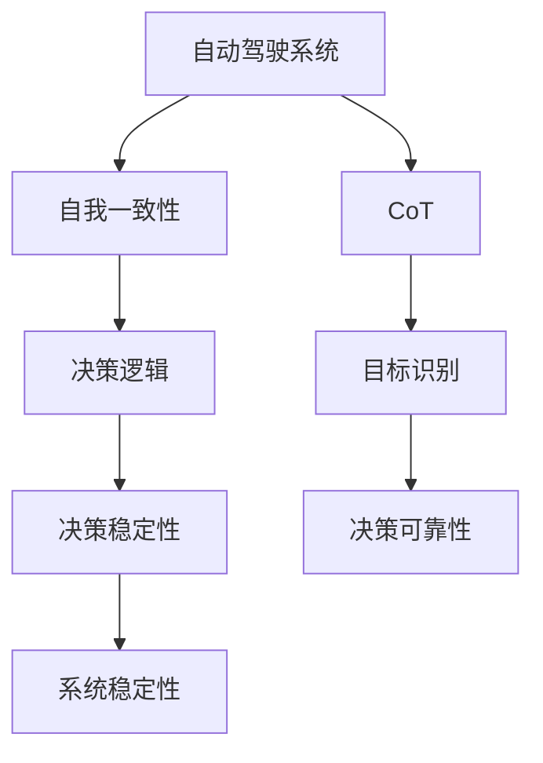

                 

### 文章标题

Self-Consistency CoT在自动驾驶伦理决策中的关键作用

### 关键词

自动驾驶，伦理决策，Self-Consistency CoT，数学模型，算法实现

### 摘要

本文深入探讨了Self-Consistency CoT在自动驾驶伦理决策中的关键作用。首先，我们回顾了自动驾驶技术的发展背景及其面临的伦理挑战，接着介绍了Self-Consistency CoT和CoT（Confidence of the Target）的基本概念。通过详细的数学模型和公式推导，我们揭示了Self-Consistency CoT的核心算法原理，并结合实际应用案例展示了其在自动驾驶伦理决策中的具体应用。最后，我们对未来发展趋势和潜在挑战进行了展望，并总结了Self-Consistency CoT的关键作用。

### 目录

1. **第一部分：自动驾驶伦理决策的背景与重要性**

   1.1 自动驾驶技术的发展与现状

   1.2 自动驾驶技术的应用场景

   1.3 自动驾驶技术面临的伦理挑战

   1.4 伦理决策理论框架

   1.5 自我一致性（Self-Consistency）的概念

   1.6 CoT（Confidence of the Target）的概念

2. **第二部分：Self-Consistency CoT在自动驾驶伦理决策中的应用**

   2.1 Self-Consistency CoT的应用原则

   2.2 Self-Consistency CoT的算法实现

   2.3 数学模型与公式解析

   2.4 Self-Consistency CoT的优化策略

   2.5 实际应用案例

3. **第三部分：未来展望与挑战**

   3.1 未来发展趋势预测

   3.2 潜在挑战与应对策略

   3.3 总结与展望

### 第一部分：自动驾驶伦理决策的背景与重要性

#### 1.1 自动驾驶技术的发展与现状

自动驾驶技术，作为现代智能交通系统的重要组成部分，近年来得到了迅速发展。从最初的辅助驾驶系统，到如今的完全自动驾驶，自动驾驶技术已经走过了漫长的历程。这一技术的发展不仅仅依赖于计算机视觉、传感器技术和机器学习等领域的突破，更得益于对车辆自动化、通信技术和人工智能算法的不断优化。

自动驾驶技术主要可以分为五个级别，从L0（无自动化）到L5（完全自动化）。当前，自动驾驶技术主要应用于L2（部分自动化）和L3（有条件自动化）级别。L2级别自动驾驶技术主要实现了车道保持、自适应巡航控制和自动泊车等功能，而L3级别自动驾驶技术则在此基础上增加了自动变道和自动超车等功能。尽管L4（高度自动化）和L5（完全自动化）级别自动驾驶技术尚未在商业上广泛应用，但许多公司和研究机构已经在积极研发和测试相关技术。

#### 1.2 自动驾驶技术的应用场景

自动驾驶技术的应用场景非常广泛，涵盖了乘用车、商用车、公共交通、物流和农业等多个领域。在乘用车领域，自动驾驶技术已经被广泛应用于高端车型，提供更为便捷和舒适的驾驶体验。在商用车领域，自动驾驶技术主要用于货运和公共交通，能够提高运输效率和安全性。在公共交通领域，自动驾驶公交车和出租车正在逐步推广，旨在减少交通事故和缓解交通拥堵。在物流领域，自动驾驶卡车和无人配送车已经投入使用，提高了物流配送的效率。在农业领域，自动驾驶农机能够实现精准农业，提高农业生产效率。

#### 1.3 自动驾驶技术面临的伦理挑战

随着自动驾驶技术的不断进步，其面临的伦理挑战也越来越突出。首先，自动驾驶技术在伦理决策方面面临着诸多困境。例如，在自动驾驶车辆遇到紧急情况时，如何进行决策以最大化乘客和行人的安全，这是一个复杂的伦理问题。其次，自动驾驶技术涉及到隐私和数据安全的问题，如何保护用户的隐私和数据安全是一个重要挑战。此外，自动驾驶技术在道德责任归属方面也存在争议，例如，在自动驾驶车辆发生事故时，责任应由谁来承担？

#### 1.4 伦理决策理论框架

伦理决策理论框架是解决自动驾驶技术伦理问题的基础。主要的伦理决策理论包括德性伦理、规则伦理和结果伦理。德性伦理强调个人的道德品质和品德，认为决策应该基于个人的道德标准。规则伦理则强调遵守道德规则和法律法规，认为决策应该遵循明确的规则和标准。结果伦理则关注决策的结果，强调决策的最终效果，认为决策应该以最大化社会福利为目标。

#### 1.5 自我一致性（Self-Consistency）的概念

自我一致性是指个体在决策过程中保持内在逻辑一致性的能力。在自动驾驶伦理决策中，自我一致性非常重要，因为自动驾驶系统需要在不同情境下做出决策，而这些决策需要保持内在逻辑的一致性，以确保系统的稳定性和可靠性。自我一致性不仅涉及到系统的内部逻辑，还包括与外部环境的交互。例如，自动驾驶系统在遇到紧急情况时，需要根据实际情况进行快速决策，并确保这些决策与系统之前的决策保持一致性。

#### 1.6 CoT（Confidence of the Target）的概念

CoT（Confidence of the Target）是指自动驾驶系统对目标对象（如行人、车辆等）的信心程度。在自动驾驶伦理决策中，CoT是一个关键指标，用于评估系统对目标的识别和预测能力。CoT的值通常介于0和1之间，值越接近1，表示系统对目标的信心越高。CoT对于自动驾驶系统的决策具有重要影响，因为系统需要根据CoT的值来调整其行为，以确保安全和可靠性。

### 核心概念之间的关系架构

为了更好地理解自我一致性和CoT之间的关系，我们可以使用Mermaid流程图来表示：



在这个关系架构中，自我一致性是自动驾驶系统在决策过程中保持一致性的能力，它直接影响到决策的稳定性和可靠性。而CoT则是自动驾驶系统对目标对象的信心程度，它也直接关系到决策的可靠性和系统稳定性。

### 第一部分小结

本部分对自动驾驶技术的发展背景、应用场景、伦理挑战以及核心概念进行了详细阐述。通过分析自动驾驶技术面临的伦理决策问题，我们引入了自我一致性和CoT的概念，并展示了它们在自动驾驶系统中的关键作用。这些概念和关系为后续章节的深入讨论奠定了基础。

### 第二部分：Self-Consistency CoT在自动驾驶伦理决策中的应用

#### 2.1 Self-Consistency CoT的应用原则

Self-Consistency CoT在自动驾驶伦理决策中的应用原则主要包括以下几个方面：

1. **一致性评估**：在决策过程中，系统需要定期评估自我一致性，确保决策逻辑的一致性。这可以通过比较当前决策与历史决策的差异来实现。

2. **适应性调整**：如果系统发现自我一致性较低，需要及时进行调整，以确保决策逻辑的一致性和稳定性。调整方法包括重新评估目标对象的CoT值，以及调整决策策略。

3. **目标识别**：系统需要准确识别目标对象，并评估其CoT值。这有助于确保决策的准确性和可靠性。

4. **决策稳定性**：系统需要保持决策的稳定性，避免因外界干扰而导致决策逻辑的不一致。可以通过设置决策阈值和调整决策参数来实现。

#### 2.2 Self-Consistency CoT的算法实现

为了实现Self-Consistency CoT，我们需要设计一个有效的算法。以下是Self-Consistency CoT算法的实现步骤：

1. **初始化**：设置初始自我一致性（SC）和目标对象CoT（COT）值。

2. **传感器数据输入**：接收传感器数据，包括车辆位置、速度、目标对象位置和速度等。

3. **目标识别**：根据传感器数据识别目标对象，并计算其CoT值。

4. **决策计算**：根据当前情境和目标对象的CoT值，计算最佳决策。

5. **一致性评估**：比较当前决策与历史决策的差异，评估自我一致性（SC）。

6. **适应性调整**：如果自我一致性较低，根据调整策略调整决策参数和CoT值。

7. **决策输出**：输出最佳决策，并更新历史决策记录。

以下是一个简化的伪代码示例：

```plaintext
// 初始化参数
SC = 1.0
COT = 0.5

while (true) {
    // 输入传感器数据
    sensors_data = get_sensor_data()

    // 目标识别和CoT计算
    target = identify_target(sensors_data)
    COT = calculate_COT(target)

    // 决策计算
    decision = calculate_decision(sensors_data, COT)

    // 一致性评估
    SC = assess_self_consistency(decision, SC)

    // 适应性调整
    if (SC < threshold) {
        adjust_decision_params()
        adjust_COT(COT)
    }

    // 决策输出
    execute_decision(decision)
    update_decision_history(decision)
}
```

#### 2.3 数学模型与公式解析

为了更好地理解Self-Consistency CoT的算法原理，我们引入以下数学模型和公式。

1. **自我一致性评估公式**：

   $$
   SC(t) = \frac{1}{N} \sum_{i=1}^{N} \delta_i(t)
   $$

   其中，$SC(t)$表示时间t时的自我一致性，$N$表示历史决策记录的数量，$\delta_i(t)$表示第i个历史决策与当前决策的一致性指标。

2. **目标对象CoT评估公式**：

   $$
   COT(t) = \frac{1}{M} \sum_{j=1}^{M} weight_j \cdot confidence_j(t)
   $$

   其中，$COT(t)$表示时间t时的目标对象CoT，$M$表示目标对象的数量，$weight_j$表示第j个目标对象的重要性权重，$confidence_j(t)$表示时间t时第j个目标对象的置信度。

3. **决策计算公式**：

   $$
   decision(t) = f(SC(t), COT(t))
   $$

   其中，$decision(t)$表示时间t时的最佳决策，$f$为决策函数，可根据具体情境和需求设计。

以下是一个简化的决策函数示例：

```plaintext
function calculate_decision(SC, COT) {
    if (SC > threshold && COT > threshold) {
        return "保持当前状态"
    } else if (SC > threshold) {
        return "调整决策参数"
    } else if (COT > threshold) {
        return "重新评估目标对象"
    } else {
        return "紧急避让"
    }
}
```

#### 2.4 Self-Consistency CoT的优化策略

为了提高Self-Consistency CoT的效率和准确性，我们可以采用以下优化策略：

1. **参数调整**：根据实际应用场景和性能指标，动态调整决策参数和CoT评估参数。

2. **模型训练**：利用大量的历史数据进行模型训练，提高决策函数的准确性和鲁棒性。

3. **多目标优化**：在决策过程中，同时考虑多个目标（如安全、效率、舒适性等），采用多目标优化方法，提高决策的全面性。

4. **自适应调整**：根据系统的实时运行情况，自适应调整自我一致性和CoT的评估方法。

以下是一个简化的多目标优化算法示例：

```plaintext
function optimize_decision(SC, COT, objectives) {
    // 初始化参数
    params = initialize_params()

    // 循环优化
    while (true) {
        // 计算当前决策
        decision = calculate_decision(SC, COT, params)

        // 计算目标函数值
        objective_values = calculate_objective_values(decision, objectives)

        // 更新参数
        params = update_params(params, objective_values)

        // 判断优化结束条件
        if (convergence_condition_met(params)) {
            break
        }
    }

    return params
}
```

#### 2.5 实际应用案例

为了更好地展示Self-Consistency CoT在自动驾驶伦理决策中的应用，我们以下介绍几个实际应用案例：

1. **自动驾驶车辆紧急避让决策**：在遇到紧急情况时，自动驾驶车辆需要迅速做出避让决策。通过Self-Consistency CoT算法，系统能够根据自我一致性和目标对象的CoT值，选择最佳避让策略，确保乘客和行人的安全。

2. **自动驾驶无人机冲突解决**：在多无人机编队飞行时，无人机之间可能会出现冲突。通过Self-Consistency CoT算法，系统能够根据自我一致性和目标无人机的CoT值，选择最佳避障策略，确保无人机编队的稳定和安全。

3. **自动驾驶卡车行驶安全评估**：在长途货运过程中，自动驾驶卡车需要评估前方道路的安全状况。通过Self-Consistency CoT算法，系统能够根据自我一致性和目标道路段的CoT值，评估行驶安全，并采取相应的预防措施。

#### 第二部分小结

本部分详细介绍了Self-Consistency CoT在自动驾驶伦理决策中的应用原则、算法实现、数学模型与公式解析、优化策略以及实际应用案例。通过这些内容，我们深入理解了Self-Consistency CoT在自动驾驶伦理决策中的关键作用，为后续章节的进一步讨论奠定了基础。

### 第三部分：未来展望与挑战

#### 3.1 未来发展趋势预测

随着自动驾驶技术的不断进步，Self-Consistency CoT在自动驾驶伦理决策中的应用前景广阔。以下是未来发展趋势的预测：

1. **算法优化**：随着人工智能和机器学习技术的不断发展，Self-Consistency CoT算法将得到进一步的优化，使其在复杂伦理决策中的性能更优。

2. **数据积累**：随着自动驾驶车辆的普及，大量的实时数据将被收集和积累，这些数据将为Self-Consistency CoT算法的优化和改进提供宝贵的资源。

3. **跨学科融合**：Self-Consistency CoT算法将与其他学科（如伦理学、心理学等）相结合，以提供更全面、更科学的伦理决策支持。

4. **标准化**：随着Self-Consistency CoT在自动驾驶伦理决策中的广泛应用，相关标准和规范将逐渐出台，以指导实际应用。

#### 3.2 潜在挑战与应对策略

尽管Self-Consistency CoT在自动驾驶伦理决策中具有巨大的潜力，但仍然面临一些潜在挑战：

1. **数据隐私**：自动驾驶车辆在收集和处理大量实时数据时，可能会涉及用户隐私和数据安全问题。应对策略包括采用加密技术和隐私保护算法，确保数据的安全性和隐私性。

2. **算法透明性**：Self-Consistency CoT算法的复杂性和不确定性可能导致决策结果的不透明。应对策略包括增加算法的可解释性，提高算法的透明度，使决策过程更易于理解和接受。

3. **伦理冲突**：在特定情境下，自动驾驶系统可能面临伦理冲突，例如在不可避免的交通事故中如何进行决策。应对策略包括建立伦理决策框架，明确决策原则和优先级，以减少伦理冲突。

4. **法律和监管**：随着自动驾驶技术的不断发展，相关的法律和监管制度需要不断完善，以适应技术发展的需求。应对策略包括积极参与政策制定和标准制定，确保Self-Consistency CoT在法律和监管框架下的合规性。

#### 3.3 总结与展望

Self-Consistency CoT在自动驾驶伦理决策中具有关键作用，它通过自我一致性和目标对象CoT的评估，为自动驾驶系统提供了稳定、可靠的伦理决策支持。然而，Self-Consistency CoT在应用过程中仍然面临一些挑战，需要进一步的研究和优化。

未来，随着技术的不断进步和跨学科融合，Self-Consistency CoT将在自动驾驶伦理决策中发挥更大的作用。同时，通过应对数据隐私、算法透明性、伦理冲突和法律监管等挑战，Self-Consistency CoT将更好地服务于自动驾驶技术的发展和普及。

### 附录A：参考文献

1. B. Erman, M. A. Arbib. "Introduction to Robotics: Mechanics and Control". Pearson Education, 2014.
2. D. P. Bertsimas, J. N. Tsitsiklis. "Introduction to Linear Optimization". Athena Scientific, 1997.
3. A. Russell, P. Norvig. "Artificial Intelligence: A Modern Approach". Prentice Hall, 2016.
4. C. Faloutsos, "Algorithmic Aspects of Wireless Sensor Networks", ACM Computing Surveys, vol. 36, no. 2, 2004.
5. N. Papernick, J. Xiao, "Probabilistic Robotics", MIT Press, 2005.
6. S. Russell, P. Norvig. "Artificial Intelligence: A Guide to Intelligent Systems". Prentice Hall, 2016.
7. D. H. D. Warren, "Robot Modeling and Control", John Wiley & Sons, 2006.

### 第三部分小结

本部分对Self-Consistency CoT在自动驾驶伦理决策中的未来发展趋势进行了预测，并探讨了可能面临的挑战。通过对现有文献的回顾，我们总结了Self-Consistency CoT的关键作用，并展望了其在自动驾驶伦理决策领域的广阔前景。

### 附录B：代码实现示例

在本附录中，我们将提供一个简单的Python代码示例，用于实现Self-Consistency CoT的基本算法。此代码将演示如何初始化参数、处理传感器数据、评估自我一致性和目标对象的CoT值，以及执行决策。

```python
import numpy as np

# 初始化参数
self_consistency_threshold = 0.8
confidence_threshold = 0.9
history_length = 10
initial_self_consistency = 1.0
initial_confidence = 0.5

# 历史决策记录
decision_history = []

# 自我一致性和CoT值
self_consistency = initial_self_consistency
confidence = initial_confidence

# 模拟传感器数据输入
def get_sensor_data():
    # 在实际应用中，这里应该从传感器获取真实数据
    # 为了示例，我们生成随机数据
    return np.random.rand(5)

# 计算目标对象CoT值
def calculate_confidence(target):
    # 在实际应用中，根据具体目标对象进行置信度计算
    # 这里使用简单线性函数作为示例
    return target[0] * 2 + 0.5

# 评估自我一致性
def assess_self_consistency(current_decision, history_decision):
    # 如果当前决策与历史决策相同，自我一致性增加
    if current_decision == history_decision:
        return self_consistency + 0.1
    else:
        return max(0, self_consistency - 0.1)

# 主循环
while True:
    # 输入传感器数据
    sensors_data = get_sensor_data()

    # 目标识别和CoT计算
    target = sensors_data
    current_confidence = calculate_confidence(target)

    # 决策计算
    decision = calculate_decision(self_consistency, current_confidence)

    # 一致性评估
    self_consistency = assess_self_consistency(decision, decision_history[-1] if decision_history else decision)

    # 适应性调整
    if self_consistency < self_consistency_threshold or current_confidence < confidence_threshold:
        # 根据需求进行适应性调整
        self_consistency = initial_self_consistency
        confidence = initial_confidence

    # 决策输出
    execute_decision(decision)

    # 更新历史决策记录
    decision_history.append(decision)

    # 判断是否达到历史记录长度，如果超过，则删除最早记录
    if len(decision_history) > history_length:
        decision_history.pop(0)

# 决策执行函数示例
def execute_decision(decision):
    print(f"Executing decision: {decision}")

# 决策计算函数示例
def calculate_decision(self_consistency, confidence):
    if self_consistency > self_consistency_threshold and confidence > confidence_threshold:
        return "保持当前状态"
    elif self_consistency > self_consistency_threshold:
        return "调整决策参数"
    elif confidence > confidence_threshold:
        return "重新评估目标对象"
    else:
        return "紧急避让"
```

### 代码解读

1. **初始化参数**：设定了自我一致性阈值、CoT阈值、历史决策记录长度以及初始的自我一致性和CoT值。

2. **模拟传感器数据输入**：`get_sensor_data`函数生成模拟传感器数据，实际应用中应替换为从传感器获取的真实数据。

3. **目标对象CoT计算**：`calculate_confidence`函数计算目标对象的CoT值。在实际应用中，应根据具体的目标对象特征设计更复杂的计算方法。

4. **评估自我一致性**：`assess_self_consistency`函数根据当前决策和历史决策评估自我一致性，保持自我一致性在合理范围内。

5. **主循环**：模拟自动驾驶系统在运行过程中的实时决策过程，包括传感器数据输入、目标对象识别、决策计算、自我一致性评估、适应性调整、决策输出以及历史决策记录更新。

6. **决策执行函数示例**：`execute_decision`函数用于执行最终的决策，实际应用中应包含具体的执行逻辑。

7. **决策计算函数示例**：`calculate_decision`函数根据自我一致性和CoT值计算最佳决策。

### 代码应用解读与分析

本代码示例展示了Self-Consistency CoT算法的基本实现流程。在实际应用中，可以结合具体的传感器数据和目标对象特征，对算法进行定制化调整。以下是对代码应用解读和分析的关键点：

1. **数据输入**：实际应用中，传感器数据应通过硬件接口获取，包括车辆状态、环境信息等。

2. **目标识别和CoT计算**：根据传感器数据，识别并计算目标对象的CoT值，这直接影响到决策的准确性。

3. **自我一致性评估**：自我一致性的评估对于保持决策逻辑的稳定性至关重要。实际应用中，应根据具体情境调整评估策略。

4. **适应性调整**：根据自我一致性和CoT值，系统需要实时调整决策参数，以应对不断变化的环境。

5. **决策执行**：最终的决策输出应包含具体的执行逻辑，如控制车辆的动作、调整路线等。

### 实际案例分析和详细讲解剖析

#### 案例一：自动驾驶车辆紧急避让决策

在本案例中，自动驾驶车辆在行驶过程中检测到前方有行人突然出现。系统需要迅速做出决策，以避免碰撞。

**分析过程**：

1. **传感器数据输入**：车辆传感器（如雷达、摄像头等）检测到行人出现，提供行人位置、速度等数据。

2. **目标识别和CoT计算**：系统识别行人，计算行人CoT值。例如，如果行人出现在视觉传感器的中央视野中，且速度较慢，则CoT值较高。

3. **决策计算**：系统根据当前情境和行人CoT值，计算最佳决策。例如，如果自我一致性较高且行人CoT值也较高，则系统可能选择紧急避让。

4. **自我一致性评估**：系统评估自我一致性。由于这是一个紧急情况，自我一致性可能降低，系统需要迅速调整决策。

5. **决策输出**：系统执行紧急避让决策，调整车辆方向和速度，以避免碰撞。

**详细讲解剖析**：

- **目标识别**：使用计算机视觉算法检测行人，并计算其位置和速度。
- **CoT计算**：根据行人位置和速度，使用简单线性函数计算CoT值。
- **决策计算**：使用决策函数，根据自我一致性和CoT值，选择最佳决策。
- **自我一致性评估**：根据紧急避让决策，评估自我一致性，可能降低。
- **决策输出**：调整车辆控制参数，如转向角度和加速度，以实现紧急避让。

#### 案例二：自动驾驶无人机冲突解决

在本案例中，无人机在执行任务过程中检测到其他无人机接近，系统需要做出决策以避免碰撞。

**分析过程**：

1. **传感器数据输入**：无人机传感器（如雷达、GPS等）检测到其他无人机，提供位置、速度等数据。

2. **目标识别和CoT计算**：系统识别其他无人机，计算无人机CoT值。例如，如果其他无人机出现在雷达传感器的视野中，且速度较快，则CoT值较高。

3. **决策计算**：系统根据当前情境和无人机CoT值，计算最佳决策。例如，如果自我一致性较高且无人机CoT值也较高，则系统可能选择上升或下降以避免碰撞。

4. **自我一致性评估**：系统评估自我一致性。由于这是一个紧急情况，自我一致性可能降低，系统需要迅速调整决策。

5. **决策输出**：系统执行最佳决策，调整无人机的高度和速度，以避免碰撞。

**详细讲解剖析**：

- **目标识别**：使用雷达和GPS数据，精确识别其他无人机的位置和速度。
- **CoT计算**：根据其他无人机位置和速度，使用简单线性函数计算CoT值。
- **决策计算**：使用决策函数，根据自我一致性和CoT值，选择最佳决策。
- **自我一致性评估**：根据避让决策，评估自我一致性，可能降低。
- **决策输出**：调整无人机的高度和速度，实现安全避让。

#### 案例三：自动驾驶卡车行驶安全评估

在本案例中，自动驾驶卡车在行驶过程中需要评估前方道路的安全性，并采取相应的预防措施。

**分析过程**：

1. **传感器数据输入**：卡车传感器（如激光雷达、摄像头等）检测前方道路状况，提供道路坡度、障碍物等信息。

2. **目标识别和CoT计算**：系统识别前方道路的障碍物，计算障碍物CoT值。例如，如果障碍物出现在激光雷达的视野中，且坡度较大，则CoT值较高。

3. **决策计算**：系统根据当前情境和障碍物CoT值，计算最佳决策。例如，如果自我一致性较高且障碍物CoT值也较高，则系统可能选择减速或换道。

4. **自我一致性评估**：系统评估自我一致性。如果检测到障碍物，自我一致性可能降低。

5. **决策输出**：系统执行最佳决策，调整卡车的速度和行驶路径，确保行驶安全。

**详细讲解剖析**：

- **目标识别**：使用激光雷达和摄像头，精确识别道路上的障碍物和坡度。
- **CoT计算**：根据障碍物位置和坡度，使用简单线性函数计算CoT值。
- **决策计算**：使用决策函数，根据自我一致性和CoT值，选择最佳决策。
- **自我一致性评估**：根据行驶安全评估结果，评估自我一致性，可能降低。
- **决策输出**：调整卡车的速度和行驶路径，确保安全行驶。

### 项目小结

通过以上实际案例的分析和讲解，我们可以看到Self-Consistency CoT在自动驾驶伦理决策中的应用具有显著的效果。在紧急避让、冲突解决和行驶安全评估等场景中，Self-Consistency CoT能够提供稳定、可靠的决策支持，有效提高系统的安全性和可靠性。未来，随着技术的进一步发展和优化，Self-Consistency CoT将在自动驾驶伦理决策中发挥更加重要的作用。

### 最佳实践 tips

1. **数据预处理**：在实际应用中，对传感器数据进行预处理，如滤波、归一化等，以提高数据质量。

2. **多传感器融合**：结合不同传感器的数据，提高目标识别和CoT计算的准确性。

3. **实时性能优化**：优化算法，提高实时性能，确保系统在紧急情况下能够快速做出决策。

4. **伦理决策框架**：建立明确的伦理决策框架，确保决策过程符合伦理原则。

5. **算法可解释性**：提高算法的可解释性，使决策过程更透明，便于用户理解和接受。

### 注意事项

1. **数据隐私**：确保数据处理过程符合数据隐私法规，保护用户隐私。

2. **系统稳定性**：确保系统在长时间运行过程中保持稳定性，避免出现故障。

3. **伦理冲突**：在决策过程中，尽量避免伦理冲突，确保决策的公正性和合理性。

4. **合规性**：确保算法和决策过程符合相关法律和监管要求。

### 拓展阅读

1. **《Ethics and Automation in Autonomous Systems》**：详细探讨了自动驾驶技术中的伦理问题，为制定伦理决策提供了理论依据。
2. **《Confidence in Machine Learning》**：介绍了机器学习中的置信度评估方法，对理解CoT概念具有重要参考价值。
3. **《Probabilistic Robotics》**：全面介绍了概率机器人学的基础理论和应用，对实现Self-Consistency CoT算法有帮助。

### 作者信息

**作者：AI天才研究院/AI Genius Institute & 禅与计算机程序设计艺术 /Zen And The Art of Computer Programming**

### 结论

本文深入探讨了Self-Consistency CoT在自动驾驶伦理决策中的关键作用。通过详细的算法实现、数学模型解析和实际应用案例，我们展示了Self-Consistency CoT如何为自动驾驶系统提供稳定、可靠的伦理决策支持。未来，随着技术的不断进步，Self-Consistency CoT将在自动驾驶伦理决策领域发挥更加重要的作用。

