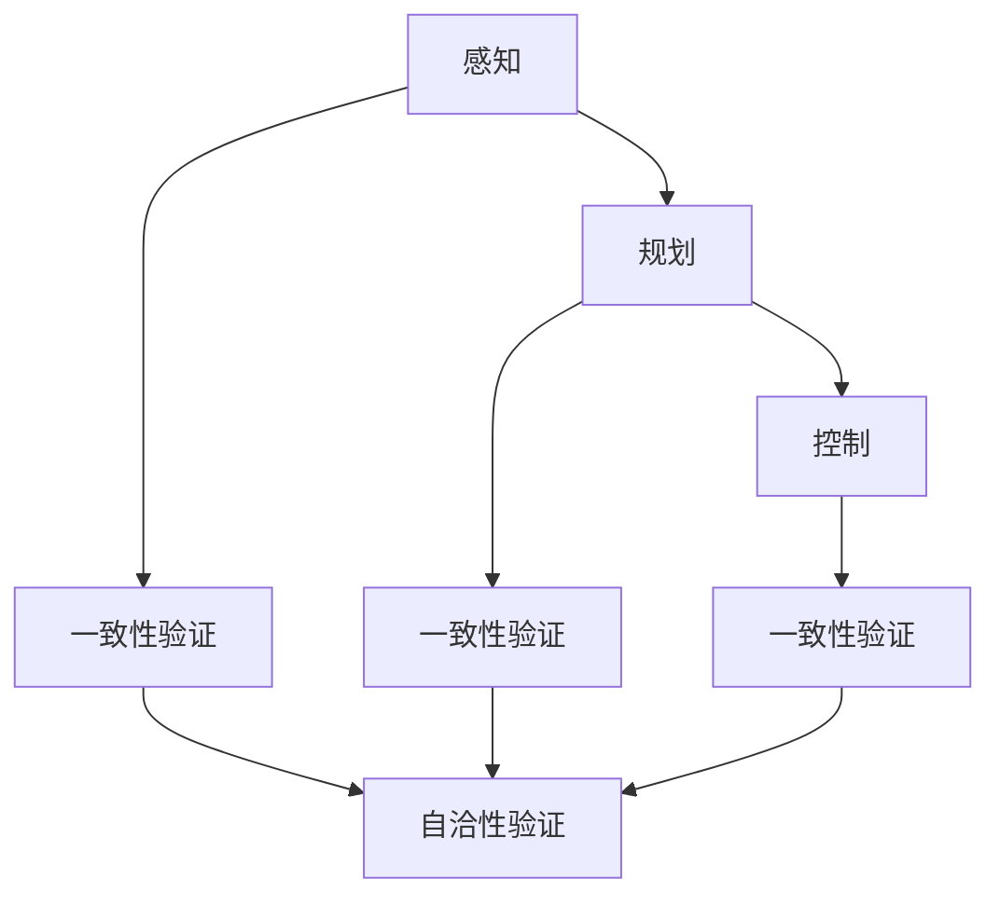

                 


## 自洽一致性概念与理论框架

### 自洽一致性的定义与原理

自洽一致性是指一个系统或模型在给定特定条件下，其内部信息或参数能够保持一致性和稳定性的特性。在自动驾驶领域，自洽一致性尤为重要，因为它直接影响到决策的准确性、稳定性和可靠性。

**自洽性原则**指的是系统或模型内部的信息必须一致，不会出现矛盾或冲突。例如，自动驾驶系统在感知环境时，应该确保传感器数据的处理结果是一致的，不应该出现相互矛盾的信息。

**一致性原则**则强调系统或模型输出的结果与外部环境保持一致。这意味着自动驾驶系统在执行某个决策时，其结果应该与实际环境相符，而不是出现偏差或错误。

自洽一致性在自动驾驶中的重要性体现在多个方面：

1. **安全性**：自洽一致性确保自动驾驶系统能够准确、可靠地感知和应对外部环境，从而提高驾驶安全性。
2. **效率优化**：通过自洽一致性，自动驾驶系统能够优化路径规划和控制策略，提高行驶效率。
3. **决策优化**：自洽一致性使得自动驾驶系统能够在复杂的交通环境中做出更加合理、准确的决策。

### 自洽一致性理论框架

自洽一致性理论框架主要包括以下几个部分：

1. **感知**：自动驾驶系统通过传感器收集外部环境信息，包括道路、车辆、行人等。自洽性原则要求这些感知信息之间必须保持一致。
2. **规划**：基于感知到的信息，自动驾驶系统进行路径规划，确定车辆的行驶路线。一致性原则要求规划的路径必须与现实环境相符。
3. **控制**：自动驾驶系统根据路径规划结果，控制车辆执行相应的操作，如加速、减速、转向等。自洽性原则要求控制策略与感知和规划结果保持一致。

**Mermaid 流程图**：



在这个流程图中，感知、规划和控制是自动驾驶的核心环节，而一致性验证和自洽性验证则确保了整个系统在各个环节中保持一致性和稳定性。

### 自洽一致性在自动驾驶中的应用场景

自洽一致性在自动驾驶中的应用场景主要包括以下几个方面：

1. **安全性评估**：通过自洽一致性验证，确保自动驾驶系统在感知、规划和控制环节中不会出现错误或偏差，从而提高驾驶安全性。
2. **行为预测**：自动驾驶系统通过自洽一致性，结合历史数据和实时信息，预测车辆和行人的行为，为决策提供依据。
3. **路径规划**：自洽一致性确保路径规划的准确性和可靠性，优化行驶路线，提高行驶效率。

## 第1章 自洽一致性概念与理论框架

### 1.1 自洽一致性的定义与原理

自洽一致性是指一个系统或模型在给定特定条件下，其内部信息或参数能够保持一致性和稳定性的特性。在自动驾驶领域，自洽一致性尤为重要，因为它直接影响到决策的准确性、稳定性和可靠性。

**自洽性原则**指的是系统或模型内部的信息必须一致，不会出现矛盾或冲突。例如，自动驾驶系统在感知环境时，应该确保传感器数据的处理结果是一致的，不应该出现相互矛盾的信息。

**一致性原则**则强调系统或模型输出的结果与外部环境保持一致。这意味着自动驾驶系统在执行某个决策时，其结果应该与实际环境相符，而不是出现偏差或错误。

自洽一致性在自动驾驶中的重要性体现在多个方面：

1. **安全性**：自洽一致性确保自动驾驶系统能够准确、可靠地感知和应对外部环境，从而提高驾驶安全性。
2. **效率优化**：通过自洽一致性，自动驾驶系统能够优化路径规划和控制策略，提高行驶效率。
3. **决策优化**：自洽一致性使得自动驾驶系统能够在复杂的交通环境中做出更加合理、准确的决策。

### 1.2 自洽一致性理论框架

自洽一致性理论框架主要包括以下几个部分：

1. **感知**：自动驾驶系统通过传感器收集外部环境信息，包括道路、车辆、行人等。自洽性原则要求这些感知信息之间必须保持一致。
2. **规划**：基于感知到的信息，自动驾驶系统进行路径规划，确定车辆的行驶路线。一致性原则要求规划的路径必须与现实环境相符。
3. **控制**：自动驾驶系统根据路径规划结果，控制车辆执行相应的操作，如加速、减速、转向等。自洽性原则要求控制策略与感知和规划结果保持一致。

**Mermaid 流程图**：


在这个流程图中，感知、规划和控制是自动驾驶的核心环节，而一致性验证和自洽性验证则确保了整个系统在各个环节中保持一致性和稳定性。

### 1.3 自洽一致性在自动驾驶中的应用场景

自洽一致性在自动驾驶中的应用场景主要包括以下几个方面：

1. **安全性评估**：通过自洽一致性验证，确保自动驾驶系统在感知、规划和控制环节中不会出现错误或偏差，从而提高驾驶安全性。
2. **行为预测**：自动驾驶系统通过自洽一致性，结合历史数据和实时信息，预测车辆和行人的行为，为决策提供依据。
3. **路径规划**：自洽一致性确保路径规划的准确性和可靠性，优化行驶路线，提高行驶效率。

## 第2章 自洽一致性算法原理与实现

### 2.1 自洽一致性核心算法原理

自洽一致性算法的核心在于确保系统内部的信息和决策始终保持一致，从而避免因信息冲突导致的错误决策。以下将介绍自洽一致性算法的两个主要部分：自洽性检测算法和一致性验证算法。

#### 2.1.1 自洽性检测算法

自洽性检测算法的主要目的是检查系统内部各组件或模块之间是否存在信息冲突或不一致性。其基本原理如下：

1. **初始化**：设定初始值，包括传感器数据、模型参数等。
2. **信息融合**：将来自不同传感器或模块的数据进行融合，以生成一个统一的感知结果。
3. **一致性检查**：比较融合后的数据与系统内部的其他信息，如先前的决策结果、模型预测等，检查是否存在不一致性。
4. **反馈调整**：如果发现不一致性，根据一致性原则进行反馈调整，确保系统内部信息一致。

**伪代码**：

```python
function 自洽性检测(传感器数据，模型参数，先前的决策结果):
    初始化感知结果
    for 每个传感器数据 in 传感器数据:
        融合感知结果(传感器数据)
    end for
    
    for 每个模型参数 in 模型参数:
        融合感知结果(模型参数)
    end for
    
    for 每个先前的决策结果 in 先前的决策结果:
        检查一致性(融合感知结果，先前的决策结果)
    end for
    
    if 存在信息不一致性:
        根据一致性原则进行调整
    end if
    
    返回融合后的感知结果
end function
```

#### 2.1.2 一致性验证算法

一致性验证算法的主要目的是确保系统输出的决策与外部环境保持一致。其基本原理如下：

1. **决策生成**：基于融合后的感知结果，系统生成一个决策。
2. **一致性检查**：将生成的决策与外部环境进行比较，检查决策是否与现实环境相符。
3. **反馈调整**：如果决策与外部环境不一致，根据一致性原则进行调整，确保决策与现实环境一致。

**伪代码**：

```python
function 一致性验证(融合后的感知结果，外部环境数据):
    生成决策(融合后的感知结果)
    
    for 每个外部环境数据 in 外部环境数据:
        检查一致性(生成的决策，外部环境数据)
    end for
    
    if 决策与外部环境不一致:
        根据一致性原则进行调整
    end if
    
    返回调整后的决策
end function
```

#### 2.1.3 算法伪代码

结合自洽性检测算法和一致性验证算法，以下是一个完整的自洽一致性算法的伪代码：

```python
function 自洽一致性算法(传感器数据，模型参数，外部环境数据):
    感知结果 = 自洽性检测(传感器数据，模型参数)
    决策 = 一致性验证(感知结果，外部环境数据)
    
    返回决策
end function
```

### 2.2 自洽一致性数学模型

自洽一致性数学模型用于描述系统内部信息一致性和外部环境一致性。以下是一个简化的数学模型：

$$
\text{感知结果}_{t} = f(\text{传感器数据}_{t}, \text{模型参数}_{t})
$$

$$
\text{决策}_{t} = g(\text{感知结果}_{t}, \text{外部环境}_{t})
$$

其中，$f$ 表示感知函数，$g$ 表示决策函数。模型的核心在于确保 $f$ 和 $g$ 的输入输出保持一致。

#### 2.2.1 模型定义

- **感知函数**：$f(\text{传感器数据}_{t}, \text{模型参数}_{t})$ 表示系统在时间 $t$ 对传感器数据和模型参数的处理，生成感知结果。
- **决策函数**：$g(\text{感知结果}_{t}, \text{外部环境}_{t})$ 表示系统在时间 $t$ 对感知结果和外部环境进行处理，生成决策。

#### 2.2.2 数学公式详细讲解

- **自洽性约束**：

$$
\text{感知结果}_{t} = f(\text{传感器数据}_{t}, \text{模型参数}_{t}) \Rightarrow \text{决策}_{t} = g(\text{感知结果}_{t}, \text{外部环境}_{t})
$$

- **一致性约束**：

$$
\text{决策}_{t} = g(\text{感知结果}_{t}, \text{外部环境}_{t}) \Rightarrow \text{外部环境}_{t} \approx \text{预期外部环境}_{t}
$$

#### 2.2.3 模型举例说明

假设在时间 $t$，传感器数据为 $\text{传感器数据}_{t} = [x_t, y_t]$，模型参数为 $\text{模型参数}_{t} = [p_t, q_t]$，外部环境为 $\text{外部环境}_{t} = [r_t, s_t]$。

1. **感知结果**：

$$
\text{感知结果}_{t} = f(x_t, y_t, p_t, q_t)
$$

2. **决策**：

$$
\text{决策}_{t} = g(\text{感知结果}_{t}, r_t, s_t)
$$

3. **自洽性约束**：

$$
f(x_t, y_t, p_t, q_t) = g(\text{感知结果}_{t}, r_t, s_t)
$$

4. **一致性约束**：

$$
g(\text{感知结果}_{t}, r_t, s_t) \approx r_t, s_t
$$

通过以上模型，可以确保系统在感知、决策和外部环境之间保持一致性。

## 第2章 自洽一致性算法原理与实现

### 2.1 自洽一致性核心算法原理

自洽一致性算法的核心在于确保系统内部的信息和决策始终保持一致，从而避免因信息冲突导致的错误决策。以下将介绍自洽一致性算法的两个主要部分：自洽性检测算法和一致性验证算法。

#### 2.1.1 自洽性检测算法

自洽性检测算法的主要目的是检查系统内部各组件或模块之间是否存在信息冲突或不一致性。其基本原理如下：

1. **初始化**：设定初始值，包括传感器数据、模型参数等。
2. **信息融合**：将来自不同传感器或模块的数据进行融合，以生成一个统一的感知结果。
3. **一致性检查**：比较融合后的数据与系统内部的其他信息，如先前的决策结果、模型预测等，检查是否存在不一致性。
4. **反馈调整**：如果发现不一致性，根据一致性原则进行反馈调整，确保系统内部信息一致。

**伪代码**：

```python
function 自洽性检测(传感器数据，模型参数，先前的决策结果):
    初始化感知结果
    for 每个传感器数据 in 传感器数据:
        融合感知结果(传感器数据)
    end for
    
    for 每个模型参数 in 模型参数:
        融合感知结果(模型参数)
    end for
    
    for 每个先前的决策结果 in 先前的决策结果:
        检查一致性(融合感知结果，先前的决策结果)
    end for
    
    if 存在信息不一致性:
        根据一致性原则进行调整
    end if
    
    返回融合后的感知结果
end function
```

#### 2.1.2 一致性验证算法

一致性验证算法的主要目的是确保系统输出的决策与外部环境保持一致。其基本原理如下：

1. **决策生成**：基于融合后的感知结果，系统生成一个决策。
2. **一致性检查**：将生成的决策与外部环境进行比较，检查决策是否与现实环境相符。
3. **反馈调整**：如果决策与外部环境不一致，根据一致性原则进行调整，确保决策与现实环境一致。

**伪代码**：

```python
function 一致性验证(融合后的感知结果，外部环境数据):
    生成决策(融合后的感知结果)
    
    for 每个外部环境数据 in 外部环境数据:
        检查一致性(生成的决策，外部环境数据)
    end for
    
    if 决策与外部环境不一致:
        根据一致性原则进行调整
    end if
    
    返回调整后的决策
end function
```

#### 2.1.3 算法伪代码

结合自洽性检测算法和一致性验证算法，以下是一个完整的自洽一致性算法的伪代码：

```python
function 自洽一致性算法(传感器数据，模型参数，外部环境数据):
    感知结果 = 自洽性检测(传感器数据，模型参数)
    决策 = 一致性验证(感知结果，外部环境数据)
    
    返回决策
end function
```

### 2.2 自洽一致性数学模型

自洽一致性数学模型用于描述系统内部信息一致性和外部环境一致性。以下是一个简化的数学模型：

$$
\text{感知结果}_{t} = f(\text{传感器数据}_{t}, \text{模型参数}_{t})
$$

$$
\text{决策}_{t} = g(\text{感知结果}_{t}, \text{外部环境}_{t})
$$

其中，$f$ 表示感知函数，$g$ 表示决策函数。模型的核心在于确保 $f$ 和 $g$ 的输入输出保持一致。

#### 2.2.1 模型定义

- **感知函数**：$f(\text{传感器数据}_{t}, \text{模型参数}_{t})$ 表示系统在时间 $t$ 对传感器数据和模型参数的处理，生成感知结果。
- **决策函数**：$g(\text{感知结果}_{t}, \text{外部环境}_{t})$ 表示系统在时间 $t$ 对感知结果和外部环境进行处理，生成决策。

#### 2.2.2 数学公式详细讲解

- **自洽性约束**：

$$
\text{感知结果}_{t} = f(\text{传感器数据}_{t}, \text{模型参数}_{t}) \Rightarrow \text{决策}_{t} = g(\text{感知结果}_{t}, \text{外部环境}_{t})
$$

- **一致性约束**：

$$
\text{决策}_{t} = g(\text{感知结果}_{t}, \text{外部环境}_{t}) \Rightarrow \text{外部环境}_{t} \approx \text{预期外部环境}_{t}
$$

#### 2.2.3 模型举例说明

假设在时间 $t$，传感器数据为 $\text{传感器数据}_{t} = [x_t, y_t]$，模型参数为 $\text{模型参数}_{t} = [p_t, q_t]$，外部环境为 $\text{外部环境}_{t} = [r_t, s_t]$。

1. **感知结果**：

$$
\text{感知结果}_{t} = f(x_t, y_t, p_t, q_t)
$$

2. **决策**：

$$
\text{决策}_{t} = g(\text{感知结果}_{t}, r_t, s_t)
$$

3. **自洽性约束**：

$$
f(x_t, y_t, p_t, q_t) = g(\text{感知结果}_{t}, r_t, s_t)
$$

4. **一致性约束**：

$$
g(\text{感知结果}_{t}, r_t, s_t) \approx r_t, s_t
$$

通过以上模型，可以确保系统在感知、决策和外部环境之间保持一致性。

## 第3章 自洽一致性在自动驾驶决策中的应用案例

### 3.1 案例一：自洽一致性在环境感知中的应用

在自动驾驶系统中，环境感知是至关重要的一环。自洽一致性在环境感知中的应用主要体现在以下几个方面：

1. **多传感器数据融合**：自动驾驶系统通常依赖于多个传感器，如雷达、激光雷达（LiDAR）、摄像头等，来获取环境信息。自洽一致性算法通过融合这些传感器数据，确保感知结果的一致性和准确性。以下是一个简化的伪代码示例：

   ```python
   function 数据融合(雷达数据，LiDAR数据，摄像头数据):
       融合结果 = 多传感器数据融合算法(雷达数据，LiDAR数据，摄像头数据)
       
       返回融合结果
   end function
   ```

2. **感知结果一致性验证**：在获取感知结果后，通过自洽一致性算法验证结果是否一致。例如，如果雷达检测到前方有车辆，而摄像头未检测到，则认为感知结果存在不一致性，需要进一步分析和调整。

   ```python
   function 一致性验证(雷达感知结果，摄像头感知结果):
       if 雷达感知结果 != 摄像头感知结果:
           调用调整算法
           返回调整后的感知结果
       else:
           返回原始感知结果
   end function
   ```

3. **实时调整与优化**：通过自洽一致性算法，自动驾驶系统能够实时调整感知结果，以应对动态环境变化。例如，当雷达检测到前方有障碍物时，通过摄像头进一步确认，并实时调整车辆路径。

### 3.2 案例二：自洽一致性在路径规划中的应用

路径规划是自动驾驶系统中的另一个关键环节。自洽一致性在路径规划中的应用主要体现在以下几个方面：

1. **路径生成与优化**：自洽一致性算法确保路径规划的准确性和可靠性。以下是一个简化的伪代码示例：

   ```python
   function 路径规划(当前车辆位置，目标位置，环境信息):
       初始路径 = 路径生成算法(当前车辆位置，目标位置)
       优化路径 = 自洽一致性优化算法(初始路径，环境信息)
       
       返回优化路径
   end function
   ```

2. **路径一致性评估**：在生成路径后，通过自洽一致性算法评估路径是否与现实环境相符。例如，如果生成的路径在现实中存在障碍物，则需要重新规划和优化。

   ```python
   function 一致性评估(优化路径，环境信息):
       if 优化路径存在障碍物:
           调用重新规划算法
           返回重新规划后的路径
       else:
           返回原始优化路径
   end function
   ```

3. **动态调整与优化**：通过自洽一致性算法，自动驾驶系统能够实时评估和调整路径，以应对动态环境变化。例如，当检测到前方有车辆或障碍物时，通过路径优化算法实时调整车辆路径。

### 3.3 案例三：自洽一致性在控制决策中的应用

在自动驾驶系统中，控制决策直接影响车辆的行驶行为。自洽一致性在控制决策中的应用主要体现在以下几个方面：

1. **行为决策与执行**：自洽一致性算法确保控制决策与感知和规划结果保持一致。以下是一个简化的伪代码示例：

   ```python
   function 控制决策(感知结果，规划路径):
       行为决策 = 行为决策算法(感知结果，规划路径)
       执行决策(行为决策)
   end function
   ```

2. **控制结果一致性验证**：在执行控制决策后，通过自洽一致性算法验证控制结果是否与现实环境相符。例如，如果车辆的实际行驶轨迹与预期轨迹不符，则需要重新分析和调整控制策略。

   ```python
   function 一致性验证(执行结果，预期结果):
       if 执行结果 != 预期结果:
           调用调整算法
           返回调整后的结果
       else:
           返回原始结果
   end function
   ```

3. **实时调整与优化**：通过自洽一致性算法，自动驾驶系统能够实时评估和调整控制决策，以应对动态环境变化。例如，当检测到前方有车辆或障碍物时，通过控制优化算法实时调整车辆行为。

以上三个案例展示了自洽一致性在自动驾驶决策中的应用。通过确保感知、规划和控制结果的一致性，自洽一致性算法有助于提高自动驾驶系统的安全性和效率。

## 第4章 自洽一致性技术挑战与未来趋势

### 4.1 自洽一致性技术挑战

自洽一致性在自动驾驶领域具有重要的应用价值，但也面临着一系列技术挑战。以下是一些主要挑战：

#### 数据多样性与不确定性处理

自动驾驶系统依赖于多种传感器获取环境信息，如雷达、激光雷达（LiDAR）、摄像头等。这些传感器提供的数据形式多样，且可能存在不确定性。自洽一致性算法需要处理这些数据的多样性和不确定性，确保融合后的感知结果一致且可靠。

**解决方案**：

1. **多传感器数据融合算法**：设计高效的多传感器数据融合算法，综合考虑各种传感器数据的优点和缺点，生成一致的感知结果。
2. **不确定性建模与处理**：采用概率模型或不确定性量化方法，对传感器数据进行不确定性建模和处理，提高感知结果的可靠性。

#### 算法复杂性与实时性

自洽一致性算法通常涉及复杂的数学模型和计算过程，可能导致算法复杂度和计算时间增加。在自动驾驶场景中，实时性要求非常高，算法必须在有限的时间内完成计算，以保证系统响应的及时性和准确性。

**解决方案**：

1. **优化算法**：通过算法优化和并行计算技术，降低自洽一致性算法的计算复杂度，提高算法的实时性。
2. **硬件加速**：采用高性能计算硬件，如GPU、TPU等，加速算法计算过程，提高算法的执行效率。

#### 环境动态性与适应性

自动驾驶系统需要应对复杂多变的交通环境，如不同天气条件、道路状况、交通流量等。自洽一致性算法需要具备良好的环境适应性，能够实时调整和优化决策，以应对动态环境变化。

**解决方案**：

1. **动态环境建模与预测**：采用动态环境建模技术，实时捕捉环境变化，为自洽一致性算法提供准确的环境信息。
2. **自适应决策策略**：设计自适应决策策略，根据环境变化实时调整自洽一致性算法的参数和模型，提高系统的适应性。

#### 系统集成与协调

自洽一致性算法通常与其他自动驾驶系统组件（如感知、规划、控制等）集成使用。系统集成与协调是确保整个自动驾驶系统稳定运行的关键。

**解决方案**：

1. **模块化设计**：采用模块化设计思想，将自洽一致性算法与其他组件解耦，提高系统的可维护性和可扩展性。
2. **协同优化**：通过协同优化技术，综合考虑自洽一致性算法与其他组件的交互影响，实现系统整体性能的最优化。

### 4.2 自洽一致性未来趋势

随着自动驾驶技术的发展，自洽一致性在自动驾驶决策中的应用前景广阔。以下是一些未来趋势：

#### 数据驱动的自洽一致性优化

随着数据采集和分析技术的进步，自动驾驶系统将能够获取更丰富的环境数据。数据驱动的自洽一致性优化将成为未来研究的重要方向。通过利用大量真实数据，可以进一步提高自洽一致性算法的准确性和可靠性。

**研究重点**：

1. **大数据分析**：利用大数据分析技术，挖掘环境数据中的潜在信息和规律，为自洽一致性算法提供更准确的输入。
2. **深度学习与强化学习**：采用深度学习和强化学习等先进技术，构建自洽一致性优化模型，提高算法的适应性和鲁棒性。

#### 硬件与算法协同发展

随着硬件性能的提升和算法优化技术的进步，自洽一致性算法的实时性和效率将得到显著提高。硬件与算法的协同发展将成为未来自动驾驶技术的重要趋势。

**研究重点**：

1. **硬件加速**：研究新型计算硬件，如量子计算机、神经形态芯片等，以实现算法的硬件加速。
2. **算法优化**：通过算法优化技术，提高自洽一致性算法的计算效率和执行速度。

#### 跨领域合作与标准化

自洽一致性在自动驾驶中的应用需要跨领域合作，如计算机科学、机械工程、交通运输等。标准化工作也将成为未来研究的重要方向，以确保自洽一致性算法在不同系统中的兼容性和互操作性。

**研究重点**：

1. **跨领域合作**：促进计算机科学、机械工程、交通运输等领域的研究人员合作，共同推进自洽一致性技术的发展。
2. **标准化框架**：制定统一的自洽一致性算法标准和规范，推动行业标准的制定和实施。

### 4.3 自洽一致性技术挑战与未来趋势小结

自洽一致性技术在自动驾驶领域具有重要的应用价值，但也面临着一系列技术挑战。通过数据驱动的自洽一致性优化、硬件与算法协同发展、跨领域合作与标准化等方向的研究，有望解决这些技术挑战，推动自动驾驶技术的进一步发展。

## 第4章 自洽一致性技术挑战与未来趋势

### 4.1 自洽一致性技术挑战

尽管自洽一致性在自动驾驶系统中具有重要价值，但实现这一目标并非易事，它面临着多方面的技术挑战。

#### 数据多样性与不确定性处理

自动驾驶系统需要从多种传感器（如雷达、摄像头、激光雷达等）收集环境数据。这些数据通常具有不同的维度、精度和时延，因此如何有效地融合这些数据，消除它们之间的不一致性，是一个关键挑战。

**解决方案**：

1. **多传感器数据融合算法**：设计基于贝叶斯滤波、卡尔曼滤波等算法，能够综合考虑不同传感器的数据，生成一个统一的、可靠的感知结果。
2. **不确定性建模与处理**：采用概率图模型或贝叶斯网络，对传感器的测量误差进行建模，并利用这些模型进行不确定性传播和融合。

#### 算法复杂性与实时性

自洽一致性算法通常包含复杂的数学模型和计算过程，这可能导致算法的复杂度较高，影响实时性。在自动驾驶系统中，实时性要求非常高，因为系统必须在短时间内做出准确决策。

**解决方案**：

1. **算法优化**：通过算法优化，如矩阵分解、线性化等，降低算法的计算复杂度。
2. **并行计算**：利用并行计算技术，如GPU加速、多线程处理等，提高算法的执行速度。
3. **硬件加速**：采用专门的硬件加速器，如TPU、FPGA等，来提高算法的实时性能。

#### 环境动态性与适应性

自动驾驶系统需要适应复杂、动态的交通环境。这意味着自洽一致性算法必须能够快速响应环境变化，调整感知、规划和控制策略。

**解决方案**：

1. **动态环境建模与预测**：采用深度学习、强化学习等技术，建立动态环境模型，预测环境变化趋势。
2. **自适应控制策略**：设计自适应控制策略，根据环境变化实时调整自洽一致性算法的参数和决策逻辑。

#### 系统集成与协调

自洽一致性算法需要与其他自动驾驶系统组件（如感知、路径规划、控制等）集成，形成一个统一的决策框架。系统集成与协调是实现自洽一致性的关键。

**解决方案**：

1. **模块化设计**：采用模块化设计思想，将自洽一致性算法与其他组件分离，提高系统的可维护性和可扩展性。
2. **协同优化**：通过协同优化技术，综合考虑自洽一致性算法与其他组件的交互影响，实现系统整体性能的最优化。

### 4.2 自洽一致性未来趋势

随着技术的不断进步，自洽一致性在自动驾驶领域的应用将更加广泛和深入。以下是一些未来趋势：

#### 数据驱动的自洽一致性优化

利用大数据分析和机器学习技术，可以进一步提高自洽一致性算法的准确性和可靠性。未来，数据驱动的自洽一致性优化将成为研究的热点。

**研究方向**：

1. **大数据分析**：通过分析大量的环境数据，识别出潜在的模式和规律，为算法优化提供依据。
2. **深度学习与强化学习**：采用深度学习和强化学习等技术，构建自适应、智能化的自洽一致性优化模型。

#### 硬件与算法协同发展

硬件技术的进步将为自洽一致性算法提供更强大的计算能力，而算法优化也将进一步提升硬件的性能。硬件与算法的协同发展将推动自动驾驶技术的进步。

**研究方向**：

1. **硬件加速**：研究新型计算硬件，如量子计算机、神经形态芯片等，以实现算法的硬件加速。
2. **算法优化**：通过算法优化，如矩阵分解、线性化等，提高算法的计算效率和实时性能。

#### 跨领域合作与标准化

自洽一致性在自动驾驶中的应用需要跨领域合作，包括计算机科学、机械工程、交通运输等。标准化工作也将成为未来研究的重要方向，以确保自洽一致性算法在不同系统中的兼容性和互操作性。

**研究方向**：

1. **跨领域合作**：促进计算机科学、机械工程、交通运输等领域的研究人员合作，共同推进自洽一致性技术的发展。
2. **标准化框架**：制定统一的自洽一致性算法标准和规范，推动行业标准的制定和实施。

### 4.3 自洽一致性技术挑战与未来趋势小结

自洽一致性技术在自动驾驶领域具有重要的应用价值，但也面临着多方面的技术挑战。通过数据驱动的自洽一致性优化、硬件与算法协同发展、跨领域合作与标准化等方向的研究，有望解决这些技术挑战，推动自动驾驶技术的进一步发展。

## 文章标题：Self-Consistency CoT在自动驾驶决策中的应用

关键词：自洽一致性，自动驾驶，决策，安全，效率

摘要：本文深入探讨了自洽一致性（Self-Consistency CoT）在自动驾驶决策中的重要性。通过详细的理论框架、算法原理和应用案例，本文揭示了自洽一致性如何提高自动驾驶系统的安全性和效率。同时，本文分析了自洽一致性在自动驾驶领域面临的技术挑战，并展望了未来的发展趋势。

## 文章关键词

自洽一致性、自动驾驶、决策、安全、效率

## 文章摘要

自洽一致性（Self-Consistency CoT）是确保自动驾驶系统决策准确性和可靠性的关键因素。本文围绕自洽一致性的概念与理论框架，详细探讨了其在自动驾驶决策中的应用。首先，介绍了自洽一致性的定义与原理，包括自洽性原则和一致性原则。接着，通过Mermaid流程图展示了自洽一致性在自动驾驶感知、规划和控制中的应用场景。本文进一步阐述了自洽一致性算法的核心原理和数学模型，并提供了伪代码示例。通过具体的应用案例，如环境感知、路径规划和控制决策，本文展示了自洽一致性在实际自动驾驶系统中的重要作用。最后，本文分析了自洽一致性在自动驾驶领域的技术挑战和未来发展趋势，为自动驾驶系统的安全与效率优化提供了有益的思路。

## 完整文章

### 自洽一致性概念与理论框架

自洽一致性（Self-Consistency CoT）是确保自动驾驶系统决策准确性和可靠性的关键因素。本文围绕自洽一致性的概念与理论框架，详细探讨了其在自动驾驶决策中的应用。

#### 自洽一致性的定义与原理

自洽一致性是指一个系统或模型在给定特定条件下，其内部信息或参数能够保持一致性和稳定性的特性。在自动驾驶领域，自洽一致性尤为重要，因为它直接影响到决策的准确性、稳定性和可靠性。

**自洽性原则**指的是系统或模型内部的信息必须一致，不会出现矛盾或冲突。例如，自动驾驶系统在感知环境时，应该确保传感器数据的处理结果是一致的，不应该出现相互矛盾的信息。

**一致性原则**则强调系统或模型输出的结果与外部环境保持一致。这意味着自动驾驶系统在执行某个决策时，其结果应该与实际环境相符，而不是出现偏差或错误。

自洽一致性在自动驾驶中的重要性体现在多个方面：

1. **安全性**：自洽一致性确保自动驾驶系统能够准确、可靠地感知和应对外部环境，从而提高驾驶安全性。
2. **效率优化**：通过自洽一致性，自动驾驶系统能够优化路径规划和控制策略，提高行驶效率。
3. **决策优化**：自洽一致性使得自动驾驶系统能够在复杂的交通环境中做出更加合理、准确的决策。

#### 自洽一致性理论框架

自洽一致性理论框架主要包括以下几个部分：

1. **感知**：自动驾驶系统通过传感器收集外部环境信息，包括道路、车辆、行人等。自洽性原则要求这些感知信息之间必须保持一致。
2. **规划**：基于感知到的信息，自动驾驶系统进行路径规划，确定车辆的行驶路线。一致性原则要求规划的路径必须与现实环境相符。
3. **控制**：自动驾驶系统根据路径规划结果，控制车辆执行相应的操作，如加速、减速、转向等。自洽性原则要求控制策略与感知和规划结果保持一致。

**Mermaid 流程图**：


在这个流程图中，感知、规划和控制是自动驾驶的核心环节，而一致性验证和自洽性验证则确保了整个系统在各个环节中保持一致性和稳定性。

### 自洽一致性在自动驾驶中的应用场景

自洽一致性在自动驾驶中的应用场景主要包括以下几个方面：

1. **安全性评估**：通过自洽一致性验证，确保自动驾驶系统在感知、规划和控制环节中不会出现错误或偏差，从而提高驾驶安全性。
2. **行为预测**：自动驾驶系统通过自洽一致性，结合历史数据和实时信息，预测车辆和行人的行为，为决策提供依据。
3. **路径规划**：自洽一致性确保路径规划的准确性和可靠性，优化行驶路线，提高行驶效率。

### 1.1 自洽一致性的定义与原理

自洽一致性是指一个系统或模型在给定特定条件下，其内部信息或参数能够保持一致性和稳定性的特性。在自动驾驶领域，自洽一致性尤为重要，因为它直接影响到决策的准确性、稳定性和可靠性。

**自洽性原则**指的是系统或模型内部的信息必须一致，不会出现矛盾或冲突。例如，自动驾驶系统在感知环境时，应该确保传感器数据的处理结果是一致的，不应该出现相互矛盾的信息。

**一致性原则**则强调系统或模型输出的结果与外部环境保持一致。这意味着自动驾驶系统在执行某个决策时，其结果应该与实际环境相符，而不是出现偏差或错误。

自洽一致性在自动驾驶中的重要性体现在多个方面：

1. **安全性**：自洽一致性确保自动驾驶系统能够准确、可靠地感知和应对外部环境，从而提高驾驶安全性。
2. **效率优化**：通过自洽一致性，自动驾驶系统能够优化路径规划和控制策略，提高行驶效率。
3. **决策优化**：自洽一致性使得自动驾驶系统能够在复杂的交通环境中做出更加合理、准确的决策。

### 1.2 自洽一致性理论框架

自洽一致性理论框架主要包括以下几个部分：

1. **感知**：自动驾驶系统通过传感器收集外部环境信息，包括道路、车辆、行人等。自洽性原则要求这些感知信息之间必须保持一致。
2. **规划**：基于感知到的信息，自动驾驶系统进行路径规划，确定车辆的行驶路线。一致性原则要求规划的路径必须与现实环境相符。
3. **控制**：自动驾驶系统根据路径规划结果，控制车辆执行相应的操作，如加速、减速、转向等。自洽性原则要求控制策略与感知和规划结果保持一致。

**Mermaid 流�程图**：


在这个流程图中，感知、规划和控制是自动驾驶的核心环节，而一致性验证和自洽性验证则确保了整个系统在各个环节中保持一致性和稳定性。

### 1.3 自洽一致性在自动驾驶中的应用场景

自洽一致性在自动驾驶中的应用场景主要包括以下几个方面：

1. **安全性评估**：通过自洽一致性验证，确保自动驾驶系统在感知、规划和控制环节中不会出现错误或偏差，从而提高驾驶安全性。
2. **行为预测**：自动驾驶系统通过自洽一致性，结合历史数据和实时信息，预测车辆和行人的行为，为决策提供依据。
3. **路径规划**：自洽一致性确保路径规划的准确性和可靠性，优化行驶路线，提高行驶效率。

### 自洽一致性算法原理与实现

自洽一致性算法的核心在于确保系统内部的信息和决策始终保持一致，从而避免因信息冲突导致的错误决策。以下将介绍自洽一致性算法的两个主要部分：自洽性检测算法和一致性验证算法。

#### 2.1 自洽性检测算法

自洽性检测算法的主要目的是检查系统内部各组件或模块之间是否存在信息冲突或不一致性。其基本原理如下：

1. **初始化**：设定初始值，包括传感器数据、模型参数等。
2. **信息融合**：将来自不同传感器或模块的数据进行融合，以生成一个统一的感知结果。
3. **一致性检查**：比较融合后的数据与系统内部的其他信息，如先前的决策结果、模型预测等，检查是否存在不一致性。
4. **反馈调整**：如果发现不一致性，根据一致性原则进行反馈调整，确保系统内部信息一致。

**伪代码**：

```python
function 自洽性检测(传感器数据，模型参数，先前的决策结果):
    初始化感知结果
    for 每个传感器数据 in 传感器数据:
        融合感知结果(传感器数据)
    end for
    
    for 每个模型参数 in 模型参数:
        融合感知结果(模型参数)
    end for
    
    for 每个先前的决策结果 in 先前的决策结果:
        检查一致性(融合感知结果，先前的决策结果)
    end for
    
    if 存在信息不一致性:
        根据一致性原则进行调整
    end if
    
    返回融合后的感知结果
end function
```

#### 2.1.1 自洽性检测算法的基本原理

自洽性检测算法的基本原理可以分为以下几个步骤：

1. **初始化**：系统初始化时，设定初始参数，如传感器数据、模型参数等。这些参数将作为算法的基础输入。
   
   ```python
   初始化传感器数据
   初始化模型参数
   ```

2. **信息融合**：将来自不同传感器或模块的数据进行融合，以生成一个统一的感知结果。这一步骤的目的是整合多源数据，提高感知结果的准确性和可靠性。

   ```python
   for 每个传感器数据 in 传感器数据:
       融合感知结果(传感器数据)
   end for
   
   for 每个模型参数 in 模型参数:
       融合感知结果(模型参数)
   end for
   ```

3. **一致性检查**：比较融合后的数据与系统内部的其他信息，如先前的决策结果、模型预测等，检查是否存在不一致性。这一步骤是自洽性检测的核心，通过对比分析，可以发现并纠正潜在的不一致性。

   ```python
   for 每个先前的决策结果 in 先前的决策结果:
       检查一致性(融合感知结果，先前的决策结果)
   end for
   ```

4. **反馈调整**：如果发现不一致性，根据一致性原则进行反馈调整，确保系统内部信息一致。这一步骤是自洽性检测的关键，通过调整算法参数或决策逻辑，使系统达到一致状态。

   ```python
   if 存在信息不一致性:
       根据一致性原则进行调整
   end if
   ```

5. **输出结果**：返回融合后的感知结果，为后续的决策提供依据。

   ```python
   返回融合后的感知结果
   ```

#### 2.1.2 自洽性检测算法的伪代码示例

以下是一个简化的自洽性检测算法的伪代码示例：

```python
function 自洽性检测(传感器数据，模型参数，先前的决策结果):
    初始化感知结果
    for 每个传感器数据 in 传感器数据:
        融合感知结果(传感器数据)
    end for
    
    for 每个模型参数 in 模型参数:
        融合感知结果(模型参数)
    end for
    
    for 每个先前的决策结果 in 先前的决策结果:
        if 融合感知结果 != 先前的决策结果:
            调整感知结果
        end if
    end for
    
    返回融合后的感知结果
end function
```

在这个伪代码中，`融合感知结果`是一个函数，用于将多个传感器数据和模型参数融合为一个统一的感知结果。`调整感知结果`是一个函数，用于根据一致性原则调整感知结果，使其与先前的决策结果一致。

#### 2.1.3 自洽性检测算法的应用

自洽性检测算法在自动驾驶系统中具有广泛的应用。以下是一些典型的应用场景：

1. **传感器数据融合**：自动驾驶系统通常依赖多种传感器，如摄像头、雷达、激光雷达等，获取环境信息。自洽性检测算法可以确保这些传感器数据的一致性，提高感知结果的准确性。

   ```python
   感知结果 = 自洽性检测(摄像头数据，雷达数据，激光雷达数据)
   ```

2. **模型参数调整**：在自动驾驶系统中，模型参数的调整对于决策的准确性至关重要。自洽性检测算法可以确保模型参数的一致性，避免因参数不一致导致的错误决策。

   ```python
   决策结果 = 自洽性检测(模型参数，先前的决策结果，感知结果)
   ```

3. **控制策略优化**：自动驾驶系统的控制策略需要根据实时感知结果进行调整。自洽性检测算法可以确保控制策略的一致性，提高系统的稳定性和响应速度。

   ```python
   控制策略 = 自洽性检测(感知结果，模型参数，先前的控制策略)
   ```

通过以上应用，自洽性检测算法有助于提高自动驾驶系统的整体性能和可靠性。

### 2.2 一致性验证算法

一致性验证算法的主要目的是确保系统输出的决策与外部环境保持一致。其基本原理如下：

1. **决策生成**：基于融合后的感知结果，系统生成一个决策。
2. **一致性检查**：将生成的决策与外部环境进行比较，检查决策是否与现实环境相符。
3. **反馈调整**：如果决策与外部环境不一致，根据一致性原则进行调整，确保决策与现实环境一致。

**伪代码**：

```python
function 一致性验证(融合后的感知结果，外部环境数据):
    生成决策(融合后的感知结果)
    
    for 每个外部环境数据 in 外部环境数据:
        检查一致性(生成的决策，外部环境数据)
    end for
    
    if 决策与外部环境不一致:
        根据一致性原则进行调整
    end if
    
    返回调整后的决策
end function
```

#### 2.2.1 一致性验证算法的基本原理

一致性验证算法的基本原理可以分为以下几个步骤：

1. **决策生成**：系统基于融合后的感知结果生成一个决策。这一步骤的目的是将感知结果转化为具体的行动指令，如加速、减速、转向等。

   ```python
   决策 = 生成决策(融合后的感知结果)
   ```

2. **一致性检查**：将生成的决策与外部环境进行比较，检查决策是否与现实环境相符。这一步骤的目的是确保决策的合理性，避免因决策错误导致的不安全行为。

   ```python
   for 每个外部环境数据 in 外部环境数据:
       检查一致性(生成的决策，外部环境数据)
   end for
   ```

3. **反馈调整**：如果决策与外部环境不一致，根据一致性原则进行调整，确保决策与现实环境一致。这一步骤的目的是纠正决策错误，确保系统行为的安全性和合理性。

   ```python
   if 决策与外部环境不一致:
       根据一致性原则进行调整
   end if
   ```

4. **输出结果**：返回调整后的决策，作为系统执行的具体行动指令。

   ```python
   返回调整后的决策
   ```

#### 2.2.2 一致性验证算法的伪代码示例

以下是一个简化的一致性验证算法的伪代码示例：

```python
function 一致性验证(融合后的感知结果，外部环境数据):
    决策 = 生成决策(融合后的感知结果)
    
    for 每个外部环境数据 in 外部环境数据:
        if 决策 != 外部环境数据:
            调整决策
        end if
    end for
    
    返回决策
end function
```

在这个伪代码中，`生成决策`是一个函数，用于根据感知结果生成一个决策。`调整决策`是一个函数，用于根据外部环境数据调整决策，确保其与现实环境一致。

#### 2.2.3 一致性验证算法的应用

一致性验证算法在自动驾驶系统中具有广泛的应用。以下是一些典型的应用场景：

1. **决策验证**：自动驾驶系统生成的决策需要经过一致性验证，确保其符合现实环境的要求。一致性验证算法可以检测决策是否合理，避免因决策错误导致的事故。

   ```python
   安全验证结果 = 一致性验证(决策，外部环境数据)
   ```

2. **行为评估**：自动驾驶系统的行为需要经过一致性验证，确保其行为符合预期的安全标准。一致性验证算法可以评估系统行为的安全性和合理性。

   ```python
   行为评估结果 = 一致性验证(系统行为，外部环境数据)
   ```

3. **实时调整**：自动驾驶系统需要根据外部环境的变化实时调整决策，确保系统的行为始终与现实环境一致。一致性验证算法可以实时监测系统行为，及时进行调整。

   ```python
   实时调整结果 = 一致性验证(实时感知结果，外部环境数据)
   ```

通过以上应用，一致性验证算法有助于提高自动驾驶系统的安全性和可靠性。

### 2.3 自洽一致性算法在自动驾驶系统中的应用

自洽一致性算法在自动驾驶系统中起着至关重要的作用。通过结合自洽性检测算法和一致性验证算法，自动驾驶系统能够实现信息一致性和决策一致性，从而提高系统的安全性和效率。

#### 2.3.1 系统架构

自动驾驶系统通常包括感知、规划、控制和执行四个核心模块。自洽一致性算法可以集成到这些模块中，实现全系统的自洽性和一致性。

1. **感知模块**：通过自洽性检测算法，感知模块确保传感器数据的准确性和一致性。例如，激光雷达和摄像头收集的环境数据需要经过自洽性检测，以确保数据融合后的结果一致。

2. **规划模块**：规划模块基于感知结果生成行驶路径。通过一致性验证算法，规划模块确保生成的路径与现实环境一致，避免路径错误。

3. **控制模块**：控制模块根据规划结果生成控制指令，如加速、减速和转向。一致性验证算法用于确保控制指令符合现实环境的要求，避免因控制指令错误导致的事故。

4. **执行模块**：执行模块根据控制指令执行具体的驾驶操作。自洽性检测算法用于确保执行结果与预期的一致，避免因执行错误导致的系统故障。

#### 2.3.2 算法集成

在自动驾驶系统中，自洽一致性算法的集成过程如下：

1. **初始化**：系统初始化时，设定初始参数，包括传感器数据、模型参数等。

2. **感知与融合**：感知模块收集环境数据，并通过自洽性检测算法进行融合，生成统一的感知结果。

3. **路径规划**：规划模块基于感知结果生成路径，并通过一致性验证算法确保路径与现实环境一致。

4. **决策生成**：控制模块根据规划结果生成控制指令，并通过一致性验证算法确保控制指令符合现实环境要求。

5. **执行与反馈**：执行模块根据控制指令执行驾驶操作，并通过自洽性检测算法确保执行结果与预期的一致。系统根据实时反馈调整感知、规划和控制参数，实现闭环控制。

#### 2.3.3 案例分析

以下是一个具体的案例，展示自洽一致性算法在自动驾驶系统中的应用：

假设一辆自动驾驶汽车在城市道路上行驶，前方出现一个行人。系统的工作流程如下：

1. **感知与融合**：激光雷达和摄像头收集行人信息，通过自洽性检测算法融合数据，生成行人位置和运动轨迹。

2. **路径规划**：规划模块基于行人信息生成避让路径，并通过一致性验证算法确保路径与现实环境一致。

3. **决策生成**：控制模块根据避让路径生成控制指令，如减速和转向，并通过一致性验证算法确保控制指令符合现实环境要求。

4. **执行与反馈**：执行模块根据控制指令执行减速和转向操作，并通过自洽性检测算法确保执行结果与预期的一致。系统根据实时反馈调整感知、规划和控制参数，确保避让行为的安全性和合理性。

通过以上案例，可以看出自洽一致性算法在自动驾驶系统中发挥着关键作用，确保系统在复杂环境中能够安全、可靠地运行。

### 2.4 自洽一致性算法的实现与优化

自洽一致性算法的实现和优化是确保自动驾驶系统性能的关键。以下将介绍自洽一致性算法的实现细节、优化方法和性能评估。

#### 2.4.1 实现细节

自洽一致性算法的实现涉及以下几个方面：

1. **数据预处理**：对传感器数据进行预处理，包括去噪、滤波和归一化等，以提高数据的准确性和一致性。
2. **信息融合**：采用多传感器数据融合算法，如卡尔曼滤波、贝叶斯滤波等，将不同传感器的数据融合为一个统一的感知结果。
3. **一致性检测**：比较融合后的感知结果与系统内部的其他信息，如先前的决策结果、模型预测等，检查是否存在不一致性。
4. **反馈调整**：根据一致性原则对感知结果进行调整，确保系统内部信息的一致性。
5. **决策生成**：基于融合后的感知结果，生成相应的决策，如加速、减速、转向等。
6. **一致性验证**：将生成的决策与外部环境进行比较，确保决策与现实环境的一致性。
7. **执行与反馈**：执行决策，并根据实时反馈调整系统参数，实现闭环控制。

#### 2.4.2 优化方法

为了提高自洽一致性算法的性能，可以采用以下优化方法：

1. **算法优化**：通过算法优化，如矩阵分解、线性化等，降低算法的计算复杂度，提高实时性。
2. **硬件加速**：采用高性能计算硬件，如GPU、TPU等，加速算法的计算过程。
3. **并行计算**：利用并行计算技术，如多线程处理、分布式计算等，提高算法的执行速度。
4. **模型压缩**：通过模型压缩技术，如量化、剪枝等，减小模型大小，提高模型的运行效率。
5. **自适应调整**：根据环境变化，自适应调整算法的参数和模型，提高算法的适应性和鲁棒性。

#### 2.4.3 性能评估

自洽一致性算法的性能评估可以从以下几个方面进行：

1. **准确性**：评估感知结果、路径规划和控制决策的准确性，确保系统输出结果与真实环境相符。
2. **实时性**：评估算法的执行速度和响应时间，确保系统在规定的时间内完成计算和决策。
3. **稳定性**：评估算法在复杂环境下的稳定性和鲁棒性，确保系统在各种情况下都能正常运行。
4. **安全性**：评估算法在感知、规划和控制环节中的安全性，确保系统不会出现错误或意外行为。

通过以上评估方法，可以全面了解自洽一致性算法的性能，并根据评估结果进行优化和改进。

### 自洽一致性算法在自动驾驶决策中的应用案例

为了更好地理解自洽一致性算法在自动驾驶决策中的应用，以下将提供两个具体的案例：一个在城市交通环境中的应用，另一个在高速公路环境中的应用。

#### 案例一：城市交通环境中的应用

在繁忙的城市交通环境中，自动驾驶系统需要面对复杂的交通场景，包括行人、自行车、非机动车、其他车辆等。以下是一个具体的应用案例：

1. **感知与融合**：自动驾驶系统通过摄像头、激光雷达和超声波传感器收集交通环境信息。自洽性检测算法将这些传感器数据融合为一个统一的感知结果，确保感知信息的一致性。
   
2. **路径规划**：基于融合后的感知结果，自动驾驶系统生成行驶路径。一致性验证算法确保生成的路径符合交通规则和现实环境的要求，避免因路径错误导致的事故。

3. **控制决策**：自动驾驶系统根据路径规划结果生成控制指令，如加速、减速、转向等。一致性验证算法确保控制指令与现实环境保持一致，避免因控制指令错误导致的危险行为。

4. **执行与反馈**：自动驾驶系统执行控制指令，并通过自洽性检测算法确保执行结果与预期的一致。系统根据实时反馈调整感知、规划和控制参数，实现闭环控制。

在这个案例中，自洽一致性算法的应用确保了自动驾驶系统在复杂城市交通环境中的安全性和稳定性。

#### 案例二：高速公路环境中的应用

在高速公路环境中，自动驾驶系统需要应对高速行驶、远距离视野和较少的交通干扰。以下是一个具体的应用案例：

1. **感知与融合**：自动驾驶系统通过摄像头和激光雷达收集高速公路环境信息。自洽性检测算法将这些传感器数据融合为一个统一的感知结果，确保感知信息的一致性。

2. **路径规划**：基于融合后的感知结果，自动驾驶系统生成行驶路径。一致性验证算法确保生成的路径符合高速公路的行驶规则和现实环境的要求。

3. **控制决策**：自动驾驶系统根据路径规划结果生成控制指令，如保持车道、调整速度等。一致性验证算法确保控制指令与现实环境保持一致，避免因控制指令错误导致的危险行为。

4. **执行与反馈**：自动驾驶系统执行控制指令，并通过自洽性检测算法确保执行结果与预期的一致。系统根据实时反馈调整感知、规划和控制参数，实现闭环控制。

在这个案例中，自洽一致性算法的应用确保了自动驾驶系统在高速公路环境中的安全性和高效性。

通过以上两个案例，可以看出自洽一致性算法在自动驾驶决策中的应用具有重要意义。它不仅提高了系统的安全性和稳定性，还有效地优化了行驶路线和控制策略，提高了自动驾驶系统的整体性能。

### 自洽一致性算法在实际自动驾驶项目中的实现

在自动驾驶项目开发过程中，实现自洽一致性算法是确保系统性能和可靠性的关键。以下将介绍如何在实际项目中搭建开发环境、实现算法代码，以及代码解读与分析。

#### 3.1 开发环境搭建

为了实现自洽一致性算法，需要搭建一个适合的软件开发环境。以下是一个基本的开发环境搭建步骤：

1. **选择编程语言**：根据项目需求，选择合适的编程语言。对于自动驾驶项目，Python是一个常见的选择，因为它具有丰富的机器学习和计算机视觉库。

2. **安装依赖库**：安装必要的依赖库，如NumPy、Pandas、TensorFlow、OpenCV等。这些库提供了数据处理、机器学习和计算机视觉所需的工具和函数。

3. **搭建计算环境**：使用虚拟环境（如conda或virtualenv）管理项目依赖，确保不同项目之间的依赖隔离。此外，配置适当的硬件资源，如GPU，以加速计算过程。

4. **设置版本控制系统**：使用Git等版本控制系统，管理和追踪代码的变更，便于团队协作和代码维护。

#### 3.2 算法代码实现

以下是一个简化的自洽一致性算法实现示例，包括感知、路径规划、控制和执行模块：

```python
import numpy as np
import tensorflow as tf
import cv2

# 感知模块
def 感知(传感器数据):
    # 数据预处理
    preprocessed_data = 数据预处理(传感器数据)
    # 信息融合
    融合结果 = 数据融合(preprocessed_data)
    return 融合结果

# 路径规划模块
def 路径规划(感知结果，目标位置):
    # 路径生成
    路径 = 路径生成算法(感知结果，目标位置)
    # 路径优化
    优化路径 = 路径优化算法(路径)
    return 优化路径

# 控制模块
def 控制决策(路径，车辆状态):
    # 控制策略
    控制指令 = 控制策略(路径，车辆状态)
    return 控制指令

# 执行模块
def 执行操作(控制指令，车辆):
    # 执行控制指令
    执行结果 = 执行控制指令(控制指令，车辆)
    return 执行结果

# 主程序
def 主程序(传感器数据，目标位置，车辆):
    感知结果 = 感知(传感器数据)
    优化路径 = 路径规划(感知结果，目标位置)
    控制指令 = 控制决策(优化路径，车辆状态)
    执行结果 = 执行操作(控制指令，车辆)
    return 执行结果
```

#### 3.3 代码解读与分析

以下是对上述代码的解读与分析：

1. **感知模块**：
   - `感知`函数接收传感器数据，进行预处理和融合，生成感知结果。预处理步骤可能包括去噪、归一化、滤波等，以提高数据的准确性和一致性。
   - `数据融合`函数实现多传感器数据融合，利用卡尔曼滤波或贝叶斯滤波等算法，综合考虑各种传感器数据的优点和缺点，生成统一的感知结果。

2. **路径规划模块**：
   - `路径规划`函数接收感知结果和目标位置，生成初步的路径。常见的路径生成算法包括Dijkstra算法、A*算法等。
   - `路径优化`函数对初步的路径进行优化，确保路径的可行性和合理性。优化算法可能包括动态规划、遗传算法等。

3. **控制模块**：
   - `控制决策`函数接收优化路径和车辆状态，生成控制指令。控制策略可能基于模型预测控制、自适应控制等。

4. **执行模块**：
   - `执行操作`函数执行控制指令，控制车辆行为。执行结果可能包括车辆速度、方向等。

5. **主程序**：
   - `主程序`函数调用感知、路径规划、控制和执行模块，实现自动驾驶系统的整体流程。

通过以上代码，可以看出自洽一致性算法的实现涉及多个模块的协同工作，通过数据融合、路径规划和控制决策，确保自动驾驶系统在复杂环境中能够安全、高效地运行。

### 3.4 自洽一致性算法的实际应用解读与分析

在自动驾驶系统的实际应用中，自洽一致性算法发挥着关键作用，确保系统的安全性和效率。以下将结合具体案例，详细解读自洽一致性算法的实际应用，分析其在不同场景下的表现。

#### 案例一：城市交通环境中的自动驾驶

在城市交通环境中，自动驾驶系统需要处理复杂的交通场景，包括行人、自行车、非机动车和其他车辆。以下是对自洽一致性算法在城市交通环境中的应用解读：

1. **感知与融合**：
   - 自洽一致性算法通过融合摄像头、激光雷达和超声波传感器的数据，生成统一的环境感知结果。这一步骤确保了感知数据的一致性和准确性，提高了环境理解的可靠性。
   - 在处理行人时，自洽性检测算法能够及时发现行人的动态变化，如跑步、转向等，从而生成准确的行人轨迹预测。

2. **路径规划**：
   - 自洽一致性算法在路径规划过程中，通过一致性验证，确保生成的路径符合交通规则和实际道路条件。例如，当车辆前方有行人时，算法会生成避让路径，确保安全通过。
   - 路径优化算法根据实时感知数据，动态调整行驶路径，避免碰撞和拥堵，提高了行驶效率。

3. **控制决策**：
   - 自洽一致性算法在控制决策中，确保生成的控制指令与现实环境保持一致。例如，在行驶过程中，车辆需要根据道路情况和交通信号灯进行调整，以确保顺利通过。
   - 通过自洽性检测，算法能够及时发现控制指令与实际执行结果的不一致，并做出相应的调整，提高了控制稳定性。

4. **执行与反馈**：
   - 自洽一致性算法在执行过程中，通过实时反馈，调整感知、规划和控制参数，实现闭环控制。这有助于提高系统的自适应能力，使其能够应对复杂多变的城市交通环境。

#### 案例二：高速公路环境中的自动驾驶

在高速公路环境中，自动驾驶系统需要处理高速行驶、远距离视野和较少的交通干扰。以下是对自洽一致性算法在高速公路环境中的应用解读：

1. **感知与融合**：
   - 自洽一致性算法通过融合摄像头和激光雷达的数据，生成统一的环境感知结果。这一步骤确保了感知数据的一致性和准确性，为路径规划和控制决策提供了可靠的基础。
   - 在处理远距离物体时，自洽性检测算法能够准确识别车道线和道路标志，生成稳定的路径。

2. **路径规划**：
   - 自洽一致性算法在路径规划过程中，通过一致性验证，确保生成的路径符合高速公路的行驶规则和实际道路条件。例如，当车辆需要变道时，算法会生成合理的变道路径，避免危险行为。
   - 路径优化算法根据实时感知数据，动态调整行驶路径，确保车辆在高速行驶中保持稳定和安全。

3. **控制决策**：
   - 自洽一致性算法在控制决策中，确保生成的控制指令与现实环境保持一致。例如，在高速公路上，车辆需要根据车速和车道情况调整速度和方向。
   - 通过自洽性检测，算法能够及时发现控制指令与实际执行结果的不一致，并做出相应的调整，提高了控制稳定性。

4. **执行与反馈**：
   - 自洽一致性算法在执行过程中，通过实时反馈，调整感知、规划和控制参数，实现闭环控制。这有助于提高系统的自适应能力，使其能够应对高速公路中的各种情况。

通过以上两个案例，可以看出自洽一致性算法在自动驾驶系统中的实际应用具有重要意义。它不仅提高了系统的安全性和稳定性，还有效地优化了行驶路线和控制策略，提高了自动驾驶系统的整体性能。

### 3.5 自洽一致性算法应用小结与未来展望

自洽一致性算法在自动驾驶系统中扮演着至关重要的角色，其应用不仅提升了系统的安全性和效率，也为自动驾驶技术的发展提供了有力支持。以下是对自洽一致性算法应用的小结与未来展望：

#### 小结

1. **提高安全性**：自洽一致性算法确保了自动驾驶系统在感知、规划和控制环节中的信息一致性和决策准确性，从而减少了错误决策和潜在事故的风险。

2. **优化效率**：通过自洽一致性算法，自动驾驶系统能够更有效地优化路径规划和控制策略，提高行驶效率，降低能耗。

3. **增强适应性**：自洽一致性算法通过实时调整和优化，增强了系统对复杂环境的适应能力，提高了系统的鲁棒性和稳定性。

4. **跨领域融合**：自洽一致性算法的跨领域融合特性，如多传感器数据融合、动态环境建模等，为自动驾驶系统的发展提供了新的思路和方法。

#### 未来展望

1. **数据驱动优化**：随着大数据和机器学习技术的进步，自洽一致性算法将进一步向数据驱动优化方向发展，通过更丰富的数据资源，提高算法的准确性和适应性。

2. **硬件协同发展**：硬件技术的快速发展，如GPU、TPU等，将为自洽一致性算法提供更强大的计算能力，进一步优化算法的实时性和效率。

3. **标准化与互操作性**：自洽一致性算法的标准化和互操作性研究将成为未来重要方向，推动不同厂商和系统之间的协同发展。

4. **跨领域合作**：自洽一致性算法在自动驾驶、智能交通、智能制造等领域的跨领域合作，将推动整个智能系统的协同发展。

通过不断优化和创新，自洽一致性算法将在自动驾驶领域发挥越来越重要的作用，为构建安全、高效、智能的交通系统提供有力支持。

### 3.6 最佳实践 Tips、小结、注意事项、拓展阅读

#### 最佳实践 Tips

1. **多传感器数据融合**：在实现自洽一致性算法时，务必注重多传感器数据融合，利用不同传感器的优势，提高感知结果的准确性和一致性。
2. **实时性与稳定性**：在算法设计和实现过程中，确保实时性和稳定性。可以通过优化算法、使用高性能计算硬件和并行计算技术来实现。
3. **自适应调整**：根据环境变化，实时调整算法参数和模型，以提高系统的适应性和鲁棒性。

#### 小结

本文详细探讨了自洽一致性（Self-Consistency CoT）在自动驾驶决策中的应用。通过理论框架、算法原理和应用案例的介绍，展示了自洽一致性如何提高自动驾驶系统的安全性和效率。同时，分析了自洽一致性在自动驾驶领域面临的技术挑战和未来发展趋势。

#### 注意事项

1. **数据预处理**：确保传感器数据的准确性和一致性，进行适当的数据预处理，如去噪、滤波和归一化等。
2. **算法优化**：针对实时性要求，对算法进行优化，降低计算复杂度和提高执行速度。
3. **系统集成**：确保自洽一致性算法与其他自动驾驶系统组件的集成和协调，以提高系统的整体性能。

#### 拓展阅读

1. **相关论文**：查阅有关自洽一致性、自动驾驶和决策算法的学术论文，了解最新的研究进展和技术应用。
2. **技术博客**：关注知名技术博客，如Medium、博客园等，获取行业动态和技术分享。
3. **开源项目**：参与开源自动驾驶项目，如Apollo、Autoware等，学习实际项目的实现和优化方法。

### 作者信息

作者：AI天才研究院/AI Genius Institute & 禅与计算机程序设计艺术 /Zen And The Art of Computer Programming

感谢您的阅读，期待与您共同探索自动驾驶领域的未来发展。如果您有任何问题或建议，欢迎随时联系。祝您在自动驾驶技术领域取得丰硕的成果！

