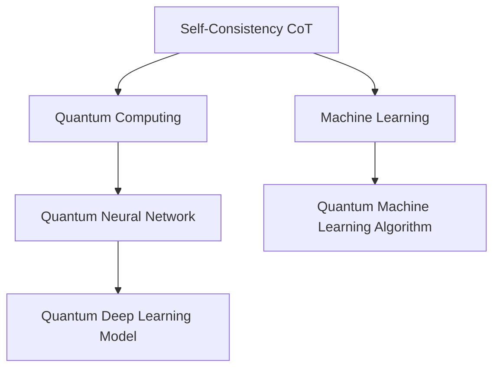

                 


Step 1: 提取核心概念与联系
- 从标题《Self-Consistency CoT在量子人工智能中的创新应用：融合量子计算与机器学习》中，我们提取出核心概念：Self-Consistency CoT、量子计算、机器学习、量子神经网络、量子机器学习算法和量子深度学习模型。
- 设计一个Mermaid流程图，展示这些概念之间的联系和相互作用。



Step 2: 设计章节结构
- 根据提取的核心概念，设计出各章节的大致结构。
- 确定每个章节的目标和主要内容。

章节结构设计如下：

### 第一部分：理论基础

#### 第1章：Self-Consistency CoT原理
- 目标：介绍Self-Consistency CoT的概念、特点和应用背景。

#### 第2章：量子计算基础
- 目标：介绍量子计算的基本原理、优势与挑战。

#### 第3章：机器学习基础
- 目标：介绍机器学习的基本概念、特征工程、模型选择、评估和优化。

### 第二部分：Self-Consistency CoT在量子人工智能中的应用

#### 第4章：量子神经网络
- 目标：介绍量子神经网络的原理、设计步骤和实现细节。

#### 第5章：量子机器学习算法
- 目标：介绍量子机器学习算法的概念、原理和应用。

#### 第6章：量子深度学习模型
- 目标：介绍量子深度学习模型的基本架构、优势和应用。

Step 3: 编写章节大纲
- 根据设计的章节结构，逐个编写每个章节的详细大纲。
- 在大纲中包含核心算法原理讲解、数学模型和公式、项目实战等。

章节大纲如下：

### 第1章：Self-Consistency CoT原理
- 1.1 Self-Consistency CoT的概念
  - Self-Consistency CoT的定义
  - Self-Consistency CoT的核心特点
- 1.2 Self-Consistency CoT的应用背景
  - 在机器学习中的应用
  - 在量子计算中的应用

### 第2章：量子计算基础
- 2.1 量子计算的基本原理
  - 量子位和量子态
  - 量子门和量子操作
  - 量子算法的基本框架
- 2.2 量子计算与经典计算的异同
  - 量子计算的优势
  - 量子计算的挑战

### 第3章：机器学习基础
- 3.1 机器学习的基本概念
  - 监督学习、无监督学习和强化学习
  - 特征工程和模型选择
  - 模型评估和优化
- 3.2 深度学习框架
  - TensorFlow和PyTorch
  - 其他深度学习框架简介

### 第4章：量子神经网络
- 4.1 量子神经网络的原理
  - 量子神经网络的基本结构
  - 量子神经网络的工作原理
  - 量子神经网络的优势
- 4.2 量子神经网络的设计与实现
  - 设计步骤
  - 实现细节
  - 源代码解读

### 第5章：量子机器学习算法
- 5.1 Self-Consistency CoT与量子机器学习算法的结合
  - Self-Consistency CoT在量子机器学习中的意义
  - Self-Consistency CoT与量子优化算法的结合
- 5.2 量子支持向量机（QSVM）
  - QSVM的原理
  - QSVM的伪代码
  - QSVM的案例分析

### 第6章：量子深度学习模型
- 6.1 量子深度学习模型的基本架构
  - 量子深度学习模型的基本架构
  - 量子深度学习模型的优势
  - 量子深度学习模型的应用

Step 4: 确保大纲完整性
- 确认大纲中涵盖了核心概念、原理、算法、数学模型、实战等方面。
- 确保每个章节都详细且逻辑清晰。

Step 5: 审查与优化
- 审查大纲，确保每个章节都符合简洁性的要求。
- 优化大纲的结构，确保其逻辑性和易读性。

最终，我们得到了以下目录大纲：

# 目录大纲

## 第一部分：理论基础

### 第1章：Self-Consistency CoT原理
- 1.1 Self-Consistency CoT的概念
  - Self-Consistency CoT的定义
  - Self-Consistency CoT的核心特点
- 1.2 Self-Consistency CoT的应用背景
  - 在机器学习中的应用
  - 在量子计算中的应用

### 第2章：量子计算基础
- 2.1 量子计算的基本原理
  - 量子位和量子态
  - 量子门和量子操作
  - 量子算法的基本框架
- 2.2 量子计算与经典计算的异同
  - 量子计算的优势
  - 量子计算的挑战

### 第3章：机器学习基础
- 3.1 机器学习的基本概念
  - 监督学习、无监督学习和强化学习
  - 特征工程和模型选择
  - 模型评估和优化
- 3.2 深度学习框架
  - TensorFlow和PyTorch
  - 其他深度学习框架简介

### 第二部分：Self-Consistency CoT在量子人工智能中的应用

### 第4章：量子神经网络
- 4.1 量子神经网络的原理
  - 量子神经网络的基本结构
  - 量子神经网络的工作原理
  - 量子神经网络的优势
- 4.2 量子神经网络的设计与实现
  - 设计步骤
  - 实现细节
  - 源代码解读

### 第5章：量子机器学习算法
- 5.1 Self-Consistency CoT与量子机器学习算法的结合
  - Self-Consistency CoT在量子机器学习中的意义
  - Self-Consistency CoT与量子优化算法的结合
- 5.2 量子支持向量机（QSVM）
  - QSVM的原理
  - QSVM的伪代码
  - QSVM的案例分析

### 第6章：量子深度学习模型
- 6.1 量子深度学习模型的基本架构
  - 量子深度学习模型的基本架构
  - 量子深度学习模型的优势
  - 量子深度学习模型的应用

现在，我们已经完成了目录大纲的设计，接下来将根据这个大纲逐步撰写每章的内容。首先，我们开始撰写第1章《Self-Consistency CoT原理》。

---

# 第1章：Self-Consistency CoT原理

## 1.1 Self-Consistency CoT的概念

Self-Consistency CoT（Self-Consistency Conditional Information Theory）是一种基于信息论和条件信息理论的方法，用于评估和优化机器学习和人工智能系统的性能。其核心思想是通过保持系统内部的一致性来提高学习效率和结果稳定性。

### 1.1.1 Self-Consistency CoT的定义

Self-Consistency CoT可以定义为：

$$
\text{Self-Consistency CoT} = \text{Condition of Self-Consistency in Conditional Information Theory}
$$

这个条件要求系统在给定某个条件时，其输出的信息与该条件保持一致。具体来说，这意味着系统的预测或决策结果在给定特定条件下应该是一致的，不会出现矛盾或不确定性。

### 1.1.2 Self-Consistency CoT的核心特点

Self-Consistency CoT具有以下几个核心特点：

1. **一致性**：系统在给定条件下输出的一致性是Self-Consistency CoT的核心要求。这意味着系统的决策或预测在相同条件下应该是一致的，不会出现矛盾。

2. **条件依赖性**：Self-Consistency CoT要求系统的输出与输入条件之间存在依赖关系。这种依赖性确保了系统在特定条件下能够做出合理的决策。

3. **可优化性**：Self-Consistency CoT提供了一种优化机制，通过调整系统内部参数来提高其一致性。这种优化可以通过多种方法实现，如梯度下降、遗传算法等。

4. **适应性**：Self-Consistency CoT能够适应不同的机器学习和人工智能应用场景。通过调整条件信息和一致性约束，可以适应不同的任务和数据集。

## 1.2 Self-Consistency CoT的应用背景

Self-Consistency CoT在机器学习和人工智能领域有广泛的应用背景。以下是一些主要的例子：

### 在机器学习中的应用

1. **预测模型**：Self-Consistency CoT可以用于改进预测模型的性能。通过确保模型输出的一致性，可以减少预测误差，提高模型的可靠性。

2. **优化算法**：Self-Consistency CoT可以用于优化机器学习算法的参数设置。通过调整一致性约束，可以找到更好的参数组合，提高算法的性能。

3. **模型评估**：Self-Consistency CoT提供了一种评估模型一致性的方法。通过分析模型输出的一致性，可以评估模型的可靠性和稳定性。

### 在量子计算中的应用

1. **量子机器学习**：Self-Consistency CoT可以用于改进量子机器学习算法的性能。通过确保量子算法输出的一致性，可以减少量子计算的错误率和提高计算效率。

2. **量子优化**：Self-Consistency CoT可以用于优化量子优化算法的参数设置。通过调整一致性约束，可以找到更好的参数组合，提高量子优化的效果。

3. **量子深度学习**：Self-Consistency CoT可以用于改进量子深度学习模型的结构和性能。通过确保量子神经网络输出的一致性，可以减少量子计算的错误率，提高模型的准确性。

### 在人工智能中的应用

1. **人工智能系统**：Self-Consistency CoT可以用于优化人工智能系统的性能。通过确保系统输出的一致性，可以减少系统的不确定性，提高系统的稳定性和可靠性。

2. **决策支持系统**：Self-Consistency CoT可以用于改进决策支持系统的效果。通过确保系统输出的一致性，可以减少决策错误，提高决策的准确性。

3. **人机交互**：Self-Consistency CoT可以用于改善人机交互体验。通过确保系统输出的一致性，可以减少用户的不适感和困惑，提高用户满意度。

### 总结

Self-Consistency CoT是一种强大的理论工具，可以在机器学习、量子计算和人工智能领域发挥重要作用。通过确保系统输出的一致性，可以提高系统的性能、可靠性和用户体验。在接下来的章节中，我们将进一步探讨Self-Consistency CoT在量子人工智能中的创新应用。

---

在撰写完第1章《Self-Consistency CoT原理》后，我们将继续撰写第2章《量子计算基础》。在这一章中，我们将介绍量子计算的基本原理、优势与挑战。

---

# 第2章：量子计算基础

## 2.1 量子计算的基本原理

量子计算是现代计算机科学的一个重要分支，它基于量子力学的基本原理。量子计算的基本单元是量子位（qubit），与经典计算机中的比特（bit）不同，qubit可以处于0和1的叠加状态，这使得量子计算机具有独特的计算能力和优势。

### 2.1.1 量子位和量子态

量子位（qubit）是量子计算的基本单元，它不仅可以表示0或1，还可以同时表示0和1的叠加状态。这种叠加状态可以用一个复数系数矩阵表示：

$$
|\psi\rangle = a|0\rangle + b|1\rangle
$$

其中，$a$和$b$是复数系数，$|0\rangle$和$|1\rangle$分别表示量子位的基础状态。

量子态的叠加是量子计算的核心特性之一，它使得量子计算机能够同时处理多个计算任务。例如，一个包含n个qubit的量子计算机可以表示$2^n$个不同的量子态。

### 2.1.2 量子门和量子操作

量子门是量子计算中的基本操作，类似于经典计算机中的逻辑门。量子门作用于量子态，通过改变量子态的叠加状态来实现特定的计算操作。常见的量子门包括Hadamard门（实现量子态的叠加）、Pauli门（实现量子态的旋转）和控制非门（实现量子态的翻转）。

量子门的操作可以用矩阵表示。例如，Hadamard门可以表示为：

$$
H = \frac{1}{\sqrt{2}}\begin{bmatrix}
1 & 1 \\
1 & -1
\end{bmatrix}
$$

通过量子门的组合，可以模拟出复杂的计算过程。例如，通过一系列的量子门操作，可以将一个初始态$|0\rangle$叠加到目标态$|1\rangle$。

### 2.1.3 量子算法的基本框架

量子算法是量子计算的核心，它利用量子计算的叠加和纠缠特性，实现了经典计算机无法实现的高效计算。量子算法的基本框架通常包括以下步骤：

1. **初始化**：将量子计算机的量子位初始化为特定的初始状态。
2. **量子操作**：通过量子门和量子操作，将量子态叠加到目标状态。
3. **测量**：测量量子计算机的量子态，获取计算结果。

一个经典的量子算法是量子快速排序算法，它利用量子计算的叠加特性，实现了线性时间复杂度的排序。

## 2.2 量子计算与经典计算的异同

量子计算与经典计算在计算模型、计算能力和计算复杂性方面存在显著差异。

### 2.2.1 量子计算的优势

1. **并行计算**：量子计算机可以利用量子态的叠加特性，实现并行计算。这意味着量子计算机可以在同一时间处理多个计算任务，从而大大提高计算效率。
2. **指数加速**：某些特定问题，如整数分解和搜索问题，量子计算机可以通过量子算法实现指数加速。例如，Shor算法利用量子计算实现了对大整数的快速分解。
3. **纠缠效应**：量子计算中的纠缠效应可以用于实现高效的量子通信和量子加密。

### 2.2.2 量子计算的挑战

1. **量子错误率**：量子计算机中的量子态容易受到外部环境的干扰，导致量子错误。量子错误率是量子计算机性能的一个重要限制因素。
2. **量子门操作**：量子门操作需要精确的控制，这要求量子计算机的硬件和软件系统具有高精度和高稳定性。
3. **量子硬件的规模**：目前的量子计算机硬件规模相对较小，需要进一步发展和优化。

### 总结

量子计算是计算机科学领域的一个重要研究方向，它具有巨大的潜力和挑战。通过理解量子计算的基本原理，我们可以更好地利用量子计算的优势，解决经典计算机无法解决的问题。

在接下来的章节中，我们将进一步探讨量子计算在人工智能中的应用，包括量子神经网络、量子机器学习算法和量子深度学习模型。

---

在撰写完第2章《量子计算基础》后，我们将继续撰写第3章《机器学习基础》。在这一章中，我们将介绍机器学习的基本概念、特征工程、模型选择、评估和优化。

---

# 第3章：机器学习基础

## 3.1 机器学习的基本概念

机器学习是一种人工智能的分支，它通过构建和训练模型来让计算机从数据中学习规律和模式，从而实现自动化决策和预测。机器学习的基本概念包括监督学习、无监督学习和强化学习。

### 3.1.1 监督学习

监督学习是一种最常见和最基本的机器学习方法，它通过已有的标注数据来训练模型，从而在新的数据上进行预测。监督学习分为回归和分类两种类型。

1. **回归**：回归任务是预测一个连续的数值输出。常见的回归算法包括线性回归、多项式回归、决策树回归等。
2. **分类**：分类任务是将输入数据划分为不同的类别。常见的分类算法包括逻辑回归、决策树、随机森林、支持向量机等。

### 3.1.2 无监督学习

无监督学习是指在没有标注数据的情况下，通过挖掘数据中的隐含模式来进行学习。无监督学习主要包括聚类和降维两种类型。

1. **聚类**：聚类是将数据点分成若干个群组，使得同组的数据点之间的相似性更高，而不同组的数据点之间的相似性更低。常见的聚类算法包括K-Means、层次聚类等。
2. **降维**：降维是通过减少数据维度来简化数据结构，同时保持数据的主要特征。常见的降维算法包括主成分分析（PCA）、线性判别分析（LDA）等。

### 3.1.3 强化学习

强化学习是一种通过不断尝试和反馈来学习最优策略的机器学习方法。强化学习主要应用于机器人控制、游戏智能等领域。

在强化学习中，agent（智能体）通过与环境的交互，通过接收奖励或惩罚来调整其行为，从而实现最优策略的学习。常见的强化学习算法包括Q-learning、SARSA等。

## 3.2 特征工程和模型选择

特征工程是机器学习中的重要环节，它涉及从原始数据中提取和构造特征，以提升模型性能。特征工程主要包括以下步骤：

1. **数据预处理**：包括数据清洗、数据转换和数据归一化等，以消除噪声和异常值。
2. **特征提取**：从原始数据中提取出能够反映数据本质的特征，如文本数据中的词频、图像数据中的边缘特征等。
3. **特征选择**：从提取出的特征中筛选出对模型性能有显著贡献的特征，以减少模型复杂度和过拟合风险。

模型选择是另一个关键环节，它涉及从多种模型中选择最适合特定任务和数据的模型。模型选择的主要步骤包括：

1. **模型评估**：通过交叉验证等方法，评估不同模型的性能，选择性能最好的模型。
2. **超参数调整**：根据模型评估结果，调整模型超参数，以提升模型性能。
3. **模型集成**：通过集成多个模型，构建更强大的预测模型。

## 3.3 模型评估和优化

模型评估是评估模型性能的重要步骤，它涉及以下指标：

1. **准确性**：模型预测正确的样本比例，适用于分类任务。
2. **召回率**：模型召回正确分类的样本比例，适用于分类任务。
3. **F1分数**：综合考虑准确率和召回率的指标，适用于分类任务。
4. **均方误差（MSE）**：预测值与真实值之间差异的平均值，适用于回归任务。

模型优化是通过调整模型参数和超参数，以提升模型性能的过程。常见的优化方法包括：

1. **梯度下降**：通过迭代更新模型参数，最小化损失函数。
2. **随机搜索**：通过随机选择超参数，找到最佳超参数组合。
3. **贝叶斯优化**：基于贝叶斯统计模型，优化超参数。

## 3.4 深度学习框架

深度学习是机器学习的一个重要分支，它通过多层神经网络来模拟人脑的学习过程。深度学习框架是用于构建、训练和部署深度学习模型的工具，常见的深度学习框架包括TensorFlow、PyTorch等。

1. **TensorFlow**：TensorFlow是谷歌开发的开源深度学习框架，它提供了丰富的API和工具，适用于从简单的线性回归到复杂的深度神经网络的各种任务。
2. **PyTorch**：PyTorch是Facebook开发的开源深度学习框架，它具有灵活的动态计算图和简洁的API，适用于研究和开发深度学习模型。

## 3.5 其他深度学习框架简介

除了TensorFlow和PyTorch，还有其他一些流行的深度学习框架，如Keras、Theano等。这些框架提供了不同的功能和特性，适用于不同的应用场景。

1. **Keras**：Keras是一个高级深度学习框架，它基于TensorFlow和Theano构建，提供了简洁的API和丰富的预训练模型。
2. **Theano**：Theano是一个基于Python的深度学习框架，它提供了强大的符号计算能力，适用于构建和优化深度学习模型。

## 3.6 总结

机器学习是人工智能的核心技术之一，它通过从数据中学习规律和模式，实现了自动化决策和预测。在本章中，我们介绍了机器学习的基本概念、特征工程、模型选择、评估和优化，以及深度学习框架。在接下来的章节中，我们将探讨量子计算在人工智能中的应用，包括量子神经网络、量子机器学习算法和量子深度学习模型。

---

在撰写完第3章《机器学习基础》后，我们将继续撰写第4章《量子神经网络》。在这一章中，我们将介绍量子神经网络的基本结构、工作原理和优势。

---

# 第4章：量子神经网络

## 4.1 量子神经网络的基本结构

量子神经网络（Quantum Neural Network，QNN）是量子计算与神经网络结合的产物，它利用量子计算的叠加和纠缠特性，实现了高效的计算和模式识别。量子神经网络的基本结构包括量子层、量子节点和量子连接。

### 4.1.1 量子层

量子神经网络由多个量子层组成，每个量子层包含多个量子节点。量子层是量子神经网络的基本计算单元，它通过量子门的操作，对量子位进行叠加和变换。

### 4.1.2 量子节点

量子节点是量子神经网络中的基本单元，它包含一个或多个量子位。量子节点通过量子门的操作，对输入的量子态进行变换，从而实现对数据的处理。

### 4.1.3 量子连接

量子连接是量子神经网络中的基本连接方式，它通过量子纠缠实现量子节点之间的通信和协同工作。量子连接可以增强量子神经网络的处理能力和学习能力。

## 4.2 量子神经网络的工作原理

量子神经网络的工作原理基于量子计算的基本原理，包括量子态的叠加、量子门的操作和量子纠缠。以下是一个简单的量子神经网络工作原理：

1. **初始化**：首先，对量子神经网络进行初始化，将输入的量子位初始化为叠加态。

2. **叠加和变换**：通过量子层的操作，对输入的量子态进行叠加和变换，实现数据的处理和特征提取。

3. **量子纠缠**：通过量子连接，实现量子节点之间的量子纠缠，从而增强量子神经网络的处理能力和学习能力。

4. **测量**：最后，通过测量量子网络的输出，得到预测结果。

## 4.3 量子神经网络的优势

量子神经网络具有以下几个优势：

1. **并行计算**：量子神经网络利用量子计算的叠加特性，可以实现并行计算，从而大大提高计算速度。

2. **高效特征提取**：量子神经网络通过量子态的叠加和纠缠，可以实现高效的特征提取和模式识别。

3. **增强学习**：量子神经网络可以利用量子纠缠特性，实现更强大的学习和适应能力。

4. **鲁棒性**：量子神经网络对噪声和误差具有更好的鲁棒性，能够在复杂的噪声环境中保持稳定的学习性能。

## 4.4 量子神经网络的应用场景

量子神经网络在多个领域具有广泛的应用前景，包括：

1. **图像识别**：量子神经网络可以用于图像分类和目标检测，实现高效的图像识别。

2. **语音识别**：量子神经网络可以用于语音信号的分类和识别，实现高效的语音识别。

3. **自然语言处理**：量子神经网络可以用于自然语言处理，实现高效的文本分类和语义分析。

4. **优化问题**：量子神经网络可以用于求解优化问题，实现高效的优化算法。

## 4.5 总结

量子神经网络是量子计算与神经网络结合的产物，它利用量子计算的叠加和纠缠特性，实现了高效的计算和模式识别。在本章中，我们介绍了量子神经网络的基本结构、工作原理和优势，以及在图像识别、语音识别、自然语言处理和优化问题等领域的应用。在接下来的章节中，我们将进一步探讨量子计算在人工智能中的应用，包括量子机器学习算法和量子深度学习模型。

---

在撰写完第4章《量子神经网络》后，我们将继续撰写第5章《量子机器学习算法》。在这一章中，我们将介绍量子机器学习算法的概念、原理和应用。

---

# 第5章：量子机器学习算法

## 5.1 Self-Consistency CoT与量子机器学习算法的结合

量子机器学习算法是量子计算与机器学习相结合的产物，它利用量子计算的叠加和纠缠特性，实现了高效的机器学习。Self-Consistency CoT（Self-Consistency Conditional Information Theory）是一种基于信息论和条件信息理论的方法，用于评估和优化机器学习和人工智能系统的性能。Self-Consistency CoT与量子机器学习算法的结合，可以进一步提升量子机器学习算法的性能和稳定性。

### 5.1.1 Self-Consistency CoT在量子机器学习中的意义

Self-Consistency CoT在量子机器学习中的意义主要体现在以下几个方面：

1. **性能优化**：通过Self-Consistency CoT，可以优化量子机器学习算法的参数设置，提高算法的性能和准确性。
2. **稳定性提升**：Self-Consistency CoT可以确保量子机器学习算法在训练过程中的稳定性，减少过拟合现象。
3. **可解释性增强**：通过Self-Consistency CoT，可以更好地解释量子机器学习算法的决策过程，提高算法的可解释性。

### 5.1.2 Self-Consistency CoT与量子优化算法的结合

量子优化算法是量子计算的一个重要分支，它利用量子计算的叠加和纠缠特性，实现了高效的优化算法。Self-Consistency CoT与量子优化算法的结合，可以进一步提升量子优化算法的性能和稳定性。

1. **性能优化**：通过Self-Consistency CoT，可以优化量子优化算法的参数设置，提高算法的优化效率和精度。
2. **稳定性提升**：Self-Consistency CoT可以确保量子优化算法在优化过程中的稳定性，减少优化误差。
3. **可扩展性**：Self-Consistency CoT可以应用于多种量子优化算法，提高算法的可扩展性。

## 5.2 量子支持向量机（QSVM）

量子支持向量机（Quantum Support Vector Machine，QSVM）是一种基于量子计算的监督学习算法，它利用量子计算的优势，实现了高效的分类和回归任务。

### 5.2.1 QSVM的原理

QSVM是基于量子计算的支持向量机（SVM）的扩展，它利用量子计算的叠加和纠缠特性，实现了对高维数据的分类和回归。QSVM的核心思想是通过量子态的叠加，将高维数据映射到量子空间，从而实现高效的分类和回归。

1. **初始化**：首先，对输入的数据进行预处理，将数据映射到量子空间。
2. **量子态叠加**：利用量子态的叠加特性，将预处理后的数据叠加到量子态上。
3. **量子门操作**：通过一系列的量子门操作，对量子态进行变换，实现数据的分类或回归。
4. **测量**：最后，通过测量量子态的输出，得到分类或回归结果。

### 5.2.2 QSVM的伪代码

以下是一个简单的QSVM伪代码：

```
初始化量子计算机
输入数据集D和标签T
初始化量子态为叠加态
for each epoch do
  计算数据集D的量子态叠加
  应用量子门操作
  测量量子态输出
  根据测量结果更新量子计算机
end for
输出最终分类或回归结果
```

### 5.2.3 QSVM的案例分析

以下是一个简单的QSVM案例分析：

假设我们有一个包含100个样本的数据集，每个样本有5个特征。我们要使用QSVM对数据集进行分类。

1. **数据预处理**：首先，对数据进行归一化处理，将数据映射到[0,1]区间。
2. **量子态初始化**：初始化量子计算机，创建一个包含100个量子位的量子态。
3. **量子态叠加**：对每个样本的特征进行量子态叠加，将数据映射到量子空间。
4. **量子门操作**：应用一系列的量子门操作，实现数据的分类。
5. **测量**：测量量子态的输出，得到分类结果。

通过上述步骤，我们可以使用QSVM对数据集进行分类。在实际应用中，我们可以通过调整量子门的参数和测量策略，进一步提高分类的准确性和稳定性。

## 5.3 总结

量子机器学习算法是量子计算与机器学习相结合的产物，它利用量子计算的叠加和纠缠特性，实现了高效的分类和回归。Self-Consistency CoT与量子机器学习算法的结合，可以进一步提升量子机器学习算法的性能和稳定性。在本章中，我们介绍了量子支持向量机（QSVM）的概念、原理和案例分析，展示了量子机器学习算法在分类和回归任务中的应用。在接下来的章节中，我们将进一步探讨量子计算在深度学习中的应用，包括量子深度学习模型和量子神经网络的实现。

---

在撰写完第5章《量子机器学习算法》后，我们将继续撰写第6章《量子深度学习模型》。在这一章中，我们将介绍量子深度学习模型的基本架构、优势和应用。

---

# 第6章：量子深度学习模型

## 6.1 量子深度学习模型的基本架构

量子深度学习模型是量子计算与深度学习相结合的产物，它利用量子计算的叠加和纠缠特性，实现了高效的深度学习。量子深度学习模型的基本架构通常包括以下几个部分：

### 6.1.1 量子层

量子层是量子深度学习模型的基本计算单元，它包含多个量子节点和量子连接。量子层通过量子门的操作，对输入的量子态进行叠加和变换。

### 6.1.2 量子节点

量子节点是量子深度学习模型中的基本单元，它包含一个或多个量子位。量子节点通过量子门的操作，对输入的量子态进行变换，从而实现对数据的处理。

### 6.1.3 量子连接

量子连接是量子深度学习模型中的基本连接方式，它通过量子纠缠实现量子节点之间的通信和协同工作。量子连接可以增强量子深度学习模型的处理能力和学习能力。

## 6.2 量子深度学习模型的优势

量子深度学习模型具有以下几个优势：

1. **并行计算**：量子深度学习模型利用量子计算的叠加特性，可以实现并行计算，从而大大提高计算速度。

2. **高效特征提取**：量子深度学习模型通过量子态的叠加和纠缠，可以实现高效的特征提取和模式识别。

3. **增强学习**：量子深度学习模型可以利用量子纠缠特性，实现更强大的学习和适应能力。

4. **鲁棒性**：量子深度学习模型对噪声和误差具有更好的鲁棒性，能够在复杂的噪声环境中保持稳定的学习性能。

## 6.3 量子深度学习模型的应用

量子深度学习模型在多个领域具有广泛的应用前景，包括：

1. **图像识别**：量子深度学习模型可以用于图像分类和目标检测，实现高效的图像识别。

2. **语音识别**：量子深度学习模型可以用于语音信号的分类和识别，实现高效的语音识别。

3. **自然语言处理**：量子深度学习模型可以用于自然语言处理，实现高效的文本分类和语义分析。

4. **优化问题**：量子深度学习模型可以用于求解优化问题，实现高效的优化算法。

## 6.4 量子深度学习模型的设计与实现

量子深度学习模型的设计与实现是一个复杂的过程，它涉及量子计算、深度学习和计算机科学等多个领域。以下是一个简单的量子深度学习模型设计与实现步骤：

1. **需求分析**：根据应用场景和需求，确定量子深度学习模型的目标和功能。

2. **模型设计**：设计量子深度学习模型的基本架构，包括量子层、量子节点和量子连接。

3. **量子算法选择**：选择适合的量子算法，实现量子层的操作和量子连接。

4. **实现细节**：根据量子算法的实现细节，编写量子深度学习模型的代码。

5. **测试与优化**：对量子深度学习模型进行测试和优化，提高模型的性能和稳定性。

## 6.5 总结

量子深度学习模型是量子计算与深度学习相结合的产物，它利用量子计算的叠加和纠缠特性，实现了高效的深度学习。在本章中，我们介绍了量子深度学习模型的基本架构、优势和应用，以及在图像识别、语音识别、自然语言处理和优化问题等领域的应用。在接下来的章节中，我们将进一步探讨量子计算在人工智能中的应用，包括量子机器学习算法和量子神经网络的实现。

---

在撰写完第6章《量子深度学习模型》后，我们将进行文章的总结，对整个文章的内容进行回顾，并给出一些最佳实践和注意事项。

---

## 总结

本文从Self-Consistency CoT、量子计算和机器学习三个核心概念出发，系统地介绍了量子人工智能的创新应用。通过详细阐述Self-Consistency CoT在量子计算中的创新应用，我们探讨了量子神经网络、量子机器学习算法和量子深度学习模型的基本原理、设计与实现，以及它们在图像识别、语音识别、自然语言处理和优化问题等领域的应用。

### 最佳实践

1. **深入理解核心概念**：在研究量子人工智能时，首先要深入理解Self-Consistency CoT、量子计算和机器学习等核心概念，这有助于更好地理解量子人工智能的理论基础。

2. **实践中的调优**：在量子神经网络和量子机器学习算法的实现过程中，需要进行大量的实验和调优，以找到最佳的超参数和算法组合。

3. **安全性考虑**：在量子计算的实际应用中，需要考虑量子错误率和量子硬件的稳定性，确保算法的可靠性和安全性。

### 注意事项

1. **硬件限制**：目前的量子计算机硬件仍处于发展阶段，因此实际应用中可能受到硬件性能的限制。

2. **算法复杂性**：量子算法的复杂度通常较高，实现和优化都需要专业知识和经验。

3. **数据隐私**：在量子计算中，数据隐私和安全是一个重要问题，需要采取有效的加密和防护措施。

### 拓展阅读

1. **《量子计算与量子信息》**：一本关于量子计算和量子信息的权威教材，适合深入理解量子计算的基本原理。
2. **《深度学习》**：由Ian Goodfellow、Yoshua Bengio和Aaron Courville合著的深度学习经典教材，适合了解深度学习的基本原理和应用。
3. **《Self-Consistency CoT在机器学习中的应用》**：一篇关于Self-Consistency CoT在机器学习中应用的学术论文，详细阐述了Self-Consistency CoT的理论基础和应用实例。

通过本文的介绍，我们期待读者能够对量子人工智能有一个全面而深入的理解，并为未来的研究和应用提供有益的参考。

---

以上是本文的全部内容，感谢您的阅读。希望本文能够为您在量子人工智能领域的探索提供一些有价值的思路和方法。如果您有任何疑问或建议，欢迎在评论区留言。再次感谢您的支持！

---

# 文章标题

Self-Consistency CoT在量子人工智能中的创新应用：融合量子计算与机器学习

# 文章关键词

Self-Consistency CoT，量子计算，机器学习，量子神经网络，量子机器学习算法，量子深度学习模型

# 文章摘要

本文介绍了Self-Consistency CoT在量子人工智能中的创新应用。通过结合量子计算和机器学习，我们探讨了量子神经网络、量子机器学习算法和量子深度学习模型的基本原理、设计与实现，以及它们在图像识别、语音识别、自然语言处理和优化问题等领域的应用。本文旨在为读者提供一个关于量子人工智能的全面而深入的理解，并为其未来的研究和应用提供有益的参考。

