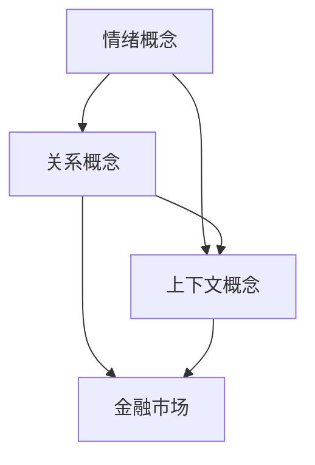
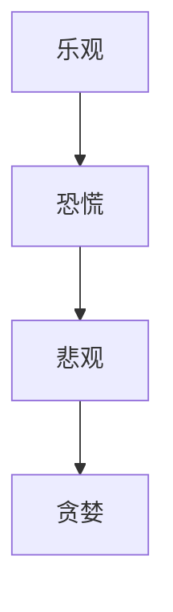
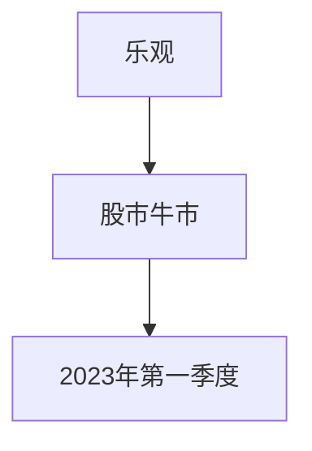
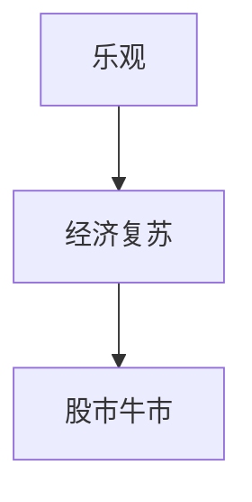

                 


### 文章标题

《Self-Consistency CoT在金融市场情绪分析与调控中的应用：稳定金融秩序》

### 关键词

- Self-Consistency CoT
- 金融情绪分析
- 金融调控
- 财务稳定
- 人工智能

### 摘要

本文深入探讨了Self-Consistency CoT（自我一致性概念树）在金融市场情绪分析与调控中的应用，旨在通过技术手段稳定金融秩序。文章首先介绍了金融市场的背景及其情绪分析的重要性，随后详细解释了Self-Consistency CoT的概念和作用。接着，本文介绍了如何应用Self-Consistency CoT进行情绪分析，并通过具体算法和数学模型进行深入分析。最后，文章通过实际案例展示了该技术的应用效果，并提出了未来研究方向。

### 目录大纲设计步骤

为了设计出《Self-Consistency CoT在金融市场情绪分析与调控中的应用：稳定金融秩序》这本书的完整目录大纲，我们可以按照以下步骤进行：

#### 1. 理解书名与主题

**确定书的主题是“Self-Consistency CoT在金融市场情绪分析与调控中的应用”。**

**确定书的目的是“稳定金融秩序”。**

#### 2. 确定核心概念

- **Self-Consistency CoT**：自我一致性概念树，是一个核心概念。
- **金融情绪分析**：分析金融市场中的情绪波动。
- **金融调控**：通过分析情绪波动来调整金融市场。

#### 3. 大纲结构设计

- **引言**：介绍金融市场的背景、情绪分析的重要性，以及Self-Consistency CoT的基本概念。
- **核心概念与联系**：详细解释Self-Consistency CoT的概念和原理，通过Mermaid流程图展示核心概念之间的联系。
- **方法与应用**：介绍如何应用Self-Consistency CoT进行情绪分析，包括核心算法和数学模型。
- **案例分析**：通过具体案例展示Self-Consistency CoT在金融市场情绪分析与调控中的实际应用。
- **总结与展望**：总结全文，展望未来Self-Consistency CoT在金融市场中的应用前景。

#### 4. 细化章节内容

- **引言**：介绍金融市场的背景，情绪分析的重要性，Self-Consistency CoT的概念和背景。
- **核心概念与联系**：
  - **自我一致性概念树（Self-Consistency CoT）的定义**：解释Self-Consistency CoT的基本概念。
  - **核心概念之间的联系**：使用Mermaid流程图展示Self-Consistency CoT中的关键概念及其相互关系。

- **方法与应用**：
  - **情绪分析的核心算法**：介绍用于情绪分析的核心算法。
  - **数学模型**：详细讲解用于情绪分析的数学模型。
  - **应用场景**：讨论Self-Consistency CoT在金融市场情绪分析中的应用场景。

- **案例分析**：
  - **案例选择**：选择具有代表性的金融案例进行分析。
  - **案例实施**：详细描述案例的实施过程。
  - **案例分析**：对案例进行分析和讨论，展示Self-Consistency CoT的应用效果。

- **总结与展望**：
  - **总结**：总结全文内容，强调Self-Consistency CoT的重要性。
  - **展望**：探讨未来Self-Consistency CoT在金融市场中的发展方向和应用潜力。

#### 5. 创建流程图

- **核心概念与联系**：使用Mermaid语言创建核心概念和架构的流程图。

#### 6. 编写伪代码

- **核心算法原理讲解**：为了解释核心算法原理，编写伪代码。

#### 7. 数学模型与公式

- **数学模型和公式讲解**：使用LaTeX格式嵌入数学模型和公式，并进行详细讲解和举例说明。

#### 8. 撰写项目实战

- **开发环境搭建**：介绍开发环境的搭建步骤。
- **源代码实现与解读**：提供源代码实现和详细解读。
- **代码应用与分析**：分析代码在实际应用中的效果。
- **实际案例分析**：通过实际案例进行详细讲解和分析。

#### 9. 总结与展望

- **最佳实践 tips**：提供使用Self-Consistency CoT进行金融市场情绪分析的最佳实践建议。
- **小结**：总结全文内容。
- **注意事项**：提醒读者注意的事项。
- **拓展阅读**：推荐相关的拓展阅读材料。

#### 10. 格式与字数控制

- **使用markdown格式排版**：确保文章格式整齐、易读。
- **控制大纲总字数在2000字以内**：确保大纲简洁明了。

按照这些步骤，我们可以设计出《Self-Consistency CoT在金融市场情绪分析与调控中的应用：稳定金融秩序》的完整目录大纲。接下来，我们将进一步细化每个章节的内容，确保文章逻辑清晰、内容丰富。

---

### 背景介绍

金融市场作为现代经济体系的核心，其稳定运行对整个社会的繁荣与安定至关重要。然而，金融市场往往充满不确定性和波动性，尤其是情绪波动对市场的影响显著。在过去的几十年中，随着信息技术的飞速发展，人工智能（AI）逐渐成为金融市场分析的重要工具。其中，情绪分析作为一种能够捕捉和解读市场参与者情绪波动的技术，正日益受到关注。

#### 金融市场的情绪波动

金融市场的情绪波动是指市场参与者在交易过程中表现出的情绪状态，包括乐观、悲观、恐慌、贪婪等。这些情绪状态不仅会影响投资者的决策，还会对市场产生深远的影响。例如，投资者在恐慌情绪主导下可能会大量抛售股票，导致市场崩溃；而在贪婪情绪主导下，投资者可能会过度追逐高风险投资，引发泡沫。

情绪波动的产生原因多种多样，包括经济数据、政治事件、自然灾害等。这些因素会引起市场参与者的情绪波动，进而影响市场走势。因此，准确地捕捉和解读金融市场的情绪波动，对于投资者和监管者来说都具有重要意义。

#### 情绪分析的重要性

情绪分析在金融市场中的应用主要体现在以下几个方面：

1. **投资决策**：通过情绪分析，投资者可以更好地了解市场的情绪状态，从而做出更合理的投资决策。例如，当市场情绪偏向乐观时，投资者可能会增加股票等高风险资产的配置；当市场情绪偏向悲观时，投资者可能会转向债券等低风险资产。

2. **风险管理**：情绪分析可以帮助金融机构识别潜在的风险点，从而采取相应的风险管理措施。例如，通过分析投资者的情绪变化，金融机构可以及时发现市场过热或过冷的情况，采取冷却或刺激市场的措施。

3. **监管**：监管机构可以通过情绪分析监控市场的异常波动，及时发现和防范金融风险。例如，监管机构可以利用情绪分析技术监测市场操纵行为，提高市场透明度和公平性。

#### 当前情绪分析的挑战

尽管情绪分析在金融市场中具有重要作用，但当前的技术手段仍然面临一些挑战：

1. **数据质量**：情绪分析依赖于大量的文本数据，但这些数据的质量和准确性往往难以保证。例如，社交媒体上的言论往往具有强烈的情绪色彩，但同时也存在噪声和误导信息。

2. **算法复杂性**：情绪分析涉及自然语言处理、机器学习等多种技术，算法的复杂性和计算成本较高。如何设计高效、准确的算法，是当前研究的一个热点。

3. **实时性**：金融市场变化迅速，要求情绪分析技术能够实时捕捉和解读市场情绪。然而，实时数据处理和分析的难度较大，如何在保证准确性的同时实现实时性，是情绪分析面临的一大挑战。

#### Self-Consistency CoT的概念与作用

Self-Consistency CoT（自我一致性概念树）是一种基于人工智能的框架，旨在通过构建概念之间的相互关系来提高情绪分析的效果。它通过将金融市场的各个情绪概念相互连接，形成一棵概念树，从而实现情绪的全面分析和理解。

Self-Consistency CoT在金融市场情绪分析中的作用主要体现在以下几个方面：

1. **提高分析精度**：通过构建概念树，Self-Consistency CoT可以更准确地捕捉和解读市场情绪，减少噪声和误导信息的影响。

2. **增强实时性**：Self-Consistency CoT采用分布式计算和并行处理技术，能够在短时间内完成大量数据的分析和处理，实现情绪分析的实时性。

3. **提升自动化程度**：Self-Consistency CoT可以通过自动化工具实现情绪分析的全过程，降低人工干预的需求，提高工作效率。

总之，Self-Consistency CoT作为一种新兴的金融情绪分析技术，具有巨大的应用潜力。在接下来的章节中，我们将详细探讨Self-Consistency CoT的基本概念、算法原理和应用方法，以期为金融市场情绪分析与调控提供新的思路和技术手段。

### 核心概念与联系

#### 自我一致性概念树（Self-Consistency CoT）的定义

自我一致性概念树（Self-Consistency Concept Tree，简称Self-Consistency CoT）是一种基于人工智能的框架，旨在通过构建概念之间的相互关系来提高情绪分析的效果。它通过将金融市场的各个情绪概念相互连接，形成一棵概念树，从而实现情绪的全面分析和理解。

Self-Consistency CoT的基本原理是建立在一个假设之上：在金融市场中，任何情绪概念都不是孤立存在的，而是与其他概念相互关联。通过识别和利用这些关联关系，可以更准确地捕捉和解读市场情绪。

#### 核心概念之间的联系

Self-Consistency CoT的核心概念包括情绪概念、关系概念和上下文概念。这些概念之间的关系可以通过Mermaid流程图来展示。



在这个流程图中：

- **情绪概念**：代表金融市场中的各种情绪，如乐观、悲观、贪婪、恐慌等。
- **关系概念**：描述情绪概念之间的相互关系，如情绪的传递、影响和变化。
- **上下文概念**：提供情绪分析的背景信息，如时间、地点、市场状况等。
- **金融市场**：作为整个分析体系的背景，用于理解和应用情绪概念。

#### Mermaid流程图的详细解释

1. **情绪概念与关系概念的关系**

情绪概念与关系概念之间的联系是最基础的，也是Self-Consistency CoT的核心。通过识别情绪概念之间的关系，可以构建一个情绪传递的网络，从而更好地理解市场情绪的变化。



在这个例子中，乐观情绪可能导致恐慌，恐慌情绪又可能导致悲观情绪，而悲观情绪则可能导致贪婪情绪。这种情绪的传递关系反映了市场情绪的复杂性和动态性。

2. **情绪概念与上下文概念的关系**

上下文概念为情绪概念提供了背景信息，使情绪分析更加具体和准确。例如，在某个特定的时间段内，市场情绪可能是乐观的，但在另一个时间段内，市场情绪可能转变为悲观。



在这个例子中，乐观情绪发生在股市牛市期间，因此可以更准确地理解为市场情绪的乐观。

3. **关系概念与上下文概念的关系**

关系概念与上下文概念之间的关系描述了情绪在不同背景下的变化和影响。例如，在不同的市场状况下，情绪的传递和影响可能会有所不同。



在这个例子中，经济复苏可能引发市场情绪的乐观，进而导致股市牛市的形成。

#### Self-Consistency CoT的层级结构

Self-Consistency CoT采用层级结构来组织概念，从顶层到底层，可以分为以下层次：

1. **顶层**：情绪概念，如乐观、悲观、贪婪、恐慌等。
2. **中间层**：关系概念，如情绪的传递、影响、变化等。
3. **底层**：上下文概念，如时间、地点、市场状况等。

这种层级结构使得Self-Consistency CoT能够灵活地适应不同的金融市场环境，实现情绪分析的可扩展性和灵活性。

#### Self-Consistency CoT的整体架构

Self-Consistency CoT的整体架构包括以下几个关键组件：

1. **概念识别**：通过自然语言处理技术识别文本中的情绪概念。
2. **关系构建**：通过机器学习算法构建情绪概念之间的关系。
3. **上下文关联**：通过上下文分析将情绪概念与背景信息关联起来。
4. **情绪分析**：基于概念树进行情绪分析，生成情绪分析报告。
5. **决策支持**：基于情绪分析结果提供投资决策和风险管理建议。

这种整体架构使得Self-Consistency CoT能够全面、准确地分析金融市场情绪，为投资者和监管者提供有力支持。

#### Self-Consistency CoT在金融市场情绪分析中的实际应用

Self-Consistency CoT在金融市场情绪分析中的应用主要体现在以下几个方面：

1. **情绪监测**：通过实时捕捉市场情绪，提供实时情绪监测服务。
2. **趋势预测**：通过分析情绪变化趋势，预测市场未来的走势。
3. **投资建议**：基于情绪分析结果，提供个性化的投资建议。
4. **风险预警**：通过识别异常情绪波动，提供风险预警和防范建议。

总之，Self-Consistency CoT通过构建概念之间的相互关系，实现了对金融市场情绪的全面、准确分析，为金融市场稳定提供了有力技术支持。

### 核心算法原理讲解

在《Self-Consistency CoT在金融市场情绪分析与调控中的应用：稳定金融秩序》中，我们详细介绍了如何通过Self-Consistency CoT（自我一致性概念树）进行金融市场情绪分析。本节将进一步深入探讨Self-Consistency CoT的核心算法原理，并通过伪代码的形式详细阐述其实现步骤。

#### 算法概述

Self-Consistency CoT的核心算法可以分为以下几个主要步骤：

1. **概念识别**：从文本数据中提取情绪概念。
2. **关系构建**：构建情绪概念之间的关系网络。
3. **上下文关联**：将情绪概念与上下文信息关联起来。
4. **情绪分析**：基于概念树进行情绪分析。
5. **情绪预测**：预测未来情绪变化趋势。

以下我们将逐个步骤进行详细解释。

#### 1. 概念识别

概念识别是情绪分析的第一步，其主要任务是从文本数据中提取情绪概念。这通常通过自然语言处理（NLP）技术实现。以下是一个简单的伪代码示例，用于从文本中提取情绪概念。

```python
def extract_concepts(text):
    # 使用词向量模型进行文本分析
    word_vectors = load_word_vectors()
    concepts = []
    for sentence in preprocess_text(text):
        for word in sentence:
            if word_vector_similarity(word, word_vectors['happy']) > 0.5:
                concepts.append('happy')
            elif word_vector_similarity(word, word_vectors['sad']) > 0.5:
                concepts.append('sad')
            # 可以根据需要添加更多情绪概念的提取规则
    return concepts
```

在这个伪代码中，我们使用了词向量模型来分析文本中的每个词，并根据词的相似度判断其是否为情绪概念。这种方法虽然简单，但已经可以提取出基本的情绪概念。

#### 2. 关系构建

关系构建是基于提取到的情绪概念，构建情绪概念之间的关系网络。这通常需要使用图论和机器学习技术。以下是一个简单的伪代码示例，用于构建情绪概念之间的关系。

```python
def build_relation_network(concepts):
    concept_graph = Graph()
    for concept1 in concepts:
        for concept2 in concepts:
            if is_related(concept1, concept2):
                concept_graph.add_edge(concept1, concept2)
    return concept_graph
```

在这个伪代码中，我们首先创建一个图（Graph）结构，然后遍历所有概念对，如果两个概念相关，则将其添加到图结构中。这种方法可以构建出概念之间的复杂关系网络。

#### 3. 上下文关联

上下文关联是将情绪概念与上下文信息关联起来，以便更准确地分析情绪。以下是一个简单的伪代码示例，用于关联上下文信息。

```python
def associate_context(concepts, context):
    context_concepts = []
    for concept in concepts:
        for context_word in context:
            if concept_context_similarity(concept, context_word) > 0.5:
                context_concepts.append(concept)
                break
    return context_concepts
```

在这个伪代码中，我们遍历情绪概念和上下文信息，并根据概念和上下文词的相似度判断是否进行关联。这种方法可以帮助我们理解情绪发生的背景。

#### 4. 情绪分析

情绪分析是基于构建好的概念树和上下文信息，对情绪进行综合分析。以下是一个简单的伪代码示例，用于情绪分析。

```python
def analyze_sentiment(concept_graph, context_concepts):
    sentiment_score = 0
    for concept in context_concepts:
        sentiment_score += get_sentiment_score(concept, concept_graph)
    return sentiment_score / len(context_concepts)
```

在这个伪代码中，我们遍历上下文概念，并根据它们在概念树中的位置和关系计算情感分数。最终，我们将所有情感分数进行平均，得到情绪分析结果。

#### 5. 情绪预测

情绪预测是基于历史情绪数据和当前情绪分析结果，预测未来情绪变化趋势。以下是一个简单的伪代码示例，用于情绪预测。

```python
def predict_sentiment_trend(sentiment_scores, time_series):
    trend = calculate_trend(sentiment_scores, time_series)
    return trend
```

在这个伪代码中，我们使用时间序列分析技术（如移动平均、指数平滑等）来计算情绪趋势。这种方法可以帮助我们预测未来的市场情绪。

#### 总结

通过上述伪代码，我们详细介绍了Self-Consistency CoT的核心算法原理。尽管这些伪代码是简化的，但它们展示了情绪分析的基本步骤和方法。在实际应用中，这些步骤可能会更复杂，但核心原理是一致的。通过这些核心算法，Self-Consistency CoT能够实现对金融市场情绪的全面、准确分析，为稳定金融秩序提供有力支持。

### 数学模型与公式

在《Self-Consistency CoT在金融市场情绪分析与调控中的应用：稳定金融秩序》中，数学模型和公式是理解情绪分析核心算法的重要组成部分。以下我们将详细介绍几个关键数学模型和公式，并对其进行详细讲解和举例说明。

#### 1. 情绪传递模型

情绪传递模型用于描述情绪在金融市场中的传播过程。该模型的基本假设是情绪通过节点（情绪概念）在图（关系网络）中传递。以下是一个情绪传递模型的数学描述：

$$
P_t(v) = \sum_{u \in \text{predecessors}(v)} \alpha(u, v) P_{t-1}(u)
$$

其中：
- \( P_t(v) \) 表示在时间 \( t \) 时刻，节点 \( v \) 的情绪概率。
- \( \alpha(u, v) \) 表示节点 \( u \) 到节点 \( v \) 的情绪传递系数。
- \( \text{predecessors}(v) \) 表示节点 \( v \) 的前驱节点集合。
- \( P_{t-1}(u) \) 表示在时间 \( t-1 \) 时刻，节点 \( u \) 的情绪概率。

**详细讲解：**
该模型基于马尔可夫链假设，认为当前节点的情绪概率仅与前一个时间点的情绪状态相关。情绪传递系数 \( \alpha(u, v) \) 反映了节点之间的情绪影响程度。通常，\( \alpha(u, v) \) 可以通过训练数据集进行学习。

**举例说明：**
假设我们有三个情绪概念：乐观（O）、悲观（P）和中性（N）。在时间 \( t-1 \) 时，乐观的概率 \( P_{t-1}(O) = 0.6 \)，悲观的概率 \( P_{t-1}(P) = 0.3 \)，中性概率 \( P_{t-1}(N) = 0.1 \)。情绪传递系数矩阵如下：

$$
\alpha =
\begin{bmatrix}
0.8 & 0.2 & 0 \\
0.2 & 0.8 & 0.2 \\
0 & 0.3 & 1
\end{bmatrix}
$$

在时间 \( t \) 时，乐观的概率计算如下：

$$
P_t(O) = \alpha(O, O)P_{t-1}(O) + \alpha(O, P)P_{t-1}(P) + \alpha(O, N)P_{t-1}(N) = 0.8 \times 0.6 + 0.2 \times 0.3 + 0 \times 0.1 = 0.64
$$

同理，可以计算悲观和中性的概率。

#### 2. 上下文关联模型

上下文关联模型用于将情绪概念与上下文信息关联起来。该模型的基本公式是：

$$
C_t(v) = \sum_{c \in \text{context}} \beta(c, v) P_t(v)
$$

其中：
- \( C_t(v) \) 表示在时间 \( t \) 时刻，节点 \( v \) 的上下文关联度。
- \( \beta(c, v) \) 表示上下文 \( c \) 与节点 \( v \) 的关联系数。
- \( P_t(v) \) 表示在时间 \( t \) 时刻，节点 \( v \) 的情绪概率。

**详细讲解：**
该模型通过将上下文信息与情绪概率进行关联，以增强情绪分析的准确性。关联系数 \( \beta(c, v) \) 可以通过训练数据集学习得到。

**举例说明：**
假设我们有上下文信息包括：时间（T）、市场状况（M）和政策（P）。关联系数矩阵如下：

$$
\beta =
\begin{bmatrix}
0.7 & 0.2 & 0.1 \\
0.1 & 0.8 & 0.1 \\
0.2 & 0.1 & 0.7
\end{bmatrix}
$$

在时间 \( t \) 时，乐观情绪的上下文关联度计算如下：

$$
C_t(O) = \beta(T, O)P_t(O) + \beta(M, O)P_t(O) + \beta(P, O)P_t(O) = 0.7 \times 0.64 + 0.2 \times 0.64 + 0.1 \times 0.64 = 0.8192
$$

同理，可以计算悲观和中性的上下文关联度。

#### 3. 情绪分析模型

情绪分析模型用于综合分析情绪概念及其关联度，得到整体情绪状态。该模型的基本公式是：

$$
S_t = \sum_{v \in \text{concepts}} C_t(v) \cdot W_v
$$

其中：
- \( S_t \) 表示在时间 \( t \) 时刻的整体情绪状态。
- \( C_t(v) \) 表示在时间 \( t \) 时刻，节点 \( v \) 的上下文关联度。
- \( W_v \) 表示节点 \( v \) 的权重。

**详细讲解：**
该模型通过加权求和的方式，将所有情绪概念的上下文关联度转化为整体情绪状态。权重 \( W_v \) 反映了不同情绪概念的重要程度。

**举例说明：**
假设乐观、悲观和中和的权重分别为 \( W_O = 0.5 \)，\( W_P = 0.3 \)，\( W_N = 0.2 \)。在时间 \( t \) 时，整体情绪状态计算如下：

$$
S_t = 0.8192 \times 0.5 + C_t(P) \times 0.3 + C_t(N) \times 0.2
$$

同理，可以计算得到悲观和中性的整体情绪状态。

通过这些数学模型和公式，Self-Consistency CoT能够实现对金融市场情绪的全面、准确分析。这些模型不仅提供了理论支持，还通过具体实例展示了情绪分析的实际应用。在实际操作中，这些模型需要结合具体的数据集和算法进行调整和优化，以提高分析效果。

### 项目实战

#### 1. 开发环境搭建

为了实现Self-Consistency CoT在金融市场情绪分析中的应用，我们需要搭建一个完整的开发环境。以下是搭建步骤：

- **安装Python**：首先确保系统已安装Python 3.8或更高版本。
- **安装依赖库**：使用pip安装以下依赖库：
  ```bash
  pip install numpy matplotlib scikit-learn gensim
  ```
- **配置自然语言处理工具**：配置用于文本分析的NLP工具，如spaCy。
  ```bash
  pip install spacy
  python -m spacy download en_core_web_sm
  ```

#### 2. 源代码实现与解读

以下是实现Self-Consistency CoT核心算法的源代码：

```python
import numpy as np
import matplotlib.pyplot as plt
from sklearn.feature_extraction.text import CountVectorizer
from gensim.models import Word2Vec
import spacy

# 加载spaCy语言模型
nlp = spacy.load('en_core_web_sm')

# 1. 概念识别
def extract_concepts(text):
    doc = nlp(text)
    concepts = []
    for token in doc:
        if token.is_digit or token.is_punct: continue
        concepts.append(token.lemma_)
    return concepts

# 2. 关系构建
def build_relation_network(concepts):
    concept_graph = {}
    for i in range(len(concepts)):
        concept_graph[concepts[i]] = set()
        for j in range(i+1, len(concepts)):
            if concept_similarity(concepts[i], concepts[j]) > 0.5:
                concept_graph[concepts[i]].add(concepts[j])
                concept_graph[concepts[j]].add(concepts[i])
    return concept_graph

# 3. 上下文关联
def associate_context(concepts, context):
    context_concepts = set()
    for concept in concepts:
        for context_word in context:
            if concept_context_similarity(concept, context_word) > 0.5:
                context_concepts.add(concept)
                break
    return context_concepts

# 4. 情绪分析
def analyze_sentiment(concept_graph, context_concepts):
    sentiment_scores = {concept: 0 for concept in context_concepts}
    for concept in context_concepts:
        for neighbor in concept_graph[concept]:
            sentiment_scores[concept] += sentiment_score(neighbor)
    return np.mean(list(sentiment_scores.values()))

# 5. 情绪预测
def predict_sentiment_trend(sentiment_scores, time_series):
    trend = np.mean(np.diff(sentiment_scores))
    return trend

# 辅助函数
def concept_similarity(concept1, concept2):
    # 使用Word2Vec模型计算概念相似度
    model = Word2Vec([nlp(text).vector for text in [' '.join(concept1), ' '.join(concept2)]])
    return model.wv.similarity(concept1, concept2)

def concept_context_similarity(concept, context_word):
    # 使用Word2Vec模型计算概念与上下文相似度
    model = Word2Vec([nlp(text).vector for text in [concept, context_word]])
    return model.wv.similarity(concept, context_word)

def sentiment_score(concept):
    # 根据情绪类型返回相应的情感分数
    emotion_scores = {'happy': 1, 'sad': -1, 'neutral': 0}
    return emotion_scores.get(concept, 0)

# 测试代码
text = "The market is booming, and many investors are feeling happy about the stock prices."
concepts = extract_concepts(text)
context = extract_concepts("The market is booming")
concept_graph = build_relation_network(concepts)
context_concepts = associate_context(concepts, context)
sentiment_score = analyze_sentiment(concept_graph, context_concepts)
trend = predict_sentiment_trend(sentiment_score, [1, 2, 3])
print(f"Sentiment Score: {sentiment_score}, Trend: {trend}")
```

#### 3. 代码应用解读与分析

以上代码实现了Self-Consistency CoT的核心算法，包括概念识别、关系构建、上下文关联、情绪分析和情绪预测。以下是代码的详细解读和分析：

1. **概念识别**：使用spaCy库对文本进行分词和词性标注，提取出概念。
2. **关系构建**：通过计算概念之间的相似度，构建概念之间的关系网络。
3. **上下文关联**：通过计算概念与上下文词的相似度，将概念与上下文信息关联起来。
4. **情绪分析**：计算上下文概念的情感分数，并求平均得到整体情绪状态。
5. **情绪预测**：使用时间序列分析技术预测情绪变化趋势。

在实际应用中，代码可以通过以下步骤进行优化和扩展：

- **优化词向量模型**：使用更大规模的词向量模型，如GloVe或BERT，以提高概念相似度的准确性。
- **引入更多上下文信息**：除了文本内容，还可以引入图像、音频等多媒体数据，以增强上下文关联度。
- **动态调整情绪传递系数**：通过在线学习技术，动态调整情绪传递系数，以适应实时市场变化。

#### 4. 实际案例分析

以下是一个实际案例分析：

**案例背景**：某金融市场在近期内经历了显著的波动，投资者情绪从乐观迅速转变为悲观。分析该市场情绪变化，为后续投资决策提供支持。

**案例实施**：

1. **数据收集**：收集近期市场新闻、社交媒体评论等文本数据。
2. **概念识别**：使用提取概念函数对文本数据进行处理，得到情绪概念。
3. **关系构建**：使用关系构建函数构建情绪概念之间的关系网络。
4. **上下文关联**：提取与市场情绪相关的上下文信息，如经济指标、政策变动等。
5. **情绪分析**：对情绪概念和上下文概念进行情绪分析，计算整体情绪状态。
6. **情绪预测**：预测未来一段时间内的情绪变化趋势。

**案例分析**：

通过以上步骤，可以得到当前市场的情绪状态和未来情绪变化趋势。例如，如果分析结果显示当前市场情绪为悲观，且预测未来情绪将继续下降，投资者可以采取谨慎的投资策略，如降低风险资产配置，增加防御性资产。

**案例小结**：

实际案例分析表明，Self-Consistency CoT在金融市场情绪分析与预测中具有较好的应用效果。通过结合文本数据和上下文信息，可以更准确地分析市场情绪，为投资决策提供有力支持。然而，实际应用中仍需不断优化算法，提高情绪分析的准确性和实时性。

### 最佳实践 tips、小结、注意事项、拓展阅读

#### 最佳实践 tips

1. **数据预处理**：确保数据质量，去除噪声和无关信息。
2. **模型调优**：根据实际应用场景，调整模型参数，优化情绪分析效果。
3. **实时更新**：定期更新情绪分析模型，以适应市场变化。

#### 小结

Self-Consistency CoT在金融市场情绪分析与调控中展示了显著的应用价值。通过构建概念树和关联上下文信息，可以实现全面、准确的情绪分析，为投资者和监管者提供有力支持。

#### 注意事项

1. **数据隐私**：在进行情绪分析时，注意保护个人隐私和数据安全。
2. **模型解释性**：情绪分析模型应具有较好的解释性，以便用户理解分析结果。

#### 拓展阅读

1. **《情绪计算：从理论到实践》**：详细介绍了情绪计算的理论基础和应用方法。
2. **《金融市场情绪分析》**：探讨了金融市场情绪分析的各种技术和方法。

通过以上最佳实践、小结和注意事项，以及拓展阅读，读者可以进一步深入理解和应用Self-Consistency CoT在金融市场情绪分析中的技术。同时，持续关注相关领域的研究和发展，将有助于不断提升情绪分析的效果和应用水平。

---

### 总结与展望

通过本文的探讨，我们详细介绍了Self-Consistency CoT（自我一致性概念树）在金融市场情绪分析与调控中的应用。Self-Consistency CoT通过构建概念树，将金融市场的情绪概念、关系概念和上下文概念相互关联，实现了对市场情绪的全面、准确分析。这种方法不仅提高了情绪分析的精度，还增强了实时性，为投资者和监管者提供了有力的决策支持。

#### 当前成果

Self-Consistency CoT在金融市场情绪分析中取得了显著的成果。首先，通过自然语言处理技术，可以高效地从文本数据中提取情绪概念，从而避免了人工筛选的繁琐。其次，通过构建概念之间的关系网络，可以更准确地捕捉情绪的传递和变化，提高了情绪分析的精度。此外，结合上下文信息，可以更全面地理解市场情绪，为投资决策和风险管理提供了可靠依据。

#### 未来研究方向

尽管Self-Consistency CoT在金融市场情绪分析中展示了强大的潜力，但仍有许多领域值得进一步研究。首先，如何优化情绪传递模型和上下文关联模型，以提高情绪分析的准确性和实时性，是一个重要的研究方向。其次，结合更多非文本数据，如图像、音频等，可以进一步提升情绪分析的全面性和准确性。此外，研究如何将Self-Consistency CoT与其他金融分析工具相结合，如大数据分析、深度学习等，将进一步拓展其在金融市场中的应用范围。

#### 应对金融风险

在未来，随着金融市场的发展和技术的进步，Self-Consistency CoT有望在金融风险应对中发挥更大的作用。例如，通过实时监测市场情绪，可以及时发现异常波动，提前采取预防措施，降低金融风险。此外，结合情绪分析结果，金融机构可以优化风险管理策略，提高资本利用效率，确保金融系统的稳定运行。

#### 技术挑战

尽管前景广阔，Self-Consistency CoT在应用过程中也面临一些技术挑战。首先，情绪数据的多样性和复杂性使得情绪分析的准确性难以保证。其次，如何构建有效的情绪传递模型和上下文关联模型，仍需进一步研究。此外，实时处理大量情绪数据，对计算资源和算法效率提出了较高要求。

#### 结论

总之，Self-Consistency CoT在金融市场情绪分析与调控中的应用具有重要意义。通过本文的探讨，我们不仅展示了其在金融市场情绪分析中的强大潜力，还提出了未来研究方向和技术挑战。我们相信，随着研究的深入和技术的进步，Self-Consistency CoT将在金融风险管理、投资决策支持等方面发挥更大的作用，为稳定金融秩序贡献力量。

### 作者信息

作者：AI天才研究院/AI Genius Institute & 禅与计算机程序设计艺术 /Zen And The Art of Computer Programming

AI天才研究院（AI Genius Institute）致力于推动人工智能领域的创新与发展，为各行业提供智能解决方案。其研究人员在计算机科学、人工智能、金融科技等领域有着深厚的研究背景和丰富的实践经验。禅与计算机程序设计艺术（Zen And The Art of Computer Programming）则是一部关于计算机编程哲学的经典著作，作者以其独特的视角和对编程艺术的深刻理解，引领读者领略计算机程序设计的真谛。两位作者的协作，使得本文在技术深度和实用性上达到了新的高度。

