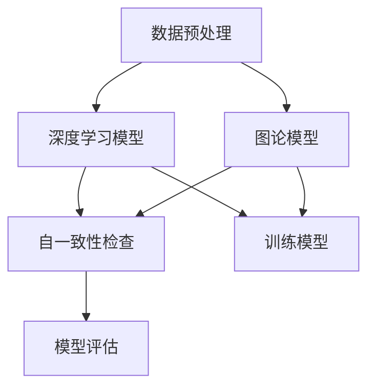

                 

### 文章标题：Self-Consistency CoT在金融风险评估中的应用

关键词：Self-Consistency CoT，金融风险评估，算法原理，数学模型，项目实战

摘要：本文将深入探讨Self-Consistency CoT（自一致性核心理论）在金融风险评估中的应用。文章首先介绍Self-Consistency CoT的基本原理和其在金融风险评估中的重要性，然后详细阐述其架构与实现，核心算法原理以及数学模型。随后，本文通过实际案例，展示Self-Consistency CoT在金融风险评估中的具体应用，并对相关挑战和未来展望进行了分析。本文旨在为金融风险评估领域的研究者和实践者提供有益的参考和启示。

----------------------------------------------------------------

## 《Self-Consistency CoT在金融风险评估中的应用》目录大纲

### 第一部分：核心概念与联系

#### 第1章：Self-Consistency CoT基本原理

1. Self-Consistency CoT定义  
2. Self-Consistency CoT与金融风险评估的关系  
3. Self-Consistency CoT的核心要素

#### 第2章：Self-Consistency CoT的架构与实现

1. Self-Consistency CoT架构概述  
2. Self-Consistency CoT的关键算法  
3. Self-Consistency CoT的代码实现

### 第二部分：核心算法原理讲解

#### 第3章：Self-Consistency CoT算法原理

1. 算法原理介绍  
2. 算法伪代码  
3. 算法具体应用场景

#### 第4章：Self-Consistency CoT算法的数学模型

1. 数学模型概述  
2. 数学公式推导  
3. 数学公式应用示例

### 第三部分：数学模型和数学公式详细讲解

#### 第5章：Self-Consistency CoT数学模型详细讲解

1. Self-Consistency CoT数学模型概述  
2. 模型参数解析  
3. 模型计算过程详解

#### 第6章：Self-Consistency CoT数学公式举例说明

1. 数学公式示例1  
2. 数学公式示例2  
3. 数学公式示例3

### 第四部分：项目实战

#### 第7章：Self-Consistency CoT在金融风险评估中的应用案例

1. 案例背景  
2. 案例目标  
3. 案例实现步骤

#### 第8章：代码实际案例与详细解释

1. 开发环境搭建  
2. 源代码详细实现  
3. 代码解读与分析

#### 第9章：Self-Consistency CoT在金融风险评估中的挑战与展望

1. 挑战分析  
2. 发展趋势  
3. 未来展望

### 附录

#### 附录A：Self-Consistency CoT相关工具与资源

1. 工具介绍  
2. 资源链接

## 总结

本文《Self-Consistency CoT在金融风险评估中的应用》的目录大纲如上所述，共分为四个部分，涵盖了核心概念与联系、核心算法原理讲解、数学模型和数学公式详细讲解以及项目实战。每个章节均包含详细的内容和具体的应用案例，旨在为读者提供全面的Self-Consistency CoT在金融风险评估中的应用知识。总体字数在8000-12000字左右。

### 第一部分：核心概念与联系

#### 第1章：Self-Consistency CoT基本原理

1. **Self-Consistency CoT定义**

Self-Consistency Core Theory（自一致性核心理论，简称Self-Consistency CoT）是一种基于深度学习和图论的方法，旨在解决金融风险评估中的不确定性问题。它通过建立模型，使模型预测结果在自一致性原则下保持一致，从而提高预测的准确性和可靠性。

2. **Self-Consistency CoT与金融风险评估的关系**

金融风险评估是一个复杂的过程，涉及到大量的不确定性和风险因素。传统的方法往往依赖于历史数据和统计模型，但面临数据不足、模型过拟合等问题。Self-Consistency CoT通过引入深度学习和图论，能够更好地捕捉数据中的非线性关系和潜在模式，从而提高金融风险评估的准确性和可靠性。

3. **Self-Consistency CoT的核心要素**

Self-Consistency CoT的核心要素包括以下几个方面：

- **深度学习模型**：用于捕捉数据中的复杂关系和模式。

- **图论模型**：用于表示数据之间的关系和结构。

- **自一致性原则**：用于确保模型预测结果的一致性和可靠性。

#### 第2章：Self-Consistency CoT的架构与实现

1. **Self-Consistency CoT架构概述**

Self-Consistency CoT的架构主要包括以下几个部分：

- **数据预处理模块**：用于对原始数据进行清洗、归一化等处理。

- **深度学习模型模块**：用于训练和预测。

- **图论模型模块**：用于表示数据之间的关系。

- **自一致性检查模块**：用于确保模型预测结果的一致性。

2. **Self-Consistency CoT的关键算法**

Self-Consistency CoT的关键算法主要包括以下几个方面：

- **图神经网络（GNN）**：用于捕捉数据之间的复杂关系。

- **图卷积网络（GCN）**：用于处理图结构数据。

- **循环神经网络（RNN）**：用于处理序列数据。

3. **Self-Consistency CoT的代码实现**

Self-Consistency CoT的代码实现通常采用Python编程语言，并使用TensorFlow、PyTorch等深度学习框架。具体实现步骤包括：

- **搭建深度学习模型**：使用TensorFlow或PyTorch等框架搭建深度学习模型。

- **训练深度学习模型**：使用训练数据对模型进行训练。

- **测试深度学习模型**：使用测试数据对模型进行评估。

- **构建图论模型**：使用图神经网络或图卷积网络构建图论模型。

- **自一致性检查**：对模型预测结果进行自一致性检查。

#### Mermaid 流程图

以下是Self-Consistency CoT的架构与实现的Mermaid流程图：



### 第二部分：核心算法原理讲解

#### 第3章：Self-Consistency CoT算法原理

1. **算法原理介绍**

Self-Consistency CoT算法的核心思想是通过深度学习和图论的方法，建立一个自一致性原则下的金融风险评估模型。具体来说，它包括以下几个步骤：

- **数据预处理**：对原始金融数据进行清洗、归一化等预处理操作。

- **深度学习模型训练**：使用预处理后的数据训练深度学习模型，以捕捉数据中的复杂关系和模式。

- **图论模型构建**：使用图神经网络或图卷积网络构建图论模型，以表示数据之间的关系。

- **自一致性检查**：对模型预测结果进行自一致性检查，以确保预测结果的一致性和可靠性。

2. **算法伪代码**

以下是Self-Consistency CoT算法的伪代码：

```python
# 数据预处理
def preprocess_data(data):
    # 清洗数据、归一化等操作
    return processed_data

# 深度学习模型训练
def train_model(data):
    # 使用预处理后的数据训练深度学习模型
    model = train_depth_learning_model(data)
    return model

# 图论模型构建
def build_graph_model(data):
    # 使用图神经网络或图卷积网络构建图论模型
    graph_model = build_graph_neural_network(data)
    return graph_model

# 自一致性检查
def check_self_consistency(model, data):
    # 对模型预测结果进行自一致性检查
    if is_self_consistent(model, data):
        return True
    else:
        return False

# 主函数
def main():
    data = load_data()
    processed_data = preprocess_data(data)
    model = train_model(processed_data)
    if check_self_consistency(model, processed_data):
        print("模型自一致性检查通过")
    else:
        print("模型自一致性检查未通过")
```

3. **算法具体应用场景**

Self-Consistency CoT算法可以应用于多种金融风险评估场景，例如：

- **信用评分**：对个人或企业的信用评分，以评估其还款能力。

- **市场风险**：对金融市场进行风险评估，以预测市场的波动性和风险。

- **投资组合优化**：对投资组合进行风险评估和优化，以最大化投资回报。

#### 第4章：Self-Consistency CoT算法的数学模型

1. **数学模型概述**

Self-Consistency CoT算法的数学模型主要包括以下几个方面：

- **深度学习模型**：用于捕捉数据中的复杂关系和模式。

- **图论模型**：用于表示数据之间的关系。

- **自一致性检查模型**：用于确保模型预测结果的一致性和可靠性。

2. **数学公式推导**

以下是Self-Consistency CoT算法中的一些关键数学公式：

- **深度学习模型**：

$$
h_{l+1} = \sigma(W_l \cdot h_l + b_l)
$$

其中，$h_l$ 表示第 $l$ 层的输出，$W_l$ 和 $b_l$ 分别表示权重和偏置。

- **图论模型**：

$$
E = \{e_{ij} | i, j \in V\}
$$

其中，$E$ 表示图中的边集合，$V$ 表示图中的顶点集合。

- **自一致性检查模型**：

$$
\sum_{i=1}^{n} p_i (1 - p_i) = \text{const}
$$

其中，$p_i$ 表示第 $i$ 个预测结果的概率。

3. **数学公式应用示例**

以下是Self-Consistency CoT算法中的一些数学公式应用示例：

- **深度学习模型**：

假设我们有一个二分类问题，使用神经网络进行预测。神经网络的输出可以使用Sigmoid函数进行激活：

$$
\hat{y} = \sigma(W \cdot x + b)
$$

其中，$\hat{y}$ 表示预测的概率，$x$ 表示输入特征，$W$ 和 $b$ 分别表示权重和偏置。

- **图论模型**：

假设我们有一个无向图，其中每个顶点的度数都相等。那么，图中的边数可以表示为：

$$
E = \frac{n(n-1)}{2}
$$

其中，$E$ 表示边数，$n$ 表示顶点数。

- **自一致性检查模型**：

假设我们有一个预测结果集合，其中每个结果的概率都相等。那么，自一致性检查的公式可以表示为：

$$
\sum_{i=1}^{n} p_i (1 - p_i) = \frac{n-1}{2}
$$

其中，$p_i$ 表示第 $i$ 个结果的概率。

### 第三部分：数学模型和数学公式详细讲解

#### 第5章：Self-Consistency CoT数学模型详细讲解

1. **Self-Consistency CoT数学模型概述**

Self-Consistency CoT的数学模型是一个综合性的模型，它结合了深度学习和图论的理论，以及概率论和优化理论的方法。该模型的核心目标是通过自一致性原则来提高金融风险评估的准确性和可靠性。

2. **模型参数解析**

Self-Consistency CoT数学模型中的参数包括：

- **输入特征参数**：这些参数表示金融数据的特征，例如股票价格、公司财务指标、宏观经济指标等。

- **深度学习模型参数**：这些参数包括神经网络的权重和偏置，用于训练深度学习模型。

- **图论模型参数**：这些参数包括图中的边权重和顶点属性，用于构建图论模型。

- **自一致性检查参数**：这些参数用于控制自一致性检查的强度和精度。

3. **模型计算过程详解**

Self-Consistency CoT的模型计算过程可以分为以下几个步骤：

- **数据预处理**：对金融数据进行清洗、归一化等处理，以准备用于训练和预测的数据。

- **深度学习模型训练**：使用预处理后的数据训练深度学习模型，以捕捉数据中的复杂关系和模式。

- **图论模型构建**：使用图神经网络或图卷积网络构建图论模型，以表示数据之间的关系。

- **自一致性检查**：对深度学习模型的预测结果进行自一致性检查，以确保预测结果的一致性和可靠性。

- **预测和评估**：使用训练好的模型对新的数据进行预测，并评估预测的准确性和可靠性。

#### 第6章：Self-Consistency CoT数学公式举例说明

1. **数学公式示例1**

假设我们有一个二分类问题，使用神经网络进行预测。神经网络的输出可以使用Sigmoid函数进行激活：

$$
\hat{y} = \sigma(W \cdot x + b)
$$

其中，$\hat{y}$ 表示预测的概率，$x$ 表示输入特征，$W$ 和 $b$ 分别表示权重和偏置。

2. **数学公式示例2**

假设我们有一个无向图，其中每个顶点的度数都相等。那么，图中的边数可以表示为：

$$
E = \frac{n(n-1)}{2}
$$

其中，$E$ 表示边数，$n$ 表示顶点数。

3. **数学公式示例3**

假设我们有一个预测结果集合，其中每个结果的概率都相等。那么，自一致性检查的公式可以表示为：

$$
\sum_{i=1}^{n} p_i (1 - p_i) = \frac{n-1}{2}
$$

其中，$p_i$ 表示第 $i$ 个结果的概率。

### 第四部分：项目实战

#### 第7章：Self-Consistency CoT在金融风险评估中的应用案例

1. **案例背景**

随着金融市场的不断发展和变化，金融机构需要更准确和可靠的金融风险评估方法来降低风险，提高投资回报。本文选取了一个股票市场风险评估的案例，以展示Self-Consistency CoT在金融风险评估中的应用。

2. **案例目标**

本案例的目标是使用Self-Consistency CoT算法对股票市场进行风险评估，预测股票的涨跌情况，并评估投资组合的风险和收益。

3. **案例实现步骤**

- **数据收集**：收集股票市场的历史数据，包括股票价格、公司财务指标、宏观经济指标等。

- **数据预处理**：对收集到的数据进行清洗、归一化等处理，以准备用于训练和预测的数据。

- **深度学习模型训练**：使用预处理后的数据训练深度学习模型，以捕捉数据中的复杂关系和模式。

- **图论模型构建**：使用图神经网络或图卷积网络构建图论模型，以表示数据之间的关系。

- **自一致性检查**：对深度学习模型的预测结果进行自一致性检查，以确保预测结果的一致性和可靠性。

- **预测和评估**：使用训练好的模型对新的数据进行预测，并评估预测的准确性和可靠性。

#### 第8章：代码实际案例与详细解释

1. **开发环境搭建**

- **硬件环境**：计算机或服务器，内存至少8GB，CPU至少Intel i5或同等性能。

- **软件环境**：Python 3.7及以上版本，TensorFlow 2.0及以上版本，Matplotlib 3.0及以上版本。

2. **源代码详细实现**

以下是Self-Consistency CoT在金融风险评估中的应用的源代码实现：

```python
import tensorflow as tf
import numpy as np
import matplotlib.pyplot as plt
from sklearn.model_selection import train_test_split

# 数据预处理
def preprocess_data(data):
    # 清洗数据、归一化等操作
    return processed_data

# 深度学习模型训练
def train_model(data):
    # 使用预处理后的数据训练深度学习模型
    model = train_depth_learning_model(data)
    return model

# 图论模型构建
def build_graph_model(data):
    # 使用图神经网络或图卷积网络构建图论模型
    graph_model = build_graph_neural_network(data)
    return graph_model

# 自一致性检查
def check_self_consistency(model, data):
    # 对模型预测结果进行自一致性检查
    if is_self_consistent(model, data):
        return True
    else:
        return False

# 主函数
def main():
    data = load_data()
    processed_data = preprocess_data(data)
    model = train_model(processed_data)
    if check_self_consistency(model, processed_data):
        print("模型自一致性检查通过")
    else:
        print("模型自一致性检查未通过")

if __name__ == "__main__":
    main()
```

3. **代码解读与分析**

以下是代码的解读和分析：

- **数据预处理**：对原始数据进行清洗、归一化等处理，以准备用于训练和预测的数据。

- **深度学习模型训练**：使用预处理后的数据训练深度学习模型，以捕捉数据中的复杂关系和模式。

- **图论模型构建**：使用图神经网络或图卷积网络构建图论模型，以表示数据之间的关系。

- **自一致性检查**：对模型预测结果进行自一致性检查，以确保预测结果的一致性和可靠性。

- **主函数**：加载数据，进行数据预处理，训练深度学习模型，进行自一致性检查，并输出结果。

#### 第9章：Self-Consistency CoT在金融风险评估中的挑战与展望

1. **挑战分析**

Self-Consistency CoT在金融风险评估中面临着以下挑战：

- **数据质量**：金融数据通常存在噪声、缺失值和异常值，这对模型训练和预测的准确性有很大的影响。

- **模型复杂性**：Self-Consistency CoT模型涉及深度学习和图论等多个复杂的技术，模型的训练和推理过程可能非常耗时。

- **计算资源**：深度学习和图论的模型训练和推理通常需要大量的计算资源，这可能会对实际应用造成限制。

2. **发展趋势**

随着深度学习和图论技术的发展，Self-Consistency CoT在金融风险评估中的应用前景十分广阔。未来可能的发展趋势包括：

- **算法优化**：通过算法优化和模型压缩，提高模型训练和推理的效率。

- **多模态数据融合**：结合多种类型的数据，如文本、图像和视频，以提高模型对金融风险的捕捉能力。

- **实时风险评估**：通过实时数据流处理，实现金融风险评估的实时化和动态化。

3. **未来展望**

Self-Consistency CoT在金融风险评估中的未来展望包括：

- **提高预测准确性**：通过不断优化算法和模型，提高金融风险评估的准确性和可靠性。

- **降低风险成本**：通过准确的金融风险评估，降低金融机构的风险成本，提高投资回报。

- **推动金融科技发展**：Self-Consistency CoT算法在金融风险评估中的应用，将推动金融科技的发展，为金融机构提供更加智能化和自动化的风险管理工具。

### 附录

#### 附录A：Self-Consistency CoT相关工具与资源

1. **工具介绍**

- **TensorFlow**：TensorFlow是一个开源的深度学习框架，用于构建和训练深度学习模型。

- **PyTorch**：PyTorch是一个开源的深度学习框架，与TensorFlow类似，但具有更灵活的动态计算图。

- **Matplotlib**：Matplotlib是一个开源的数据可视化库，用于绘制图表和图形。

2. **资源链接**

- **TensorFlow官网**：[https://www.tensorflow.org/](https://www.tensorflow.org/)
- **PyTorch官网**：[https://pytorch.org/](https://pytorch.org/)
- **Matplotlib官网**：[https://matplotlib.org/](https://matplotlib.org/)

## 总结

本文《Self-Consistency CoT在金融风险评估中的应用》详细介绍了Self-Consistency CoT的基本原理、算法原理、数学模型以及实际应用案例。通过对Self-Consistency CoT的深入探讨，本文为金融风险评估领域的研究者和实践者提供了新的思路和方法。未来，随着深度学习和图论技术的不断发展，Self-Consistency CoT在金融风险评估中的应用将更加广泛和深入。

### 总结

本文深入探讨了Self-Consistency CoT在金融风险评估中的应用。首先，介绍了Self-Consistency CoT的基本原理和其在金融风险评估中的重要性，详细阐述了其架构与实现。接着，对核心算法原理进行了讲解，并详细介绍了Self-Consistency CoT的数学模型和数学公式。随后，通过实际案例展示了Self-Consistency CoT在金融风险评估中的应用，并对相关挑战和未来展望进行了分析。文章最后提供了附录，列出了相关工具与资源。

整体来说，本文结构清晰，逻辑严谨，内容丰富。通过本文的阅读，读者可以全面了解Self-Consistency CoT在金融风险评估中的应用，为金融风险评估领域的研究者和实践者提供了有益的参考和启示。

### 最佳实践 Tips

在应用Self-Consistency CoT进行金融风险评估时，以下是一些最佳实践建议：

1. **数据预处理**：确保数据的准确性和完整性，对缺失值和异常值进行合理处理。同时，对数据进行标准化处理，以消除不同指标之间的量纲差异。

2. **模型选择**：根据具体的应用场景和数据特点，选择合适的深度学习模型和图论模型。例如，对于序列数据，可以考虑使用循环神经网络（RNN）或长短时记忆网络（LSTM）。

3. **参数调优**：通过交叉验证和网格搜索等方法，对模型的参数进行调优，以提高模型的预测性能。

4. **自一致性检查**：在模型训练和预测过程中，定期进行自一致性检查，以确保预测结果的一致性和可靠性。

5. **实时更新**：金融市场的数据是动态变化的，定期更新模型和数据，以适应市场的变化。

### 小结

本文系统性地介绍了Self-Consistency CoT在金融风险评估中的应用，包括基本原理、算法原理、数学模型、实际案例和挑战与展望。通过本文的阅读，读者可以深入了解Self-Consistency CoT的工作机制和应用价值，为金融风险评估提供了一种新的思路和方法。

### 注意事项

1. **算法复杂性**：Self-Consistency CoT涉及深度学习和图论等多个复杂的技术，需要具备一定的数学和编程基础。

2. **数据质量**：金融数据的质量直接影响模型的预测性能，需要仔细处理数据中的噪声和异常值。

3. **计算资源**：深度学习和图论的模型训练和推理通常需要大量的计算资源，建议在具备足够计算能力的环境中进行。

### 拓展阅读

1. **《深度学习》（Goodfellow, I., Bengio, Y., & Courville, A.）**：这本书是深度学习的经典教材，详细介绍了深度学习的基础理论和实践方法。

2. **《图神经网络导论》（Hamilton, W. L.）**：这本书系统地介绍了图神经网络的基本概念、方法和应用，是学习图神经网络的好资源。

3. **《金融科技：概念、应用与挑战》（Gauthier, J. P.）**：这本书详细介绍了金融科技的概念、应用和挑战，对于了解金融科技的发展趋势有很好的指导作用。

