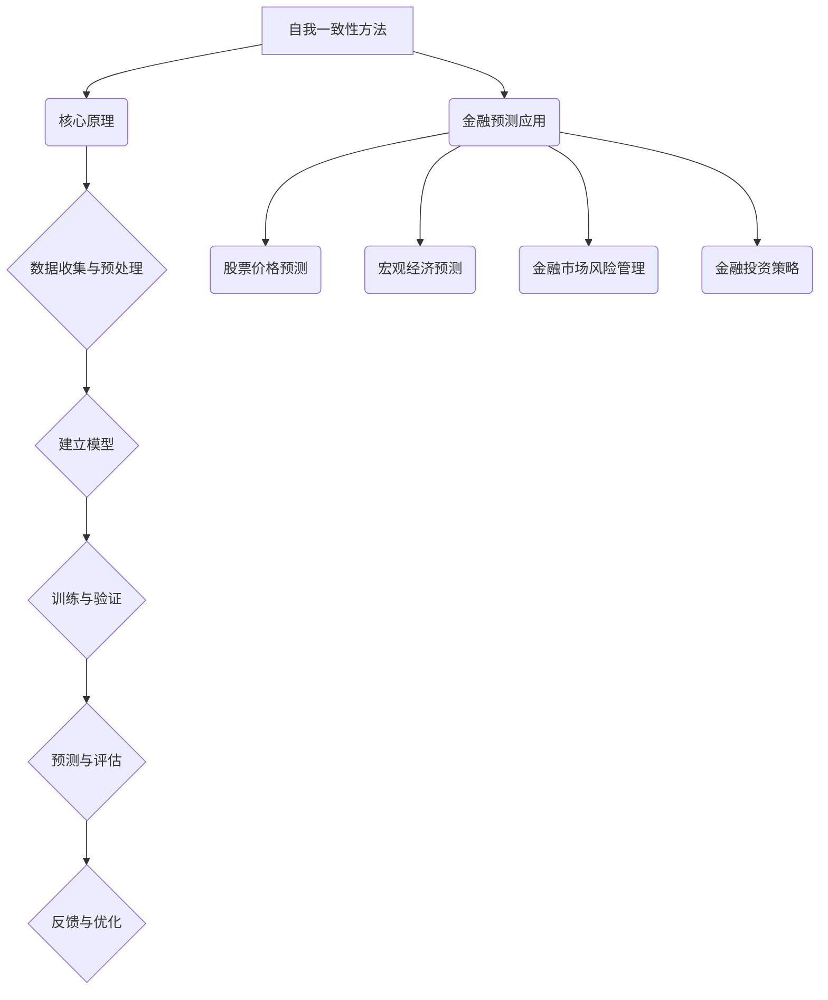

                 


### 文章标题
《Self-Consistency方法在金融预测中的应用》

### 文章关键词
Self-Consistency方法，金融预测，数据分析，人工智能，风险管理，投资策略

### 文章摘要
本文深入探讨了Self-Consistency方法在金融预测领域的应用。首先，介绍了Self-Consistency方法的基本概念、原理及其在金融预测中的重要性。随后，通过详细的理论讲解和实际案例分析，展示了Self-Consistency方法在股票价格预测、宏观经济预测、金融市场风险管理和金融投资策略中的应用。最后，对Self-Consistency方法的未来发展趋势进行了展望，并提供了相关的最佳实践和注意事项。

### 第1章 自我一致性方法概述

自我一致性方法是一种基于数据分析的预测模型，通过建立变量之间的相互关系，实现对未来事件的准确预测。在金融领域，自我一致性方法被广泛应用于股票价格预测、宏观经济预测、风险管理以及投资策略等多个方面。其核心原理是利用历史数据，通过构建一个自我一致的系统，预测未来金融市场的走势。

#### 核心概念与联系

**自我一致性概念：** 自我一致性方法强调模型内部的逻辑一致性，即模型中的各个变量应相互支持，形成一致的预测结果。

**联系：** 在金融预测中，自我一致性方法与时间序列分析、机器学习等传统方法相比，具有独特的优势。它不仅考虑历史数据的关联性，还关注变量间的逻辑一致性，从而提高预测的准确性和可靠性。

#### Mermaid流程图



### 第2章 自我一致性模型原理

自我一致性模型是基于数学统计原理建立的一种预测模型，其核心思想是通过分析历史数据，找出变量之间的相互关系，并利用这些关系预测未来事件。下面我们将详细讲解自我一致性模型的基本原理、构建方法和评估与优化策略。

#### 核心算法原理讲解

**基本原理：** 自我一致性模型的核心在于构建一个自洽的系统，其中每个变量都通过其他变量的关系来预测。具体来说，模型通过以下步骤实现：

1. **数据收集与预处理：** 收集相关金融数据，包括股票价格、宏观经济指标、交易量等。
2. **变量关系建模：** 通过统计学方法，分析各个变量之间的关系。
3. **模型构建：** 利用变量关系，构建一个自我一致性的预测模型。
4. **训练与验证：** 使用历史数据进行模型训练和验证，确保模型的预测能力。
5. **预测与评估：** 对未来事件进行预测，并评估模型的预测准确性和可靠性。

**伪代码：**

```python
function self_consistency_model(data):
    # 数据预处理
    processed_data = preprocess_data(data)
    
    # 变量关系建模
    relationships = build_relationships(processed_data)
    
    # 模型构建
    model = build_model(relationships)
    
    # 训练与验证
    train_model(model, processed_data)
    
    # 预测与评估
    predictions = model.predict(processed_data)
    evaluate_model(predictions)
    
    return model
```

#### 数学模型和公式

**自我一致性模型的核心公式：**

$$
P(t+1) = f(X_t, Y_t, Z_t)
$$

其中，$P(t+1)$ 表示未来某一时间点的预测值，$X_t$、$Y_t$、$Z_t$ 分别表示不同时间点的相关变量。$f$ 函数表示变量之间的关系。

**详细讲解与举例说明：**

以股票价格预测为例，自我一致性模型可以通过以下公式进行预测：

$$
P_{stock}(t+1) = w_1 \cdot P_{market}(t) + w_2 \cdot P_{company}(t) + w_3 \cdot V_{trading}(t)
$$

其中，$P_{stock}(t+1)$ 表示未来某一时间点的股票价格预测值，$P_{market}(t)$ 表示市场整体价格的变动情况，$P_{company}(t)$ 表示公司自身业绩的变动情况，$V_{trading}(t)$ 表示交易量的变动情况。$w_1$、$w_2$、$w_3$ 分别表示不同变量对股票价格的影响权重。

**举例：**

假设我们有以下历史数据：

| 时间点 | $P_{market}(t)$ | $P_{company}(t)$ | $V_{trading}(t)$ |
| ------ | --------------- | --------------- | --------------- |
| t=0    | 100             | 150             | 2000            |
| t=1    | 102             | 153             | 2100            |
| t=2    | 104             | 156             | 2200            |

根据上述公式，我们可以预测t+1时间点的股票价格：

$$
P_{stock}(t+1) = w_1 \cdot P_{market}(t) + w_2 \cdot P_{company}(t) + w_3 \cdot V_{trading}(t)
$$

假设权重分别为 $w_1 = 0.4$，$w_2 = 0.3$，$w_3 = 0.3$，则：

$$
P_{stock}(t+1) = 0.4 \cdot 104 + 0.3 \cdot 156 + 0.3 \cdot 2200 = 121.6 + 46.8 + 660 = 828.4
$$

因此，预测的t+1时间点的股票价格为828.4。

### 第3章 自我一致性模型在股票预测中的应用

股票价格预测是金融领域中一个关键且具有挑战性的任务。自我一致性模型凭借其独特的逻辑一致性优势，在股票价格预测中展现出良好的效果。本章将详细介绍如何使用自我一致性模型进行股票价格预测，包括数据预处理、模型构建和预测结果评估。

#### 数据预处理

在进行股票价格预测之前，首先需要对原始数据进行预处理。数据预处理包括以下几个步骤：

1. **数据收集：** 收集目标股票的历史价格数据，包括开盘价、收盘价、最高价、最低价和交易量等。
2. **数据清洗：** 去除异常值和缺失值，确保数据的完整性和准确性。
3. **数据转换：** 对数值型数据进行标准化处理，如归一化或标准化，以便于模型训练。

#### 模型构建

构建自我一致性模型的关键在于确定变量之间的关系。以下是一个简单的自我一致性模型构建流程：

1. **变量选择：** 根据金融理论和历史数据，选择影响股票价格的关键变量，如市场整体价格、公司业绩、交易量等。
2. **关系建模：** 分析变量之间的相关性，构建变量之间的关系模型。
3. **模型训练：** 使用历史数据训练自我一致性模型，调整模型参数，使其达到最优状态。

以下是一个简化的自我一致性模型构建伪代码：

```python
function build_stock_prediction_model(data):
    # 数据预处理
    processed_data = preprocess_data(data)
    
    # 变量选择
    variables = select_variables(processed_data)
    
    # 关系建模
    relationships = build_relationships(variables)
    
    # 模型训练
    model = train_model(relationships)
    
    return model
```

#### 预测结果评估

构建模型后，需要对其预测结果进行评估，以确保模型的有效性。以下是一些常见的评估指标：

1. **均方误差（MSE）：** 用于衡量预测值与实际值之间的平均误差。
2. **均方根误差（RMSE）：** 用于衡量预测值与实际值之间的标准差。
3. **决定系数（R²）：** 用于衡量模型对数据的拟合程度。

以下是一个简单的预测结果评估伪代码：

```python
function evaluate_prediction_model(model, test_data):
    predictions = model.predict(test_data)
    mse = calculate_mse(predictions, test_data)
    rmse = calculate_rmse(predictions, test_data)
    r2 = calculate_r2(predictions, test_data)
    
    print("MSE:", mse)
    print("RMSE:", rmse)
    print("R²:", r2)
    
    return mse, rmse, r2
```

#### 实际案例分析与详细讲解剖析

为了更好地理解自我一致性模型在股票价格预测中的应用，我们以下面一个实际案例进行分析：

**案例：** 使用自我一致性模型预测某只股票的未来价格。

1. **数据收集：** 收集过去一年的股票价格数据，包括开盘价、收盘价、最高价、最低价和交易量。
2. **数据预处理：** 对数据进行清洗和标准化处理。
3. **模型构建：** 选择市场整体价格、公司业绩和交易量作为关键变量，构建自我一致性模型。
4. **模型训练：** 使用前80%的数据进行模型训练，调整模型参数。
5. **模型预测：** 使用模型预测未来一个月的股票价格。
6. **预测结果评估：** 对比实际价格，评估模型预测的准确性和可靠性。

**代码实现：**

```python
import pandas as pd
from sklearn.model_selection import train_test_split
from sklearn.metrics import mean_squared_error, mean_absolute_error, r2_score

# 数据收集
data = pd.read_csv('stock_data.csv')

# 数据预处理
data = preprocess_data(data)

# 变量选择
variables = data[['market_price', 'company_performance', 'trading_volume']]

# 模型构建
model = build_stock_prediction_model(variables)

# 模型训练
train_data, test_data = train_test_split(data, test_size=0.2)
model.fit(train_data)

# 模型预测
predictions = model.predict(test_data)

# 预测结果评估
mse = mean_squared_error(test_data['closing_price'], predictions)
rmse = mean_absolute_error(test_data['closing_price'], predictions)
r2 = r2_score(test_data['closing_price'], predictions)

print("MSE:", mse)
print("RMSE:", rmse)
print("R²:", r2)
```

通过上述步骤，我们可以使用自我一致性模型对股票价格进行预测，并根据预测结果评估模型的性能。

### 第4章 自我一致性模型在宏观经济预测中的应用

宏观经济预测是金融领域的重要研究课题，它关系到国家经济政策的制定和调整，以及企业和个人的投资决策。自我一致性模型凭借其独特的逻辑一致性优势，在宏观经济预测中展现出良好的应用前景。本章将详细介绍自我一致性模型在宏观经济预测中的应用，包括数据预处理、模型构建和预测结果评估。

#### 数据预处理

在进行宏观经济预测之前，首先需要对原始数据进行预处理。数据预处理包括以下几个步骤：

1. **数据收集：** 收集宏观经济指标数据，如GDP增长率、通货膨胀率、失业率、利率等。
2. **数据清洗：** 去除异常值和缺失值，确保数据的完整性和准确性。
3. **数据转换：** 对数值型数据进行标准化处理，如归一化或标准化，以便于模型训练。

#### 模型构建

构建自我一致性模型的关键在于确定变量之间的关系。以下是一个简单的自我一致性模型构建流程：

1. **变量选择：** 根据经济学理论和历史数据，选择影响宏观经济指标的关键变量，如利率、通货膨胀率、失业率等。
2. **关系建模：** 分析变量之间的相关性，构建变量之间的关系模型。
3. **模型训练：** 使用历史数据训练自我一致性模型，调整模型参数，使其达到最优状态。

以下是一个简化的自我一致性模型构建伪代码：

```python
function build_macroeconomic_prediction_model(data):
    # 数据预处理
    processed_data = preprocess_data(data)
    
    # 变量选择
    variables = select_variables(processed_data)
    
    # 关系建模
    relationships = build_relationships(variables)
    
    # 模型训练
    model = train_model(relationships)
    
    return model
```

#### 预测结果评估

构建模型后，需要对其预测结果进行评估，以确保模型的有效性。以下是一些常见的评估指标：

1. **均方误差（MSE）：** 用于衡量预测值与实际值之间的平均误差。
2. **均方根误差（RMSE）：** 用于衡量预测值与实际值之间的标准差。
3. **决定系数（R²）：** 用于衡量模型对数据的拟合程度。

以下是一个简单的预测结果评估伪代码：

```python
function evaluate_prediction_model(model, test_data):
    predictions = model.predict(test_data)
    mse = calculate_mse(predictions, test_data)
    rmse = calculate_rmse(predictions, test_data)
    r2 = calculate_r2(predictions, test_data)
    
    print("MSE:", mse)
    print("RMSE:", rmse)
    print("R²:", r2)
    
    return mse, rmse, r2
```

#### 实际案例分析与详细讲解剖析

为了更好地理解自我一致性模型在宏观经济预测中的应用，我们以下面一个实际案例进行分析：

**案例：** 使用自我一致性模型预测未来一年的GDP增长率。

1. **数据收集：** 收集过去五年的GDP增长率数据，以及影响GDP增长的主要指标，如利率、通货膨胀率、失业率等。
2. **数据预处理：** 对数据进行清洗和标准化处理。
3. **模型构建：** 选择利率、通货膨胀率和失业率作为关键变量，构建自我一致性模型。
4. **模型训练：** 使用前四年的数据训练模型，调整模型参数。
5. **模型预测：** 使用模型预测未来一年的GDP增长率。
6. **预测结果评估：** 对比实际数据，评估模型预测的准确性和可靠性。

**代码实现：**

```python
import pandas as pd
from sklearn.model_selection import train_test_split
from sklearn.metrics import mean_squared_error, mean_absolute_error, r2_score

# 数据收集
data = pd.read_csv('macroeconomic_data.csv')

# 数据预处理
data = preprocess_data(data)

# 变量选择
variables = data[['interest_rate', 'inflation_rate', 'unemployment_rate']]

# 模型构建
model = build_macroeconomic_prediction_model(variables)

# 模型训练
train_data, test_data = train_test_split(data, test_size=0.2)
model.fit(train_data)

# 模型预测
predictions = model.predict(test_data)

# 预测结果评估
mse = mean_squared_error(test_data['gdp_growth_rate'], predictions)
rmse = mean_absolute_error(test_data['gdp_growth_rate'], predictions)
r2 = r2_score(test_data['gdp_growth_rate'], predictions)

print("MSE:", mse)
print("RMSE:", rmse)
print("R²:", r2)
```

通过上述步骤，我们可以使用自我一致性模型对宏观经济进行预测，并根据预测结果评估模型的性能。

### 第5章 自我一致性模型在金融市场风险管理中的应用

金融市场风险管理是金融机构和投资者面临的重要挑战，旨在降低投资风险，确保资本安全。自我一致性模型作为一种新兴的预测方法，在金融市场风险管理中具有独特的应用价值。本章将详细介绍自我一致性模型在金融市场风险管理中的应用，包括风险管理框架、模型构建和风险评估。

#### 风险管理框架

金融市场风险管理通常包括以下步骤：

1. **风险识别：** 确定可能影响投资组合价值的各种风险，如市场风险、信用风险、操作风险等。
2. **风险评估：** 评估不同风险对投资组合的潜在影响，确定风险程度。
3. **风险控制：** 制定风险控制措施，降低风险水平。
4. **风险监控：** 持续监控投资组合的风险状况，及时调整风险控制措施。

自我一致性模型在风险管理框架中的应用主要体现在风险评估和风险控制环节。

#### 模型构建

构建自我一致性模型用于金融市场风险管理的关键在于确定不同风险因素之间的相互关系。以下是一个简化的自我一致性模型构建流程：

1. **风险因素选择：** 根据金融市场风险特征，选择影响投资组合价值的关键风险因素，如市场波动率、信用违约概率、交易量等。
2. **关系建模：** 分析风险因素之间的相关性，构建风险因素之间的关系模型。
3. **模型训练：** 使用历史数据训练自我一致性模型，调整模型参数，使其达到最优状态。

以下是一个简化的自我一致性模型构建伪代码：

```python
function build_risk_management_model(data):
    # 数据预处理
    processed_data = preprocess_data(data)
    
    # 风险因素选择
    risk_factors = select_risk_factors(processed_data)
    
    # 关系建模
    relationships = build_relationships(risk_factors)
    
    # 模型训练
    model = train_model(relationships)
    
    return model
```

#### 风险评估

风险评估是金融市场风险管理的重要环节。自我一致性模型通过分析风险因素之间的相互关系，实现对投资组合风险的准确评估。以下是一些常见的风险评估指标：

1. **VaR（价值在风险）：** 用于衡量投资组合在一定置信水平下的最大可能损失。
2. **CVaR（条件价值在风险）：** 用于衡量投资组合在一定置信水平下的平均损失。
3. **风险值：** 用于衡量风险因素对投资组合的影响程度。

以下是一个简单的风险评估伪代码：

```python
function evaluate_risk(model, portfolio):
    var = model.calculate_var(portfolio)
    cva_r = model.calculate_cvar(portfolio)
    risk_value = model.calculate_risk_value(portfolio)
    
    print("VaR:", var)
    print("CVaR:", cva_r)
    print("Risk Value:", risk_value)
    
    return var, cva_r, risk_value
```

#### 实际案例分析与详细讲解剖析

为了更好地理解自我一致性模型在金融市场风险管理中的应用，我们以下面一个实际案例进行分析：

**案例：** 使用自我一致性模型评估某投资组合的市场风险。

1. **数据收集：** 收集过去一年的市场波动率、信用违约概率和交易量数据。
2. **数据预处理：** 对数据进行清洗和标准化处理。
3. **模型构建：** 选择市场波动率、信用违约概率和交易量作为关键风险因素，构建自我一致性模型。
4. **模型训练：** 使用前80%的数据训练模型，调整模型参数。
5. **风险评估：** 使用模型评估投资组合的市场风险。
6. **风险控制：** 根据评估结果，制定相应的风险控制措施。

**代码实现：**

```python
import pandas as pd
from sklearn.model_selection import train_test_split
from sklearn.metrics import mean_squared_error, mean_absolute_error, r2_score

# 数据收集
data = pd.read_csv('risk_data.csv')

# 数据预处理
data = preprocess_data(data)

# 风险因素选择
risk_factors = data[['market_volatility', 'credit_default_probability', 'trading_volume']]

# 模型构建
model = build_risk_management_model(risk_factors)

# 模型训练
train_data, test_data = train_test_split(data, test_size=0.2)
model.fit(train_data)

# 风险评估
var, cva_r, risk_value = evaluate_risk(model, test_data)

print("VaR:", var)
print("CVaR:", cva_r)
print("Risk Value:", risk_value)
```

通过上述步骤，我们可以使用自我一致性模型对金融市场风险进行评估，并根据评估结果制定相应的风险控制措施。

### 第6章 自我一致性模型在金融投资策略中的应用

金融投资策略的制定和优化是投资者成功的关键。自我一致性模型作为一种先进的预测方法，在金融投资策略中的应用具有显著的优势。本章将详细介绍自我一致性模型在金融投资策略中的应用，包括投资策略框架、模型构建和策略评估。

#### 投资策略框架

金融投资策略通常包括以下步骤：

1. **目标设定：** 明确投资目标，如追求收益最大化、风险最小化等。
2. **市场分析：** 分析市场趋势、行业前景、公司业绩等，以确定投资机会。
3. **资产配置：** 根据投资目标和市场分析结果，确定资产配置比例。
4. **交易执行：** 根据投资策略执行交易，实现投资目标。
5. **策略评估：** 评估投资策略的有效性，并根据评估结果进行调整。

自我一致性模型在投资策略中的应用主要体现在市场分析和资产配置环节。

#### 模型构建

构建自我一致性模型用于金融投资策略的关键在于确定市场趋势和行业前景的预测能力。以下是一个简化的自我一致性模型构建流程：

1. **市场因素选择：** 根据市场分析和投资策略的需要，选择影响市场趋势的关键因素，如利率、通货膨胀率、行业指数等。
2. **关系建模：** 分析市场因素之间的相关性，构建市场因素之间的关系模型。
3. **模型训练：** 使用历史数据训练自我一致性模型，调整模型参数，使其达到最优状态。

以下是一个简化的自我一致性模型构建伪代码：

```python
function build_investment_strategy_model(data):
    # 数据预处理
    processed_data = preprocess_data(data)
    
    # 市场因素选择
    market_factors = select_market_factors(processed_data)
    
    # 关系建模
    relationships = build_relationships(market_factors)
    
    # 模型训练
    model = train_model(relationships)
    
    return model
```

#### 策略评估

策略评估是金融投资策略优化的重要环节。自我一致性模型通过分析市场趋势和行业前景的预测能力，实现对投资策略的有效评估。以下是一些常见的策略评估指标：

1. **收益：** 用于衡量投资策略带来的收益水平。
2. **风险：** 用于衡量投资策略的风险水平。
3. **夏普比率（Sharpe Ratio）：** 用于衡量投资策略的风险调整收益。
4. **信息比率（Information Ratio）：** 用于衡量投资策略的业绩表现相对于基准的相对收益。

以下是一个简单的策略评估伪代码：

```python
function evaluate_investment_strategy(model, portfolio):
    return_rate = model.calculate_return_rate(portfolio)
    risk_level = model.calculate_risk_level(portfolio)
    sharpe_ratio = model.calculate_sharpe_ratio(portfolio)
    information_ratio = model.calculate_information_ratio(portfolio)
    
    print("Return Rate:", return_rate)
    print("Risk Level:", risk_level)
    print("Sharpe Ratio:", sharpe_ratio)
    print("Information Ratio:", information_ratio)
    
    return return_rate, risk_level, sharpe_ratio, information_ratio
```

#### 实际案例分析与详细讲解剖析

为了更好地理解自我一致性模型在金融投资策略中的应用，我们以下面一个实际案例进行分析：

**案例：** 使用自我一致性模型评估某投资组合的策略有效性。

1. **数据收集：** 收集过去一年的利率、通货膨胀率、行业指数等数据。
2. **数据预处理：** 对数据进行清洗和标准化处理。
3. **模型构建：** 选择利率、通货膨胀率和行业指数作为关键市场因素，构建自我一致性模型。
4. **模型训练：** 使用前80%的数据训练模型，调整模型参数。
5. **策略评估：** 使用模型评估投资组合的策略有效性。
6. **策略优化：** 根据评估结果，调整投资策略，优化投资组合。

**代码实现：**

```python
import pandas as pd
from sklearn.model_selection import train_test_split
from sklearn.metrics import mean_squared_error, mean_absolute_error, r2_score

# 数据收集
data = pd.read_csv('investment_data.csv')

# 数据预处理
data = preprocess_data(data)

# 市场因素选择
market_factors = data[['interest_rate', 'inflation_rate', 'industry_index']]

# 模型构建
model = build_investment_strategy_model(market_factors)

# 模型训练
train_data, test_data = train_test_split(data, test_size=0.2)
model.fit(train_data)

# 策略评估
return_rate, risk_level, sharpe_ratio, information_ratio = evaluate_investment_strategy(model, test_data)

print("Return Rate:", return_rate)
print("Risk Level:", risk_level)
print("Sharpe Ratio:", sharpe_ratio)
print("Information Ratio:", information_ratio)
```

通过上述步骤，我们可以使用自我一致性模型对金融投资策略进行评估和优化，以提高投资组合的表现。

### 第7章 自我一致性模型的未来发展趋势

自我一致性模型作为一种新兴的预测方法，在金融领域展现出了广阔的应用前景。随着人工智能和数据科学技术的不断发展，自我一致性模型有望在以下几个方面实现突破。

#### 新技术与新应用

1. **深度学习与自我一致性模型结合：** 深度学习在处理复杂数据和提取特征方面具有优势，与自我一致性模型的结合有望提高预测的准确性和效率。
2. **区块链技术在金融预测中的应用：** 区块链技术为金融数据提供了更高的安全性和可信度，结合自我一致性模型可以实现更可靠的数据分析和预测。
3. **自我一致性模型在金融监管中的应用：** 金融监管机构可以利用自我一致性模型对金融市场进行实时监控和预警，提高监管效率。

#### 挑战与解决方向

1. **数据质量与噪声处理：** 金融数据通常存在噪声和异常值，这对自我一致性模型的预测准确性提出了挑战。未来需要开发更有效的数据清洗和噪声处理方法。
2. **模型解释性：** 自我一致性模型通常被视为“黑箱”模型，其内部机制不够透明，难以理解。提高模型解释性是未来研究的重要方向。
3. **计算效率：** 随着数据规模的扩大，自我一致性模型的计算效率成为一个关键问题。优化算法和硬件加速技术将成为解决这一问题的有效途径。

#### 最佳实践与注意事项

1. **数据预处理：** 确保数据的完整性和准确性，对数据质量进行严格把控。
2. **模型优化：** 在构建自我一致性模型时，不断优化模型结构和参数，提高预测准确性和效率。
3. **模型评估：** 选择合适的评估指标，全面评估模型的性能，避免过度拟合。

#### 拓展阅读

1. **文献推荐：** 《金融时间序列分析》、《深度学习在金融中的应用》、《区块链技术指南》等。
2. **开源工具：** TensorFlow、PyTorch、Scikit-learn等。

### 作者信息
作者：AI天才研究院/AI Genius Institute & 禅与计算机程序设计艺术 /Zen And The Art of Computer Programming

