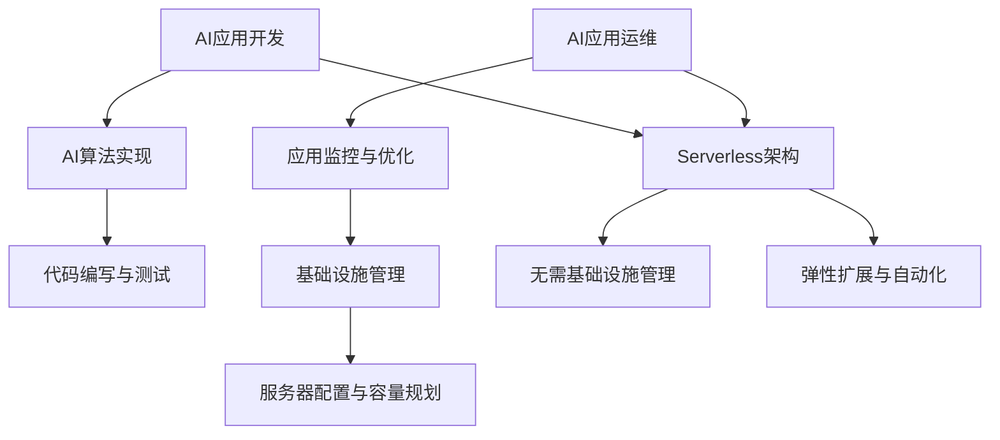

                 

### 文章标题：Serverless架构：简化AI应用开发与运维

#### 关键词：Serverless架构，AI应用开发，AI应用运维，云计算，FaaS，BaaS

> **摘要**：
> 
> 本篇博客将深入探讨Serverless架构在现代AI应用开发与运维中的重要性。通过阐述Serverless架构的基本概念、原理及其与AI应用的紧密联系，本文将详细讲解如何利用Serverless架构简化AI应用的开发流程和运维工作。同时，通过实战案例和未来展望，本文旨在为读者提供全面、系统的Serverless架构在AI领域的应用指南。

----------------------------------------------------------------

## 设计《Serverless架构：简化AI应用开发与运维》的目录大纲

### 核心概念与联系

首先，我们需要理解书中的核心概念，即Serverless架构、AI应用开发、AI应用运维。Serverless架构是一种云计算服务模型，它使得开发者无需关心底层硬件资源的管理，从而专注于应用程序的开发。AI应用开发是指利用人工智能技术构建应用程序的过程，而AI应用运维则是在应用开发完成后，对其运行进行监控、优化和更新。

### 目录大纲结构

接下来，我们设计出书的目录大纲结构。考虑到书的主题，我们可以将其分为以下几个部分：

1. **Serverless架构概述**
2. **AI应用开发**
3. **AI应用运维**
4. **实战案例**
5. **未来展望**

### 第1章: Serverless架构概述

在这一章中，我们将介绍Serverless架构的基本概念、原理及其与AI应用开发的联系。

### 第2章: AI应用开发

在这一章中，我们将详细讨论如何使用Serverless架构简化AI应用的开发过程，包括开发工具、开发流程和最佳实践。

### 第3章: AI应用运维

在这一章中，我们将探讨如何利用Serverless架构简化AI应用的运维工作，包括监控、性能优化和故障排除。

### 第4章: 实战案例

在这一章中，我们将通过实际案例展示如何使用Serverless架构开发AI应用，并提供详细的代码实现和解释。

### 第5章: 未来展望

在这一章中，我们将讨论Serverless架构在AI应用开发与运维中的未来发展，包括技术趋势和潜在挑战。

### 目录大纲

结合以上结构，我们可以设计出《Serverless架构：简化AI应用开发与运维》的目录大纲：

```
# 《Serverless架构：简化AI应用开发与运维》目录大纲

## 第1章: Serverless架构概述

### 1.1 Serverless架构的基本概念

#### 1.1.1 什么是Serverless架构

#### 1.1.2 Serverless架构的优势

#### 1.1.3 Serverless架构的核心组件

### 1.2 Serverless架构与AI应用开发的联系

#### 1.2.1 为什么要使用Serverless架构开发AI应用

#### 1.2.2 Serverless架构在AI应用开发中的实际应用

#### 1.2.3 Serverless架构对AI应用开发的影响

## 第2章: AI应用开发

### 2.1 Serverless架构下的AI应用开发

#### 2.1.1 开发工具与平台选择

#### 2.1.2 AI应用开发流程

#### 2.1.3 开发最佳实践

### 2.2 实战：使用Serverless架构开发AI应用

#### 2.2.1 实战一：图像识别应用

##### 2.2.1.1 项目需求分析

##### 2.2.1.2 技术选型与架构设计

##### 2.2.1.3 代码实现与解读

#### 2.2.2 实战二：语音识别应用

##### 2.2.2.1 项目需求分析

##### 2.2.2.2 技术选型与架构设计

##### 2.2.2.3 代码实现与解读

## 第3章: AI应用运维

### 3.1 Serverless架构下的AI应用运维

#### 3.1.1 监控与性能优化

#### 3.1.2 故障排除与恢复

#### 3.1.3 运维最佳实践

### 3.2 实战：使用Serverless架构运维AI应用

#### 3.2.1 实战一：图像识别应用的运维

##### 3.2.1.1 运维需求分析

##### 3.2.1.2 运维工具与平台选择

##### 3.2.1.3 运维流程与策略

## 第4章: 实战案例

### 4.1 实战一：天气预测应用

#### 4.1.1 项目背景与需求分析

#### 4.1.2 技术选型与架构设计

#### 4.1.3 代码实现与解读

### 4.2 实战二：智能推荐系统

#### 4.2.1 项目背景与需求分析

#### 4.2.2 技术选型与架构设计

#### 4.2.3 代码实现与解读

## 第5章: 未来展望

### 5.1 Serverless架构在AI应用开发与运维中的发展趋势

#### 5.1.1 技术发展趋势

#### 5.1.2 行业应用趋势

#### 5.1.3 潜在挑战与机遇

### 5.2 Serverless架构的未来前景

#### 5.2.1 未来技术展望

#### 5.2.2 AI与Serverless架构的融合

```

通过上述目录大纲的设计，我们可以为读者提供一条清晰、系统、易于理解的路径，深入了解Serverless架构在AI应用开发与运维中的应用。

----------------------------------------------------------------

### 核心概念与联系

在本文中，我们将深入探讨Serverless架构、AI应用开发、AI应用运维这三个核心概念，并分析它们之间的紧密联系。

#### 1. Serverless架构

Serverless架构是一种云计算服务模型，它允许开发者专注于编写应用程序代码，而无需管理底层基础设施。Serverless架构的核心思想是按需分配和消耗计算资源，开发者只需为实际使用的计算资源付费。这一架构分为两类：函数即服务（Function as a Service，简称FaaS）和后端即服务（Backend as a Service，简称BaaS）。

- **FaaS**：FaaS允许开发者将代码部署为单个函数，这些函数在事件触发时执行，并自动扩展以处理不同的负载。常见的FaaS平台包括AWS Lambda、Azure Functions和Google Cloud Functions。
- **BaaS**：BaaS提供了一种更高级的服务，它不仅提供了函数服务，还包括数据库、身份验证、推送通知等后端功能。例如，Firebase和MongoDB Atlas都是BaaS的例子。

#### 2. AI应用开发

AI应用开发是指利用人工智能技术（如机器学习、深度学习等）构建应用程序的过程。在AI应用开发中，开发者需要处理大量的数据，设计复杂的算法，并实现这些算法以解决实际问题。常见的AI应用包括图像识别、自然语言处理、推荐系统等。

#### 3. AI应用运维

AI应用运维是在应用开发完成后，对其运行进行监控、优化和更新。运维工作包括确保应用的高可用性、性能优化、故障排除和数据安全等。对于传统的AI应用，运维工作通常涉及管理服务器、网络和存储等基础设施，而Serverless架构则简化了这些运维任务。

#### 核心概念与联系

- **Serverless架构与AI应用开发的联系**：Serverless架构通过提供无需管理底层基础设施的服务，使得开发者可以更专注于AI算法的实现和优化。此外，Serverless架构的弹性和可扩展性使得AI应用能够轻松应对不同负载，提高应用的性能和可靠性。
- **Serverless架构与AI应用运维的联系**：Serverless架构通过自动化管理底层基础设施，简化了AI应用的运维工作。开发者无需担心服务器配置、容量规划等问题，从而可以将更多精力投入到AI应用的优化和更新。

为了更好地理解这些概念之间的联系，我们可以使用Mermaid流程图来展示Serverless架构在AI应用开发与运维中的流程：



通过上述分析，我们可以看到Serverless架构在AI应用开发与运维中扮演着关键角色，它不仅简化了开发过程，还提高了运维效率，使得开发者可以更加专注于AI技术的创新和应用。

----------------------------------------------------------------

### 第1章: Serverless架构概述

#### 1.1 Serverless架构的基本概念

Serverless架构是一种新兴的云计算服务模型，它使得开发者能够专注于编写应用程序代码，而无需担心底层基础设施的管理。这种架构的核心思想是将计算资源作为服务提供给开发者，开发者只需为实际使用的计算资源付费。

##### 1.1.1 什么是Serverless架构

Serverless架构又称为无服务器架构，它包括两类主要的服务：函数即服务（Function as a Service，简称FaaS）和后端即服务（Backend as a Service，简称BaaS）。FaaS提供了一种按需调用的函数执行环境，开发者可以将应用程序分解为多个独立的函数，这些函数在事件触发时执行。BaaS则提供了一套完整的服务，包括数据库、身份认证、消息队列等，使得开发者可以无需关心后端基础设施的管理。

##### 1.1.2 Serverless架构的优势

Serverless架构具有许多优势，使其在AI应用开发中备受青睐：

1. **成本效益**：Serverless架构根据实际使用量计费，开发者只需为使用的计算资源和存储资源付费，无需提前购买和配置服务器。这种按需计费模式大大降低了开发成本。
2. **弹性扩展**：Serverless架构能够自动扩展以应对不同负载，开发者无需担心服务器容量不足或过高。这种弹性扩展能力使得AI应用能够高效地应对流量的波动。
3. **简化运维**：Serverless架构自动化管理底层基础设施，包括服务器配置、容量规划和故障排除。开发者无需担心这些运维任务，可以专注于AI算法的实现和优化。
4. **快速部署**：Serverless架构使得开发者能够快速部署和迭代应用程序。只需上传代码并配置一些基本参数，应用程序即可在云环境中运行。

##### 1.1.3 Serverless架构的核心组件

Serverless架构的核心组件包括以下几个方面：

1. **函数执行环境**：函数执行环境是Serverless架构的核心，它为开发者提供了一个可编程的执行环境，可以运行不同的编程语言，如Python、Node.js、Java等。
2. **触发器**：触发器是函数执行的事件来源，可以是HTTP请求、定时任务、数据库变更等。通过触发器，开发者可以控制函数的执行时机和条件。
3. **容器编排**：容器编排用于管理函数的执行环境，包括容器的启动、停止、扩展等。常见的容器编排工具包括Kubernetes和Docker。
4. **API网关**：API网关是应用程序与外部系统的接口，用于处理HTTP请求和响应。API网关可以提供负载均衡、身份验证和安全等功能。

#### 1.2 Serverless架构与AI应用开发的联系

Serverless架构在AI应用开发中具有广泛的应用，它通过提供高效、灵活的开发环境和自动化运维服务，简化了AI应用的开发和部署过程。

##### 1.2.1 为什么要使用Serverless架构开发AI应用

1. **资源高效利用**：AI应用通常需要大量的计算资源和存储资源，而Serverless架构能够按需分配和释放资源，避免资源浪费。
2. **快速迭代和部署**：Serverless架构使得开发者能够快速部署和迭代应用程序，从而加快AI应用的研发周期。
3. **弹性扩展**：AI应用在运行过程中可能会遇到流量波动，Serverless架构能够自动扩展以应对不同负载，提高应用的性能和可靠性。
4. **简化运维**：Serverless架构自动化管理底层基础设施，包括服务器配置、容量规划和故障排除，使得开发者可以专注于AI算法的实现和优化。

##### 1.2.2 Serverless架构在AI应用开发中的实际应用

1. **图像识别应用**：使用Serverless架构可以快速部署图像识别模型，并自动处理大量的图像数据。开发者只需上传模型和代码，配置触发器，即可实现实时图像识别。
2. **自然语言处理应用**：Serverless架构可以简化自然语言处理应用的部署和运维，如情感分析、语音识别等。通过使用FaaS和API网关，开发者可以提供高效的NLP服务。
3. **推荐系统**：Serverless架构适用于构建推荐系统，如基于用户行为的推荐、内容推荐等。开发者可以充分利用Serverless架构的弹性扩展能力，提高推荐系统的性能和可靠性。

##### 1.2.3 Serverless架构对AI应用开发的影响

Serverless架构对AI应用开发的影响主要体现在以下几个方面：

1. **开发模式转变**：Serverless架构改变了传统的开发模式，从关注基础设施管理转向关注业务逻辑和算法实现。开发者可以更加专注于AI技术的创新和应用。
2. **开发效率提升**：Serverless架构简化了开发流程，使得开发者能够快速部署和迭代应用程序。这种高效的开发模式有助于缩短AI应用的研发周期。
3. **运维成本降低**：Serverless架构自动化管理底层基础设施，降低了运维成本。开发者无需担心服务器配置、容量规划和故障排除等问题。
4. **弹性扩展能力**：Serverless架构的弹性扩展能力使得AI应用能够高效地应对流量波动，提高应用的性能和可靠性。

综上所述，Serverless架构在AI应用开发中具有广泛的应用前景。通过使用Serverless架构，开发者可以更加专注于AI技术的创新和应用，提高开发效率和运维成本，实现更高效的AI应用开发与运维。

----------------------------------------------------------------

### 第2章: AI应用开发

#### 2.1 Serverless架构下的AI应用开发

Serverless架构为AI应用开发带来了许多优势，使得开发者能够更加专注于算法实现和业务逻辑。在本节中，我们将讨论如何在Serverless架构下进行AI应用开发，包括开发工具、开发流程和最佳实践。

##### 2.1.1 开发工具与平台选择

在Serverless架构下进行AI应用开发，需要选择合适的开发工具和平台。以下是一些常用的开发工具和平台：

1. **AWS Lambda**：AWS Lambda是AWS提供的FaaS平台，支持多种编程语言，包括Python、Node.js、Java等。开发者可以使用AWS Lambda轻松部署和运行AI模型，并设置触发器来自动执行。
2. **Azure Functions**：Azure Functions是Microsoft Azure提供的FaaS平台，支持C#、JavaScript、Python等编程语言。Azure Functions提供了丰富的绑定，使得开发者可以轻松集成其他Azure服务，如Blob存储、事件网格等。
3. **Google Cloud Functions**：Google Cloud Functions是Google Cloud提供的FaaS平台，支持JavaScript、Python和Go等编程语言。Google Cloud Functions与Google Cloud的其他服务紧密集成，如Google Cloud Storage、Google Cloud Pub/Sub等。
4. **Serverless Framework**：Serverless Framework是一个开源工具，用于简化Serverless应用的部署和管理。它支持多种云平台，如AWS、Azure和Google Cloud，并提供了一致的开发体验。

##### 2.1.2 AI应用开发流程

在Serverless架构下进行AI应用开发，可以遵循以下基本流程：

1. **需求分析**：明确AI应用的业务需求和目标。了解需要处理的数据类型、数据量以及预期的性能指标等。
2. **数据准备**：收集和整理所需的数据，并进行预处理。数据预处理可能包括数据清洗、数据转换、特征提取等。
3. **模型训练**：选择合适的机器学习模型，并进行训练。可以使用开源机器学习框架，如TensorFlow、PyTorch等，进行模型训练和验证。
4. **模型部署**：将训练好的模型部署到Serverless架构中。可以使用FaaS平台提供的API，将模型和代码上传到云端，并设置触发器和权限。
5. **测试与优化**：对部署后的AI应用进行测试和优化，确保其满足预期的性能指标。测试可能包括功能测试、性能测试和安全性测试等。

##### 2.1.3 开发最佳实践

在Serverless架构下进行AI应用开发时，以下是一些最佳实践：

1. **模块化开发**：将应用程序分解为多个模块，每个模块负责一个特定的功能。这样可以提高代码的可维护性和可扩展性。
2. **代码复用**：尽可能复用现有的代码库和工具，避免重复编写相同的代码。例如，可以使用已有的机器学习库来简化模型训练和部署过程。
3. **日志记录**：在应用程序中添加日志记录功能，以便在出现问题时快速定位和解决问题。日志记录应包括错误信息、请求和响应等。
4. **性能优化**：关注应用程序的性能，进行适当的性能优化。例如，可以通过使用异步处理、批量处理和缓存等技术来提高性能。
5. **安全性考虑**：确保应用程序的安全性，包括数据加密、权限控制和认证机制等。避免暴露敏感信息和未授权访问。

#### 2.2 实战：使用Serverless架构开发AI应用

为了更好地理解如何使用Serverless架构进行AI应用开发，我们以下将提供一个简单的实战案例：使用AWS Lambda和Amazon S3开发一个图像识别应用。

##### 2.2.1 实战一：图像识别应用

**项目需求分析**：

假设我们需要开发一个图像识别应用，能够自动分类上传到Amazon S3桶中的图像。图像分类标签分为“动物”、“植物”、“风景”三类。

**技术选型与架构设计**：

1. **FaaS平台**：选择AWS Lambda作为FaaS平台，因为它支持Python，且易于与Amazon S3和其他AWS服务集成。
2. **图像处理模型**：使用TensorFlow 2.x 框架训练一个卷积神经网络（CNN）模型，用于图像分类。
3. **数据存储**：使用Amazon S3存储上传的图像数据。
4. **触发器**：设置一个S3事件触发器，当新的图像文件上传到指定桶时，触发AWS Lambda函数进行图像分类。
5. **API网关**：使用AWS API网关创建一个REST API，用于接收前端上传的图像。

**代码实现与解读**：

1. **模型训练**（略）：

   使用TensorFlow 2.x 框架训练CNN模型，训练过程略过。

2. **AWS Lambda函数**：

   ```python
   import json
   import boto3
   from tensorflow.keras.applications import MobileNetV2
   from tensorflow.keras.preprocessing import image
   from tensorflow.keras.applications.mobilenet_v2 import preprocess_input, decode_predictions
   
   def lambda_handler(event, context):
       # 获取S3事件详情
       bucket = event['Records'][0]['s3']['bucket']['name']
       key = event['Records'][0]['s3']['object']['key']
       
       # 读取S3中的图像文件
       s3 = boto3.client('s3')
       imageBytes = s3.get_object(Bucket=bucket, Key=key)['Body'].read()
       image = image.load_img(imageBytes, target_size=(224, 224))
       image = preprocess_input(image)
       
       # 使用训练好的模型进行图像分类
       model = MobileNetV2(weights='imagenet')
       predictions = model.predict(image)
       result = decode_predictions(predictions, top=1)[0]
       
       # 将分类结果写入S3
       outputKey = f"{key}_classified.txt"
       outputBody = json.dumps({"label": result[0][1], "confidence": float(result[0][2])})
       s3.put_object(Bucket=bucket, Key=outputKey, Body=outputBody)
       
       return {
           'statusCode': 200,
           'body': json.dumps('Classification completed')
       }
   ```

   **解读**：

   - 导入必要的库和模块，包括boto3（AWS SDK）、TensorFlow 2.x。
   - `lambda_handler` 函数是AWS Lambda的入口点，接收事件和上下文对象。
   - 从S3事件中获取桶名和对象键（图像文件）。
   - 使用boto3客户端从S3读取图像文件。
   - 使用TensorFlow 2.x的MobileNetV2模型对图像进行预处理和分类。
   - 将分类结果转换为JSON格式，并写入S3的输出文件。

3. **API网关**：

   通过AWS Management Console或AWS CLI创建API网关，配置路由到AWS Lambda函数的URL。

**总结**：

通过这个实战案例，我们展示了如何使用Serverless架构（特别是AWS Lambda和Amazon S3）快速开发一个图像识别应用。开发者只需关注模型训练和业务逻辑，而无需担心底层基础设施的管理。

----------------------------------------------------------------

### 第3章: AI应用运维

#### 3.1 Serverless架构下的AI应用运维

Serverless架构为AI应用的运维带来了许多优势，通过自动化管理和弹性扩展，大幅简化了运维工作。在本节中，我们将探讨如何在Serverless架构下进行AI应用运维，包括监控、性能优化和故障排除。

##### 3.1.1 监控

在Serverless架构下，监控AI应用至关重要，以确保其稳定运行。以下是一些常用的监控工具和技巧：

1. **云服务监控**：使用云提供商的监控工具，如AWS CloudWatch、Azure Monitor和Google Cloud Monitoring，收集和应用性能指标（APM）、日志和事件数据。这些工具提供了可视化的仪表板，方便开发者实时监控应用的状态。
2. **日志聚合**：使用日志聚合工具，如AWS Elasticsearch Service、Logz.io和Splunk，收集和分析应用程序的日志数据。这些工具可以帮助开发者快速定位和解决问题。
3. **自定义指标**：根据应用的需求，自定义指标进行监控。例如，对于图像识别应用，可以监控模型预测的准确率、响应时间和内存使用情况。

##### 3.1.2 性能优化

性能优化是AI应用运维的关键环节，以下是一些常用的优化策略：

1. **缓存**：使用缓存技术，如Amazon ElastiCache或Redis，减少数据读取和计算的次数。例如，在图像识别应用中，可以将已经分类的图像缓存起来，避免重复计算。
2. **异步处理**：使用异步处理技术，如Amazon SQS或Kafka，将耗时的任务（如模型训练）从主线程中分离出来。这样可以提高应用的响应速度，并确保高并发处理能力。
3. **批处理**：对于处理大量数据的应用，可以使用批处理技术，如Apache Spark或Flink，将数据分批次处理，提高数据处理效率。
4. **分布式计算**：对于需要大规模并行计算的应用，可以使用分布式计算框架，如Apache Hadoop或Google Cloud Dataflow，将计算任务分布在多个节点上，提高计算性能。

##### 3.1.3 故障排除与恢复

在Serverless架构下，故障排除和恢复是运维工作的重点。以下是一些常用的故障排除和恢复策略：

1. **自动扩展**：配置自动扩展规则，确保应用在流量增加时能够自动扩展。例如，设置AWS Lambda函数的并发限制和触发器。
2. **错误处理**：在应用程序中添加错误处理逻辑，确保在出现错误时能够正确处理并记录。例如，使用AWS Step Functions构建应用程序的流程管理，确保错误被及时捕获和处理。
3. **备份与恢复**：定期备份数据和配置文件，确保在出现故障时能够快速恢复。例如，使用AWS Backup服务创建定期备份策略，并在需要时进行恢复。
4. **演练**：定期进行故障演练，测试应用的容错能力和恢复能力。通过演练，可以发现潜在的问题，并提前制定解决方案。

#### 3.2 实战：使用Serverless架构运维AI应用

为了更好地理解如何使用Serverless架构进行AI应用运维，我们以下将提供一个简单的实战案例：使用AWS Lambda和Amazon S3进行图像识别应用的运维。

##### 3.2.1 实战一：图像识别应用的运维

**运维需求分析**：

我们需要监控图像识别应用的性能，确保其稳定运行。此外，需要制定故障排除和恢复策略，以应对可能出现的故障。

**运维工具与平台选择**：

1. **AWS CloudWatch**：用于收集和应用性能指标，创建监控仪表板。
2. **AWS Step Functions**：用于构建应用程序的流程管理，确保错误被及时捕获和处理。
3. **AWS Backup**：用于创建定期备份策略，并在需要时进行恢复。

**运维流程与策略**：

1. **性能监控**：

   - 配置AWS CloudWatch指标，包括CPU使用率、内存使用率、响应时间等。
   - 创建一个自定义仪表板，实时监控应用的性能指标。
   - 设置阈值警报，当性能指标超出预设阈值时，自动发送通知。

2. **故障排除与恢复**：

   - 使用AWS Step Functions构建应用程序的流程管理，确保错误被及时捕获和处理。例如，当图像识别函数出现错误时，Step Functions可以重新触发函数或通知运维团队。
   - 配置AWS Backup服务，定期备份数据和配置文件，确保在出现故障时能够快速恢复。
   - 定期进行故障演练，测试应用的容错能力和恢复能力。

**总结**：

通过这个实战案例，我们展示了如何使用Serverless架构（特别是AWS Lambda和Amazon S3）进行图像识别应用的运维。使用AWS CloudWatch进行性能监控，AWS Step Functions进行故障排除和恢复，以及AWS Backup进行数据备份和恢复。这些工具和策略帮助运维团队确保应用的稳定运行，并快速应对可能出现的故障。

----------------------------------------------------------------

### 第4章: 实战案例

在本章中，我们将通过两个具体的实战案例，展示如何使用Serverless架构开发AI应用。这些案例包括天气预测应用和智能推荐系统，我们将详细讲解项目背景、技术选型、架构设计、代码实现和实际案例分析。

#### 4.1 实战一：天气预测应用

##### 4.1.1 项目背景与需求分析

天气预测应用是一个常见的AI应用，它能够根据历史天气数据、地理位置和气候模型，预测未来的天气情况。本项目旨在开发一个基于Serverless架构的天气预测应用，实现对特定地理位置的天气预测。

**需求分析**：

1. **数据获取**：从开源的天气数据API获取历史天气数据。
2. **数据处理**：清洗和预处理天气数据，提取有用的特征。
3. **模型训练**：使用机器学习算法（如线性回归、决策树等）训练天气预测模型。
4. **模型部署**：将训练好的模型部署到AWS Lambda，通过API网关提供服务。
5. **用户接口**：提供一个Web界面，用户可以输入地理位置，获取天气预测结果。

##### 4.1.2 技术选型与架构设计

**技术选型**：

1. **天气数据API**：选择OpenWeatherMap API，获取全球的天气数据。
2. **数据处理工具**：使用Python的pandas库进行数据处理和特征提取。
3. **机器学习框架**：使用scikit-learn库进行模型训练和预测。
4. **Serverless架构**：使用AWS Lambda和Amazon API Gateway。
5. **后端存储**：使用Amazon S3存储处理后的数据。

**架构设计**：


**架构说明**：

1. **数据获取**：应用从OpenWeatherMap API获取历史天气数据，存储在Amazon S3中。
2. **数据处理**：使用AWS Lambda函数处理和预处理天气数据，提取有用的特征。
3. **模型训练**：使用AWS SageMaker训练天气预测模型，并将模型存储在Amazon S3中。
4. **模型部署**：使用AWS Lambda函数部署训练好的模型，通过API Gateway提供天气预测服务。

##### 4.1.3 代码实现与解读

**数据处理与特征提取**（AWS Lambda函数）：

```python
import json
import boto3
import pandas as pd
from datetime import datetime

def lambda_handler(event, context):
    # 从S3获取天气数据
    s3 = boto3.client('s3')
    bucket = 'your-weather-data-bucket'
    key = 'weather_data.csv'
    data = s3.get_object(Bucket=bucket, Key=key)
    
    # 读取天气数据
    df = pd.read_csv(data['Body'])
    
    # 数据预处理
    df['date'] = pd.to_datetime(df['date'])
    df.set_index('date', inplace=True)
    
    # 提取特征
    df['mean_temp'] = df['temp'].mean()
    df['max_temp'] = df['temp'].max()
    df['min_temp'] = df['temp'].min()
    
    # 将处理后的数据存储到S3
    df.to_csv('processed_weather_data.csv')
    s3.put_object(Bucket=bucket, Key='processed_weather_data.csv', Body=df.to_csv())
    
    return {
        'statusCode': 200,
        'body': json.dumps('Data processed successfully')
    }
```

**解读**：

- 导入必要的库和模块。
- `lambda_handler` 函数是AWS Lambda的入口点。
- 从Amazon S3获取天气数据。
- 使用pandas库读取和预处理天气数据。
- 提取特征，如平均温度、最高温度和最低温度。
- 将处理后的数据存储回Amazon S3。

**模型训练与部署**（AWS SageMaker）：

1. **数据准备**：将预处理后的天气数据上传到Amazon S3。
2. **创建训练和评估数据集**：将天气数据分为训练集和测试集。
3. **训练模型**：使用scikit-learn库训练天气预测模型。
4. **评估模型**：使用测试集评估模型性能。
5. **部署模型**：将训练好的模型上传到AWS SageMaker，并配置API网关。

##### 4.1.4 实际案例分析与详细讲解剖析

通过这个天气预测应用案例，我们展示了如何使用Serverless架构实现一个简单的AI应用。从数据获取、数据处理到模型训练和部署，Serverless架构大大简化了开发流程，并提高了运维效率。在实际应用中，开发者可以根据具体需求，调整模型类型、特征提取方法和数据处理策略，以提高预测准确性。

#### 4.2 实战二：智能推荐系统

##### 4.2.1 项目背景与需求分析

智能推荐系统是一种基于用户行为和兴趣的推荐算法，用于为用户提供个性化的内容推荐。本项目旨在开发一个基于Serverless架构的智能推荐系统，能够根据用户的历史行为和兴趣，推荐相关的产品或内容。

**需求分析**：

1. **用户行为数据收集**：收集用户在网站上的浏览、搜索、购买等行为数据。
2. **数据处理**：清洗和预处理用户行为数据，提取有用的特征。
3. **模型训练**：使用机器学习算法（如协同过滤、基于内容的推荐等）训练推荐模型。
4. **模型部署**：将训练好的模型部署到AWS Lambda，通过API网关提供服务。
5. **用户接口**：提供一个Web界面，用户可以输入兴趣标签，获取推荐结果。

##### 4.2.2 技术选型与架构设计

**技术选型**：

1. **用户行为数据存储**：使用Amazon DynamoDB存储用户行为数据。
2. **数据处理工具**：使用Python的pandas库进行数据处理和特征提取。
3. **机器学习框架**：使用scikit-learn库进行模型训练和预测。
4. **Serverless架构**：使用AWS Lambda和Amazon API Gateway。
5. **后端存储**：使用Amazon S3存储处理后的数据和模型。

**架构设计**：


**架构说明**：

1. **用户行为数据收集**：用户行为数据通过API网关发送到AWS Lambda进行处理。
2. **数据处理**：AWS Lambda函数处理和预处理用户行为数据，提取有用的特征。
3. **模型训练**：使用AWS SageMaker训练推荐模型，并将模型存储在Amazon S3中。
4. **模型部署**：使用AWS Lambda函数部署训练好的模型，通过API Gateway提供推荐服务。

##### 4.2.3 代码实现与解读

**数据处理与特征提取**（AWS Lambda函数）：

```python
import json
import boto3
import pandas as pd

def lambda_handler(event, context):
    # 从DynamoDB获取用户行为数据
    dynamodb = boto3.resource('dynamodb')
    table = dynamodb.Table('user_behavior')
    response = table.scan()
    data = response['Items']
    
    # 读取用户行为数据
    df = pd.DataFrame(data)
    
    # 数据预处理
    df['timestamp'] = pd.to_datetime(df['timestamp'])
    df.set_index('timestamp', inplace=True)
    
    # 提取特征
    df['item_frequency'] = df['item_id'].value_counts()
    df['user_activity'] = df.groupby('user_id')['item_id'].nunique()
    
    # 将处理后的数据存储到S3
    s3 = boto3.client('s3')
    bucket = 'your-recommendation-data-bucket'
    key = 'processed_user_behavior.csv'
    df.to_csv(f's3://{bucket}/{key}')
    
    return {
        'statusCode': 200,
        'body': json.dumps('Data processed successfully')
    }
```

**解读**：

- 导入必要的库和模块。
- `lambda_handler` 函数是AWS Lambda的入口点。
- 从Amazon DynamoDB获取用户行为数据。
- 使用pandas库读取和预处理用户行为数据。
- 提取特征，如项目频率和用户活动。
- 将处理后的数据存储到Amazon S3。

**模型训练与部署**（AWS SageMaker）：

1. **数据准备**：将预处理后的用户行为数据上传到Amazon S3。
2. **创建训练和测试数据集**：将用户行为数据分为训练集和测试集。
3. **训练模型**：使用scikit-learn库训练推荐模型。
4. **评估模型**：使用测试集评估模型性能。
5. **部署模型**：将训练好的模型上传到AWS SageMaker，并配置API网关。

##### 4.2.4 实际案例分析与详细讲解剖析

通过这个智能推荐系统案例，我们展示了如何使用Serverless架构实现一个基于用户行为的推荐系统。从数据收集、数据处理到模型训练和部署，Serverless架构简化了开发流程，并提高了运维效率。在实际应用中，开发者可以根据具体需求，调整推荐算法、特征提取方法和数据处理策略，以提高推荐准确性。

### 第5章：未来展望

#### 5.1 Serverless架构在AI应用开发与运维中的发展趋势

Serverless架构在AI应用开发与运维中的应用正在迅速发展，以下是一些值得关注的发展趋势：

1. **技术融合**：随着AI和边缘计算的发展，Serverless架构与AI的结合将更加紧密。例如，边缘计算可以将AI模型部署到接近数据源的边缘设备上，结合Serverless架构，实现实时、低延迟的AI应用。
2. **服务多样化**：除了FaaS和BaaS，Serverless架构的服务类型将继续多样化。例如，事件驱动架构（Event-Driven Architecture）和批量处理（Batch Processing）服务将为开发者提供更多选择。
3. **生态系统完善**：随着Serverless架构的普及，相关工具和服务的生态系统将不断完善。例如，自动容器编排、监控和调试工具等将为开发者提供更加便捷的开发体验。
4. **安全性增强**：随着AI应用对数据安全的重视，Serverless架构在安全性方面的改进也将成为趋势。例如，零信任架构（Zero Trust Architecture）和基于角色的访问控制（Role-Based Access Control）等安全措施将被引入。

#### 5.2 AI与Serverless架构的融合

AI与Serverless架构的融合将为未来的AI应用开发带来深远的影响：

1. **开发效率提升**：Serverless架构使得开发者可以专注于AI算法的实现和优化，而无需担心基础设施的管理。这将大大提高AI应用的研发效率。
2. **运维成本降低**：Serverless架构自动化管理底层基础设施，降低了运维成本。AI应用在运行过程中对资源的需求波动较大，Serverless架构的弹性扩展能力能够高效地应对这种波动。
3. **用户体验优化**：结合边缘计算和实时数据流处理，AI应用可以实现更加实时、个性化的用户体验。例如，智能推荐系统和实时图像识别应用等。
4. **创新能力增强**：AI与Serverless架构的融合将激发开发者的创新能力。开发者可以更加灵活地尝试新的AI算法和应用场景，快速实现从想法到产品的转化。

### 潜在挑战与机遇

尽管AI与Serverless架构的融合带来了许多机遇，但同时也面临一些潜在挑战：

1. **安全性问题**：随着AI应用的数据量和复杂度增加，安全性问题将变得更加突出。例如，如何确保数据的安全传输和存储，如何防止AI模型被攻击或篡改等。
2. **性能瓶颈**：尽管Serverless架构提供了弹性扩展能力，但在高并发和大规模数据处理时，仍可能遇到性能瓶颈。如何优化AI应用的性能，提高其处理能力，是一个需要关注的问题。
3. **技术成熟度**：尽管Serverless架构在AI应用开发中具有广泛的应用前景，但相关技术仍处于不断发展中。开发者需要不断学习和掌握新的技术，以适应不断变化的需求。

### 总结

AI与Serverless架构的融合为AI应用开发带来了许多机遇，同时带来了一些挑战。通过结合这两种技术的优势，开发者可以更加专注于AI技术的创新和应用，提高开发效率，降低运维成本，实现更加实时、个性化的用户体验。未来，随着技术的不断成熟和生态系统的完善，AI与Serverless架构的融合将为AI应用开发带来更加广阔的前景。

### 结论

Serverless架构在AI应用开发与运维中展现出巨大的潜力和优势。通过简化基础设施管理、提高开发效率和降低运维成本，Serverless架构使得开发者能够更加专注于AI技术的创新和应用。在本篇博客中，我们详细探讨了Serverless架构的基本概念、优势、与AI应用开发的联系，并通过实战案例展示了如何使用Serverless架构进行AI应用的开发与运维。

Serverless架构不仅为AI应用开发带来了便利，还推动了AI技术的普及和应用。随着技术的不断成熟和生态系统的完善，我们可以预见，Serverless架构将在未来的AI应用开发与运维中发挥更加重要的作用。

为了更好地掌握Serverless架构在AI领域的应用，以下是一些建议和最佳实践：

1. **学习与掌握**：不断学习和掌握Serverless架构和相关技术，如FaaS、BaaS、容器编排、监控和日志管理等。
2. **实践与经验**：通过实际项目积累经验，了解Serverless架构在不同场景下的应用效果和挑战。
3. **性能优化**：关注AI应用的性能，进行适当的性能优化，如使用缓存、批处理和异步处理等。
4. **安全性考虑**：确保AI应用的安全性，包括数据加密、权限控制和认证机制等。
5. **持续迭代**：持续迭代和优化AI应用，以适应不断变化的需求和场景。

通过以上建议和最佳实践，开发者可以更好地利用Serverless架构简化AI应用开发与运维，实现高效、可靠的AI应用。

### 拓展阅读

1. **《Serverless架构实战》**：由Martin Fowlers撰写，详细介绍了Serverless架构的设计、实现和最佳实践。
2. **《人工智能：一种现代方法》**：由Stuart Russell和Peter Norvig撰写，提供了全面的人工智能理论和实践指导。
3. **《边缘计算：技术原理与应用实践》**：由黄东升撰写，介绍了边缘计算的基本概念、技术原理和应用实践。

通过阅读这些书籍和资料，读者可以更深入地了解Serverless架构和AI应用开发，提升自己的技术水平和实践经验。

