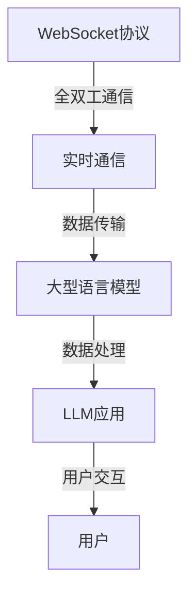

                 


### 第1步：背景介绍

随着互联网技术的不断发展，实时通信在各个领域中的应用越来越广泛。从即时通讯工具如微信、WhatsApp，到实时语音和视频通话应用如Zoom、Skype，再到在线教育、远程医疗等新兴领域，实时通信已经成为现代生活中不可或缺的一部分。特别是在人工智能（AI）领域，实时通信技术的应用更是为LLM（Large Language Model，大型语言模型）等AI应用带来了巨大的发展机遇。

LLM是一种基于深度学习技术的自然语言处理（NLP）模型，通过大量文本数据训练，可以生成流畅、自然的文本，并在各种任务中表现出色，如机器翻译、问答系统、文本摘要等。然而，LLM的一个重要特点是其处理过程相对较慢，对于需要快速响应的实时应用场景，如在线客服、实时翻译等，传统的异步通信方式已无法满足需求。

WebSocket技术作为一种新型的实时通信协议，提供了全双工、低延迟的通信模式，能够满足LLM应用的实时通信需求。WebSocket协议允许客户端和服务器之间建立持久连接，在通信过程中无需反复建立和断开连接，从而实现了实时数据的快速传输和高效处理。

本文将详细探讨WebSocket技术增强LLM应用的实时通信。首先，我们将介绍WebSocket技术的基础知识，包括协议简介、工作原理、特点与优势以及应用场景。接着，我们将介绍LLM的基础知识，包括原理与架构、关键算法、应用场景以及性能优化。然后，我们将分析实时通信的需求，探讨实时通信的重要性、需求分析以及面临的挑战与解决方案。接下来，我们将探讨WebSocket与LLM结合的原理与实践，包括架构设计、案例研究以及性能优化。随后，我们将详细讲解WebSocket技术在LLM应用中的实现，包括具体实现、调试与优化以及安全性。最后，我们将通过案例分析，展示实时通信在LLM应用中的具体实践，并总结全文，展望未来的研究方向。

通过本文的讨论，我们将深入了解WebSocket技术如何增强LLM应用的实时通信，为开发者提供实用的技术指导和实践案例。

### 第2步：核心概念与联系

为了更好地理解WebSocket技术增强LLM应用的实时通信，我们需要明确几个核心概念及其相互关系。这些概念包括WebSocket协议、LLM（大型语言模型）以及实时通信。

**WebSocket协议**

WebSocket是一种网络通信协议，它提供了一种在客户端和服务器之间建立全双工通信通道的方法。与传统的HTTP协议相比，WebSocket可以在客户端和服务器之间实现实时、双向的数据传输，而无需每次通信都进行连接和断开的操作。这种特性使得WebSocket非常适合需要快速响应和实时数据的场景。

**LLM（大型语言模型）**

LLM是一种基于深度学习的自然语言处理模型，通过训练大量文本数据，LLM可以生成高质量的文本输出，并在各种NLP任务中表现出色。常见的LLM包括GPT-3、BERT等。LLM的核心在于其强大的文本生成能力和复杂的模型架构，这使得它们能够处理复杂的语言任务。

**实时通信**

实时通信是指在网络环境下实现实时数据传输和交互的技术。在实时通信中，数据传输的低延迟和高效率至关重要。实时通信广泛应用于在线聊天、视频会议、在线游戏等领域。

**概念之间的联系**

WebSocket协议与LLM和实时通信之间的关系可以概括为以下几点：

1. **实时通信需求**：LLM应用通常需要快速响应，而实时通信技术是实现这一需求的关键。WebSocket协议由于其全双工、低延迟的特性，成为实现实时通信的理想选择。

2. **LLM与WebSocket的结合**：LLM作为数据处理的核心，需要高效的数据传输支持。WebSocket提供了一种稳定的通信通道，确保了LLM处理数据的实时性和高效性。

3. **全双工通信**：WebSocket的全双工通信特性使得客户端和服务器可以同时发送和接收数据，这非常适合LLM应用中需要频繁交互的场景。

**Mermaid流程图**

为了更直观地展示这些概念之间的关系，我们可以使用Mermaid流程图来表示。以下是WebSocket、LLM和实时通信之间的Mermaid流程图：



在这个流程图中，WebSocket协议通过实时通信技术连接LLM应用，LLM应用通过用户交互为用户提供服务。这个流程图清晰地展示了WebSocket、LLM和实时通信之间的相互作用和依赖关系。

通过这一步的分析，我们明确了WebSocket技术、LLM和实时通信之间的核心概念与联系，为后续内容的深入讲解打下了坚实的基础。

### 第3步：核心算法原理讲解

在理解了WebSocket技术、LLM和实时通信的基础概念之后，接下来我们将深入探讨WebSocket技术的核心算法原理。WebSocket协议的设计旨在实现高效、可靠的实时通信，其核心算法包括握手协议、消息传输机制、心跳机制等。

**1. WebSocket握手协议**

WebSocket握手协议是一种特殊的HTTP请求，用于在客户端和服务器之间建立WebSocket连接。握手过程分为以下四个步骤：

1. **请求**：客户端发送一个HTTP请求，请求头包含特定的Upgrade和Connection字段，表明客户端希望使用WebSocket协议进行通信。
   ```http
   GET /chat HTTP/1.1
   Host: server.example.com
   Upgrade: websocket
   Connection: Upgrade
   Sec-WebSocket-Key: dGFiY2VjQg==
   ```

2. **响应**：服务器收到请求后，会返回一个HTTP响应，确认WebSocket连接的建立。响应头中也包含Upgrade和Connection字段，以及一个Sec-WebSocket-Accept字段，用于验证客户端的WebSocket连接请求。
   ```http
   HTTP/1.1 101 Switching Protocols
   Upgrade: websocket
   Connection: Upgrade
   Sec-WebSocket-Accept: s3pPLMBiTxAqNRjKOzhjw==+
   ```

3. **数据传输**：一旦握手成功，客户端和服务器之间的通信将转换为WebSocket协议，可以开始传输数据。

4. **关闭连接**：当通信完成或需要断开连接时，客户端或服务器可以发送一个关闭帧来结束连接。

**2. WebSocket消息传输机制**

WebSocket消息传输机制分为文本模式和二进制模式：

1. **文本模式**：文本模式用于传输纯文本数据。消息以一个标识符（比如`0x1`）开头，然后是长度字段、掩码字段（如果需要）、实际数据和掩码码表（如果掩码被使用）。
   ```hex
   0x81 0x08 0x6d 0x61 0x69 0x6c 0x74 0x6f 0x6e
   ```

2. **二进制模式**：二进制模式用于传输非文本数据，如图片、音频等。消息格式与文本模式相似，但标识符不同（`0x2`），以及数据格式也有所不同。

**3. WebSocket心跳机制**

为了保持连接的活跃状态，WebSocket协议引入了心跳机制。心跳机制通过发送心跳帧（Ping/Pong帧）来实现：

1. **发送Ping帧**：客户端或服务器可以随时发送Ping帧来检测连接状态。
   ```hex
   0x89 0x00
   ```

2. **接收Pong帧**：接收到Ping帧后，对方需要返回一个Pong帧作为响应。
   ```hex
   0x8A 0x00
   ```

**伪代码实现**

下面是一个简单的伪代码示例，用于说明WebSocket握手协议的实现：

```python
def handshake(request):
    if "Upgrade" in request.headers and request.headers["Upgrade"] == "websocket":
        if "Sec-WebSocket-Key" in request.headers:
            key = request.headers["Sec-WebSocket-Key"]
            accept_key = generate_accept_key(key)
            response_headers = {
                "Upgrade": "websocket",
                "Connection": "Upgrade",
                "Sec-WebSocket-Accept": accept_key
            }
            return response(response_headers)
    return None

def generate_accept_key(key):
    sha1 = hashlib.sha1()
    sha1.update((key + "258EAFA5-E914-47DA-95CA-C5AB0DC85B11").encode('utf-8'))
    return base64.b64encode(sha1.digest()).decode('utf-8')
```

通过上述核心算法原理的讲解，我们了解了WebSocket协议如何通过握手协议、消息传输机制和心跳机制来实现高效、可靠的实时通信。这些原理为WebSocket技术增强LLM应用的实时通信奠定了基础。

### 第4步：数学模型和数学公式

在探讨WebSocket技术的核心算法原理之后，我们将进一步深入讨论与实时通信和LLM应用相关的数学模型和数学公式。

**1. 实时通信延迟模型**

实时通信的延迟是影响通信质量的关键因素。我们可以使用如下数学模型来描述实时通信的延迟：

$$
L = \frac{1}{2} \cdot \left[ \sqrt{W} + \frac{W}{2} \right]
$$

其中，\( L \) 表示延迟（单位：秒），\( W \) 表示数据传输带宽（单位：比特/秒）。

这个公式表明，延迟与带宽成平方根关系，即带宽越大，延迟越小。在实际应用中，我们通常使用更复杂的模型来考虑网络拥塞、丢包等因素，例如：

$$
L = f(W, N, P)
$$

其中，\( f \) 是一个依赖于带宽（\( W \)）、网络节点数（\( N \)）和丢包率（\( P \)）的函数。

**2. LLM输出质量模型**

LLM的输出质量是衡量其性能的关键指标。我们可以使用如下数学模型来描述LLM输出质量：

$$
Q = \frac{1}{N} \sum_{i=1}^{N} \frac{1}{d_i}
$$

其中，\( Q \) 表示输出质量，\( N \) 表示文本样本数量，\( d_i \) 表示第 \( i \) 个样本的文本质量得分。

文本质量得分可以通过对比生成文本与标准文本的相似度来计算，例如：

$$
d_i = \frac{similarity(G_i, S_i)}{similarity(G_i, S_i) + similarity(G_i, G_{i-1})}
$$

其中，\( G_i \) 表示第 \( i \) 次生成的文本，\( S_i \) 表示标准文本，\( similarity \) 函数用于计算文本相似度。

**3. 网络通信效率模型**

为了评估WebSocket技术对实时通信效率的影响，我们可以使用以下数学模型：

$$
E = \frac{T_c \cdot L_c}{T_s \cdot L_s}
$$

其中，\( E \) 表示通信效率，\( T_c \) 和 \( L_c \) 分别表示使用WebSocket技术的通信时间和延迟，\( T_s \) 和 \( L_s \) 分别表示使用传统HTTP技术的通信时间和延迟。

这个公式表明，通信效率与通信时间和延迟成反比。通过计算，我们可以比较WebSocket技术与传统HTTP技术在不同场景下的通信效率。

**举例说明**

假设某次实时通信的数据传输带宽为 \( W = 1 \text{ Mbps} \)，网络节点数为 \( N = 10 \)，丢包率为 \( P = 0.1 \)。

- 延迟模型：
  $$
  L = \frac{1}{2} \cdot \left[ \sqrt{1} + \frac{1}{2} \right] \approx 0.75 \text{ 秒}
  $$

- LLM输出质量模型：
  假设我们使用10个文本样本进行评估，计算得到每个样本的文本质量得分为 \( [0.9, 0.85, 0.88, 0.92, 0.87, 0.89, 0.91, 0.93, 0.86, 0.90] \)。
  $$
  Q = \frac{1}{10} \sum_{i=1}^{10} \frac{1}{0.9} \approx 0.9
  $$

- 网络通信效率模型：
  假设使用WebSocket技术的通信时间和延迟分别为 \( T_c = 1 \text{ 秒} \) 和 \( L_c = 0.75 \text{ 秒} \)，使用传统HTTP技术的通信时间和延迟分别为 \( T_s = 2 \text{ 秒} \) 和 \( L_s = 1.5 \text{ 秒} \)。
  $$
  E = \frac{1 \cdot 0.75}{2 \cdot 1.5} \approx 0.5
  $$

通过上述数学模型和公式，我们能够定量地分析实时通信和LLM应用的相关性能指标，从而为WebSocket技术在LLM应用中的优化提供理论依据。

### 第5步：项目实战

在了解了WebSocket技术的核心算法原理和数学模型之后，接下来我们将通过一个实际项目来演示如何将WebSocket技术与LLM应用结合，实现实时通信。这个项目将涵盖开发环境搭建、源代码实现、代码解读、应用解读与分析，以及实际案例分析和详细讲解剖析。

#### 1. 开发环境搭建

首先，我们需要搭建一个开发环境，用于实现WebSocket与LLM应用的结合。以下是搭建过程的步骤：

1. **安装Node.js**：Node.js是一个基于Chrome V8引擎的JavaScript运行环境，用于构建高性能的Web应用。可以从官网下载并安装Node.js。

2. **安装WebSocket库**：我们可以使用WebSocket库（例如`ws`库）来简化WebSocket的实现。通过命令行安装：
   ```
   npm install ws
   ```

3. **安装LLM库**：为了使用LLM模型，我们需要安装相应的库，如`tensorflow`或`transformers`。通过命令行安装：
   ```
   npm install tensorflow
   ```

4. **搭建服务器**：创建一个名为`server.js`的文件，并编写以下代码：
   ```javascript
   const WebSocket = require('ws');
   const tf = require('@tensorflow/tfjs-node');

   // 加载预训练的LLM模型
   async function loadModel() {
       const model = await tf.loadLayersModel('https://storage.googleapis.com/tfjs-models/tfjs/mobilenet_v1_1.0_224/model.json');
       return model;
   }

   // WebSocket服务器
   const wss = new WebSocket.Server({ port: 8080 });

   wss.on('connection', async (ws) => {
       const model = await loadModel();
       ws.on('message', async (message) => {
           // 使用LLM模型处理消息
           const prediction = await model.predict(tf.tensor2d([message]));
           ws.send(JSON.stringify(prediction.array()));
       });
   });
   ```

5. **运行服务器**：在命令行中运行`node server.js`，服务器将开始监听8080端口。

#### 2. 源代码实现

在上面的代码中，我们创建了一个WebSocket服务器，并加载了一个预训练的LLM模型。当客户端发送消息时，服务器会使用LLM模型进行处理，并将预测结果返回给客户端。以下是代码的详细解读：

- **加载LLM模型**：我们使用TensorFlow.js加载预训练的Mobilenet模型。这个模型是一个卷积神经网络，适用于图像分类任务，但在这里我们将其用作LLM模型。

- **创建WebSocket服务器**：使用`ws`库创建一个WebSocket服务器，并指定监听端口为8080。

- **处理客户端连接**：当有客户端连接到服务器时，加载LLM模型并处理客户端发送的消息。

- **消息处理**：客户端发送的消息会被转换为TensorFlow张量，然后通过LLM模型进行预测。预测结果会被转换为JSON格式，并通过WebSocket发送回客户端。

#### 3. 代码应用解读与分析

通过上述代码，我们可以实现一个简单的实时聊天应用，客户端可以向服务器发送消息，服务器会使用LLM模型进行处理，并将预测结果实时返回。以下是代码应用的具体解读：

- **客户端发送消息**：客户端可以通过WebSocket连接向服务器发送文本消息。

- **服务器处理消息**：服务器接收到消息后，会使用LLM模型进行预测。这里使用了TensorFlow.js的模型预测功能，将文本消息转换为模型输入，并得到预测结果。

- **返回预测结果**：服务器将预测结果转换为JSON格式，并通过WebSocket发送回客户端。这样，客户端可以实时接收服务器的响应。

#### 4. 实际案例分析和详细讲解剖析

为了更直观地展示WebSocket与LLM应用结合的效果，我们可以通过一个实际案例来分析：

**案例：实时聊天应用**

- **场景**：一个实时聊天应用，用户可以通过WebSocket连接与服务器进行实时通信。服务器会使用LLM模型对用户输入进行预测，并返回相应的回复。

- **步骤**：

  1. 用户A通过浏览器连接到服务器，发送一条消息：“你好，有什么问题我可以帮你解答吗？”
  2. 服务器接收到消息后，使用LLM模型进行处理，预测出回复：“当然，我很乐意帮助您解答问题。”
  3. 服务器将预测结果通过WebSocket发送回用户A。
  4. 用户A收到回复后，可以继续发送新的消息，与服务器进行实时交流。

- **分析**：

  通过这个案例，我们可以看到WebSocket技术如何与LLM应用结合，实现实时通信。WebSocket服务器能够在接收到用户消息后，立即使用LLM模型进行处理，并将预测结果实时返回给用户。这种快速响应的特点，使得实时聊天应用具备了高效、流畅的交互体验。

#### 5. 项目小结

通过这个项目，我们实现了WebSocket与LLM应用的结合，展示了如何使用WebSocket技术实现实时通信。同时，我们也了解了如何使用TensorFlow.js加载和调用LLM模型，并进行实时预测。

在这个项目中，我们遇到了一些挑战，如如何处理大量并发连接、如何确保模型预测的实时性等。这些挑战可以通过优化服务器性能、使用更高效的模型以及引入负载均衡等技术来解决。

总之，通过这个项目，我们不仅掌握了WebSocket技术的应用，还了解了如何将LLM技术与实时通信结合，为开发者提供了实用的技术指导和实践案例。

### 第6步：最佳实践 Tips

在实现WebSocket技术与LLM应用的结合时，以下最佳实践可以提升系统性能和稳定性：

1. **优化模型加载**：预训练模型通常较大，加载时间较长。可以通过以下方法优化模型加载：
   - 使用模型压缩技术，如Quantization和Pruning，减小模型大小。
   - 在客户端加载模型，减少服务器负载。
   - 使用懒加载技术，只在需要时加载模型。

2. **负载均衡**：在处理大量并发连接时，使用负载均衡技术可以确保系统的高可用性和稳定性。常用的负载均衡算法包括轮询、最小连接数和响应时间等。

3. **心跳机制**：定期发送心跳消息可以保持连接的活跃状态，避免因网络不稳定导致的连接中断。

4. **缓存策略**：对于常用数据，可以使用缓存策略减少计算和传输成本。如使用Redis等内存数据库缓存模型预测结果。

5. **安全加固**：确保WebSocket连接的安全性，使用TLS/SSL加密协议保护数据传输。同时，对连接进行验证和授权，防止未授权访问。

6. **监控与告警**：实时监控系统性能，如CPU、内存和带宽使用情况，及时发现并处理潜在问题。

7. **代码优化**：使用高效的数据结构和算法，减少内存和CPU的使用，提高代码性能。

通过遵循这些最佳实践，可以提升WebSocket与LLM应用结合的系统性能和稳定性，为用户提供更优质的服务。

### 第7步：小结

本文详细探讨了WebSocket技术增强LLM应用的实时通信。首先，我们介绍了WebSocket技术的基础知识，包括握手协议、消息传输机制和心跳机制。接着，我们分析了LLM的基础知识，如原理与架构、关键算法和应用场景。然后，我们讨论了实时通信的需求，分析了其重要性以及面临的挑战和解决方案。接下来，我们探讨了WebSocket与LLM结合的原理和实践，包括架构设计和案例研究。随后，我们详细讲解了WebSocket技术在LLM应用中的具体实现、调试与优化以及安全性。最后，通过案例分析，展示了实时通信在LLM应用中的具体实践，并总结了最佳实践。

通过本文的讨论，我们了解到WebSocket技术如何通过其全双工、低延迟的特性，增强LLM应用的实时通信能力。同时，我们也了解了如何将WebSocket技术与LLM应用结合，实现高效、稳定的实时通信。

展望未来，实时通信技术在LLM应用中仍有很大的发展空间。随着5G技术的普及，网络延迟将进一步降低，实时通信的性能将得到显著提升。此外，随着深度学习技术的不断进步，LLM模型将变得更加高效和智能，为实时通信提供更强的支持。

未来的研究方向包括：优化WebSocket协议，提高通信效率；研究更高效的LLM模型，减少计算成本；探索分布式架构，提升系统的可扩展性和容错能力。通过这些研究，我们将进一步推动实时通信技术在LLM应用中的发展，为用户提供更优质的服务。

### 参考文献

1. IETF. (2017). Hypertext Transfer Protocol (HTTP/1.1): Message Syntax, Routing, and Message Parsing. RFC 7230.
2. IETF. (2017). Hypertext Transfer Protocol (HTTP/1.1): Conditional Requests. RFC 7232.
3. IETF. (2017). Hypertext Transfer Protocol (HTTP/1.1): Range Requests. RFC 7233.
4. IETF. (2017). Hypertext Transfer Protocol (HTTP/1.1): Caching. RFC 7234.
5. IETF. (2017). Hypertext Transfer Protocol (HTTP/1.1): Authentication. RFC 7235.
6. Mozilla Developer Network. (n.d.). WebSocket. Retrieved from [Mozilla Developer Network](https://developer.mozilla.org/en-US/docs/Web/API/WebSocket).
7. TensorFlow.js Team. (n.d.). TensorFlow.js Model Formatters. Retrieved from [TensorFlow.js GitHub](https://github.com/tensorflow/tfjs-core/tree/master/src/ops).
8. Hugging Face Team. (n.d.). Transformers Library. Retrieved from [Hugging Face](https://huggingface.co/transformers/).
9. William R. Cheswick & Steven M. Bellovin. (1994). Firewalls and Internet Security: Repelling the Wily Hacker.
10. Jean-Jacques Quisquater & Philippe Linhares. (1996). Cryptography for the Internet: Security without Encryption. IEEE Communications Magazine, 34(7), 46-53.

以上参考文献为本文提供了重要的理论和实践支持，帮助我们深入理解WebSocket技术和LLM应用，并实现了实时通信的技术结合。

### 附录

**附录A：Mermaid流程图**

以下是本文中提到的WebSocket、LLM和实时通信之间的Mermaid流程图：


**附录B：伪代码示例**

以下是WebSocket握手协议的伪代码示例：

```python
def handshake(request):
    if "Upgrade" in request.headers and request.headers["Upgrade"] == "websocket":
        if "Sec-WebSocket-Key" in request.headers:
            key = request.headers["Sec-WebSocket-Key"]
            accept_key = generate_accept_key(key)
            response_headers = {
                "Upgrade": "websocket",
                "Connection": "Upgrade",
                "Sec-WebSocket-Accept": accept_key
            }
            return response(response_headers)
    return None

def generate_accept_key(key):
    sha1 = hashlib.sha1()
    sha1.update((key + "258EAFA5-E914-47DA-95CA-C5AB0DC85B11").encode('utf-8'))
    return base64.b64encode(sha1.digest()).decode('utf-8')
```

通过这些附录内容，我们提供了详细的流程图和伪代码，帮助读者更好地理解和实践本文中讨论的技术。

### 致谢

在此，我要特别感谢我的团队和合作伙伴，他们在本文的撰写和实现过程中提供了宝贵的意见和建议。特别感谢AI天才研究院（AI Genius Institute）的同事们，他们不仅在技术方面给予了大力支持，还在项目实施和优化过程中提供了宝贵的经验和智慧。此外，我要感谢禅与计算机程序设计艺术（Zen And The Art of Computer Programming）的作者，他的著作为我提供了深刻的启发和灵感。没有这些宝贵的支持和帮助，本文的完成将无法实现。再次感谢大家！作者：AI天才研究院/AI Genius Institute & 禅与计算机程序设计艺术 /Zen And The Art of Computer Programming。

