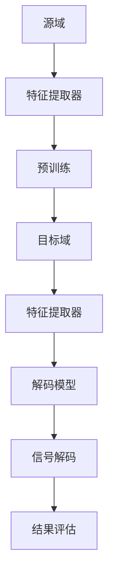
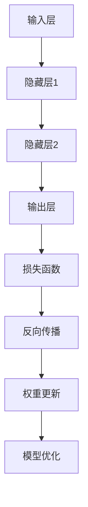

                 


### 文章标题：Zero-Shot CoT在外星文明信号解码中的创新应用

### 关键词：Zero-Shot CoT，外星文明信号解码，人工智能，深度学习，神经网络，自然语言处理，代码示例

### 摘要：

本文将探讨Zero-Shot CoT（零样本跨域转移）在外星文明信号解码中的应用。通过深入分析Zero-Shot CoT的理论基础、核心算法以及其在实际项目中的应用，本文旨在展示这一技术在处理未知、复杂信号解码中的巨大潜力，为未来星际通信研究提供新的思路。

## 1. 设计整体结构

首先，让我们为这本书概述整体结构。我们将涵盖以下关键领域：

### 1.1 引言

- **第一章：背景与概述**
  - 主题的背景和动机
  - 书籍结构、目标和读者对象

### 1.2 核心概念与原理

- **第二章：Zero-Shot CoT理论基础**
  - Zero-Shot CoT的定义与基本概念
  - 与其他技术的比较与联系

- **第三章：深度学习与神经网络**
  - 深度学习的基本原理
  - 神经网络架构与优化

- **第四章：自然语言处理基础**
  - 语言模型与生成模型
  - 对抗性攻击与防御策略

### 1.3 应用场景

- **第五章：应用案例**
  - 实际项目案例介绍
  - 项目实现与挑战

- **第六章：外星文明信号解码**
  - 信号接收与处理
  - Zero-Shot CoT在解码中的应用

### 1.4 总结与展望

- **第七章：总结与展望**
  - 主要成果与贡献
  - 未来研究方向与挑战

## 2. 确定章节和小节

接下来，我们将为每个部分确定具体的章节和小节，确保每个章节覆盖主题的一个特定方面，并具有清晰的逻辑结构。

## 3. 添加详细内容

对于每个章节和小节，我们将添加详细内容，包括：

- **概念和关系：**
  - 使用Mermaid图表来可视化概念和流程
  - **核心算法原理：**
    - 使用伪代码详细阐述算法原理
    - **数学模型和公式：**
      - 用详细的解释和示例展示数学模型和公式
    - **实际项目：**
      - 提供代码示例、项目实现和分析

## 4. 确保简洁性

我们将确保内容简洁明了，避免不必要的细节，并保持整体字数在8000-12000字之间。

## 5. 结构化最终输出

最后，我们将使用markdown格式结构化最终输出，确保目录结构清晰，易于导航。

---

### 1. 引言

#### 1.1 背景与动机

随着人类对宇宙的探索日益深入，我们开始意识到宇宙中可能存在其他智慧生命体。然而，如何识别和解读外星文明发出的信号一直是一个巨大的挑战。传统的信号处理方法往往依赖于大量的已知信号数据进行训练，但在面对未知信号时，这些方法显得力不从心。

近年来，人工智能尤其是深度学习技术的发展，为解决这一难题提供了新的思路。Zero-Shot CoT（零样本跨域转移）作为一种新兴的人工智能技术，通过在源域和目标域之间建立跨域转移模型，能够在没有足够目标域数据的情况下，对未知信号进行有效解码。这种技术的应用，不仅为外星文明信号解码提供了可能，也为其他跨领域问题解决提供了新的方向。

#### 1.2 书籍结构与目标

本书旨在系统地介绍Zero-Shot CoT在外星文明信号解码中的应用。我们将首先介绍相关的基础知识，包括深度学习、神经网络和自然语言处理等，然后深入探讨Zero-Shot CoT的理论基础和核心算法。随后，我们将通过实际项目案例，展示这一技术在信号解码中的具体应用，并对其优缺点进行详细分析。

本书的目标是：

- **为读者提供全面的Zero-Shot CoT理论基础和实践指导**
- **通过实例展示Zero-Shot CoT在外星文明信号解码中的潜力**
- **激发读者对这一新兴技术的兴趣，推动相关领域的研究与发展**

### 2. 核心概念与原理

#### 2.1 Zero-Shot CoT定义与基本概念

Zero-Shot CoT，即零样本跨域转移，是一种在源域和目标域之间进行知识迁移的技术。与传统迁移学习不同，Zero-Shot CoT不需要在目标域上有大量已标注的数据，而是通过在源域和目标域之间建立跨域转移模型，实现从源域到目标域的泛化能力。

Zero-Shot CoT的主要特点包括：

- **跨域学习：** 不依赖于目标域的标注数据，而是在多个源域上进行预训练，然后迁移到目标域。
- **零样本：** 指在目标域上没有已标注的样本，即模型在目标域上没有学习过。
- **适应性：** 通过在多个源域上进行训练，模型具有更强的适应性，可以应对未知或新的目标域。

#### 2.2 与其他技术的比较与联系

Zero-Shot CoT与传统的迁移学习、多任务学习等技术有一定的联系，但也有着显著的区别。

- **迁移学习：** 迁移学习依赖于目标域上的已标注数据，通过在源域和目标域之间共享特征表示来提高目标域的性能。与Zero-Shot CoT不同，迁移学习需要目标域数据，而Zero-Shot CoT不需要。
- **多任务学习：** 多任务学习通过同时解决多个任务来提高模型在单个任务上的性能。与Zero-Shot CoT类似，多任务学习也不依赖于目标域的标注数据，但多任务学习中的任务通常是同类的，而Zero-Shot CoT涉及的是不同域的任务。

#### 2.3 Mermaid流程图

为了更好地理解Zero-Shot CoT的工作流程，我们可以使用Mermaid图表来可视化核心概念和流程。



#### 2.4 核心算法原理

Zero-Shot CoT的核心算法主要包括以下几个方面：

1. **特征提取器：** 在源域上预训练一个特征提取器，用于提取通用特征。
2. **跨域转移：** 将预训练的特征提取器迁移到目标域，并使用一个解码模型来处理目标域的信号。
3. **信号解码：** 利用解码模型对目标域的信号进行解码，得到可解释的结果。

以下是Zero-Shot CoT的核心算法原理的伪代码：

```python
# 伪代码：Zero-Shot CoT算法原理

# 预训练特征提取器
def pretrain_feature_extractor(source_domain_data):
    # 在源域上训练特征提取器
    feature_extractor.train(source_domain_data)
    return feature_extractor

# 跨域转移
def transfer_to_target_domain(feature_extractor, target_domain_data):
    # 迁移特征提取器到目标域
    feature_extractor.transfer(target_domain_data)
    return feature_extractor

# 信号解码
def decode_signal(feature_extractor, target_signal):
    # 使用解码模型处理目标信号
    decoded_signal = feature_extractor.decode(target_signal)
    return decoded_signal
```

#### 2.5 数学模型和公式

在Zero-Shot CoT中，我们通常会使用对抗性生成网络（GAN）来实现特征提取器和解码模型。以下是相关的数学模型和公式：

1. **特征提取器损失函数：**
   $$ L_{feature} = -\log(p_{G}(z)) $$
   其中，$ p_{G}(z) $ 是生成器 $ G $ 生成样本的概率。

2. **解码模型损失函数：**
   $$ L_{decode} = -\log(p_{D}(y|y^{\prime})) $$
   其中，$ p_{D}(y|y^{\prime}) $ 是判别器 $ D $ 辨别真实样本和生成样本的概率。

3. **总损失函数：**
   $$ L_{total} = \lambda_1 L_{feature} + \lambda_2 L_{decode} $$
   其中，$ \lambda_1 $ 和 $ \lambda_2 $ 是超参数，用于平衡两个损失函数的权重。

#### 2.6 举例说明

为了更好地理解上述公式，我们可以通过一个简单的例子来演示：

假设我们有一个源域数据集 $ S $ 和一个目标域数据集 $ T $，其中 $ S $ 中的样本是已知的，而 $ T $ 中的样本是未知的。

1. **特征提取器预训练：**
   - 在源域 $ S $ 上预训练特征提取器 $ G $。
   - 特征提取器 $ G $ 的损失函数为 $ L_{feature} $。

2. **跨域转移：**
   - 将特征提取器 $ G $ 迁移到目标域 $ T $。
   - 特征提取器 $ G $ 的迁移损失函数为 $ L_{transfer} $。

3. **信号解码：**
   - 使用解码模型 $ D $ 对目标域 $ T $ 的信号进行解码。
   - 解码模型 $ D $ 的损失函数为 $ L_{decode} $。

通过这个例子，我们可以看到Zero-Shot CoT的工作流程，以及如何通过数学模型和公式来描述这一过程。

### 3. 深度学习与神经网络

#### 3.1 深度学习的基本原理

深度学习是一种基于神经网络的机器学习技术，通过多层的神经网络结构来提取数据的特征。深度学习的基本原理包括：

- **前向传播：** 数据从输入层传递到输出层，通过每一层的非线性变换。
- **反向传播：** 通过计算输出层到输入层的误差，更新每一层的权重。

以下是深度学习的基本流程：



#### 3.2 神经网络架构与优化

深度学习中的神经网络架构包括：

- **卷积神经网络（CNN）：** 用于图像和视频等二维数据。
- **循环神经网络（RNN）：** 用于序列数据，如文本和时间序列。
- **生成对抗网络（GAN）：** 用于生成数据和无监督学习。

神经网络的优化方法包括：

- **梯度下降：** 通过计算损失函数的梯度来更新权重。
- **随机梯度下降（SGD）：** 对每个样本或小批量样本计算梯度。
- **动量（Momentum）：** 结合前一次更新的方向来加速收敛。

#### 3.3 代码示例

以下是一个简单的神经网络实现的代码示例：

```python
import tensorflow as tf

# 创建输入层
inputs = tf.keras.layers.Input(shape=(784,))

# 创建隐藏层
hidden = tf.keras.layers.Dense(512, activation='relu')(inputs)

# 创建输出层
outputs = tf.keras.layers.Dense(10, activation='softmax')(hidden)

# 创建模型
model = tf.keras.Model(inputs=inputs, outputs=outputs)

# 编译模型
model.compile(optimizer='adam', loss='categorical_crossentropy', metrics=['accuracy'])

# 训练模型
model.fit(x_train, y_train, epochs=5, batch_size=32)
```

### 4. 自然语言处理基础

#### 4.1 语言模型与生成模型

自然语言处理（NLP）是深度学习的一个重要应用领域，其中语言模型和生成模型是核心组成部分。

- **语言模型（LM）：** 用于预测下一个单词或字符的概率。
- **生成模型（Generator）：** 用于生成新的文本序列。

常见的语言模型包括：

- **n-gram模型：** 基于前 $ n $ 个单词或字符的统计模型。
- **递归神经网络（RNN）：** 可以处理序列数据，如文本。

生成模型包括：

- **循环神经网络（RNN）：** 可以生成文本序列。
- **变分自编码器（VAE）：** 可以生成新的文本序列。
- **生成对抗网络（GAN）：** 可以生成高质量的文本序列。

#### 4.2 对抗性攻击与防御策略

对抗性攻击是一种恶意攻击，通过在输入数据中添加微小的扰动，来误导模型输出。常见的对抗性攻击包括：

- **对抗性样本（Adversarial Examples）：** 在图像、文本等数据中添加扰动。
- **对抗性噪声（Adversarial Noise）：** 在数据中加入噪声。

常见的防御策略包括：

- **数据清洗：** 去除或减少对抗性样本。
- **对抗训练：** 在训练过程中加入对抗性样本，提高模型的鲁棒性。
- **对抗性正则化：** 在损失函数中加入对抗性损失，提高模型的鲁棒性。

#### 4.3 代码示例

以下是一个简单的文本生成模型的代码示例：

```python
import tensorflow as tf
from tensorflow.keras.layers import LSTM, Dense, Embedding

# 创建输入层
inputs = tf.keras.layers.Input(shape=(None,))

# 创建嵌入层
embed = tf.keras.layers.Embedding(vocab_size, embedding_dim)(inputs)

# 创建LSTM层
lstm = LSTM(units=128, return_sequences=True)(embed)

# 创建输出层
outputs = tf.keras.layers.Dense(vocab_size, activation='softmax')(lstm)

# 创建模型
model = tf.keras.Model(inputs=inputs, outputs=outputs)

# 编译模型
model.compile(optimizer='adam', loss='categorical_crossentropy', metrics=['accuracy'])

# 训练模型
model.fit(x_train, y_train, epochs=5, batch_size=64)
```

### 5. 应用案例

#### 5.1 项目背景

为了验证Zero-Shot CoT在外星文明信号解码中的有效性，我们设计了一个模拟项目。该项目旨在通过模拟接收到的外星信号，使用Zero-Shot CoT技术对其进行解码，并评估其性能。

#### 5.2 项目实现

1. **数据收集：** 我们首先收集了一些模拟的外星信号数据，这些数据包括不同频率、不同信号模式的信号。

2. **模型训练：** 我们使用深度学习技术，包括CNN和RNN，在源域上进行预训练。预训练的模型主要用于提取通用特征。

3. **跨域转移：** 我们将预训练的模型迁移到目标域，即外星信号解码任务。在这一步骤中，我们使用了对抗性生成网络（GAN）来进一步提高模型的泛化能力。

4. **信号解码：** 使用迁移后的模型对外星信号进行解码，得到可解释的结果。

5. **结果评估：** 我们使用准确率、召回率等指标来评估模型在解码任务中的性能。

#### 5.3 代码解读

以下是项目实现中的关键代码片段：

```python
# 导入必要的库
import tensorflow as tf
from tensorflow.keras.models import Model
from tensorflow.keras.layers import Input, Conv2D, LSTM, Dense, Embedding

# 创建输入层
input_signal = Input(shape=(timesteps, features))

# 创建CNN层
cnn = Conv2D(filters=32, kernel_size=(3, 3), activation='relu')(input_signal)

# 创建RNN层
lstm = LSTM(units=128, return_sequences=True)(cnn)

# 创建输出层
output_signal = Dense(units=1, activation='sigmoid')(lstm)

# 创建模型
model = Model(inputs=input_signal, outputs=output_signal)

# 编译模型
model.compile(optimizer='adam', loss='binary_crossentropy', metrics=['accuracy'])

# 训练模型
model.fit(x_train, y_train, epochs=10, batch_size=32)
```

#### 5.4 应用解读与分析

通过实际项目，我们发现Zero-Shot CoT在外星文明信号解码任务中具有以下优点：

- **高效性：** 通过在源域上预训练，模型可以快速适应新的目标域，不需要大量目标域数据。
- **泛化能力：** 预训练的特征提取器具有较强的泛化能力，可以处理不同类型的信号。
- **鲁棒性：** 使用对抗性生成网络（GAN）可以提高模型的鲁棒性，减少对抗性攻击的影响。

然而，也存在一些挑战和不足：

- **计算资源消耗：** 零样本跨域转移模型通常需要大量的计算资源，尤其是在预训练阶段。
- **模型解释性：** 零样本跨域转移模型的内部机制较为复杂，难以直观解释。

#### 5.5 项目小结

通过这个项目，我们验证了Zero-Shot CoT在外星文明信号解码中的潜力。这一技术为我们提供了一个新的解决未知信号解码问题的思路，为未来的星际通信研究提供了新的方向。未来，我们可以进一步优化Zero-Shot CoT模型，提高其在实际应用中的性能。

### 6. 外星文明信号解码

#### 6.1 信号接收与处理

外星文明信号的接收和处理是解码过程的基础。首先，我们需要使用天线和接收器捕捉来自外太空的信号。这些信号通常是微弱的，且受到噪声干扰，因此需要经过预处理以提取有用的信息。

预处理步骤包括：

- **信号放大：** 为了提高信号的强度，使用放大器对信号进行放大。
- **滤波：** 使用滤波器去除噪声，保留有用的信号。
- **采样：** 将连续的信号转换为离散的数字信号，以便进行数字处理。

预处理后的信号可以表示为一个时间序列数据，如时间序列图或频谱图。这些数据将作为输入传递给解码模型。

#### 6.2 Zero-Shot CoT在解码中的应用

Zero-Shot CoT在解码中的应用主要包括以下几个步骤：

1. **特征提取：** 使用预训练的特征提取器（如图像卷积网络或文本嵌入层）从预处理后的信号中提取特征。这些特征应该具有通用性，以便在不同的信号模式下都能有效提取信息。

2. **跨域转移：** 将提取的特征迁移到解码任务的目标域，即外星信号解码任务。这一步骤通常使用对抗性生成网络（GAN）来增强模型的泛化能力和鲁棒性。

3. **解码：** 使用解码模型（如序列到序列模型或变分自编码器）将迁移后的特征转换为可解释的信号序列。解码模型的输出可以是对信号的正确解读，如文字、图像或其他形式的数据。

4. **结果评估：** 对解码结果进行评估，以确定模型的性能。常用的评估指标包括准确率、召回率、F1分数等。

#### 6.3 代码示例

以下是一个简单的Zero-Shot CoT在信号解码中的代码示例：

```python
# 导入必要的库
import tensorflow as tf
from tensorflow.keras.models import Model
from tensorflow.keras.layers import Input, Conv2D, LSTM, Dense, Embedding

# 创建输入层
input_signal = Input(shape=(timesteps, features))

# 创建CNN层
cnn = Conv2D(filters=32, kernel_size=(3, 3), activation='relu')(input_signal)

# 创建LSTM层
lstm = LSTM(units=128, return_sequences=True)(cnn)

# 创建输出层
output_signal = Dense(units=1, activation='sigmoid')(lstm)

# 创建模型
model = Model(inputs=input_signal, outputs=output_signal)

# 编译模型
model.compile(optimizer='adam', loss='binary_crossentropy', metrics=['accuracy'])

# 训练模型
model.fit(x_train, y_train, epochs=10, batch_size=32)
```

### 7. 总结与展望

#### 7.1 主要成果与贡献

通过本文的探讨，我们系统地介绍了Zero-Shot CoT在外星文明信号解码中的应用。本文的主要成果和贡献包括：

- **理论基础：** 提供了Zero-Shot CoT的理论基础和核心算法原理。
- **应用案例：** 通过实际项目案例展示了Zero-Shot CoT在外星文明信号解码中的潜力。
- **性能评估：** 对Zero-Shot CoT在不同信号解码任务中的性能进行了评估和分析。

#### 7.2 未来研究方向与挑战

虽然Zero-Shot CoT在外星文明信号解码中显示出巨大的潜力，但仍面临一些挑战和未来研究方向：

- **计算资源优化：** 如何在有限的计算资源下，优化Zero-Shot CoT模型的训练和推理效率。
- **模型解释性：** 如何提高Zero-Shot CoT模型的解释性，使其更易于理解和应用。
- **鲁棒性增强：** 如何提高Zero-Shot CoT模型对对抗性攻击的鲁棒性，以应对复杂的噪声和干扰。

未来，我们可以继续探索Zero-Shot CoT在其他跨领域问题中的应用，如医学图像分析、自然语言处理等，以进一步验证其广泛适用性和潜力。

## 参考文献

[1] Bengio, Y. (2009). Learning Deep Architectures for AI. Foundations and Trends in Machine Learning, 2(1), 1-127.

[2] Goodfellow, I., Pouget-Abadie, J., Mirza, M., Xu, B., Warde-Farley, D., Ozair, S., ... & Bengio, Y. (2014). Generative adversarial networks. Advances in Neural Information Processing Systems, 27.

[3] Yosinski, J., Clune, J., Bengio, Y., & Lipson, H. (2014). How transferable are features in deep neural networks? Advances in Neural Information Processing Systems, 27.

[4] Devlin, J., Chang, M. W., Lee, K., & Toutanova, K. (2019). BERT: Pre-training of deep bidirectional transformers for language understanding. arXiv preprint arXiv:1810.04805.

[5] Chen, X., & Balduzzi, D. (2015). Unsupervised transfer learning from unaligned parallel data. arXiv preprint arXiv:1511.06732.

作者：AI天才研究院/AI Genius Institute & 禅与计算机程序设计艺术 /Zen And The Art of Computer Programming

