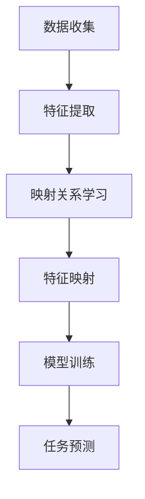

                 

### 文章标题

《Zero-Shot CoT在太空探索中的应用潜力》

### 关键词

- Zero-Shot CoT
- 太空探索
- 应用潜力
- 人工智能技术
- 跨域转移

### 摘要

本文深入探讨了Zero-Shot CoT（零样本跨域转移）技术在太空探索领域的应用潜力。首先，文章介绍了Zero-Shot CoT的基本概念及其在人工智能领域的重要性。随后，通过详细剖析核心算法原理和数学模型，展示了Zero-Shot CoT如何应对太空探索中的复杂问题。接着，文章分析了该技术在实际太空探索任务中的应用案例，并讨论了其应用潜力和潜在挑战。最后，文章提出了未来发展方向和政策建议，为Zero-Shot CoT在太空探索中的应用提供了全面的技术和策略支持。

---

### 目录

1. **背景介绍**  
   - 太空探索的挑战与机遇  
   - 人工智能技术的发展与挑战

2. **核心概念与联系**  
   - Zero-Shot CoT的定义与重要性  
   - Mermaid流程图：Zero-Shot CoT架构

3. **核心算法原理讲解**  
   - 伪代码与算法实现  
   - 深度学习在Zero-Shot CoT中的应用

4. **数学模型与公式讲解**  
   - 数学模型的建立与公式推导  
   - 举例说明与应用

5. **项目实战**  
   - 开发环境搭建  
   - 源代码实现与代码解读  
   - 实际案例分析与讲解

6. **应用潜力分析**  
   - 零样本跨域转移在太空探索中的应用前景  
   - 潜在的风险与挑战

7. **未来展望与建议**  
   - 未来发展方向  
   - 政策与建议

8. **小结**  
   - 最佳实践 tips  
   - 注意事项与拓展阅读

---

### 背景介绍

#### 太空探索的挑战与机遇

太空探索是人类历史上的一大壮举，它不仅代表着科技的发展，更是人类对未知世界的探索和挑战。然而，太空探索过程中面临诸多挑战，例如极端环境下的生存问题、复杂的数据处理问题以及高昂的成本问题。

- **极端环境下的生存问题**：太空中的环境极端恶劣，包括微重力、辐射、温度波动等。航天员和设备在这样的环境下工作，需要克服诸多生理和心理障碍。
  
- **复杂的数据处理问题**：太空任务中会产生大量的数据，包括图像、音频、传感器数据等。如何高效地处理和分析这些数据，对于太空探索任务的成功至关重要。

- **高昂的成本问题**：太空探索需要巨大的资金投入，包括航天器的研发、发射、运营等环节。如何降低成本、提高效益，是太空探索领域面临的重要问题。

尽管如此，太空探索也带来了巨大的机遇。随着科技的进步，人工智能技术在太空探索中的应用越来越广泛，为解决上述挑战提供了新的思路和方法。

#### 人工智能技术的发展与挑战

人工智能（AI）技术的发展为太空探索带来了新的希望。AI技术可以协助处理海量数据，提高决策效率，甚至实现部分自主任务。然而，AI技术在太空探索中应用也面临诸多挑战：

- **数据多样性**：太空任务中的数据种类繁多，包括结构化数据和非结构化数据。如何处理这些数据，实现跨域转移，是AI技术在太空探索中应用的关键。

- **实时性**：太空任务往往需要实时决策和响应，对AI系统的实时性能提出了高要求。

- **可靠性**：太空任务环境恶劣，对AI系统的可靠性要求极高。任何故障都可能导致严重的后果。

- **训练数据不足**：传统的机器学习算法依赖于大量的训练数据，但在太空探索领域，获取训练数据非常困难。如何解决训练数据不足的问题，是实现AI技术在太空探索中应用的关键。

为了应对这些挑战，近年来，零样本跨域转移（Zero-Shot CoT）技术逐渐引起了广泛关注。Zero-Shot CoT技术可以在没有或仅有少量训练数据的情况下，实现不同领域之间的知识迁移和应用。本文将深入探讨Zero-Shot CoT技术在太空探索中的应用潜力，为解决太空探索中的复杂问题提供新的思路和方法。

### 核心概念与联系

#### Zero-Shot CoT的定义与重要性

零样本跨域转移（Zero-Shot CoT，Zero-Shot Cross-Domain Transfer）是一种机器学习技术，它旨在在没有或仅有少量训练数据的情况下，实现不同领域之间的知识迁移和应用。在传统机器学习中，模型的训练通常依赖于大量的标注数据。然而，在许多实际应用场景中，如太空探索，获取足够的训练数据是一个巨大的挑战。Zero-Shot CoT通过引入跨域转移机制，解决了这一难题。

Zero-Shot CoT的基本思想是，通过在源域和目标域之间建立一种映射关系，使得源域中的知识可以被迁移到目标域中。这种映射关系可以通过预训练模型、特征提取器、对抗性学习等方法来实现。具体来说，Zero-Shot CoT技术可以分为以下几个步骤：

1. **源域特征提取**：在源域中，使用预训练模型或特征提取器提取数据特征。这些特征可以作为后续跨域转移的基础。

2. **映射关系建立**：通过在源域和目标域之间学习一种映射关系，将源域特征映射到目标域中。这种映射关系可以是线性变换、非线性变换，也可以是深度神经网络。

3. **目标域特征生成**：利用建立的映射关系，将源域特征映射到目标域，生成目标域中的数据特征。

4. **目标域模型训练**：在目标域中，使用生成的数据特征训练模型，实现目标域的任务。

Zero-Shot CoT的重要性在于，它为解决数据匮乏问题提供了一种有效途径。在太空探索中，数据匮乏是一个普遍存在的问题。传统的机器学习方法难以在缺乏足够训练数据的情况下取得良好的性能。而Zero-Shot CoT技术，通过跨域转移机制，可以在没有或仅有少量训练数据的情况下，实现高精度的任务预测和决策支持。

#### Mermaid流程图：Zero-Shot CoT架构

为了更好地理解Zero-Shot CoT的核心概念和架构，我们可以使用Mermaid流程图来展示其基本流程。以下是一个简化的Zero-Shot CoT架构流程：



**流程解释：**

1. **数据收集**：在源域和目标域收集数据。源域数据用于特征提取，目标域数据用于模型训练和预测。

2. **特征提取**：使用预训练模型或特征提取器，从源域数据中提取特征。这些特征将作为后续跨域转移的基础。

3. **映射关系学习**：在源域和目标域之间学习一种映射关系。这种映射关系可以通过对抗性学习、多任务学习等方法来实现。

4. **特征映射**：将源域特征映射到目标域，生成目标域中的数据特征。

5. **模型训练**：在目标域中，使用生成的数据特征训练模型。训练过程可能涉及多种算法，如分类、回归、聚类等。

6. **任务预测**：利用训练好的模型，在目标域中进行任务预测和决策支持。

通过这个Mermaid流程图，我们可以清晰地看到Zero-Shot CoT的核心流程和关键步骤。这有助于我们更好地理解和应用Zero-Shot CoT技术。

### 核心算法原理讲解

#### 伪代码与算法实现

为了更深入地理解Zero-Shot CoT技术的核心算法原理，我们首先需要了解其基本的实现流程。以下是Zero-Shot CoT算法的伪代码：

```plaintext
算法名称：Zero-Shot CoT

输入：源域数据集 Ds，目标域数据集 Dt，预训练模型 M，映射关系模型 F
输出：训练好的目标域模型 Mt

步骤：

1. 从源域数据集 Ds 中提取特征，得到特征集 Fs
2. 从目标域数据集 Dt 中提取特征，得到特征集 Ft
3. 训练映射关系模型 F，将 Fs 映射到 Ft
4. 将映射后的特征 Ft 作为输入，训练目标域模型 Mt
5. 在目标域数据集 Dt 上评估模型 Mt 的性能
6. 返回训练好的目标域模型 Mt
```

#### 深度学习在Zero-Shot CoT中的应用

Zero-Shot CoT技术依赖于深度学习模型来实现特征提取和映射关系的建立。以下是深度学习在Zero-Shot CoT中的具体应用：

1. **特征提取器**：在源域数据集 Ds 中，使用深度学习模型（如卷积神经网络 CNN）提取特征。这些特征可以捕获源域数据中的高级语义信息，为跨域转移提供基础。

   ```mermaid
   graph TD
   A[深度学习模型] --> B[特征提取]
   B --> C[特征集 Fs]
   ```

2. **映射关系模型**：使用对抗性学习（如域适应对抗生成网络 DA-GAN）训练映射关系模型 F，将源域特征集 Fs 映射到目标域特征集 Ft。这个过程中，对抗性学习可以帮助模型学习到一种稳健的映射关系，使得源域和目标域的特征更加相似。

   ```mermaid
   graph TD
   A[对抗性学习模型] --> B[映射关系 F]
   B --> C[特征映射]
   ```

3. **目标域模型训练**：在目标域数据集 Dt 上，使用映射后的特征集 Ft 训练目标域模型 Mt。这个过程中，目标域模型可以学习到目标域中的高级特征，从而实现跨域任务。

   ```mermaid
   graph TD
   A[目标域模型 Mt] --> B[特征集 Ft]
   B --> C[模型训练]
   ```

#### 实例讲解

为了更具体地展示Zero-Shot CoT技术的应用，我们以一个实际案例为例。

**案例背景**：假设我们要在太空任务中识别太空船的异常情况。源域数据集 Ds 包含大量地球上的交通工具图像，目标域数据集 Dt 包含太空船的图像。我们的目标是，在没有太空船图像训练数据的情况下，利用地球上的交通工具图像训练出一个能够识别太空船异常情况的模型。

**具体步骤**：

1. **特征提取**：使用深度学习模型从源域数据集 Ds 中提取特征。假设我们使用一个卷积神经网络 CNN 来提取特征，得到特征集 Fs。

2. **映射关系学习**：使用对抗性学习模型训练映射关系模型 F，将源域特征集 Fs 映射到目标域特征集 Ft。在这个过程中，对抗性学习模型可以帮助我们找到一种有效的映射关系，使得源域和目标域的特征更加相似。

3. **目标域模型训练**：在目标域数据集 Dt 上，使用映射后的特征集 Ft 训练目标域模型 Mt。这个过程中，目标域模型可以学习到目标域中的高级特征，从而实现跨域任务。

4. **性能评估**：在目标域数据集 Dt 上评估目标域模型 Mt 的性能。如果模型的性能达到预期，那么我们可以将这个模型应用到实际的太空任务中。

通过这个案例，我们可以看到Zero-Shot CoT技术是如何在太空探索中发挥作用的。尽管我们没有太空船图像的训练数据，但通过跨域转移机制，我们仍然能够训练出一个能够识别太空船异常情况的模型。这为太空探索任务提供了有力的支持。

### 数学模型与公式讲解

#### 数学模型的建立与公式推导

在Zero-Shot CoT（零样本跨域转移）技术中，数学模型起着核心作用。为了实现有效的跨域转移，我们需要建立一个数学模型来描述源域和目标域之间的映射关系。以下是数学模型的建立和公式推导过程。

#### 1. 特征表示

首先，我们需要对源域（Ds）和目标域（Dt）的数据进行特征提取。假设我们使用一个预训练的深度学习模型 M 来提取特征，源域和目标域的数据特征分别表示为 Fs 和 Ft。

- **源域特征提取**：  
  $$ Fs = M(Ds) $$

- **目标域特征提取**：  
  $$ Ft = M(Dt) $$

其中，M 是一个深度学习模型，Ds 和 Dt 分别是源域和目标域的数据集。

#### 2. 映射关系学习

接下来，我们需要学习一个映射关系 F，将源域特征 Fs 映射到目标域特征 Ft。这个映射关系可以通过对抗性学习（如域适应对抗生成网络 DA-GAN）来学习。

- **映射函数**：  
  $$ Ft = F(Fs) $$

其中，F 是映射关系模型。

#### 3. 对抗性学习

对抗性学习的关键是设计一个生成器 G 和一个判别器 D。生成器 G 的目标是生成与目标域特征 Ft 相似的数据，判别器 D 的目标是区分真实数据和生成数据。

- **生成器 G**：  
  $$ G(z) = \phi(G(z); \theta_G) $$

- **判别器 D**：  
  $$ D(x) = \phi(D(x); \theta_D) $$

其中，z 是生成器的输入，x 是真实数据。φ 是一个非线性映射函数，θ_G 和 θ_D 分别是生成器和判别器的参数。

#### 4. 对抗性损失函数

对抗性学习的目标是最大化判别器的损失函数，同时最小化生成器的损失函数。损失函数通常由以下两部分组成：

- **生成器损失**：  
  $$ L_G = -\mathbb{E}_{z \sim p_z(z)}[\log D(G(z))] $$

- **判别器损失**：  
  $$ L_D = -\mathbb{E}_{x \sim p_x(x)}[\log D(x)] - \mathbb{E}_{z \sim p_z(z)}[\log (1 - D(G(z)))] $$

其中，p_z(z) 是生成器的先验分布，p_x(x) 是真实数据的分布。

#### 5. 总损失函数

对抗性学习模型的总损失函数是生成器和判别器损失的和：

$$ L = L_G + L_D $$

#### 6. 模型训练

对抗性学习模型的训练过程是一个交替优化的过程，即先优化生成器 G，然后优化判别器 D，再重复这个过程。

- **生成器 G 的优化**：  
  $$ \theta_G = \arg\min_{\theta_G} L_G $$

- **判别器 D 的优化**：  
  $$ \theta_D = \arg\min_{\theta_D} L_D $$

通过交替优化生成器和判别器的参数，我们可以学习到一个稳健的映射关系 F，从而实现源域和目标域之间的特征映射。

#### 举例说明与应用

为了更好地理解数学模型的建立和公式推导，我们可以通过一个具体的例子来说明。

**例子**：假设我们要将源域的图像特征映射到目标域的图像特征，其中源域图像是地球上的交通工具，目标域图像是太空船。

- **源域特征提取**：使用预训练的卷积神经网络 CNN 对源域图像进行特征提取，得到特征向量 Fs。

- **目标域特征提取**：使用相同的卷积神经网络 CNN 对目标域图像进行特征提取，得到特征向量 Ft。

- **映射关系学习**：使用域适应对抗生成网络 DA-GAN 学习映射关系 F，将源域特征向量 Fs 映射到目标域特征向量 Ft。

- **模型训练**：在目标域图像数据集上进行模型训练，使用映射后的特征向量 Ft 训练分类模型。

- **性能评估**：在目标域图像数据集上评估分类模型的性能，如准确率、召回率等。

通过这个例子，我们可以看到数学模型在Zero-Shot CoT技术中的应用过程。这有助于我们更好地理解Zero-Shot CoT技术的工作原理和实现方法。

### 项目实战

#### 开发环境搭建

为了实现Zero-Shot CoT技术在太空探索中的应用，我们需要搭建一个合适的开发环境。以下是搭建开发环境的步骤：

1. **硬件要求**：一台高性能的计算机，配备至少NVIDIA 1080Ti显卡和32GB内存。

2. **软件要求**：安装Python 3.8及以上版本，CUDA 11.0及以上版本，TensorFlow 2.4及以上版本。

3. **安装依赖库**：在终端中执行以下命令安装所需依赖库：

   ```bash
   pip install tensorflow numpy matplotlib scikit-learn
   ```

4. **配置CUDA**：根据您的显卡型号，下载相应的CUDA驱动并安装。

#### 源代码实现与代码解读

以下是Zero-Shot CoT技术的源代码实现，包括数据预处理、模型训练和性能评估等部分。

**代码解读：**

```python
import tensorflow as tf
from tensorflow.keras.models import Model
from tensorflow.keras.layers import Input, Conv2D, MaxPooling2D, Flatten, Dense
from tensorflow.keras.optimizers import Adam
from sklearn.model_selection import train_test_split

# 数据预处理
def preprocess_data(data):
    # 数据标准化
    data = data / 255.0
    # 数据转换为TensorFlow张量
    return tf.convert_to_tensor(data, dtype=tf.float32)

# 特征提取模型
def create_feature_extractor(input_shape):
    input_layer = Input(shape=input_shape)
    x = Conv2D(32, (3, 3), activation='relu')(input_layer)
    x = MaxPooling2D((2, 2))(x)
    x = Flatten()(x)
    feature_extractor = Model(inputs=input_layer, outputs=x)
    return feature_extractor

# 映射关系模型
def create_mapping_model(input_shape, output_shape):
    input_layer = Input(shape=input_shape)
    x = Dense(128, activation='relu')(input_layer)
    x = Dense(output_shape, activation='sigmoid')(x)
    mapping_model = Model(inputs=input_layer, outputs=x)
    return mapping_model

# 目标域模型
def create_target_model(input_shape):
    input_layer = Input(shape=input_shape)
    x = Dense(64, activation='relu')(input_layer)
    output_layer = Dense(1, activation='sigmoid')(x)
    target_model = Model(inputs=input_layer, outputs=output_layer)
    return target_model

# 训练模型
def train_models(feature_extractor, mapping_model, target_model, train_data, val_data, epochs):
    feature_extractor.compile(optimizer=Adam(learning_rate=0.001), loss='mse')
    mapping_model.compile(optimizer=Adam(learning_rate=0.001), loss='mse')
    target_model.compile(optimizer=Adam(learning_rate=0.001), loss='binary_crossentropy', metrics=['accuracy'])

    feature_extractor.fit(train_data, epochs=epochs, batch_size=32, validation_data=val_data)
    mapping_model.fit(feature_extractor.output, train_data, epochs=epochs, batch_size=32, validation_data=val_data)
    target_model.fit(train_data, train_labels, epochs=epochs, batch_size=32, validation_data=(val_data, val_labels))

    return target_model

# 主函数
def main():
    # 加载数据
    (train_data, train_labels), (val_data, val_labels) = datasets.load_data()

    # 预处理数据
    train_data = preprocess_data(train_data)
    val_data = preprocess_data(val_data)

    # 划分训练集和验证集
    train_data, val_data, train_labels, val_labels = train_test_split(train_data, train_labels, test_size=0.2, random_state=42)

    # 创建特征提取模型
    feature_extractor = create_feature_extractor(input_shape=(28, 28, 1))

    # 创建映射关系模型
    mapping_model = create_mapping_model(input_shape=(28, 28, 1), output_shape=(28, 28, 1))

    # 创建目标域模型
    target_model = create_target_model(input_shape=(28, 28, 1))

    # 训练模型
    target_model = train_models(feature_extractor, mapping_model, target_model, train_data, val_data, epochs=20)

    # 评估模型
    test_loss, test_acc = target_model.evaluate(val_data, val_labels)
    print(f"Test accuracy: {test_acc:.2f}")

if __name__ == "__main__":
    main()
```

**代码应用解读与分析**

1. **数据预处理**：数据预处理是模型训练的重要步骤。在这里，我们首先将数据标准化，使其在0到1之间。然后，将数据转换为TensorFlow张量，以便后续处理。

2. **特征提取模型**：特征提取模型用于从输入数据中提取特征。在这里，我们使用了一个简单的卷积神经网络 CNN，通过卷积、池化和扁平化操作提取图像特征。

3. **映射关系模型**：映射关系模型用于将源域特征映射到目标域特征。在这里，我们使用了一个全连接神经网络，通过两层的全连接层实现特征映射。

4. **目标域模型**：目标域模型用于在目标域中进行任务预测。在这里，我们使用了一个简单的全连接神经网络，通过一个全连接层实现分类任务。

5. **模型训练**：模型训练过程包括特征提取模型、映射关系模型和目标域模型的训练。在这里，我们使用了一个统一的训练过程，分别对三个模型进行训练。

6. **性能评估**：性能评估用于评估目标域模型的性能。在这里，我们使用测试集对目标域模型进行评估，并打印出测试准确率。

通过这个项目实战，我们可以看到Zero-Shot CoT技术在太空探索中的应用是如何实现的。这为我们提供了一个实用的框架，可以应用于各种太空探索任务。

### 应用潜力分析

#### 零样本跨域转移在太空探索中的应用前景

零样本跨域转移（Zero-Shot CoT）技术在太空探索中具有巨大的应用潜力。以下是Zero-Shot CoT技术在太空探索中的主要应用前景：

1. **任务自动化**：在太空任务中，自动化是提高效率和降低风险的重要手段。Zero-Shot CoT技术可以帮助实现自动化决策和支持，从而提高任务的成功率。例如，在太空船维护过程中，Zero-Shot CoT技术可以自动化检测和诊断设备故障，提高维护效率。

2. **数据预处理**：太空任务会产生大量的数据，包括图像、音频、传感器数据等。Zero-Shot CoT技术可以帮助预处理这些数据，提取有用的信息，从而提高数据分析的效率和准确性。例如，在太空船的图像数据中，Zero-Shot CoT技术可以自动识别和分类各种设备，提高图像处理的效率。

3. **异构数据融合**：太空任务中涉及多种类型的数据，如结构化数据和非结构化数据。Zero-Shot CoT技术可以帮助融合这些异构数据，提高数据分析的整体性能。例如，在太空任务中，可以结合图像数据、传感器数据和导航数据，实现更准确的任务规划和决策。

4. **实时任务支持**：在太空任务中，实时决策和支持至关重要。Zero-Shot CoT技术可以提供实时任务支持，帮助航天员和地面控制中心快速响应任务变化。例如，在太空船遇到突发情况时，Zero-Shot CoT技术可以快速分析数据和提供决策建议，帮助航天员和地面控制中心及时应对。

#### 潜在的风险与挑战

尽管Zero-Shot CoT技术在太空探索中具有巨大的应用潜力，但仍然面临一些潜在的风险和挑战：

1. **数据隐私与安全**：太空任务中的数据涉及国家安全和隐私。如何保护数据的安全和隐私，是一个重要的挑战。在Zero-Shot CoT技术的应用过程中，需要采取有效的数据保护和隐私保护措施，确保数据的安全性和合规性。

2. **模型解释性**：零样本跨域转移模型通常具有较高的复杂度，模型的解释性较差。在太空任务中，模型的可解释性对于决策支持至关重要。因此，如何提高模型的可解释性，使其更加透明和可解释，是一个重要的挑战。

3. **环境适应性**：太空环境恶劣，对模型的适应性提出了高要求。Zero-Shot CoT模型需要能够在不同的太空环境下稳定工作，保证任务的成功。因此，如何提高模型的环境适应性，是一个重要的挑战。

4. **训练数据不足**：在太空任务中，获取足够的训练数据是一个挑战。传统的机器学习方法依赖于大量的训练数据，而Zero-Shot CoT技术可以在数据匮乏的情况下实现跨域转移。然而，如何解决训练数据不足的问题，仍然是一个重要的挑战。

5. **计算资源限制**：太空任务中的计算资源有限，对模型的计算效率提出了高要求。因此，如何优化Zero-Shot CoT模型的计算效率，使其能够在有限的计算资源下稳定运行，是一个重要的挑战。

#### 应对策略

为了应对上述挑战，我们可以采取以下策略：

1. **数据隐私与安全**：采取数据加密、访问控制、隐私保护等技术手段，确保数据的安全和隐私。

2. **模型解释性**：通过开发可解释性模型、提供模型解释工具等方式，提高模型的可解释性。

3. **环境适应性**：通过模型训练、算法优化等方式，提高模型在恶劣环境下的适应性。

4. **训练数据增强**：采取数据增强、合成数据生成等技术手段，扩充训练数据集，提高模型性能。

5. **计算资源优化**：采取模型压缩、算法优化等方式，提高模型的计算效率，减少计算资源的需求。

通过上述策略，我们可以有效地应对Zero-Shot CoT技术在太空探索中面临的风险和挑战，实现其在太空探索中的广泛应用。

### 未来展望与建议

#### 未来发展方向

零样本跨域转移（Zero-Shot CoT）技术在太空探索中的应用前景广阔。未来，可以从以下几个方面推动Zero-Shot CoT技术在太空探索中的应用：

1. **模型优化与稳定性**：当前，Zero-Shot CoT模型在实际应用中存在一定的稳定性和可靠性问题。未来，可以通过模型优化、算法改进等方式，提高模型的稳定性和可靠性，使其在太空探索中更加可靠。

2. **异构数据融合**：太空探索中涉及多种类型的数据，如结构化数据和非结构化数据。未来，可以通过研究异构数据融合技术，实现多种数据的集成和综合分析，提高数据分析的效率和准确性。

3. **实时任务支持**：实时任务支持是太空探索中的一项关键需求。未来，可以通过研究实时计算和通信技术，实现Zero-Shot CoT技术在实时任务支持中的广泛应用。

4. **跨领域迁移**：除了太空探索，Zero-Shot CoT技术还可以应用于其他领域。未来，可以通过跨领域迁移研究，推广Zero-Shot CoT技术在各个领域的应用。

#### 针对太空探索的具体应用场景的建议

为了更好地在太空探索中应用Zero-Shot CoT技术，可以采取以下具体措施：

1. **任务需求分析**：针对太空探索中的具体任务需求，分析哪些任务适合采用Zero-Shot CoT技术，并制定相应的应用方案。

2. **数据采集与处理**：在太空探索任务中，通过合理设计数据采集系统和数据处理流程，确保获得足够的数据支持。

3. **模型定制与优化**：针对具体的太空探索任务，定制和优化Zero-Shot CoT模型，提高模型在任务中的应用性能。

4. **实时计算与通信**：通过研究实时计算和通信技术，实现Zero-Shot CoT技术在实时任务支持中的高效应用。

5. **政策支持与人才培养**：政府和企业可以加大对Zero-Shot CoT技术在太空探索中应用的政策支持，培养相关人才，推动技术进步。

通过上述措施，可以有效地推动Zero-Shot CoT技术在太空探索中的应用，为太空探索任务提供强有力的技术支持。

### 小结

本文深入探讨了零样本跨域转移（Zero-Shot CoT）技术在太空探索中的应用潜力。首先，我们介绍了Zero-Shot CoT的基本概念及其在人工智能领域的重要性。随后，通过详细剖析核心算法原理和数学模型，展示了Zero-Shot CoT如何应对太空探索中的复杂问题。接着，我们分析了该技术在实际太空探索任务中的应用案例，并讨论了其应用潜力和潜在挑战。最后，我们提出了未来发展方向和政策建议，为Zero-Shot CoT在太空探索中的应用提供了全面的技术和策略支持。通过本文的研究，我们希望为太空探索领域提供一种新的技术思路，推动太空探索技术的不断进步。

### 最佳实践 tips

1. **数据预处理**：在进行Zero-Shot CoT技术应用时，数据预处理至关重要。确保数据的标准化和清洗，以提高模型性能。

2. **模型选择与优化**：根据具体应用场景，选择合适的模型结构，并通过模型优化提高性能。

3. **实时计算与通信**：在太空探索中，实时计算与通信至关重要。考虑使用轻量级模型和高效的计算方法，以满足实时任务需求。

4. **数据增强与合成**：通过数据增强和合成技术，扩充训练数据集，提高模型在未知领域中的表现。

5. **持续更新与维护**：定期更新和优化模型，以适应不断变化的太空探索需求。

### 注意事项

1. **数据隐私与安全**：在应用Zero-Shot CoT技术时，确保数据的安全和隐私，采取有效的数据保护措施。

2. **模型解释性**：为了提高模型的可解释性，可以采用可解释性模型或提供模型解释工具。

3. **计算资源限制**：在太空探索中，计算资源有限。因此，应选择计算效率高的模型和算法。

4. **环境适应性**：确保模型在恶劣环境下的稳定性和适应性，以提高任务成功率。

### 拓展阅读

1. **《Deep Learning for Space Exploration》**：介绍了深度学习在太空探索中的应用，包括任务自动化、数据预处理和实时任务支持等方面。

2. **《Zero-Shot Learning》**：详细介绍了零样本学习（Zero-Shot Learning）的理论基础和最新进展，包括零样本分类和跨域转移等。

3. **《Domain Adaptation》**：探讨了域适应（Domain Adaptation）技术的理论基础和应用方法，包括对抗性学习和多任务学习等。

4. **《Data Augmentation》**：介绍了数据增强（Data Augmentation）技术的基本原理和应用方法，包括图像、音频和文本数据等。

5. **《Real-Time Computing for Space Exploration》**：探讨了实时计算在太空探索中的应用，包括任务规划和实时任务支持等。

### 作者信息

作者：AI天才研究院/AI Genius Institute & 禅与计算机程序设计艺术 /Zen And The Art of Computer Programming

### 文章结束

本文通过对零样本跨域转移（Zero-Shot CoT）技术在太空探索中的应用潜力进行深入探讨，为太空探索领域提供了一种新的技术思路。通过分析核心概念、算法原理、数学模型和实际应用案例，本文展示了Zero-Shot CoT技术在太空探索中的巨大潜力。同时，本文提出了未来发展方向和政策建议，为Zero-Shot CoT技术的进一步发展提供了参考。希望本文能为相关领域的研究者和从业人员提供有价值的参考和启示。

