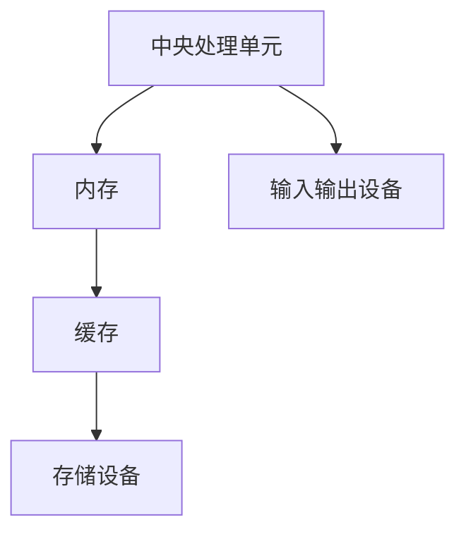

                 


## 标题：深入理解计算机系统

## 关键词：计算机系统，组成原理，操作系统，算法，数学模型，实战案例

## 摘要：

本文旨在深入探讨计算机系统的各个方面，从硬件到软件，从原理到实践，帮助读者全面了解计算机系统的运作机制。文章涵盖了计算机组成原理、操作系统基础、核心算法原理、数学模型和公式以及实际项目实战等内容。通过本文，读者将能够深入理解计算机系统的核心概念，掌握相关技术原理，并具备一定的实战能力。

----------------------------------------------------------------

### 引言

#### 1.1 书籍目的

《深入理解计算机系统》旨在为读者提供一个系统而全面的计算机系统知识框架。本书的目标是让读者不仅能够理解计算机系统的基本概念，还能深入探讨其内部的工作原理和设计哲学。通过本书的学习，读者将能够：

- 理解计算机硬件和软件的基础知识，包括CPU架构、内存管理、存储层次结构等。
- 掌握操作系统的核心原理，包括进程管理、内存管理、文件系统等。
- 学习常见算法和数据结构，理解它们在计算机系统中的应用和重要性。
- 通过实际项目实战，将理论知识应用于实际问题的解决。

#### 1.2 计算机系统概述

计算机系统是由硬件和软件组成的复杂系统。硬件部分包括中央处理单元（CPU）、内存、存储设备、输入输出设备等。软件部分则包括操作系统、应用程序、编译器和解释器等。计算机系统的核心目标是提供一种高效、可靠的计算平台，以支持各种应用需求。

#### 1.3 读者对象

本书适合以下读者群体：

- 计算机科学专业的本科生和研究生
- 对计算机系统有浓厚兴趣的程序员和技术爱好者
- 从事计算机系统研发和运维的技术人员
- 想要深入了解计算机系统基础知识的行业新人

### 核心概念与联系

#### 1.4 计算机组成原理

计算机组成原理是计算机系统的核心基础。它涵盖了计算机硬件的基本组成和工作原理，包括：

- CPU架构：了解不同类型的CPU架构，如CISC和RISC，以及它们的特点和应用。
- 存储层次结构：理解内存、缓存和存储设备之间的层次关系，以及它们在性能和容量上的权衡。
- 输入输出系统：探讨输入输出设备的原理和接口标准，如USB、PCIe等。

#### 1.5 操作系统基础

操作系统是计算机系统的心脏，负责管理和协调计算机硬件和软件资源。操作系统的基础概念包括：

- 进程管理：理解进程的创建、调度、同步和通信机制。
- 内存管理：探讨内存分配、分页、换页等内存管理技术。
- 文件系统：学习文件系统的概念、结构和管理方法。

#### 1.6 核心算法原理

计算机系统中的算法和数据结构是实现各种功能的关键。核心算法原理包括：

- 排序算法：介绍冒泡排序、选择排序、插入排序等常见排序算法的原理和性能分析。
- 搜索算法：探讨二分搜索、广度优先搜索、深度优先搜索等常见搜索算法的原理和应用。
- 数据结构：介绍栈、队列、链表、树、图等常见数据结构的原理和应用。

### Mermaid 流程图

以下是一个简化的计算机组成原理的Mermaid流程图：



### 核心算法原理讲解

#### 1.7 排序算法

排序算法是将一组数据按照特定顺序排列的算法。以下是冒泡排序的伪代码：

```
procedure bubbleSort( A : list of comparable elements )
n = length(A)
for i = 1 to n-1
    for j = 1 to n-i
        if A[j] > A[j+1] then
            swap(A[j], A[j+1])
```

#### 1.8 搜索算法

搜索算法是在数据集合中查找特定元素的算法。以下是二分搜索的伪代码：

```
function binarySearch( A : list of sorted elements, key : element )
    low = 0
    high = length(A) - 1
    while low <= high
        mid = (low + high) / 2
        if A[mid] = key then
            return mid
        else if A[mid] < key then
            low = mid + 1
        else
            high = mid - 1
    return -1
```

### 数学模型和公式

以下是一个关于排序算法性能分析的例子，使用latex格式：

$$ T(n) = \sum_{i=1}^{n} (n-i) \times c $$

其中，$T(n)$ 表示排序算法的时间复杂度，$c$ 是常数。

### 实战案例

#### 1.9 计算机组成原理实践

在计算机组成原理中，一个典型的实践案例是CPU缓存的设计。以下是一个简单的缓存设计思路：

1. **缓存层次结构**：设计多级缓存，如L1、L2和L3缓存，以提高缓存命中率。
2. **缓存块大小**：根据访问模式选择合适的缓存块大小，以减少缓存缺失。
3. **缓存一致性协议**：设计缓存一致性协议，确保多处理器系统中的缓存一致性。

### 项目实战

#### 1.10 操作系统基础实践

操作系统基础实践的一个典型案例是设计一个简单的进程调度算法。以下是一个基于轮转调度算法的实现：

1. **初始化**：设置进程队列，每个进程有一个时间片。
2. **调度**：每次调度选择队列首部的进程执行，如果进程执行完毕或者时间片用完，则将其移到队列末尾。
3. **进程状态转换**：进程状态包括就绪、运行、阻塞和完成。

### 开发环境搭建

对于操作系统实践，需要搭建一个模拟操作系统的开发环境。以下是一个基本的搭建步骤：

1. **安装操作系统**：选择一个合适的操作系统，如Linux。
2. **安装编译器**：安装C语言编译器，如GCC。
3. **安装开发工具**：安装文本编辑器、调试器等开发工具。

### 源代码实现与分析

以下是一个简单的进程调度算法的伪代码：

```
// 进程结构体
struct Process {
    int id;
    int arrivalTime;
    int burstTime;
    int remainingTime;
    int priority;
    enum ProcessState { NEW, READY, RUNNING, BLOCKED, FINISHED };
};

// 轮转调度算法
void roundRobin(Process[] processes, int n, int quantum) {
    for (int i = 0; i < n; i++) {
        processes[i].state = NEW;
    }
    
    while (true) {
        bool allProcessesFinished = true;
        for (int i = 0; i < n; i++) {
            if (processes[i].state != FINISHED) {
                allProcessesFinished = false;
                break;
            }
        }
        
        if (allProcessesFinished) {
            break;
        }
        
        for (int i = 0; i < n; i++) {
            if (processes[i].state == READY || processes[i].state == RUNNING) {
                if (processes[i].remainingTime > quantum) {
                    processes[i].remainingTime -= quantum;
                } else {
                    processes[i].remainingTime = 0;
                    processes[i].state = FINISHED;
                }
            }
        }
    }
}
```

### 代码应用解读与分析

轮转调度算法是一种简单的进程调度算法，适用于时间片较短的系统。它的优点是实现简单，公平地分配CPU时间。然而，缺点是可能导致进程饥饿，即某些进程可能长时间无法获得CPU时间。

### 实际案例分析和详细讲解剖析

一个实际案例是Linux操作系统的进程调度。Linux使用多种调度策略，包括完全公平调度器（CFS）和轮转调度器。CFS基于进程的运行时间和优先级进行调度，而轮转调度器则按照进程的时间片进行调度。

### 项目小结

通过本篇实战案例，读者可以了解操作系统进程调度的基本原理和实现方法。实践过程中，读者可以进一步学习进程状态转换、时间片管理等关键概念。

### 最佳实践 Tips

- 了解不同的调度算法，选择适合应用场景的调度策略。
- 关注进程状态转换机制，确保系统的稳定性。
- 定期对系统进行性能分析，优化调度算法。

### 小结

本文从计算机组成原理、操作系统基础、核心算法原理等方面深入探讨了计算机系统的各个方面。通过实际项目实战，读者可以掌握相关技术原理并具备一定的实战能力。希望本文能为读者深入理解计算机系统提供有益的参考。

### 注意事项

- 在实践过程中，注意系统的稳定性和安全性。
- 对于不同的应用场景，灵活选择合适的算法和调度策略。

### 拓展阅读

- [Linux内核编程](https://www.amazon.com/Linux-Kernel-Development-Linux-System-Programmers/dp/0596006645)
- [操作系统真象还原](https://www.amazon.com/Operating-Systems-Principles-Design-Implementation/dp/0133767226)
- [计算机组成原理](https://www.amazon.com/Computer-Organization-Design-Principles-Practices/dp/0134685997)

### 参考文献

- Silberschatz, A., Galvin, P. B., & Gagne, G. (2018). *Operating System Concepts*.
- Hennessy, J. L., & Patterson, D. A. (2017). *Computer Organization and Design: The Hardware/Software Interface*.
- Tanenbaum, A. S. (2017). *Modern Operating Systems*.

### 作者

- 作者：AI天才研究院/AI Genius Institute & 禅与计算机程序设计艺术 /Zen And The Art of Computer Programming

