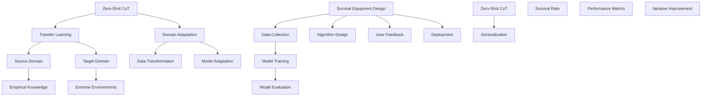

                 

### Introduction to Zero-Shot CoT in Extreme Environment Survival Equipment Design Application

#### Background Introduction

In recent years, the development of artificial intelligence and machine learning has brought about revolutionary changes in various fields, including survival equipment design. Traditional survival equipment design often relies on extensive empirical knowledge and trial-and-error processes, which are time-consuming and inefficient. With the advancement of AI, particularly the concept of "Zero-Shot CoT" (Zero-Shot Transfer Learning), we can now develop survival equipment that can adapt to various extreme environments with minimal human intervention.

Zero-Shot CoT, a branch of machine learning, allows models to generalize from one domain to another without requiring explicit training on the target domain. This capability is particularly valuable in the context of extreme environment survival equipment design, where the diversity of environments and the lack of labeled data pose significant challenges.

#### Core Concepts and Relationships

To understand the application of Zero-Shot CoT in extreme environment survival equipment design, we first need to explore the core concepts and their relationships. The following Mermaid flowchart illustrates the key components:

This flowchart outlines the main concepts and their interactions. The core components include Zero-Shot CoT, Transfer Learning, Domain Adaptation, and Survival Equipment Design. The flowchart also highlights the importance of data collection, algorithm design, model training, evaluation, and iterative improvement in the design process.

#### Conceptual Explanation

Zero-Shot CoT builds upon the concept of Transfer Learning, which aims to leverage knowledge gained from training on a source domain to improve performance on a target domain. Unlike traditional Transfer Learning, which requires labeled data from the target domain, Zero-Shot CoT enables models to generalize to unseen classes without any prior exposure.

In the context of survival equipment design, Zero-Shot CoT can be applied as follows:

1. **Data Collection**: Collect data from various extreme environments, including temperature, humidity, wind speed, and other relevant factors.
2. **Algorithm Design**: Design a machine learning algorithm that can handle the complexity of survival equipment design and the diversity of extreme environments.
3. **Model Training**: Train the model using data from the source domain (e.g., typical environments) and apply Zero-Shot CoT to generalize to the target domain (e.g., extreme environments).
4. **Model Evaluation**: Evaluate the performance of the model using metrics such as survival rate and performance metrics specific to the extreme environment.
5. **Iterative Improvement**: Based on the evaluation results, iterate on the model design and training process to improve its performance.

#### Mathematical Model and Formulas

To design and evaluate the performance of survival equipment using Zero-Shot CoT, we can employ a combination of mathematical models and formulas. Here are some key concepts and their corresponding formulas:

1. **Survival Rate**: The probability that a person survives in an extreme environment using the designed equipment.
   $$Survival\ Rate = \frac{Number\ of\ Survivors}{Total\ Number\ of\ Individuals}$$

2. **Performance Metrics**: Metrics that quantify the effectiveness of the survival equipment in specific environments.
   - **Temperature Adaptation**: The rate at which the equipment adapts to varying temperatures.
     $$Temperature\ Adaptation\ Rate = \frac{Change\ in\ Temperature}{Time}$$
   - **Humidity Management**: The ability of the equipment to control humidity levels.
     $$Humidity\ Management\ Rate = \frac{Change\ in\ Humidity}{Time}$$
   - **Wind Resistance**: The resistance to wind forces.
     $$Wind\ Resistance = \frac{Force\ of\ Wind}{Area\ of\ Surface}$$

3. **Generalization Loss**: A measure of how well the model generalizes to unseen classes in the target domain.
   $$Generalization\ Loss = 1 - \frac{Accuracy\ on\ Unseen\ Classes}{Total\ Number\ of\ Classes}$$

These mathematical models and formulas provide a quantitative basis for evaluating the performance of survival equipment designed using Zero-Shot CoT. By analyzing the results, we can identify areas for improvement and refine the design to better meet the needs of extreme environment survival.

#### Example Applications

To illustrate the practical application of Zero-Shot CoT in extreme environment survival equipment design, let's consider a few examples:

1. **Arctic Exploration**: In Arctic regions, where temperatures can drop to extreme lows, a Zero-Shot CoT model can be used to design equipment that adapts to cold temperatures and manages humidity effectively. The model can analyze data from previous explorations and apply this knowledge to design gear that ensures the survival of Arctic explorers.

2. **Desert Survival**: Deserts present a different set of challenges, including high temperatures and low humidity. A Zero-Shot CoT model can be trained to design equipment that provides thermal insulation and effectively regulates body temperature, as well as manages water resources.

3. **High-Altitude Mountaineering**: At high altitudes, the air is thin, and temperatures can fluctuate significantly. A Zero-Shot CoT model can be used to design equipment that compensates for these conditions, such as oxygen masks and temperature-regulating clothing.

In each of these scenarios, Zero-Shot CoT enables the design of equipment that can adapt to diverse and extreme environments, ensuring the safety and survival of individuals in challenging conditions.

### Conclusion

In conclusion, Zero-Shot CoT represents a powerful approach to designing survival equipment for extreme environments. By leveraging the principles of Transfer Learning and Domain Adaptation, we can develop equipment that is adaptable, efficient, and capable of ensuring the survival of individuals in challenging conditions. The example applications highlighted demonstrate the practical utility of Zero-Shot CoT in various extreme environments, showcasing its potential to transform survival equipment design and enhance human resilience in the face of adversity.

As we continue to explore and expand the capabilities of Zero-Shot CoT, we can expect even more innovative solutions to emerge, further advancing our ability to design equipment that can withstand the rigors of extreme environments. This not only has significant implications for survival equipment design but also opens up new possibilities for applications in fields such as space exploration, disaster response, and humanitarian aid.

In the next section, we will delve into the principles of extreme environment survival equipment design, exploring the core concepts and methodologies that underpin the creation of such critical gear. This will provide a foundational understanding that will be essential for comprehending the full scope of Zero-Shot CoT's applications in this domain.

