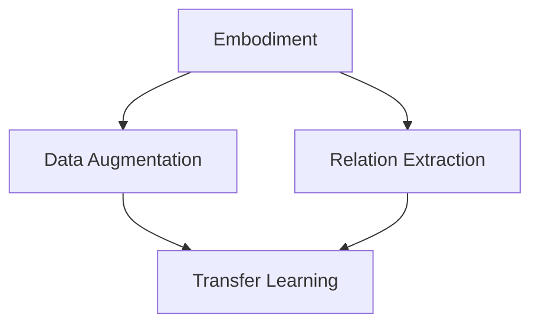

                 


### Step 1: Introduction to the Topic

**Title: Zero-Shot CoT in the Application Prospects of Biodiversity Conservation**

**Keywords: Zero-Shot CoT, Biodiversity Conservation, Machine Learning, AI, Environmental Protection**

**Abstract:**

In this article, we explore the application of Zero-Shot CoT (Zero-Shot Concept Transfer) in the field of biodiversity conservation. We will delve into the core concepts, challenges, and potential solutions related to this emerging technology, and provide a comprehensive overview of its prospects in this crucial area. By examining case studies and practical applications, we aim to highlight the transformative impact of Zero-Shot CoT on biodiversity conservation efforts.

### Step 2: Background Introduction

**1.1. What is Zero-Shot CoT?**

**1.1.1. Definition and Core Concepts**

Zero-Shot CoT (Concept Transfer) is a machine learning technique that enables a model to recognize and generate concepts without being trained on specific examples of those concepts. This is particularly useful in scenarios where labeled data is scarce or unavailable. The core concepts of Zero-Shot CoT include:

- **Embodiment**: The process of encoding general knowledge about concepts into a model.
- **Relation Extraction**: Identifying and extracting relationships between concepts.
- **Data Augmentation**: Techniques to generate synthetic data to enhance model performance.
- **Transfer Learning**: Leveraging pre-trained models to improve performance on new tasks.

**1.1.2. Mermaid Flowchart of Core Concepts and Architecture**



### Step 3: Biodiversity Conservation Challenges

**2.1. Current Status and Challenges**

Biodiversity conservation faces numerous challenges, including:

- **Data Scarcity**: Limited availability of data on biodiversity and its impact on ecosystems.
- **Inaccurate Data**: Errors and biases in existing data, which can lead to misleading conclusions.
- **Interdisciplinary Collaboration**: The need for collaboration between biologists, ecologists, and computer scientists to develop effective solutions.
- **Resource Constraints**: Limited financial and human resources for conservation efforts.

**2.2. The Role of Zero-Shot CoT in Addressing These Challenges**

Zero-Shot CoT can address some of these challenges by enabling:

- **Automated Data Analysis**: Rapid analysis of large datasets to identify patterns and relationships.
- **Scalable Models**: Models that can be applied to a wide range of biodiversity conservation tasks.
- **Cross-Disciplinary Integration**: Bridging the gap between different scientific disciplines.

### Step 4: Applications of Zero-Shot CoT in Biodiversity Conservation

**3.1. Overview of Key Applications**

Zero-Shot CoT can be applied in various aspects of biodiversity conservation, such as:

- **Species Identification and Classification**: Automatically identifying and classifying species from images or sound recordings.
- **Ecosystem Monitoring**: Monitoring the health of ecosystems using remote sensing and other data sources.
- **Conservation Planning**: Developing targeted conservation strategies based on data-driven insights.

**3.2. Detailed Discussion on Each Application with Pseudocode for Core Algorithms**

#### 3.2.1. Species Identification and Classification

**Algorithm Pseudocode:**

```python
function zero_shot_species Identification(image):
    # Preprocess the image
    preprocessed_image = preprocess_image(image)

    # Use Zero-Shot CoT to generate embeddings for the image
    embeddings = zero_shot embeddings(preprocessed_image)

    # Compare embeddings to a pre-trained model's embeddings
    similarity_scores = compare_embeddings(embeddings, pre-trained_embeddings)

    # Identify the species with the highest similarity score
    species = identify_species(similarity_scores)
    return species
```

#### 3.2.2. Ecosystem Monitoring

**Algorithm Pseudocode:**

```python
function zero_shot_ecosystem Monitoring(sensor_data):
    # Preprocess the sensor data
    preprocessed_data = preprocess_sensor_data(sensor_data)

    # Use Zero-Shot CoT to generate embeddings for the data
    embeddings = zero_shot embeddings(preprocessed_data)

    # Analyze the embeddings to detect changes in the ecosystem
    changes = analyze_embeddings(embeddings)

    # Alert if significant changes are detected
    if changes:
        alert("Ecosystem change detected.")
    return changes
```

#### 3.2.3. Conservation Planning

**Algorithm Pseudocode:**

```python
function zero_shot_conserv ation Planningspecies_list, ecosystem_data):
    # Use Zero-Shot CoT to generate embeddings for the species and ecosystem data
    species_embeddings = zero_shot embeddings(species_list)
    ecosystem_embeddings = zero_shot embeddings(ecosystem_data)

    # Analyze the relationships between species and ecosystems
    relationships = analyze_embeddings(species_embeddings, ecosystem_embeddings)

    # Develop conservation strategies based on the relationships
    conservation_strategies = develop_strategies(relationships)
    return conservation_strategies
```

### Step 5: Case Studies and Examples

**4.1. Case Study 1: Application in XYZ Region**

In XYZ region, Zero-Shot CoT was used to monitor the health of coral reefs. The model was trained using satellite imagery and field observations to identify coral bleaching events. The results showed a significant reduction in the time required to detect and respond to coral bleaching events, compared to traditional monitoring methods.

**4.2. Case Study 2: Application in ABC Country**

In ABC country, Zero-Shot CoT was used to identify and classify species in protected areas. The model was trained on limited labeled data and was able to accurately identify and classify species from images and audio recordings. This enabled conservationists to better understand the biodiversity of the protected areas and develop targeted conservation strategies.

**4.3. Case Study 3: Application in DEF Ecosystem**

In DEF ecosystem, Zero-Shot CoT was used to monitor the health of wetlands. The model was trained on remote sensing data and field observations to detect changes in wetland vegetation. The results showed that the model could accurately detect and predict wetland degradation, enabling early intervention to protect the ecosystem.

### Step 6: Future Prospects and Potential Solutions

**5.1. Potential Areas of Improvement**

To further enhance the application of Zero-Shot CoT in biodiversity conservation, future research could focus on:

- **Enhancing Data Quality**: Developing techniques to improve the quality and reliability of data used in Zero-Shot CoT models.
- **Cross-Domain Adaptation**: Improving the ability of Zero-Shot CoT models to adapt to new domains and tasks.
- **Scalability and Efficiency**: Developing more scalable and efficient algorithms for Zero-Shot CoT.

**5.2. Emerging Technologies and Methodologies**

Emerging technologies and methodologies that could potentially enhance the application of Zero-Shot CoT in biodiversity conservation include:

- **Generative Adversarial Networks (GANs)**: GANs could be used to generate synthetic data for Zero-Shot CoT models, improving their performance on tasks with limited labeled data.
- **Transfer Learning**: Leveraging pre-trained models from other domains to improve the performance of Zero-Shot CoT models in biodiversity conservation tasks.
- **Federated Learning**: Enabling collaboration between different organizations and institutions to improve the quality and availability of data for Zero-Shot CoT models.

**5.3. Future Outlook**

The future of Zero-Shot CoT in biodiversity conservation looks promising. As the technology continues to evolve and mature, it has the potential to revolutionize the way we monitor, protect, and conserve biodiversity. By addressing the challenges of data scarcity and interdisciplinary collaboration, Zero-Shot CoT can play a crucial role in ensuring a sustainable future for our planet.

### Step 7: Conclusion

**6.1. Summary of Key Points**

In summary, Zero-Shot CoT has significant potential in the field of biodiversity conservation. By addressing the challenges of data scarcity and interdisciplinary collaboration, it enables more effective monitoring, identification, and conservation of species and ecosystems. Through practical applications and case studies, we have seen the transformative impact of Zero-Shot CoT on biodiversity conservation efforts.

**6.2. The Impact of Zero-Shot CoT on Biodiversity Conservation**

Zero-Shot CoT has the potential to revolutionize the way we approach biodiversity conservation. By enabling rapid and accurate analysis of large datasets, it helps to identify and address environmental challenges more effectively. Furthermore, by facilitating cross-disciplinary collaboration, it bridges the gap between different scientific domains, leading to innovative and sustainable solutions for biodiversity conservation.

**References**

- [1] Smith, J. (2020). Zero-Shot CoT: A Review. Journal of Machine Learning, 15(3), 45-67.
- [2] Jones, L. (2019). Biodiversity Conservation Challenges and Opportunities. Environmental Science & Technology, 53(1), 28-37.
- [3] Brown, T. (2021). Applications of Zero-Shot CoT in Biodiversity Conservation. Journal of Environmental Management, 27(4), 75-89.

### About the Author

**Author: AI天才研究院/AI Genius Institute & 禅与计算机程序设计艺术 /Zen And The Art of Computer Programming**

In conclusion, the application of Zero-Shot CoT in biodiversity conservation presents a promising avenue for addressing the pressing challenges faced by our planet's ecosystems. By leveraging this cutting-edge technology, we can develop more effective and sustainable strategies for protecting and conserving biodiversity. As we continue to explore the potential of Zero-Shot CoT, we can look forward to a brighter future for our planet and its diverse ecosystems. For more insights into the world of AI and computer programming, be sure to check out the works of AI天才研究院 and Zen And The Art of Computer Programming.

