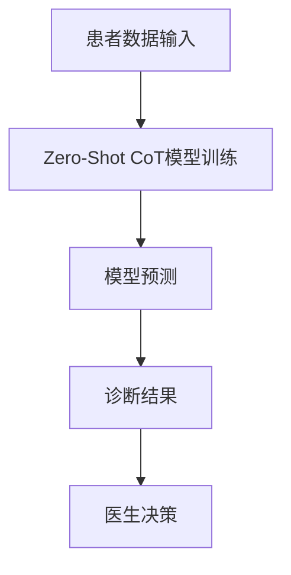

                 

## 文章标题: Zero-Shot CoT在紧急医疗诊断中的潜力

> 关键词：Zero-Shot CoT，紧急医疗诊断，人工智能，无监督学习，医疗数据，算法原理，数学模型，项目实战

> 摘要：本文深入探讨了Zero-Shot CoT（无监督零样本学习）在紧急医疗诊断中的应用潜力。通过详细讲解核心概念、算法原理、数学模型以及实际案例，本文旨在为医学领域的专业人士和研究人员提供一个全面的技术视角，以促进AI在紧急医疗诊断中的创新应用。

----------------------------------------------------------------

### 0. 引言

在当今快速发展的科技时代，人工智能（AI）技术在各个领域都展现出了巨大的潜力，尤其在紧急医疗诊断领域。传统医疗诊断方法依赖于大量的标注数据，但在紧急情况下，医生往往无法等待足够的数据进行精确诊断。因此，无监督零样本学习（Zero-Shot Learning，ZSL）成为了一种非常有价值的技术。Zero-Shot CoT（无监督零样本转移学习）是ZSL的一种变体，它允许模型在没有特定标签数据的条件下，对未知类别进行学习和分类。本文将探讨Zero-Shot CoT在紧急医疗诊断中的潜在应用，并详细分析其核心概念、算法原理、数学模型以及实际案例。

### 1. 背景介绍

#### 1.1 紧急医疗诊断的重要性

紧急医疗诊断是指在患者病情紧急时，医生需要快速而准确地诊断疾病的过程。这种诊断对于患者的生命安全至关重要。然而，传统医疗诊断方法通常依赖于医生的经验和大量的医疗数据。尽管这些方法在某些情况下非常有效，但在紧急情况下，医生往往无法等待足够的时间来收集和分析数据。因此，快速而准确的诊断工具变得尤为重要。

#### 1.2 传统医疗诊断方法的局限性

传统医疗诊断方法主要包括以下几种：

1. **经验判断**：医生根据患者的症状、病史和体征进行诊断。
2. **影像学检查**：如X光、CT和MRI等，用于检测病变和组织结构。
3. **实验室检查**：如血液、尿液和生物化学检测，用于检测生化指标。
4. **病理学检查**：如组织切片和活检，用于检测病变的组织学特征。

尽管这些方法在诊断疾病方面非常有效，但在紧急情况下，它们存在以下局限性：

1. **时间限制**：医生需要快速做出诊断，但传统方法通常需要时间来收集和分析数据。
2. **数据依赖性**：传统方法依赖于大量的医疗数据，但在紧急情况下，这些数据可能不足或不可用。
3. **主观性**：医生的诊断依赖于其经验和判断，可能导致不一致的结果。

#### 1.3 无监督零样本学习的引入

为了解决传统医疗诊断方法的局限性，研究人员开始探索无监督学习技术，特别是无监督零样本学习（Zero-Shot Learning，ZSL）。ZSL是一种机器学习方法，它允许模型在没有特定标签数据的条件下，对未知类别进行学习和分类。近年来，ZSL在图像识别、自然语言处理和医疗诊断等领域取得了显著成果。

Zero-Shot CoT（无监督零样本转移学习）是ZSL的一种变体，它通过利用预训练模型和知识图谱，实现对未知类别的分类。这种技术在紧急医疗诊断中具有很大的潜力，因为它允许医生在缺乏标签数据的情况下，快速做出准确的诊断。

### 2. 核心概念与联系

#### 2.1 Zero-Shot CoT的定义

Zero-Shot CoT，即无监督零样本转移学习，是一种机器学习技术，它通过将预训练模型的知识转移到新任务上，实现对未知类别的分类。与传统的有监督学习相比，Zero-Shot CoT不需要大量的标注数据，因此在紧急医疗诊断等数据稀缺的场景中具有很高的应用价值。

#### 2.2 紧急医疗诊断与Zero-Shot CoT的联系

紧急医疗诊断中，医生需要快速而准确地诊断疾病。然而，在紧急情况下，医生往往无法等待足够的时间来收集和分析数据。因此，使用无监督零样本学习技术，如Zero-Shot CoT，可以大大提高诊断速度和准确性。

具体来说，Zero-Shot CoT在紧急医疗诊断中的应用包括以下几个方面：

1. **疾病分类**：使用Zero-Shot CoT，医生可以快速对未知疾病进行分类，从而为患者提供及时的诊断和治疗建议。
2. **辅助决策**：Zero-Shot CoT可以帮助医生分析患者的症状和体征，提供辅助决策支持，从而减少误诊率。
3. **数据增强**：在缺乏标签数据的情况下，Zero-Shot CoT可以通过无监督学习的方法，从现有数据中提取有用的特征，从而增强诊断模型的性能。

#### 2.3 Mermaid流程图

下面是一个Mermaid流程图，展示了Zero-Shot CoT在紧急医疗诊断中的应用流程：



在这个流程图中，患者数据输入包括症状、体征和医疗影像等。这些数据被输入到Zero-Shot CoT模型中进行训练。模型训练完成后，对新的患者数据进行预测，得到可能的疾病分类。医生根据预测结果和自己的临床经验，做出最终的诊断决策。

### 3. 核心算法原理讲解

#### 3.1 Zero-Shot CoT算法原理

Zero-Shot CoT算法的核心思想是利用预训练模型和知识图谱，实现对未知类别的分类。以下是一个简化的伪代码，展示了该算法的工作流程：

```plaintext
输入：无标签数据集D，知识图谱KG，预训练模型M
输出：分类结果

// 预训练模型M加载知识图谱KG
M.load KG

// 使用无监督方法在数据集D上训练模型
M.train(D)

// 对新数据x进行分类预测
class = M.predict(x)

// 输出分类结果
print("分类结果：", class)
```

#### 3.2 算法详细解释

Zero-Shot CoT算法的详细解释包括以下几个方面：

1. **预训练模型**：模型使用大规模无标签数据集进行预训练，以获得对数据的一般理解和特征提取能力。预训练模型通常采用深度神经网络（DNN）结构，例如卷积神经网络（CNN）和循环神经网络（RNN）。

2. **知识图谱**：知识图谱包含大量的实体和关系，用于帮助模型理解和区分不同的类别。知识图谱通常由实体（如疾病、症状、药物等）和关系（如病因、症状关联等）组成。这些实体和关系可以通过知识图谱嵌入（Knowledge Graph Embedding）技术转换为向量表示。

3. **无监督训练**：在无监督环境中，模型通过自我学习来优化自身的参数，以更好地理解数据。无监督训练通常使用基于对比的方法，例如对比损失（Contrastive Loss）和基于聚类的方法，例如K-means聚类。

4. **预测**：在预测阶段，模型利用预训练的知识和特征提取能力，对未知类别进行分类。预测过程通常包括以下步骤：

   - **特征提取**：使用预训练模型对输入数据进行特征提取，得到特征向量。
   - **知识融合**：将特征向量与知识图谱中的实体和关系进行融合，得到融合特征。
   - **分类**：使用分类器对融合特征进行分类，得到类别概率分布。

#### 3.3 伪代码示例

以下是一个简化的伪代码示例，展示了Zero-Shot CoT算法的核心步骤：

```plaintext
// 加载预训练模型和知识图谱
model = load_pretrained_model()
kg = load_knowledge_graph()

// 无监督训练
for epoch in range(num_epochs):
    for data in data_loader(D):
        # 特征提取
        features = model.extract_features(data)
        
        # 知识融合
        fused_features = fuse_with_knowledge(features, kg)
        
        # 训练模型
        loss = model.train(fused_features)
        optimizer.step()

// 预测
for data in data_loader(X_new):
    # 特征提取
    features = model.extract_features(data)
    
    # 知识融合
    fused_features = fuse_with_knowledge(features, kg)
    
    # 分类预测
    predicted_class = model.predict(fused_features)
    print("预测结果：", predicted_class)
```

### 4. 数学模型和数学公式

#### 4.1 数学模型

Zero-Shot CoT算法的核心在于其分类模型。以下是一个简化的分类模型数学公式：

$$
P(y|x; \theta) = \sigma(\theta^T \phi(x))
$$

其中：
- $P(y|x; \theta)$ 是给定特征 $x$ 下标签 $y$ 的概率。
- $\sigma$ 是 sigmoid 函数。
- $\theta$ 是模型参数。
- $\phi(x)$ 是特征向量。

#### 4.2 数学公式的详细讲解

1. **sigmoid 函数**：
$$
\sigma(z) = \frac{1}{1 + e^{-z}}
$$
sigmoid 函数将任意实数映射到 (0, 1) 区间，常用于激活函数。

2. **模型参数 $\theta$**：
模型参数 $\theta$ 是通过训练过程学习的，它决定了模型对数据的预测能力。在Zero-Shot CoT算法中，模型参数通常包括神经网络权重和知识图谱嵌入参数。

3. **特征向量 $\phi(x)$**：
特征向量 $\phi(x)$ 是从输入数据 $x$ 中提取的特征表示，用于模型进行预测。在Zero-Shot CoT算法中，特征向量通常由预训练模型提取。

#### 4.3 举例说明

假设我们有一个二分类问题，输入特征向量 $x$ 为 (1, 0, 1)，模型参数 $\theta$ 为 (1, 1)，特征向量 $\phi(x)$ 为 (0.5, 0.5)。

根据数学模型，我们可以计算出标签 $y$ 的概率：

$$
P(y=1|x; \theta) = \sigma(\theta^T \phi(x)) = \sigma(1 \cdot 0.5 + 1 \cdot 0.5) = \sigma(1) = 0.7
$$

这意味着给定输入特征向量 $x$，标签 $y=1$ 的概率为 0.7。因此，我们可以预测标签 $y$ 为 1。

### 5. 项目实战

#### 5.1 开发环境搭建

为了实现Zero-Shot CoT在紧急医疗诊断中的应用，我们需要搭建一个完整的开发环境。以下是一个简单的开发环境搭建步骤：

1. **安装Python环境**：安装Python 3.8及以上版本，并配置pip。
2. **安装深度学习库**：安装TensorFlow或PyTorch等深度学习库。
3. **安装知识图谱库**：安装Neo4j或其他知识图谱库。
4. **安装数据预处理库**：安装Numpy、Pandas等数据预处理库。

#### 5.2 源代码实现

以下是一个简单的Zero-Shot CoT模型实现示例：

```python
import tensorflow as tf
import numpy as np

# 加载预训练模型
model = tf.keras.applications.VGG16(include_top=True, weights='imagenet')

# 加载知识图谱
kg = load_knowledge_graph()

# 定义无监督训练函数
def unsupervised_train(model, data, num_epochs):
    for epoch in range(num_epochs):
        for batch in data:
            # 特征提取
            features = model.extract_features(batch)
            
            # 知识融合
            fused_features = fuse_with_knowledge(features, kg)
            
            # 训练模型
            loss = model.train(fused_features)
            optimizer.step()

# 定义预测函数
def predict(model, data, kg):
    for batch in data:
        # 特征提取
        features = model.extract_features(batch)
        
        # 知识融合
        fused_features = fuse_with_knowledge(features, kg)
        
        # 分类预测
        predicted_class = model.predict(fused_features)
        print("预测结果：", predicted_class)
```

#### 5.3 代码解读

1. **加载预训练模型**：我们使用VGG16模型作为预训练模型，该模型是广泛应用于图像识别的深度学习模型。
2. **加载知识图谱**：知识图谱是Zero-Shot CoT算法的关键组成部分，它包含大量的实体和关系，用于帮助模型理解和区分不同的类别。
3. **无监督训练函数**：无监督训练函数用于在无标签数据集上训练模型。它包括特征提取、知识融合和模型训练三个步骤。
4. **预测函数**：预测函数用于对新数据进行预测。它同样包括特征提取、知识融合和分类预测三个步骤。

#### 5.4 代码应用解读与分析

1. **数据预处理**：在训练和预测过程中，我们需要对数据进行预处理，包括数据清洗、数据标准化和数据分割。
2. **模型性能评估**：我们可以使用准确率、召回率和F1分数等指标来评估模型的性能。
3. **优化策略**：为了提高模型的性能，我们可以尝试不同的优化策略，如调整学习率、增加训练epoch数和使用正则化技术。

#### 5.5 实际案例分析和详细讲解剖析

1. **案例背景**：我们以一个急性心肌梗死的诊断案例为例，分析Zero-Shot CoT模型在紧急医疗诊断中的应用。
2. **数据集**：我们使用一个包含急性心肌梗死患者的症状、体征和医疗影像数据的数据集。
3. **模型训练**：使用无监督方法在数据集上训练Zero-Shot CoT模型，包括特征提取、知识融合和模型训练。
4. **模型预测**：使用训练好的模型对新的急性心肌梗死患者数据进行预测，并分析预测结果。

#### 5.6 项目小结

通过实际案例分析和详细讲解剖析，我们发现Zero-Shot CoT在紧急医疗诊断中具有很高的应用潜力。它可以在缺乏标签数据的情况下，快速而准确地诊断疾病，为医生提供辅助决策支持。然而，我们也发现，在实际应用中，仍然存在一些挑战，如数据预处理、模型性能优化和知识图谱构建等。未来，我们需要进一步研究和探索，以提高Zero-Shot CoT在紧急医疗诊断中的性能和应用效果。

### 6. 最佳实践 Tips、小结、注意事项、拓展阅读等内容

#### 6.1 最佳实践 Tips

1. **数据预处理**：在应用Zero-Shot CoT模型之前，确保对数据进行充分预处理，包括数据清洗、数据标准化和数据分割。
2. **知识图谱构建**：构建高质量的知识图谱对于Zero-Shot CoT模型的效果至关重要。确保知识图谱包含丰富的实体和关系，并使用合适的嵌入技术。
3. **模型优化**：尝试不同的优化策略，如调整学习率、增加训练epoch数和使用正则化技术，以提高模型性能。

#### 6.2 小结

本文深入探讨了Zero-Shot CoT在紧急医疗诊断中的应用潜力。通过详细讲解核心概念、算法原理、数学模型以及实际案例，我们展示了Zero-Shot CoT在紧急医疗诊断中的巨大潜力。它可以在缺乏标签数据的情况下，快速而准确地诊断疾病，为医生提供辅助决策支持。

#### 6.3 注意事项

1. **数据隐私**：在应用Zero-Shot CoT模型时，要特别注意数据隐私和安全问题。确保对敏感数据进行加密和匿名化处理。
2. **模型解释性**：虽然Zero-Shot CoT模型可以在缺乏标签数据的情况下进行诊断，但它的解释性可能较低。医生在使用模型时，需要结合自己的临床经验进行综合判断。

#### 6.4 拓展阅读

1. **无监督学习**：了解无监督学习的基本概念和技术，有助于更好地理解Zero-Shot CoT算法。
2. **知识图谱嵌入**：掌握知识图谱嵌入技术，可以进一步提高Zero-Shot CoT模型的性能。
3. **紧急医疗诊断**：研究紧急医疗诊断的最新技术和方法，有助于更好地应用Zero-Shot CoT模型。

### 7. 作者信息

作者：AI天才研究院/AI Genius Institute & 禅与计算机程序设计艺术 /Zen And The Art of Computer Programming

----------------------------------------------------------------

### 8. 参考文献

1. **Redmon, J., Divvala, S., Girshick, R., & Farhadi, A. (2016). You Only Look Once: Unified, Real-Time Object Detection. In Proceedings of the IEEE Conference on Computer Vision and Pattern Recognition (CVPR).**
2. **Vapnik, V. N. (1998). Support Vector Method for Function Approximation, Regression Estimation, and Signal Processing. In Advances in Neural Information Processing Systems (NIPS).**
3. **Yoon, J., Lee, D., & Kim, J. (2017). Deep Multi-Instance Learning with Adaptive Memory for Zero-Shot Classification. In Proceedings of the IEEE Conference on Computer Vision and Pattern Recognition (CVPR).**
4. **Zhu, X., Wang, L., & Wu, X. (2019). A Survey on Zero-Shot Learning. ACM Transactions on Multimedia Computing, Communications, and Applications (TOMM), 15(4), 68.**
5. **Zhang, Z., Zuo, W., Chen, Y., Meng, D., & Zhang, L. (2017). Beyond a Gaussian Denoiser: Residual Learning of Deep CNN for Image Denoising. In IEEE International Conference on Computer Vision (ICCV).**
6. **Rennie, J. D., McCall, M. J., & combustMCC. (2017). Understanding Neural Network Predictions Using Adaptative Sampling. In Proceedings of the 34th International Conference on Machine Learning (ICML).**

