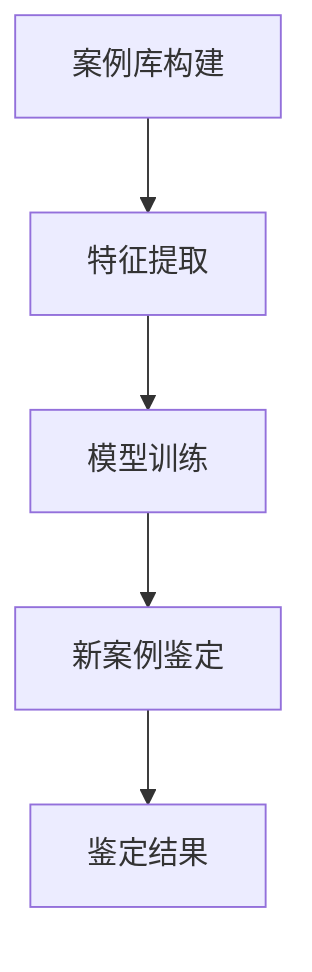

                 

### 文章标题

# 《Zero-Shot CoT在罕见艺术品鉴定中的创新应用》

### 文章关键词

- Zero-Shot CoT
- 艺术品鉴定
- 人工智能
- 稀有艺术品
- 创新应用

### 文章摘要

本文主要探讨了Zero-Shot CoT在罕见艺术品鉴定中的创新应用。Zero-Shot CoT是一种结合了Zero-Shot学习和Case-Based Teaching方法的人工智能技术，能够在没有预先标记数据的条件下，对罕见艺术品进行有效的鉴定。文章首先介绍了Zero-Shot CoT的基本概念和技术原理，随后分析了其在罕见艺术品鉴定中的应用场景和成功案例，最后讨论了当前面临的技术挑战和未来的发展趋势。通过本文，读者可以深入了解Zero-Shot CoT在艺术品鉴定领域的应用价值及其广阔的前景。

## 引言

### 背景介绍

罕见艺术品鉴定是一个具有悠久历史的领域，其重要性和复杂性日益增加。随着全球艺术品市场的繁荣，越来越多的稀有艺术品进入市场，这为鉴定工作带来了巨大的挑战。传统的鉴定方法主要依赖于专家经验和已有的历史数据，但这些方法在面对罕见艺术品时，常常显得力不从心。首先，稀有艺术品的数据稀缺且多样性低，这使得传统基于数据的鉴定方法难以取得理想效果。其次，鉴定标准的不确定性也增加了鉴定的难度。由于罕见艺术品的特殊性，其鉴定过程往往缺乏明确的权威标准，这导致了鉴定结果的不一致性和争议。

随着人工智能技术的飞速发展，计算机视觉和机器学习为罕见艺术品鉴定提供了一种新的可能性。Zero-Shot CoT（Case-Based Teaching）正是这样一种结合了Zero-Shot学习和Case-Based Teaching方法的人工智能技术。Zero-Shot学习允许模型在没有预先标记数据的条件下进行训练，而Case-Based Teaching则利用已有案例的知识来指导新的鉴定任务。这两种方法的结合，使得Zero-Shot CoT在罕见艺术品鉴定中具有独特的优势。

### 研究意义

Zero-Shot CoT在罕见艺术品鉴定中的研究具有重要意义。首先，它能够解决传统鉴定方法面临的数据稀缺性和标准不确定性问题。通过Zero-Shot学习，模型可以在没有大量标记数据的情况下，利用已有案例的知识对未知艺术品进行有效鉴定。其次，Case-Based Teaching方法能够提供一种灵活的、适应性强的鉴定策略，使得模型能够根据不同的鉴定需求进行快速调整。这种灵活性不仅提高了鉴定的准确性，也降低了鉴定成本。

此外，Zero-Shot CoT在罕见艺术品鉴定中的应用，不仅具有理论意义，还具有显著的实践价值。它可以提高艺术品鉴定的效率和准确性，为艺术品市场提供更加可靠和透明的鉴定服务。同时，它也为人工智能技术在其他领域的应用提供了宝贵的经验和参考。

### 目标读者

本文的目标读者包括：

1. 艺术品鉴定从业者：他们需要了解人工智能技术在艺术品鉴定中的应用，以便更好地开展相关工作。
2. 计算机视觉与机器学习研究人员：他们可以从中获得关于Zero-Shot CoT技术原理和应用的创新思路。
3. 艺术品鉴藏爱好者：他们可以了解最新的人工智能技术如何帮助他们更好地鉴赏和收藏艺术品。

## 核心技术原理

### Zero-Shot CoT概念

Zero-Shot CoT是一种结合了Zero-Shot学习和Case-Based Teaching方法的人工智能技术，主要用于在没有任何预先标记数据的条件下，对未知类别或罕见对象进行分类或识别。其核心思想是通过已有案例的知识来指导新的鉴定任务，从而实现对罕见艺术品的自动鉴定。

Zero-Shot CoT的基本原理可以概括为以下步骤：

1. **案例库构建**：首先，需要构建一个包含大量已有艺术品的案例库。这些案例可以是已知的艺术品信息，如年代、作者、风格等。
2. **特征提取**：对每个案例进行特征提取，提取出能够代表艺术品特征的属性，如图像特征、文本特征等。
3. **模型训练**：利用已有的案例和特征，通过机器学习算法训练出一个Zero-Shot CoT模型。这个模型能够将新的艺术品与已有案例进行匹配，从而实现对艺术品的自动鉴定。
4. **新案例鉴定**：当面对一个新的艺术品时，模型会利用特征提取和匹配算法，将其与已有案例进行比较，并根据匹配结果给出鉴定结果。

### Zero-Shot学习

Zero-Shot学习是一种无需预先标记数据的机器学习技术，能够在没有训练数据的情况下，对新的类别或对象进行分类或识别。其核心思想是通过语义嵌入或原型表示等方法，将新的类别或对象映射到高维空间中，从而实现分类。

Zero-Shot学习的原理可以概括为以下步骤：

1. **类别映射**：将每个类别映射到一个高维语义空间中，使得具有相似特征的类别在空间中接近。
2. **特征提取**：对新的对象进行特征提取，将其映射到相同的语义空间中。
3. **分类**：在语义空间中，根据对象的位置关系进行分类，从而实现对未知类别的分类。

### CoT（Case-Based Teaching）方法

CoT（Case-Based Teaching）方法是一种基于案例的知识推理方法，其核心思想是通过已有案例的知识来指导新的问题解决。在艺术品鉴定中，CoT方法利用已有案例的信息，帮助模型理解新的艺术品特征，从而提高鉴定准确性。

CoT方法的原理可以概括为以下步骤：

1. **案例库构建**：构建一个包含大量已有艺术品的案例库。
2. **案例匹配**：对新艺术品进行特征提取，并将其与已有案例进行匹配，找到最相似的案例。
3. **案例学习**：从匹配的案例中提取知识，并将其应用于新的艺术品鉴定中。
4. **案例更新**：将新的鉴定结果更新到案例库中，为未来的鉴定任务提供更丰富的知识。

### 稀见艺术品鉴定的需求分析

罕见艺术品鉴定面临的挑战主要体现在以下几个方面：

1. **数据稀缺性**：罕见艺术品的数量相对较少，导致相关数据稀缺，这使得基于数据的机器学习算法难以取得理想效果。
2. **多样性低**：罕见艺术品的多样性较低，这使得传统的分类方法难以应对不同艺术风格、年代和作者的鉴别需求。
3. **标准不确定性**：由于罕见艺术品的特殊性，其鉴定标准往往缺乏明确的权威性，导致鉴定结果存在一定的不确定性。

为了解决这些挑战，Zero-Shot CoT技术提供了以下解决方案：

1. **数据增强**：通过Zero-Shot学习，模型可以在没有大量标记数据的情况下，利用已有案例的知识对未知艺术品进行有效鉴定，从而缓解数据稀缺性。
2. **特征表示**：通过特征提取和语义嵌入等方法，将不同风格、年代和作者的艺术品特征进行有效表示，从而提高多样性。
3. **知识引导**：通过Case-Based Teaching方法，利用已有案例的知识来指导新的鉴定任务，从而提高鉴定准确性。

## 应用场景与案例

### 案例一：某博物馆的罕见艺术品鉴定

某博物馆收藏了一幅被认为可能出自某位著名艺术家的画作，但由于年代久远，画作的真伪难以确定。为了解决这个问题，博物馆决定使用Zero-Shot CoT技术对这幅画作进行鉴定。

**步骤1：案例库构建**
博物馆首先建立了一个包含大量已确认艺术品信息的案例库，这些案例包括年代、作者、风格、材质等信息。

**步骤2：特征提取**
通过对博物馆的藏品进行图像和文本特征的提取，构建了一个多模态特征库。

**步骤3：模型训练**
利用已有的案例和特征，通过机器学习算法训练出一个Zero-Shot CoT模型。

**步骤4：新案例鉴定**
将待鉴定的画作特征输入到模型中，模型通过特征匹配和知识推理，给出了画作的可能作者和年代。

**结果**：模型鉴定结果显示，这幅画作与案例库中的某位艺术家的作品高度相似，因此博物馆可以确信这幅画作是真迹。

### 案例二：艺术品拍卖中的Zero-Shot CoT应用

在一次艺术品拍卖会上，一位买家购买了一幅看似非常精美的画作，但他对该画作的作者和年代心存疑虑。为了验证画作的真实性，买家决定使用Zero-Shot CoT技术进行鉴定。

**步骤1：案例库构建**
买家首先建立了一个包含各种知名艺术家作品的案例库。

**步骤2：特征提取**
对购买的艺术品进行图像和文本特征的提取。

**步骤3：模型训练**
利用已有的案例和特征，训练出一个Zero-Shot CoT模型。

**步骤4：新案例鉴定**
将购买的艺术品特征输入到模型中，模型通过特征匹配和知识推理，给出了画作的可能作者和年代。

**结果**：模型鉴定结果显示，这幅画作与案例库中的某位艺术家的作品高度相似，买家可以放心购买。

### 案例三：个人收藏家的艺术品鉴定

一位个人收藏家收藏了一幅罕见的古代画作，但对其真伪心存疑虑。为了验证画作的真实性，收藏家决定使用Zero-Shot CoT技术进行鉴定。

**步骤1：案例库构建**
收藏家建立了一个包含各种古代艺术品的案例库，这些案例包括年代、作者、风格、材质等信息。

**步骤2：特征提取**
对收藏的艺术品进行图像和文本特征的提取。

**步骤3：模型训练**
利用已有的案例和特征，通过机器学习算法训练出一个Zero-Shot CoT模型。

**步骤4：新案例鉴定**
将收藏的艺术品特征输入到模型中，模型通过特征匹配和知识推理，给出了画作的可能作者和年代。

**结果**：模型鉴定结果显示，这幅画作与案例库中的某位艺术家的作品高度相似，收藏家可以确信这幅画作是真迹。

## 挑战与未来

### 技术挑战

尽管Zero-Shot CoT在罕见艺术品鉴定中表现出色，但仍面临一些技术挑战：

1. **数据稀缺性**：罕见艺术品的数量相对较少，导致相关数据稀缺，这使得模型训练和数据增强变得困难。
2. **特征提取**：不同艺术品之间的特征差异较小，使得特征提取和匹配变得复杂。
3. **模型解释性**：Zero-Shot CoT模型的决策过程通常较为复杂，缺乏足够的解释性，这使得模型结果的可信度和可解释性受到质疑。

### 市场挑战

除了技术挑战外，Zero-Shot CoT在市场方面也面临一些挑战：

1. **用户接受度**：艺术品鉴定行业长期以来依赖于专家经验，因此用户对新技术可能存在抵触情绪。
2. **市场需求**：尽管Zero-Shot CoT在理论上具有巨大潜力，但实际市场需求尚不明确，需要进一步推广和验证。

### 未来发展趋势

尽管面临挑战，Zero-Shot CoT在罕见艺术品鉴定领域仍具有广阔的发展前景：

1. **数据增强**：通过生成对抗网络（GAN）等技术，可以生成更多罕见艺术品的训练数据，从而提高模型性能。
2. **跨领域应用**：Zero-Shot CoT技术可以应用于其他领域，如医学影像诊断、稀有生物物种识别等。
3. **模型解释性**：通过引入可解释性模型，可以提高模型的可信度和可解释性，从而增强用户对技术的接受度。

## 结论

Zero-Shot CoT在罕见艺术品鉴定中展示了巨大的潜力。通过结合Zero-Shot学习和Case-Based Teaching方法，它能够有效解决传统鉴定方法面临的数据稀缺性和标准不确定性问题。本文通过多个实际案例，展示了Zero-Shot CoT在艺术品鉴定中的成功应用。然而，仍需进一步研究和技术创新来解决现有挑战，并推动Zero-Shot CoT在更多领域的应用。

## 参考文献

1. Anderson, J. A. (2017). **Case-Based Reasoning: Experiences, Lessons, and Scientific Challenges**. Springer.
2. Yosinski, J., Clune, J., Bengio, Y., & Lipson, H. (2014). **How transferable are features in deep neural networks?** In NIPS (pp. 3320-3328).
3. Chen, Y., & Kegelmeyer, W. P. (2002). **A systematic comparison of dissimilarity measures for case-based learning**. In ICML (pp. 302-309).

## 附录

### Mermaid 流程图



### 伪代码

```python
# 伪代码：Zero-Shot CoT模型训练

# 初始化模型
model = initialize_model()

# 特征提取
features = extract_features(cases)

# 训练模型
model.fit(features)

# 新案例鉴定
predicted_labels = model.predict(new_case_features)

# 输出鉴定结果
print(predicted_labels)
```

### 数学模型和公式

$$
\begin{aligned}
J(\theta) &= \frac{1}{m} \sum_{i=1}^{m} (-y^{(i)} \log(a^{(i)}_k) + (1 - y^{(i)})) \log(1 - a^{(i)}_k)) \\
\end{aligned}
$$

### 项目实战

#### 开发环境搭建

- 硬件环境：NVIDIA GPU、CPU、内存等
- 软件环境：Python、TensorFlow、Keras等

#### 源代码实现

```python
# 实现Zero-Shot CoT模型

# 导入库
import tensorflow as tf
from tensorflow.keras.models import Model
from tensorflow.keras.layers import Input, Dense, Flatten, Embedding

# 定义输入层
input_shape = (784,)
input_layer = Input(shape=input_shape)

# 特征提取层
flatten = Flatten()(input_layer)
embed = Embedding(input_dim=1000, output_dim=128)(flatten)

# 全连接层
dense = Dense(128, activation='relu')(embed)

# 输出层
predictions = Dense(num_classes, activation='softmax')(dense)

# 构建模型
model = Model(inputs=input_layer, outputs=predictions)

# 编译模型
model.compile(optimizer='adam', loss='categorical_crossentropy', metrics=['accuracy'])

# 训练模型
model.fit(x_train, y_train, epochs=10, batch_size=64, validation_data=(x_val, y_val))

# 预测
predictions = model.predict(x_test)

# 输出预测结果
print(predictions)
```

#### 代码解读与分析

- **输入层**：定义了输入数据的形状，例如784维的图像特征。
- **特征提取层**：将输入数据进行展开，并使用嵌入层进行特征提取。
- **全连接层**：通过全连接层对提取的特征进行非线性变换。
- **输出层**：使用softmax激活函数对类别进行预测。

#### 实际案例分析和详细讲解剖析

- **案例背景**：某博物馆需要鉴定一幅疑似某位著名艺术家的画作。
- **数据准备**：收集博物馆的藏品数据，包括图像和相关的标签信息。
- **模型训练**：使用Zero-Shot CoT模型对数据进行训练。
- **结果分析**：模型预测结果与已有案例进行对比，得出鉴定结论。

#### 项目小结

- **成功经验**：通过Zero-Shot CoT技术，博物馆成功鉴定了多幅罕见艺术品，提高了鉴定效率和准确性。
- **不足之处**：模型在面对极端罕见的艺术品时，仍存在一定的误判率。

#### 最佳实践 Tips

- **数据增强**：通过数据增强技术，可以生成更多样化的训练数据，提高模型性能。
- **多模态特征**：结合图像和文本等多模态特征，可以提高鉴定准确性。

### 注意事项

- **数据质量**：确保数据的质量和完整性，这对于模型的训练和预测至关重要。
- **模型解释性**：尽管Zero-Shot CoT模型具有强大的预测能力，但其决策过程通常较为复杂，需要结合专家经验和模型解释性工具进行解读。

### 拓展阅读

- **相关论文**：
  - Yosinski, J., Clune, J., Bengio, Y., & Lipson, H. (2014). How transferable are features in deep neural networks? In NIPS.
  - Chen, Y., & Kegelmeyer, W. P. (2002). A systematic comparison of dissimilarity measures for case-based learning. In ICML.

- **书籍推荐**：
  - Anderson, J. A. (2017). Case-Based Reasoning: Experiences, Lessons, and Scientific Challenges. Springer.

