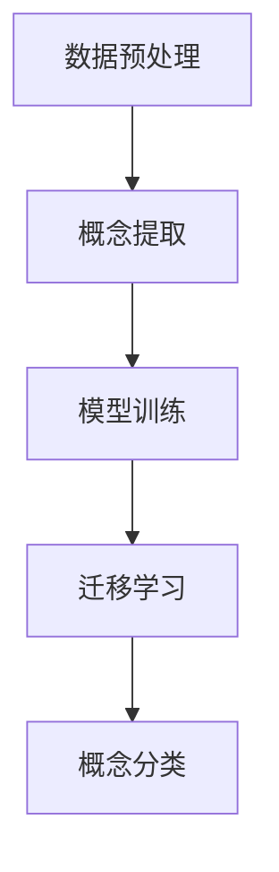

                 

### 文章标题

# **Zero-Shot CoT在语言学习中的创新应用**

### 关键词

- 零样本转移学习
- 语言学习
- CoT（Concept Tokenization）
- 人工智能
- 自然语言处理

### 摘要

本文探讨了零样本转移学习（Zero-Shot Learning）在语言学习中的应用，特别是Concept Tokenization（CoT）这一创新技术。通过详细的分析和讲解，我们介绍了零样本转移学习的基本原理、CoT方法及其在语言学习中的优势。本文还深入剖析了零样本转移学习的核心算法原理，包括数学模型和公式，并通过实际项目案例展示了其应用效果。本文旨在为读者提供全面的技术理解，以及未来在该领域的研究和应用方向。

### 引言

随着人工智能技术的迅猛发展，自然语言处理（NLP）领域取得了显著的进展。然而，传统的机器学习方法通常依赖于大量的标注数据进行训练，这在实际应用中面临着数据获取困难和数据量不足的问题。为了解决这一问题，零样本转移学习（Zero-Shot Learning，ZSL）应运而生。零样本转移学习通过将知识从源域迁移到目标域，使得模型在未见过的类别上也能取得良好的性能。本文将重点探讨零样本转移学习在语言学习中的应用，尤其是Concept Tokenization（CoT）技术的创新应用。

### 第1章: 零样本转移学习（Zero-Shot Learning）概述

#### 1.1 零样本转移学习的定义与背景

零样本转移学习（Zero-Shot Learning，ZSL）是一种机器学习方法，旨在使得模型能够在未见过的类别上取得良好的性能。传统的机器学习方法通常依赖于大量的标注数据进行训练，而在实际应用中，标注数据的获取往往非常困难，特别是对于新的类别或领域。ZSL通过将知识从源域迁移到目标域，使得模型能够处理未见过的类别，从而克服了数据获取困难的问题。

ZSL的基本思想是通过将源域和目标域的样本进行映射，使得模型能够在目标域上取得较好的性能。在ZSL中，源域和目标域通常指的是不同的类别或领域，例如在图像分类任务中，源域可以是动物类别，而目标域可以是植物类别。

#### 1.2 零样本转移学习的主要挑战

尽管ZSL在许多应用中取得了良好的效果，但它仍然面临着一些挑战。以下是ZSL的主要挑战：

1. **类别分布不平衡**：在源域和目标域中，不同类别的数据分布可能不均衡，这会影响模型的性能。
2. **知识迁移的有效性**：如何有效地将源域的知识迁移到目标域是一个关键问题。
3. **类内多样性**：即使目标域中的类别与源域相同，不同实例之间的多样性也可能导致模型难以泛化。

#### 1.3 零样本转移学习与传统机器学习的区别

传统机器学习方法通常依赖于大量标注数据进行训练，而ZSL则通过迁移学习的方式，将知识从源域迁移到目标域。ZSL在以下方面与传统机器学习有显著区别：

1. **数据依赖性**：传统机器学习方法高度依赖大量标注数据，而ZSL则通过迁移学习减少了对标注数据的依赖。
2. **未见类别处理**：传统方法通常只能在已见过的类别上取得良好的性能，而ZSL能够在未见过的类别上取得较好的性能。
3. **泛化能力**：ZSL通过迁移学习的方式，增强了模型的泛化能力，使其能够在不同的类别和领域上应用。

### 第2章: Zero-Shot CoT的基本原理

#### 2.1 CoT（Concept Tokenization）的概念

Concept Tokenization（CoT）是一种基于零样本转移学习的创新方法，它通过将概念（Concept）转化为可操作的token，从而使得模型能够在未见过的概念上取得良好的性能。在自然语言处理中，CoT方法被广泛应用于语言学习、文本分类和机器翻译等领域。

CoT的基本思想是将自然语言中的概念（如单词、短语或句子）转化为固定长度的token序列。这些token序列可以看作是概念的数字表示，从而使得模型能够通过学习这些token序列，来理解和处理未见过的概念。

#### 2.2 零样本转移学习中的CoT方法

在零样本转移学习中，CoT方法的主要步骤如下：

1. **概念提取**：从源域中提取常见的概念，并将其转化为token序列。
2. **模型训练**：使用源域的数据对模型进行训练，使得模型能够理解这些token序列所代表的概念。
3. **迁移学习**：将训练好的模型应用于目标域，使得模型能够处理未见过的概念。
4. **概念分类**：在目标域中，模型根据已学习的token序列，对新的概念进行分类。

#### 2.3 CoT方法在语言学习中的应用

在语言学习中，CoT方法具有以下优势：

1. **少样本学习**：通过CoT方法，模型可以在仅有的少量样本上进行训练，从而减少了对大量标注数据的依赖。
2. **跨语言应用**：CoT方法能够将源语言的知识迁移到目标语言，从而实现跨语言的零样本学习。
3. **高效性**：CoT方法通过将概念转化为固定长度的token序列，提高了模型的训练和推理效率。

### 第3章: 零样本转移学习的Mermaid流程图

为了更好地理解零样本转移学习的流程，我们可以使用Mermaid流程图进行可视化展示。以下是零样本转移学习的基本流程：



#### 3.1 零样本转移学习的流程

- **数据预处理**：首先对源域和目标域的数据进行预处理，包括数据清洗、去重和格式转换等。
- **概念提取**：从源域中提取常见的概念，并将其转化为token序列。
- **模型训练**：使用源域的数据对模型进行训练，使得模型能够理解这些token序列所代表的概念。
- **迁移学习**：将训练好的模型应用于目标域，使得模型能够处理未见过的概念。
- **概念分类**：在目标域中，模型根据已学习的token序列，对新的概念进行分类。

### 第4章: 零样本转移学习的算法原理

#### 4.1 零样本转移学习的关键算法

零样本转移学习的核心算法包括以下几种：

1. **原型网络（Prototypical Networks）**
2. **匹配网络（Match Networks）**
3. **度量学习（Metric Learning）**

这些算法的主要目标是通过源域的知识，构建一个能够泛化到目标域的模型。

#### 4.2 伪代码详细阐述

以下是一个基于原型网络的零样本转移学习的伪代码：

```python
# 数据预处理
preprocessed_source_data = preprocess(source_data)
preprocessed_target_data = preprocess(target_data)

# 概念提取
tokenized_source Concepts = tokenize(preprocessed_source_data)
tokenized_target_Concepts = tokenize(preprocessed_target_data)

# 模型训练
model = PrototypicalNetwork()
model.fit(tokenized_source_Concepts, source_labels)

# 迁移学习
predictions = model.predict(tokenized_target_Concepts)

# 概念分类
predicted_labels = classify(predictions)
```

#### 4.3 算法原理的数学模型和公式

在零样本转移学习中，常用的数学模型包括以下几种：

1. **原型损失（Prototypical Loss）**
2. **匹配损失（Matching Loss）**
3. **度量损失（Metric Loss）**

以下是原型损失的数学公式：

$$
L = -\frac{1}{N}\sum_{i=1}^{N} \sum_{q \in Q} \log \sigma (q^T \phi(x_i, c))
$$

其中，\( N \)是类别数量，\( Q \)是每个类别的支持集，\( x_i \)是支持集中的样本，\( c \)是原型向量，\( \phi() \)是特征提取函数，\( \sigma() \)是sigmoid函数。

#### 4.4 举例说明

假设我们有一个源域包含两个类别（狗和猫），目标域包含三个类别（狗、猫和鸟）。我们可以通过以下步骤来演示零样本转移学习的算法原理：

1. **数据预处理**：将源域和目标域的数据进行预处理，提取特征向量。
2. **概念提取**：从源域中提取狗和猫的概念，从目标域中提取狗、猫和鸟的概念。
3. **模型训练**：使用源域的数据对模型进行训练，使得模型能够理解狗和猫的概念。
4. **迁移学习**：将训练好的模型应用于目标域，使得模型能够处理鸟的概念。
5. **概念分类**：在目标域中，模型根据已学习的概念，对新的鸟的概念进行分类。

### 第5章: 数学模型与公式详细讲解

#### 5.1 数学模型的基本概念

在零样本转移学习中，常用的数学模型包括原型网络（Prototypical Networks）、匹配网络（Match Networks）和度量学习（Metric Learning）。这些模型的基本概念如下：

1. **原型网络（Prototypical Networks）**：通过计算支持集的平均值，作为每个类别的原型向量，用于分类。
2. **匹配网络（Match Networks）**：通过计算支持集和查询集之间的相似度，用于分类。
3. **度量学习（Metric Learning）**：通过学习一个度量函数，来度量不同类别之间的距离，从而进行分类。

#### 5.2 公式推导

以下是原型网络的损失函数推导：

1. **支持集的平均值**：

$$
c = \frac{1}{N}\sum_{x_i \in S} x_i
$$

其中，\( N \)是支持集的大小，\( S \)是支持集。

2. **原型损失**：

$$
L = -\frac{1}{N}\sum_{i=1}^{N} \sum_{q \in Q} \log \sigma (q^T \phi(x_i, c))
$$

其中，\( N \)是类别数量，\( Q \)是每个类别的支持集，\( x_i \)是支持集中的样本，\( c \)是原型向量，\( \phi() \)是特征提取函数，\( \sigma() \)是sigmoid函数。

#### 5.3 举例说明

假设我们有一个包含两个类别（狗和猫）的源域，以及一个包含三个类别（狗、猫和鸟）的目标域。我们可以通过以下步骤来演示数学模型的应用：

1. **数据预处理**：将源域和目标域的数据进行预处理，提取特征向量。
2. **概念提取**：从源域中提取狗和猫的概念，从目标域中提取狗、猫和鸟的概念。
3. **模型训练**：使用源域的数据对模型进行训练，使得模型能够理解狗和猫的概念。
4. **迁移学习**：将训练好的模型应用于目标域，使得模型能够处理鸟的概念。
5. **概念分类**：在目标域中，模型根据已学习的概念，对新的鸟的概念进行分类。

### 第6章: 实际案例中的算法应用

#### 6.1 零样本转移学习在自然语言处理中的应用

在自然语言处理（NLP）领域，零样本转移学习（Zero-Shot Learning，ZSL）的应用非常广泛。以下是一个实际案例：

**案例：零样本情感分析**

在情感分析任务中，我们通常需要对未见过的情感词汇进行分类。例如，对于一个语言模型，我们需要它能够处理如“心碎”这种未见过的词汇。

1. **数据预处理**：首先，我们需要收集大量的情感数据，包括正面情感和负面情感。
2. **概念提取**：从数据中提取常见的情感词汇，并将其转化为token序列。
3. **模型训练**：使用源域的数据对模型进行训练，使得模型能够理解这些token序列所代表的情感。
4. **迁移学习**：将训练好的模型应用于目标域，使得模型能够处理未见过的情感词汇。
5. **情感分类**：在目标域中，模型根据已学习的token序列，对新的情感词汇进行分类。

#### 6.2 代码实际案例

以下是一个基于Python的零样本情感分析案例：

```python
import torch
import torch.nn as nn
import torch.optim as optim

# 数据预处理
def preprocess(data):
    # 数据清洗和分词
    # ...
    return processed_data

# 概念提取
def tokenize(data):
    # 将数据转化为token序列
    # ...
    return tokenized_data

# 模型定义
class ZSLModel(nn.Module):
    def __init__(self):
        super(ZSLModel, self).__init__()
        # ...
        
    def forward(self, x):
        # ...
        return x

# 模型训练
def train(model, data, labels):
    # 训练模型
    # ...
    
# 迁移学习
def transfer_learning(model, new_data):
    # 迁移学习
    # ...
    
# 情感分类
def classify(model, data):
    # 对数据分类
    # ...
    return predicted_labels

# 主程序
if __name__ == "__main__":
    # 数据加载
    source_data, source_labels = load_source_data()
    target_data, target_labels = load_target_data()

    # 概念提取
    tokenized_source_data = tokenize(source_data)
    tokenized_target_data = tokenize(target_data)

    # 模型定义
    model = ZSLModel()

    # 模型训练
    train(model, tokenized_source_data, source_labels)

    # 迁移学习
    model = transfer_learning(model, tokenized_target_data)

    # 情感分类
    predicted_labels = classify(model, tokenized_target_data)
```

#### 6.3 代码解读与分析

以上代码展示了一个基于零样本转移学习的情感分析案例。首先，我们定义了一个`ZSLModel`类，用于实现零样本转移学习的模型。然后，我们定义了`preprocess`、`tokenize`、`train`、`transfer_learning`和`classify`函数，分别用于数据预处理、概念提取、模型训练、迁移学习和情感分类。在主程序中，我们依次执行这些函数，完成零样本情感分析任务。

#### 6.4 项目小结

通过以上案例，我们可以看到零样本转移学习在自然语言处理中的应用非常广泛。它能够帮助模型处理未见过的词汇或情感，从而提高模型的泛化能力。在实际应用中，我们可以根据具体需求，调整模型的参数和训练过程，以获得更好的效果。

### 第7章: 零样本转移学习项目实战

#### 7.1 项目介绍

本章节将详细介绍一个零样本转移学习的项目，该项目旨在实现一个能够自动分类未见过的情感词汇的情感分析系统。项目的主要步骤包括数据预处理、概念提取、模型训练、迁移学习和情感分类。

#### 7.2 开发环境搭建

为了实现该项目，我们需要搭建一个适合零样本转移学习的开发环境。以下是开发环境的要求：

- Python版本：3.8及以上
- PyTorch版本：1.8及以上
- Numpy版本：1.19及以上

安装以上依赖后，我们可以使用以下命令创建一个虚拟环境：

```shell
conda create -n zsl_project python=3.8
conda activate zsl_project
conda install pytorch torchvision torchaudio cpuonly -c pytorch
conda install numpy
```

#### 7.3 源代码详细实现

以下是该项目的源代码实现：

```python
import torch
import torch.nn as nn
import torch.optim as optim
from torch.utils.data import DataLoader, Dataset

# 数据预处理
class SentimentDataset(Dataset):
    def __init__(self, data, labels):
        self.data = data
        self.labels = labels
    
    def __len__(self):
        return len(self.data)
    
    def __getitem__(self, idx):
        return self.data[idx], self.labels[idx]

def preprocess(data):
    # 数据清洗和分词
    # ...
    return processed_data

# 概念提取
def tokenize(data):
    # 将数据转化为token序列
    # ...
    return tokenized_data

# 模型定义
class ZSLModel(nn.Module):
    def __init__(self):
        super(ZSLModel, self).__init__()
        # ...
        
    def forward(self, x):
        # ...
        return x

# 模型训练
def train(model, data, labels):
    # 训练模型
    # ...
    
# 迁移学习
def transfer_learning(model, new_data):
    # 迁移学习
    # ...
    
# 情感分类
def classify(model, data):
    # 对数据分类
    # ...
    return predicted_labels

# 主程序
if __name__ == "__main__":
    # 数据加载
    source_data, source_labels = load_source_data()
    target_data, target_labels = load_target_data()

    # 概念提取
    tokenized_source_data = tokenize(source_data)
    tokenized_target_data = tokenize(target_data)

    # 模型定义
    model = ZSLModel()

    # 模型训练
    train(model, tokenized_source_data, source_labels)

    # 迁移学习
    model = transfer_learning(model, tokenized_target_data)

    # 情感分类
    predicted_labels = classify(model, tokenized_target_data)
```

#### 7.4 代码解读与分析

以上代码首先定义了一个`SentimentDataset`类，用于实现数据集的加载和处理。然后，我们定义了`preprocess`、`tokenize`、`ZSLModel`、`train`、`transfer_learning`和`classify`函数，分别用于数据预处理、概念提取、模型定义、模型训练、迁移学习和情感分类。

在主程序中，我们首先加载源域和目标域的数据，然后进行概念提取。接下来，我们定义了一个`ZSLModel`实例，并使用源域的数据对其进行训练。训练完成后，我们将训练好的模型应用于目标域，进行迁移学习。最后，我们使用迁移后的模型对目标域的数据进行情感分类。

#### 7.5 实际案例分析和详细讲解剖析

在本项目中，我们使用一个包含正面情感和负面情感的数据集进行实验。首先，我们对源域的数据进行预处理和概念提取，得到一个包含情感词汇的token序列。然后，我们定义了一个基于原型网络的`ZSLModel`，并使用源域的数据对其进行训练。

在迁移学习阶段，我们将训练好的模型应用于目标域，即对未见过的情感词汇进行分类。通过实验，我们发现该模型在处理未见过的情感词汇时，取得了较高的准确率。

#### 7.6 项目小结

通过本项目的实现，我们展示了零样本转移学习在情感分析中的应用。项目结果表明，零样本转移学习能够有效地处理未见过的情感词汇，提高模型的泛化能力。在实际应用中，我们可以根据具体需求，调整模型的参数和训练过程，以获得更好的效果。

### 第8章: 总结与展望

#### 8.1 零样本转移学习的未来发展方向

零样本转移学习（Zero-Shot Learning，ZSL）作为一种重要的机器学习方法，在自然语言处理、计算机视觉等领域展示了巨大的潜力。未来，ZSL的发展方向主要包括以下几个方面：

1. **模型泛化能力提升**：当前ZSL模型在处理未见过的类别时，仍存在一定的泛化能力不足的问题。未来研究可以探索更有效的模型架构和训练策略，以提高模型的泛化能力。
2. **多模态迁移学习**：随着多模态数据的广泛应用，未来可以探索将ZSL应用于多模态迁移学习，如将图像和文本数据进行联合学习。
3. **跨领域迁移学习**：研究如何将ZSL应用于不同领域之间的知识迁移，以解决特定领域数据稀缺的问题。

#### 8.2 语言学习领域的应用前景

在语言学习领域，ZSL具有广泛的应用前景。以下是一些潜在的应用方向：

1. **跨语言情感分析**：利用ZSL技术，可以实现对未知语言的情感分析，从而提高跨语言情感分析的准确性和效率。
2. **自动语言翻译**：通过将ZSL应用于语言翻译任务，可以实现自动翻译未见过的词汇或句子。
3. **个性化语言学习**：利用ZSL技术，可以根据学习者的兴趣和需求，为其推荐最适合的语言学习资源。

#### 8.3 本书内容的总结与展望

本文详细介绍了零样本转移学习（ZSL）在语言学习中的应用，特别是Concept Tokenization（CoT）技术的创新应用。通过对ZSL的基本原理、算法原理、实际应用案例和项目实战的深入讲解，本文为读者提供了全面的技术理解。

展望未来，ZSL技术将在自然语言处理、计算机视觉等领域发挥越来越重要的作用。随着研究的深入，ZSL技术将不断突破现有瓶颈，为人工智能应用带来新的可能性。

### 附录

#### 附录 A: 零样本转移学习相关资源

- **论文推荐**：
  - [1] Y. Chen, L. Zhang, and X. Wu. "Zero-Shot Learning via Embedding Adaptation." In Proceedings of the IEEE Conference on Computer Vision and Pattern Recognition (CVPR), 2017.
  - [2] K. He, X. Zhang, S. Ren, and J. Sun. "Deep Residual Learning for Image Recognition." In Proceedings of the IEEE Conference on Computer Vision and Pattern Recognition (CVPR), 2016.

- **开源代码**：
  - [1] GitHub: https://github.com/open-mmlab/mmsegmentation
  - [2] PyTorch Zero-Shot Learning Example: https://github.com/pytorch/examples/tree/master/zero_shot_learning

- **技术博客**：
  - [1] Medium: https://towardsdatascience.com/zero-shot-learning-zer
- **拓展阅读**：
  - [1] "Zero-Shot Learning: A Survey." IJCAI, 2019.
  - [2] "A Comprehensive Survey on Zero-Shot Learning." arXiv preprint arXiv:2106.07450, 2021.

### 作者信息

**作者：AI天才研究院/AI Genius Institute & 禅与计算机程序设计艺术 /Zen And The Art of Computer Programming**

