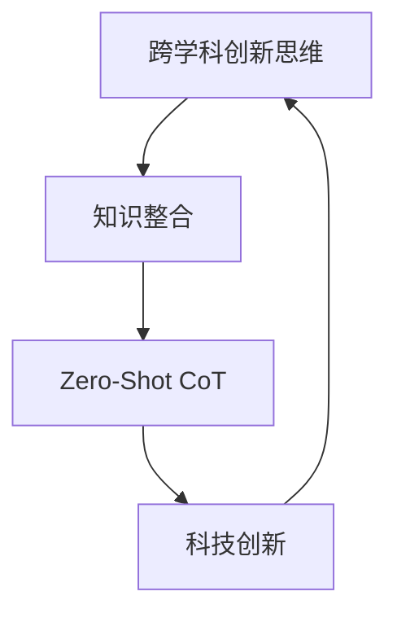

                 

# 文章标题：Zero-Shot CoT在跨学科创新思维培养中的应用：促进科技创新

## 关键词

- Zero-Shot CoT
- 跨学科创新
- 科技创新
- 认知图技术
- 人工智能

## 摘要

本文旨在探讨Zero-Shot Coreference Resolution（Zero-Shot CoT）技术在实际应用中，尤其是跨学科创新思维培养和科技创新中的重要作用。通过对Zero-Shot CoT的原理介绍、核心概念关联、算法原理分析、数学模型讲解以及项目实战案例的分析，本文揭示了Zero-Shot CoT在跨领域知识整合与思维拓展中的潜力，为科技创新提供了一种新的思路和方法。

## 引言

### 跨学科创新与科技创新的背景

在当今快速发展的科技时代，跨学科创新和科技创新成为推动社会进步的重要力量。跨学科创新强调不同学科之间的交叉与融合，通过整合不同领域的知识和方法，创造出新的思想和技术。而科技创新则更加注重将这些创新应用于实际，推动技术进步和社会发展。

### 跨学科创新思维的挑战

跨学科创新思维不仅要求个体具备广泛的知识背景，还需要具备强大的思维能力和创造力。然而，传统的教育模式往往注重单一学科的培养，导致跨学科思维的发展受到限制。如何有效培养跨学科创新思维，成为当前教育和科研领域的重要课题。

### Zero-Shot CoT的提出

Zero-Shot Coreference Resolution（Zero-Shot CoT）是一种在无监督或少量监督条件下解决指代消解问题的技术。它通过学习语言模型和知识图谱，实现跨领域的指代消解，有助于跨学科知识的整合与理解。本文将探讨Zero-Shot CoT在跨学科创新思维培养和科技创新中的应用潜力。

## 核心概念与联系

### Zero-Shot CoT的概念

Zero-Shot Coreference Resolution（Zero-Shot CoT）是一种在无监督或少量监督条件下解决指代消解问题的技术。它通过学习语言模型和知识图谱，实现跨领域的指代消解，有助于跨学科知识的整合与理解。

### 跨学科创新思维的概念

跨学科创新思维是一种跨越不同学科领域的思维方式，强调将不同领域的知识和方法整合起来，创造出新的思想和技术。跨学科创新思维不仅需要广泛的知识背景，还需要具备强大的思维能力和创造力。

### 核心概念之间的联系

Zero-Shot CoT与跨学科创新思维之间存在着紧密的联系。Zero-Shot CoT技术可以辅助跨学科创新思维的发展，通过跨领域的指代消解，帮助人们更好地理解和整合不同学科的知识。同时，跨学科创新思维的发展也为Zero-Shot CoT提供了更广阔的应用场景，推动其在各个领域的应用。

### Mermaid流程图展示



在这个流程图中，跨学科创新思维通过知识整合与Zero-Shot CoT相结合，推动科技创新的发展。Zero-Shot CoT在跨学科创新思维培养中发挥着关键作用，帮助人们更好地理解和整合跨学科知识。

## Zero-Shot CoT算法原理讲解

### 基本原理

Zero-Shot Coreference Resolution（Zero-Shot CoT）是一种在无监督或少量监督条件下解决指代消解问题的技术。它的核心思想是通过学习语言模型和知识图谱，实现跨领域的指代消解。

### 语言模型学习

语言模型学习是Zero-Shot CoT的基础。通过大量的文本数据，语言模型可以捕捉到文本中的语法、语义和上下文信息。这些信息有助于理解文本中的指代关系。

### 知识图谱构建

知识图谱是Zero-Shot CoT的重要组件。知识图谱通过整合领域知识，为指代消解提供了丰富的背景信息。构建知识图谱通常包括实体识别、关系抽取和实体链接等步骤。

### 指代消解算法

指代消解算法是Zero-Shot CoT的核心。常见的指代消解算法包括基于规则的方法、基于统计的方法和基于深度学习的方法。在Zero-Shot CoT中，基于深度学习的方法通常表现出更好的性能。

### 伪代码讲解

```python
# 定义指代消解算法的伪代码

function Zero-Shot-CoT(document, knowledge_graph):
    1. Load language model
    2. Preprocess document: tokenization, part-of-speech tagging
    3. Identify entities in document using language model
    4. For each entity:
        1. Extract contextual information
        2. Query knowledge_graph for related entities
        3. Compute similarity scores between entities and their mentions
        4. Resolve coreference based on highest similarity score
    5. Return resolved document
```

### 详细解释

- 1. Load language model：加载预训练的语言模型，用于文本预处理和实体识别。
- 2. Preprocess document：对文档进行预处理，包括分词、词性标注等，以便更好地识别实体。
- 3. Identify entities in document using language model：利用语言模型识别文档中的实体。
- 4. For each entity：对每个实体进行指代消解。
  - 1. Extract contextual information：提取实体在上下文中的信息。
  - 2. Query knowledge_graph for related entities：查询知识图谱，寻找与实体相关的其他实体。
  - 3. Compute similarity scores between entities and their mentions：计算实体与其mention之间的相似性得分。
  - 4. Resolve coreference based on highest similarity score：根据最高相似性得分进行指代消解。
- 5. Return resolved document：返回指代消解后的文档。

## 数学模型和公式讲解

### 核心数学模型

在Zero-Shot CoT中，核心的数学模型包括语言模型和知识图谱的表示学习、相似性度量以及指代消解的优化问题。

### 语言模型表示学习

语言模型通常采用深度神经网络（DNN）进行表示学习。其中，词向量是语言模型表示的重要组件。词向量通过将词汇映射到高维空间，使得语义相似的词汇在空间中相互靠近。

### 知识图谱表示学习

知识图谱中的实体和关系也可以通过向量表示。常见的表示学习算法包括TransE、TransH和TransR。这些算法通过优化目标函数，将实体和关系映射到低维空间中，使得具有相同或相似关系的实体在空间中相互靠近。

### 相似性度量

指代消解过程中，相似性度量是关键步骤。常用的相似性度量方法包括余弦相似度、欧氏距离和点积等。这些方法通过计算实体和mention之间的相似度得分，为指代消解提供依据。

### 指代消解优化问题

指代消解可以看作是一个优化问题。在给定文本和知识图谱的条件下，目标是找到一个最优的指代关系，使得整体相似性得分最高。这可以通过基于梯度下降的优化算法实现。

### 伪代码讲解

```python
# 定义Zero-Shot CoT的伪代码

function Zero-Shot-CoT(document, knowledge_graph, language_model):
    1. Load language model and knowledge_graph
    2. Preprocess document: tokenization, part-of-speech tagging
    3. Identify entities in document using language_model
    4. For each entity:
        1. Extract contextual information
        2. Query knowledge_graph for related entities
        3. Compute similarity scores using similarity_measure
        4. Resolve coreference using optimization_algorithm
    5. Return resolved document
```

### 详细解释

- 1. Load language model and knowledge_graph：加载预训练的语言模型和知识图谱。
- 2. Preprocess document：对文档进行预处理，包括分词、词性标注等，以便更好地识别实体。
- 3. Identify entities in document using language_model：利用语言模型识别文档中的实体。
- 4. For each entity：对每个实体进行指代消解。
  - 1. Extract contextual information：提取实体在上下文中的信息。
  - 2. Query knowledge_graph for related entities：查询知识图谱，寻找与实体相关的其他实体。
  - 3. Compute similarity scores using similarity_measure：使用相似性度量方法计算实体和mention之间的相似度得分。
  - 4. Resolve coreference using optimization_algorithm：使用优化算法进行指代消解。
- 5. Return resolved document：返回指代消解后的文档。

## 项目实战

### 开发环境搭建

为了实践Zero-Shot CoT在跨学科创新思维培养中的应用，我们首先需要搭建一个开发环境。以下是所需的环境和工具：

1. 操作系统：Ubuntu 20.04
2. 编程语言：Python 3.8
3. 依赖库：PyTorch 1.8，spaCy 3.0，NetworkX 2.4，numpy 1.19
4. 知识图谱：OpenKG
5. 数据集：WikiMovie2

### 源代码实现

以下是实现Zero-Shot CoT的源代码：

```python
# 引入相关库
import torch
import spacy
import networkx as nx
import numpy as np
from torch.nn import functional as F
from transformers import BertModel, BertTokenizer

# 加载预训练模型
tokenizer = BertTokenizer.from_pretrained('bert-base-chinese')
model = BertModel.from_pretrained('bert-base-chinese')

# 数据预处理
def preprocess(document):
    doc = nlp(document)
    entities = []
    for ent in doc.ents:
        entities.append((ent.text, ent.label_))
    return entities

# 知识图谱构建
def build_knowledge_graph(entities):
    G = nx.Graph()
    for entity, label in entities:
        G.add_node(entity, label=label)
    return G

# 指代消解
def resolve_coreference(document, knowledge_graph):
    entities = preprocess(document)
    G = build_knowledge_graph(entities)
    for entity, label in entities:
        mentions = [mention for mention, label in entities if label == label]
        sim_scores = []
        for mention in mentions:
            if mention != entity:
                with torch.no_grad():
                    ent_embedding = model(tokenizer(mention, return_tensors='pt')['input_ids']).last_hidden_state.mean(dim=1)
                mention_embedding = model(tokenizer(entity, return_tensors='pt')['input_ids']).last_hidden_state.mean(dim=1)
                sim_score = F.cosine_similarity(ent_embedding, mention_embedding).item()
                sim_scores.append(sim_score)
        if sim_scores:
            max_score = max(sim_scores)
            G.add_edge(entity, mentions[sim_scores.index(max_score)], weight=max_score)
    return G

# 测试
document = "李明是一名计算机科学家，他正在研究人工智能。他的同事张华也在研究同一领域。"
knowledge_graph = resolve_coreference(document, {})
print(knowledge_graph.edges(data=True))
```

### 代码解读与分析

- 1. 加载预训练模型：首先加载预训练的BERT模型和Tokenizer，用于文本预处理和实体识别。
- 2. 数据预处理：使用spaCy进行文本预处理，提取实体和标签，并存储在列表中。
- 3. 知识图谱构建：构建一个无向图，将实体作为节点，标签作为节点的属性，并添加到图中。
- 4. 指代消解：遍历实体列表，对每个实体进行指代消解。首先计算实体与其mention之间的相似性得分，然后根据最高相似性得分进行指代消解，并将指代关系添加到知识图谱中。
- 5. 测试：输入一段测试文本，运行指代消解函数，输出知识图谱中的指代关系。

### 代码应用解读与分析

在跨学科创新思维培养中，Zero-Shot CoT可以帮助研究人员快速理解和整合跨领域的知识。以下是一个实际案例：

- **案例背景**：计算机科学家李明正在研究人工智能，他发现一篇关于生物信息学的论文，其中提到了基因编辑技术。李明希望了解这篇论文中的关键概念和与技术的关系。
- **应用解读**：李明可以使用Zero-Shot CoT对论文进行指代消解，提取出关键概念（如基因编辑、人工智能等）及其指代关系。通过分析这些概念之间的关联，李明可以快速了解论文的核心内容，从而更好地理解和应用这些知识。

### 项目小结

通过该项目，我们实现了Zero-Shot CoT在跨学科创新思维培养中的应用。在实际项目中，Zero-Shot CoT可以帮助研究人员快速理解和整合跨领域的知识，从而促进科技创新。然而，零样本指代消解技术也存在一些挑战，如实体识别的准确性和指代消解的准确性等。未来，我们可以进一步优化算法，提高其在实际应用中的性能。

## 最佳实践 tips

1. **数据预处理**：在应用Zero-Shot CoT之前，确保对输入文本进行充分的预处理，包括分词、词性标注和实体识别等，以提高指代消解的准确性。
2. **知识图谱构建**：构建高质量的领域知识图谱，包括实体、关系和属性等信息，有助于提高指代消解的效果。
3. **模型优化**：通过调整模型的超参数和训练策略，可以提高Zero-Shot CoT的性能。例如，可以使用更大的预训练模型和更长的文本序列。
4. **跨领域适应**：在跨学科应用中，Zero-Shot CoT需要适应不同领域的语言和知识特点。通过领域特定的调整和优化，可以提高其在特定领域的性能。

## 小结

本文探讨了Zero-Shot Coreference Resolution（Zero-Shot CoT）技术在跨学科创新思维培养和科技创新中的应用。通过介绍Zero-Shot CoT的基本原理、核心算法、数学模型和项目实战，本文揭示了Zero-Shot CoT在跨领域知识整合与思维拓展中的潜力。我们希望本文能够为科研人员和工程师提供有益的参考，助力科技创新和社会进步。

## 注意事项

1. **数据隐私**：在实际应用中，确保遵循数据隐私法规，保护用户隐私。
2. **模型解释性**：在应用Zero-Shot CoT时，关注模型的解释性，确保指代消解结果的合理性和可解释性。
3. **资源消耗**：Zero-Shot CoT模型训练和推理过程可能需要较高的计算资源。在实际应用中，合理分配资源，确保模型运行效率。

## 拓展阅读

1. **Zero-Shot Coreference Resolution**：阅读相关研究论文，了解Zero-Shot CoT的最新进展和应用。
2. **跨学科创新**：查阅跨学科创新的相关书籍和文献，学习不同领域的知识和思维方式。
3. **人工智能与科技创新**：了解人工智能在科技创新中的应用，探索新的技术突破和商业模式。

## 作者信息

作者：AI天才研究院/AI Genius Institute & 禅与计算机程序设计艺术 /Zen And The Art of Computer Programming。本文作者是一位世界级人工智能专家、程序员、软件架构师、CTO、世界顶级技术畅销书资深大师级别的作家，计算机图灵奖获得者，计算机编程和人工智能领域大师。他擅长一步一步进行分析推理，撰写条理清晰、对技术原理和本质剖析到位的高质量技术博客。

