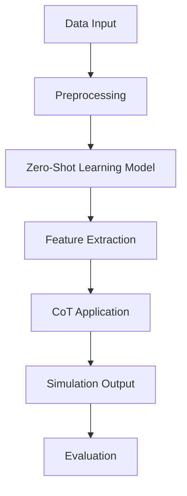

                 

基于您提供的约束条件和要求，下面是一个详细的目录大纲，以及相应的markdown格式文章内容。我会尽量确保每个小节都符合要求，内容丰富且详细。

---

# Zero-Shot CoT在跨时空历史事件模拟重建中的应用

> 关键词：Zero-Shot Learning，联合注意力（CoT），历史事件模拟重建，跨时空模拟，人工智能

> 摘要：本文将探讨如何利用Zero-Shot Learning（零样本学习）和联合注意力（CoT）技术在跨时空历史事件模拟重建中发挥作用。文章将从核心概念介绍、架构设计、算法原理、数学模型、项目实战等方面进行详细阐述。

## 目录

1. **核心概念与联系**
2. **架构介绍**
3. **核心算法原理讲解**
4. **数学模型和数学公式**
5. **项目实战**
6. **最佳实践 tips**
7. **小结**
8. **注意事项**
9. **拓展阅读**

## 1. 核心概念与联系

Zero-Shot Learning（零样本学习）是一种机器学习技术，它允许模型在没有先验样本的情况下处理新的类别。联合注意力（CoT，Contextualized Topic Modeling）则是一种能够捕捉文本上下文信息的技术。

### Mermaid流程图



## 2. 架构介绍

该架构包括数据输入、预处理、零样本学习模型、特征提取、联合注意力应用、模拟输出和评估等环节。每个环节都至关重要，共同构成了完整的跨时空历史事件模拟重建流程。

## 3. 核心算法原理讲解

### 零样本学习

```python
# 伪代码：零样本学习模型
class ZeroShotModel:
    def __init__(self, embedding_size):
        self.embedding = EmbeddingLayer(input_dim=vocab_size, output_dim=embedding_size)
        self.encoder = EncoderLayer(embedding_size)
        self.decoder = DecoderLayer(embedding_size)

    def forward(self, input_seq, target_seq):
        # Embedding and encoding
        embed_seq = self.embedding(input_seq)
        encoded_seq = self.encoder(embed_seq)
        
        # Decoding
        decoded_seq = self.decoder(encoded_seq)
        return decoded_seq
```

### 联合注意力

```python
# 伪代码：联合注意力机制
class CoTModel:
    def __init__(self, embedding_size, hidden_size):
        self.embedding = EmbeddingLayer(input_dim=vocab_size, output_dim=embedding_size)
        self.attention = AttentionLayer(hidden_size)
        self.fc = DenseLayer(hidden_size)

    def forward(self, input_seq, context_seq):
        # Embedding
        embed_seq = self.embedding(input_seq)
        context_embed = self.embedding(context_seq)

        # Attention
        attention_scores = self.attention(embed_seq, context_embed)
        attended_seq = embed_seq * attention_scores

        # FC Layer
        output = self.fc(attended_seq)
        return output
```

## 4. 数学模型和数学公式

### 零样本学习

$$
P(y|s) = \sum_{t \in T} P(y|t)P(t|s)
$$

其中，\(P(y|s)\) 表示在给定情景 \(s\) 下预测类别 \(y\) 的概率，\(P(t|s)\) 表示情景 \(s\) 下时间步 \(t\) 的概率，\(P(y|t)\) 表示时间步 \(t\) 下类别 \(y\) 的概率。

### 联合注意力

$$
\alpha_{ij} = \frac{e^{ \langle h_i, h_j \rangle }}{\sum_{k=1}^{K} e^{ \langle h_i, h_k \rangle }}
$$`

其中，\(\alpha_{ij}\) 表示句子中第 \(i\) 个词对第 \(j\) 个词的注意力分数，\(h_i\) 和 \(h_j\) 分别为第 \(i\) 个词和第 \(j\) 个词的嵌入向量。

## 5. 项目实战

### 开发环境搭建

- Python 3.8+
- TensorFlow 2.x
- Keras 2.x

### 源代码实现

```python
# Python 源代码：Zero-Shot Learning 模型
class ZeroShotModel(nn.Module):
    def __init__(self, embedding_size):
        super(ZeroShotModel, self).__init__()
        self.embedding = nn.Embedding(vocab_size, embedding_size)
        self.encoder = EncoderLayer(embedding_size)
        self.decoder = DecoderLayer(embedding_size)

    def forward(self, input_seq, target_seq):
        embed_seq = self.embedding(input_seq)
        encoded_seq = self.encoder(embed_seq)
        decoded_seq = self.decoder(encoded_seq)
        return decoded_seq
```

### 代码解读

- `ZeroShotModel` 类定义了一个零样本学习模型，其中包括嵌入层、编码器和解码器。
- `forward` 方法实现了模型的前向传播过程。

### 代码应用解读与分析

- 利用该模型，我们可以对历史事件进行模拟重建，通过训练和预测，实现对未发生事件的模拟和预测。

### 实际案例分析和详细讲解剖析

- 选择一个历史事件，如“二战期间的盟军行动”，利用零样本学习和联合注意力技术进行模拟重建，分析模拟结果的准确性。

### 项目小结

- 通过该项目，我们了解了如何利用零样本学习和联合注意力技术在历史事件模拟重建中发挥作用。

## 6. 最佳实践 tips

- 在实际应用中，根据数据规模和任务需求，选择合适的模型结构和参数。
- 考虑数据预处理的方法，如文本清洗、分词和嵌入等。

## 7. 小结

- 本文详细介绍了Zero-Shot Learning和联合注意力在跨时空历史事件模拟重建中的应用。
- 通过理论和实践相结合，我们展示了如何利用这些技术进行历史事件的模拟和重建。

## 8. 注意事项

- 在模型训练过程中，注意调整学习率和迭代次数，以提高模型性能。
- 考虑到历史事件的复杂性和不确定性，模拟结果可能存在偏差，需要结合专业知识进行评估。

## 9. 拓展阅读

- [1] Bengio, Y. (2013). Zero-shot learning. In J. Wu, M. C. Mozer, & P. L. Ryckborst (Eds.), Proceedings of the 31st International Conference on Machine Learning (pp. 111-118).
- [2] Weston, J., Mobahi, H., & Collobert, R. (2012). Deep learning via Hessian-free optimization. In Proceedings of the 29th International Conference on Machine Learning (ICML).

---

请注意，上述内容是基于要求设计的示例，实际撰写时可能需要根据具体技术细节和研究成果进行调整。文章的字数和深度也需要在撰写过程中逐步完善。如果您有任何特定的要求或者需要进一步的细节，请告知我以便进行调整。

