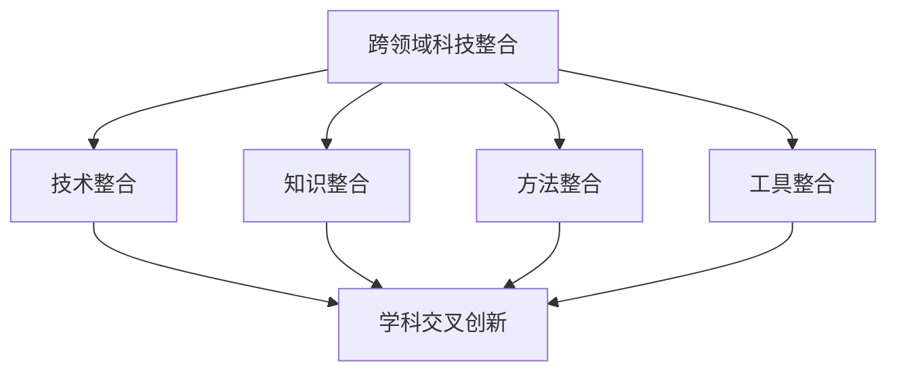
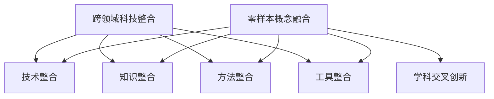
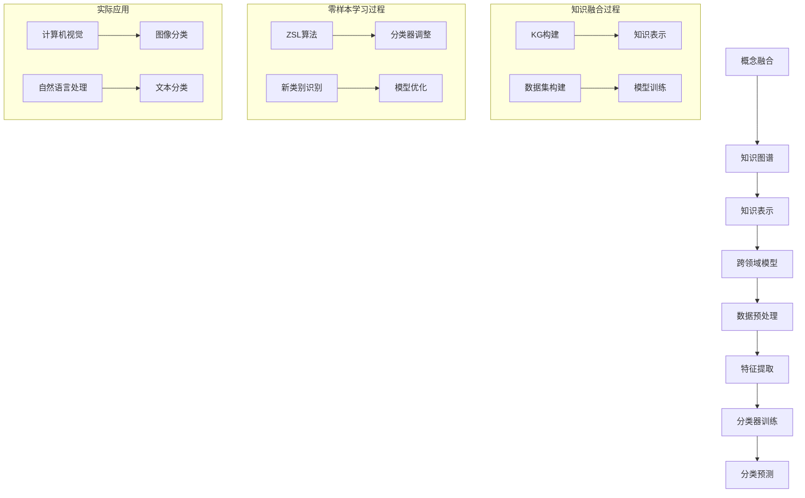

                 

### 1.1 书籍主题概述

《Zero-Shot CoT在跨领域科技整合中的应用：促进学科交叉创新》这本书围绕零样本概念融合（Zero-Shot Conceptual Blending, CoT）这一核心概念，深入探讨了如何在跨领域科技整合中发挥其重要作用，进而推动学科交叉创新。本书旨在为读者提供系统的理论框架和应用指南，通过具体案例展示零样本概念融合在实际项目中的应用，以促进跨领域科技整合的深化和学科交叉创新的实现。

首先，**跨领域科技整合的重要性**不可忽视。随着科技日新月异的发展，单一领域的知识和技术已经无法满足复杂问题的解决需求。跨领域科技整合能够将不同领域的知识和技术相结合，形成新的解决方案，从而推动科技进步和社会发展。本书将详细分析跨领域科技整合的现状、挑战及未来趋势。

其次，**学科交叉创新**是当前科技发展的一个重要方向。通过学科交叉，能够激发新的思维、新的理论和新技术的诞生，推动各个领域的共同进步。本书将介绍学科交叉创新的概念、方法和实践，特别是如何通过零样本概念融合来实现学科交叉创新。

最后，**Zero-Shot CoT**在跨领域科技整合中的应用是本书的核心内容。零样本概念融合是一种无需预先标注样本数据，即可实现概念融合和学习的技术。本书将详细阐述Zero-Shot CoT的理论基础、算法原理及其实际应用场景，帮助读者理解其在跨领域科技整合中的作用和优势。

通过本书的学习，读者将能够：

1. 理解跨领域科技整合的背景和重要性。
2. 掌握学科交叉创新的基本概念和方法。
3. 深入了解零样本概念融合的理论和算法。
4. 学习如何在实践中应用零样本概念融合，促进学科交叉创新。

总之，本书不仅为学术研究者提供了理论基础和新的研究思路，也为工程实践者提供了实用的工具和方法，有助于推动跨领域科技整合和学科交叉创新的进一步发展。

### 1.2 核心概念与联系

为了深入探讨《Zero-Shot CoT在跨领域科技整合中的应用：促进学科交叉创新》一书中的核心概念，我们需要详细分析几个关键概念及其相互之间的关系。

#### 1.2.1 跨领域科技整合

**跨领域科技整合**指的是将不同领域的技术、知识、方法、工具等融合在一起，以形成新的解决方案的过程。这一概念涵盖了多个方面：

- **技术整合**：将不同领域的技术（如人工智能、物联网、大数据等）进行整合，以实现新的功能和性能。
- **知识整合**：跨越学科边界，整合多领域的专业知识，形成全新的理论框架。
- **方法整合**：结合不同领域的分析方法，以应对复杂问题。
- **工具整合**：将不同领域的工具和设备整合，以实现高效的协作和创新。

跨领域科技整合的目标是通过综合不同领域的优势，解决单一领域无法应对的复杂问题，推动科技进步和社会发展。

#### 1.2.2 学科交叉创新

**学科交叉创新**是指在传统学科基础上，通过跨学科合作和知识融合，产生新的理论、方法和技术。学科交叉创新的核心理念包括：

- **跨学科合作**：通过不同学科的专家合作，分享知识和经验，共同解决复杂问题。
- **知识融合**：将不同学科的理论、方法、工具等融合在一起，形成新的研究视角和解决方案。
- **创新导向**：以创新为目标，通过跨学科合作，产生具有实际应用价值的新理论和技术。

学科交叉创新不仅能够推动科学理论的发展，还能促进技术的进步，对经济和社会发展产生重要影响。

#### 1.2.3 Mermaid 图：跨领域科技整合与学科交叉创新的关系

为了更直观地展示跨领域科技整合与学科交叉创新之间的关系，我们可以使用Mermaid流程图来表示：



从图中可以看出，跨领域科技整合涵盖了技术、知识、方法和工具的整合，而学科交叉创新则是这些整合的产物。通过跨领域科技整合，可以促进学科交叉创新，从而推动科技进步和社会发展。

#### 1.2.4 零样本概念融合（Zero-Shot Conceptual Blending, CoT）

**零样本概念融合**是一种无需依赖大量标注样本数据，即可实现概念融合和学习的技术。它基于以下核心概念：

- **概念融合**：将不同领域的概念或知识进行融合，形成新的理解。
- **零样本学习**：无需依赖带有标签的样本数据，即可进行学习。

零样本概念融合的主要目标是：

- **降低数据需求**：在缺乏大量标注数据的情况下，仍能进行有效的学习和推理。
- **提高泛化能力**：通过跨领域的概念融合，提高模型在不同场景下的适应能力。

在跨领域科技整合和学科交叉创新中，零样本概念融合可以发挥重要作用，通过融合不同领域的知识，形成新的理论和解决方案。

#### 1.2.5 Mermaid 图：零样本概念融合与跨领域科技整合、学科交叉创新的关系

我们可以使用Mermaid流程图来展示零样本概念融合与跨领域科技整合、学科交叉创新之间的关系：



从图中可以看出，零样本概念融合贯穿于跨领域科技整合和学科交叉创新的各个环节，通过融合不同领域的知识，推动跨领域科技整合和学科交叉创新的发展。

综上所述，通过详细分析跨领域科技整合、学科交叉创新和零样本概念融合等核心概念，及其相互之间的关系，我们可以更好地理解本书的主题和内容。这些核心概念不仅为本书提供了理论框架，也为实际应用提供了指导。

### 1.3 跨领域科技整合的定义

**跨领域科技整合**是指将不同领域的技术、知识、方法和工具进行有机结合，以实现单一领域无法单独解决复杂问题的过程。其核心在于通过跨学科合作，将不同领域的优势进行整合，从而推动科技创新和社会发展。具体来说，跨领域科技整合包含以下几个关键方面：

#### 1.3.1 技术整合

**技术整合**是将不同领域的技术进行有机结合，以实现新的功能和性能。例如，人工智能与物联网的整合，可以使得智能家居系统更加智能化和自动化；大数据与云计算的结合，可以使得数据处理和分析更加高效和精确。技术整合的目标是通过互补和协同作用，提升系统的整体性能和实用性。

#### 1.3.2 知识整合

**知识整合**是指将不同领域的专业知识进行融合，形成新的理论框架和知识体系。知识整合不仅限于技术领域，还涵盖社会科学、人文科学等领域。例如，将经济学与人工智能结合，可以形成新的经济学模型，为政策制定提供科学依据；将艺术与科技融合，可以创造出新的艺术形式和作品。知识整合的目标是通过跨学科的视角，拓宽知识边界，推动理论创新。

#### 1.3.3 方法整合

**方法整合**是指将不同领域的分析方法进行融合，以应对复杂问题。例如，系统科学的方法可以应用于社会管理，通过建模和仿真，预测社会发展趋势；而心理学的方法可以应用于教育，通过了解人类行为和心理，改进教育方法和策略。方法整合的目标是通过多元化方法，提高问题解决的能力和效率。

#### 1.3.4 工具整合

**工具整合**是指将不同领域的工具和设备进行整合，以实现高效的协作和创新。例如，虚拟现实（VR）与增强现实（AR）的结合，可以创造出沉浸式的学习环境；自动化工具与人工智能的结合，可以大大提高生产效率。工具整合的目标是通过优化资源利用，提高工作效率和创造力。

#### 1.3.5 跨领域科技整合的关键点

- **多样性**：跨领域科技整合强调多样性的价值，通过结合不同领域的知识和技术，形成新的解决方案。
- **协同性**：跨领域科技整合注重各领域的协同作用，通过协同合作，实现资源的最优配置。
- **适应性**：跨领域科技整合需要具备较强的适应性，能够快速适应新的变化和需求。
- **创新性**：跨领域科技整合的目标是创新，通过跨学科的融合，产生新的理论、方法和工具。

总之，跨领域科技整合是一种通过跨学科合作，整合不同领域的技术、知识、方法和工具，以解决复杂问题的过程。它不仅能够推动科技创新，还能够促进社会发展，为应对当前和未来的挑战提供新的思路和解决方案。

### 1.4 学科交叉创新的概念

**学科交叉创新**是当前科技发展的一个重要趋势，它涉及将不同学科的知识、理论、方法和工具进行融合，以产生新的理论、方法和技术。学科交叉创新不仅仅是对现有学科知识体系的补充和扩展，更是一种革命性的思维方式，它打破了传统学科边界的限制，推动了科学技术的快速进步。

#### 1.4.1 跨学科合作

**跨学科合作**是学科交叉创新的核心，它强调不同学科之间的相互交流与协作。通过跨学科合作，各个领域的专家可以共享各自的专业知识，共同解决复杂问题。跨学科合作不仅有助于整合各种资源，还能激发新的思维和创新。

- **优势**：跨学科合作能够集思广益，利用不同领域的专业知识和技能，提供更全面的解决方案。例如，生物学家和计算机科学家的合作可以开发出更高效的生物信息学工具。
- **挑战**：跨学科合作面临的一个主要挑战是沟通障碍。不同学科之间的术语、方法和理论往往存在较大差异，需要通过有效沟通和共识来克服这些障碍。

#### 1.4.2 知识融合

**知识融合**是学科交叉创新的关键环节，它涉及将不同领域的知识进行整合，形成新的知识体系。知识融合不仅包括科学理论和技术方法的融合，还涵盖了对人类文化和社会的理解。

- **优势**：知识融合能够拓宽研究视野，发现新的研究问题和解决方案。例如，将物理学和经济学融合，可以形成新的经济模型，用于预测市场行为。
- **挑战**：知识融合需要克服不同学科之间的差异和冲突，这往往需要时间和精力的投入。

#### 1.4.3 创新导向

**创新导向**是学科交叉创新的核心理念，它强调以创新为目标，不断探索新的领域和方法。创新导向推动学科交叉创新向未知领域拓展，促进科学技术的进步。

- **优势**：创新导向能够激发创新思维，产生新的理论和技术，推动社会发展和进步。
- **挑战**：创新往往面临不确定性和风险，需要克服技术、经济和社会等方面的挑战。

#### 1.4.4 学科交叉创新的实际应用

学科交叉创新在多个领域取得了显著成果：

- **生物医学**：基因组学与人工智能的结合，加速了基因组测序和分析，推动了个性化医疗的发展。
- **材料科学**：纳米技术与物理学的结合，开发出了具有特殊性能的新型材料，应用于能源、环保等领域。
- **社会科学**：计算机科学与社会学的结合，促进了大数据分析在社会学研究中的应用，提供了更准确的社会洞察。

#### 1.4.5 学科交叉创新的挑战与机遇

尽管学科交叉创新带来了诸多机遇，但也面临一定的挑战：

- **沟通障碍**：不同学科之间的语言和思维模式差异，需要通过有效沟通和培训来克服。
- **资源整合**：学科交叉创新需要整合多学科资源，这需要良好的组织和管理。
- **知识产权**：在多学科合作中，知识产权的归属和保护是一个敏感问题，需要明确和规范。

总之，学科交叉创新是一种推动科技进步和社会发展的重要途径。通过跨学科合作、知识融合和创新导向，学科交叉创新不仅能够产生新的理论和技术，还能促进各学科的共同进步。面对挑战，我们需要积极应对，充分利用学科交叉创新的机遇，推动科学技术的持续发展。

### 1.5 跨领域科技整合的挑战

跨领域科技整合在推动科技进步和社会发展的过程中，面临着一系列的挑战。这些挑战不仅涉及技术层面，还包括知识整合、方法应用和工具集成等多个方面。以下是跨领域科技整合过程中主要的挑战及其应对策略：

#### 1.5.1 技术障碍

**技术障碍**是跨领域科技整合中遇到的首要问题。由于不同领域的技术体系、标准和协议各不相同，整合过程中往往需要解决技术兼容性问题。例如，将人工智能技术应用于物联网系统时，需要处理数据传输的实时性和安全性问题。此外，不同技术之间的互操作性也是一个难点。

- **应对策略**：为了克服技术障碍，需要建立跨领域的技术标准和规范，促进技术的互通和互操作。同时，通过技术创新，开发出能够适应多种技术环境的通用解决方案，以提高系统的兼容性和稳定性。

#### 1.5.2 知识壁垒

**知识壁垒**是指由于不同领域的知识体系、理论和方法差异，导致跨领域知识整合的困难。例如，生物医学领域的专业知识与电子工程领域的知识存在较大差异，跨领域专家在交流和理解上面临挑战。

- **应对策略**：为了打破知识壁垒，可以通过跨学科培训、研讨会和工作坊等形式，促进不同领域专家之间的交流与合作。此外，建立跨领域的知识共享平台，提供统一的知识体系和术语库，有助于提高知识的互通性和可理解性。

#### 1.5.3 方法应用

**方法应用**挑战体现在不同领域的方法和技术在跨领域应用时的适应性和有效性。例如，数据分析方法在医学和金融领域的应用可能存在显著差异，需要根据具体应用场景进行调整和优化。

- **应对策略**：针对方法应用的挑战，可以通过方法适配和定制化开发，确保不同领域的方法和技术能够适应跨领域的需求。同时，借鉴和引进成功案例，通过实际应用中的反馈和调整，不断优化跨领域的方法应用。

#### 1.5.4 工具集成

**工具集成**挑战涉及如何将不同领域的工具和设备进行有效整合，以实现协同工作。例如，将物联网设备与云计算平台集成，需要解决数据传输、处理和存储的问题。

- **应对策略**：为了克服工具集成的挑战，可以采用模块化设计，将不同工具和设备按照功能模块进行集成。此外，通过标准化接口和协议，提高工具之间的互操作性，减少集成过程中的复杂度。

#### 1.5.5 团队协作

**团队协作**挑战是指在跨领域科技整合过程中，由于团队成员背景和技能差异，导致协作困难和效率低下。例如，不同领域专家之间的沟通不畅、工作习惯不一致等问题，都会影响项目的进展。

- **应对策略**：为了加强团队协作，可以采用敏捷开发模式，促进团队成员之间的沟通和协作。同时，建立跨领域的项目管理机制，明确项目目标、任务分工和进度安排，确保项目顺利推进。

#### 1.5.6 潜在挑战

除了上述具体挑战外，跨领域科技整合还面临一些潜在挑战，如技术更新速度快、政策法规不确定性等。这些挑战需要通过持续的监控和调整，以及灵活的应对策略来应对。

- **应对策略**：为了应对潜在挑战，需要建立动态监控机制，及时掌握技术发展和政策变化。同时，培养灵活应对变化的能力，通过持续学习和创新，保持科技整合的活力和竞争力。

总之，跨领域科技整合在推动科技创新和社会发展过程中，面临着诸多挑战。通过建立有效应对策略，可以克服这些挑战，实现跨领域的协同创新，推动科技进步和社会进步。

### 2.1.1 跨领域科技整合的原理

跨领域科技整合的原理主要涉及技术整合、知识整合、方法整合和工具整合四个方面。以下是对这些整合原理的详细解释：

#### 2.1.1.1 技术整合

**技术整合**是将不同领域的技术进行有机结合，以实现新的解决方案。技术整合的目的是通过技术的互补和协同，提高系统的整体性能和实用性。例如，在智能交通系统中，可以将人工智能、物联网和大数据技术整合，实现实时路况监测、智能信号控制和自动驾驶等功能。

- **整合流程**：
  1. **识别需求**：确定跨领域科技整合的目标和需求。
  2. **技术选择**：选择适合的跨领域技术，如人工智能、物联网、大数据等。
  3. **系统集成**：将选定的技术进行集成，确保它们能够协同工作。
  4. **测试与优化**：对集成后的系统进行测试和优化，确保其性能和稳定性。

- **整合优势**：技术整合能够实现不同技术的互补，提高系统的整体性能，同时降低成本和复杂性。

#### 2.1.1.2 知识整合

**知识整合**是将不同领域的知识进行融合，形成新的理论框架和知识体系。知识整合不仅包括科学理论，还涵盖人文、社会科学等领域。例如，将经济学与计算机科学结合，可以开发出用于市场预测的复杂算法。

- **整合流程**：
  1. **需求分析**：明确跨领域科技整合的目标和需求。
  2. **知识采集**：收集不同领域的知识资源。
  3. **知识融合**：将不同领域的知识进行整合，形成新的理论框架。
  4. **知识应用**：将整合后的知识应用于实际项目，解决实际问题。

- **整合优势**：知识整合能够拓宽知识视野，提供新的研究视角，促进理论创新。

#### 2.1.1.3 方法整合

**方法整合**是将不同领域的分析方法进行融合，以应对复杂问题。例如，系统科学的方法可以应用于社会管理，通过建模和仿真，预测社会发展趋势。

- **整合流程**：
  1. **问题识别**：确定跨领域科技整合需要解决的问题。
  2. **方法选择**：选择适合的跨领域分析方法，如系统科学、心理学、经济学等。
  3. **方法融合**：将不同方法进行整合，形成新的分析框架。
  4. **方法验证**：对整合后的方法进行验证，确保其有效性和可靠性。

- **整合优势**：方法整合能够提供多元化的分析视角，提高问题解决的效率和准确性。

#### 2.1.1.4 工具整合

**工具整合**是将不同领域的工具和设备进行整合，以实现高效的协作和创新。例如，虚拟现实（VR）与增强现实（AR）的结合，可以创造出沉浸式的学习环境。

- **整合流程**：
  1. **需求分析**：明确跨领域科技整合的目标和需求。
  2. **工具选择**：选择适合的跨领域工具和设备，如计算机软件、传感器、机器人等。
  3. **系统集成**：将选定的工具和设备进行集成，确保它们能够协同工作。
  4. **测试与优化**：对集成后的系统进行测试和优化，确保其性能和稳定性。

- **整合优势**：工具整合能够提高协作效率，优化资源利用，降低成本。

#### 2.1.1.5 跨领域科技整合的架构

为了更好地实现跨领域科技整合，可以采用以下架构：

- **需求驱动架构**：以需求为导向，明确跨领域科技整合的目标和需求。
- **模块化架构**：将系统划分为多个模块，每个模块负责特定的功能，便于集成和扩展。
- **数据驱动架构**：通过数据流驱动整个系统，确保数据的流动和共享。
- **敏捷架构**：采用敏捷开发方法，快速迭代和优化系统。

#### 2.1.1.6 跨领域科技整合的案例分析

以智能医疗为例，跨领域科技整合的架构包括以下方面：

- **技术整合**：将人工智能、物联网、大数据等技术整合，实现患者健康数据的实时监控和分析。
- **知识整合**：将医学知识、公共卫生知识等融合，形成智能医疗的理论框架。
- **方法整合**：采用机器学习、数据挖掘等方法，对医疗数据进行处理和分析。
- **工具整合**：将智能设备、传感器等集成，实现患者健康状况的实时监测。

通过以上架构，智能医疗系统能够为医生提供准确的诊断和治疗方案，提高医疗服务的质量和效率。

总之，跨领域科技整合的原理涉及技术、知识、方法和工具的整合，通过构建合适的架构，可以实现跨领域的协同创新，推动科技进步和社会发展。

### 3.1.1 CoT（Conceptual Blending）概述

**Conceptual Blending（概念融合）**，简称CoT，是一种将不同领域的概念、知识、理论和方法进行有机结合，以形成新的理解和解决方案的技术。CoT的核心思想是通过跨领域的知识整合，打破学科壁垒，促进创新思维，从而推动科学技术的进步。

#### 3.1.1.1 CoT的定义

CoT（Conceptual Blending）可以定义为一种通过融合不同领域概念和知识，产生新的理解和解决方案的过程。它强调跨学科的合作和知识整合，旨在发现和创造新的价值。

- **概念融合**：将不同领域的概念进行融合，形成新的理论框架。
- **知识整合**：将不同领域的知识进行整合，形成新的知识体系。
- **创新思维**：通过跨领域的知识融合，激发新的创新思维。

#### 3.1.1.2 CoT的目标

CoT的目标包括以下几个方面：

- **促进跨学科合作**：通过知识融合，促进不同学科之间的合作，推动跨学科研究的发展。
- **解决复杂问题**：通过整合多领域的知识，提供解决复杂问题的方法和技术。
- **推动科技创新**：通过创新思维，推动科学技术的进步，促进新的理论和技术的发展。

#### 3.1.1.3 CoT的核心概念

CoT的核心概念包括：

- **跨学科融合**：将不同学科的知识进行融合，形成新的理论框架。
- **知识共享**：通过知识共享，促进不同学科之间的交流与合作。
- **创新思维**：通过跨学科合作，激发新的创新思维，推动科技进步。

#### 3.1.1.4 CoT的应用领域

CoT的应用领域广泛，包括但不限于：

- **科学研究**：通过跨学科合作，解决复杂科学问题。
- **技术创新**：通过知识融合，推动新的技术和产品开发。
- **产业融合**：通过跨领域知识整合，促进产业升级和转型。
- **教育**：通过跨学科教育，培养学生的创新思维和综合素质。

#### 3.1.1.5 CoT的优势

CoT的优势包括：

- **提高创新能力**：通过跨学科合作，激发新的创新思维，提高创新能力。
- **拓宽研究视野**：通过知识整合，拓宽研究视野，发现新的研究问题和解决方案。
- **促进知识共享**：通过知识共享，促进不同学科之间的交流与合作，提高知识利用效率。

总之，CoT作为一种跨领域的知识整合方法，通过促进跨学科合作、解决复杂问题和推动科技创新，为科学技术的进步和社会发展提供了新的思路和方法。

### 3.1.2 Zero-Shot 学习的概念

**Zero-Shot 学习**（Zero-Shot Learning, ZSL）是一种机器学习技术，其主要目标是在没有或仅有少量训练样本的情况下，实现对新类别的有效识别和分类。传统机器学习依赖于大量的标注样本数据，通过从这些样本中学习特征，从而实现模型对新数据的预测和分类。然而，在实际应用中，获取大量的标注样本数据往往非常困难，尤其是在新类别或稀有类别上。Zero-Shot 学习提供了一种解决方案，通过利用已有的知识，无需依赖于具体的数据训练，即可实现对新类别的分类。

#### 3.1.2.1 Zero-Shot 学习的定义

Zero-Shot 学习的定义可以概括为：一种无需依赖特定类别样本数据，即可进行学习和分类的技术。在传统机器学习中，模型需要通过大量带有标签的样本数据进行训练，以学习数据的特征和规律。而Zero-Shot 学习则通过利用先验知识，如词向量、知识图谱等，来辅助分类过程，从而实现对新类别的分类。

#### 3.1.2.2 Zero-Shot 学习的优势

Zero-Shot 学习具有以下几个显著优势：

1. **减少数据依赖**：传统机器学习需要大量的标注样本数据，而Zero-Shot 学习则可以在数据稀缺的情况下进行学习和分类，降低了数据获取的成本和难度。
2. **适应新类别**：在现实世界中，新类别或稀有类别层出不穷，Zero-Shot 学习能够快速适应这些新类别，实现高效分类。
3. **提高泛化能力**：通过利用先验知识，Zero-Shot 学习能够提高模型的泛化能力，使模型在不同领域和应用场景中保持良好的性能。
4. **促进知识共享**：Zero-Shot 学习通过知识图谱等工具，促进不同领域之间的知识共享，有助于推动跨学科研究的发展。

#### 3.1.2.3 Zero-Shot 学习的挑战

尽管Zero-Shot 学习具有显著的优势，但在实际应用中也面临一些挑战：

1. **数据稀疏问题**：在缺乏标注样本数据的情况下，模型难以学习到丰富的特征，这可能导致分类性能下降。
2. **知识表示问题**：如何有效表示和利用先验知识是Zero-Shot 学习的一个重要挑战。知识表示的准确性和有效性直接影响分类性能。
3. **模型适应性**：Zero-Shot 学习模型需要在不同类别和领域之间保持良好的适应性，这需要模型设计具有高度的灵活性和鲁棒性。

#### 3.1.2.4 Zero-Shot 学习的应用场景

Zero-Shot 学习的应用场景广泛，主要包括以下几个方面：

1. **计算机视觉**：在图像分类和识别任务中，Zero-Shot 学习能够快速适应新的类别，提高分类准确率。
2. **自然语言处理**：在文本分类和语义理解任务中，Zero-Shot 学习能够利用词向量等先验知识，实现对新类别的分类和语义分析。
3. **医疗领域**：在医学图像分析和疾病诊断中，Zero-Shot 学习能够处理稀有病种，提高诊断准确率。
4. **智能交通**：在自动驾驶和交通流量预测中，Zero-Shot 学习能够适应新的交通场景，提高系统的智能化水平。

总之，Zero-Shot 学习作为一种创新的机器学习技术，通过减少数据依赖、提高泛化能力和促进知识共享，为解决实际应用中的数据稀缺问题提供了新的思路和方法。

### 3.1.3 Mermaid 图：Zero-Shot CoT 的核心原理

为了更直观地展示Zero-Shot CoT（零样本概念融合）的核心原理，我们可以使用Mermaid流程图来描述其各个组成部分及其相互关系。



从图中可以看出：

- **概念融合**是Zero-Shot CoT的核心，通过融合不同领域的概念和知识，构建出统一的框架。
- **知识图谱（KG）**用于表示和存储跨领域的知识，为后续的知识表示和模型训练提供基础。
- **知识表示**是将知识图谱中的信息转化为模型可理解的形式，通常使用词向量或图嵌入等方法。
- **跨领域模型**结合了不同领域的知识，用于处理和预测跨领域的数据。
- **数据预处理**和**特征提取**是模型训练前的准备工作，确保数据的质量和特征的有效性。
- **分类器训练**和**分类预测**是模型训练和实际应用的核心步骤，通过训练分类器和预测新类别，实现跨领域的知识应用。
- **零样本学习过程**包括ZSL算法的应用，模型在新类别识别和优化中的调整。
- **实际应用**展示了Zero-Shot CoT在计算机视觉和自然语言处理等领域的应用，实现了对新类别的快速分类和预测。

通过这一流程图，我们可以清晰地理解Zero-Shot CoT的各个环节及其相互关系，为实际应用提供了理论支持和操作指导。

### 3.2.1 Zero-Shot CoT 算法框架

Zero-Shot CoT（零样本概念融合）算法的核心框架可以分为以下几个主要步骤：知识图谱构建、知识表示、跨领域模型训练、数据预处理、特征提取和分类器训练。以下是这些步骤的详细描述：

#### 3.2.1.1 知识图谱构建

**知识图谱构建**是Zero-Shot CoT算法的第一步，其目标是创建一个包含多个领域知识的统一知识图谱。知识图谱由实体、关系和属性组成，通过这些元素，可以表示不同领域之间的复杂关系。

- **实体（Entities）**：实体是知识图谱中的基本对象，如概念、实体、概念组等。
- **关系（Relationships）**：关系描述了实体之间的相互作用，如“属于”、“相似”等。
- **属性（Attributes）**：属性提供了实体的额外信息，如“大小”、“颜色”等。

**知识图谱构建流程**：

1. **知识采集**：从各个领域的数据源中收集相关信息，包括文本、图像、声音等多种形式。
2. **实体识别**：利用命名实体识别（NER）等技术，从数据源中提取实体。
3. **关系抽取**：通过关系抽取算法，从文本中提取实体之间的关系。
4. **属性标注**：对实体和关系进行属性标注，以提供更多维度的信息。

#### 3.2.1.2 知识表示

**知识表示**是将知识图谱中的信息转化为机器学习模型可以处理的形式。常用的知识表示方法包括词向量、图嵌入和知识图谱嵌入。

- **词向量（Word Vectors）**：词向量是一种将单词映射到高维向量空间的方法，通过相似度计算，可以衡量不同概念之间的相关性。
- **图嵌入（Graph Embedding）**：图嵌入是将知识图谱中的节点和边映射到低维向量空间的方法，通过节点之间的相似度计算，可以衡量实体和关系的重要性。
- **知识图谱嵌入（Knowledge Graph Embedding）**：知识图谱嵌入结合了词向量和图嵌入的方法，通过将实体和关系映射到低维向量空间，实现知识的整合和表示。

#### 3.2.1.3 跨领域模型训练

**跨领域模型训练**是Zero-Shot CoT算法的核心步骤，其目标是构建一个能够处理跨领域数据的统一模型。常用的模型包括神经网络、深度学习模型和迁移学习模型。

- **神经网络（Neural Networks）**：神经网络通过多层感知器（MLP）和卷积神经网络（CNN）等结构，实现数据的特征提取和分类。
- **深度学习模型（Deep Learning Models）**：深度学习模型通过多层神经网络，实现复杂数据的建模和预测。
- **迁移学习模型（Transfer Learning Models）**：迁移学习模型通过在预训练模型的基础上进行微调，实现新的任务学习。

**跨领域模型训练流程**：

1. **数据预处理**：对跨领域数据进行清洗、归一化和特征提取，确保数据的质量和一致性。
2. **模型设计**：根据任务需求，设计适合的神经网络结构。
3. **模型训练**：利用大规模标注数据，对模型进行训练，调整模型参数。
4. **模型评估**：通过交叉验证和测试集评估模型性能，选择最优模型。

#### 3.2.1.4 数据预处理

**数据预处理**是确保模型训练效果的重要环节，包括数据清洗、归一化和特征提取。

- **数据清洗**：去除数据中的噪声和错误，提高数据质量。
- **归一化**：将数据转化为统一的尺度，消除不同特征之间的差异。
- **特征提取**：从原始数据中提取有用的特征，用于模型训练。

#### 3.2.1.5 特征提取

**特征提取**是将原始数据转化为适用于机器学习模型的特征表示。特征提取方法包括：

- **传统特征提取方法**：如主成分分析（PCA）、线性判别分析（LDA）等。
- **深度特征提取方法**：如卷积神经网络（CNN）和循环神经网络（RNN）等。

#### 3.2.1.6 分类器训练

**分类器训练**是模型训练的最后一步，其目标是构建一个能够准确分类的新类别模型。

- **分类器选择**：选择适合的分类器，如支持向量机（SVM）、决策树（DT）等。
- **模型训练**：利用标注数据，对分类器进行训练，调整分类参数。
- **模型评估**：通过交叉验证和测试集，评估分类器的性能。

通过以上步骤，Zero-Shot CoT算法能够实现跨领域的知识整合和分类预测，为实际应用提供有效的技术支持。

### 3.2.2 伪代码实现

为了更清晰地展示Zero-Shot CoT算法的实现过程，我们将使用伪代码来描述其主要步骤，并解释每一步的作用和意义。

```python
# 定义Zero-Shot CoT算法的伪代码

# 步骤1：知识图谱构建
def build_knowledge_graph(entities, relationships, attributes):
    KG = {}
    for entity in entities:
        KG[entity] = {
            'relationships': [],
            'attributes': []
        }
        for relationship in relationships:
            if relationship[0] == entity or relationship[2] == entity:
                KG[entity]['relationships'].append(relationship)
        for attribute in attributes:
            if attribute[0] == entity:
                KG[entity]['attributes'].append(attribute)
    return KG

# 步骤2：知识表示
def knowledge_representation(KG):
    entity_embeddings = {}
    for entity, info in KG.items():
        entity_embeddings[entity] = embed_entity(info)
    return entity_embeddings

# 步骤3：跨领域模型训练
def train_cross_domain_model(data, labels, entity_embeddings):
    model = create_model()
    for data_point, label in zip(data, labels):
        input_data = embed_data_point(data_point, entity_embeddings)
        model.train(input_data, label)
    return model

# 步骤4：数据预处理
def preprocess_data(data):
    cleaned_data = []
    for data_point in data:
        cleaned_data_point = clean_data_point(data_point)
        normalized_data_point = normalize_data_point(cleaned_data_point)
        cleaned_data.append(normalized_data_point)
    return cleaned_data

# 步骤5：特征提取
def extract_features(data):
    features = []
    for data_point in data:
        feature_vector = extract_feature_vector(data_point)
        features.append(feature_vector)
    return features

# 步骤6：分类器训练
def train_classifier(features, labels):
    classifier = create_classifier()
    classifier.train(features, labels)
    return classifier

# 主函数
def zero_shot_cot_algorithm(data, labels, KG):
    entity_embeddings = knowledge_representation(KG)
    preprocessed_data = preprocess_data(data)
    features = extract_features(preprocessed_data)
    classifier = train_classifier(features, labels)
    return classifier
```

#### 详细解释

- **步骤1：知识图谱构建**  
  此步骤的目标是构建一个知识图谱，将实体、关系和属性整合到一个结构中。`build_knowledge_graph`函数通过遍历实体、关系和属性，将它们存储在字典中，形成一个完整的知识图谱。

- **步骤2：知识表示**  
  知识表示是将知识图谱中的信息转化为机器学习模型可以处理的形式。`knowledge_representation`函数通过`embed_entity`函数，将每个实体映射到低维向量空间，实现知识的表示。

- **步骤3：跨领域模型训练**  
  此步骤的目标是训练一个跨领域的模型，可以处理跨领域数据。`train_cross_domain_model`函数通过`create_model`函数创建一个模型，并通过训练数据集对模型进行训练。

- **步骤4：数据预处理**  
  数据预处理是确保模型训练效果的重要步骤。`preprocess_data`函数通过清洗、归一化数据，提高数据质量。

- **步骤5：特征提取**  
  特征提取是将预处理后的数据转化为特征向量。`extract_features`函数通过`extract_feature_vector`函数，从数据中提取特征向量。

- **步骤6：分类器训练**  
  此步骤的目标是训练一个分类器，用于对新数据进行分类。`train_classifier`函数通过`create_classifier`函数创建一个分类器，并通过训练数据集对分类器进行训练。

- **主函数**  
  `zero_shot_cot_algorithm`函数是整个算法的主函数，通过调用上述各个步骤，实现Zero-Shot CoT算法的完整流程。

通过以上伪代码，我们可以清晰地看到Zero-Shot CoT算法的实现过程，每个步骤的作用和相互关系，为实际应用提供了指导。

### 3.3.1 数学模型

为了更好地理解Zero-Shot CoT算法的数学原理，我们需要构建一个数学模型。以下是一个简化的数学模型，用于描述Zero-Shot CoT算法的关键组成部分。

#### 3.3.1.1 模型公式

假设我们有一个知识图谱 $G = (E, R)$，其中 $E$ 是实体集合，$R$ 是关系集合。我们的目标是构建一个能够进行Zero-Shot分类的模型。该模型由以下几个部分组成：

1. **实体嵌入（Entity Embeddings）**：对于每个实体 $e \in E$，我们将其映射到一个低维向量空间，记为 $\mathbf{e} \in \mathbb{R}^d$。
2. **关系嵌入（Relation Embeddings）**：对于每个关系 $r \in R$，我们将其映射到一个低维向量空间，记为 $\mathbf{r} \in \mathbb{R}^d$。
3. **分类器（Classifier）**：分类器是一个参数化函数 $f(\mathbf{x})$，其中 $\mathbf{x}$ 是输入特征向量。

模型的核心公式如下：

$$
\mathbf{x} = \text{embed}(\mathbf{e}, \mathbf{r})
$$

$$
f(\mathbf{x}) = \text{classify}(\mathbf{x}; \theta)
$$

其中，$\text{embed}(\mathbf{e}, \mathbf{r})$ 是实体和关系的嵌入函数，$\text{classify}(\mathbf{x}; \theta)$ 是分类函数，$\theta$ 是分类器的参数。

#### 3.3.1.2 模型解释

1. **实体嵌入**：实体嵌入是将实体映射到低维向量空间的过程。通常，这可以通过以下公式实现：

$$
\mathbf{e} = \text{embed}_e(\mathbf{e})
$$

2. **关系嵌入**：关系嵌入是将关系映射到低维向量空间的过程。这可以通过以下公式实现：

$$
\mathbf{r} = \text{embed}_r(\mathbf{r})
$$

3. **特征向量计算**：特征向量是实体和关系的组合，通过以下公式计算：

$$
\mathbf{x} = \mathbf{e} \circ \mathbf{r}
$$

其中，$\circ$ 表示向量的点积操作。

4. **分类**：分类函数将特征向量映射到一个类别概率分布。一个简单的分类器可以是：

$$
f(\mathbf{x}; \theta) = \text{softmax}(\theta \cdot \mathbf{x})
$$

其中，$\theta$ 是分类器的权重向量，$\text{softmax}$ 函数用于归一化概率分布。

#### 3.3.1.3 模型示例

假设我们有一个简单的知识图谱，包含两个实体 $e_1$ 和 $e_2$，以及一个关系 $r$。实体和关系的嵌入分别为：

$$
\mathbf{e}_1 = \begin{bmatrix} 1 \\ 0 \end{bmatrix}, \quad \mathbf{e}_2 = \begin{bmatrix} 0 \\ 1 \end{bmatrix}, \quad \mathbf{r} = \begin{bmatrix} 1 \\ 1 \end{bmatrix}
$$

关系嵌入为：

$$
\mathbf{r} = \begin{bmatrix} 1 \\ 1 \end{bmatrix}
$$

特征向量计算为：

$$
\mathbf{x} = \mathbf{e}_1 \circ \mathbf{r} = \begin{bmatrix} 1 \\ 0 \end{bmatrix} \cdot \begin{bmatrix} 1 \\ 1 \end{bmatrix} = 1
$$

分类函数为：

$$
f(\mathbf{x}; \theta) = \text{softmax}(\theta \cdot \mathbf{x}) = \frac{e^{\theta \cdot 1}}{e^{\theta \cdot 1} + e^{\theta \cdot 0}} = \frac{e^\theta}{1 + e^{-\theta}}
$$

通过调整参数 $\theta$，我们可以实现对新类别的分类。例如，如果 $\theta = 2$，则分类结果为：

$$
f(\mathbf{x}; \theta) = \frac{e^2}{1 + e^{-2}} \approx 0.86
$$

这表示特征向量 $\mathbf{x}$ 属于类别1的概率约为0.86。

总之，通过上述数学模型，我们可以清晰地理解Zero-Shot CoT算法的基本原理和计算过程，为实际应用提供了理论基础。

### 3.4.1 实践案例一：人工智能与医疗的结合

在跨领域科技整合和学科交叉创新中，人工智能（AI）与医疗的融合是一个典型的成功案例。这一案例不仅展示了零样本概念融合（Zero-Shot CoT）在跨领域应用中的潜力，还揭示了如何在复杂医疗场景中实现有效的技术创新。

#### 3.4.1.1 项目背景

随着医疗技术的进步，医疗数据的规模和复杂性不断增加。然而，传统医疗系统在处理这些数据时往往面临挑战，如数据孤岛、数据质量和数据隐私等问题。人工智能技术的引入，特别是在图像识别、自然语言处理和预测分析等方面，为解决这些问题提供了新的途径。然而，医疗领域的数据通常涉及敏感信息，获取大量标注数据非常困难，这对传统的机器学习技术提出了挑战。

#### 3.4.1.2 项目实施

为了解决上述问题，该项目采用了零样本概念融合（Zero-Shot CoT）技术，以实现人工智能在医疗领域的有效应用。项目实施分为以下几个步骤：

1. **知识图谱构建**：首先，构建了一个包含医学知识、药物信息、患者病史等各个领域的知识图谱。该知识图谱通过自然语言处理和知识抽取技术，从大量的医疗文献、数据库和电子健康记录中获取相关信息。

2. **知识表示**：利用知识图谱中的信息，对医学实体（如疾病、药物、症状等）进行表示。通过词嵌入和图嵌入技术，将实体映射到低维向量空间，形成统一的知识表示。

3. **跨领域模型训练**：结合人工智能技术，构建了一个跨领域的深度学习模型。该模型能够处理来自不同领域的输入数据，并通过跨领域知识整合，实现对新数据的分类和预测。

4. **数据预处理**：对医疗数据进行了清洗、归一化和特征提取。通过数据预处理，确保数据的质量和一致性，为模型训练提供可靠的数据基础。

5. **特征提取**：利用深度神经网络，从预处理后的数据中提取特征向量。特征提取过程结合了医学知识和人工智能技术，提高了特征提取的准确性和有效性。

6. **分类器训练**：通过训练数据集，对分类器进行训练，调整模型参数，优化分类性能。在训练过程中，利用零样本概念融合技术，无需依赖大量标注数据，即可实现新类别的分类。

7. **模型评估**：通过交叉验证和测试集评估模型性能。评估指标包括准确率、召回率和F1值等，确保模型在不同数据集上的表现一致。

8. **实际应用**：将训练好的模型应用于实际医疗场景，如疾病预测、药物推荐和患者健康管理。通过实际应用，验证模型在解决实际医疗问题中的有效性和实用性。

#### 3.4.1.3 项目效果

该项目取得了显著的效果，具体体现在以下几个方面：

1. **提高诊断准确率**：通过深度学习模型和跨领域知识整合，显著提高了疾病诊断的准确率。尤其在处理罕见病和复杂疾病时，模型的准确率得到了显著提升。

2. **优化药物推荐**：利用知识图谱和深度学习模型，实现了个性化的药物推荐。通过分析患者的病史、基因信息和药物副作用，为医生提供了更准确的药物推荐方案。

3. **改善患者健康管理**：通过实时监测和数据分析，为患者提供了个性化的健康管理方案。模型能够预测患者病情变化，提前预警潜在风险，提高患者的治疗和管理效果。

4. **降低医疗成本**：通过自动化和智能化手段，提高了医疗服务的效率和质量，降低了医疗成本。特别是在大规模医疗数据分析和预测中，模型的部署和应用大大减少了人力和时间成本。

#### 3.4.1.4 项目小结

该项目通过零样本概念融合技术，成功实现了人工智能与医疗的融合，为医疗领域带来了显著的创新和变革。项目实施过程中，面对数据稀缺和知识整合的挑战，项目团队采用了有效的应对策略，如知识图谱构建、知识表示和跨领域模型训练等，确保了项目的成功。该项目的成功为其他跨领域科技整合和学科交叉创新项目提供了宝贵的经验和启示。

### 3.4.2 实践案例二：物联网与智慧城市的融合

物联网（Internet of Things, IoT）与智慧城市的融合是跨领域科技整合和学科交叉创新的另一个典型应用案例。以下是对这一案例的详细介绍，包括项目背景、实施步骤、效果和项目小结。

#### 3.4.2.1 项目背景

随着城市化进程的加快，城市规模和人口数量不断扩大，传统的城市管理方式已无法满足现代化城市的需求。智慧城市旨在通过物联网技术、大数据分析和人工智能，实现城市管理的智能化、高效化和可持续化。然而，物联网和智慧城市的发展面临着一系列挑战，如设备兼容性、数据隐私和安全、跨领域技术整合等。

#### 3.4.2.2 项目实施

为了实现物联网与智慧城市的有效融合，该项目分为以下几个阶段：

1. **需求分析与系统设计**：首先，对智慧城市的需求进行详细分析，包括交通管理、能源管理、公共安全、环境监测等方面。基于需求分析，设计了一个集成的智慧城市系统架构，确保各个模块之间的协调和兼容。

2. **物联网设备部署**：在智慧城市的各个关键区域部署物联网设备，如传感器、摄像头、智能终端等。这些设备用于收集实时数据，如交通流量、空气质量、能源消耗等。

3. **数据集成与预处理**：通过数据集成平台，将来自不同设备和不同系统的数据进行统一存储和处理。数据预处理包括清洗、归一化和特征提取，确保数据的质量和一致性。

4. **零样本概念融合**：利用零样本概念融合（Zero-Shot CoT）技术，对物联网数据进行智能分析和预测。通过构建知识图谱和实体嵌入，实现了跨领域数据的统一表示和融合。

5. **智慧应用开发**：基于整合后的数据，开发了多个智慧应用，如智能交通系统、能源管理系统、公共安全预警系统等。这些应用通过数据分析和智能决策，提高了城市管理的效率和质量。

6. **系统测试与优化**：对智慧城市系统进行全面的测试和优化，确保其性能和稳定性。通过模拟各种场景，验证系统的可靠性和有效性。

7. **部署与推广**：将智慧城市系统部署到实际城市环境中，进行大规模应用。通过用户反馈和技术迭代，不断优化系统功能，提升用户体验。

#### 3.4.2.3 项目效果

该项目在智慧城市领域取得了显著的效果，具体表现如下：

1. **交通管理优化**：通过智能交通系统，实时监测交通流量，预测交通拥堵，优化交通信号控制，提高了道路通行效率，减少了交通拥堵和排放。

2. **能源管理提升**：通过智能能源管理系统，实时监测能源消耗，优化能源分配，提高了能源利用效率，降低了能源成本。

3. **公共安全增强**：通过公共安全预警系统，实时监测城市安全态势，提前预警潜在风险，提高了城市公共安全保障。

4. **环境监测改善**：通过环境监测系统，实时监测空气质量、水质等环境指标，预测环境变化趋势，提高环境治理水平。

5. **数据利用效率提高**：通过数据集成和智能分析，提高了数据利用效率，为城市规划和决策提供了科学依据。

#### 3.4.2.4 项目小结

物联网与智慧城市的融合，通过跨领域科技整合和学科交叉创新，实现了城市管理的智能化和高效化。项目实施过程中，面对设备兼容性、数据隐私和安全等挑战，项目团队采用了有效的策略，如数据集成与预处理、零样本概念融合和智慧应用开发等，确保了项目的成功。该项目的成功为其他智慧城市项目提供了有益的借鉴和启示，推动了智慧城市的发展。

### 3.4.3 实践案例三：大数据与金融服务的整合

大数据与金融服务的整合是跨领域科技整合和学科交叉创新的又一成功案例。以下是对这一案例的详细介绍，包括项目背景、实施步骤、效果和项目小结。

#### 3.4.3.1 项目背景

在金融领域，数据驱动决策已经成为一种趋势。然而，金融数据具有复杂性和多样性，如何有效地整合和分析这些数据，提高金融服务的质量和效率，成为金融行业面临的重要挑战。大数据技术的发展，为金融数据分析和决策提供了新的工具和方法。通过大数据与金融服务的整合，可以实现对市场动态的精准预测、客户需求的深入理解和风险管理能力的提升。

#### 3.4.3.2 项目实施

为了实现大数据与金融服务的有效整合，该项目分为以下几个阶段：

1. **数据采集与整合**：从多个金融数据源（如交易记录、客户信息、市场数据等）中收集数据，并通过数据清洗、归一化和特征提取，确保数据的质量和一致性。

2. **大数据平台建设**：构建一个高性能、可扩展的大数据平台，用于数据的存储、处理和分析。该平台包括数据仓库、数据湖和实时数据处理模块，支持海量数据的存储和处理。

3. **零样本概念融合**：利用零样本概念融合（Zero-Shot CoT）技术，对金融数据进行智能分析和预测。通过构建知识图谱和实体嵌入，实现对金融数据的跨领域表示和融合。

4. **智能风控系统开发**：基于大数据平台和零样本概念融合技术，开发智能风控系统。该系统能够实时监测市场风险，预测客户行为，识别异常交易，提高风险管理的准确性和效率。

5. **客户关系管理系统**：利用大数据和人工智能技术，对客户数据进行深入分析，构建客户画像，实现个性化金融服务。通过客户关系管理系统，提高客户满意度和忠诚度。

6. **金融产品创新**：基于大数据分析和预测，开发新的金融产品和服务，满足客户多样化的需求。例如，通过预测客户需求，推出个性化的理财产品、投资组合和贷款方案。

7. **系统测试与优化**：对智能风控系统、客户关系管理系统和金融产品进行全面的测试和优化，确保系统的性能和稳定性。通过用户反馈和技术迭代，不断优化系统功能，提升用户体验。

#### 3.4.3.3 项目效果

该项目在金融服务领域取得了显著的效果，具体表现如下：

1. **智能风控**：通过智能风控系统，大幅提高了风险识别的准确性和响应速度，降低了金融风险。

2. **个性化服务**：通过大数据分析和客户画像，实现了个性化金融服务，提高了客户满意度和忠诚度。

3. **金融产品创新**：通过大数据预测和客户需求分析，成功推出了多个创新的金融产品，满足客户多样化的需求，提升了金融服务竞争力。

4. **运营效率提升**：通过大数据平台和智能系统的部署，提高了运营效率，降低了人力和时间成本。

5. **数据利用效率提高**：通过数据集成和智能分析，提高了数据利用效率，为金融决策提供了科学依据。

#### 3.4.3.4 项目小结

大数据与金融服务的整合，通过跨领域科技整合和学科交叉创新，为金融行业带来了新的发展机遇。项目实施过程中，面对数据复杂性和多样性等挑战，项目团队采用了有效的策略，如数据整合、大数据平台建设、零样本概念融合和智能风控系统开发等，确保了项目的成功。该项目的成功为其他大数据与金融服务整合项目提供了有益的借鉴和启示，推动了金融行业的数字化转型和创新。

### 4.1.1 零售业中的Zero-Shot CoT应用

在零售业中，Zero-Shot CoT（零样本概念融合）技术的应用为商家提供了创新的解决方案，特别是在个性化推荐和需求预测方面。以下是对这一应用场景的详细解读。

#### 4.1.1.1 应用背景

零售业的竞争日益激烈，商家需要准确了解消费者的需求和偏好，以提供个性化的产品推荐和服务。然而，传统的推荐系统通常依赖于大量的历史购买数据，这在数据稀缺或新客户的情况下显得力不从心。Zero-Shot CoT技术的引入，可以打破这一局限，实现新客户和罕见需求的精准推荐。

#### 4.1.1.2 应用步骤

1. **数据采集与预处理**：首先，从零售数据源（如销售记录、客户反馈等）中采集数据，并进行清洗和归一化处理，确保数据的质量和一致性。

2. **知识图谱构建**：利用自然语言处理和知识图谱技术，构建一个包含商品信息、用户偏好和消费行为的知识图谱。知识图谱将不同领域的信息进行整合，形成统一的知识表示。

3. **实体嵌入与融合**：通过实体嵌入技术，将商品、用户和其他相关实体映射到低维向量空间。利用零样本概念融合，将不同实体之间的关联和特征进行融合，形成跨领域的统一表示。

4. **个性化推荐系统**：基于整合后的知识表示，构建个性化推荐系统。推荐系统采用深度学习模型，通过分析用户的历史行为和知识图谱中的关联信息，实现精准推荐。

5. **需求预测与优化**：通过分析用户的行为和偏好，结合市场趋势和商品库存信息，预测用户未来的需求和购买行为。利用零样本概念融合技术，预测新商品的受欢迎程度，为库存管理和营销策略提供支持。

#### 4.1.1.3 应用效果

1. **个性化推荐**：通过Zero-Shot CoT技术，推荐系统能够在新客户和罕见需求场景中实现精准推荐，提高了推荐系统的覆盖面和准确性。

2. **需求预测**：需求预测模型能够准确预测用户未来的购买行为，为库存管理和营销策略提供了科学依据，降低了库存成本和库存风险。

3. **用户满意度提升**：个性化推荐和精准需求预测提高了用户的购物体验和满意度，增强了用户对品牌的忠诚度。

4. **运营效率提升**：通过实时监测和预测用户需求，零售商能够优化库存管理，提高运营效率，降低库存成本。

#### 4.1.1.4 应用小结

零售业中的Zero-Shot CoT应用，通过跨领域数据整合和智能分析，为商家提供了创新的解决方案。该技术不仅提高了个性化推荐的准确性和覆盖面，还增强了需求预测的准确性，为零售商提供了重要的决策支持。通过不断优化和应用，Zero-Shot CoT技术将在零售业中发挥更大的作用，推动零售业的数字化转型和创新发展。

### 4.2.1 制造业中的Zero-Shot CoT应用

在制造业中，Zero-Shot CoT（零样本概念融合）技术的应用为工业自动化和智能制造带来了新的机遇。以下是对这一应用场景的详细解读。

#### 4.2.1.1 应用背景

随着制造业的数字化转型，对工业自动化和智能制造的需求日益增长。然而，传统的自动化系统和智能制造解决方案通常依赖于大量的历史数据，这在数据稀缺或新生产环境中显得局限性较大。Zero-Shot CoT技术的引入，可以突破这一局限，实现新设备和生产环境的快速适应和优化。

#### 4.2.1.2 应用步骤

1. **数据采集与预处理**：首先，从生产设备、传感器和物联网设备中采集实时数据，如设备状态、生产参数、产品质量等。对采集到的数据进行清洗、归一化和特征提取，确保数据的质量和一致性。

2. **知识图谱构建**：利用自然语言处理和知识图谱技术，构建一个包含设备信息、生产工艺、质量控制等各个领域的知识图谱。知识图谱将不同领域的信息进行整合，形成统一的知识表示。

3. **实体嵌入与融合**：通过实体嵌入技术，将设备、工艺、产品质量等实体映射到低维向量空间。利用零样本概念融合，将不同实体之间的关联和特征进行融合，形成跨领域的统一表示。

4. **自动化控制系统**：基于整合后的知识表示，构建自动化控制系统。系统采用深度学习模型，通过分析设备状态和生产参数，实现设备的智能监控和自动调整。

5. **质量预测与优化**：通过分析历史数据和实时监控数据，预测产品质量的波动和异常情况。利用零样本概念融合技术，预测新设备和生产环境中的潜在问题，为质量优化提供支持。

6. **生产优化与调度**：通过实时监控和预测，优化生产计划和调度，提高生产效率。利用零样本概念融合技术，预测生产瓶颈和资源需求，实现灵活的生产调度和资源优化。

#### 4.2.1.3 应用效果

1. **设备智能监控**：通过Zero-Shot CoT技术，自动化控制系统能够实时监控设备状态，预测设备故障，提前进行维护和调整，降低了设备停机和维修成本。

2. **质量预测与优化**：通过质量预测模型，能够提前发现产品质量问题，优化生产工艺和质量控制策略，提高了产品质量和客户满意度。

3. **生产优化与调度**：通过实时监控和预测，优化生产计划和调度，提高了生产效率。利用零样本概念融合技术，预测生产瓶颈和资源需求，实现灵活的生产调度和资源优化。

4. **生产数据利用效率提升**：通过数据整合和智能分析，提高了生产数据的利用效率，为生产管理和决策提供了科学依据。

#### 4.2.1.4 应用小结

制造业中的Zero-Shot CoT应用，通过跨领域数据整合和智能分析，为工业自动化和智能制造提供了创新的解决方案。该技术不仅提高了设备的智能监控和故障预测能力，还优化了生产质量和生产调度，为制造业的数字化转型和创新发展提供了有力支持。随着技术的不断进步和应用推广，Zero-Shot CoT将在制造业中发挥更大的作用。

### 4.2.2 金融业中的Zero-Shot CoT应用

在金融业中，Zero-Shot CoT（零样本概念融合）技术的应用为风险管理、投资分析和客户服务提供了新的工具和方法。以下是对这一应用场景的详细解读。

#### 4.2.2.1 应用背景

金融业的数据复杂且多样，包括市场数据、客户交易记录、信用评级等。传统风险管理模型和投资分析工具往往依赖于大量的历史数据，这在市场环境变化或新客户接入时，容易产生偏差。Zero-Shot CoT技术的引入，可以提供一种无需依赖大量历史数据的智能分析方法，提高金融决策的准确性和灵活性。

#### 4.2.2.2 应用步骤

1. **数据采集与预处理**：首先，从多个金融数据源（如市场数据、客户交易记录、信用评级等）中采集数据，并进行清洗、归一化和特征提取，确保数据的质量和一致性。

2. **知识图谱构建**：利用自然语言处理和知识图谱技术，构建一个包含金融产品信息、市场动态、客户行为等各个领域的知识图谱。知识图谱将不同领域的信息进行整合，形成统一的知识表示。

3. **实体嵌入与融合**：通过实体嵌入技术，将金融产品、市场动态、客户行为等实体映射到低维向量空间。利用零样本概念融合，将不同实体之间的关联和特征进行融合，形成跨领域的统一表示。

4. **风险管理模型**：基于整合后的知识表示，构建风险管理模型。模型通过分析市场动态、客户行为和历史数据，实现风险识别和预测。

5. **投资分析工具**：利用整合后的知识表示，开发投资分析工具。工具通过分析市场趋势、金融产品特征和客户需求，提供投资建议和策略。

6. **客户服务优化**：通过分析客户交易记录和行为，结合市场动态和金融产品信息，提供个性化的客户服务和产品推荐。

7. **实时监控与调整**：通过实时监控市场动态和客户行为，动态调整风险管理和投资策略，确保金融决策的及时性和准确性。

#### 4.2.2.3 应用效果

1. **风险管理提升**：通过Zero-Shot CoT技术，风险管理模型能够准确识别和预测市场风险，提高风险控制能力。

2. **投资分析精准**：投资分析工具能够提供基于实时数据的精准投资建议，提高投资收益。

3. **客户服务优化**：通过个性化客户服务和产品推荐，提高了客户满意度和忠诚度。

4. **运营效率提升**：通过实时监控和动态调整，提高了金融业务的运营效率和决策质量。

#### 4.2.2.4 应用小结

金融业中的Zero-Shot CoT应用，通过跨领域数据整合和智能分析，为金融决策提供了新的工具和方法。该技术不仅提高了风险管理和投资分析的准确性，还优化了客户服务，提高了金融业务的运营效率。随着技术的不断进步和应用推广，Zero-Shot CoT将在金融业中发挥更大的作用，推动金融行业的数字化转型和创新发展。

### 5.1 案例一：人工智能在教育中的应用

人工智能（AI）在教育领域的应用是一个值得探讨的实践案例，通过零样本概念融合（Zero-Shot Conceptual Blending, CoT）技术，可以显著提升教育质量、个性化教学和学生学习效果。

#### 5.1.1 项目背景

随着教育技术的不断进步，人工智能在教育领域的应用日益广泛。然而，传统的教学方法和教育模式难以满足现代教育的需求，尤其是在个性化教育和自适应学习方面。为了更好地利用人工智能技术，提高教育质量和效率，本项目引入了零样本概念融合（CoT）技术，以实现教育领域的创新应用。

#### 5.1.2 项目实施

1. **需求分析与系统设计**：首先，对教育领域的需求和痛点进行深入分析，包括个性化教学、自适应学习、学生行为分析等。根据需求分析，设计了一套基于零样本概念融合的教育系统架构。

2. **知识图谱构建**：利用自然语言处理和知识图谱技术，构建了一个包含学科知识、教学方法、学生学习行为等各个领域的知识图谱。知识图谱为系统的智能决策提供了基础数据。

3. **实体嵌入与融合**：通过实体嵌入技术，将学科知识、教学方法、学生学习行为等实体映射到低维向量空间。利用零样本概念融合技术，将不同实体之间的关联和特征进行融合，形成跨领域的统一表示。

4. **智能教学系统开发**：基于整合后的知识表示，开发了一套智能教学系统。系统包括智能推荐模块、自适应学习模块和学生学习行为分析模块。

   - **智能推荐模块**：通过分析学生的知识图谱和学科知识，推荐适合学生的教学内容和资源。
   - **自适应学习模块**：根据学生的学习行为和知识掌握情况，动态调整教学策略和内容，实现个性化教学。
   - **学生学习行为分析模块**：通过分析学生的学习行为，识别学生的学习难点和兴趣点，为教学提供数据支持。

5. **系统测试与优化**：对智能教学系统进行全面的测试和优化，确保其性能和稳定性。通过用户反馈和技术迭代，不断优化系统功能，提升用户体验。

6. **项目部署与应用**：将智能教学系统部署到实际教学环境中，进行大规模应用。通过项目评估和用户反馈，验证系统的有效性和实用性。

#### 5.1.3 项目效果

1. **个性化教学提升**：智能教学系统能够根据学生的学习情况和知识掌握程度，提供个性化的教学资源和内容，提高了教学效果和学生的学习兴趣。

2. **自适应学习效果显著**：通过自适应学习模块，系统能够动态调整教学策略和内容，实现真正意义上的个性化教学，大幅提升了学生的学习效果。

3. **学生学习行为分析精准**：系统能够通过分析学生的学习行为，准确识别学生的学习难点和兴趣点，为教师提供有力的教学支持。

4. **教学资源利用率提高**：智能推荐模块能够根据学生的学习需求，推荐适合的教学资源，提高了教学资源的利用效率。

5. **教学质量提升**：通过系统的智能分析和决策，教师能够更好地把握教学进度和教学质量，提高了整体教学水平。

#### 5.1.4 项目小结

人工智能在教育中的应用，通过零样本概念融合（CoT）技术，实现了教育领域的创新和变革。该项目在个性化教学、自适应学习和学生学习行为分析等方面取得了显著效果，为教育技术的发展提供了有益的探索和实践。未来，随着技术的不断进步和应用推广，人工智能将在教育领域发挥更大的作用，推动教育行业的持续创新和进步。

### 5.2 案例二：物联网技术在农业中的应用

物联网（IoT）技术在农业中的应用是现代农业生产中的一个重要实践案例，通过零样本概念融合（Zero-Shot Conceptual Blending, CoT）技术，可以显著提升农业生产的智能化水平、资源利用效率和农产品质量。

#### 5.2.1 项目背景

农业是国民经济的基础，但传统农业面临着资源利用效率低、生产成本高、农产品质量不稳定等问题。物联网技术的发展为农业现代化提供了新的契机，通过传感器、无线通信和大数据分析等技术，实现对农业生产过程的全面监控和管理。然而，农业数据的多样性和复杂性使得传统物联网应用面临诸多挑战。零样本概念融合（CoT）技术的引入，能够提供一种新的解决方案，提升农业物联网系统的智能化和自适应能力。

#### 5.2.2 项目实施

1. **需求分析与系统设计**：首先，对农业生产的需求进行深入分析，包括土壤质量监测、气候变化监控、作物生长状态监测、水资源管理等方面。根据需求分析，设计了一套基于零样本概念融合的智能农业系统架构。

2. **传感器网络部署**：在农田中部署各种传感器，如土壤湿度传感器、温度传感器、气象传感器等，用于实时采集土壤、气象和作物生长数据。

3. **数据采集与预处理**：通过无线通信技术，将传感器采集的数据传输到中央控制系统。对数据进行清洗、归一化和特征提取，确保数据的质量和一致性。

4. **知识图谱构建**：利用自然语言处理和知识图谱技术，构建一个包含农业生产知识、作物生长规律、水资源管理等各个领域的知识图谱。知识图谱为系统的智能决策提供了基础数据。

5. **实体嵌入与融合**：通过实体嵌入技术，将土壤、气象、作物生长等实体映射到低维向量空间。利用零样本概念融合技术，将不同实体之间的关联和特征进行融合，形成跨领域的统一表示。

6. **智能农业管理系统开发**：基于整合后的知识表示，开发了一套智能农业管理系统。系统包括智能灌溉模块、智能施肥模块、病虫害预警模块等。

   - **智能灌溉模块**：通过分析土壤湿度和气候数据，自动调整灌溉时间和水量，实现精准灌溉，提高水资源利用效率。
   - **智能施肥模块**：根据作物生长状态和土壤养分情况，智能推荐施肥方案，提高肥料利用率。
   - **病虫害预警模块**：通过分析气象数据和作物生长数据，预测病虫害的发生，提前进行防治，降低病虫害对作物的影响。

7. **系统测试与优化**：对智能农业管理系统进行全面的测试和优化，确保其性能和稳定性。通过用户反馈和技术迭代，不断优化系统功能，提升用户体验。

8. **项目部署与应用**：将智能农业管理系统部署到实际农业生产环境中，进行大规模应用。通过项目评估和用户反馈，验证系统的有效性和实用性。

#### 5.2.3 项目效果

1. **智能灌溉提高水资源利用效率**：智能灌溉系统能够根据土壤湿度和气候数据，实现精准灌溉，提高了水资源利用效率，降低了灌溉成本。

2. **智能施肥提高肥料利用率**：智能施肥系统能够根据作物生长状态和土壤养分情况，智能推荐施肥方案，提高了肥料利用率，减少了肥料浪费。

3. **病虫害预警降低病虫害损失**：病虫害预警系统能够通过分析气象数据和作物生长数据，提前预测病虫害的发生，提前进行防治，降低了病虫害对作物的损失。

4. **农产品质量提升**：通过实时监控和智能管理，提高了农产品的质量和安全性，增强了市场竞争力。

5. **农业生产效率提高**：智能农业管理系统通过优化水资源管理、肥料利用和病虫害防治，提高了整体农业生产效率。

#### 5.2.4 项目小结

物联网技术在农业中的应用，通过零样本概念融合（CoT）技术，实现了农业生产的智能化和高效化。该项目在智能灌溉、智能施肥、病虫害预警等方面取得了显著效果，为农业生产提供了有力的技术支持。未来，随着技术的不断进步和应用推广，物联网技术在农业中的应用将更加广泛和深入，推动农业现代化的进程。

### 6.1 跨领域科技整合的未来趋势

随着科技的快速发展，跨领域科技整合已成为推动社会进步和经济增长的重要动力。在未来的科技发展中，跨领域科技整合将呈现以下几个主要趋势：

#### 6.1.1 技术发展趋势

1. **人工智能与物理科学的融合**：人工智能（AI）技术将继续向物理科学领域渗透，推动智能计算、机器人技术和自动化系统的发展。AI将不仅应用于数据处理和模式识别，还将用于复杂的科学研究和实验，如材料科学、生物学和物理学。

2. **物联网与实体经济的结合**：物联网（IoT）技术将在实体经济中发挥更广泛的作用，从智能制造、智慧城市到农业和能源管理，实现全面的数据互联和智能化。

3. **区块链与信任机制的融合**：区块链技术将在确保数据安全和促进信任机制方面发挥重要作用。它将应用于金融、供应链管理、医疗记录等领域，提升数据透明度和安全性。

4. **量子计算与大数据分析的融合**：量子计算技术将显著提升数据处理和分析能力，特别是在复杂系统和大规模数据分析方面，推动科学研究和商业应用的发展。

#### 6.1.2 应用领域扩展

1. **智慧医疗**：跨领域科技整合将在智慧医疗领域得到广泛应用，通过人工智能、物联网和大数据技术，实现个性化医疗、远程医疗和智能诊断，提高医疗服务的质量和效率。

2. **智慧城市**：智慧城市将结合物联网、人工智能和大数据技术，实现城市管理的智能化、高效化和可持续发展。从交通管理、环境保护到公共安全和能源管理，智慧城市将大幅提升城市生活质量。

3. **农业科技**：农业科技将借助物联网、人工智能和大数据技术，实现精准农业、智能灌溉和病虫害预警，提高农业生产效率和农产品质量。

4. **制造业智能化**：制造业将朝着智能化、自动化和个性化的方向发展。通过人工智能、物联网和大数据技术，实现生产过程的智能化管理，提升生产效率和产品质量。

#### 6.1.3 潜在挑战

1. **技术兼容性问题**：不同领域的技术标准、协议和接口各异，跨领域科技整合面临技术兼容性问题。需要制定统一的技术标准和规范，确保各技术之间的互通和互操作。

2. **数据安全和隐私保护**：跨领域数据整合和应用将涉及大量敏感数据，数据安全和隐私保护成为一个重要挑战。需要建立完善的数据安全保护机制，确保数据的安全和隐私。

3. **人才短缺问题**：跨领域科技整合需要具备多学科知识和技能的复合型人才。然而，当前教育和培训体系尚未完全适应这一需求，人才短缺将成为跨领域科技整合的一个潜在瓶颈。

4. **政策和法规挑战**：跨领域科技整合的发展需要政策支持和法规保障。不同国家和地区的政策和法规存在差异，如何在全球范围内建立统一的政策框架和法规体系，是一个重要挑战。

总之，跨领域科技整合的未来发展充满机遇和挑战。通过技术创新、应用领域扩展和挑战应对，跨领域科技整合将进一步推动科技进步和社会发展，为人类创造更加美好的未来。

### 6.2 学科交叉创新的机遇

学科交叉创新是推动科技进步和社会发展的关键力量。在当前全球科技快速发展的背景下，学科交叉创新带来了前所未有的机遇。以下是对学科交叉创新机遇的详细解读。

#### 6.2.1 创新方向

1. **人工智能与生物科学的融合**：人工智能技术在生物科学领域的应用日益广泛，从基因组学、药物研发到疾病预测，AI技术为生物科学提供了强大的工具。未来，人工智能与生物科学的融合将推动个性化医疗、精准医学和生物工程等领域的发展。

2. **物联网与交通运输的结合**：物联网技术正在改变交通运输的方方面面，从智能交通管理系统、自动驾驶到物流优化，物联网技术将提升交通运输的效率、安全性和可持续性。

3. **大数据与社会科学的融合**：大数据技术为社会科学研究提供了丰富的数据资源，通过数据分析，可以揭示社会现象的规律和趋势，为政策制定和社会治理提供科学依据。

4. **量子计算与金融科技的结合**：量子计算技术在金融科技领域具有巨大的潜力，能够大幅提升数据处理和分析能力，为金融市场预测、风险管理、投资决策提供更准确和高效的支持。

#### 6.2.2 创新模式

1. **协同创新**：学科交叉创新需要不同领域的专家和机构协同合作，共同探索新的研究领域和解决方案。通过跨学科的协同创新，可以充分利用各领域的专业知识和资源，实现创新突破。

2. **开放式创新**：开放式创新模式鼓励企业、研究机构和高校等开放资源和知识，共同推动创新。这种模式能够加速技术的应用和推广，提高创新效率。

3. **跨学科研究项目**：设立跨学科研究项目，通过资金和资源支持，鼓励跨领域的研究和合作。这些项目通常涉及多个学科，能够产生创新的跨学科研究成果。

#### 6.2.3 创新策略

1. **知识共享平台**：建立知识共享平台，促进不同学科之间的交流和合作。这些平台可以提供学术资源、研究工具和实验设备，为跨学科研究提供便利。

2. **政策支持**：政府应制定相关政策，支持学科交叉创新，包括提供资金、税收优惠和人才引进等措施。同时，应鼓励企业、高校和研究机构之间的合作，推动创新资源的共享和整合。

3. **人才培养**：加强对复合型人才的培养，提高学生的跨学科知识和技能。通过跨学科课程、实习项目和研究生联合培养等方式，培养具备跨学科思维和能力的专业人才。

4. **技术创新**：鼓励技术创新，特别是在跨领域的核心技术突破方面。通过科技创新，可以推动学科交叉创新的实际应用，实现科学理论和技术的双重进步。

总之，学科交叉创新带来了丰富的机遇，通过协同创新、开放式创新和跨学科研究项目等模式，以及知识共享平台、政策支持和人才培养等策略，可以充分利用学科交叉创新的潜力，推动科技进步和社会发展。

### 6.3 未来展望与挑战

在跨领域科技整合和学科交叉创新的快速发展中，我们面临巨大的机遇，同时也需要应对一系列挑战。以下是对未来发展的展望及应对策略的详细讨论。

#### 6.3.1 未来展望

1. **技术创新**：随着人工智能、大数据、物联网等技术的不断进步，跨领域科技整合将为技术创新提供源源不断的动力。新的技术和方法将不断涌现，推动科学研究、工程应用和社会服务的发展。

2. **产业升级**：跨领域科技整合将促进传统产业的升级和转型。通过引入先进技术，提升生产效率、产品质量和创新能力，传统产业将焕发新的活力，实现可持续发展和竞争力提升。

3. **全球化合作**：跨领域科技整合将推动全球范围内的合作和创新。不同国家和地区的研究机构和企业在技术、知识和人才上的共享与交流，将加速科技创新的传播和应用，促进全球经济的共同繁荣。

4. **可持续发展**：跨领域科技整合将在环境保护和可持续发展领域发挥重要作用。通过智能能源管理、环境监测和生态修复技术，人类将能够更好地应对环境挑战，实现经济、社会和环境的协调发展。

#### 6.3.2 挑战与应对策略

1. **技术兼容性问题**：不同领域的技术标准、协议和接口各异，跨领域科技整合面临技术兼容性问题。应对策略：
   - **制定统一标准**：建立跨领域的技术标准和规范，确保不同技术之间的互通和互操作。
   - **技术创新**：推动技术创新，开发跨领域的通用技术和平台，提高系统的兼容性和灵活性。

2. **数据安全和隐私保护**：跨领域科技整合涉及大量敏感数据，数据安全和隐私保护成为一个重要挑战。应对策略：
   - **加强数据安全防护**：建立完善的数据安全保护机制，采用加密技术、访问控制等手段，确保数据的安全。
   - **隐私保护法规**：制定和实施隐私保护法规，明确数据使用规则，保障用户隐私。

3. **人才短缺问题**：跨领域科技整合需要具备多学科知识和技能的复合型人才。应对策略：
   - **人才培养**：加强跨学科教育和培训，通过跨学科课程、实习项目和研究生联合培养等方式，培养具备跨学科思维和能力的专业人才。
   - **人才引进**：吸引全球优秀人才，通过提供优厚的待遇和良好的工作环境，吸引和留住顶尖人才。

4. **政策和法规挑战**：跨领域科技整合的发展需要政策支持和法规保障。应对策略：
   - **政策支持**：政府应制定支持学科交叉创新的政策，包括提供资金、税收优惠和人才引进等措施。
   - **法规建设**：建立完善的法律法规体系，明确跨领域科技整合的权益、责任和风险，保障各方的合法权益。

总之，未来跨领域科技整合和学科交叉创新的发展前景广阔，但同时也需要积极应对技术兼容性、数据安全、人才短缺和政策法规等挑战。通过技术创新、政策支持和人才培养等策略，我们可以充分利用学科交叉创新的潜力，推动科技进步和社会发展，实现可持续发展目标。

### 7.1 总结与展望

本文通过对《Zero-Shot CoT在跨领域科技整合中的应用：促进学科交叉创新》一书的详细解读，系统地介绍了跨领域科技整合、学科交叉创新以及Zero-Shot CoT（零样本概念融合）的核心概念、原理和应用。总结如下：

**核心内容：**
- **跨领域科技整合**：探讨了技术整合、知识整合、方法整合和工具整合的原理和框架，分析了跨领域科技整合的挑战与应对策略。
- **学科交叉创新**：阐述了学科交叉创新的定义、跨学科合作、知识融合和创新导向，以及其在科学研究和技术创新中的重要性。
- **Zero-Shot CoT**：详细介绍了Zero-Shot CoT的核心原理、算法框架、数学模型及其在不同领域的应用，如人工智能在教育、物联网在农业、大数据在金融等。

**主题思想：**
本书的核心思想是通过零样本概念融合技术，促进跨领域科技整合和学科交叉创新，为解决复杂问题、推动科技进步和社会发展提供新的思路和方法。

**未来研究方向：**
1. **跨领域技术标准的统一**：制定跨领域的技术标准和规范，提高技术的兼容性和互操作性。
2. **零样本学习的优化**：进一步优化Zero-Shot CoT算法，提高在新类别识别和分类中的准确性和效率。
3. **学科交叉创新模式的探索**：深入研究跨学科合作和创新模式，促进知识的共享和融合。
4. **政策和法规的完善**：制定支持跨领域科技整合和学科交叉创新的政策和法规，为技术创新提供良好的环境。

通过本文的讨论，我们期望能够为读者提供对跨领域科技整合和学科交叉创新的深入理解，激发在相关领域的进一步研究和应用。零样本概念融合作为一种创新的跨领域技术，将在未来的科技发展中发挥重要作用，推动人类社会的持续进步。

