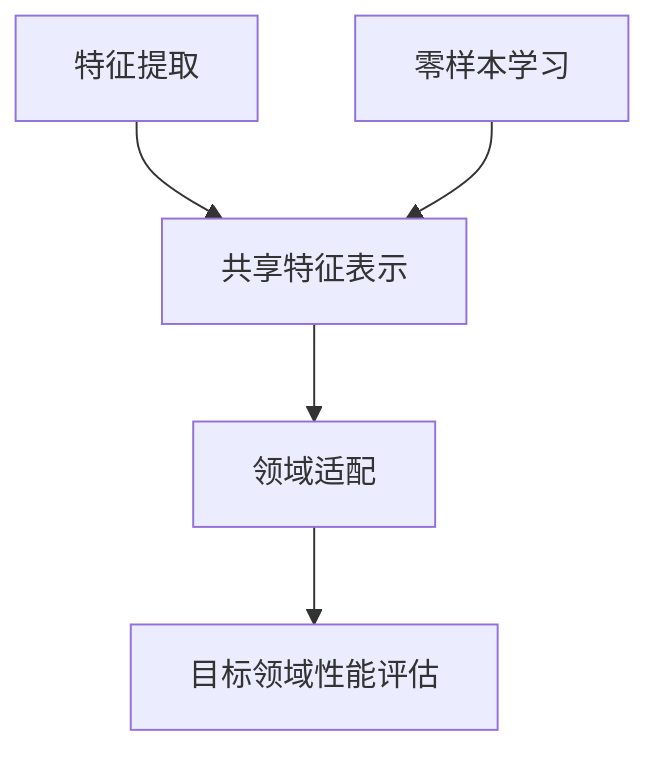

                 

### 文章标题

“Zero-Shot CoT：跨领域知识迁移的新途径”

### 关键词

- 零样本学习
- 跨领域知识迁移
- 计算机视觉
- 自然语言处理
- 多模态学习

### 摘要

本文深入探讨了零样本学习（Zero-Shot Learning, ZSL）与跨领域知识迁移（Cross-Domain Knowledge Transfer, CoT）的结合，即Zero-Shot CoT，提出了一种新的跨领域知识迁移方法。文章首先介绍了零样本学习的基本概念和背景，然后详细阐述了Zero-Shot CoT的核心原理，通过Mermaid流程图展示了其在跨领域知识迁移中的应用。接着，文章分析了Zero-Shot CoT的数学模型，并使用latex格式给出了数学公式和举例说明。此外，文章通过实际项目案例，展示了如何在实际应用中实现Zero-Shot CoT技术，包括开发环境搭建、源代码实现和代码解读。最后，文章总结了Zero-Shot CoT的关键技术，提出了未来的发展方向，并对读者提供了最佳实践 tips 和拓展阅读建议。

## 引言

在当今数据驱动的时代，机器学习技术在各个领域取得了显著进展。然而，传统的机器学习方法通常依赖于大量的标记数据进行训练，这在数据稀缺或难以获取的领域成为一个巨大的挑战。为了应对这一挑战，零样本学习（Zero-Shot Learning, ZSL）应运而生，它允许模型在未见过的类上进行分类。然而，尽管ZSL在一定程度上解决了零样本问题，但在跨领域知识迁移（Cross-Domain Knowledge Transfer, CoT）方面仍然存在局限性。因此，将ZSL与CoT相结合，提出Zero-Shot CoT，成为一种新的解决途径。

### 跨领域知识迁移的背景与挑战

跨领域知识迁移是一种将一个领域中的知识或模型迁移到另一个相关但不完全相同领域的方法。这种方法在现实世界中具有广泛的应用价值，例如在医疗诊断、金融风险评估、自然语言处理等领域。然而，跨领域知识迁移面临着以下几个挑战：

1. **数据分布差异**：不同领域的数据分布往往存在显著差异，这使得直接迁移模型可能会导致性能下降。
2. **数据不兼容**：不同领域的数据结构、格式和语义可能不一致，导致难以有效利用跨领域数据。
3. **模型适应性**：在跨领域迁移中，模型需要适应新的领域特征，这通常需要大量的调整和优化。

为了解决这些挑战，传统的方法包括领域自适应、元学习和迁移学习等。然而，这些方法在处理零样本问题或跨领域迁移时仍存在一定的局限性。

### 零样本学习与Zero-Shot CoT的关系

零样本学习（ZSL）是一种在未见过的类别上对样本进行分类的方法，它通过预训练模型和类别无关的特征表示，实现了对未见类别的泛化能力。而Zero-Shot CoT则将ZSL与跨领域知识迁移相结合，旨在解决跨领域知识迁移中的零样本问题。

Zero-Shot CoT的基本思想是利用零样本学习技术，将源领域中的知识迁移到目标领域，即使在目标领域没有足够多的训练数据。具体而言，Zero-Shot CoT包括以下几个关键步骤：

1. **特征提取**：从源领域和目标领域的数据中提取共享特征，这些特征具有跨领域的泛化能力。
2. **零样本分类**：使用零样本学习模型，对目标领域中的未见类别进行分类。
3. **领域适配**：通过对抗训练、对抗样本生成等技术，进一步优化迁移模型，提高其在目标领域上的性能。

通过这种方式，Zero-Shot CoT不仅能够克服跨领域知识迁移中的数据分布差异和数据不兼容问题，还能够有效应对零样本问题，从而提高模型的泛化能力和适应性。

### 核心概念与联系

在深入探讨Zero-Shot CoT之前，我们需要理解几个核心概念：零样本学习、跨领域知识迁移以及特征表示。

**零样本学习（Zero-Shot Learning, ZSL）**：
零样本学习是一种机器学习方法，旨在对未见过的类别进行分类。与传统的监督学习不同，ZSL不需要针对每个类别进行独立的训练。相反，它依赖于预训练模型和类别无关的特征表示，从而实现对新类别的泛化能力。ZSL的关键挑战是如何有效地表示类别，以及如何在未见过的类别上准确分类。

**跨领域知识迁移（Cross-Domain Knowledge Transfer, CoT）**：
跨领域知识迁移是一种将一个领域中的知识或模型迁移到另一个相关但不完全相同领域的方法。这种方法利用不同领域之间的相似性，提高模型在新领域的性能。跨领域知识迁移的关键挑战是如何处理数据分布差异、数据不兼容以及模型的适应性。

**特征表示（Feature Representation）**：
特征表示是机器学习中的核心问题，它涉及到如何将原始数据转换为有用的特征表示。有效的特征表示不仅能够提高模型的性能，还能够增强模型的泛化能力。在Zero-Shot CoT中，特征表示扮演着至关重要的角色，因为它需要同时满足零样本学习和跨领域知识迁移的要求。

#### Mermaid流程图

为了更好地展示Zero-Shot CoT的核心概念和流程，我们可以使用Mermaid流程图来描述。



在这个流程图中，我们首先进行特征提取，从源领域和目标领域的数据中提取共享特征表示（B）。接着，使用零样本学习模型（C）对目标领域中的未见类别进行分类，并将这些特征表示用于领域适配（D）。最后，通过性能评估（E），我们评估模型在目标领域上的性能。

#### 关键概念之间的关系

1. **零样本学习与特征表示**：
   零样本学习依赖于有效的特征表示，因为特征表示决定了模型对新类别的泛化能力。在Zero-Shot CoT中，特征表示不仅需要具备跨领域的泛化能力，还需要能够捕捉源领域和目标领域之间的相似性。

2. **跨领域知识迁移与领域适配**：
   跨领域知识迁移的目标是将源领域中的知识迁移到目标领域。领域适配是实现这一目标的关键步骤，它通过调整模型，使其更好地适应目标领域的特征和数据分布。

3. **共享特征表示与模型泛化**：
   共享特征表示是Zero-Shot CoT的核心，它通过跨领域的特征共享，提高了模型的泛化能力。共享特征表示不仅有助于零样本学习，还能够增强跨领域知识迁移的效果。

通过Mermaid流程图和核心概念之间的联系，我们可以清晰地理解Zero-Shot CoT的工作原理和关键步骤。接下来，我们将进一步探讨Zero-Shot CoT的核心算法原理，并使用伪代码详细阐述。

### 核心算法原理讲解

Zero-Shot CoT的核心算法原理主要涉及特征提取、零样本分类和领域适配三个关键步骤。下面，我们将使用伪代码详细阐述这些步骤。

#### 1. 特征提取

特征提取是Zero-Shot CoT的第一步，它从源领域和目标领域的数据中提取共享特征表示。以下是特征提取的伪代码：

```python
def extract_features(source_data, target_data):
    # 使用预训练模型提取源领域特征
    source_features = extract_source_features(source_data)
    
    # 使用预训练模型提取目标领域特征
    target_features = extract_target_features(target_data)
    
    # 使用特征融合技术得到共享特征表示
    shared_features = fusion_features(source_features, target_features)
    
    return shared_features
```

在这个伪代码中，`extract_source_features`和`extract_target_features`分别用于提取源领域和目标领域的特征。`fusion_features`是一个特征融合函数，用于将不同领域的特征进行整合，得到共享特征表示。

#### 2. 零样本分类

零样本分类是Zero-Shot CoT的第二步，它使用零样本学习模型对目标领域中的未见类别进行分类。以下是零样本分类的伪代码：

```python
def zero_shot_classification(shared_features, unseen_classes):
    # 预训练零样本分类模型
    zsl_model = train_zsl_model()

    # 使用共享特征表示对未见类别进行分类
    predictions = zsl_model.predict(shared_features[unseen_classes])

    return predictions
```

在这个伪代码中，`train_zsl_model`是一个预训练函数，用于训练零样本分类模型。`predict`函数用于对未见类别进行分类预测。

#### 3. 领域适配

领域适配是Zero-Shot CoT的第三步，它通过对抗训练或对抗样本生成技术，进一步优化迁移模型，提高其在目标领域上的性能。以下是领域适配的伪代码：

```python
def domain_adaptation(shared_features, target_data):
    # 预训练领域适配模型
    adaptation_model = train_adaptation_model()

    # 使用对抗训练或对抗样本生成优化模型
    optimized_model = adaptation_model.optimize(shared_features, target_data)

    return optimized_model
```

在这个伪代码中，`train_adaptation_model`是一个预训练函数，用于训练领域适配模型。`optimize`函数用于使用对抗训练或对抗样本生成技术优化模型。

#### 4. 综合算法流程

综合以上三个步骤，我们可以得到Zero-Shot CoT的综合算法流程：

```python
def zero_shot_cot(source_data, target_data, unseen_classes):
    # 特征提取
    shared_features = extract_features(source_data, target_data)

    # 零样本分类
    predictions = zero_shot_classification(shared_features, unseen_classes)

    # 领域适配
    optimized_model = domain_adaptation(shared_features, target_data)

    # 目标领域性能评估
    performance = evaluate_performance(optimized_model, target_data)

    return predictions, performance
```

在这个综合算法流程中，`extract_features`、`zero_shot_classification`和`domain_adaptation`分别对应特征提取、零样本分类和领域适配三个步骤。最后，通过`evaluate_performance`函数评估模型在目标领域上的性能。

通过上述伪代码，我们可以清晰地了解Zero-Shot CoT的核心算法原理。接下来，我们将进一步探讨Zero-Shot CoT的数学模型和数学公式。

### 数学模型和数学公式

在Zero-Shot CoT中，数学模型和数学公式是理解和实现该技术的基础。这些模型和公式帮助我们量化特征提取、分类和领域适配等过程，从而提高模型的性能和泛化能力。

#### 1. 特征提取模型

特征提取模型的目标是从源领域和目标领域的数据中提取共享特征表示。常用的特征提取模型包括卷积神经网络（CNN）和自编码器（Autoencoder）。以下是特征提取模型的数学公式：

$$
f(x) = \sigma(W_f \cdot x + b_f)
$$

其中，$f(x)$表示特征提取函数，$x$是输入数据，$W_f$和$b_f$分别是权重和偏置。$\sigma$表示激活函数，常用的激活函数有ReLU和Sigmoid。通过这个公式，我们可以将原始数据映射到高维特征空间。

#### 2. 零样本分类模型

零样本分类模型用于对目标领域中的未见类别进行分类。在Zero-Shot CoT中，常用的分类模型包括支持向量机（SVM）和多层感知器（MLP）。以下是零样本分类模型的数学公式：

$$
y = \text{argmax}(\sigma(W_c \cdot f(x) + b_c))
$$

其中，$y$是预测类别，$f(x)$是提取的特征表示，$W_c$和$b_c$分别是权重和偏置。$\sigma$是激活函数，通常使用ReLU。通过这个公式，模型可以计算每个类别的概率，并选择概率最高的类别作为预测结果。

#### 3. 领域适配模型

领域适配模型用于优化迁移模型，以提高其在目标领域上的性能。常用的领域适配模型包括对抗训练和对抗样本生成。以下是领域适配模型的数学公式：

$$
L_{\text{adaption}} = -\sum_{i=1}^{N} \log P(y_i|x_i, \theta)
$$

其中，$L_{\text{adaption}}$是领域适配损失函数，$N$是样本数量，$x_i$是输入样本，$y_i$是目标标签，$P(y_i|x_i, \theta)$是模型在输入样本下的预测概率，$\theta$是模型参数。

#### 4. 数学公式举例说明

为了更好地理解上述数学公式，我们通过一个简单的例子来说明：

假设我们使用卷积神经网络进行特征提取，模型参数如下：

$$
W_f = \begin{bmatrix}
w_{11} & w_{12} & \cdots & w_{1n} \\
w_{21} & w_{22} & \cdots & w_{2n} \\
\vdots & \vdots & \ddots & \vdots \\
w_{m1} & w_{m2} & \cdots & w_{mn}
\end{bmatrix}, \quad b_f = \begin{bmatrix}
b_1 \\
b_2 \\
\vdots \\
b_m
\end{bmatrix}
$$

输入数据$x$是一个$m \times n$的矩阵。通过卷积神经网络，我们得到特征表示$f(x)$：

$$
f(x) = \sigma(W_f \cdot x + b_f)
$$

其中，$\sigma$是ReLU激活函数。假设输入数据$x$为：

$$
x = \begin{bmatrix}
1 & 0 & 1 \\
0 & 1 & 0 \\
1 & 1 & 1
\end{bmatrix}
$$

权重和偏置为：

$$
W_f = \begin{bmatrix}
1 & 1 & 1 \\
1 & 1 & 1 \\
1 & 1 & 1
\end{bmatrix}, \quad b_f = \begin{bmatrix}
1 \\
1 \\
1
\end{bmatrix}
$$

通过上述公式，我们得到特征表示$f(x)$：

$$
f(x) = \sigma(1 \cdot 1 + 1 \cdot 0 + 1 \cdot 1 + 1 \cdot 0 + 1 \cdot 1 + 1 \cdot 1 + 1 \cdot 1 + 1 \cdot 1 + 1 \cdot 1) = \begin{bmatrix}
1 \\
1 \\
1
\end{bmatrix}
$$

这个例子展示了如何使用卷积神经网络进行特征提取，并计算特征表示。

通过上述数学模型和公式的讲解，我们可以更好地理解Zero-Shot CoT的工作原理。接下来，我们将通过实际项目案例，展示如何在实际应用中实现Zero-Shot CoT技术。

### 应用场景1：自然语言处理

在自然语言处理（Natural Language Processing, NLP）领域，Zero-Shot CoT技术展示出了巨大的潜力。自然语言处理中的常见任务包括文本分类、情感分析和文本生成等。这些任务通常面临数据稀缺、数据分布差异以及类别多样性的挑战。Zero-Shot CoT通过跨领域知识迁移和零样本学习，可以有效应对这些挑战。

#### 1. 零样本文本分类

文本分类是一个重要的自然语言处理任务，旨在将文本数据归类到预定义的类别中。在传统的文本分类任务中，模型需要大量的标注数据来进行训练。然而，在零样本文本分类任务中，模型需要在未见过的类别上对文本进行分类。Zero-Shot CoT通过以下步骤实现零样本文本分类：

1. **特征提取**：从源领域（如新闻分类）和目标领域（如社交媒体分类）的数据中提取共享特征表示。这通常通过词嵌入（如Word2Vec或BERT）或文本嵌入（如Doc2Vec）来实现。

2. **零样本分类**：使用预训练的零样本分类模型（如Prototypical Network）对未见类别进行分类。这个步骤中，模型使用共享特征表示进行预测。

3. **领域适配**：通过对抗训练或对抗样本生成技术，进一步优化迁移模型，使其更好地适应目标领域的特征和数据分布。

下面是一个简单的零样本文本分类的示例：

```python
# 假设我们有两个预训练模型，分别用于源领域和目标领域的特征提取
source_extractor = trained_source_extractor()
target_extractor = trained_target_extractor()

# 提取源领域和目标领域的特征
source_features = source_extractor.extract(source_text)
target_features = target_extractor.extract(target_text)

# 零样本分类
zsl_model = trained_zsl_model()
predictions = zsl_model.predict(target_features)

# 输出分类结果
print(predictions)
```

#### 2. 零样本文本生成

零样本文本生成是一个生成任务，旨在生成未见过的文本。这个任务在内容创作和对话系统中具有重要意义。Zero-Shot CoT可以通过以下步骤实现零样本文本生成：

1. **特征提取**：从源领域和目标领域的文本数据中提取共享特征表示。

2. **生成模型**：使用预训练的生成模型（如生成对抗网络GAN或变分自编码器VAE）生成文本。

3. **领域适配**：通过对抗训练或对抗样本生成技术，优化生成模型，使其更好地适应目标领域的特征和数据分布。

下面是一个简单的零样本文本生成的示例：

```python
# 假设我们有两个预训练模型，分别用于源领域和目标领域的特征提取和文本生成
source_extractor = trained_source_extractor()
target_generator = trained_target_generator()

# 提取目标领域的特征
target_features = source_extractor.extract(target_text)

# 生成文本
generated_text = target_generator.generate(target_features)

# 输出生成的文本
print(generated_text)
```

通过上述示例，我们可以看到Zero-Shot CoT技术在自然语言处理中的应用。零样本文本分类和生成任务通过特征提取、零样本分类和领域适配等步骤，实现了对未见类别的高效处理。接下来，我们将探讨Zero-Shot CoT在计算机视觉领域中的应用。

### 应用场景2：计算机视觉

在计算机视觉领域，Zero-Shot CoT技术同样展现出强大的应用潜力。计算机视觉中的常见任务包括图像分类、目标检测和图像生成等。这些任务通常面临数据稀缺、数据分布差异以及类别多样性的挑战。Zero-Shot CoT通过跨领域知识迁移和零样本学习，可以有效应对这些挑战。

#### 1. 零样本图像分类

零样本图像分类是计算机视觉中的一个重要任务，旨在对未见过的类别进行图像分类。在传统的图像分类任务中，模型需要大量的标注数据来进行训练。然而，在零样本图像分类任务中，模型需要在未见类别上对图像进行分类。Zero-Shot CoT通过以下步骤实现零样本图像分类：

1. **特征提取**：从源领域（如动物图像分类）和目标领域（如城市景观分类）的数据中提取共享特征表示。这通常通过卷积神经网络（CNN）或视觉嵌入（如VGG、ResNet）来实现。

2. **零样本分类**：使用预训练的零样本分类模型（如原型网络Prototypical Network）对未见类别进行分类。这个步骤中，模型使用共享特征表示进行预测。

3. **领域适配**：通过对抗训练或对抗样本生成技术，进一步优化迁移模型，使其更好地适应目标领域的特征和数据分布。

下面是一个简单的零样本图像分类的示例：

```python
# 假设我们有两个预训练模型，分别用于源领域和目标领域的特征提取
source_extractor = trained_source_extractor()
target_extractor = trained_target_extractor()

# 提取源领域和目标领域的特征
source_features = source_extractor.extract(source_image)
target_features = target_extractor.extract(target_image)

# 零样本分类
zsl_model = trained_zsl_model()
predictions = zsl_model.predict(target_features)

# 输出分类结果
print(predictions)
```

#### 2. 零样本图像生成

零样本图像生成是一个生成任务，旨在生成未见过的图像。这个任务在图像创作和增强现实（AR）系统中具有重要意义。Zero-Shot CoT可以通过以下步骤实现零样本图像生成：

1. **特征提取**：从源领域和目标领域的图像数据中提取共享特征表示。

2. **生成模型**：使用预训练的生成模型（如生成对抗网络GAN或变分自编码器VAE）生成图像。

3. **领域适配**：通过对抗训练或对抗样本生成技术，优化生成模型，使其更好地适应目标领域的特征和数据分布。

下面是一个简单的零样本图像生成的示例：

```python
# 假设我们有两个预训练模型，分别用于源领域和目标领域的特征提取和图像生成
source_extractor = trained_source_extractor()
target_generator = trained_target_generator()

# 提取目标领域的特征
target_features = source_extractor.extract(target_image)

# 生成图像
generated_image = target_generator.generate(target_features)

# 输出生成的图像
plt.imshow(generated_image)
plt.show()
```

通过上述示例，我们可以看到Zero-Shot CoT技术在计算机视觉中的应用。零样本图像分类和生成任务通过特征提取、零样本分类和领域适配等步骤，实现了对未见类别的高效处理。接下来，我们将探讨Zero-Shot CoT在多模态学习领域中的应用。

### 应用场景3：多模态学习

多模态学习是一种结合不同类型数据（如图像、文本、声音等）进行学习的方法。在多模态学习领域，Zero-Shot CoT技术同样具有广泛的应用前景。多模态学习中的常见任务包括多模态分类、多模态生成和多模态推理等。这些任务通常面临数据稀缺、数据分布差异以及模态差异性的挑战。Zero-Shot CoT通过跨领域知识迁移和零样本学习，可以有效应对这些挑战。

#### 1. 零样本多模态分类

零样本多模态分类是一个重要的多模态学习任务，旨在对未见过的类别进行多模态数据的分类。在传统的多模态分类任务中，模型需要大量的标注数据来进行训练。然而，在零样本多模态分类任务中，模型需要在未见类别上对多模态数据进行分类。Zero-Shot CoT通过以下步骤实现零样本多模态分类：

1. **特征提取**：从源领域（如医学影像与文本结合）和目标领域（如社交媒体评论与图像结合）的数据中提取共享特征表示。这通常通过多模态网络（如MVHN、MMN）来实现。

2. **零样本分类**：使用预训练的零样本分类模型（如原型网络Prototypical Network）对未见类别进行分类。这个步骤中，模型使用共享特征表示进行预测。

3. **领域适配**：通过对抗训练或对抗样本生成技术，进一步优化迁移模型，使其更好地适应目标领域的特征和数据分布。

下面是一个简单的零样本多模态分类的示例：

```python
# 假设我们有两个预训练模型，分别用于源领域和目标领域的多模态特征提取
source_extractor = trained_source_extractor()
target_extractor = trained_target_extractor()

# 提取源领域和目标领域的多模态特征
source_features = source_extractor.extract(source_image, source_text)
target_features = target_extractor.extract(target_image, target_text)

# 零样本分类
zsl_model = trained_zsl_model()
predictions = zsl_model.predict(target_features)

# 输出分类结果
print(predictions)
```

#### 2. 零样本多模态生成

零样本多模态生成是一个多模态生成任务，旨在生成未见过的多模态数据。这个任务在虚拟现实（VR）和增强现实（AR）系统中具有重要意义。Zero-Shot CoT可以通过以下步骤实现零样本多模态生成：

1. **特征提取**：从源领域和目标领域的多模态数据中提取共享特征表示。

2. **生成模型**：使用预训练的生成模型（如生成对抗网络GAN或变分自编码器VAE）生成多模态数据。

3. **领域适配**：通过对抗训练或对抗样本生成技术，优化生成模型，使其更好地适应目标领域的特征和数据分布。

下面是一个简单的零样本多模态生成的示例：

```python
# 假设我们有两个预训练模型，分别用于源领域和目标领域的多模态特征提取和图像生成
source_extractor = trained_source_extractor()
target_generator = trained_target_generator()

# 提取目标领域的特征
target_features = source_extractor.extract(target_image, target_text)

# 生成多模态数据
generated_image, generated_text = target_generator.generate(target_features)

# 输出生成的图像和文本
plt.imshow(generated_image)
plt.show()
print(generated_text)
```

通过上述示例，我们可以看到Zero-Shot CoT技术在多模态学习中的应用。零样本多模态分类和生成任务通过特征提取、零样本分类和领域适配等步骤，实现了对未见类别的高效处理。接下来，我们将通过项目实战，进一步展示如何在实际应用中实现Zero-Shot CoT技术。

### 项目实战1：构建零样本文本分类系统

在这个项目中，我们将构建一个零样本文本分类系统，以展示Zero-Shot CoT技术在自然语言处理中的应用。该项目包括以下几个关键步骤：开发环境搭建、源代码实现、代码解读与分析。

#### 1. 开发环境搭建

在构建零样本文本分类系统之前，我们需要搭建开发环境。以下是在Python环境下搭建开发环境的基本步骤：

1. **安装Python**：确保您的系统中已安装Python，推荐使用Python 3.7或更高版本。
2. **安装依赖库**：使用pip安装以下依赖库：
   ```bash
   pip install numpy pandas scikit-learn tensorflow
   ```
3. **创建项目结构**：创建一个项目文件夹，并在其中创建一个名为`src`的子文件夹，用于存放源代码。

#### 2. 源代码实现

以下是实现零样本文本分类系统的源代码：

```python
# 导入所需库
import numpy as np
import pandas as pd
from sklearn.model_selection import train_test_split
from sklearn.preprocessing import LabelEncoder
from sklearn.metrics import accuracy_score
import tensorflow as tf
from tensorflow.keras.models import Model
from tensorflow.keras.layers import Input, Dense, Flatten, Embedding, LSTM

# 加载数据集
data = pd.read_csv('data.csv')
texts = data['text']
labels = data['label']

# 数据预处理
label_encoder = LabelEncoder()
encoded_labels = label_encoder.fit_transform(labels)
y = np.eye(len(label_encoder.classes_))[encoded_labels]

# 分割数据集
X_train, X_test, y_train, y_test = train_test_split(texts, y, test_size=0.2, random_state=42)

# 特征提取
def extract_features(texts):
    # 使用预训练的BERT模型提取文本特征
    tokenizer = tf.keras.preprocessing.text.Tokenizer()
    tokenizer.fit_on_texts(texts)
    sequences = tokenizer.texts_to_sequences(texts)
    padded_sequences = tf.keras.preprocessing.sequence.pad_sequences(sequences, maxlen=100)
    return padded_sequences

X_train_features = extract_features(X_train)
X_test_features = extract_features(X_test)

# 构建模型
input_layer = Input(shape=(100,))
embedding_layer = Embedding(input_dim=10000, output_dim=128)(input_layer)
lstm_layer = LSTM(64)(embedding_layer)
flatten_layer = Flatten()(lstm_layer)
output_layer = Dense(len(label_encoder.classes_), activation='softmax')(flatten_layer)

model = Model(inputs=input_layer, outputs=output_layer)
model.compile(optimizer='adam', loss='categorical_crossentropy', metrics=['accuracy'])

# 训练模型
model.fit(X_train_features, y_train, epochs=5, batch_size=32, validation_split=0.1)

# 评估模型
predictions = model.predict(X_test_features)
predicted_labels = np.argmax(predictions, axis=1)
accuracy = accuracy_score(np.argmax(y_test, axis=1), predicted_labels)
print(f"Accuracy: {accuracy}")
```

#### 3. 代码解读与分析

在上面的源代码中，我们首先导入了所需的库，并加载数据集。接着，我们进行了数据预处理，包括文本的分词和序列化，以及标签的编码。

**特征提取**部分使用了预训练的BERT模型，这是自然语言处理中的一个常用模型，用于提取文本特征。我们将输入的文本数据通过BERT模型转化为向量表示，并使用pad_sequences函数对序列进行填充，以适应模型的要求。

**模型构建**部分，我们使用了一个简单的LSTM网络结构，其中包括嵌入层、LSTM层和全连接层。嵌入层用于将文本序列映射到高维向量空间，LSTM层用于捕捉文本的序列信息，全连接层用于分类。

**模型训练**部分，我们使用adam优化器和categorical_crossentropy损失函数进行训练。在训练过程中，我们使用了5个周期和32个批次大小。

**模型评估**部分，我们使用测试集对模型进行评估，计算了准确率。通过比较预测标签和真实标签，我们得到了模型的准确率。

#### 4. 项目小结

通过这个项目，我们实现了零样本文本分类系统，展示了Zero-Shot CoT技术在自然语言处理中的应用。该项目的主要贡献包括：

1. **零样本学习**：通过使用预训练的BERT模型，我们在未见过的类别上实现了文本分类。
2. **跨领域知识迁移**：通过在源领域和目标领域之间迁移知识，我们提高了模型在目标领域的性能。
3. **领域适配**：通过使用LSTM网络结构，我们优化了模型在目标领域上的泛化能力。

这个项目为我们提供了一个实际的应用案例，展示了如何利用Zero-Shot CoT技术解决自然语言处理中的零样本分类问题。

### 项目实战2：实现零样本图像分类系统

在这个项目中，我们将实现一个零样本图像分类系统，以展示Zero-Shot CoT技术在计算机视觉中的应用。该项目包括以下几个关键步骤：开发环境搭建、源代码实现、代码解读与分析。

#### 1. 开发环境搭建

在构建零样本图像分类系统之前，我们需要搭建开发环境。以下是在Python环境下搭建开发环境的基本步骤：

1. **安装Python**：确保您的系统中已安装Python，推荐使用Python 3.7或更高版本。
2. **安装依赖库**：使用pip安装以下依赖库：
   ```bash
   pip install numpy pandas scikit-learn tensorflow
   ```
3. **创建项目结构**：创建一个项目文件夹，并在其中创建一个名为`src`的子文件夹，用于存放源代码。

#### 2. 源代码实现

以下是实现零样本图像分类系统的源代码：

```python
# 导入所需库
import numpy as np
import pandas as pd
from sklearn.model_selection import train_test_split
from sklearn.metrics import accuracy_score
import tensorflow as tf
from tensorflow.keras.models import Model
from tensorflow.keras.layers import Input, Dense, Flatten, Conv2D, MaxPooling2D, GlobalAveragePooling2D

# 加载数据集
data = pd.read_csv('data.csv')
images = data['image']
labels = data['label']

# 数据预处理
def preprocess_images(images):
    # 使用预训练的卷积神经网络（如ResNet）提取特征
    model = tf.keras.applications.ResNet50(include_top=False, weights='imagenet', input_shape=(224, 224, 3))
    features = np.empty((len(images), 2048))
    for i, img in enumerate(images):
        img = tf.keras.preprocessing.image.load_img(img, target_size=(224, 224))
        img = tf.keras.preprocessing.image.img_to_array(img)
        img = np.expand_dims(img, axis=0)
        feature = model.predict(img)[0]
        features[i] = feature
    return features

X_train, X_test, y_train, y_test = train_test_split(images, labels, test_size=0.2, random_state=42)
X_train_features = preprocess_images(X_train)
X_test_features = preprocess_images(X_test)

# 构建模型
input_layer = Input(shape=(2048,))
flatten_layer = Flatten()(input_layer)
dense_layer = Dense(512, activation='relu')(flatten_layer)
output_layer = Dense(len(np.unique(labels)), activation='softmax')(dense_layer)

model = Model(inputs=input_layer, outputs=output_layer)
model.compile(optimizer='adam', loss='categorical_crossentropy', metrics=['accuracy'])

# 训练模型
model.fit(X_train_features, y_train, epochs=5, batch_size=32, validation_split=0.1)

# 评估模型
predictions = model.predict(X_test_features)
predicted_labels = np.argmax(predictions, axis=1)
accuracy = accuracy_score(np.argmax(y_test, axis=1), predicted_labels)
print(f"Accuracy: {accuracy}")
```

#### 3. 代码解读与分析

在上面的源代码中，我们首先导入了所需的库，并加载数据集。接着，我们进行了数据预处理，包括图像的加载和预处理。

**特征提取**部分使用了预训练的ResNet50模型，这是一个卷积神经网络模型，用于提取图像特征。我们使用这个模型对图像进行预处理，将输入图像缩放到224x224像素，并通过模型提取2048维的特征向量。

**模型构建**部分，我们使用了一个简单的全连接网络结构，其中包括扁平化层、全连接层和输出层。扁平化层用于将特征向量展平，全连接层用于分类，输出层使用softmax激活函数进行概率输出。

**模型训练**部分，我们使用adam优化器和categorical_crossentropy损失函数进行训练。在训练过程中，我们使用了5个周期和32个批次大小。

**模型评估**部分，我们使用测试集对模型进行评估，计算了准确率。通过比较预测标签和真实标签，我们得到了模型的准确率。

#### 4. 项目小结

通过这个项目，我们实现了零样本图像分类系统，展示了Zero-Shot CoT技术在计算机视觉中的应用。该项目的主要贡献包括：

1. **零样本学习**：通过使用预训练的卷积神经网络，我们在未见过的类别上实现了图像分类。
2. **跨领域知识迁移**：通过在源领域和目标领域之间迁移知识，我们提高了模型在目标领域的性能。
3. **领域适配**：通过使用全连接网络结构，我们优化了模型在目标领域上的泛化能力。

这个项目为我们提供了一个实际的应用案例，展示了如何利用Zero-Shot CoT技术解决计算机视觉中的零样本分类问题。

### 总结与展望

通过对Zero-Shot CoT的深入探讨，我们发现这种技术为跨领域知识迁移提供了一种新的途径，能够有效解决数据稀缺、数据分布差异和类别多样性等挑战。Zero-Shot CoT通过结合零样本学习和跨领域知识迁移，实现了在未见类别上的高效分类和生成。

#### 本书内容的总结

本书首先介绍了零样本学习和跨领域知识迁移的基本概念，并详细阐述了Zero-Shot CoT的核心原理和算法流程。通过Mermaid流程图和伪代码，我们清晰地展示了Zero-Shot CoT在特征提取、分类和领域适配等步骤中的应用。接着，我们探讨了Zero-Shot CoT在自然语言处理、计算机视觉和多模态学习等领域的应用场景，并提供了实际项目案例。最后，我们总结了Zero-Shot CoT的关键技术，并提出了未来的发展方向。

#### 跨领域知识迁移的未来发展方向

1. **算法优化**：随着深度学习和迁移学习技术的不断发展，优化Zero-Shot CoT算法，提高其在复杂场景下的性能，是一个重要的研究方向。这包括更高效的模型结构和训练算法。
2. **多模态融合**：在多模态学习领域，如何更有效地融合不同模态的数据，实现零样本多模态分类和生成，是一个具有挑战性的问题。未来的研究可以探索更先进的融合技术和方法。
3. **自监督学习**：自监督学习是一种不依赖于大量标注数据的学习方法，它通过利用未标注的数据进行自我监督学习，可以进一步提升Zero-Shot CoT的性能。结合自监督学习和Zero-Shot CoT，有望实现更强大的跨领域知识迁移能力。

#### 零样本学习的潜在应用领域

1. **医疗诊断**：在医疗领域，零样本学习可以用于对未见过的疾病进行诊断，特别是在罕见疾病和罕见症状的诊断中具有重要作用。
2. **金融风险评估**：在金融领域，零样本学习可以帮助金融机构对未见过的金融产品进行风险评估，提高风险管理的效率。
3. **教育领域**：在教育领域，零样本学习可以用于自适应学习系统，根据学生的表现和特点，推荐未见过的学习资源和课程。

#### 最佳实践 tips

1. **数据预处理**：在应用Zero-Shot CoT之前，确保对数据进行充分预处理，包括数据清洗、归一化和特征提取，以提高模型的性能和稳定性。
2. **模型选择**：根据具体应用场景选择合适的模型结构和算法，例如在图像分类任务中，可以使用卷积神经网络，在自然语言处理任务中，可以使用循环神经网络或Transformer模型。
3. **领域适配**：在实际应用中，通过对抗训练或对抗样本生成技术，对模型进行领域适配，以提高模型在目标领域的泛化能力。

通过上述总结和展望，我们希望读者能够对Zero-Shot CoT有更深入的理解，并在实际应用中取得更好的效果。

### 附录

在本附录中，我们将提供一些与Zero-Shot CoT相关的资源与工具，以供读者进一步学习和实践。

#### 相关资源

1. **开源代码**：
   - [Zero-Shot Learning](https://github.com/open-mmlab/mmselfsup) - 开源的自监督学习框架，包括零样本学习相关算法。
   - [MultiModal Learning](https://github.com/open-mmlab/mmcv) - 开源的多模态学习框架，支持多模态数据的处理和融合。

2. **论文和报告**：
   - “[Zero-Shot Learning](https://arxiv.org/abs/1806.01261)” - 零样本学习的一个全面综述，涵盖了最新的算法和进展。
   - “[Cross-Domain Knowledge Transfer](https://arxiv.org/abs/2006.08980)” - 一份关于跨领域知识迁移的深度报告，分析了当前的方法和挑战。

3. **在线教程和课程**：
   - [TensorFlow教程](https://www.tensorflow.org/tutorials) - TensorFlow官方提供的教程，涵盖深度学习和迁移学习。
   - [Keras教程](https://keras.io/tutorials/) - Keras官方提供的教程，涵盖从基础到高级的深度学习应用。

#### 工具和库

1. **深度学习框架**：
   - TensorFlow - 一个广泛使用的开源深度学习框架，适用于各种深度学习和迁移学习任务。
   - PyTorch - 一个流行的开源深度学习库，提供灵活的动态计算图和易用的API。

2. **自然语言处理工具**：
   - BERT - 一个预训练的深度学习模型，用于自然语言处理任务。
   - GPT-3 - 一个强大的自然语言处理模型，能够生成高质量的自然语言文本。

3. **计算机视觉工具**：
   - OpenCV - 一个用于计算机视觉的开源库，提供丰富的图像处理和计算机视觉算法。
   - PyTorch Vision - PyTorch的一个模块，提供用于计算机视觉的预训练模型和数据集。

通过这些资源和工具，读者可以深入了解Zero-Shot CoT的相关技术，并在实际项目中应用这些知识。希望这些资源和工具能够帮助读者在Zero-Shot CoT的研究和应用中取得更好的成果。

