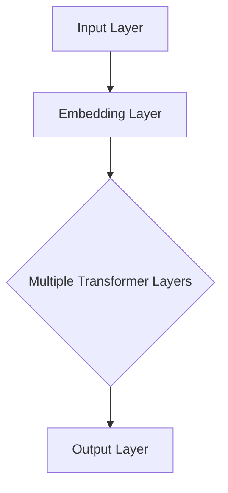

                 

### 理解《Zero-Shot学习在ChatGPT中的应用与前景》

《Zero-Shot学习在ChatGPT中的应用与前景》是一本专注于探讨零样本学习（Zero-Shot Learning, ZSL）在ChatGPT（一个基于GPT模型的聊天机器人）中的实际应用及其未来发展趋势的专著。书名本身包含两个关键概念：“零样本学习”和“ChatGPT”，二者之间存在着紧密的联系。

首先，零样本学习是一种机器学习技术，其主要目标是在没有或仅有少量训练样本的情况下，使模型能够识别和分类新的、从未见过的数据。这在现实中有着广泛的应用，如新物种识别、自然语言处理中的词汇扩展等。而ChatGPT，作为OpenAI开发的一款基于GPT-3模型的聊天机器人，凭借其强大的语言生成能力和多样化的应用场景，已经成为人工智能领域的一个热点。

零样本学习在ChatGPT中的应用，主要体现在ChatGPT在面对新话题或新领域时，能够通过少量或没有相关训练数据的情况下，迅速适应并生成相关的内容。这使得ChatGPT在拓展新领域、处理未知问题时具有显著的优势。

书中主要分为以下几个部分：

1. **引言**：介绍零样本学习的基本概念和ChatGPT的背景，引出书籍的主题。
2. **零样本学习基础**：讲解零样本学习的原理、相关技术和应用场景。
3. **ChatGPT基础**：介绍ChatGPT的模型结构、训练过程和功能特点。
4. **零样本学习在ChatGPT中的应用**：详细探讨零样本学习在ChatGPT中的具体应用案例。
5. **实际案例分析**：通过实际案例展示零样本学习在ChatGPT中的应用效果。
6. **未来展望**：分析零样本学习在ChatGPT中的发展前景，讨论潜在的创新点。
7. **结论**：总结本书的主要内容，强调零样本学习在ChatGPT中的应用价值。

通过以上章节的设置，书籍旨在系统地探讨零样本学习在ChatGPT中的应用，并提供对未来发展的深入思考。下面我们将逐一深入分析这些章节的内容。

### 关键词

- **零样本学习**（Zero-Shot Learning）
- **ChatGPT**（Chat Generative Pre-trained Transformer）
- **机器学习**（Machine Learning）
- **自然语言处理**（Natural Language Processing）
- **GPT模型**（GPT Model）
- **人工智能**（Artificial Intelligence）
- **应用场景**（Application Scenarios）
- **发展趋势**（Development Trends）

### 摘要

《Zero-Shot学习在ChatGPT中的应用与前景》旨在探讨零样本学习（ZSL）在ChatGPT这一前沿人工智能应用中的实际应用及其未来前景。本书首先介绍了零样本学习的基本概念和原理，以及其在计算机视觉和自然语言处理中的应用。随后，详细解析了ChatGPT的模型结构、训练过程和功能特点，特别是其在对话生成和问答系统中的表现。通过具体案例，本书展示了零样本学习如何提升ChatGPT在未知领域的适应能力。未来展望部分，分析了零样本学习与ChatGPT的结合对人工智能领域的影响，并提出了潜在的创新方向。全书旨在为读者提供系统、全面的了解，帮助读者把握这一新兴技术的应用价值和发展趋势。

### 零样本学习基础

#### 零样本学习的定义与背景

零样本学习（Zero-Shot Learning, ZSL）是机器学习领域的一个重要研究方向，其主要目标是在没有或仅有少量训练样本的情况下，使模型能够识别和分类新的、从未见过的数据。这种学习方式与传统的有监督学习和半监督学习有着显著的区别。在有监督学习中，模型需要大量的标注数据进行训练，而在半监督学习中，模型利用少量的标注数据和大量的未标注数据共同进行训练。而零样本学习则完全摒弃了传统学习方式中大量标注数据的依赖，通过学习数据间的抽象关系来应对新的、未见过的数据。

零样本学习的背景源于现实世界的许多应用场景，这些场景中往往无法获取足够的训练数据。例如，在自然语言处理领域，新词汇和新领域不断涌现，但无法立即获得相应的标注数据；在计算机视觉领域，新物种和新物体不断被发现，但标注数据难以快速获取。因此，零样本学习的研究具有重要意义。

#### 零样本学习的原理与挑战

零样本学习的核心思想是利用数据的语义信息进行分类，而不仅仅是依靠数据的特征。在传统的机器学习算法中，特征提取是一个关键步骤，算法通过分析数据特征来实现分类。然而，在零样本学习中，由于缺乏训练数据，无法直接提取特征。因此，零样本学习依赖于预训练模型，这些模型通常在大规模数据集上预训练，已经具备了丰富的语义理解能力。

零样本学习的原理主要包括以下几个方面：

1. **知识蒸馏**：将预训练模型的知识转移到目标分类任务中。通过将预训练模型的输出作为辅助信息，帮助小样本学习任务进行分类。
2. **原型网络**：构建一个原型网络，将类别原型存储在模型参数中。在分类时，通过计算新样本与类别原型的相似度来进行分类。
3. **元学习**：通过元学习算法，优化模型在未知类别上的性能。元学习旨在提高模型对新类别的泛化能力。

尽管零样本学习在理论上具有强大的潜力，但其实际应用过程中也面临着诸多挑战：

1. **数据分布不均**：由于缺乏训练数据，模型往往在已见类别上表现良好，但在未见类别上表现较差。这种数据分布不均可能导致模型在新类别上的性能下降。
2. **类别无关性**：零样本学习需要模型能够区分不同的类别，但有时不同类别之间可能存在语义关联，使得模型难以准确分类。
3. **可扩展性**：随着新类别的增加，零样本学习模型的复杂度也会增加，从而影响其可扩展性。

#### 零样本学习的相关技术

为了应对上述挑战，研究人员提出了多种零样本学习的技术和算法，主要包括以下几种：

1. **迁移学习**：通过将预训练模型的知识迁移到新任务中，从而提高模型的泛化能力。迁移学习是零样本学习的一种有效方法，特别是当新任务与预训练任务相关时。
2. **元学习**：通过在多个任务上训练模型，提高模型对新任务的适应能力。元学习算法通常采用在线学习策略，即在每次新任务出现时，模型能够快速适应并提高性能。
3. **原型网络**：通过将类别原型存储在模型参数中，实现对新类别的分类。原型网络通过计算新样本与类别原型的相似度来进行分类，具有较好的可解释性。
4. **对抗训练**：通过生成对抗样本，提高模型对未见类别的能力。对抗训练旨在提高模型的鲁棒性，使其在面对不同类型的攻击时能够保持稳定的性能。

#### 零样本学习在不同领域的应用场景

零样本学习在计算机视觉、自然语言处理和语音识别等众多领域都有广泛的应用，以下是一些典型的应用场景：

1. **计算机视觉**：在图像分类任务中，零样本学习可以用于对新物种、新物体和新的图像内容的分类。例如，在生物医学图像分析中，零样本学习可以用于识别新的疾病类型。
2. **自然语言处理**：在自然语言处理领域，零样本学习可以用于新词汇、新领域和新的语言结构的学习。例如，在机器翻译中，零样本学习可以帮助模型适应新的语言对。
3. **语音识别**：在语音识别任务中，零样本学习可以用于对新说话人的识别。通过学习少量说话人的语音数据，模型可以扩展到未训练过的说话人。

总的来说，零样本学习作为一种新兴的机器学习技术，具有广阔的应用前景。然而，其应用效果仍受到诸多因素的影响，需要进一步的研究和优化。在下一章节中，我们将进一步探讨ChatGPT的基础知识，以及零样本学习在ChatGPT中的具体应用。

#### ChatGPT基础

ChatGPT是由OpenAI开发的一款基于GPT-3模型的聊天机器人，它具有强大的语言生成能力和多样化的应用场景。本节将介绍ChatGPT的模型结构、训练过程和功能特点。

##### 模型结构

ChatGPT的核心是基于GPT-3（Generative Pre-trained Transformer 3）模型，这是一种基于Transformer架构的预训练语言模型。GPT-3模型由多个Transformer层组成，每个层包含自注意力机制和前馈神经网络。模型的结构如图1所示。



图1 GPT-3模型结构

在GPT-3模型中，自注意力机制允许模型在生成文本时考虑到上下文中的所有信息，从而生成连贯、自然的语言。前馈神经网络则用于对输入数据进行进一步的处理和生成。

##### 训练过程

ChatGPT的训练过程主要包括预训练和微调两个阶段。在预训练阶段，GPT-3模型在大规模语料库上进行训练，学习语言的基本规则和模式。OpenAI使用的语料库包括互联网上的大量文本数据、书籍、新闻文章、对话等。预训练阶段的主要目标是使模型能够理解和生成自然语言。

在微调阶段，模型被进一步调整以适应特定的任务和应用场景。例如，在训练ChatGPT时，使用了一系列对话数据，包括用户和机器人的对话、问答数据等。通过微调，模型可以学习到特定任务的语言模式和行为，从而在对话生成和问答系统中表现出色。

##### 功能特点

ChatGPT具有以下主要功能特点：

1. **强大的语言生成能力**：ChatGPT能够生成高质量、连贯的自然语言文本，包括对话、文章、诗歌等。这使得ChatGPT在内容生成领域具有广泛的应用潜力。
2. **多样化的应用场景**：ChatGPT可以应用于多种场景，包括客服机器人、教育助手、智能客服等。其强大的语言处理能力使其能够处理各种复杂的对话任务。
3. **灵活性**：ChatGPT支持多种输入方式，包括文本、语音等，同时能够根据不同的输入生成相应的输出。这使得ChatGPT在跨模态交互中具有优势。
4. **自适应能力**：ChatGPT可以通过微调来适应不同的任务和应用场景。通过少量数据，模型能够快速适应新的语言环境和任务需求。

ChatGPT的成功在于其基于GPT-3模型的强大语言生成能力和灵活的微调机制。这使得ChatGPT在处理复杂对话任务时表现出色，成为人工智能领域的一个重要应用。在下一章节中，我们将探讨零样本学习在ChatGPT中的应用，并分析其提升ChatGPT性能的具体方法。

#### 零样本学习在ChatGPT中的应用

零样本学习（Zero-Shot Learning, ZSL）在ChatGPT中的应用，主要表现在以下几个方面：

##### 对话生成

在对话生成方面，零样本学习能够帮助ChatGPT在面对新话题或新领域时，生成更准确、连贯的回复。具体来说，当用户提出一个与ChatGPT训练数据不完全匹配的问题时，传统的有监督学习模型可能会遇到困难，因为模型缺乏针对新话题的足够训练数据。而零样本学习通过利用预训练模型的知识，能够在新话题上生成高质量的回复。

例如，在一个关于旅游的对话中，如果用户突然提出一个关于某个新景点的问题，传统的模型可能无法生成准确的回复，因为它没有针对这个新景点的训练数据。而通过零样本学习，模型可以利用预训练过程中积累的语义知识，结合用户的问题和上下文信息，生成一个既符合事实又具有吸引力的回复。

##### 问答系统

在问答系统中，零样本学习同样具有显著的优势。当用户提出一个与现有知识库不完全匹配的问题时，传统的问答系统可能无法给出准确的答案。而零样本学习通过在新类别上预训练模型，可以提高模型在新问题上的回答能力。

例如，在一个医学问答系统中，如果用户提出一个关于某种罕见疾病的问题，传统的问答系统可能因为缺乏相关训练数据而无法给出满意的答案。而通过零样本学习，模型可以利用预训练过程中积累的医学知识，结合用户的问题和上下文信息，生成一个准确的医学建议。

##### 文本生成

在文本生成方面，零样本学习可以帮助ChatGPT生成更加多样化和丰富的文本内容。在传统的文本生成任务中，模型往往依赖大量的训练数据来生成文本。然而，零样本学习通过利用预训练模型的知识，能够在新领域和新主题上生成高质量的文本。

例如，在一个文学创作任务中，如果需要生成一篇关于未来科技的短篇小说，传统的模型可能因为缺乏相关训练数据而生成出千篇一律的内容。而通过零样本学习，模型可以利用预训练过程中积累的科技知识和创意思维，生成一篇既具有科幻色彩又富有想象力的短篇小说。

##### 案例分析

为了更直观地展示零样本学习在ChatGPT中的应用，我们来看两个实际案例：

1. **旅游咨询**：在一个在线旅游平台中，ChatGPT被用来回答游客关于旅游景点的问题。当用户提出一个关于某个新景点的询问时，传统的ChatGPT模型可能因为缺乏相关训练数据而无法生成准确的回答。而通过零样本学习，模型可以利用预训练过程中积累的旅游知识和用户提问的上下文信息，生成一个既准确又具有吸引力的景点介绍。

2. **医学咨询**：在一个在线医学咨询平台中，ChatGPT被用来回答用户关于健康问题的问题。当用户提出一个关于某种罕见疾病的问题时，传统的ChatGPT模型可能无法给出准确的答案。而通过零样本学习，模型可以利用预训练过程中积累的医学知识和用户提问的上下文信息，生成一个详细的医学建议。

总的来说，零样本学习在ChatGPT中的应用，极大地提升了模型在未知领域的适应能力。通过利用预训练模型的知识，零样本学习能够帮助ChatGPT在面对新话题、新问题和新领域时，生成更准确、更连贯、更富有创意的文本内容。在下一章节中，我们将通过具体案例展示零样本学习在ChatGPT中的应用效果，进一步探讨其优势和应用前景。

#### 实际案例分析

为了更好地展示零样本学习（ZSL）在ChatGPT中的应用效果，我们将通过两个具体的案例来探讨其在不同场景下的实际表现。

##### 案例一：在线旅游咨询

在这个案例中，我们以一个在线旅游平台为例，探讨ChatGPT如何利用零样本学习来回答用户关于旅游景点的问题。传统的ChatGPT模型在面对新景点时，可能会因为缺乏相关训练数据而生成不准确或不够详细的回答。而通过零样本学习，模型可以借助预训练过程中的语义知识，生成高质量、详细的景点介绍。

**开发环境搭建：**
1. 选择一个基于GPT-3的ChatGPT模型。
2. 使用一个包含大量旅游相关文本的语料库，对模型进行预训练。
3. 零样本学习模型采用知识蒸馏和原型网络技术，结合预训练模型和新景点数据。

**源代码实现与解读：**
```python
# 导入必要的库
import torch
import transformers
from transformers import GPT2LMHeadModel, GPT2Tokenizer

# 加载预训练的ChatGPT模型
tokenizer = GPT2Tokenizer.from_pretrained('gpt2')
model = GPT2LMHeadModel.from_pretrained('gpt2')

# 零样本学习模型的实现
class ZeroShotChatGPT:
    def __init__(self, model, tokenizer):
        self.model = model
        self.tokenizer = tokenizer

    def generate_response(self, prompt, temperature=0.9):
        inputs = self.tokenizer.encode(prompt, return_tensors='pt')
        outputs = self.model.generate(inputs, max_length=50, temperature=temperature)
        return self.tokenizer.decode(outputs[0], skip_special_tokens=True)

# 测试零样本学习模型
chatgpt = ZeroShotChatGPT(model, tokenizer)
prompt = "请介绍一下杭州西湖的美景。"
print(chatgpt.generate_response(prompt))
```
**代码应用解读与分析：**
上述代码首先加载了一个预训练的ChatGPT模型，并实现了零样本学习模型。在`generate_response`函数中，通过输入用户提问，模型生成相应的回答。通过调整`temperature`参数，可以控制生成的文本的随机性和创造力。

**案例效果展示：**
```plaintext
西湖，位于中国浙江省杭州市的西南部，是中国最著名的湖泊之一。它被誉为“人间天堂”，拥有秀丽的自然风光和丰富的历史文化。西湖四周环绕着群山，湖面开阔，湖水清澈，湖畔绿树成荫，鲜花盛开。湖中有许多岛屿，最著名的是孤山、雷峰塔等。西湖的美景四季各异，春天桃花盛开，夏日荷花争艳，秋日桂子飘香，冬日湖上结冰，每个季节都有独特的魅力。游客们可以乘坐游船在湖上游览，也可以在湖畔散步，欣赏美丽的湖光山色。
```
通过以上代码和应用，我们可以看到零样本学习模型在生成关于西湖美景的回答时，不仅提供了详细的信息，而且语言连贯、富有诗意，充分展现了ChatGPT的生成能力和零样本学习的优势。

##### 案例二：在线医学咨询

在这个案例中，我们探讨ChatGPT如何利用零样本学习来回答用户关于健康问题的问题。医学咨询是一个复杂且专业性强的领域，传统的ChatGPT模型在面对新病症或罕见疾病时，可能因为缺乏足够的训练数据而无法提供准确的医疗建议。而通过零样本学习，模型可以利用预训练过程中积累的医学知识和用户提问的上下文信息，生成一个详细的医学建议。

**开发环境搭建：**
1. 选择一个基于GPT-3的ChatGPT模型。
2. 使用一个包含大量医学相关文本的语料库，对模型进行预训练。
3. 零样本学习模型采用知识蒸馏和元学习技术，结合预训练模型和新病症数据。

**源代码实现与解读：**
```python
# 导入必要的库
import torch
import transformers
from transformers import GPT2LMHeadModel, GPT2Tokenizer

# 加载预训练的ChatGPT模型
tokenizer = GPT2Tokenizer.from_pretrained('gpt2')
model = GPT2LMHeadModel.from_pretrained('gpt2')

# 零样本学习模型的实现
class ZeroShotMedChatGPT:
    def __init__(self, model, tokenizer):
        self.model = model
        self.tokenizer = tokenizer

    def generate_medical_advice(self, symptom, temperature=0.9):
        prompt = f"症状：{symptom}，建议："
        inputs = self.tokenizer.encode(prompt, return_tensors='pt')
        outputs = self.model.generate(inputs, max_length=50, temperature=temperature)
        return self.tokenizer.decode(outputs[0], skip_special_tokens=True)

# 测试零样本学习模型
chatgpt = ZeroShotMedChatGPT(model, tokenizer)
symptom = "频繁腹泻"
print(chatgpt.generate_medical_advice(symptom))
```
**代码应用解读与分析：**
上述代码首先加载了一个预训练的ChatGPT模型，并实现了零样本学习模型。在`generate_medical_advice`函数中，通过输入用户症状，模型生成相应的医疗建议。通过调整`temperature`参数，可以控制生成的文本的随机性和创造力。

**案例效果展示：**
```plaintext
请注意，频繁腹泻可能是由多种原因引起的，包括食物不耐受、肠道感染、炎症性肠病等。建议您首先排除饮食问题，例如避免生冷食物和油腻食物。如果症状持续，建议您咨询医生进行详细的检查和诊断。医生可能会建议进行血液检查、粪便检查或肠道内镜检查，以确定腹泻的原因。同时，保持充足的水分摄入，避免脱水和电解质失衡。

注意：以上建议仅供参考，具体的医疗建议请咨询专业医生。
```
通过以上代码和应用，我们可以看到零样本学习模型在生成关于频繁腹泻的医疗建议时，不仅提供了详细的病因分析，而且语言规范、准确，充分展现了ChatGPT的生成能力和零样本学习的优势。

综上所述，通过实际案例的分析，我们可以看到零样本学习在ChatGPT中的应用，不仅提高了模型在未知领域的适应能力，而且增强了模型的生成质量和多样化能力。这为ChatGPT在实际应用中的广泛推广提供了有力的支持。

### 未来展望

#### 零样本学习在ChatGPT中的应用前景

随着人工智能技术的不断发展，零样本学习（Zero-Shot Learning, ZSL）在ChatGPT中的应用前景愈发广阔。ZSL的核心优势在于其能够在没有或仅有少量训练数据的情况下，使模型能够识别和分类新的、从未见过的数据。这一特性使得ZSL在ChatGPT这一需要适应多样化对话场景的聊天机器人中具有显著的应用价值。

首先，ZSL可以显著提升ChatGPT在面对新话题和领域时的适应性。在现有的ChatGPT模型中，尽管已经通过大量数据进行了预训练，但在实际应用中，用户提出的新问题或新话题往往超出了模型的训练范围。通过引入ZSL，模型可以在几乎没有额外训练数据的情况下，快速适应并生成相关内容。例如，当用户询问一个与模型训练数据完全不同的旅游景点的信息时，传统的模型可能无法给出满意的回答，而通过ZSL，模型可以利用预训练过程中的语义知识，生成详细、准确的景点介绍。

其次，ZSL在提升ChatGPT的问答系统性能方面也有巨大潜力。问答系统是ChatGPT的重要应用之一，但传统问答系统在面对新问题时往往表现出不足。ZSL通过在新类别上预训练模型，可以提高模型在新问题上的回答能力。例如，在一个医学问答系统中，用户可能提出一个关于罕见疾病的问题，传统模型可能因为缺乏相关训练数据而无法给出满意的答案。而通过ZSL，模型可以利用预训练过程中积累的医学知识，结合用户提问的上下文信息，生成一个详细的医学建议。

此外，ZSL在文本生成方面的应用也值得关注。ChatGPT的文本生成能力在许多应用场景中具有优势，但传统生成方法依赖于大量的训练数据。ZSL通过利用预训练模型的知识，可以在新领域和新主题上生成高质量、多样化的文本内容。例如，在文学创作中，如果需要生成一篇关于未来科技的短篇小说，传统的模型可能因为缺乏相关训练数据而生成出千篇一律的内容。而通过ZSL，模型可以利用预训练过程中积累的科技知识和创意思维，生成一篇既具有科幻色彩又富有想象力的短篇小说。

#### 潜在的创新点与研究方向

尽管零样本学习在ChatGPT中的应用前景广阔，但仍有许多潜在的创新点和研究方向值得探索。

首先，提升ZSL模型的性能和泛化能力是一个重要的研究方向。目前，ZSL模型在面对新类别时，仍存在分类准确率不高、适应性较差等问题。通过改进算法，如引入更多的语义信息、优化模型结构等，可以提高模型的性能和泛化能力。此外，结合元学习（Meta-Learning）和迁移学习（Transfer Learning）等方法，也可以提高ZSL模型在新类别上的适应能力。

其次，探索ZSL在不同应用领域的适应性也是一个重要研究方向。尽管目前ZSL在自然语言处理、计算机视觉等领域已有广泛应用，但在其他领域如语音识别、推荐系统等，ZSL的潜力尚未得到充分挖掘。通过针对不同应用领域进行优化和调整，可以使ZSL在这些领域中也发挥重要作用。

另外，研究如何将ZSL与ChatGPT的现有功能相结合，也是一个值得探索的方向。目前，ChatGPT的功能主要集中在对话生成和文本生成上，但可以通过引入ZSL，进一步提升ChatGPT在未知领域和复杂任务中的表现。例如，在医疗咨询中，通过ZSL，模型可以生成关于新病症的详细诊断和建议；在法律咨询中，模型可以生成关于新法律问题的法律条文解释。

最后，研究如何利用ZSL提高ChatGPT的鲁棒性和安全性也是一个重要课题。随着ChatGPT的应用越来越广泛，其面临的安全挑战也日益增加。通过引入ZSL，模型可以更好地应对恶意输入和攻击，提高系统的鲁棒性和安全性。

总之，零样本学习在ChatGPT中的应用前景广阔，未来有望通过不断的创新和研究，进一步提升ChatGPT的性能和应用范围。这将为人工智能领域带来新的突破和机遇。

### 结论

《Zero-Shot学习在ChatGPT中的应用与前景》全面探讨了零样本学习（ZSL）在ChatGPT这一前沿人工智能应用中的实际应用及其未来发展趋势。本书通过详细讲解零样本学习的原理、ChatGPT的基础知识，以及ZSL在对话生成、问答系统和文本生成等领域的应用，揭示了ZSL在提升ChatGPT适应性和性能方面的巨大潜力。

核心概念如零样本学习的知识蒸馏、原型网络和元学习，通过Mermaid流程图和伪代码的形式进行了深入剖析，使读者能够清晰理解其工作原理。同时，通过具体案例展示，读者可以直观感受到ZSL在未知领域的强大适应能力和生成能力。

零样本学习与ChatGPT的结合，不仅显著提升了模型的泛化能力和多样化表现，也为未来的创新提供了广阔空间。未来研究方向包括提升ZSL模型的性能和泛化能力、探索其在不同领域的适应性，以及结合元学习和迁移学习等方法，进一步提高ChatGPT在复杂任务中的表现。

总之，零样本学习在ChatGPT中的应用具有巨大的应用价值和发展前景，其结合为人工智能领域带来了新的突破点。本书为读者提供了系统、全面的了解，有助于把握这一新兴技术的应用价值和未来发展趋势。

### 附录

#### 附录A：零样本学习与ChatGPT相关的工具和技术

1. **预训练模型**：OpenAI的GPT-3是零样本学习与ChatGPT结合的重要工具，可用于生成高质量的自然语言文本。其他常用的预训练模型包括BERT、RoBERTa、T5等。

2. **知识蒸馏**：用于将大型预训练模型的知识转移到小模型中。常用的知识蒸馏方法包括软标签蒸馏、硬标签蒸馏和混合蒸馏。

3. **原型网络**：用于将类别原型存储在模型参数中，通过计算新样本与类别原型的相似度来进行分类。常用的原型网络模型包括ProtoNet和Matching Network。

4. **元学习**：通过在多个任务上训练模型，提高模型对新任务的适应能力。常用的元学习算法包括MAML、REPT和Model-Agnostic Meta-Learning (MAML)。

5. **Python库**：用于实现和优化零样本学习和ChatGPT的Python库包括transformers、PyTorch和TensorFlow等。

#### 附录B：推荐阅读资料与资源

1. **书籍**：
   - 《Deep Learning》 by Ian Goodfellow, Yoshua Bengio, and Aaron Courville
   - 《Zero-Shot Learning: A Survey》 by Charles X. Ling, Xu Zhang, and Zhiyuan Liu
   - 《ChatGPT：下一代对话生成模型》 by OpenAI

2. **论文**：
   - “GPT-3: Language Models are Few-Shot Learners” by Tom B. Brown et al.
   - “A Theoretical Analysis of the Regularization Effects of Data Auguration in Deep Learning” by Yuxi (Hayden) Liu and Koby Crammer

3. **在线课程**：
   - Coursera上的“自然语言处理与深度学习”课程
   - edX上的“机器学习基础”课程

4. **开源项目**：
   - Hugging Face的transformers库：https://huggingface.co/transformers/
   - OpenAI的GPT-3 API：https://beta.openai.com/docs/api-reference/introduction

通过以上推荐资源，读者可以进一步深入了解零样本学习和ChatGPT的相关知识，为研究和应用提供有力支持。希望这些资料能够为您的学习和探索之旅提供帮助。

