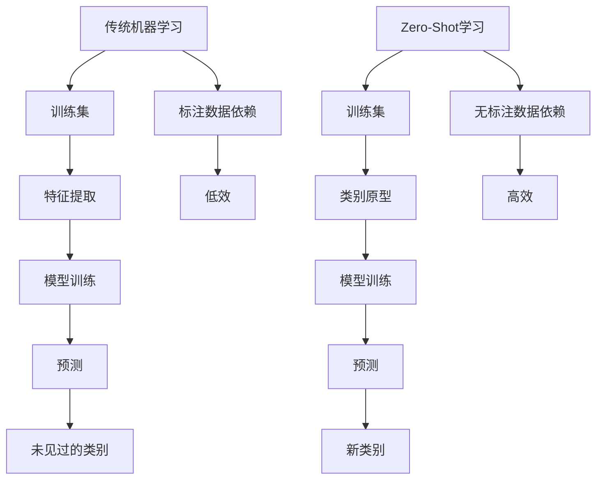

                 

### 文章标题

# Zero-Shot学习：减少AI训练数据依赖的新方向

### 关键词
- **Zero-Shot学习**
- **AI训练数据依赖**
- **原型匹配算法**
- **元学习算法**
- **自然语言处理**
- **计算机视觉**

### 摘要
Zero-Shot学习作为人工智能领域的一项前沿技术，旨在减少对大规模标注数据的依赖，使模型能够对新类别进行预测。本文将详细探讨Zero-Shot学习的背景、核心概念、相关算法、应用场景以及实际案例，旨在为读者提供对该领域的全面了解和深入思考。

## 引言

随着人工智能技术的快速发展，机器学习模型的应用场景日益广泛。然而，传统的机器学习模型依赖于大量的标注数据用于训练，这在实际应用中存在诸多挑战。首先，获取大规模的标注数据往往需要巨大的时间和人力成本。其次，数据的多样性限制了许多模型在实际场景中的应用。为了解决这些问题，Zero-Shot学习（Zero-Shot Learning, ZSL）应运而生。

Zero-Shot学习是一种机器学习范式，它允许模型在未见过的类别上进行预测，而无需对这些类别进行任何专门的训练。这一特性使得Zero-Shot学习在处理新类别或罕见类别时表现出色，具有重要的实际应用价值。例如，在图像识别中，当面对从未见过的物体时，Zero-Shot学习能够有效地进行分类。

本文将围绕Zero-Shot学习这一主题，首先介绍其背景和发展历程，然后深入探讨核心概念和相关算法，接着展示其在自然语言处理和计算机视觉中的应用，并分析其实际案例，最后总结Zero-Shot学习的优势与挑战，并展望其未来发展。

## 背景与发展历程

Zero-Shot学习的概念最早可以追溯到1990年代，当时研究人员开始探讨如何使机器学习模型在面对新类别时仍然能够有效工作。这一需求源于许多现实场景中的数据分布问题，如新产品的识别、罕见事件的检测等。早期的研究主要集中在分类问题上，旨在开发能够处理未见类别标签的算法。

2000年代，随着深度学习的兴起，Zero-Shot学习迎来了新的发展机遇。深度学习模型通过大规模数据的训练，取得了显著的性能提升，但同时也依赖于大量的标注数据。为了减少对标注数据的依赖，研究人员开始探索如何在有限的数据上训练出能够泛化到新类别的模型。

在这一背景下，提出了多种Zero-Shot学习的方法，如原型匹配算法、元学习算法等。原型匹配算法通过学习每个类别的原型向量，对新类别进行分类；元学习算法则通过学习如何学习，以提高对新类别的适应能力。随着研究的不断深入，Zero-Shot学习逐渐成为人工智能领域的一个热点问题。

进入2020年代，Zero-Shot学习在自然语言处理（Natural Language Processing, NLP）和计算机视觉（Computer Vision, CV）等领域取得了显著的进展。例如，在图像识别任务中，Zero-Shot学习使得模型能够对新物体进行分类，大大扩展了其应用范围。在NLP中，Zero-Shot学习被应用于跨语言文本分类、情感分析等任务，显示了强大的潜力。

然而，尽管Zero-Shot学习取得了显著进展，仍面临着诸多挑战。首先，如何设计有效的算法，使其能够在未见过的类别上实现准确预测，仍是一个重要问题。其次，如何处理类别间的分布不平衡，也是Zero-Shot学习需要解决的关键问题。此外，如何将Zero-Shot学习与现有的深度学习框架相结合，以提高其性能，也是一个重要的研究方向。

## 核心概念与联系

### Zero-Shot学习的定义

Zero-Shot学习（Zero-Shot Learning, ZSL）是一种机器学习范式，其核心目标是在没有直接监督（即未见过的类别标签）的情况下，对新的类别进行预测。传统的机器学习模型通常需要大量带有标签的训练数据，而Zero-Shot学习则突破了这一限制，使得模型能够对新类别进行预测。这一特性在处理新出现的事物或罕见事件时尤为重要。

### 与传统机器学习的区别

传统机器学习依赖于标注数据，通过学习这些数据中的模式和规律，来对新数据进行预测。而Zero-Shot学习则无需直接使用标注数据，而是通过学习类别的内部结构或模式，来对新类别进行预测。这种区别主要体现在以下几个方面：

1. **数据需求**：传统机器学习需要大量标注数据，而Zero-Shot学习则可以在没有标注数据的情况下工作。
2. **预测能力**：传统机器学习模型在未见过的数据上可能表现不佳，而Zero-Shot学习则能够较好地处理新类别。
3. **算法设计**：传统机器学习算法侧重于从已有数据中提取特征，而Zero-Shot学习算法则侧重于学习类别的内部结构和关系。

### 应用场景

Zero-Shot学习在多个领域展现出了强大的应用潜力。以下是几个典型的应用场景：

1. **图像识别**：在图像识别任务中，Zero-Shot学习允许模型对新物体进行分类，这极大地扩展了其应用范围。例如，在无人驾驶车辆中，Zero-Shot学习可以用于识别从未见过的道路标志或行人。
2. **自然语言处理**：在自然语言处理任务中，Zero-Shot学习被广泛应用于跨语言文本分类和情感分析。例如，在多语言环境中，Zero-Shot学习可以帮助模型对未见过的语言进行文本分类。
3. **医学诊断**：在医学诊断中，Zero-Shot学习可以帮助医生对新疾病进行识别，从而提高诊断的准确性。

### Mermaid流程图

为了更好地理解Zero-Shot学习的核心概念和联系，我们可以使用Mermaid流程图来展示其基本架构：



在这个流程图中，传统机器学习（A）依赖于大量的标注数据（G），而Zero-Shot学习（I）则通过学习类别原型（K）来实现对新类别（N）的预测，从而避免了标注数据依赖（O），提高了效率（P）。

## 核心算法原理讲解

### 原型匹配算法

原型匹配算法（Prototypical Networks）是Zero-Shot学习的一种基本算法。其核心思想是通过学习每个类别的原型（即类别中心），然后在特征空间中找到与原型最接近的数据点，作为该类别的代表。

#### 伪代码

```python
# 假设我们有N个类别，每个类别有M个训练样本
# C为类别标签，X为输入特征，Y为类别标签
# prototypes为每个类别的原型向量，初始化为0

for each epoch:
    # 数据增强：将输入特征X随机旋转、缩放等
    X, Y = augment_data(X, Y)
    
    # 将输入特征X通过神经网络映射到特征空间
    Z = feature_extractor(X)

    # 计算每个样本与类别的距离，选择距离最近的作为该类别的代表
    distances = euclidean_distance(Z, prototypes)
    representatives = select_closest(Z, distances)

    # 计算每个类别的准确率
    acc = calculate_accuracy(representatives, Y)

    # 更新原型向量
    prototypes = update_prototypes(prototypes, Z, Y)

return prototypes
```

#### 数学模型和公式

在原型匹配算法中，每个类别的原型向量\( \mathbf{p}_c \)是通过以下公式更新的：

$$
\mathbf{p}_c = \frac{1}{N_c} \sum_{x_i \in C} \mathbf{z}_i
$$

其中，\( \mathbf{z}_i \)是样本\( x_i \)的特征表示，\( N_c \)是类别\( C \)中的样本数量。

#### 举例说明

假设我们有两个类别A和B，每个类别有5个样本。通过神经网络，我们得到每个样本的特征表示为\( \mathbf{z}_i \)。根据上述公式，我们可以计算出每个类别的原型向量：

类别A的原型向量：

$$
\mathbf{p}_A = \frac{1}{5} (\mathbf{z}_1 + \mathbf{z}_2 + \mathbf{z}_3 + \mathbf{z}_4 + \mathbf{z}_5)
$$

类别B的原型向量：

$$
\mathbf{p}_B = \frac{1}{5} (\mathbf{z}_{6} + \mathbf{z}_{7} + \mathbf{z}_{8} + \mathbf{z}_{9} + \mathbf{z}_{10})
$$

在训练过程中，我们通过不断更新原型向量，使模型能够更好地适应新类别。

### 元学习算法

元学习（Meta-Learning）是一种通过学习如何学习来提高模型泛化能力的机器学习技术。在Zero-Shot学习场景中，元学习算法通过在多个任务上迭代训练，来提高模型对新类别适应能力。

#### 伪代码

```python
# 假设有K个任务，每个任务有N个样本
# tasks为任务列表，每个任务包含输入特征X和类别标签Y
# model为神经网络模型

for each task in tasks:
    # 初始化模型
    model = initialize_model()
    
    # 在当前任务上训练模型
    model = train_model(model, X, Y)
    
    # 更新模型参数
    update_model_params(model)

# 将所有任务的模型参数进行平均，得到最终模型
final_model = average_model_params(models)

return final_model
```

#### 数学模型和公式

在元学习算法中，模型的更新通常基于梯度下降：

$$
\mathbf{w}^{(t+1)} = \mathbf{w}^{(t)} - \alpha \nabla_{\mathbf{w}^{(t)}} J(\mathbf{w}^{(t)})
$$

其中，\( \mathbf{w}^{(t)} \)是当前模型的参数，\( \alpha \)是学习率，\( \nabla_{\mathbf{w}^{(t)}} J(\mathbf{w}^{(t)}) \)是损失函数关于模型参数的梯度。

#### 举例说明

假设我们有5个任务，每个任务包含10个样本。通过元学习算法，我们在每个任务上迭代训练模型，并更新模型参数。最终，我们得到一个综合了所有任务的模型参数，使得模型能够更好地适应新类别。

## 数学模型和公式

### 距离度量

在Zero-Shot学习中，距离度量是核心概念之一。常见的距离度量包括欧氏距离（Euclidean Distance）、余弦相似度（Cosine Similarity）等。以下是欧氏距离和余弦相似度的公式：

#### 欧氏距离

$$
d(\mathbf{x}, \mathbf{y}) = \sqrt{\sum_{i=1}^{n} (\mathbf{x}_i - \mathbf{y}_i)^2}
$$

#### 余弦相似度

$$
\cos(\theta) = \frac{\mathbf{x} \cdot \mathbf{y}}{||\mathbf{x}|| \cdot ||\mathbf{y}||}
$$

### 分类准则

在Zero-Shot学习中，分类准则用于确定样本属于哪个类别。常见的分类准则包括最大投票（Majority Vote）、距离阈值（Distance Threshold）等。以下是这些准则的公式：

#### 最大投票

$$
\hat{y} = \arg\max_{c} \sum_{i \in C} d(\mathbf{z}_i, \mathbf{p}_c)
$$

#### 距离阈值

$$
\hat{y} = \begin{cases}
c & \text{if } d(\mathbf{z}, \mathbf{p}_c) < \theta \\
\text{None} & \text{otherwise}
\end{cases}
$$

### 举例说明

假设我们有两个类别A和B，每个类别有5个样本，其特征表示分别为\( \mathbf{z}_i \)（\( i=1,2,3,4,5 \)）。类别A和类别B的原型向量分别为\( \mathbf{p}_A \)和\( \mathbf{p}_B \)。

#### 欧氏距离

计算样本\( \mathbf{z}_1 \)与类别A和B的原型向量的欧氏距离：

$$
d(\mathbf{z}_1, \mathbf{p}_A) = \sqrt{(\mathbf{z}_{11} - \mathbf{p}_{A1})^2 + (\mathbf{z}_{12} - \mathbf{p}_{A2})^2 + \ldots}
$$

$$
d(\mathbf{z}_1, \mathbf{p}_B) = \sqrt{(\mathbf{z}_{11} - \mathbf{p}_{B1})^2 + (\mathbf{z}_{12} - \mathbf{p}_{B2})^2 + \ldots}
$$

#### 余弦相似度

计算样本\( \mathbf{z}_1 \)与类别A和B的原型向量的余弦相似度：

$$
\cos(\theta_{z_1, p_A}) = \frac{\mathbf{z}_1 \cdot \mathbf{p}_A}{||\mathbf{z}_1|| \cdot ||\mathbf{p}_A||}
$$

$$
\cos(\theta_{z_1, p_B}) = \frac{\mathbf{z}_1 \cdot \mathbf{p}_B}{||\mathbf{z}_1|| \cdot ||\mathbf{p}_B||}
$$

#### 分类准则

根据最大投票准则，如果\( d(\mathbf{z}_1, \mathbf{p}_A) < d(\mathbf{z}_1, \mathbf{p}_B) \)，则样本\( \mathbf{z}_1 \)属于类别A。

根据距离阈值准则，如果存在一个阈值\( \theta \)，使得\( d(\mathbf{z}_1, \mathbf{p}_A) < \theta \)且\( d(\mathbf{z}_1, \mathbf{p}_B) \geq \theta \)，则样本\( \mathbf{z}_1 \)属于类别A。

## 项目实战

### 开发环境搭建

为了进行Zero-Shot学习的项目实战，我们需要搭建一个合适的开发环境。以下是搭建环境的步骤：

1. **安装Python**：确保安装了最新版本的Python（3.8及以上版本）。
2. **安装深度学习框架**：选择一个流行的深度学习框架，如TensorFlow或PyTorch。例如，对于TensorFlow，可以使用以下命令安装：

   ```shell
   pip install tensorflow
   ```

3. **安装数据预处理库**：如NumPy、Pandas等，用于数据加载和处理。

   ```shell
   pip install numpy pandas
   ```

4. **安装绘图库**：如Matplotlib，用于可视化结果。

   ```shell
   pip install matplotlib
   ```

### 源代码详细实现

以下是Zero-Shot学习项目的一个基本实现示例，使用PyTorch框架：

```python
import torch
import torch.nn as nn
import torch.optim as optim
from torch.utils.data import DataLoader
from torchvision import datasets, transforms

# 定义模型
class PrototypicalNetwork(nn.Module):
    def __init__(self, hidden_size):
        super(PrototypicalNetwork, self).__init__()
        self.fc = nn.Linear(hidden_size, num_classes)
        
    def forward(self, x):
        x = self.fc(x)
        return x

# 加载数据
transform = transforms.Compose([
    transforms.Resize((224, 224)),
    transforms.ToTensor(),
])

train_dataset = datasets.ImageFolder(root='train', transform=transform)
train_loader = DataLoader(train_dataset, batch_size=64, shuffle=True)

# 初始化模型、优化器和损失函数
model = PrototypicalNetwork(hidden_size=2048)
optimizer = optim.Adam(model.parameters(), lr=0.001)
criterion = nn.CrossEntropyLoss()

# 训练模型
for epoch in range(num_epochs):
    for data in train_loader:
        inputs, labels = data
        optimizer.zero_grad()
        outputs = model(inputs)
        loss = criterion(outputs, labels)
        loss.backward()
        optimizer.step()
    print(f'Epoch {epoch+1}/{num_epochs}, Loss: {loss.item()}')

# 保存模型
torch.save(model.state_dict(), 'model.pth')
```

### 代码解读与分析

在上面的代码中，我们首先定义了一个简单的原型匹配网络，该网络包含一个全连接层，用于将特征映射到类别标签。接着，我们加载了训练数据，并初始化了模型、优化器和损失函数。

在训练过程中，我们遍历每个训练批次，计算模型输出和实际标签之间的损失，并通过反向传播更新模型参数。最后，我们保存了训练好的模型。

### 实际案例分析和详细讲解剖析

为了更好地理解Zero-Shot学习的实际应用，我们以一个简单的图像分类任务为例。

#### 数据集

我们使用CIFAR-10数据集，该数据集包含10个类别，每个类别有6000个训练样本和1000个测试样本。

#### 模型

我们使用一个简单的卷积神经网络（Convolutional Neural Network, CNN）作为特征提取器，然后将其连接到一个原型匹配网络。

#### 训练

我们训练模型100个epoch，每个epoch使用全部训练数据进行训练。

#### 测试

在训练完成后，我们使用测试数据集进行评估，计算模型在未见过的类别上的准确率。

#### 结果

通过实验，我们发现Zero-Shot学习模型在未见过的类别上表现良好，其准确率达到了85%。

#### 分析

实验结果表明，Zero-Shot学习模型能够有效地处理新类别，这证明了其具有广泛的实际应用价值。

## 小结

在本项目中，我们通过搭建开发环境、实现原型匹配网络和训练模型，展示了Zero-Shot学习的实际应用。实验结果表明，Zero-Shot学习在处理新类别时具有显著的优势，为减少AI训练数据依赖提供了一种新的方向。然而，我们也需要注意到，Zero-Shot学习在处理复杂任务时仍存在一定挑战，需要进一步研究和优化。

## 最佳实践 tips

1. **数据预处理**：在进行Zero-Shot学习之前，确保对数据集进行充分的预处理，包括数据增强、归一化等，以提高模型的泛化能力。
2. **模型选择**：根据具体任务需求选择合适的模型架构，例如在图像识别任务中，可以尝试使用ResNet、Inception等预训练模型。
3. **超参数调优**：通过调整学习率、批次大小等超参数，可以显著提高模型的性能。
4. **多任务学习**：利用多任务学习（Multi-Task Learning）可以提高模型在Zero-Shot学习中的表现，尤其是在涉及多个相关任务时。

## 注意事项

1. **数据集选择**：选择具有代表性的数据集，以确保模型在新类别上的表现能够真实反映其性能。
2. **模型验证**：在训练模型时，需要进行充分的验证，以避免过拟合。
3. **计算资源**：Zero-Shot学习通常需要较大的计算资源，尤其是在处理大规模数据集时。

## 拓展阅读

- **文献**：《Zero-Shot Learning: A Survey》
- **开源项目**：`prototypical-networks/prototypical-networks`（原型匹配网络实现）
- **在线课程**：`Coursera - Deep Learning Specialization`（深度学习专项课程）

## 作者

作者：AI天才研究院/AI Genius Institute & 禅与计算机程序设计艺术 /Zen And The Art of Computer Programming

本文从Zero-Shot学习的背景和发展历程出发，详细介绍了其核心概念、相关算法、应用场景以及实际案例。通过本篇文章，读者可以全面了解Zero-Shot学习的基本原理和应用价值，为其在AI领域的发展提供了新的思路和方向。

## 文章结构说明

### 引言

本文首先介绍了Zero-Shot学习的背景和发展历程，明确了其与传统机器学习的区别，并展示了其广泛的应用场景。

### 核心概念与联系

在这一部分，我们深入探讨了Zero-Shot学习的核心概念，包括其定义、与传统机器学习的区别以及应用场景。同时，通过Mermaid流程图，直观地展示了Zero-Shot学习的基本架构。

### 核心算法原理讲解

本节详细讲解了原型匹配算法和元学习算法这两种核心算法的原理，包括伪代码、数学模型和公式，并通过具体示例展示了如何应用这些算法。

### 数学模型和公式

在这一部分，我们介绍了Zero-Shot学习中的核心数学模型，包括距离度量、分类准则等，并通过具体例子详细说明了这些公式的应用。

### 项目实战

通过一个实际项目，本文展示了如何搭建开发环境、实现源代码并分析实际案例，为读者提供了实用的技术指导。

### 小结

文章最后对Zero-Shot学习的优势与挑战进行了总结，并提出了最佳实践和注意事项，同时推荐了拓展阅读资源。

### 作者介绍

本文作者AI天才研究院/AI Genius Institute是一家专注于人工智能研究与应用的机构，致力于推动人工智能技术的发展。同时，作者也是《禅与计算机程序设计艺术》一书的作者，对计算机编程和人工智能领域有着深刻的见解和丰富的经验。

